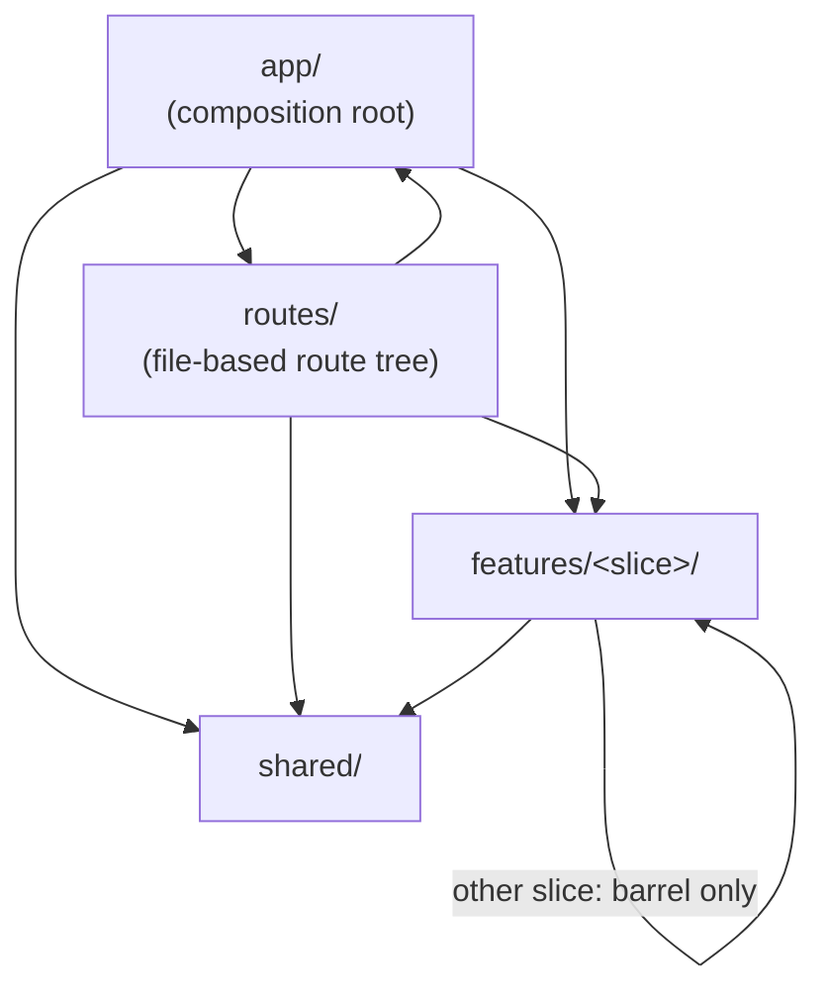
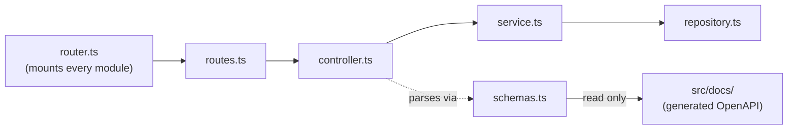

# Architecture

The full model referenced from the root `CLAUDE.md`, `AGENTS.md`, `apps/dashboard/src/features/README.md`
and `docs/CONVENTIONS.md`. This file describes the shape of the two apps and the rules that keep
imports pointed the right way; it does not repeat the placement checklist, the string-coupling
contract, or any of the other convention detail already written down in `docs/CONVENTIONS.md` — see
that file for those.

## `apps/dashboard/`: three layers

```
apps/dashboard/src/
├── app/         composition root — routing shell, layout, session wiring
├── routes/      file-based route tree (TanStack Router); routeTree.gen.ts is generated
├── features/    nine domain slices
│   ├── auth/
│   ├── pos/
│   ├── inventory/
│   ├── sales/
│   ├── customers/
│   ├── purchasing/
│   ├── fulfillment/
│   ├── analytics/
│   └── admin/
└── shared/      cross-cutting, feature-agnostic code
```

Each slice may contain `pages/`, `components/`, `hooks/`, `store/`, `types.ts` and an `index.ts`
barrel — see `apps/dashboard/src/features/README.md` for the intra-slice shape and
`docs/CONVENTIONS.md` for the R5 placement checklist that decides which of the three layers a new
file belongs in.

### Dependency rules

These are not just convention — `apps/dashboard/eslint.config.mjs`'s `boundaries/element-types`
enforces every one of them as a build-breaking `error` (R7/R8/R16), matched against `app`, `routes`,
`feature` (captures the slice) and `shared`:

```
app      -> feature, shared, routes
routes   -> feature (barrel only), shared, app, routes
feature  -> shared, its own slice (any depth), other features only at their barrel
shared   -> shared only
```



The two things this diagram is actually enforcing:

- **`shared` never imports `app` or `feature`.** It is feature-agnostic by construction, not by
  convention — a `shared` file that reached into a slice would make that slice un-removable.
- **A slice reaches another slice only through its `index.ts` barrel** (`@/features/other-slice`),
  never a deep path (`@/features/other-slice/pages/...`). The barrel is the slice's whole public
  surface; internals move freely as long as the barrel's exports don't.

## `apps/server/`: modules grouped by domain

```
apps/server/src/modules/
├── core/           auth, users, settings, auditLog, branches
├── inventory/      products, categories, collections, distributors, stockAdjustments,
│                   stockCounts, labelTemplates, bundles
├── commerce/       customers, coupons, giftCards, storeCredit, segments, feedback,
│                   onlineOrders, storefront, warranty
├── pos/            sales, register, shifts, exchanges, reservations
├── fulfillment/    delivery, shippingCompanies, purchaseOrders, expenses
└── intelligence/   analytics, reports, exports, notifications
```

Each module is a `routes` / `controller` / `service` / `repository` / `types` / `schemas` set.
`src/router.ts` mounts every module's router and is the only authority on what the server actually
serves — the CI gates (`check:api-docs`, request-contract coverage) walk it directly rather than
trusting a hand-maintained list, because a hand-maintained list is exactly what drifted from the
real router before (`docs/plans` and `apps/server/CLAUDE.md` have the history).

### Dependency rules

- **Request contracts run one direction: modules → docs, never back.** A module's `schemas.ts`
  declares the `RequestContract`s the docs layer reads to generate the published spec; `schemas.ts`
  may not import a service, repository or database, because doc generation runs in CI with no
  database connection.
- **A service never recovers a status from a message string.** It throws a typed `PublicError`
  with one of the seven public codes; the controller passes it to `next` unchanged. See *Error
  contracts* in `apps/server/CLAUDE.md`.
- **A mutation never writes a quantity or balance it read earlier in the same request** — the
  read-then-write gap is the next oversell. See *Concurrency and idempotency* in
  `docs/CONVENTIONS.md` for the guarded-write pattern and the per-path lock ordering.



## Where the detail lives

- **Placement of a new file** (R5 checklist), the global string-coupling contract, and slice
  split/merge criteria: `docs/CONVENTIONS.md`.
- **API contract mechanics** (request contracts, the two CI drift gates, the endpoint manifest):
  `apps/server/CLAUDE.md` → *The API contract: one description, two gates*.
- **Concurrency, idempotency, and the per-path lock order**: `docs/CONVENTIONS.md` → *Concurrency
  and idempotency (server)*.
- **CI gates and the two standing ratchets**: root `CLAUDE.md` → *CI gates*.
