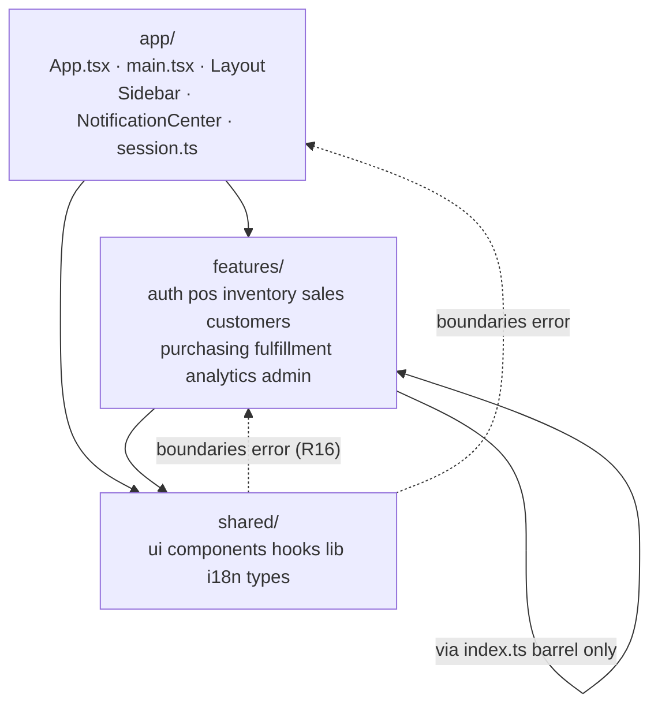

# Architecture

> This document was rewritten for the feature-slice refactor (2026-08-20-001). The previous version
> (pre-slice, technical-kind-at-root layout) is recoverable at `76a7ab0^` in git history if historical
> context is needed. The tables below describe the client's current three-layer structure. The server
> is unchanged by that refactor; its section here is carried forward from the prior version.

## Monorepo Structure

```
moon-store/
├── client/                    # React 18 + Vite SPA (TypeScript)
│   └── src/
│       ├── app/                # Composition root — see "Layer model" below
│       │   ├── App.tsx           # RouteConfig[] table + <Routes>
│       │   ├── main.tsx          # Entry: providers, session.ts side effect, Toaster
│       │   ├── session.ts        # Installs the auth port + logout-teardown subscriber
│       │   ├── Layout.tsx        # Sidebar + main content wrapper + offline banner
│       │   ├── Sidebar.tsx       # navItems[] (role-filtered) + language/theme toggles
│       │   ├── NotificationCenter.tsx
│       │   └── index.css         # Tailwind + CSS variables (light/dark)
│       ├── features/           # Nine domain slices — see "The nine slices" below
│       │   └── <slice>/
│       │       ├── pages/        # route-level components
│       │       ├── components/   # slice-local components
│       │       ├── hooks/
│       │       ├── store/
│       │       ├── types.ts
│       │       └── index.ts      # the slice's curated public barrel (R6/R7)
│       └── shared/             # Cross-cutting, feature-agnostic code
│           ├── ui/               # shadcn/ui primitives (Button, Dialog, Sheet, etc.)
│           ├── components/       # ErrorBoundary, PWAInstallPrompt, DataTable, BarcodeScanner, ...
│           ├── hooks/             # useOffline, useScanner, usePosShortcuts, useDebouncedValue
│           ├── lib/               # utils.ts, queryClient.ts, resource.ts, apiQuery.ts,
│           │                       #   storageKeys.ts, session.ts, transport/
│           ├── store/             # offlineStore, settingsStore (cross-slice stores; see below)
│           ├── i18n/              # AR/EN translations + useTranslation hook
│           ├── types/             # cross-slice server contracts only (see "shared/types/")
│           ├── assets/            # SVG logo, static images
│           └── tests/             # Vitest setup.ts
├── server/                    # Node.js + Express API (TypeScript) — unchanged by this refactor
│   ├── routes/                # route files
│   ├── middleware/            # auth.ts, errorHandler.ts, auditLogger.ts
│   ├── services/               # twilio.ts, notifications.ts
│   ├── validators/            # Zod schema files
│   ├── db/
│   │   ├── migrations/         # SQL migration files
│   │   ├── index.ts            # DB connection + pg-compat query wrapper
│   │   ├── migrate.ts          # Migration runner
│   │   ├── seed.ts             # Sample data seeder
│   │   └── moon.db             # SQLite database file
│   ├── uploads/                # Product images (served at /uploads)
│   └── index.ts               # Express app setup
├── CLAUDE.md                  # AI assistant instructions (Quick Start, Key Patterns)
└── docs/                      # This documentation
```

---

## Layer model

Three layers, enforced at lint time by `eslint-plugin-boundaries` (`client/eslint.config.mjs`) and
checked for cycles by `madge --circular` (`npm run lint:cycles`):



**Dependency rules:**

- `app/` may import `features/*` and `shared/`. It is the only layer allowed to import from more than
  one slice directly (it composes them).
- `features/<slice>/` may import: its own internals freely; anything from `shared/`; and other slices
  **only through their `index.ts` barrel** (`import { X } from '@/features/other-slice'`, never a deep
  path like `@/features/other-slice/pages/Y`).
- `shared/` may import only from `shared/`. It must never import from `features/` or `app/` — this is
  R16, and a violation here is what previously trapped `shared/lib/transport/client.ts` into reaching
  up into `features/auth`'s `authStore` (see "The auth-port inversion" below).

A slice-internal (same-slice) import never needs the barrel — the barrel restriction applies only to
*other* slices and to `app/`.

---

## The nine slices

| Slice | Owns | Public barrel exports (`features/<slice>/index.ts`) |
|---|---|---|
| `auth` | Login, session/auth store, route guard | `useAuthStore`, `ProtectedRoute`, `Login` |
| `pos` | Point of sale, register, shifts, cart, held carts | `POS`, `Register`, `Shifts`, `CustomerDisplay`, `StartupPrompt`, `useCartStore`, `useHeldCartsStore` |
| `inventory` | Products, stock, categories, bundles, pricing | `Inventory`, `Categories`, `StockCount`, `Bundles`, `SmartPricing` |
| `sales` | Sales history, promotions, gift cards, layaway | `SalesHistory`, `Promotions`, `GiftCards`, `Layaway` |
| `customers` | Customer records, feedback, segments | `Customers`, `Feedback`, `Segments` |
| `purchasing` | Distributors, vendors, expenses, purchase orders | `Distributors`, `Expenses`, `PurchaseOrders`, `Vendors` |
| `fulfillment` | Deliveries, online orders, storefront | `Deliveries`, `OnlineOrders`, `Storefront` |
| `analytics` | Dashboard, reports, exports, AI insights | `Dashboard`, `Exports`, `ReportBuilder`, `AiInsights`, `AdvancedAnalytics` |
| `admin` | Users, settings, audit log, backup, branches | `Users`, `Settings`, `AuditLog`, `Backup`, `Branches` |

Two barrels also export store hooks alongside components, because a cross-slice consumer needs them
(store hooks are not components, but there is no separate convention for them yet):

- `features/auth/index.ts` exports `useAuthStore` — consumed by `app/` (session wiring, route guard,
  Layout/Sidebar) and by `pos`, `inventory`, `fulfillment`, `admin` (see the cross-slice edge table
  below).
- `features/pos/index.ts` exports `useCartStore` and `useHeldCartsStore` — consumed by
  `app/session.ts`'s logout-teardown subscriber (clears the cart and held carts on logout without
  `pos` needing to know `app/` exists).

Two pages exist but are deliberately **not** exported from their slice's barrel because they are
unrouted dead code carried over from before the refactor (see Scope Boundaries in the refactor plan):
`features/inventory/pages/Collections.tsx` and `features/customers/pages/Warranty.tsx`.

`features/inventory/index.ts` also documents one barrel exception: `BarcodeGenerator` is consumed by
`features/pos/pages/BarcodeTools.tsx` via a **deep import**, not the barrel — re-exporting it from the
barrel previously pulled `BarcodeGenerator` (and its `jsbarcode` dependency) into the eager entry
bundle, because `App.tsx`'s eager `import { Inventory } from '../features/inventory'` makes the whole
barrel module part of the eager module graph. Likewise `features/pos/index.ts` does not re-export
`BarcodeTools` itself — `App.tsx` reaches it via `lazy(() => import('../features/pos/pages/
BarcodeTools'))`, the same pattern used for every other lazy route.

### Cross-slice edges (the only `features/ → features/` imports)

| Edge | Consumer | Barrel symbol |
|---|---|---|
| `pos → auth` | `StartupPrompt.tsx`, `Shifts.tsx` | `useAuthStore` |
| `inventory → auth` | `Inventory.tsx` | `useAuthStore` |
| `fulfillment → auth` | `Deliveries.tsx` | `useAuthStore` |
| `admin → auth` | `Users.tsx` | `useAuthStore` |
| `pos → inventory` | `BarcodeTools.tsx` | `BarcodeGenerator` (deep import, documented exception above) |

`analytics` imports nothing from any other slice — only `shared/`. There is no `auth → pos` edge
anymore: the old direct call from `authStore.logout()` into `cartStore`/`offlineStore` was inverted
into an event (`emitSessionEvent('logout')`), subscribed to from `app/session.ts` — see below.

---

## The `app/` composition root

`app/` exists as a third layer (not folded into `shared/` or `features/auth/`) because the app shell
legitimately composes multiple features: `Layout` renders `StartupPrompt` (a `pos` artifact) and reads
`useAuthStore` (an `auth` artifact). Forcing the shell into `shared/` would make R16 (`shared/` imports
nothing from `features/`) unsatisfiable; forcing it into `features/auth/` would make every slice's page
render through an auth-owned component.

`app/session.ts` is imported by `main.tsx` for its side effects only, before `createRoot`, and does two
things at startup:

1. **Installs the real auth port.** `shared/lib/transport/client.ts` (the axios instance + request/
   response interceptors) never imports `useAuthStore` directly — it calls an injected port
   (`getAccessToken`, `onTokenRefreshed`, `onAuthFailure`) with an inert default. `app/session.ts` wires
   the real implementation (`useAuthStore.getState().accessToken`, `.login(...)`, `.logout()` +
   redirect to `/login`) at startup. This keeps `shared/lib/transport/` R16-clean while preserving the
   original interceptor behavior.
2. **Subscribes to the logout event.** `features/auth/store/authStore.ts`'s `logout()` clears its own
   state and calls `emitSessionEvent('logout')` (a tiny dependency-free emitter in
   `shared/lib/session.ts`) instead of reaching directly into `queryClient`, `offlineStore`, and
   `cartStore`. `app/session.ts` subscribes eagerly and performs the actual teardown
   (`queryClient.clear()`, `useOfflineStore.getState().clearQueue()`,
   `useCartStore.getState().clearCart()`). This subscription must be wired eagerly, not inside a
   lazy-loaded module: `cartStore` is persisted (`moon-cart-recovery`), so if the subscriber only ran
   after the `pos` chunk loaded, a logout from a page that never loaded `pos` would silently skip the
   cart clear. `POS` is already one of `App.tsx`'s four eager imports, so wiring this in `app/` costs no
   additional bundle weight versus the pre-refactor behavior.

---

## `shared/types/`

`shared/types/` holds only the types imported by **two or more** slices (the cross-slice server
contracts). Every other type lives in the one slice that owns it (`features/<slice>/types.ts`), and is
exported from that slice's barrel if another slice needs it. This was determined by an import-graph
pass during the refactor, not by judgment call.

---

## Frontend Stack

| Concern | Library |
|---------|---------|
| Framework | React 18 + Vite 5 |
| Language | TypeScript |
| Routing | React Router v6 |
| State (local) | Zustand 5 (persist middleware) |
| State (server) | TanStack React Query v5 |
| Tables | TanStack React Table v8 |
| Forms | React Hook Form + Zod |
| UI primitives | Radix UI (via shadcn/ui) |
| Styling | Tailwind CSS + CSS variables |
| Charts | Recharts |
| Barcode scan | @ericblade/quagga2 |
| Barcode gen | jsbarcode |
| PDF export | jspdf + html2canvas |
| Date picker | react-day-picker |
| Command palette | cmdk |
| IndexedDB | idb |
| HTTP | Axios (never imported directly by feature code — see `shared/lib/transport/`) |
| PWA | vite-plugin-pwa (Workbox) |
| Icons | lucide-react |
| Toasts | react-hot-toast |
| Circular-import detection | madge (`npm run lint:cycles`) |
| Boundary enforcement | eslint-plugin-boundaries + eslint-import-resolver-typescript |

## Backend Stack

| Concern | Library |
|---------|---------|
| Framework | Express |
| Language | TypeScript (tsx runner) |
| Database | SQLite via better-sqlite3 (WAL) |
| Auth | jsonwebtoken (JWT) |
| Password | bcrypt |
| Validation | Zod |
| File upload | multer |
| SMS/WhatsApp | Twilio SDK |
| Security | helmet, cors, express-rate-limit |
| Testing | Vitest |

---

## Zustand Stores

| Store | Slice/Layer | Key State | Persisted |
|-------|------|-----------|-----------|
| `authStore` | `features/auth/store/` | `user`, `accessToken`, `isAuthenticated` | Yes (`moon-auth`) |
| `cartStore` | `features/pos/store/` | `items[]`, `discount`, `discountType`, `notes`, `tip`, `couponCode` | Yes (`moon-cart-recovery`, auto-clears after 8h) |
| `heldCartsStore` | `features/pos/store/` | `carts[]` (suspended transactions) | Yes (`moon-held-carts`) |
| `offlineStore` | `shared/store/` | `queue[]`, `isSyncing` | Yes (`moon-offline-queue`) |
| `settingsStore` | `shared/store/` | `locale` (ar/en), `theme` (light/dark) | Yes (`moon-settings`) |

`offlineStore` and `settingsStore` live in `shared/` (not a slice) because they are read by two or more
slices plus `app/`, per the R5 placement checklist in `docs/CONVENTIONS.md`. `authStore`, `cartStore`
and `heldCartsStore` live in their owning slice and are exported from that slice's barrel where a
cross-slice consumer needs them (see "The nine slices" above).

The five persist-key literals (`moon-auth`, `moon-cart-recovery`, `moon-held-carts`,
`moon-offline-queue`, `moon-settings`) are centralized in `shared/lib/storageKeys.ts` — see
`docs/CONVENTIONS.md`'s "Global string-coupling contract" for why they are not namespaced.

`settingsStore.hydrate()` is called on app boot to sync `<html>` lang, dir, and class attributes.

---

## Pages & Access Control

`app/App.tsx` holds a single `RouteConfig[]` table of 33 entries (role-gated, rendered inside
`<ProtectedRoute>` + `<Layout>`), plus four routes declared outside the table: `/login`,
`/customer-display` (public, no auth), `/locations` (redirect to `/branches`), and the catch-all `*`
(redirect to the user's role-appropriate default). Of the 33 table entries, 3 use eagerly-imported
components (`Dashboard`, `POS`, `Inventory`) and 30 use `lazy()`; `Login` (used outside the table) is
the fourth eager import, and `CustomerDisplay` (used outside the table) is the 31st `lazy()` call —
giving the whole file 4 eager imports and 31 `lazy()` declarations total. This is unchanged from before
the refactor (R12: not restructuring routing) — only the import paths changed, from `../pages/X` to
`../features/<slice>/pages/X`.

### Default Route by Role

| Role | Redirects To |
|------|-------------|
| Admin | `/` (Dashboard) |
| Cashier | `/pos` |
| Delivery | `/deliveries` |

---

## Key `app/` Components

| Component | File | Purpose |
|-----------|------|---------|
| `Layout` | `app/Layout.tsx` | Sidebar + main content wrapper + offline banner |
| `Sidebar` | `app/Sidebar.tsx` | Navigation (role-filtered `navItems[]`) + language/theme toggles + logout |
| `NotificationCenter` | `app/NotificationCenter.tsx` | In-app notification dropdown |

## Key `shared/` Components

| Component | File | Purpose |
|-----------|------|---------|
| `ErrorBoundary` | `shared/components/ErrorBoundary.tsx` | React error boundary (class component; uses standalone `t()`) |
| `PWAInstallPrompt` | `shared/components/PWAInstallPrompt.tsx` | PWA install banner (shown after 30s on first visit) |
| `DataTable` | `shared/components/DataTable.tsx` | Reusable table with sort/search/pagination (TanStack Table) |
| `BarcodeScanner` | `shared/components/BarcodeScanner.tsx` | Camera-based barcode reader (Quagga2); shared by `pos` and `inventory` |
| `Receipt`/`ReceiptDialog` | `shared/components/` | Shared by `pos` (CartPanel) and `sales` (SalesHistory) |

### Custom Hooks (`shared/hooks/`)

| Hook | Purpose |
|------|---------|
| `useOffline` | Detects online/offline status, auto-syncs queued sales when back online |
| `useScanner` | Manages Quagga2 barcode scanner lifecycle (start/stop, cooldown, camera config) |
| `usePosShortcuts` | POS keyboard shortcuts (F1=search, F2=scanner, F3=checkout, F4=clear, F5=hold, +/-/Delete for cart) |
| `useDebouncedValue` | Generic debounce hook for search inputs |

### Chart Components (`features/analytics/components/charts/`)

Sub-grouped under `components/charts/` because `analytics` has ≥8 component files (the documented
exception to the flat `components/` shape — see `docs/CONVENTIONS.md`).

All charts read theme state from Zustand to switch colors between light/dark mode (Recharts cannot
consume CSS variables).

### Sidebar Navigation Groups

The sidebar organizes `navItems[]` into logical groups. Route paths here are declared independently of
`app/App.tsx`'s `routes[]` table — see `docs/CONVENTIONS.md`'s "Global string-coupling contract" for
why this duplication is intentional and out of scope for this refactor.

---

## i18n System

- Custom lightweight implementation (no i18next), living in `shared/i18n/`
- `useTranslation()` hook returns `{ t, locale, isRtl }`
- Standalone `t(key, params)` function for class components and Zod schemas
- `{param}` interpolation syntax in translation strings
- Translation files: `shared/i18n/en.json` and `ar.json` (~180 keys each; global, not per-slice — see
  `docs/CONVENTIONS.md`)
- **Default**: Arabic (RTL) + Light mode

---

## Theming

- CSS variables defined in `app/index.css`
  - `:root` = light theme
  - `.dark` = dark theme overrides
- Tailwind colors reference `hsl(var(--...))` variables
- Theme toggle in `app/Sidebar.tsx` updates `settingsStore` (`shared/store/`) which sets `.dark` class
  on `<html>`
- Charts use Zustand theme state with ternaries (Recharts cannot consume CSS variables)
- Fonts: Playfair Display (display/titles), DM Sans (body + data), IBM Plex Sans Arabic (Arabic)

---

## RTL Support

- Uses Tailwind CSS logical properties: `ms-`, `me-`, `ps-`, `pe-`, `start-`, `end-`, `text-start`, `text-end`
- `dir="rtl"` set on `<html>` element by `settingsStore.hydrate()`
- Sheet/Dialog components use logical positioning
- CartPanel checkout sheet: `side={isRtl ? 'left' : 'right'}`

---

## PWA & Offline

- Service worker via `vite-plugin-pwa` (Workbox)
- Caching strategies:
  - Products API: `StaleWhileRevalidate` (24h)
  - Sales API: `NetworkFirst` (1h)
- Offline sales queued in `offlineStore` (`shared/store/`, persisted via Zustand) → auto-sync when
  connectivity returns
- Install prompt shown after 30s on first visit via `PWAInstallPrompt` (`shared/components/`)
- `client/vite.config.ts` sets `workbox.maximumFileSizeToCacheInBytes: 3 * 1024 * 1024` — a chunk over
  3 MB is silently dropped from the precache manifest (green build, green lint, broken offline shell).
  This is why bundle parity is verified as part of the CI-equivalent gates, not assumed from a passing
  build.

---

## Server Architecture

### Request Lifecycle

```
Request → helmet → cors → rate-limit → json parser → cookie parser
        → route middleware (verifyToken → requireRole)
        → route handler
        → errorHandler (catch-all)
```

### Auth Middleware Chain

```typescript
// Public route — no middleware
router.get('/public-data', handler);

// Authenticated route — any logged-in user
router.get('/profile', verifyToken, handler);

// Role-restricted route — Admin only
router.post('/create', verifyToken, requireRole('Admin'), handler);

// Multi-role route
router.get('/data', verifyToken, requireRole('Admin', 'Cashier'), handler);
```

### Database Layer

- `db.query(sql, params)` — async pg-compatible wrapper; returns `{ rows }`
- Converts `$1, $2` placeholders to `?` for SQLite
- Handles `SELECT`, write ops, and `RETURNING` clauses
- `db.db` — raw `better-sqlite3` instance for transactions
- `db.pool.connect()` — mock pool client for pg-compatible code

### Services

| Service | File | Purpose |
|---------|------|---------|
| Twilio | `services/twilio.ts` | SMS and WhatsApp messaging (optional; logs skip if unconfigured) |
| Notifications | `services/notifications.ts` | In-app notification creation; broadcasts to Admin users; low-stock, sale, and delivery alerts |
| Audit Logger | `middleware/auditLogger.ts` | `logAudit()` / `logAuditFromReq()` — records user actions to `audit_log` table (silently catches errors) |

### Background Tasks

- **Reservation cleanup**: Expired stock reservations cleaned every 5 minutes (`setInterval`)
- **Process error handlers**: `uncaughtException` and `unhandledRejection` logged but don't crash the server

### Static Files

- Product images served from `/uploads` directory via `express.static`
- JSON body limit: 10MB (`express.json({ limit: '10mb' })`)
