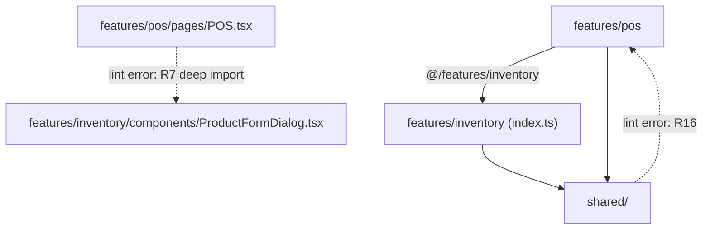

# Client Feature-Slice Architecture

## Problem Frame

The client is organized by *technical kind* (`pages/`, `components/`, `hooks/`, `store/`, `types/`), so a single
business feature is scattered across four or five sibling directories. POS, for example, lives in
`client/src/pages/POS.tsx`, `client/src/components/CartPanel.tsx` (1169 lines), `client/src/components/pos/`,
`client/src/hooks/usePosData.ts`, `client/src/store/cartStore.ts`, and a slice of `client/src/types/index.ts`.

Consequences today:

- **Finding code is slow.** Understanding one feature means opening five directories.
- **Placing new code is undetermined.** Nothing says where a new file belongs, so it lands wherever. The
  half-populated `client/src/components/pos/` (one file, while the real POS core sits at the top level) is the
  visible result of that erosion.
- **Erosion is unchecked.** The existing feature subfolders were a correct instinct with no enforcement behind it.

Scale: 143 source files (123 excluding `components/ui/`), ~24.6k LOC excluding `components/ui/`, 37 page
components, 33 registered routes, 12 test files.

The primary beneficiary is the maintainer (and AI agents working in the repo), where "where does this go?" is
asked many times per session.

## Architecture

Illustrative, not normative — the exact intra-slice shape is deferred to planning (see Outstanding Questions):

```
src/
  features/
    auth/           pages/ store/ components/ types.ts index.ts
    pos/            pages/ components/ hooks/ store/ types.ts index.ts
    inventory/      sales/  customers/  purchasing/
    fulfillment/    analytics/  admin/
  shared/           ui/ components/ hooks/ lib/ i18n/ types/ tests/
  App.tsx  main.tsx  index.css
```

Cross-slice access is permitted only through public barrels:



## Requirements

**Slice Layout**

- R1. Client code is organized into nine slices under `client/src/features/`: `auth`, `pos`, `inventory`,
  `sales`, `customers`, `purchasing`, `fulfillment`, `analytics`, `admin`.
- R2. Each slice owns every artifact for its domain — pages, components, hooks, stores, and types — in
  subfolders of that slice. A slice's internal subfolder layout follows a single documented shape so slices
  are mutually predictable.
- R3. The 37 existing pages map to slices as follows:

  | Slice | Pages |
  |---|---|
  | `auth` | Login |
  | `pos` | POS, Register, Shifts, CustomerDisplay |
  | `inventory` | Inventory, Categories, StockCount, Bundles, Collections, SmartPricing, BarcodeTools |
  | `sales` | SalesHistory, Layaway, GiftCards, Promotions |
  | `customers` | Customers, Segments, Feedback, Warranty |
  | `purchasing` | PurchaseOrders, Vendors, Distributors, Expenses |
  | `fulfillment` | Deliveries, OnlineOrders, Storefront |
  | `analytics` | Dashboard, AdvancedAnalytics, AiInsights, ReportBuilder, Exports |
  | `admin` | Users, Settings, Branches, AuditLog, Backup |

- R4. Code with no single owning domain lives under `client/src/shared/`: shadcn primitives, `DataTable`,
  `Layout`, `Sidebar`, `ErrorBoundary`, `EmptyState`, `StatusBadge`, the transport seam, `resource`,
  `apiQuery`, `editorDialog`, `utils`, `queryClient`, `exportUtils`, i18n, `settingsStore`, `offlineStore`
  + `useOffline`, `useDebouncedValue`, plus the non-module files `main.tsx`, `index.css`, `assets/`, and
  `tests/setup.ts` (the last is pinned by `vitest.config.ts` and must keep a resolvable path).
- R5. **Placement rule (the decision procedure R1–R4 exist to make executable).** A file used by two or more
  slices goes to `shared/`. A file used by exactly one slice goes to that slice. This is mechanical and
  requires no judgment about which domain "really" owns a thing — deliberately so, because judgment is what
  produced the current ambiguity. Applying it to the contested set verified in source:

  | Artifact | Used by | Home |
  |---|---|---|
  | `BarcodeScanner` | pos (POS), inventory (BarcodeTools) | `shared/` |
  | `Receipt`, `ReceiptDialog` | pos (CartPanel), sales (SalesHistory) | `shared/` |
  | `CustomerDetail` | pos, customers, admin | `shared/` |
  | `offlineStore`, `useOffline` | pos (CartPanel), shared (Layout) | `shared/` |
  | `charts/` | analytics, pos (Register report) | `shared/` |
  | `cartStore` | pos, inventory (BarcodeTools) | see R5a |

- R5a. `BarcodeTools` imports `useCartStore` (`pages/BarcodeTools.tsx:14`), which under R5 would push the
  cart store — the most mutable state in the app — into `shared/`. It moves to the `pos` slice instead, as a
  POS-adjacent scanning surface that writes to the cart; `inventory` keeps label generation. This is the one
  documented override of R5, and it exists because a store is a worse thing to share than a page is to
  reassign.
- R5b. Tests stay colocated beside the unit under test, as they already are.

**Boundaries and Enforcement**

- R6. Each slice exposes a curated public barrel (`index.ts`). Only symbols intended for cross-slice use are
  exported from it.
- R7. A slice may import another slice only through that public barrel. Importing a path *inside* another
  slice is prohibited.
- R8. R7 is enforced by `eslint-plugin-boundaries` (plus `eslint-import-resolver-typescript`, required for
  `@/` to resolve), failing the existing `npm run lint`. A resolver-backed plugin is chosen over the flat
  `no-restricted-imports` precedent from #29 because it matches *resolved* modules rather than specifier
  strings — so it cannot be bypassed by writing the deep import relatively, and it does not need one
  hand-maintained config block per slice. This adds devDependencies, which Scope Boundaries permits.
- R9. All intra-`src` imports use the `@/` path alias. Relative imports may not escape the current *slice*
  (intra-slice `../components/X` stays legal; `../../inventory/...` does not). (Today: 564 relative vs 73
  aliased.) R9 is a precondition for R8: `no-restricted-imports` matches the specifier string, not the
  resolved module, so a deep cross-slice import written relatively bypasses R8 until R9 is fully in force.

- R16. `shared/` may never import from `features/`. Enforced by the same mechanism as R8.
  This is not hypothetical and it is the highest-risk item in the change: `store/authStore.ts` imports
  `useCartStore` and `useOfflineStore` (logout clears cart and queue), and `lib/transport/client.ts` imports
  `authStore`. With `authStore` in `features/auth/` and the transport seam in `shared/`, the existing
  `transport → authStore` edge becomes a `shared/ → features/` violation, and `authStore → cartStore` becomes
  a cross-slice edge into `pos`'s internals — both illegal under R7/R16, and together a module-init cycle
  amplified by barrels, since all five zustand stores call `create()` at module scope.
  Resolving this is a prerequisite, not a cleanup: the logout teardown inverts to a shared logout event that
  slices subscribe to, and the transport seam's auth-token access inverts to injection rather than import.
- R17. Circular-import detection (`madge --circular` or equivalent) is part of the lint/CI gate. Neither
  `tsc` nor Vite fails on a cycle; it surfaces at runtime as an undefined-on-import crash that the current
  test coverage would not catch.

**Types**

- R10. `client/src/types/index.ts` (770 lines) is split so each slice's entity types live in that slice.
- R11. Types that are genuinely cross-slice contracts with the server — including `Product` and
  `ApiErrorResponse` — remain centrally available and importable without pulling in a slice's components.

**Routing**

- R12. **Routing is explicitly NOT restructured.** `App.tsx` keeps its existing `RouteConfig[]` table (33
  entries), its 31 `lazy()` declarations, and its 4 eager imports (Dashboard, POS, Inventory, Login); only
  the import paths are rewritten. Slice-declared routes were cut from this change during review — see Key
  Decisions.

**Sequencing**

- R13. The restructure ships with **no runtime behavior change**. Note the honest qualification review
  forced: this is not purely "locations only." R6 (curating each barrel's public surface), R10 (partitioning
  770 lines of types), and R16 (inverting the transport/auth/cart dependencies) all require judgment. The
  verifiable claim is behavioral equivalence, checked by the Success Criteria gates — not textual triviality.
- R14. The in-flight `resource()` migration is *not* part of the move. Verified current state: 18 pages import
  `apiQuery`, of which 8 are `apiQuery`-only and 10 are mixed `apiQuery` + `resource()`; 4 non-page files
  (`CartPanel.tsx`, `CustomerDetail.tsx`, `useDashboardData.ts`, `usePosData.ts`) also import it, so the
  deferred migration is not page-scoped. All of it moves as-is and is migrated afterward, inside the new layout.
- R15. Documentation lands in the final PR of the restructure (whether that is one PR or a sequence):
  `docs/ARCHITECTURE.md` describes the slice model, `docs/CONVENTIONS.md` carries R5's placement rule as an
  ordered checklist an agent can execute before writing a file, and `CLAUDE.md`'s Key Patterns
  quick-reference carries the slice map and the placement rule — agents read `CLAUDE.md`, not `docs/`, before
  writing.

## Success Criteria

Each criterion below is checkable at merge time. Unfalsifiable claims about reading speed and six-month
decay were removed during review; they could not be verified and, given the Scope Boundaries, were not
even true — reading POS will still mean reading a 1169-line `CartPanel.tsx`.

- Every source file outside `shared/` resolves to exactly one slice by the R3 map, and the old `pages/`,
  `components/`, `hooks/`, `store/`, and `types/` directories are empty or gone.
- A feature's domain-specific modules live in exactly one directory; only `shared/` and other slices' public
  barrels are read outside it.
- `npm run build`, `npm run test`, and `npm run lint` all pass, with no test-body edits beyond import paths.
- Demonstrated in the PR: a deliberately introduced deep cross-slice import turns `npm run lint` red, and so
  does a `shared/ → features/` import (R16).
- The circular-import check (R17) reports zero cycles.
- A before/after `dist/` manifest diff shows chunk count, chunk names, and per-chunk sizes materially
  unchanged, and the Workbox precache manifest still contains the app shell (guards the 3MB cap).

## Scope Boundaries

- Not migrating the remaining `apiQuery` call sites (R14) — that work follows.
- Not restructuring routing (R12). `App.tsx` keeps its route table; only import paths change.
- Not resolving `Collections.tsx` and `Warranty.tsx`, which are unrouted dead code. They move with their
  mapped slices; wiring or deleting them is a separate commit so R13's claim stays true.
- Adding devDependencies for lint enforcement (R8, R17) is explicitly *in* scope. No runtime dependency changes.
- Not decomposing large files. `CartPanel.tsx` (1169 lines) and `Inventory.tsx` (881) move intact; splitting
  them is separate work with its own review.
- Not restructuring `server/`.
- Not changing the transport seam, `resource()`, state libraries, or any runtime dependency.
- Not changing routes, URLs, roles, or any user-visible behavior.

## Key Decisions

- **Eight domain slices, not 37 page slices**: 37 route-level folders would be mostly near-empty and would
  give genuinely shared components (e.g. `ProductFormDialog`) no natural home. Domain slices keep folders
  meaty and give within-domain sharing an obvious location.
- **Public barrel per slice, rather than total isolation**: full isolation would push `Product` and other
  shared UI into a `shared/` dumping ground, drifting domain logic away from its domain. Barrels keep slices
  coupled on stated, enforceable terms.
- **Lint-enforced, not convention-only**: `components/pos/` is direct evidence that unenforced structure in
  this repo erodes. The repo already has precedent for lint-enforced architecture (#29).
- **`@/` alias mandated**: a move breaks all 564 relative imports anyway; rewriting to a stable alias costs
  less than repairing depth-relative paths and cannot re-break on the next move.
- **Move first, migrate after**: relieves the stated pain (finding and placing code) immediately, and keeps a
  mechanical, verifiable diff separate from a behavioral one.
- **The goal is placement determinism, not reading speed**: review challenged the premise, correctly. Because
  Scope Boundaries excludes decomposing `CartPanel.tsx` (1169 lines) and finishing the `resource()` migration,
  reading a feature will cost about what it costs today — only its location changes. The defensible claim is
  that *where a file goes* becomes decidable by rule (R5) and enforceable by lint (R8, R16). Reading-speed
  claims were removed from Success Criteria. The competing investments (CartPanel decomposition, finishing
  the migration) were considered and deliberately sequenced after this.
- **Routing cut from scope (R12)**: four of five reviewers objected. It was the only non-mechanical element,
  it could not satisfy R6/R7 and preserve code-splitting simultaneously, and a `(path, component, roles)`
  descriptor cannot express what `App.tsx` does today (`/customer-display` outside `Layout`, `Login`'s
  redirect branch, `/locations` as a bare `<Navigate>`). It does not serve the placement problem at all.
- **Ninth `auth` slice**: `Login`, `authStore`, `ProtectedRoute`, and `StartupPrompt` are a real domain that
  the original eight-slice map left homeless. Naming it surfaces the R16 dependency inversion as required
  work rather than letting it hide in `shared/`.
- **`eslint-plugin-boundaries` over the #29 `no-restricted-imports` precedent**: resolver-backed matching on
  resolved modules cannot be bypassed by writing the import relatively, and needs no per-slice config block.
- **Alternatives rejected**: *partial move* (colocate only pos/inventory/sales, leave the tail) — leaves
  placement ambiguous for the majority of files, which is the whole point. *Lint and docs without moving*
  — cannot express slice boundaries when no slices exist. *Migrate `resource()` first* — churns the same
  files twice in the opposite order and delays the chosen pain relief.

## Dependencies / Assumptions

- The correctness net is thin and must not be overstated. `tsc` (via `npm run build`) catches broken
  specifiers only. The 12 vitest files cover roughly 6 of 37 pages. There is no E2E suite;
  `docs/SMOKE_TEST.md` is the manual backstop. Neither `tsc` nor Vite fails on a module-init cycle, an
  eager/lazy regression, or a changed chunk graph.
- `client/vite.config.ts` sets `workbox.maximumFileSizeToCacheInBytes: 3 * 1024 * 1024`. A collapsed bundle
  over 3MB is *silently dropped* from the precache manifest — the offline shell breaks with green build,
  lint, and tests. Verified.
- No `client/components.json` exists, so `components/ui/` was hand-maintained and can be relocated without
  fighting the shadcn generator. Verified.
- The `@/` alias is declared in three places — `client/vite.config.ts` (`resolve.alias`),
  `client/tsconfig.json` (`compilerOptions.paths`), and `client/vitest.config.ts` (`resolve.alias`). Verified.
  `client/tailwind.config.js` uses a `./src/**/*` content glob, unaffected by the move.
  `client/vitest.config.ts` pins `setupFiles` to `./src/tests/setup.ts`, a path R4 must account for.
- ESLint has **no** import resolver and no import plugin: `client/package.json` carries only `@eslint/js`,
  `eslint`, `eslint-config-prettier`, `eslint-plugin-react-hooks`, `eslint-plugin-react-refresh`, and
  `typescript-eslint`. Verified. No import-graph rule can resolve `@/` as things stand.
- `Collections.tsx` and `Warranty.tsx` are assigned slices in R3 but are referenced nowhere in `App.tsx` —
  no `lazy()` declaration, no route entry. They are unreachable dead code today. Verified.
- `react-refresh/only-export-components` is configured as `warn`, so mixed-export barrels degrade Fast
  Refresh without failing lint.

## Outstanding Questions

### Resolve Before Planning

None. The four decisions review surfaced — routing scope, the auth home, the placement tiebreak, and the
enforcement mechanism — are settled above.

### Deferred to Planning

- [Affects R16][Technical] How exactly does the `transport → authStore` edge invert? Injection at
  provider construction, or a shared token holder that `auth` writes into? This is the prerequisite that
  gates every other move, so plan it first.
- [Affects R2][Technical] What is the standard intra-slice shape — always `pages/components/hooks/`, or flat
  until a folder earns subdivision? Decide from the actual per-slice file counts. The Architecture tree above
  is illustrative, not normative, pending this.
- [Affects R4][Technical] Does `shared/` sit at `client/src/shared/` or stay as today's top-level
  `components/`, `hooks/`, `lib/`? Affects the `@/` import surface and the `boundaries` element config.
- [Affects R9][Technical] What performs the 564-import rewrite — codemod, `eslint --fix`, or IDE-assisted
  moves? Determines whether R13 lands as one PR or several.
- [Affects R10, R11][Technical] Which of the ~770 lines of types are genuinely cross-slice? Requires an
  import-graph pass over `client/src/types/index.ts`.
- [Affects R13][Technical] Is a 143-file single-commit move bisectable in practice, or should it land as a
  sequence of pure-move commits (one per slice) that are individually green? Note the deferred `resource()`
  migration (R14) will re-touch many of these files, so commit shape affects later conflict cost.
- [Affects R7, Success Criteria][Needs research] The real coupling surface is string-based and invisible to
  both barrels and lint: React Query cache keys are shared across slices (`pages/Settings.tsx:34` documents
  `['settings']` shared with CartPanel and CustomerDetail), zustand persist keys are a flat global namespace
  (`moon-auth`, `moon-cart-recovery`, `moon-held-carts`, `moon-offline-queue`, `moon-settings`), route paths
  are duplicated in Sidebar's nav config, and i18n keys are two global ~180-key files. Decide whether these
  become slice-namespaced or are documented as an explicit global contract in `shared/`.
- [Affects R1, R3][Needs research] What are the split/merge criteria as the app grows? Two known-weak seams:
  `analytics` structurally reads every other slice's entities, which will push each barrel toward exporting
  its full surface and collapse the boundary value R7 exists to create; and `fulfillment` mixes internal
  delivery with a customer-facing Storefront.

## Next Steps

`/dev:plan` for structured implementation planning.
