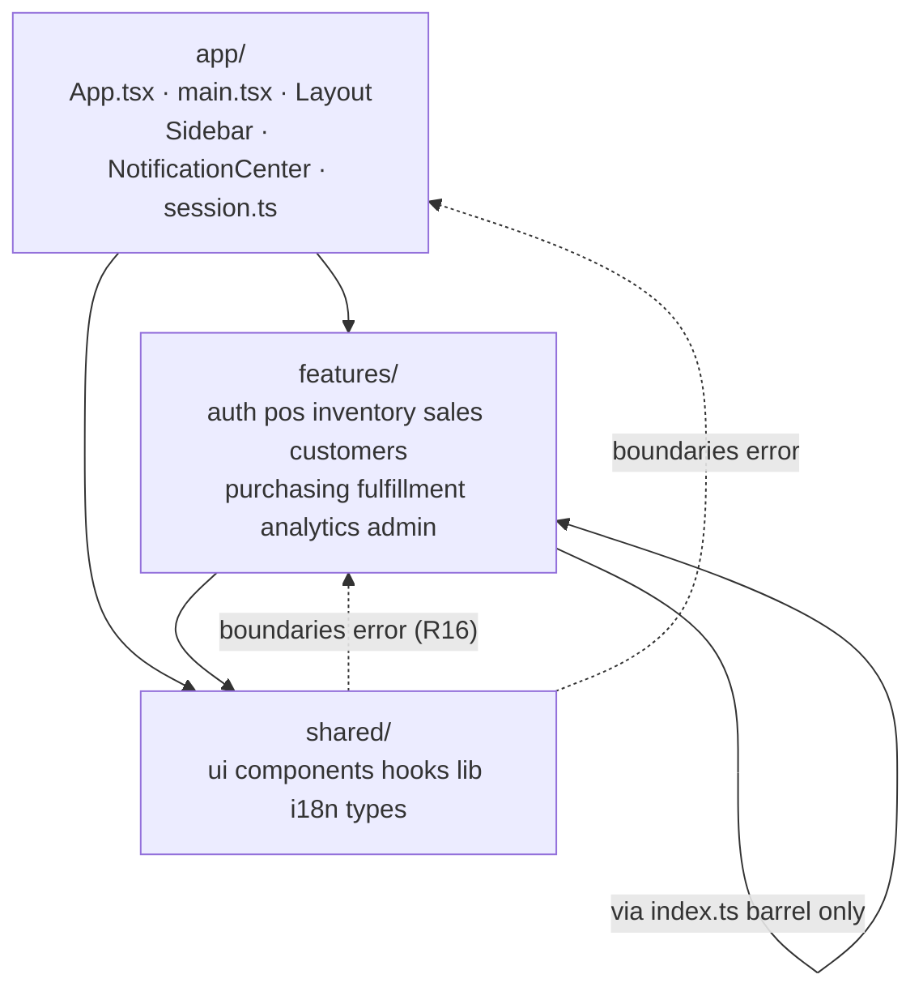

# refactor: Client feature-slice architecture

## Overview

Reorganize `client/src` from technical-kind directories (`pages/`, `components/`, `hooks/`, `store/`,
`types/`) into nine domain slices under `features/`, a `shared/` layer, and a thin `app/` composition
root — with the boundary enforced by lint rather than convention. No runtime behavior changes.

The change is mostly mechanical file movement, but three parts require judgment and carry the risk:
inverting the `shared/ → auth` dependencies (R16), partitioning the 771-line type barrel (R10/R11),
and curating nine public barrels (R6).

## Problem Frame

A single business feature is scattered across four or five sibling directories, so finding code is slow
and — more importantly — **where a new file belongs is undetermined**. The half-populated
`client/src/components/pos/` (one file, while `CartPanel.tsx` sits at the top level) is the visible
result. The existing feature subfolders were a correct instinct with no enforcement behind them.

The goal is **placement determinism, not reading speed** (see origin:
`docs/brainstorms/2026-08-20-client-feature-slice-architecture-requirements.md`). Because decomposing
`CartPanel.tsx` (1170 lines) and finishing the `resource()` migration are both out of scope, reading a
feature will cost about what it costs today. The defensible claim is that *where a file goes* becomes
decidable by rule and enforceable by lint.

Verified scale: 143 `.ts`/`.tsx` files (123 excluding `components/ui/`), ~24.6k LOC excluding
`components/ui/`, 43 page modules (37 pages + 6 colocated page tests), 33 registered routes, 12 test
files, 564 parent-relative + 95 sibling-relative + 73 aliased import specifiers.

## Requirements Trace

Carried from the origin document. R1–R17 are used verbatim below.

| ID | Requirement | Units |
|---|---|---|
| R1 | Nine slices under `client/src/features/` | U5, U7 |
| R2 | Each slice owns all its artifacts, in one documented shape | U5, U7 |
| R3 | The 37-page → slice map | U7 |
| R4 | Domain-less code lives in `shared/` | U4 |
| R5 / R5a / R5b | Placement rule; `cartStore` override; colocated tests | U4, U7, U12 |
| R6 | Curated public barrel per slice | U9 |
| R7 | Cross-slice imports only through the barrel | U9, U10 |
| R8 | Enforced by `eslint-plugin-boundaries` in `npm run lint` | U1, U10 |
| R9 | `@/` alias for all intra-`src` imports; relatives may not escape the slice | U4–U8, U10 |
| R10 | `types/index.ts` split per slice | U8 |
| R11 | Cross-slice server contracts stay centrally importable | U8 |
| R12 | Routing explicitly **not** restructured | U6 |
| R13 | No runtime behavior change | U2, U3, U11 |
| R14 | `resource()` migration not part of this move | — (excluded) |
| R15 | Docs land in the final PR | U12 |
| R16 | `shared/` may never import `features/` | U2, U3, U6, U10 |
| R17 | Circular-import detection in the lint/CI gate | U1, U10 |

## Scope Boundaries

Carried from the origin document, unchanged:

- Not migrating the remaining `apiQuery` call sites (R14). Verified: 22 files import `apiQuery`, 34
  import `resource`; both move as-is.
- Not restructuring routing (R12). `App.tsx` keeps its `RouteConfig[]` table, 31 `lazy()` declarations
  and 4 eager imports; only import paths change.
- Not resolving `Collections.tsx` and `Warranty.tsx` (unrouted dead code). They move with their mapped
  slices; wiring or deleting them is separate work.
- Not decomposing large files. `CartPanel.tsx` (1170) and `Inventory.tsx` (882) move intact.
- Not restructuring `server/`.
- Not changing routes, URLs, roles, or any user-visible behavior.
- Adding devDependencies for lint enforcement is explicitly **in** scope. No runtime dependency changes.

Added during planning:

- **Not renaming zustand persist keys or React Query cache keys.** Renaming `moon-cart-recovery` or
  `moon-held-carts` would drop persisted state for existing users — a behavior change R13 forbids.
  Centralizing the key *literals* (values unchanged) is in scope; namespacing them is not.

## Context & Research

### Verified corrections to the origin document's R5 table

Two rows in R5 do not match the source. The placement rule itself is unchanged; its inputs were wrong.

| Artifact | Origin doc claimed | Verified importers | Corrected home |
|---|---|---|---|
| `CustomerDetail` | pos, customers, admin → `shared/` | `pages/Customers.tsx` only (`CartPanel.tsx` and `Settings.tsx` mention it in comments about a shared `['settings']` cache key, not in imports) | `features/customers/` |
| `charts/` | analytics, pos (Register report) → `shared/` | `components/dashboard/DashboardCharts.tsx` + `pages/AdvancedAnalytics.tsx` only. `components/register/RegisterReport.tsx` imports no chart. | `features/analytics/` |

Unchanged and re-verified: `BarcodeScanner` (POS + BarcodeTools → shared), `Receipt`/`ReceiptDialog`
(CartPanel + SalesHistory → shared), `offlineStore`/`useOffline` (CartPanel + Layout → shared),
`cartStore` (R5a override → `pos`; `BarcodeTools` also moves to `pos`, so the override costs nothing —
the only surviving `pos → inventory` edge is `BarcodeTools → BarcodeGenerator`).

### The R16 problem is larger than the origin document states

The origin document names one violation (`lib/transport/client.ts → store/authStore.ts`). A full
import-graph pass finds the app shell is also implicated: `Layout.tsx`, `Sidebar.tsx` and
`ProtectedRoute.tsx` all read `useAuthStore`, and `Layout` renders `NotificationCenter` and
`StartupPrompt`. R4 places `Layout` and `Sidebar` in `shared/`.

Additionally, `StartupPrompt.tsx` is misattributed in the origin document's Key Decisions: it imports
`RegisterSession` and `Shift` and opens a register session. It is a **pos** artifact rendered by the
shell, not an auth artifact.

**Resolution (decided during planning): a third `app/` layer.** See Key Technical Decisions.

### Layer model



### Cross-slice edges that survive the move (verified, excluding `shared/` and `types/`)

These are the *only* `features/ → features/` edges. Each must be satisfied by a barrel export (R7).

| Edge | Files | Barrel symbol needed |
|---|---|---|
| `pos → auth` | `StartupPrompt.tsx`, `Shifts.tsx`, `Shifts.test.tsx` | `useAuthStore` |
| `inventory → auth` | `Inventory.tsx`, `Inventory.test.tsx` | `useAuthStore` |
| `fulfillment → auth` | `Deliveries.tsx`, `Deliveries.test.tsx` | `useAuthStore` |
| `admin → auth` | `Users.tsx` | `useAuthStore` |
| `pos → inventory` | `BarcodeTools.tsx` | `BarcodeGenerator` |
| `auth → pos` | `authStore.ts` (logout teardown) | **eliminated by U3** |

`analytics` imports nothing from any other slice — only `shared/`. That empirically defuses the origin
document's "analytics structurally reads every other slice" concern (Outstanding Questions).

### Verified per-slice inventory (files, LOC; excludes `components/ui/`)

| Slice | Files | LOC | Composition |
|---|---|---|---|
| `pos` | 20 | 4780 | 7 pages + 2 tests, 8 components, 2 hooks, 2 stores + 1 test |
| `analytics` | 17 | 3188 | 5 pages, 11 components (9 charts), 1 hook |
| `inventory` | 13 | 3944 | 6 pages + 1 test, 5 components, 1 hook |
| `fulfillment` | 7 | 1601 | 3 pages + 1 test, 3 components |
| `purchasing` | 7 | 1990 | 4 pages + 1 test, 2 components |
| `sales` | 6 | 2031 | 4 pages + 1 test, 1 component |
| `customers` | 5 | 1108 | 4 pages, 1 component |
| `admin` | 5 | 1572 | 5 pages |
| `auth` | 3 | 238 | 1 page, 1 component, 1 store |
| `shared` | 36 | 2725 | 8 components, 4 hooks, 17 lib, 2 stores, i18n, assets, test setup |
| `app` | 7 | 797 | `App.tsx`, `main.tsx`, `index.css`, `vite-env.d.ts`, 3 shell components |

### Relevant code and patterns

- `client/eslint.config.mjs` — flat config; the transport-seam `no-restricted-imports` block (#29) is
  the existing precedent for lint-enforced architecture. The new `boundaries` config sits beside it.
- `client/src/lib/transport/` — `client.ts` (axios + interceptors, the R16 offender), `http.ts`,
  `context.ts` (`useTransport` with a lazy real-transport fallback), `provider.tsx`, `memory.ts`,
  `types.ts`, `index.ts`. `index.ts` deliberately does **not** re-export `client.ts`.
- `client/src/store/authStore.ts:33-38` — the logout teardown (`queryClient.clear()`,
  `useOfflineStore.getState().clearQueue()`, `useCartStore.getState().clearCart()`).
- `client/src/lib/resource.ts`, `client/src/lib/apiQuery.ts` — both reach the server only via
  `useTransport()`. Neither touches `authStore`. No inversion needed.
- `client/src/lib/editorDialog.ts` + `editorDialog.test.ts` — the testable-seam pattern from #28; the
  same "pure module + colocated unit test" shape applies to the new `shared/lib/session.ts`.

### Configuration facts that constrain the move (all verified)

- The `@/` alias is declared in exactly three places: `client/vite.config.ts` (`resolve.alias`),
  `client/tsconfig.json` (`compilerOptions.paths`), `client/vitest.config.ts` (`resolve.alias`).
  `client/tailwind.config.js` uses a `./src/**/*` glob — unaffected.
- `client/vitest.config.ts` pins `setupFiles: ['./src/tests/setup.ts']`. Moving that file requires
  updating this path (R4).
- `client/vite.config.ts` sets `workbox.maximumFileSizeToCacheInBytes: 3 * 1024 * 1024`. A chunk over
  3 MB is **silently dropped** from the precache manifest: green build, green lint, broken offline shell.
- `client/vite.config.ts` `build.rollupOptions.output.manualChunks` names five vendor chunks by package
  id — unaffected by source moves, but the *app* chunk graph derives from `App.tsx`'s 4 eager imports
  and 31 `lazy()` calls, which is why U6 must not convert a `lazy()` into a static import.
- ESLint has **no** import plugin and **no** resolver today. `@/` cannot be resolved by any current rule.
- No `client/components.json` exists — `components/ui/` is hand-maintained and relocates freely.
- **There is no CI workflow** (`.github/workflows/` does not exist). The gate is `.husky/pre-commit` →
  `npx lint-staged`, which invokes `eslint --fix --config client/eslint.config.mjs` **from the repo
  root**. Any `boundaries` path pattern or resolver `project` path must resolve correctly from the repo
  root, not just from `client/`. This is a live footgun.
- `docs/ARCHITECTURE.md`, `docs/CONVENTIONS.md`, `docs/API_REFERENCE.md`, `docs/INTEGRATIONS.md`,
  `docs/OFFLINE_PWA.md` and `docs/SMOKE_TEST.md` are **currently deleted in the working tree** (unstaged
  `D` in `git status`). R15 targets two of them. See Risks.
- `CLAUDE.md` at the repo root is 27 lines and has no "Key Patterns" section for R15 to extend.
- `react-refresh/only-export-components` is `warn`, so mixed-export barrels degrade Fast Refresh
  silently. Slice barrels should re-export components only (no constants/hooks mixed in) where practical.

### Institutional learnings

`docs/solutions/` does not exist in this repo. The closest institutional precedents are in git history:
#29 (lint-enforced axios ban), #28 (testable seam extraction), #27 (cluster-by-cluster migration of
delivery / purchase-order / register / shift components) — #27 in particular is direct precedent that
per-cluster commits are the accepted shape for this kind of move.

## Key Technical Decisions

- **Three layers (`app/`, `features/`, `shared/`), not two.** *Rationale:* the app shell legitimately
  composes features — `Layout` renders `StartupPrompt` (pos) and reads `authStore` (auth). Forcing it
  into `shared/` makes R16 unsatisfiable; forcing it into `features/auth/` makes every slice's page
  render through an auth-owned component. A composition root is a standard third layer and
  `eslint-plugin-boundaries` expresses it natively as a third element type. Cost: 7 files
  (`App.tsx`, `main.tsx`, `index.css`, `vite-env.d.ts`, `Layout`, `Sidebar`, `NotificationCenter`).
  *Rejected alternatives:* prop-drilling `user`/`onLogout` from `App.tsx` into `Layout`/`Sidebar`
  (changes component signatures inside a move that claims to be mechanical); shell inside
  `features/auth/` (miscategorization).

- **`shared/` sits at `client/src/shared/`, a sibling of `features/` and `app/`.** *Rationale:*
  leaving `components/`, `hooks/`, `lib/` at the top level preserves the exact technical-kind-at-root
  pattern this change exists to remove, and forces `boundaries` to enumerate directories rather than
  match three prefixes. (Resolves origin Deferred Question on `shared/` placement.)

- **Uniform intra-slice shape: `pages/`, `components/`, `hooks/`, `store/`, `types.ts`, `index.ts` —
  create only the folders that are non-empty.** *Rationale:* the per-slice inventory shows 3–20 files
  per slice; a fixed shape is predictable and none of the folders is large enough to need further
  subdivision. One documented exception: sub-grouping inside `components/` is permitted at ≥8 component
  files, which today applies only to `analytics` (11 components → keep `components/charts/`).
  (Resolves origin Deferred Question on R2.)

- **`shared/types/` holds the cross-slice server contracts; every other type moves to its slice.**
  Determined by an import-graph pass, not judgment — see U8. (Resolves origin Deferred Question on
  R10/R11.)

- **The 564-import rewrite is a ts-morph codemod, not `eslint --fix` and not IDE-assisted moves.**
  *Rationale:* no ESLint rule performs path rewriting; IDE moves are not reproducible or reviewable.
  `ts-morph`'s `SourceFile.move()` updates every referencing specifier from the type-checker's own
  resolution, so the rewrite is exact rather than regex-approximate. A second codemod pass normalizes
  any surviving slice-escaping relative specifier to `@/`. The scripts live under
  `client/scripts/restructure/`, ts-morph is a temporary devDependency, and both are removed in U12.
  (Resolves origin Deferred Question on R9.)

- **One PR, a sequence of individually-green commits — not one 143-file commit.** *Rationale:* the
  origin document asks whether a single-commit move is bisectable; it is not, and the deferred
  `resource()` migration (R14) will re-touch many of these files, so a readable per-slice history
  lowers later conflict cost. #27 is the precedent. Every commit leaves `build`, `test` and `lint`
  green. Enforcement rules switch on **last** (U10), because they would fail mid-sequence.
  (Resolves origin Deferred Question on R13.)

- **String-based coupling is documented, plus the five persist-key literals are centralized.**
  *Rationale:* renaming `moon-cart-recovery` / `moon-held-carts` / `moon-auth` / `moon-offline-queue` /
  `moon-settings` would drop persisted state for existing users — a behavior change R13 forbids.
  `shared/lib/storageKeys.ts` re-exports the same literals so the flat global namespace is visible in
  one file at zero behavioral cost; React Query cache keys, i18n keys and Sidebar route strings are
  documented as an explicit global contract in `docs/CONVENTIONS.md`. (Resolves origin Deferred
  Question on R7/string coupling.)

- **Circular-import detection via `madge --circular`.** *Rationale:* neither `tsc` nor Vite fails on a
  module-init cycle, and all five zustand stores call `create()` at module scope, so a cycle surfaces
  as an undefined-on-import crash the 12 test files would not catch. Barrels amplify this, which is
  exactly what U9 introduces.

## Open Questions

### Resolved During Planning

- *How does the `transport → authStore` edge invert?* **An injected auth port.** `shared/lib/transport`
  gains a `setAuthPort({ getAccessToken, onTokenRefreshed, onAuthFailure })` seam with an inert default;
  `app/session.ts` installs the real implementation from `features/auth` at startup. Chosen over a bare
  token holder because the interceptor needs three operations, not one (read token, write refreshed
  session, force logout). See U2.
- *What is the standard intra-slice shape?* Fixed `pages/ components/ hooks/ store/ types.ts index.ts`,
  non-empty folders only; `components/` sub-grouping permitted at ≥8 files. See Key Decisions.
- *Where does `shared/` live?* `client/src/shared/`. See Key Decisions.
- *What performs the 564-import rewrite?* A ts-morph codemod. See Key Decisions.
- *Which types are cross-slice?* Computed, not guessed — 7 types are imported by two or more slices.
  See U8.
- *Is a single-commit move bisectable?* No; per-slice green commits in one PR. See Key Decisions.
- *Do string-coupled keys get namespaced?* No. Documented, with persist-key literals centralized.
- *What are the split/merge criteria as the app grows?* Documented in `docs/CONVENTIONS.md` (U12): split
  a slice when it exceeds ~25 files **and** its pages partition into two non-overlapping entity sets.
  The `analytics` worry is empirically unfounded today (it imports no other slice). The `fulfillment`
  worry is real but not actionable now — `Storefront` is customer-facing and `Deliveries`/`OnlineOrders`
  are internal; noted as a watch item, not a split.

### Deferred to Implementation

- **Exact barrel surface per slice.** U9 curates it from the verified cross-slice edge table, but the
  final export list is only knowable once the moves are done and `tsc` names the unresolved symbols.
- **Whether `Product`'s descendants stay with `Product`.** `LowStockProduct`, `StorefrontProduct`,
  `CsvProduct` and `ProductFormData` extend or derive from `Product`. Current data says they are
  single-slice, so they move; if `tsc` shows a slice needs another slice's derivative, it is promoted
  to `shared/types/` at that moment rather than pre-emptively.
- **Whether `boundaries` needs `dependencyNodes` tuning for `import type`.** Type-only imports are
  still module edges to the plugin; whether the type-split leaves any that should be exempted is a
  config-tuning question best answered by running the rule.
- **The final `manualChunks` verification threshold.** "Materially unchanged" (Success Criteria) has to
  be judged against the actual before/after manifest; a per-chunk tolerance is picked in U11 once the
  baseline exists.

## High-Level Technical Design

Directional only — not implementation specification.

### The auth-port inversion (U2)

Today `shared/lib/transport/client.ts` reaches *up* into `features/auth`:

```
transport/client.ts  ──import──▶  store/authStore.ts     (R16 violation)
   request interceptor:  useAuthStore.getState().accessToken
   refresh success:      useAuthStore.getState().login(user, token)
   refresh failure:      useAuthStore.getState().logout()  +  window.location.href = '/login'
```

After:

```
shared/lib/transport/authPort.ts
   port = { getAccessToken, onTokenRefreshed, onAuthFailure }   // inert defaults
   setAuthPort(impl)

shared/lib/transport/client.ts  ──▶  authPort   (stays inside shared/)

app/session.ts  ──▶  features/auth  and  ──▶  shared/lib/transport
   setAuthPort({
     getAccessToken:   () => useAuthStore.getState().accessToken,
     onTokenRefreshed: (user, token) => useAuthStore.getState().login(user, token),
     onAuthFailure:    () => { useAuthStore.getState().logout(); redirect('/login') },
   })
```

`app/session.ts` is imported by `main.tsx` for its side effect, before `createRoot`. The inert default
returns `null` for the token and no-ops the callbacks, so a test that renders without the app shell
behaves as an unauthenticated client rather than crashing.

### The logout-teardown inversion (U3)

```
BEFORE                                AFTER
features/auth/store/authStore         features/auth/store/authStore
  logout():                             logout():
    set(cleared)                          set(cleared)
    queryClient.clear()      ──┐          emitSessionEvent('logout')
    offlineStore.clearQueue()  │
    cartStore.clearCart()  ────┘        shared/lib/session.ts
       (auth → pos edge)                  onSessionEvent(type, handler)   // tiny emitter, no deps

                                        app/session.ts   (eager, imported by main.tsx)
                                          onSessionEvent('logout', () => {
                                            queryClient.clear()
                                            useOfflineStore.getState().clearQueue()
                                            useCartStore.getState().clearCart()
                                          })
```

**Why the subscription lives in `app/`, not in `cartStore` itself:** a self-registering subscriber only
runs when its module is first imported. `cartStore` is persisted (`moon-cart-recovery`), so a logout
from a page that never loaded the POS chunk would silently skip the cart clear — a behavior change.
Wiring eagerly at the composition root reproduces today's semantics exactly. (`POS` is one of
`App.tsx`'s four eager imports today, so this costs no additional bundle weight.)

### Unit dependency order


## Implementation Units

All paths are repo-relative. `client/src/…` throughout.

---

- [ ] **Unit 1: Tooling scaffold and cycle gate**

**Goal:** Add the enforcement dependencies and turn on circular-import detection *before* anything
moves, so the cycle check has a clean baseline and the codemod has a working type-aware resolver.

**Requirements:** R8, R17

**Dependencies:** None

**Files:**
- Modify: `client/package.json` (devDeps: `eslint-plugin-boundaries`, `eslint-import-resolver-typescript`,
  `madge`, and temporary `ts-morph`; scripts: `lint:cycles`, and `lint` composed to run it)
- Modify: `client/eslint.config.mjs` (register the `boundaries` plugin and the TypeScript resolver
  **with rules left off** — config only)
- Create: `client/scripts/restructure/README.md` (what the codemod scripts are, and that they are
  deleted in U12)

**Approach:**
- Register the resolver with an explicit `project` path that resolves from the **repo root**, because
  `.husky/pre-commit` → `lint-staged` invokes `eslint --config client/eslint.config.mjs` with the repo
  root as cwd. Verify by running the lint-staged command shape from the root, not just `cd client && npm run lint`.
- `madge --circular --extensions ts,tsx src` from `client/`. Confirm the current baseline is zero
  cycles; if it is not, that is a pre-existing finding to surface before proceeding.
- Leave every `boundaries/*` rule off. U10 switches them on.

**Patterns to follow:**
- `client/eslint.config.mjs` — the transport-seam `no-restricted-imports` block: a separate config
  object with a comment explaining *why* the rule exists.

**Test scenarios:**
- Happy path: `npm run lint` (from `client/`) passes with the plugin registered and rules off.
- Integration: the `lint-staged` invocation shape — `npx eslint --config client/eslint.config.mjs`
  run with the **repo root** as cwd on a `client/src` file — resolves `@/…` specifiers without
  "unable to resolve path" errors.
- Happy path: `npm run lint:cycles` reports zero circular dependencies on the current tree.

**Verification:**
- `npm run lint` and `npm run lint:cycles` both green, from `client/` and via the root lint-staged path.
- `npm run build` and `npm run test` unaffected.

---

- [ ] **Unit 2: Invert `transport → authStore` behind an auth port**

**Goal:** Remove the only pre-existing `shared → features` import, in place, before any file moves.
This is the prerequisite that gates every other unit.

**Requirements:** R13, R16

**Dependencies:** U1

**Files:**
- Create: `client/src/lib/transport/authPort.ts`
- Create: `client/src/lib/transport/authPort.test.ts`
- Modify: `client/src/lib/transport/client.ts` (drop the `authStore` import; read/write through the port)
- Modify: `client/src/main.tsx` (install the real port before `createRoot`; extracted to `app/session.ts`
  in U6)

**Approach:**
- The port carries three operations — `getAccessToken`, `onTokenRefreshed(user, token)`,
  `onAuthFailure()` — matching the three places `client.ts` reaches into the store today
  (request interceptor, refresh success, refresh failure).
- Inert defaults: `getAccessToken` returns `null`, callbacks no-op. Rendering without the shell then
  behaves as an unauthenticated client rather than throwing.
- `onAuthFailure` owns the `window.location.href = '/login'` redirect so the navigation decision leaves
  `shared/` along with the auth knowledge.
- Do **not** export the port from `client/src/lib/transport/index.ts` beyond `setAuthPort` — the existing
  `no-restricted-imports` rule already bans importing `lib/transport/client` directly, and that must
  keep holding.

**Execution note:** Implement test-first. This is the highest-risk unit in the plan, it changes the
401-refresh path, and there is no existing test for `client.ts`.

**Test scenarios:**
- Happy path: with a port supplying a token, an outbound request carries `Authorization: Bearer <token>`.
- Edge case: with the inert default port (none installed), a request carries no `Authorization` header
  and does not throw.
- Edge case: `getAccessToken` returns `null` → no `Authorization` header is set.
- Happy path: a 401 followed by a successful `/api/v1/auth/refresh` calls `onTokenRefreshed(user, token)`
  exactly once and retries the original request with the new bearer token.
- Error path: a 401 whose refresh call also fails invokes `onAuthFailure()` exactly once and rejects the
  original promise with the refresh error.
- Edge case: two concurrent 401s trigger exactly one refresh; the queued request resolves with the same
  refreshed token (guards the existing `isRefreshing`/`failedQueue` closure).
- Edge case: a request already marked `_retry` does not attempt a second refresh.
- Integration: `client/src/lib/transport/client.ts` contains no import of `authStore` (grep-level
  assertion, or covered by U10's lint rule once enabled).

**Verification:**
- `grep -rn authStore client/src/lib/` returns nothing.
- Manual login → 15-minute token expiry → silent refresh still works, and a revoked refresh token still
  redirects to `/login` (`docs/SMOKE_TEST.md` auth path).
- `npm run build`, `npm run test`, `npm run lint`, `npm run lint:cycles` green.

---

- [ ] **Unit 3: Invert the logout teardown to a session event**

**Goal:** Remove the `authStore → cartStore` edge (which would become `auth → pos` into another slice's
internals) without changing what logout actually clears.

**Requirements:** R13, R16, R7

**Dependencies:** U2

**Files:**
- Create: `client/src/lib/session.ts` (minimal typed emitter: `emitSessionEvent`, `onSessionEvent`)
- Create: `client/src/lib/session.test.ts`
- Modify: `client/src/store/authStore.ts` (drop `queryClient`, `offlineStore`, `cartStore` imports;
  `logout()` clears auth state and emits)
- Create: `client/src/store/authStore.test.ts`
- Modify: `client/src/main.tsx` (subscribe the teardown eagerly; moves to `app/session.ts` in U6)

**Approach:**
- The emitter must have zero imports beyond types — it is the lowest thing in `shared/` and anything it
  imports becomes a cycle candidate once barrels exist.
- Teardown order must match today's `authStore.ts:33-38` exactly: `queryClient.clear()`, then
  `clearQueue()`, then `clearCart()`.
- Subscribe at the composition root, eagerly, not inside `cartStore` — see High-Level Technical Design
  for why a self-registering subscriber would silently skip the cart clear.
- `heldCartsStore` (`moon-held-carts`) is **not** cleared today. Do not add it.

**Execution note:** Implement test-first, and write the `authStore` teardown test **against the current
behavior first** so it is a characterization test that must keep passing across the inversion.

**Test scenarios:**
- Happy path (`session.ts`): a handler registered for `logout` runs when `logout` is emitted; a handler
  for a different event does not.
- Edge case (`session.ts`): emitting with no subscribers does not throw.
- Edge case (`session.ts`): two handlers on the same event both run; the unsubscribe returned by
  `onSessionEvent` removes only its own handler.
- Error path (`session.ts`): a handler that throws does not prevent the remaining handlers from running
  (a failing cart clear must not skip the queue clear).
- Happy path (`authStore`): `logout()` sets `user: null`, `accessToken: null`, `isAuthenticated: false`.
- Integration: with the composition-root wiring installed, `logout()` results in `queryClient.clear()`,
  `useOfflineStore.getState().clearQueue()` and `useCartStore.getState().clearCart()` all having run —
  the behavior this unit must preserve.
- Integration: `logout()` does **not** clear `heldCartsStore` (pins today's behavior).
- Edge case (`authStore`): `logout()` with no subscriber wired (bare store import in a unit test) does
  not throw.

**Verification:**
- `client/src/store/authStore.ts` imports only `zustand`, `zustand/middleware`, `../lib/session` and
  its types.
- Manual: log in, add cart items, queue an offline sale, log out → cart empty, queue empty, held carts
  preserved.
- `npm run lint:cycles` still reports zero cycles.

---

- [ ] **Unit 4: Create `shared/` and move the domain-less modules**

**Goal:** Establish the `shared/` layer and move everything R5 assigns to it, with all referencing
imports rewritten to `@/shared/…`.

**Requirements:** R4, R5, R5b, R9

**Dependencies:** U3

**Files:**
- Create: `client/scripts/restructure/move.mjs` (ts-morph move driver, manifest-driven)
- Create: `client/scripts/restructure/manifest.json` (old path → new path, the single source of truth
  for U4–U7)
- Create: `client/src/shared/lib/storageKeys.ts` (the five persist-key literals, values unchanged)
- Move to `client/src/shared/ui/`: all 20 files from `client/src/components/ui/`
- Move to `client/src/shared/components/`: `BarcodeScanner.tsx`, `DataTable.tsx`, `EmptyState.tsx`,
  `ErrorBoundary.tsx`, `PWAInstallPrompt.tsx`, `Receipt.tsx`, `ReceiptDialog.tsx`, `StatusBadge.tsx`
- Move to `client/src/shared/hooks/`: `useDebouncedValue.ts`, `useOffline.ts`, `useOffline.test.tsx`,
  `useScanner.ts`
- Move to `client/src/shared/lib/`: `apiQuery.ts`, `checkout.ts`, `checkout.test.ts`, `editorDialog.ts`,
  `editorDialog.test.ts`, `exportUtils.ts`, `queryClient.ts`, `resource.ts`, `resource.test.tsx`,
  `session.ts`, `session.test.ts`, `utils.ts`, and `transport/` (all 8 files incl. `authPort.ts`)
- Move to `client/src/shared/store/`: `offlineStore.ts`, `settingsStore.ts`
- Move to `client/src/shared/i18n/`: `index.ts`, `en.json`, `ar.json`
- Move to `client/src/shared/assets/`: `moon-logo.svg`
- Move to `client/src/shared/tests/`: `setup.ts`
- Modify: `client/vitest.config.ts` (`setupFiles` → `./src/shared/tests/setup.ts`)
- Modify: `client/src/store/*.ts` (consume `storageKeys` for their `persist` names)

**Approach:**
- Drive every move from `manifest.json` so U4–U7 share one reviewable mapping and the diff can be
  audited against it.
- ts-morph `SourceFile.move()` rewrites referencing specifiers from the type-checker's resolution.
  A second pass normalizes any specifier that now escapes `shared/` to `@/shared/…`.
- `storageKeys.ts` exports the same five literals (`moon-auth`, `moon-cart-recovery`, `moon-held-carts`,
  `moon-offline-queue`, `moon-settings`). **Values must not change** — a rename drops persisted state.
- `checkout.ts` is used only by `CartPanel` today but is a pure computation seam from #28; it stays in
  `shared/lib/` where #28 put it rather than following its single consumer into `pos`.
- `components/ui/` moves wholesale — no `components.json` exists, so nothing regenerates these.

**Test scenarios:**
- Happy path: all 12 existing test files still pass unmodified except for their own import specifiers.
- Integration: `client/src/shared/lib/storageKeys.ts` values are byte-identical to the five current
  `persist({ name })` literals — assert each key string explicitly so a typo cannot silently orphan
  persisted state.
- Integration: a browser session with pre-existing `localStorage` under the old keys still rehydrates
  cart, held carts, offline queue, settings and auth after the change (manual, `docs/SMOKE_TEST.md`).
- Edge case: `vitest` resolves `setupFiles` at its new path — proven by the suite running at all.

**Verification:**
- `client/src/components/ui/`, and the `shared`-assigned files under `components/`, `hooks/`, `lib/`,
  `store/`, `i18n/`, `assets/`, `tests/` no longer exist at their old paths.
- `npm run build`, `npm run test`, `npm run lint`, `npm run lint:cycles` green.

---

- [ ] **Unit 5: Create the nine empty slice skeletons**

**Goal:** Land the directory shape and its documented contract in one small, reviewable commit before
any page moves.

**Requirements:** R1, R2

**Dependencies:** U4

**Files:**
- Create: `client/src/features/<slice>/index.ts` × 9 (`auth`, `pos`, `inventory`, `sales`, `customers`,
  `purchasing`, `fulfillment`, `analytics`, `admin`) — empty barrels with a header comment stating the
  R6/R7 contract
- Create: `client/src/features/README.md` (the intra-slice shape and the R5 placement checklist)

**Approach:**
- An empty `index.ts` with only a comment trips `@typescript-eslint` on nothing but may trip
  `react-refresh/only-export-components` once populated — keep barrels component-only where practical.
- Subfolders are created in U7 as files arrive, so no empty `pages/`/`hooks/` directories are committed.

**Test scenarios:** Test expectation: none — scaffolding only, no behavior and no importable symbols.

**Verification:**
- `npm run build`, `npm run test`, `npm run lint` green (nothing imports the empty barrels yet).

---

- [ ] **Unit 6: Create `app/` and move the composition root**

**Goal:** Give the app shell a legal home that may import both `features/` and `shared/`, and
consolidate the U2/U3 wiring there.

**Requirements:** R12, R16, R13

**Dependencies:** U5

**Files:**
- Move: `client/src/App.tsx` → `client/src/app/App.tsx`
- Move: `client/src/main.tsx` → `client/src/app/main.tsx`
- Move: `client/src/index.css` → `client/src/app/index.css`
- Move: `client/src/components/Layout.tsx` → `client/src/app/Layout.tsx`
- Move: `client/src/components/Sidebar.tsx` → `client/src/app/Sidebar.tsx`
- Move: `client/src/components/NotificationCenter.tsx` → `client/src/app/NotificationCenter.tsx`
- Create: `client/src/app/session.ts` (the `setAuthPort` install + the `logout` teardown subscription,
  lifted out of `main.tsx`)
- Keep: `client/src/vite-env.d.ts` at `client/src/` (ambient declaration; moving it buys nothing)
- Modify: `client/index.html` (`<script type="module" src="/src/app/main.tsx">`)

**Approach:**
- **R12 is a hard constraint here.** `App.tsx` keeps its `RouteConfig[]` table, all 33 entries, the 4
  eager imports (`Dashboard`, `POS`, `Inventory`, `Login`) and all 31 `lazy(() => import(...))`
  declarations. Only specifier strings change. Do not convert a `lazy()` to a static import, do not
  reorder the table, do not touch the `/customer-display`, `/locations` or `Login` redirect branches.
- At this point the `lazy()` specifiers still point at `../pages/*`; U7 rewrites them per slice.
- `session.ts` is imported for side effect by `main.tsx` before `createRoot`, preserving the current
  ordering relative to `useSettingsStore.getState().hydrate()`.

**Test scenarios:**
- Happy path: the app boots and `/` renders for an Admin session (existing page tests plus a manual
  smoke run).
- Integration: after login, `Sidebar` still renders the user's name and role and its logout still
  clears cart + offline queue — the U3 wiring now lives in `app/session.ts` rather than `main.tsx`.
- Integration: `index.html` points at the moved entry — proven by `npm run build` producing a non-empty
  `dist/` with a hashed entry chunk.
- Edge case: `/customer-display` still renders outside `Layout` and without auth.
- Edge case: `/locations` still redirects to `/branches`.
- Edge case: an unauthenticated visit to any protected path still lands on `/login`; an authenticated
  visit to `/login` still redirects by role (Admin → `/`, Cashier → `/pos`, Delivery → `/deliveries`).

**Verification:**
- `client/src/app/` contains exactly the shell; `client/src/components/` contains no top-level
  shell file.
- Route count in `App.tsx` is still 33; `lazy()` count is still 31; eager page imports still 4.
- `npm run build`, `npm run test`, `npm run lint`, `npm run lint:cycles` green.

---

- [ ] **Unit 7: Move the nine slices (one commit per slice)**

**Goal:** Relocate all 83 slice-owned files into `features/<slice>/`, leaving the old `pages/`,
`components/`, `hooks/` and `store/` directories empty.

**Requirements:** R1, R2, R3, R5, R5a, R5b, R9

**Dependencies:** U6

**Files:** Driven by `client/scripts/restructure/manifest.json`. Commit order is ascending by size so
the codemod is exercised on small slices first:

| # | Slice | Moves |
|---|---|---|
| 7.1 | `auth` | `pages/Login.tsx`, `components/ProtectedRoute.tsx`, `store/authStore.ts` + `authStore.test.ts` |
| 7.2 | `admin` | `pages/`: `AuditLog`, `Backup`, `Branches`, `Settings`, `Users` |
| 7.3 | `customers` | `pages/`: `Customers`, `Feedback`, `Segments`, `Warranty`; `components/CustomerDetail.tsx` |
| 7.4 | `sales` | `pages/`: `SalesHistory`, `Layaway`, `GiftCards`, `Promotions` (+ `Promotions.test`); `components/RefundDialog.tsx` |
| 7.5 | `purchasing` | `pages/`: `PurchaseOrders` (+ test), `Vendors`, `Distributors`, `Expenses`; `components/purchase-orders/` (2) |
| 7.6 | `fulfillment` | `pages/`: `Deliveries` (+ test), `OnlineOrders`, `Storefront`; `components/delivery/` (3) |
| 7.7 | `inventory` | `pages/`: `Inventory` (+ test), `Categories`, `StockCount`, `Bundles`, `Collections`, `SmartPricing`; `components/inventory/` (3), `components/AdjustStockDialog.tsx`, `components/BarcodeGenerator.tsx`; `hooks/useVariantManagement.ts` |
| 7.8 | `analytics` | `pages/`: `Dashboard`, `AdvancedAnalytics`, `AiInsights`, `ReportBuilder`, `Exports`; `components/dashboard/` (2), `components/charts/` (9 → `components/charts/`); `hooks/useDashboardData.ts` |
| 7.9 | `pos` | `pages/`: `POS`, `Register` (+ test), `Shifts` (+ test), `CustomerDisplay`, `BarcodeTools`; `components/`: `CartPanel` (+ test), `HeldCartsDialog`, `KeyboardShortcutsHelp`, `StartupPrompt`, `pos/VariantPickerDialog`, `register/` (2); `hooks/`: `usePosData`, `usePosShortcuts`; `store/`: `cartStore` (+ test), `heldCartsStore` |

Also modify per commit: `client/src/app/App.tsx` (that slice's eager/lazy import specifiers).

**Approach:**
- Uniform target shape per slice: `pages/`, `components/`, `hooks/`, `store/` — non-empty folders only.
  `analytics` keeps `components/charts/` as the one sanctioned sub-grouping (11 components ≥ 8).
- R5a is applied: `BarcodeTools.tsx` → `pos`, `BarcodeGenerator.tsx` → `inventory`. `cartStore` stays
  in `pos`, never `shared/`.
- R5b: every `*.test.*` moves beside its unit.
- `StartupPrompt.tsx` → `pos`, correcting the origin document's Key Decisions (it opens a register
  session and imports `RegisterSession`/`Shift`, not auth state). `app/Layout.tsx` therefore imports it
  through `@/features/pos` once U9 lands its barrel.
- Cross-slice specifiers written by earlier commits may temporarily point deep into another slice
  (e.g. `@/features/auth/store/authStore`). That is expected and legal until U9 converts them to barrel
  form and U10 makes deep imports an error.
- Each commit ends green. If a slice's move exposes a cycle, fix it in that commit rather than deferring.

**Test scenarios:**
- Happy path (each commit): the full 12-file vitest suite passes with no test-body edits beyond import
  paths. The 6 page tests (`Deliveries`, `Inventory`, `Promotions`, `PurchaseOrders`, `Register`,
  `Shifts`) each land in their slice and still render their page against the in-memory transport.
- Integration (7.9): `CartPanel.test.tsx` still exercises checkout through `shared/lib/checkout` and
  the offline fallback through `shared/store/offlineStore` — the two edges that cross out of `pos`.
- Integration (7.9): `cartStore.test.ts` still passes with `moon-cart-recovery` unchanged.
- Edge case (7.7 / 7.9): `Collections.tsx` and `Warranty.tsx` move with their slices and remain
  unrouted — no `lazy()` declaration and no route entry is added.
- Edge case (each commit): `npm run lint:cycles` reports zero cycles after every individual commit,
  not only at the end.

**Verification:**
- `client/src/pages/`, `client/src/components/` (except nothing), `client/src/hooks/` and
  `client/src/store/` are gone. Only `client/src/types/` remains, pending U8.
- Route count still 33; `lazy()` count still 31; eager page imports still 4.
- All four gates green at every one of the nine commits.

---

- [ ] **Unit 8: Split `types/index.ts`**

**Goal:** Partition the 771-line type barrel so each slice owns its entity types, while genuine
cross-slice server contracts stay centrally importable without pulling in a slice's components.

**Requirements:** R10, R11

**Dependencies:** U7

**Files:**
- Create: `client/src/shared/types/index.ts` — the cross-slice contracts
- Create: `client/src/features/<slice>/types.ts` × 7 (`pos`, `inventory`, `sales`, `customers`,
  `purchasing`, `fulfillment`, `admin`) — `analytics` imports no entity type from this barrel, and
  `auth`'s identity types stay in `shared/types/`
- Delete: `client/src/types/index.ts`
- Modify: every file whose type imports repoint

**Approach:** the partition is computed from the import graph, not chosen. Verified usage:

*Stay in `shared/types/` — imported by two or more slices, or part of the identity contract:*

| Type | Importing slices |
|---|---|
| `Product` | fulfillment, inventory, pos, purchasing, sales |
| `Customer` | customers, fulfillment, pos, sales |
| `AppSettings` | admin, customers, pos |
| `ProductVariant` | inventory, pos |
| `Category` | inventory, pos |
| `Distributor` | inventory, purchasing |
| `AuthResponseData` | auth, shared (transport refresh) |
| `ApiErrorResponse` | — (unused, but the stated server error contract; R11 names it explicitly) |
| `User`, `UserRole`, `AuthUser` | identity contract — see note |

Note on identity: `AuthUser` is `Pick<User, …>`. `User`/`UserRole` are otherwise admin-only, but
splitting them would create an `auth → admin` type edge for no benefit. All four identity types
(`User`, `UserRole`, `AuthUser`, `AuthResponseData`) live in `shared/types/`.

*Move to their slice* (counts include types with zero current importers, which move with their
evident owner rather than being deleted — out of scope):

| Slice | Types |
|---|---|
| `inventory` (16) | `LowStockProduct`, `CsvProduct`, `ProductImportResult`, `BulkDiscontinueResult`, `ProductFormData`, `CategoryRecord`, `Collection`, `CollectionProduct`, `CollectionDetail`, `BundleItem`, `Bundle`, `PriceSuggestion`, `PricingRule`, `StockCountSummary`, `StockCountItem`, `StockCountDetail` |
| `sales` (11) | `SaleItem`, `Coupon`, `GiftCard`, `GiftCardTransaction`, `LayawayLine`, `LayawayOrder`, `LayawayDetail`, `Sale`, `SalesMeta`, `SaleDetail`, `SaleRefund` |
| `fulfillment` (11) | `ShippingCompany`, `DeliveryStatus`, `DeliveryOrder`, `DeliveryStatusHistoryEntry`, `DeliveryPerformance`, `DeliveryPayload`, `OnlineOrder`, `OnlineOrderItem`, `StorefrontConfig`, `StorefrontBanner`, `StorefrontProduct` |
| `pos` (5) | `RegisterSession`, `RegisterMovement`, `RegisterReportData`, `Shift`, `TimesheetEntry` |
| `purchasing` (5) | `PurchaseOrder`, `PurchaseOrderItem`, `PurchaseOrderDetail`, `LowStockSuggestion`, `PurchaseOrderLine` |
| `admin` (4) | `AuditEntry`, `Branch`, `BranchTransfer`, `ConsolidatedBranches` |
| `customers` (7) | `SegmentSummary`, `CustomerRFM`, `SegmentsResponse`, `FeedbackEntry`, `FeedbackStats`, `FeedbackResponse`, `WarrantyClaim` |

- `LowStockProduct extends Product` and `StorefrontProduct extends Product` are fine — a slice importing
  `shared/types` is legal. If `tsc` reveals a slice needs *another slice's* derivative, promote that one
  type to `shared/types/` at that moment; do not pre-emptively widen the shared surface.
- `ReceiptData` stays exported from `shared/components/Receipt.tsx` where it already lives.

**Test scenarios:**
- Happy path: `npm run build` (i.e. `tsc`) resolves every type reference — the primary proof, since
  types have no runtime.
- Integration: no `features/<a>/types.ts` is imported by `features/<b>/`. Verified by grep now and by
  U10's boundaries rule afterwards.
- Integration: `shared/types/` imports nothing from `features/` (R16), so `shared/` stays type-clean.
- Edge case: the 11 currently-unimported types (`ApiErrorResponse`, `SegmentSummary`, `CustomerRFM`,
  `FeedbackEntry`, `FeedbackStats`, `CollectionProduct`, `DeliveryStatus`, `PurchaseOrderItem`,
  `RegisterMovement`, `OnlineOrderItem`, `StockCountItem`) are still exported after the split — assert
  by count that all 70 exported type names survive, so none is dropped in transit.

**Verification:**
- `client/src/types/` no longer exists.
- `shared/types/index.ts` exports exactly the 11 contracts listed above; total exported type names
  across `shared/types/` + the 7 slice `types.ts` files equals today's 70 (11 shared + 59 sliced).
- All four gates green.

---

- [ ] **Unit 9: Curate the nine public barrels**

**Goal:** Give each slice a minimal public surface and convert every surviving cross-slice import to
barrel form, so U10's rules can be switched on without a wall of errors.

**Requirements:** R6, R7

**Dependencies:** U8

**Files:**
- Modify: `client/src/features/<slice>/index.ts` × 9
- Modify: the 9 files carrying cross-slice imports (`features/pos/components/StartupPrompt.tsx`,
  `features/pos/pages/Shifts.tsx` + test, `features/inventory/pages/Inventory.tsx` + test,
  `features/fulfillment/pages/Deliveries.tsx` + test, `features/admin/pages/Users.tsx`,
  `features/pos/pages/BarcodeTools.tsx`)
- Modify: `client/src/app/App.tsx`, `client/src/app/Layout.tsx`, `client/src/app/session.ts` (import
  pages and shell dependencies through slice barrels)

**Approach:**
- Export **only** what the verified cross-slice edge table requires. Starting surface:

| Slice | Barrel exports |
|---|---|
| `auth` | `useAuthStore`, `ProtectedRoute`, `Login` |
| `pos` | `POS`, `Register`, `Shifts`, `CustomerDisplay`, `BarcodeTools`, `StartupPrompt`, `useCartStore` (for `app/session.ts` teardown) |
| `inventory` | `Inventory`, `Categories`, `StockCount`, `Bundles`, `SmartPricing`, `BarcodeGenerator` |
| `sales` / `customers` / `purchasing` / `fulfillment` / `analytics` / `admin` | their routed pages only |

- `Collections` and `Warranty` are unrouted: do **not** export them. An unexported unrouted page is the
  honest state and keeps the barrel from lying about the public surface.
- **Barrels must not break code-splitting.** `App.tsx` uses `lazy(() => import('@/features/x'))` only
  where the whole slice is one route; where a slice holds several lazily-routed pages, keep
  `lazy(() => import('@/features/x/pages/Y'))`. A barrel that eagerly re-exports all of a slice's pages
  would collapse 31 lazy chunks into far fewer. **Decision: `App.tsx` keeps deep `lazy()` specifiers**
  — R12 freezes the route table, and `boundaries` is configured in U10 to allow `app/ → features/**`
  (only `features/ → features/` is restricted to barrels). This is the point where a naive reading of R7
  would silently regress the bundle.
- Prefer component-only barrels; where a barrel must also export a store hook (`useAuthStore`,
  `useCartStore`), accept the `react-refresh/only-export-components` warning and note it inline.

**Test scenarios:**
- Happy path: every cross-slice import in the table above resolves through the barrel and the suite
  passes.
- Integration: `app/Layout.tsx` imports `StartupPrompt` from `@/features/pos` (not a deep path) and the
  register-startup dialog still appears for a Cashier with no open session.
- Integration: `app/session.ts` clears the cart via the `pos` barrel and the U3 logout integration test
  still passes.
- Edge case: `lint:cycles` reports zero cycles **after** barrels exist — this is the unit most likely to
  create one, since `app → features/pos → shared/lib/session ← app` is now a real path shape.
- Edge case: `features/inventory/index.ts` does not export `Collections`; `features/customers/index.ts`
  does not export `Warranty`.

**Verification:**
- No `features/<a>/…` file imports a path deeper than `@/features/<b>` for any `b ≠ a`.
- `lazy()` count in `App.tsx` still 31; eager page imports still 4.
- All four gates green.

---

- [ ] **Unit 10: Switch enforcement on**

**Goal:** Make the architecture fail the build when violated, and demonstrate that it does.

**Requirements:** R7, R8, R9, R16, R17

**Dependencies:** U9

**Files:**
- Modify: `client/eslint.config.mjs` (`boundaries` element types + rules from `off` to `error`;
  add the relative-escape restriction for R9)
- Modify: `client/package.json` (`lint` composes `eslint .` and `lint:cycles`)
- Modify: PR description (the two required negative-case demonstrations — nothing is committed; see Approach)

**Approach:**
- Three element types, matched by path:

  ```
  app       src/app/**
  feature   src/features/*/**        (capture the slice name)
  shared    src/shared/**
  ```

- Rules:
  - `app` → may import `feature` (any depth, so `lazy()` stays deep) and `shared`.
  - `feature` → may import `shared`, itself (same slice, any depth), and other features **only** at
    their barrel (`@/features/<name>` exactly).
  - `shared` → may import `shared` only. This is R16, and it also blocks `shared → app`.
  - `boundaries/no-unknown` and `boundaries/no-unknown-files` on, so a file that lands outside the three
    layers is an error rather than silently unconstrained.
- R9: a `no-restricted-imports` pattern banning `../../**` from `src/features/*/` (a relative specifier
  cannot escape a slice at depth ≤ 2 within the documented shape). Note this is belt-and-braces —
  `boundaries` already matches resolved modules, so a relatively-written deep cross-slice import is
  caught regardless. Keep it anyway as the faster, clearer error message.
- The existing transport `no-restricted-imports` block stays untouched; its `ignores` path updates to
  `src/shared/lib/transport/**`.
- **Demonstrate both negative cases in the PR** (Success Criteria): introduce a deep cross-slice import
  and a `shared → features` import, capture the two red `npm run lint` outputs, then revert. Do not
  commit the violations.
- Re-verify the root-cwd lint-staged path from U1 — this is where a resolver misconfiguration would
  first bite a committing developer rather than a CI job (there is no CI).

**Test scenarios:**
- Happy path: `npm run lint` passes on the fully-restructured tree with all rules at `error`.
- Error path: adding `import ProductFormDialog from '@/features/inventory/components/ProductFormDialog'`
  to `features/pos/pages/POS.tsx` makes `npm run lint` fail with a `boundaries/element-types` error.
- Error path: the same import written relatively (`../../inventory/components/ProductFormDialog`) also
  fails — this is the specific bypass `no-restricted-imports` alone could not catch (R8 rationale).
- Error path: adding `import { useAuthStore } from '@/features/auth'` to
  `shared/components/DataTable.tsx` fails with an R16 error.
- Error path: adding `import Layout from '@/app/Layout'` to a `shared/` file fails (shared may not reach
  the composition root either).
- Happy path: a legal barrel import (`import { useAuthStore } from '@/features/auth'` in
  `features/admin/pages/Users.tsx`) does **not** error.
- Happy path: `app/App.tsx`'s deep `lazy(() => import('@/features/sales/pages/Layaway'))` does **not**
  error — the rule must not force barrel imports on the composition root.
- Error path: a hand-introduced import cycle makes `npm run lint:cycles` fail non-zero.
- Integration: the lint-staged invocation from the repo root produces the same pass/fail results as
  `cd client && npm run lint`.

**Verification:**
- `npm run lint` fails on each of the five negative cases and passes on the clean tree.
- `npm run lint:cycles` reports zero cycles.
- Pre-commit hook rejects a staged violation.

---

- [ ] **Unit 11: Bundle and PWA parity check**

**Goal:** Prove R13's "no runtime behavior change" for the two things `tsc`, vitest and ESLint cannot
see: the chunk graph and the Workbox precache manifest.

**Requirements:** R13, plus the Success Criteria bundle gate

**Dependencies:** U10

**Files:**
- Create: `client/scripts/restructure/bundle-manifest.mjs` (emit chunk name + size + count from a build)
- Modify: PR description (the before/after diff)

**Approach:**
- Capture the **baseline before U2** — build `main` at the merge base and store the manifest. Doing this
  at the end is too late.
- Compare chunk count, chunk names and per-chunk sizes. Pick the tolerance now that a baseline exists;
  a name-set diff and a ±5% per-chunk size band is the starting proposal, tightened or loosened once the
  real numbers are visible (see Deferred Questions).
- Separately assert the Workbox precache manifest still contains the app shell entry and that **no
  emitted chunk exceeds 3 MB** — over the cap, `vite-plugin-pwa` silently drops the file from the
  manifest and the offline shell breaks with everything else green.
- Sanity-check code splitting survived: 31 lazily-routed pages should still produce roughly 31 route
  chunks. A collapse here is the failure mode U9's barrel decision exists to prevent.

**Test scenarios:**
- Happy path: chunk **count** is unchanged between baseline and head.
- Happy path: the set of chunk names is unchanged (the five `manualChunks` vendor chunks plus the
  route chunks).
- Edge case: no single emitted asset exceeds `3 * 1024 * 1024` bytes.
- Integration: the generated `dist/sw.js` precache manifest lists `index.html` and the entry JS/CSS.
- Integration: `npm run preview`, then offline in devtools → the app shell still loads and the offline
  banner appears (`docs/OFFLINE_PWA.md` path).
- Edge case: per-chunk size deltas fall inside the chosen tolerance; any outlier is explained in the PR
  rather than waved through.

**Verification:**
- Before/after manifest diff pasted into the PR, with the chunk count and 3 MB assertions called out.
- Manual offline smoke passes.

---

- [ ] **Unit 12: Documentation and cleanup**

**Goal:** Land the docs R15 requires, in the form agents actually read, and remove the temporary
restructure machinery.

**Requirements:** R15, R2, R5

**Dependencies:** U11

**Files:**
- Create/restore: `docs/ARCHITECTURE.md` (three-layer model, the nine slices, the dependency rules)
- Create/restore: `docs/CONVENTIONS.md` (R5 placement rule as an ordered checklist; the global string
  contract; slice split/merge criteria)
- Modify: `CLAUDE.md` (add a "Key Patterns" section: slice map + placement rule)
- Modify: `client/src/features/README.md` (point at the docs rather than duplicating them)
- Delete: `client/scripts/restructure/` (move driver, manifest, bundle script)
- Modify: `client/package.json` (drop the temporary `ts-morph` devDependency; keep `boundaries`,
  the resolver and `madge`)

**Approach:**
- **`docs/ARCHITECTURE.md` and `docs/CONVENTIONS.md` are currently deleted in the working tree** (see
  Risks). Recover the last committed versions first, then rewrite — do not author from scratch and
  silently lose whatever they said. The other four deleted docs are outside this change's scope but the
  deletion should be resolved deliberately, not by this PR's side effects.
- The placement checklist in `CONVENTIONS.md` must be executable without judgment, mirroring R5:
  1. Is it used by two or more slices? → `shared/`.
  2. Is it the app shell or the composition root? → `app/`.
  3. Otherwise → the one slice that uses it, in the folder matching its kind.
  4. Does another slice need it? → export it from that slice's `index.ts`. Never import deeper.
  5. Colocate the test beside the unit.
- The global string contract section names the five persist keys (pointing at
  `shared/lib/storageKeys.ts`), the shared React Query keys (`['settings']` is shared between
  `Settings`, `CartPanel` and `CustomerDetail`), the duplicated route strings in `app/Sidebar.tsx`, and
  the two global ~180-key i18n files — stating that these are a deliberate global namespace, not an
  oversight, and that namespacing them is follow-up work.
- Split/merge criteria: split a slice at ~25+ files **and** a clean two-way partition of its entity
  types. Watch item: `fulfillment` mixes internal delivery with the customer-facing `Storefront`.
  Non-item: `analytics` imports nothing from other slices today, so the feared barrel-widening pressure
  is hypothetical.
- `CLAUDE.md` is where agents look first (R15's stated rationale), and it currently has no Key Patterns
  section — this creates one rather than extending one.

**Test scenarios:** Test expectation: none — documentation and removal of build-time-only scripts. The
one executable check is that deleting `client/scripts/restructure/` leaves all four gates green.

**Verification:**
- `docs/ARCHITECTURE.md` and `docs/CONVENTIONS.md` exist and are tracked.
- `CLAUDE.md` carries the slice map and the placement checklist.
- `client/scripts/` is gone; `ts-morph` is no longer a dependency.
- `npm run build`, `npm run test`, `npm run lint`, `npm run lint:cycles` green.

## System-Wide Impact

- **Interaction graph:** the composition root gains two responsibilities it did not have — installing
  the transport auth port and subscribing the logout teardown. Both were previously implicit in module
  import order. `app/session.ts` becomes a load-bearing side-effect import; if `main.tsx` ever stops
  importing it, requests lose their `Authorization` header and logout stops clearing the cart, both
  silently. Guard with the U2/U3 integration tests.
- **Error propagation:** unchanged. `ApiError` still originates in `shared/lib/transport/http.ts` and
  `resource()` still surfaces it as a toast. The one moved decision is the `/login` redirect on refresh
  failure, which now travels through `onAuthFailure` instead of executing inside `shared/`.
- **State lifecycle risks:** the five zustand `persist` keys are the highest-consequence strings in the
  change. A typo in `storageKeys.ts` orphans real user state (cart recovery, held carts, session) with
  every automated gate green. U4 asserts each literal explicitly for this reason. Module-init order also
  matters: all five stores call `create()` at module scope, so a barrel-induced cycle manifests as an
  undefined-on-import crash — hence `madge` at every commit, not only at the end.
- **API surface parity:** none. `server/` is untouched and no endpoint, envelope or auth flow changes.
- **Integration coverage:** the 12 vitest files cover roughly 6 of 37 pages, and there is no E2E suite
  and no CI. The move's real safety net is `tsc` (broken specifiers only) plus manual
  `docs/SMOKE_TEST.md`. U2, U3 and U11 add the coverage that the automated gates cannot otherwise
  provide: the refresh path, the logout teardown, and the chunk/precache graph.
- **Unchanged invariants:** all 33 routes and their paths, roles and eager/lazy split; the `/api/v1`
  prefix and response envelope; the transport seam's public API (`useTransport`, `createHttpTransport`,
  `TransportProvider`, `resource`, `useApiQuery`); the existing axios `no-restricted-imports` ban from
  #29; the five persist key **values**; `moon-held-carts` surviving logout; the `@/` alias target
  (`./src`) in all three configs.

## Risks & Dependencies

| Risk | Likelihood | Impact | Mitigation |
|---|---|---|---|
| Barrels collapse code splitting — 31 lazy chunks become a handful, and the app bundle crosses the 3 MB Workbox cap, silently breaking the offline shell | Med | High | U9 keeps deep `lazy()` specifiers in `App.tsx` and configures `boundaries` to permit `app → features/**`; U11 asserts chunk count, name set and the 3 MB ceiling against a pre-U2 baseline |
| A barrel introduces a module-init cycle; all five stores `create()` at module scope, so it surfaces as an undefined-on-import runtime crash that `tsc`, Vite and the 12 tests all miss | Med | High | `madge --circular` in `lint` from U1 onward, asserted after **every** commit including each of the nine slice moves; `shared/lib/session.ts` deliberately imports nothing |
| A `storageKeys.ts` typo orphans persisted user state with every gate green | Low | High | U4 asserts all five literals explicitly against today's values; manual rehydration smoke with pre-existing `localStorage` |
| `eslint-plugin-boundaries` / the TS resolver misconfigured for the repo-root cwd that `.husky/pre-commit` → `lint-staged` uses, so rules pass locally in `client/` and fail (or silently no-op) on commit | Med | Med | U1 verifies the root-cwd invocation before any move; U10 re-verifies it with rules at `error`. **There is no CI to catch this** |
| `docs/ARCHITECTURE.md` and `docs/CONVENTIONS.md` are deleted in the working tree right now; R15 targets both | High | Med | U12 recovers the last committed versions before rewriting. The other four deleted docs (`API_REFERENCE`, `INTEGRATIONS`, `OFFLINE_PWA`, `SMOKE_TEST`) need a deliberate decision **outside** this PR — `SMOKE_TEST.md` in particular is this change's stated manual backstop |
| The U2 refresh-path rewrite regresses silent token refresh — 15-minute expiry means it fails in production long after merge | Low | High | U2 is test-first with explicit concurrent-401 and refresh-failure scenarios; manual expiry smoke before merge |
| The ts-morph codemod mis-rewrites a specifier that `tsc` still accepts (e.g. resolving to a same-named file in another slice) | Low | Med | Manifest-driven moves reviewed against the diff; per-slice commits keep each rewrite small; `madge` and the full suite run per commit |
| Nine slice-move commits conflict with the deferred `resource()` migration (R14), which re-touches many of the same files | Med | Low | Land this change first and completely; R14 work rebases onto the new layout rather than racing it |
| `react-refresh/only-export-components` warns on mixed-export barrels, degrading Fast Refresh without failing lint | High | Low | Keep barrels component-only where possible; accept and annotate the two store-hook exports (`useAuthStore`, `useCartStore`) |
| Scope creep into `CartPanel.tsx` (1170 lines) or the `resource()` migration while files are already open | Med | Med | Explicit Scope Boundaries; per-slice commits make an unrelated edit visible in review |

## Documentation / Operational Notes

- No migration, feature flag or rollout step. The change is source-layout only; the deployed artifact
  should be functionally identical, which U11 exists to prove.
- No `server/`, database or environment-variable change.
- Post-merge, the deferred work in stated order: (1) finish the `resource()` migration (R14) inside the
  new layout, (2) decide `Collections.tsx` / `Warranty.tsx` — wire or delete, (3) decompose
  `CartPanel.tsx`, (4) revisit namespacing the global string contract.
- Worth raising separately: this repo has **no CI**. Every gate in this plan is enforced only by a local
  pre-commit hook, which is bypassable with `--no-verify`. A minimal workflow running
  `build`/`test`/`lint`/`lint:cycles` would make the enforcement this change installs actually binding.

## Sources & References

- **Origin document:** `docs/brainstorms/2026-08-20-client-feature-slice-architecture-requirements.md`
- Import-graph analysis performed during planning over `client/src` (143 files; `components/ui/`
  excluded from slice attribution)
- Related code: `client/src/lib/transport/client.ts`, `client/src/store/authStore.ts`,
  `client/src/App.tsx`, `client/eslint.config.mjs`, `client/vite.config.ts`, `client/vitest.config.ts`,
  `package.json` (root `lint-staged`), `.husky/pre-commit`
- GitHub issue: #33
- Related PRs: #29 (lint-enforced axios ban — the enforcement precedent), #28 (testable seam extraction),
  #27 (cluster-by-cluster component migration — the commit-shape precedent)
