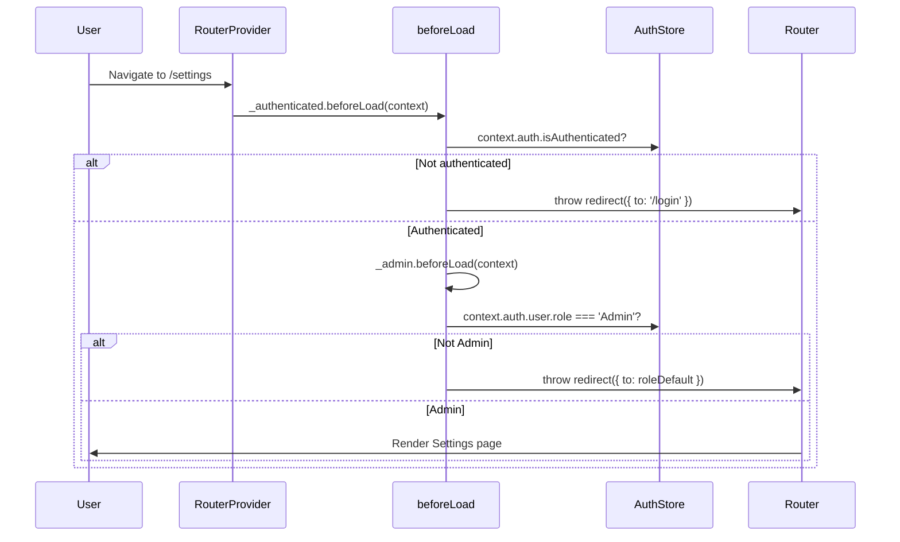

# refactor: Migrate routing to TanStack Router and UI to HeroUI

## Overview

Replace `react-router-dom` with `@tanstack/react-router` (file-based routing) and migrate the UI foundation from Radix UI / Shadcn to HeroUI (formerly NextUI). Opportunistically extract `useState` sprawl into Zustand stores or TanStack Query as files are touched. Update Vite build configuration to reflect the new dependency graph.

This is a two-phase migration executed sequentially: **Phase 1 (Router)** lands first to isolate routing risk, then **Phase 2 (UI)** replaces the component library.

## Problem Frame

The client codebase has outgrown its initial architecture. `App.tsx` manages 33 route entries plus 4 special cases via a manual `RouteConfig[]` table. Components suffer from `useState` sprawl. The UI layer depends on 16 `@radix-ui/*` packages wrapped through 20 Shadcn primitives. The team wants a more scalable routing architecture (TanStack Router with file-based routing) and a modern component library (HeroUI) that embraces its own design system rather than maintaining custom Shadcn wrappers. *(see origin: docs/brainstorms/2026-08-20-architecture-refactor-requirements.md)*

## Requirements Trace

**Phase 1: Routing & Folder Structure**
- R1. Replace `react-router-dom` with `@tanstack/react-router`
- R2. Implement TanStack Router's file-based routing inside `src/routes/`
- R2a. Install `@tanstack/router-plugin` and configure it in `vite.config.ts`
- R3. Remove manual route definitions from `src/app/App.tsx`
- R4. Retain business logic, components, and domain boundaries within `src/features/`

**Phase 2: UI Library Migration**
- R6. Remove all `@radix-ui` dependencies
- R7. Install and configure HeroUI and `framer-motion`
- R8. Replace all Radix-based components with HeroUI equivalents
- R9. Embrace HeroUI's default design system

**Cross-Phase**
- R5. Opportunistically refactor `useState` sprawl into Zustand or TanStack Query
- R10. Update `manualChunks` in `vite.config.ts`

## Scope Boundaries

- Do not rewrite backend APIs or data models *(see origin)*
- State refactoring is opportunistic — only when touching files for UI/Router migrations *(see origin)*
- Not upgrading Tailwind CSS to v4 (staying on v3.4); use HeroUI v2 which targets Tailwind v3
- Not upgrading React to v19 — staying on React 18.3
- BroadcastChannel improvements (POS ↔ CustomerDisplay sync bugs) are out of scope unless a file is already being touched for the migration
- Dead code cleanup (`Collections.tsx`, `Warranty.tsx`) is opportunistic, not required

## Context & Research

### Relevant Code and Patterns

- `client/src/app/App.tsx` — 33-route `RouteConfig[]` + 4 special routes (login, customer-display, /locations redirect, wildcard)
- `client/src/app/Sidebar.tsx` — `navSections[]` with duplicated route path strings (Global String-Coupling Contract)
- `client/src/app/session.ts` — Auth-port inversion (`setAuthPort`) and logout-teardown inversion (`onSessionEvent('logout')`)
- `client/src/app/Layout.tsx` — App shell with Sidebar + main outlet
- `client/src/features/auth/components/ProtectedRoute.tsx` — Role-based route guard wrapper
- `client/src/features/auth/store/authStore.ts` — Zustand auth state (persisted as `moon-auth`)
- `client/src/shared/store/settingsStore.ts` — Theme + locale, synchronous hydration in `main.tsx`
- `client/src/shared/ui/` — 20 Shadcn wrappers over Radix primitives
- `client/src/shared/lib/editorDialog.ts` — `useEditorDialog` reducer for CRUD modals
- `client/src/shared/lib/resource.ts` — `resource<T>()` data fetching pattern
- `client/src/shared/lib/storageKeys.ts` — 5 immutable localStorage persist keys
- `client/vite.config.ts` — Vite 5.4 with PWA, manualChunks, `@` path alias
- `client/src/shared/tests/setup.ts` — Vitest setup with Radix-specific polyfills

### Institutional Learnings

- **RTL-first**: Arabic is the default locale; all layouts use Tailwind logical properties (`ms-`, `me-`, `ps-`, `pe-`, `start-`, `end-`)
- **Storage key immutability**: The 5 persisted localStorage keys (`moon-auth`, `moon-cart-recovery`, `moon-held-carts`, `moon-offline-queue`, `moon-settings`) must never be renamed — doing so drops user sessions, carts, and offline queues
- **Auth-port inversion**: `shared/lib/transport/` never imports from `features/auth`; `app/session.ts` bridges the gap
- **Workbox 3MB cache limit**: Any single chunk exceeding 3MB is silently dropped from the precache manifest, breaking offline capabilities
- **`eslint-plugin-boundaries`**: Enforces the 3-layer architecture; `shared/` must never import from `features/` or `app/`
- **Zero circular dependencies**: `npm run lint:cycles` (madge) must remain green; Zustand stores evaluate at module execution time
- **Zod localization**: Module-level `tStandalone()` calls freeze validation messages to the language active at import time — schemas must use dynamic factory functions (`getSchema(t)`)
- **`useEditorDialog` lifecycle**: The `setOpen(true)` dispatch sends `openNew` which erases `editingId` — must be adapted before HeroUI modals replace Radix dialogs

### External References

- TanStack Router file-based routing: `@tanstack/react-router ^1.100+`, `@tanstack/router-plugin ^1.100+`
- HeroUI v2 (Tailwind v3 compatible): `@heroui/react ^2.6+`, `@heroui/theme ^2.4+`
- Framer Motion: `framer-motion ^11.0+` (HeroUI v2 peer dependency)
- React Aria `I18nProvider` required for RTL coordinate calculations in HeroUI components
- HeroUI `Select` uses `Set<Key>` instead of single string values — requires `Controller` wrapper with react-hook-form

## Key Technical Decisions

- **TanStack Router plugin placement**: `TanStackRouterVite()` must be placed *before* `react()` in `vite.config.ts` plugins array so route tree codegen runs before JSX compilation
- **Auth guards via `beforeLoad` + router context**: Replace `<ProtectedRoute>` wrapper with TanStack Router's `beforeLoad` redirects on pathless layout routes (`_authenticated.tsx`, `_admin.tsx`). Auth state flows via `RouterProvider context={{ auth }}` from Zustand, ensuring reactive re-evaluation on login/logout
- **Pathless layout groups for role isolation**: Admin-only routes nest under `_authenticated/_admin/`, multi-role routes sit directly under `_authenticated/`. Public routes (`login.tsx`, `customer-display.tsx`) sit at `src/routes/` root, outside the `_authenticated` group
- **`autoCodeSplitting: true`**: TanStack Router's Vite plugin automatically code-splits component code from loaders/guards, preserving the current eager/lazy split without manual `.lazy.tsx` files
- **HeroUI v2 (not v3)**: v2 targets Tailwind v3 (current stack); v3 requires Tailwind v4
- **React Aria `I18nProvider`**: Required at the app root for correct RTL coordinate calculations in all HeroUI components (popovers, dropdowns, tabs, sliders)
- **HeroUI theme mapping to Moon tokens**: Map HeroUI semantic colors (`primary`, `focus`, `background`, `surface`) to existing Moon palette (`#C9A96E` gold, `#0D0D0D` dark bg) via the `heroui()` Tailwind plugin
- **Sidebar migration to `<Link>` from TanStack Router**: Eliminates the string-coupling contract by using type-safe route paths with compile-time validation
- **`useEditorDialog` adapter**: Update the reducer to accept HeroUI's `onOpenChange(boolean)` lifecycle without erasing edit state on `setOpen(true)`
- **Router cache invalidation on logout**: Add `router.invalidate()` to the logout teardown in `session.ts` to prevent loader cache leakage across user sessions
- **`onAuthFailure` migration**: Replace `window.location.href = '/login'` with `router.navigate({ to: '/login' })` + `router.invalidate()` to avoid full-page reloads that destroy in-memory state

## Open Questions

### Resolved During Planning

- **Q: What is the TanStack Router file tree structure?** → See High-Level Technical Design below. 33 routes map to files under `src/routes/_authenticated/` (multi-role) and `src/routes/_authenticated/_admin/` (Admin-only). Public routes (`login.tsx`, `customer-display.tsx`) and utilities (`locations.tsx` redirect, `$.tsx` catch-all) sit at the `src/routes/` root.

- **Q: How should auth checks work in TanStack Router?** → Via `beforeLoad` on pathless layout routes. `_authenticated.tsx` checks `context.auth.isAuthenticated` and redirects to `/login`. `_admin.tsx` checks `context.auth.user?.role === 'Admin'` and redirects to the user's role-default route. Multi-role routes (e.g., `/pos` for Admin+Cashier) define inline `beforeLoad` with an `ALLOWED_ROLES` array. Auth state is injected reactively via `<RouterProvider context={{ auth }}>`.

- **Q: Which Zustand stores need to be created?** → No new global stores are required for this refactor. The 5 existing persisted stores cover all current cross-component state. Opportunistic `useState` extraction (R5) should use local component-scoped Zustand stores or promote existing `useState` into the nearest feature-level hook, not create new global stores unless the state is genuinely cross-feature.

- **Q: What about ESLint boundaries for `src/routes/`?** → `eslint.config.mjs` must be updated to define `src/routes/**` as a new element type allowed to import from `features/` barrels and `shared/`. This must happen before generating route files.

- **Q: What about `manualChunks` during the transition?** → Phase 1 updates `vendor-react` to remove `react-router-dom` and adds `vendor-router` for `@tanstack/react-router`. Phase 2 replaces `vendor-ui` Radix entries with `@heroui/react` and adds `vendor-motion` for `framer-motion`. Each phase keeps the build green by updating chunks atomically with dependency changes.

### Deferred to Implementation

- **Exact route file contents for all 33+ routes** — route files are structurally identical (thin wrappers importing from `features/`); the exact import paths will be confirmed when creating each file
- **HeroUI component-level styling details** — exact `variant`, `color`, and `radius` props per component depend on visual iteration after the HeroUI theme is configured
- **Which specific pages have `useState` worth extracting** — will be assessed opportunistically as pages are touched; not inventoried upfront
- **Framer Motion chunk size under the 3MB Workbox limit** — must be measured after the build; `vendor-motion` isolation keeps it monitorable

## High-Level Technical Design

*Directional guidance — not implementation specification.*

### TanStack Router File Tree

```text
client/src/routes/
├── __root.tsx                         # Root layout: <Outlet />, PWAInstallPrompt, DevTools
├── login.tsx                          # Public: reverse-auth guard, redirects if authenticated
├── customer-display.tsx               # Public: no auth, full-screen customer-facing
├── locations.tsx                      # Redirect → /branches
├── $.tsx                              # Catch-all → role-default route
├── _authenticated.tsx                 # Pathless layout: auth guard + <Layout><Outlet /></Layout>
└── _authenticated/
    ├── _admin.tsx                     # Pathless layout: Admin role guard
    ├── _admin/
    │   ├── index.tsx                  # / (Dashboard — eager)
    │   ├── users.tsx                  # /users
    │   ├── settings.tsx               # /settings
    │   ├── audit-log.tsx              # /audit-log
    │   ├── categories.tsx             # /categories
    │   ├── customers.tsx              # /customers
    │   ├── distributors.tsx           # /distributors
    │   ├── vendors.tsx                # /vendors
    │   ├── purchase-orders.tsx        # /purchase-orders
    │   ├── expenses.tsx               # /expenses
    │   ├── segments.tsx               # /segments
    │   ├── feedback.tsx               # /feedback
    │   ├── promotions.tsx             # /promotions
    │   ├── gift-cards.tsx             # /gift-cards
    │   ├── stock-count.tsx            # /stock-count
    │   ├── bundles.tsx                # /bundles
    │   ├── backup.tsx                 # /backup
    │   ├── branches.tsx               # /branches
    │   ├── storefront.tsx             # /storefront
    │   ├── online-orders.tsx          # /online-orders
    │   ├── exports.tsx                # /exports
    │   ├── report-builder.tsx         # /report-builder
    │   ├── smart-pricing.tsx          # /smart-pricing
    │   ├── ai-insights.tsx            # /ai-insights
    │   └── analytics.tsx              # /analytics
    ├── pos.tsx                        # /pos (Admin, Cashier — eager)
    ├── inventory.tsx                  # /inventory (Admin, Cashier — eager)
    ├── barcode.tsx                    # /barcode (Admin, Cashier)
    ├── sales.tsx                      # /sales (Admin, Cashier)
    ├── layaway.tsx                    # /layaway (Admin, Cashier)
    ├── register.tsx                   # /register (Admin, Cashier)
    ├── deliveries.tsx                 # /deliveries (Admin, Delivery)
    └── shifts.tsx                     # /shifts (Admin, Cashier, Delivery)
```

### Auth Flow Sequence (Directional)



### Component Migration Mapping (Directional)

| Radix / Shadcn (`shared/ui/`) | HeroUI Replacement | Key Adaptation |
|---|---|---|
| `dialog.tsx` (Dialog) | `Modal`, `ModalContent`, `ModalHeader`, `ModalBody`, `ModalFooter` | Adapt `useEditorDialog` for HeroUI `onOpenChange` lifecycle |
| `alert-dialog.tsx` | `Modal` with `isDismissable={false}` | Map confirm/cancel actions |
| `select.tsx` | `Select`, `SelectItem` | Convert string value to `Set<Key>` with `Controller` |
| `tabs.tsx` | `Tabs`, `Tab` | Direct mapping; built-in animated indicator |
| `dropdown-menu.tsx` | `Dropdown`, `DropdownTrigger`, `DropdownMenu`, `DropdownItem` | Use `onAction` callback |
| `button.tsx` | `Button` | Map `variant` props to HeroUI variants |
| `input.tsx` / `textarea.tsx` | `Input` / `Textarea` | Map `isInvalid` + `errorMessage` from form errors |
| `checkbox.tsx` | `Checkbox` | Direct mapping |
| `radio-group.tsx` | `RadioGroup`, `Radio` | Direct mapping |
| `switch.tsx` | `Switch` | Direct mapping |
| `popover.tsx` | `Popover`, `PopoverTrigger`, `PopoverContent` | Remove manual `PopoverPortal` |
| `tooltip.tsx` | `Tooltip` | Simplify to single component |
| `separator.tsx` | `Divider` | Direct replacement |
| `skeleton.tsx` | `Skeleton` | Direct replacement |
| `badge.tsx` | `Chip` | Map variants |
| `label.tsx` | HeroUI inputs have built-in labels | Remove standalone `Label` |
| `calendar.tsx` (react-day-picker) | `DatePicker`, `Calendar` | Uses `@internationalized/date`; supports Hijri calendar |
| `sheet.tsx` | `Drawer` (HeroUI) or `Modal` with `placement` | Adapt RTL side logic |
| `card.tsx` | `Card`, `CardHeader`, `CardBody`, `CardFooter` | Direct mapping |

## Implementation Units

### Phase 1: Routing & Folder Structure

- [ ] **Unit 1: Infrastructure — Vite plugin, ESLint boundaries, router scaffold**

  **Goal:** Set up TanStack Router infrastructure so file-based route generation works and ESLint/CI remain green.

  **Requirements:** R2a, R10 (partial)

  **Dependencies:** None

  **Files:**
  - Modify: `client/vite.config.ts`
  - Modify: `client/package.json`
  - Modify: `eslint.config.mjs`
  - Create: `client/src/app/router.ts`
  - Create: `client/src/routes/__root.tsx`
  - Create: `client/src/routeTree.gen.ts` (auto-generated)

  **Approach:**
  - Install `@tanstack/react-router`, `@tanstack/router-plugin`, `@tanstack/router-devtools`
  - Add `TanStackRouterVite({ routesDirectory: './src/routes', generatedRouteTree: './src/routeTree.gen.ts', autoCodeSplitting: true })` *before* `react()` in Vite plugins
  - Update `manualChunks`: remove `react-router-dom` from `vendor-react`, add `'vendor-router': ['@tanstack/react-router']`
  - Update `eslint.config.mjs` to register `src/routes/**` as a recognized element type, allowed to import from `features/` barrels and `shared/`
  - Create `router.ts` exporting the `createRouter()` singleton with `RouterContext` interface (typed `auth` context)
  - Create `__root.tsx` with `createRootRouteWithContext<RouterContext>()`, rendering `<Outlet />`, `<PWAInstallPrompt />`, and dev-only `<TanStackRouterDevtools />`
  - Do NOT remove `react-router-dom` yet — both routers coexist momentarily until Unit 2 completes

  **Patterns to follow:**
  - `client/vite.config.ts` plugin array structure
  - `eslint.config.mjs` boundaries element definitions

  **Test expectation: none** — pure infrastructure scaffolding with no behavioral change; verified by build + lint passing.

  **Verification:**
  - `npm run dev` starts without errors and generates `routeTree.gen.ts`
  - `npm run lint` passes with the new `src/routes/` boundary rules
  - `npm run build` succeeds with updated `manualChunks`

---

- [ ] **Unit 2: Auth guard layout routes and public routes**

  **Goal:** Implement the `_authenticated` and `_admin` pathless layout routes with `beforeLoad` auth/role guards, plus the public routes (`login`, `customer-display`, `locations` redirect, catch-all).

  **Requirements:** R1, R2, R3 (partial)

  **Dependencies:** Unit 1

  **Files:**
  - Create: `client/src/routes/_authenticated.tsx`
  - Create: `client/src/routes/_authenticated/_admin.tsx`
  - Create: `client/src/routes/login.tsx`
  - Create: `client/src/routes/customer-display.tsx`
  - Create: `client/src/routes/locations.tsx`
  - Create: `client/src/routes/$.tsx`
  - Modify: `client/src/app/session.ts`
  - Test: `client/src/routes/__tests__/auth-guards.test.tsx`

  **Approach:**
  - `_authenticated.tsx`: pathless layout with `beforeLoad` checking `context.auth.isAuthenticated`, redirecting to `/login`. Component renders `<Layout><Outlet /></Layout>`
  - `_admin.tsx`: pathless layout with `beforeLoad` checking `context.auth.user?.role === 'Admin'`, redirecting to role-default route
  - `login.tsx`: reverse auth guard — if already authenticated, redirect to role-default. Add `validateSearch` for optional `redirect` param (post-login redirect)
  - `customer-display.tsx`: no auth guard, renders `CustomerDisplay` directly outside the authenticated layout
  - `locations.tsx`: `beforeLoad` throws `redirect({ to: '/branches', replace: true })`
  - `$.tsx`: catch-all redirecting to role-default route
  - Update `session.ts` `onAuthFailure`: import the router singleton and use `router.navigate({ to: '/login' })` + `router.invalidate()` instead of `window.location.href`
  - Add `router.invalidate()` to the logout teardown subscription

  **Test scenarios:**
  - Happy path: Authenticated Admin navigating to `/_authenticated/_admin/settings` → renders Settings page
  - Happy path: Authenticated Cashier navigating to `/_authenticated/pos` → renders POS page
  - Edge case: Unauthenticated user navigating to `/settings` → redirected to `/login`
  - Edge case: Cashier navigating to `/settings` (Admin-only) → redirected to `/pos`
  - Edge case: Delivery user navigating to `/pos` (Admin+Cashier) → redirected to `/deliveries`
  - Edge case: Authenticated user navigating to `/login` → redirected to role-default route
  - Edge case: Navigation to `/locations` → redirected to `/branches`
  - Edge case: Navigation to `/nonexistent` → catch-all redirects to role-default
  - Integration: `onAuthFailure` fires → user is redirected to `/login` via router (not full page reload), router cache is invalidated

  **Verification:**
  - All auth guard tests pass
  - Unauthenticated access redirects to `/login` for any protected route
  - `/customer-display` renders without auth or Layout wrapper
  - Logout clears router cache (no stale loader data on re-login as different role)

---

- [ ] **Unit 3: Migrate all 33 page routes to file-based routing**

  **Goal:** Create route files for all 33 pages, wire up `main.tsx` to use `<RouterProvider>`, remove the old `App.tsx` route table, and uninstall `react-router-dom`.

  **Requirements:** R1, R2, R3, R4, R10 (partial)

  **Dependencies:** Unit 2

  **Files:**
  - Create: `client/src/routes/_authenticated/_admin/index.tsx` (Dashboard)
  - Create: `client/src/routes/_authenticated/_admin/users.tsx`
  - Create: `client/src/routes/_authenticated/_admin/settings.tsx`
  - Create: 22 more admin route files (see file tree in Technical Design)
  - Create: `client/src/routes/_authenticated/pos.tsx`
  - Create: `client/src/routes/_authenticated/inventory.tsx`
  - Create: `client/src/routes/_authenticated/barcode.tsx`
  - Create: `client/src/routes/_authenticated/sales.tsx`
  - Create: `client/src/routes/_authenticated/layaway.tsx`
  - Create: `client/src/routes/_authenticated/register.tsx`
  - Create: `client/src/routes/_authenticated/deliveries.tsx`
  - Create: `client/src/routes/_authenticated/shifts.tsx`
  - Modify: `client/src/app/main.tsx`
  - Modify: `client/src/app/App.tsx` (gutted or deleted)
  - Modify: `client/package.json` (remove `react-router-dom`)
  - Modify: `client/vite.config.ts` (remove `react-router-dom` from `vendor-react` chunk)
  - Test: `client/src/routes/__tests__/route-rendering.test.tsx`

  **Approach:**
  - Each route file is a thin wrapper: imports from `features/<slice>` barrel, calls `createFileRoute`, defines `beforeLoad` for multi-role routes (POS, inventory, barcode, sales, layaway, register, deliveries, shifts)
  - Admin-only routes under `_admin/` inherit the Admin guard automatically — no per-route `beforeLoad` needed
  - `main.tsx`: replace `<BrowserRouter><App /></BrowserRouter>` with `<RouterProvider router={router} context={{ auth }}>` where `auth` reads from `useAuthStore()`
  - Wrap the `RouterProvider` in `QueryClientProvider` and any other existing providers
  - Uninstall `react-router-dom`; update `manualChunks` to remove it from `vendor-react`
  - Business logic remains in `src/features/` — route files only import and render page components (R4)

  **Test scenarios:**
  - Happy path: Each of the 33 routes renders its correct page component when navigated to
  - Happy path: Dashboard (`/`) renders for Admin users
  - Edge case: POS (`/pos`) accessible by Admin and Cashier but not Delivery
  - Edge case: Deliveries (`/deliveries`) accessible by Admin and Delivery but not Cashier
  - Error path: Navigating to a route with wrong role redirects to role-default
  - Integration: Full navigation flow — login → dashboard → pos → logout → redirected to login

  **Verification:**
  - `react-router-dom` is removed from `package.json`
  - All 33 routes resolve to the correct feature page components
  - `npm run build` succeeds with no `react-router-dom` references
  - `npm run lint` and `npm run lint:cycles` pass

---

- [ ] **Unit 4: Migrate Sidebar and navigation to TanStack Router `<Link>`**

  **Goal:** Replace `react-router-dom` `<NavLink>` in Sidebar with TanStack Router's type-safe `<Link>`, eliminating the string-coupling contract for route paths.

  **Requirements:** R1, R3

  **Dependencies:** Unit 3

  **Files:**
  - Modify: `client/src/app/Sidebar.tsx`
  - Modify: `client/src/app/NotificationCenter.tsx`
  - Test: `client/src/app/__tests__/Sidebar.test.tsx`

  **Approach:**
  - Replace all `import { NavLink, useNavigate } from 'react-router-dom'` with `import { Link, useNavigate, useRouter } from '@tanstack/react-router'`
  - Replace `<NavLink to="/pos" end ...>` with `<Link to="/pos" activeProps={{ className: '...' }} activeOptions={{ exact: true }}>` (for root route)
  - `NotificationCenter.tsx`: wrap `navigate(notif.link)` in a safe navigation adapter that validates the link is a known route path, falling back to `router.navigate({ to: '/' })` for invalid backend notification links
  - The `handleLogout` function replaces `navigate('/login')` with `navigate({ to: '/login' })`

  **Patterns to follow:**
  - Existing `navSections[]` structure — preserve section grouping and role filtering
  - Mobile bottom nav and "More" sheet patterns

  **Test scenarios:**
  - Happy path: Desktop sidebar renders all role-appropriate nav items for Admin (all sections visible)
  - Happy path: Cashier sidebar renders only Operations and Products items matching `['Admin', 'Cashier']` roles
  - Happy path: Clicking a nav item navigates to the correct route
  - Edge case: Active route shows gold highlight styling
  - Edge case: Root route (`/`) uses exact matching to avoid false active state
  - Edge case: NotificationCenter receives invalid backend link string → navigates to role-default instead of crashing
  - Integration: Logout button → navigates to `/login`, auth state cleared

  **Verification:**
  - No `react-router-dom` imports remain anywhere in the codebase
  - TypeScript catches any invalid route paths at compile time
  - Mobile bottom nav and "More" sheet work identically to before
  - `npm run lint` passes

---

- [ ] **Unit 5: Test harness migration and Phase 1 stabilization**

  **Goal:** Update the test infrastructure to support TanStack Router, fix all broken tests from Phase 1, and ensure CI is green.

  **Requirements:** R1 (stabilization)

  **Dependencies:** Unit 4

  **Files:**
  - Create: `client/src/shared/tests/routerTestUtils.tsx`
  - Modify: `client/src/shared/tests/setup.ts`
  - Modify: all existing test files that import from `react-router-dom` (17 test suites)
  - Test: all existing test suites

  **Approach:**
  - Create `routerTestUtils.tsx` exporting a `renderWithRouter(component, { initialRoute, authState })` helper that creates an in-memory TanStack Router with `createMemoryHistory()` and wraps the component in `RouterProvider` + `QueryClientProvider`
  - Update all test files replacing `MemoryRouter` / `BrowserRouter` wrappers with `renderWithRouter`
  - Keep existing Radix polyfills in `setup.ts` (still needed until Phase 2)
  - Run full test suite and fix any breakages

  **Test scenarios:**
  - Happy path: `renderWithRouter(<Inventory />, { initialRoute: '/inventory', authState: { isAuthenticated: true, user: adminUser } })` renders the Inventory page
  - Happy path: All 17 existing test suites pass with the new router test harness
  - Edge case: `renderWithRouter` with unauthenticated state → component redirects (auth guard fires in test context)
  - Error path: Test with invalid route path → notFound component renders

  **Verification:**
  - `npm run test` passes all 17+ test suites
  - No imports from `react-router-dom` in any test file
  - CI pipeline is green

---

### Phase 2: UI Library Migration

- [ ] **Unit 6: HeroUI infrastructure — install, configure Tailwind, providers**

  **Goal:** Install HeroUI, configure the Tailwind plugin with Moon's custom theme tokens, set up `HeroUIProvider` with TanStack Router navigation integration, and add React Aria's `I18nProvider` for RTL support.

  **Requirements:** R7, R9

  **Dependencies:** Unit 5 (Phase 1 complete)

  **Files:**
  - Modify: `client/package.json`
  - Modify: `client/tailwind.config.js` (or `.ts`)
  - Modify: `client/vite.config.ts` (manualChunks — add `vendor-ui-hero` and `vendor-motion`)
  - Create: `client/src/app/providers/UIProvider.tsx`
  - Modify: `client/src/app/main.tsx`
  - Modify: `client/src/shared/tests/setup.ts`
  - Test: `client/src/app/__tests__/UIProvider.test.tsx`

  **Approach:**
  - Install `@heroui/react`, `@heroui/theme`, `framer-motion`
  - Add `heroui()` plugin to `tailwind.config.js` with Moon theme mapping: `primary: '#C9A96E'` (gold), `focus: '#C9A96E'`, dark background `#0D0D0D`, surface `#171717`
  - Add `node_modules/@heroui/theme/dist/**/*.{js,ts,jsx,tsx}` to Tailwind `content` array
  - Create `UIProvider.tsx` wrapping `HeroUIProvider` (with `navigate` and `useHref` from TanStack Router) and React Aria `I18nProvider` (with locale from `useSettingsStore`)
  - Wire `UIProvider` into `main.tsx` provider tree
  - Update `manualChunks`: add `'vendor-motion': ['framer-motion']`, `'vendor-ui-hero': ['@heroui/react']`; keep Radix chunks temporarily (coexistence during incremental migration)
  - Update `setup.ts` with `IntersectionObserver` polyfill for Framer Motion
  - Verify that `HeroUIProvider` + `I18nProvider` respects `settingsStore.locale` for RTL and `settingsStore.theme` for dark/light mode

  **Test scenarios:**
  - Happy path: `UIProvider` renders children with HeroUI context available
  - Happy path: Dark mode toggle → `document.documentElement.classList` has `dark` class, HeroUI components switch theme
  - Happy path: Arabic locale → `document.documentElement.dir` is `rtl`, `I18nProvider locale` is `ar-SA`
  - Edge case: English locale → `dir` is `ltr`, `I18nProvider locale` is `en-US`
  - Integration: HeroUI `<Button href="/pos">` navigates through TanStack Router (not native anchor)
  - Integration: `npm run build` succeeds; `vendor-motion` and `vendor-ui-hero` chunks are each under 3MB

  **Verification:**
  - HeroUI components render correctly in both dark and light themes
  - RTL layout mirrors correctly with Arabic locale
  - Build produces separate `vendor-motion` and `vendor-ui-hero` chunks, both under 3MB
  - All existing tests still pass (Radix components unchanged)

---

- [ ] **Unit 7: Migrate shared/ui primitives and adapt useEditorDialog**

  **Goal:** Replace all 20 Shadcn/Radix wrappers in `shared/ui/` with HeroUI equivalents. Adapt `useEditorDialog` for HeroUI modal lifecycle. Remove all `@radix-ui` dependencies.

  **Requirements:** R6, R8, R9, R10 (final)

  **Dependencies:** Unit 6

  **Files:**
  - Modify: all 20 files in `client/src/shared/ui/` (dialog, alert-dialog, select, tabs, dropdown-menu, button, input, textarea, checkbox, radio-group, switch, popover, tooltip, separator, skeleton, badge, label, calendar, sheet, card)
  - Modify: `client/src/shared/lib/editorDialog.ts`
  - Modify: `client/package.json` (remove 16 `@radix-ui/*` packages, `cmdk`, `react-day-picker`, `class-variance-authority`)
  - Modify: `client/vite.config.ts` (remove Radix from `vendor-ui` chunk, consolidate to HeroUI chunks)
  - Modify: `client/src/shared/tests/setup.ts` (remove Radix-specific polyfills)
  - Test: `client/src/shared/ui/__tests__/primitives.test.tsx`
  - Test: `client/src/shared/lib/editorDialog.test.ts` (update)

  **Approach:**
  - Replace each `shared/ui/` file following the Component Migration Mapping table in the Technical Design section
  - **Critical — `useEditorDialog` adaptation**: Modify the reducer so `setOpen(true)` dispatches `resume` (preserves `editingId`) rather than `openNew`. Add a separate `openNew()` action for creating new items. This prevents HeroUI's `onOpenChange(true)` from wiping edit state
  - Preserve exported component names where possible to minimize import changes across feature pages (e.g., still export `Dialog` re-exporting HeroUI `Modal`)
  - Replace `cn()` class merging with HeroUI's built-in `classNames` prop where applicable; keep `cn()` for custom compositions
  - Remove Radix-specific polyfills from `setup.ts` (pointer capture, etc.)
  - Add React Aria test polyfills as needed
  - Update test helpers: `openSelect` must use `userEvent.click()` instead of `fireEvent.pointerDown` for React Aria compatibility
  - Uninstall all 16 `@radix-ui/*` packages, `cmdk`, `react-day-picker`, `class-variance-authority`

  **Test scenarios:**
  - Happy path: `Modal` opens via `useEditorDialog.openNew()`, form renders empty, close dismisses
  - Happy path: `Modal` opens via `useEditorDialog.openEdit(id, data)`, form renders with pre-filled data, `onOpenChange(true)` does NOT reset edit state
  - Happy path: `Select` renders options, selecting one updates form state via `Controller` + `Set<Key>` conversion
  - Happy path: `Tabs` renders with animated indicator, switching tabs shows correct content
  - Edge case: `Modal` with `isDismissable={false}` (alert dialog replacement) — clicking backdrop does not close
  - Edge case: RTL layout — `Dropdown` opens on correct side, `Popover` positions correctly
  - Edge case: `DatePicker` with Arabic locale — calendar renders correctly
  - Error path: `Input` with `isInvalid={true}` and `errorMessage` — displays localized error below field
  - Integration: Full CRUD workflow — open DataTable → click Edit on row → Modal opens with row data → edit → save → Modal closes → focus returns to row

  **Verification:**
  - All `@radix-ui/*` packages removed from `package.json`
  - No Radix imports remain in the codebase
  - All CRUD workflows (edit, create, delete) work correctly with HeroUI Modals
  - RTL layout correct in all modal, dropdown, and popover components
  - `npm run build` succeeds with updated chunks

---

- [ ] **Unit 8: Feature page sweep, test stabilization, and final cleanup**

  **Goal:** Update all feature page components that consume `shared/ui/` primitives. Fix any HeroUI-specific prop changes (e.g., Select `Set<Key>`, Input `isInvalid`). Stabilize all tests. Final build validation.

  **Requirements:** R8, R9, R5 (opportunistic), R10 (final validation)

  **Dependencies:** Unit 7

  **Files:**
  - Modify: Feature pages across all 9 slices that use Dialog, Select, Tabs, DropdownMenu, Sheet, etc.
  - Modify: `client/src/shared/components/DataTable.tsx` (if adapting to HeroUI Table)
  - Modify: all 17 test files (update assertions for HeroUI DOM structure)
  - Modify: `client/vite.config.ts` (final `manualChunks` cleanup)
  - Test: all test suites

  **Approach:**
  - Sweep all feature pages updating any broken prop interfaces (HeroUI `Select` `selectedKeys` vs string value, `Input` `isInvalid` vs `aria-invalid`, etc.)
  - If `shared/ui/` re-exports preserved the old API surface, most pages need minimal changes
  - **Opportunistic R5**: While touching pages, extract egregious `useState` sprawl into Zustand slices or custom hooks. Prioritize pages with 5+ `useState` calls
  - Update test assertions for HeroUI DOM: `screen.getByRole('dialog')` → verify HeroUI modal DOM slot hierarchy, update `openSelect` helpers for React Aria
  - Final `manualChunks` cleanup: remove any remaining Radix references, verify chunk sizes under 3MB Workbox limit
  - Run `npm run lint`, `npm run lint:cycles`, `npm run test`, `npm run build` as final validation
  - Verify PWA precache manifest includes critical route chunks

  **Execution note:** Run the full test suite after each feature slice sweep to catch regressions incrementally.

  **Test scenarios:**
  - Happy path: Each major feature page renders correctly — POS, Dashboard, Inventory, Sales, Deliveries, Settings
  - Happy path: CRUD workflows across Inventory (create product, edit, delete) work end-to-end
  - Happy path: POS workflow — add items, apply discount, checkout — renders correctly with HeroUI components
  - Edge case: RTL layout on all pages — sidebar, modals, dropdowns, tables mirror correctly
  - Edge case: Theme toggle (dark ↔ light) — all HeroUI components update correctly
  - Edge case: Mobile bottom nav and "More" sheet (if migrated from Radix Sheet) work correctly
  - Error path: Form validation errors display correctly in Arabic with localized Zod messages
  - Integration: Full offline POS workflow — add items while offline → queue syncs when online
  - Integration: Login as Admin → navigate → switch to Cashier role view → correct routes accessible

  **Verification:**
  - `npm run lint` passes
  - `npm run lint:cycles` reports zero circular dependencies
  - `npm run test` passes all test suites
  - `npm run build` succeeds with no warnings about missing modules
  - All vendor chunks under 3MB Workbox limit
  - `react-router-dom` and all `@radix-ui/*` completely absent from `package.json` and lockfile

## System-Wide Impact

- **Interaction graph:** The `session.ts` composition root must gain a dependency on the router singleton (for `router.navigate` and `router.invalidate` on auth failure and logout). `_authenticated.tsx` layout route replaces the `ProtectedRoute` component as the auth gatekeeper. `HeroUIProvider.navigate` hooks into TanStack Router for internal HeroUI link navigation.
- **Error propagation:** Route-level errors caught by TanStack Router's `errorComponent` (defined on `__root.tsx` or per-route). Feature-level errors still caught by `ErrorBoundary` wrappers. Auth failures propagate through `session.ts` → `router.navigate` instead of `window.location.href`.
- **State lifecycle risks:** TanStack Router loader cache must be invalidated on logout (`router.invalidate()`) to prevent cross-session data leakage. `useEditorDialog` reducer must be adapted before HeroUI modals to prevent edit-state erasure. Zustand persist keys are unchanged.
- **API surface parity:** Sidebar navigation, NotificationCenter navigation, and `session.ts` auth failure all must use TanStack Router navigation. No `react-router-dom` APIs should remain.
- **Integration coverage:** Auth flow (login → protected route → role guard → logout → cache clear) must be tested end-to-end with TanStack Router. CRUD dialog lifecycle (open → edit → save → close → focus restore) must be tested with HeroUI modals.
- **Unchanged invariants:** Backend APIs, Zustand store persist keys, `resource()` / `useApiQuery()` data fetching, `eslint-plugin-boundaries` layer rules (except adding `routes` element), `BroadcastChannel` POS↔CustomerDisplay sync protocol, offline queue behavior.

## Risks & Dependencies

| Risk | Mitigation |
|------|------------|
| Dual UI runtime (Radix + HeroUI coexisting in Phase 2 transition) bloats chunks past 3MB Workbox limit | Isolate HeroUI and Framer Motion into dedicated vendor chunks; monitor chunk sizes after each unit; Phase 2 removes Radix atomically in Unit 7 |
| HeroUI RTL rendering bugs without React Aria `I18nProvider` | Unit 6 installs `I18nProvider` at the app root before any HeroUI components are used; manual RTL visual verification on every component |
| `useEditorDialog.setOpen(true)` erasing edit state with HeroUI `onOpenChange` | Unit 7 explicitly adapts the reducer before any page migration; covered by dedicated test scenario |
| TanStack Router loader cache leaking Admin data to Cashier after re-login | `router.invalidate()` added to logout teardown in Unit 2; verified by integration test |
| 17 existing test suites breaking across both phases | Unit 5 (Phase 1) and Unit 8 (Phase 2) are dedicated stabilization units; `renderWithRouter` helper created early |
| `NotificationCenter` passes untyped backend strings to `router.navigate` | Unit 4 adds a safe navigation adapter with route validation fallback |
| PWA offline routes fail for lazy-loaded chunks | Critical routes (POS, Inventory, Register, Dashboard) use eager loading; Workbox precache for other common routes |
| ESLint `boundaries/no-unknown-files` blocks `src/routes/` files | Unit 1 updates ESLint config before generating any route files |

## Phased Delivery

### Phase 1 (Units 1–5): Routing Migration
- Lands TanStack Router with file-based routing
- Removes `react-router-dom` completely
- All routes, auth guards, and navigation working
- CI green, all tests passing

### Phase 2 (Units 6–8): UI Library Migration
- Lands HeroUI with RTL support
- Removes all Radix UI dependencies
- All components migrated
- CI green, all tests passing, chunks under 3MB

## Sources & References

- **Origin document:** [architecture-refactor-requirements.md](docs/brainstorms/2026-08-20-architecture-refactor-requirements.md)
- Related plan: [client-feature-slice-architecture-plan.md](docs/plans/2026-08-20-001-refactor-client-feature-slice-architecture-plan.md)
- Architecture docs: [ARCHITECTURE.md](docs/ARCHITECTURE.md), [CONVENTIONS.md](docs/CONVENTIONS.md)
- Tech debt: [TECH_DEBT.md](TECH_DEBT.md)
- Agent guidance: [CLAUDE.md](CLAUDE.md)
- TanStack Router docs: https://tanstack.com/router/latest
- HeroUI docs: https://heroui.com
- React Aria I18n: https://react-spectrum.adobe.com/react-aria/internationalization.html
