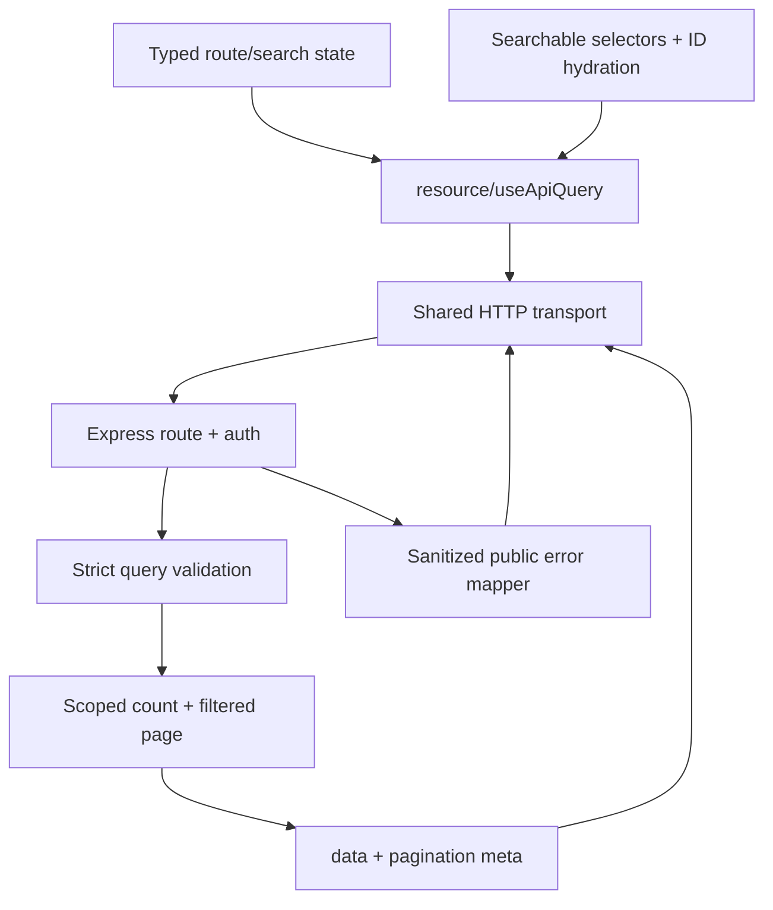
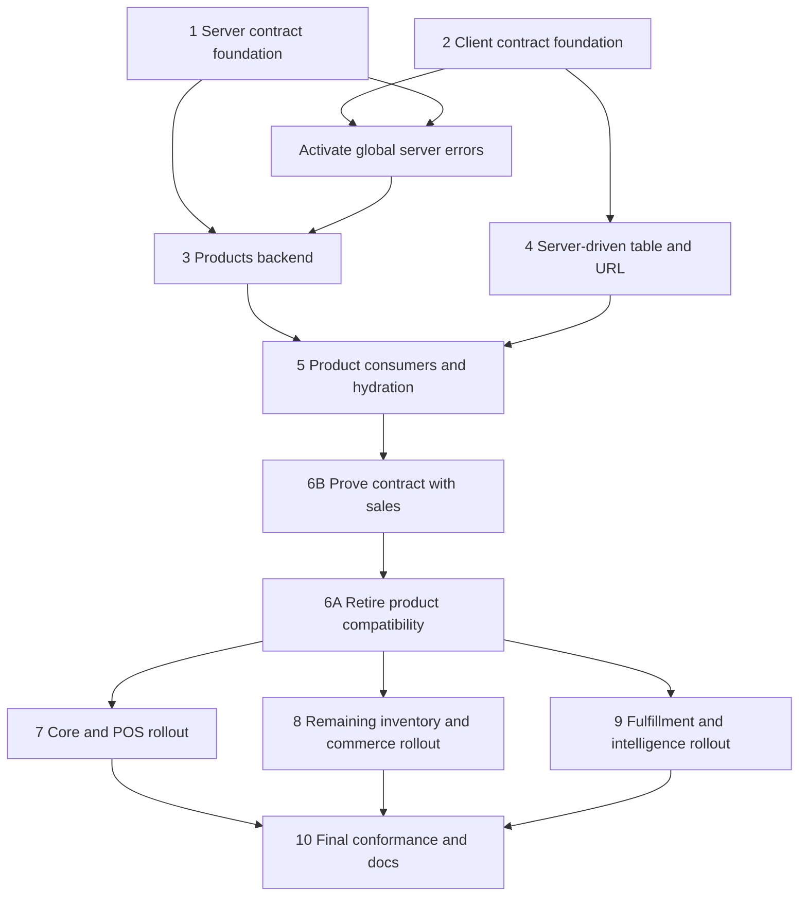
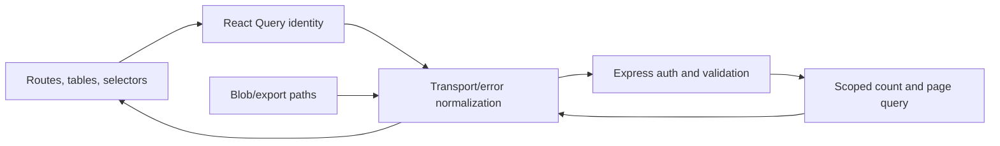

# refactor: Standardize API contracts and server-side collections

## Overview

Standardize every in-scope `/api/v1` JSON response around `{ data, meta? }` or `{ error }`, move user-facing collection search/filter/sort/pagination into PostgreSQL, and migrate React consumers domain-by-domain. Products and every product-list consumer are the reference slice; sales is the contrasting proof before mechanical rollout across the remaining modules (see origin: `docs/brainstorms/2026-08-22-api-response-and-server-listing-requirements.md`).

This is a deep, characterization-first refactor. Existing behavior, authorization, and workflows remain stable while shared seams and each domain migrate atomically.

## Problem Frame

Controllers currently emit several envelope and metadata variants, validate list queries permissively, and mix `limit`/snake_case parameters with newer conventions. React screens frequently request 100-200 rows and then filter or select locally. Enforcing pagination without migrating every consumer would truncate catalogs and break existing edits, POS favorites, bundles, purchase orders, deliveries, and layaway. The work must standardize the contract without creating a half-migrated client/server state.

## Requirements Trace

- **Response contract:** R1-R4, R18 define body-bearing success, structured/sanitized errors, mutation statuses, bodyless `204`, and file/operational exceptions.
- **Collections:** R5-R10, R19, R24, R31-R32 define backend list ownership, flat camelCase queries, pagination metadata, strict validation, lookup exceptions, authorization-before-count, low-stock filtering, out-of-range recovery, and deterministic ordering.
- **React behavior:** R11-R13, R23, R25-R30 define typed transport errors, URL state, loading/refetch/error/empty behavior, accessibility, history semantics, normalization, and privacy-aware URL persistence.
- **Migration:** R14-R17, R20-R22 define incremental `/api/v1` rollout, products reference scope, compatibility removal gates, consumer verification, endpoint inventory, and sales contrast validation.

## Scope Boundaries

- Keep REST, Express, PostgreSQL, React Query, TanStack Router/Table, and the `/api/v1` resource hierarchy.
- Do not introduce `/api/v2`, cursor pagination, snapshot tokens, a generic query language, or generated API clients.
- Do not paginate explicitly bounded lookups merely for uniformity.
- Keep health, uploads, downloads, exports, backups, and other non-JSON representations purpose-specific.
- Do not add speculative filters; each resource exposes only filters used by a current workflow.
- Do not promise offline list browsing. Existing POS offline sale-write behavior remains unchanged.

## Context & Research

### Relevant Code and Patterns

- `server/src/router.ts` is the authoritative mount list. Modules follow route -> controller -> service -> repository under `server/src/modules/`; query validation belongs at the HTTP boundary and SQL filtering/counting in repositories.
- `server/middleware/errorHandler.ts` is the central uncaught-error boundary, but auth, upload, rate-limit, and controllers also emit legacy errors and must use the same public mapper.
- `server/src/modules/inventory/products/repository.ts` already performs search, count, sort, limit, and offset, but accepts legacy names, silently falls back, lacks `lowStock`, and has no deterministic `id` tie-break.
- `client/src/shared/lib/transport/http.ts` already hides `/api/v1` and envelope unwrapping. `client/src/shared/lib/resource.ts` centralizes CRUD list hooks and query invalidation. Pages must not parse envelopes.
- `client/src/shared/components/data-table/DataTable.tsx` already supports controlled server pagination, sorting, and search. It needs initial-vs-refetch behavior, typed pagination defaults, retry/error states, and live announcements.
- TanStack Router `validateSearch` is the established URL normalization seam; query keys are a global client contract documented in `docs/CONVENTIONS.md`.
- Product consumers requiring coordinated migration include `client/src/features/inventory/pages/Inventory.tsx`, `Bundles.tsx`, `Collections.tsx`, `client/src/features/pos/hooks/usePosData.ts`, `client/src/features/pos/pages/BarcodeTools.tsx`, `client/src/features/purchasing/pages/PurchaseOrders.tsx`, `client/src/features/fulfillment/pages/Deliveries.tsx`, and `client/src/features/sales/pages/Layaway.tsx`.

### Institutional Learnings

- No `docs/solutions/` records exist. Prior plans establish module-atomic backend migration, characterization tests before legacy changes, centralized transport/resource contracts, stable React Query roots, and shared cross-slice types.
- `docs/CONVENTIONS.md` contains stale SQLite-era sections; current PostgreSQL source is authoritative and stale documentation must be corrected during rollout.

### External References

- External research is intentionally omitted. The repository has direct, established patterns for all relevant framework seams; the risk is migration coverage rather than unfamiliar technology.

## Key Technical Decisions

| Decision | Direction | Rationale |
|---|---|---|
| Shared server contract | Small response helpers, public error mapper, pagination/query schemas | Prevent controller-specific envelopes without inventing a framework |
| Validation details | `{ field, code, message }[]` with nested paths | Preserves all Zod issues and supports field association |
| Product query | Canonical camelCase schema; temporary legacy aliases at one adapter | Enables strict new behavior without unsafe deployment skew |
| Product hydration | Bounded `GET /products/lookup?ids=...`, maximum 100 unique IDs | Paginated search cannot hydrate saved/favorite selections reliably |
| Low stock | `GET /products?lowStock=true`; Admin-only predicate | Unifies collection behavior while preserving current authorization |
| Query identity | Canonical normalized params in existing resource-root keys | Prevent stale result collisions and preserve invalidation semantics |
| Table selection | Current page only; clear on query/page transitions | Avoid hidden/off-page bulk mutation ambiguity |
| Rollout | Tolerant client first, dual query aliases, consumer migration, alias removal | Supports non-atomic deploy and rollback within `/api/v1` |
| Pagination consistency | Stable requested sort plus `id` tie-break; request-time consistency | Avoid snapshot infrastructure while preventing unstable ties |

Shared server dependencies remain one-directional: domain routes/controllers may depend on `server/src/http/`, while HTTP primitives never import domain modules. Repositories return domain/page results and never Express envelopes; controllers translate validated DTOs and domain failures at the boundary. Shared query normalization only removes `undefined` and produces deterministic key input—domain adapters remain responsible for canonical names and defaults.

### Canonical Product Query

Directional contract, not implementation syntax:

- `page`: positive integer, default 1.
- `pageSize`: one of 10, 25, 50, 100; default 25.
- `search`: trimmed string, maximum 100 characters; blank is absent.
- `sortBy`: `name`, `price`, `stock`, `category`, or `createdAt`; default `name`.
- `sortOrder`: `asc` or `desc`; default `asc`.
- `categoryId`: positive integer when present.
- `status`: `all`, `active`, `inactive`, or `discontinued`; `all` applies no status predicate, while absence preserves the existing active-only default.
- `lowStock`: strict boolean when present; requesting `true` requires Admin and is active-only. Combining it with an explicit status other than `active` returns `VALIDATION_ERROR`.
- Unknown, repeated scalar, malformed, conflicting canonical/legacy, or unsupported values return `VALIDATION_ERROR` with all details.
- Temporary aliases map `limit`, `sort`, `order`, and `category_id` only during the products compatibility window. The legacy adapter alone accepts characterized historical `limit` values up to 500; canonical `pageSize` remains strict at 100 maximum. `collection_id` has no canonical target and is removed unless repository/runtime evidence identifies a real consumer; if retained, planning must first add and test canonical `collectionId`. New client code never emits aliases.

## High-Level Technical Design

Authorization predicates are established before repository counting/paging. The transport unwraps success bodies, preserves structured errors, handles blobs separately, and treats `204` as a successful bodyless result.

## Endpoint Classification Matrix

This is the planning baseline required by R21. `P` = paginated user-facing collection, `B` = bounded lookup/series, `S` = singleton/report, `M` = mutation, `E` = exempt representation. Each listed endpoint still requires contract characterization before change; classifications may only change through an explicit requirements update.

| Area/resource | Endpoint classifications |
|---|---|
| Core/auth | `POST auth/login` M; `POST auth/refresh` M; `POST auth/logout` M; `GET auth/me` S |
| Core/users | `GET users` P; `GET users/delivery` B; `POST users` M; `PUT users/:id` M; `GET users/me/favorites` B; `PUT users/me/favorites` M; `DELETE users/:id` M |
| Core/settings | `GET settings` S; `PUT settings` M |
| Core/audit-log | `GET audit-log` P; `GET audit-log/actions` B; `GET audit-log/entity-types` B |
| Core/branches | `GET branches` B; `POST branches` M; `PUT branches/:id` M; `GET branches/consolidated` S; `GET branches/transfers` P; `POST branches/transfers` M; `PUT branches/transfers/:id/status` M |
| POS/sales | `GET sales` P; `GET sales/:id` S; `POST sales` M; `POST sales/:id/refund` M |
| POS/register | `GET register/current` S; `POST register/open` M; `POST register/movement` M; `POST register/close` M; `GET register/history` P; `GET register/:id/report` S; `POST register/:id/force-close` M |
| POS/shifts | `GET shifts/current` S; `POST shifts/clock-in` M; `POST shifts/clock-out` M; `POST shifts/break/start` M; `POST shifts/break/end` M; `GET shifts` P |
| POS/exchanges | `POST exchanges` M; `GET exchanges` P; `GET exchanges/:id` S |
| POS/layaway | `POST layaway` M; `GET layaway` P; `GET layaway/:id` S; `POST layaway/:id/pay` M; `POST layaway/:id/cancel` M |
| POS/reservations | `POST reservations` M; `DELETE reservations/:id` M; `DELETE reservations/source/:sourceId` M |
| Inventory/products | `GET products` P; `GET products/categories` B; `GET products/generate-sku/:categoryId` S; `GET products/generate-barcode` S; `GET products/low-stock` P temporary; `GET products/barcode/:barcode` S; `GET products/:id` S; `POST products` M; `PUT products/bulk-update` M; `PUT products/:id` M; `PUT products/:id/status` M; `DELETE products/:id` M; `POST products/bulk-delete` M; `POST products/import` M; `POST products/:id/adjust-stock` M; `GET products/:id/stock-history` P; `POST products/:id/image` M (multipart request, JSON response); `DELETE products/:id/image` M; `GET products/:id/variants` B; `POST products/:id/variants` M; `PUT products/:id/variants/:variantId` M; `DELETE products/:id/variants/:variantId` M; `GET products/:id/price-history` P; `POST products/batch-generate-barcodes` M; add `GET products/lookup` B |
| Inventory/categories | `GET categories` B; `POST categories` M; `PUT categories/:id` M; `DELETE categories/:id` M |
| Inventory/distributors | `GET distributors` B; `POST distributors` M; `PUT distributors/:id` M; `DELETE distributors/:id` M |
| Inventory/stock-counts | `GET stock-counts` P; `POST stock-counts` M; `GET stock-counts/:id` S; `PUT stock-counts/:id/items/:itemId` M; `POST stock-counts/:id/complete` M; `POST stock-counts/:id/cancel` M |
| Inventory/stock-adjustments | `GET stock-adjustments` P |
| Inventory/bundles | `GET bundles` P; `GET bundles/:id` S; `POST bundles` M; `PUT bundles/:id` M; `DELETE bundles/:id` M |
| Inventory/collections | `GET collections` P; `GET collections/:id` S; `POST collections` M; `PUT collections/:id` M; `DELETE collections/:id` M |
| Inventory/label-templates | `GET label-templates` B; `POST label-templates` M; `PUT label-templates/:id` M; `DELETE label-templates/:id` M |
| Commerce/customers | `GET customers` P; `POST customers` M; `PUT customers/:id` M; `GET customers/:id/stats` S; `GET customers/:id/sales` P; `GET customers/:id/loyalty` S; `POST customers/:id/loyalty/adjust` M; `DELETE customers/:id` M |
| Commerce/coupons | `GET coupons` P; `POST coupons` M; `PUT coupons/:id` M; `DELETE coupons/:id` M; `POST coupons/validate` M |
| Commerce/gift-cards | `GET gift-cards` P; `POST gift-cards` M; `GET gift-cards/:code/balance` S; `POST gift-cards/:code/redeem` M; `GET gift-cards/:id/transactions` P; `PUT gift-cards/:id` M |
| Commerce/feedback | `POST feedback` M; `GET feedback` P |
| Commerce/segments | `GET segments` B; `POST segments` M; `PUT segments/:id` M; `DELETE segments/:id` M |
| Commerce/storefront | `GET storefront/banners` B; `GET storefront/banners/all` P; `POST storefront/banners` M; `PUT storefront/banners/:id` M; `DELETE storefront/banners/:id` M |
| Commerce/online-orders | `POST online-orders` M; `GET online-orders` P; `GET online-orders/:id` S; `PUT online-orders/:id/status` M |
| Commerce/vendors | `GET vendors` P; `POST vendors` M; `PUT vendors/:id` M; `GET vendors/:id/payouts` P; `POST vendors/:id/payouts` M |
| Commerce/warranty | `GET warranty` P; `POST warranty` M; `PUT warranty/:id` M |
| Fulfillment/delivery | `GET delivery` P; `GET delivery/analytics/performance` S; `GET delivery/:id` S; `POST delivery` M; `PUT delivery/:id` M; `PUT delivery/:id/status` M; `GET delivery/:id/history` P |
| Fulfillment/shipping-companies | `GET shipping-companies` B; `POST shipping-companies` M; `PUT shipping-companies/:id` M; `DELETE shipping-companies/:id` M |
| Fulfillment/purchase-orders | `GET purchase-orders` P; `GET purchase-orders/:id` S; `POST purchase-orders` M; `PUT purchase-orders/:id/status` M; `POST purchase-orders/:id/receive` M; `DELETE purchase-orders/:id` M |
| Fulfillment/expenses | `GET expenses` P; `POST expenses` M; `GET expenses/pnl` S; `PUT expenses/:id` M; `DELETE expenses/:id` M |
| Intelligence/analytics | `GET analytics/dashboard-all` S; `GET analytics/dashboard` S; `GET analytics/revenue` S; `GET analytics/top-products` P; `GET analytics/payment-methods` B; `GET analytics/orders-per-day` B; `GET analytics/cashier-performance` P; `GET analytics/sales-by-category` P; `GET analytics/sales-by-distributor` P; `GET analytics/dead-stock` P; `GET analytics/customer-ltv` P; `GET analytics/hourly-heatmap` B; `GET analytics/abc-classification` P; `GET analytics/reorder-suggestions` P; `POST analytics/inventory-snapshot` M; `GET analytics/inventory-snapshots` P |
| Intelligence/reports | `GET reports/sales` S; `GET reports/inventory` S; `GET reports/profit-loss` S |
| Intelligence/exports | `GET exports/products` E; `GET exports/sales` E; `GET exports/customers` E |
| Intelligence/ai | `GET ai/forecast` S; `GET ai/recommendations` P; `GET ai/pricing-suggestions` P; `GET ai/churn-risk` P; `GET ai/anomalies` P |
| Intelligence/notifications | `GET notifications` P; `GET notifications/unread-count` S; `PUT notifications/:id/read` M; `PUT notifications/read-all` M |

Outside the mounted matrix, `GET /api/health` remains operational and exempt. Research also found a React call to unmounted `GET /api/v1/storefront/products`; implementation must characterize and either connect it to the intended mounted resource or remove the stale client call without silently creating a new API.

## Open Questions

### Resolved During Planning

- **How are paginated selector edits/favorites hydrated?** Add bounded `GET /products/lookup?ids=...` with one CSV scalar, at most 100 unique positive IDs, and a bounded raw query length. It returns a minimal lookup DTO. Admin editor hydration may explicitly include inactive/discontinued saved references; Cashier/POS cannot broaden visibility. Missing and unauthorized IDs are omitted without revealing which category they belong to. Search results remain paginated; saved selections are fetched by ID and merged client-side by stable identity.
- **Does low-stock filtering broaden access?** No. `lowStock=true` preserves the current Admin-only boundary and returns `403 FORBIDDEN` for other roles before count/query execution.
- **What happens to table selections?** Selection is current-page only and clears on page, search, filter, or sort transitions.
- **How are client/server versions ordered?** Deploy tolerant shared transport first, then backend aliases/new contract, then every product consumer, then remove aliases after repository/test/access evidence confirms no legacy caller.
- **How are retries handled?** Existing single retry may remain for network/5xx. Structured 4xx errors are never automatically retried.
- **How are stale URLs handled?** Route validation normalizes obsolete UI parameters before API calls; direct invalid API calls remain strict `400`.

### Deferred to Implementation

- **PostgreSQL indexes/query strategy:** Use representative `EXPLAIN (ANALYZE, BUFFERS)` evidence for search, count, low-stock, category/status, allowed sort, and deep-page queries before choosing indexes or extensions.
- **Branch scoping:** Products currently expose role checks but no obvious branch predicate. Verify the data model and intended branch visibility; preserve existing scope and do not invent tenancy.
- **Runtime access evidence:** Use access logs when available; if unavailable, repository/test/script inventory plus a compatibility release is the removal gate.
- **Unmounted storefront products call:** Confirm intent from the current UI behavior and server modules during implementation before connecting or removing it.

## Implementation Units

- [x] **Unit 1: Establish server contract and query foundations**

**Goal:** Introduce small shared primitives for body-bearing success, public errors, pagination metadata, list validation, and contract characterization without migrating business behavior yet.

**Requirements:** R1-R4, R6-R9, R18-R21, R31-R32

**Dependencies:** None

**Files:**
- Create: `server/src/http/responses.ts`
- Create: `server/src/http/errors.ts`
- Create: `server/src/http/pagination.ts`
- Create: `server/src/http/endpointManifest.ts`
- Create: `server/tests/http/contracts.test.ts`
- Modify: `server/middleware/errorHandler.ts`
- Modify: `server/middleware/auth.ts`
- Modify: `server/middleware/requestLogger.ts`
- Modify: `server/index.ts`

**Approach:**
- Define typed success and pagination constructors plus one allowlisted public error mapping. Public 5xx mapping is environment-independent; preserve diagnostics only in an explicitly sanitized server sink.
- Map all Zod issues into `{ field, code, message }[]`; keep error codes stable (`VALIDATION_ERROR`, `UNAUTHORIZED`, `FORBIDDEN`, `NOT_FOUND`, `CONFLICT`, `RATE_LIMITED`, `INTERNAL_ERROR`).
- Define common page/pageSize/sortOrder parsing that resource schemas extend with explicit filters and sort allowlists.
- Create a machine-readable endpoint classification manifest whose initial test proves every router mount is classified; Unit 10 expands it into full shape conformance.
- Give each manifest entry an authorization characterization (`public/authenticated`, allowed roles, and any branch/record predicate). Later resource gates must populate and regression-test this field before changing queries or response shapes.
- Replace raw `originalUrl` logging with route/path plus allowlisted query keys. Never log query values for search, customer/transaction identifiers, gift-card codes, tokens, unknown keys, bodies, SQL, or arbitrary thrown objects.
- Characterize auth, rate-limit, not-found, and uncaught-error paths before switching their response bodies. Helpers may land first; global response activation waits until Unit 2's tolerant client is deployed.

**Execution note:** Start with failing HTTP contract tests for success/error shapes and sanitization.

**Patterns to follow:** `server/middleware/errorHandler.ts`; Zod validators under `server/validators/`; route composition in `server/src/router.ts`.

**Test scenarios:**
- Happy path: body-bearing success with/without meta produces only the selected keys.
- Error path: multiple nested Zod issues preserve ordered field/code/message details.
- Security: database/stack/internal messages become `INTERNAL_ERROR` while redacted diagnostics remain loggable.
- Security: production and non-production errors containing SQL, connection strings, tokens, phone/email, or paths expose none of those values in responses or captured logs; validation templates never echo rejected values and cap issue/path/message lengths.
- Security: auth, account, gift-card/coupon/code, barcode, and similar sensitive existence checks use intentionally indistinguishable public failures where disclosure matters; detailed causes remain only in protected diagnostics.
- Edge: auth, forbidden, rate-limit, unknown route, and 204 responses follow their declared shapes without attempting an envelope body.

**Verification:** Shared helpers cover middleware and controllers; no helper bypass can expose an arbitrary internal error message.

- [x] **Unit 2: Upgrade the client transport and resource contract**

**Goal:** Make the React shared seam understand structured errors, typed pagination, `204`, stale-data list refreshes, and a temporary tolerant rollout.

**Requirements:** R1-R4, R7-R8, R11, R16-R18, R23, R25-R26

**Dependencies:** None; lands before server response changes in non-atomic deployments.

**Files:**
- Modify: `client/src/shared/lib/transport/types.ts`
- Modify: `client/src/shared/lib/transport/http.ts`
- Modify: `client/src/shared/lib/transport/memory.ts`
- Modify: `client/src/shared/lib/resource.ts`
- Modify: `client/src/shared/lib/apiQuery.ts`
- Modify: `client/src/shared/lib/queryClient.ts`
- Modify: `client/src/shared/types/index.ts`
- Test: `client/src/shared/lib/transport/client.test.ts`
- Test: `client/src/shared/lib/resource.test.tsx`

**Approach:**
- Type `PaginationMeta`, `ValidationDetail`, and `ApiError` code/details while retaining status/message.
- Tolerate legacy string errors and the new error object during rollout; success unwrapping already ignores `success` and should continue doing so.
- Treat `204` as successful undefined data and keep blob behavior separate.
- Apply status-aware retry at the existing query-client seam: never retry 4xx; retain one bounded retry for network/5xx.
- Shared normalization only removes `undefined` and deterministically represents params; domain adapters emit canonical names/defaults. Retain existing resource-root key/invalidation semantics and use paginated-list `keepPreviousData` behavior during refetch.

**Test scenarios:**
- Happy path: singleton, paginated list, aggregate meta, blob, and 204 responses normalize correctly.
- Compatibility: old string and new structured errors become the same typed `ApiError` surface.
- Error: network/5xx retries follow policy; 400/401/403 do not retry at resource level.
- Race: canonical query keys ensure a superseded search result never replaces the active query; debounce bounds request volume without expanding the shared transport cancellation contract.
- Cache: differently normalized list states do not collide; resource-wide mutation invalidation refreshes every list variant.

**Verification:** Pages remain envelope-agnostic; memory and HTTP transports expose identical semantics.

- [x] **Unit 3: Migrate the products backend contract**

**Goal:** Make products the strict, authorized, deterministic reference collection and add bounded ID hydration.

**Requirements:** R3, R5-R10, R15, R18-R19, R24, R31-R32

**Dependencies:** Unit 1 foundations and Unit 2 tolerant client deployed before global server-error activation

**Files:**
- Modify: `server/src/modules/inventory/products/types.ts`
- Modify: `server/src/modules/inventory/products/routes.ts`
- Modify: `server/src/modules/inventory/products/controller.ts`
- Modify: `server/src/modules/inventory/products/repository.ts`
- Modify: `server/src/modules/inventory/products/service.ts`
- Create: `server/tests/products.test.ts`
- Create: `server/tests/products.repository.test.ts`

**Approach:**
- Apply the canonical product schema and temporary alias adapter at the controller boundary. Conflicting or unknown parameters fail strictly.
- Fold low stock into the list predicate, preserve its Admin-only authorization before count, and retain `/low-stock` only as an alias.
- Build one predicate/parameter representation reused unchanged by count and rows, including authorization. Execute count and rows through one transaction-bound queryable at a consistent snapshot, or one proven SQL statement that returns totals for empty/out-of-range pages.
- Add deterministic requested sort plus `id`, complete nested pagination meta, out-of-range semantics, and a static-before-`:id` bounded lookup route. Lookup uses a parameterized array query, minimal DTO, strict size/raw-length bounds, role/status visibility, inherited authenticated global limits, and a measured endpoint-specific rate/cost limit before activation.
- Return created/updated resources, convert successful deletes to 204, and route all JSON errors through the public mapper.
- Measure product count and page queries separately using deterministic representative fixtures. Record JSON-format plans/buffers for blank search, contains-search, page 1, representative deep pages, and page sizes 25/100. Leading-wildcard `ILIKE` must not receive a speculative B-tree fix; consider `pg_trgm` only when evidence crosses the recorded budget. Prove or replace the per-row variant aggregate pattern.

**Test scenarios:**
- Happy path: default and each allowed product query produce correct filtered rows and full pagination meta.
- Validation: negative/zero/decimal pages, pageSize 11/101, repeated scalars, invalid enums/booleans/sorts, unknown keys, overlong search, and conflicting aliases return all details.
- Compatibility: canonical `pageSize=200` fails, while characterized legacy `limit=200/500` remains temporarily accepted and observable as deprecated use.
- Filter conflict: `status=all` preserves the Admin all-status view; low stock combined with inactive/discontinued/all fails validation.
- Authorization: Cashier `lowStock=true` returns 403 and neither rows nor totals leak; normal authorized list reads remain available.
- Ordering: tied/null values in both directions remain deterministic by ID.
- Edge: empty dataset, beyond-last page, low-stock plus category/search, lookup deduplication, missing/inactive IDs, and max lookup size.
- Mutation: create/update bodies and delete 204 match the contract; authorization failures keep standardized errors.
- Integration: count and row predicates match; concurrent changes never violate response shape or deterministic ordering.
- Performance: page growth does not multiply full variant scans; count/page plan shape and buffer baselines are reproducible without wall-clock-only CI assertions.

**Verification:** Every products route is classified and contract-tested; SQL, controller output, and authorization agree.

- [x] **Unit 4: Convert Inventory to typed URL state and server-driven table UX**

**Goal:** Make the main product table use authoritative server results while preserving navigation, accessible feedback, and current workflows.

**Requirements:** R11-R13, R23, R25-R31

**Dependencies:** Units 2 and 3

**Files:**
- Modify: `client/src/routes/_authenticated/inventory.tsx`
- Modify: `client/src/features/inventory/pages/Inventory.tsx`
- Modify: `client/src/shared/components/data-table/types.ts`
- Modify: `client/src/shared/components/data-table/DataTable.tsx`
- Test: `client/src/features/inventory/pages/Inventory.test.tsx`
- Test: `client/src/shared/components/__tests__/DataTable.test.tsx`

**Approach:**
- Add typed route search validation/defaults and map URL state to canonical API params. Use push for committed navigation and replace for debounced search/normalization.
- Use DataTable server mode with page size 25, authoritative totals, 300 ms search debounce, current-page selection, and page reset rules.
- Separate initial skeleton from background fetch; retain rows, show subtle pending state, distinguish empty/no-match, map validation details to controls, and provide retry.
- Announce result counts/loading/errors; keep focus on the triggering control. Correct beyond-last URLs without loops.
- Preserve the existing narrow-screen horizontal-scroll table pattern and responsive filter wrapping; keep pagination and bulk controls keyboard reachable with existing touch-target conventions rather than introducing a new card layout.
- Render field validation inline at the affected control; show network/5xx as a non-blocking table retry while retaining rows; route 401 through refresh/login; replace unauthorized rows with a persistent 403 permission panel and no retry.

**Test scenarios:**
- Entry: defaults, direct links, refresh, Back/Forward, and dashboard low-stock links normalize and fetch the expected query.
- Transition: search uses replace after 300 ms; filter/sort/pageSize push and reset page; page navigation pushes without clearing filters.
- Race: rapid search/filter changes never display an older response over the newest query.
- States: skeleton, stale-row fetching, dataset-empty, filtered-empty, validation detail, network retry, 401 refresh, and 403 permission feedback render distinctly.
- Accessibility: loading/result/error announcements occur without focus loss.
- Edge: delete last row on last page corrects to the prior page; selection clears across query/page changes.

**Verification:** Inventory fetches only the requested page, contains no local list filter/sort/pagination, and its URL reproduces every URL-safe view.

- [x] **Unit 5: Migrate every product selector and POS consumer**

**Goal:** Remove complete-catalog assumptions without losing saved selections, favorites, barcode lookup, or transactional workflows.

**Requirements:** R5, R10-R11, R15-R17, R20, R23-R26, R30

**Dependencies:** Units 2-4

**Files:**
- Modify: `client/src/features/inventory/pages/Bundles.tsx`
- Modify: `client/src/features/inventory/pages/Collections.tsx`
- Modify: `client/src/features/pos/hooks/usePosData.ts`
- Modify: `client/src/features/pos/pages/POS.tsx`
- Modify: `client/src/features/pos/pages/BarcodeTools.tsx`
- Modify: `client/src/features/purchasing/pages/PurchaseOrders.tsx`
- Modify: `client/src/features/fulfillment/pages/Deliveries.tsx`
- Modify: `client/src/features/sales/pages/Layaway.tsx`
- Test: colocated tests for each changed feature page/hook; extend existing inventory/POS tests where present.

**Approach:**
- Replace `limit: 100/200` and full-array filtering with debounced paginated product search. Searchable selector dialogs use an explicit accessible **Load more** action rather than tiny pagination controls or implicit infinite scroll. Disable queries while closed, allow a blank first page only where intentional, and reuse cached normalized queries.
- Hydrate persisted/favorite/selected IDs through bounded lookup and merge by ID without duplicates. Canonicalize IDs as unique numeric ascending values and split sets deterministically into chunks of at most 100 for serialization/cache keys, with bounded request concurrency; keep selected items visible when absent from the current search page. Use existing detail payloads when they already carry sufficient display data.
- Keep selector search/page local and reset on close; persisted selections survive. POS category/search remains local UI state and barcode remains a singleton lookup.
- Preserve role/status visibility and treat missing/discontinued referenced products explicitly rather than silently dropping them.

**Test scenarios:**
- Selector: selected product absent from current page remains visible; duplicate selection is prevented; reopening resets search but retains saved items.
- Edit: existing bundle/collection/purchase order with inactive or discontinued product renders its saved line and handles replacement/removal.
- POS: favorites outside the current page hydrate; missing favorite is recoverable; barcode lookup and variant selection remain unchanged.
- Transaction: stock changing after search is rejected authoritatively by sale/order submission rather than trusted from list state.
- Error: lookup/search failure preserves selected items and offers retry without corrupting the form.
- Request volume: five keystrokes inside 300 ms produce one request; stale keyed responses never replace the active query; reopening within the named freshness window reuses cache; `[3,1,3]` and `[1,3]` share one lookup entry; sets above 100 produce deterministic bounded chunks without duplicate IDs.

**Verification:** No product consumer relies on an oversized first page or treats a paginated result as the complete catalog.

- [ ] **Unit 6A: Retire product compatibility**

**Goal:** Remove product aliases only after proving no caller remains, as a separate reversible completion gate.

**Requirements:** R14-R17, R20-R22, R30, R32

**Dependencies:** Units 5 and 6B

**Files:**
- Modify: products files from Unit 3 to remove legacy aliases and `/low-stock`

**Approach:**
- Audit repository, tests, scripts, docs, and access evidence for legacy product names/routes. When deployed telemetry exists, require zero legacy use for 14 consecutive representative operating days; without telemetry, retain aliases through one compatibility release and require repository/script/test scans plus explicit legacy-call tests to be clean.

**Test scenarios:**
- Removal gate: no legacy product request exists and legacy params/routes fail strict validation after removal.

**Verification:** Products has no compatibility code and its independent rollback boundary is preserved.

- [x] **Unit 6B: Validate the contract against sales**

**Goal:** Confirm the shared pattern handles date filters, sensitive search, aggregate metadata, and transactional authorization before broader rollout.

**Requirements:** R14-R17, R20-R22, R30, R32

**Dependencies:** Units 1-5; run before Unit 6A so the contrasting proof can still change shared foundations while product compatibility remains available.

**Files:**
- Modify: `server/src/modules/pos/sales/types.ts`
- Modify: `server/src/modules/pos/sales/controller.ts`
- Modify: `server/src/modules/pos/sales/repository.ts`
- Modify: `client/src/features/sales/pages/SalesHistory.tsx`
- Test: `server/tests/sales.test.ts`
- Create or modify: `client/src/features/sales/pages/SalesHistory.test.tsx`

**Approach:**
- Characterize and preserve the current Admin/Cashier/Delivery access matrix for sales list and singleton reads. Suspected authorization defects become a separate security change rather than being silently folded into this refactor. Pass the characterized typed access scope into one predicate representation reused by count, rows, and aggregates.
- Apply canonical pagination plus `dateFrom`, `dateTo`, payment/cashier filters, deterministic ordering, and aggregate meta to sales.
- Keep sensitive sales search outside the URL and redact it from logs; preserve role/record visibility before count.
- Convert Sales History from `limit: 200` and local filtering/export assumptions to server state. Whole-filtered exports use the export endpoint; visible-row exports remain explicitly page-scoped.

**Test scenarios:**
- Sales: date boundaries, payment/cashier filters, sensitive search, page totals, aggregate metadata, and stable ordering agree.
- Security: unauthorized sales never affect rows, totals, or aggregates; logs omit search values.
- React: sensitive search survives in component state but not copied URL/history; navigation state remains correct.

**Verification:** Sales demonstrates the same contract without changing its shape, including separately measured count and page query plans.

- [ ] **Unit 7: Roll out Core and remaining POS resources atomically**

**Goal:** Apply the proven contract to auth/users/settings/audit/branches and register/shifts/exchanges/layaway/reservations, one resource at a time.

**Requirements:** R1-R10, R14, R16-R21, R31-R32

**Dependencies:** Units 6A and 6B

**Files:**
- Modify: relevant modules under `server/src/modules/core/` and `server/src/modules/pos/`
- Modify: corresponding consumers under `client/src/features/admin/`, `client/src/features/pos/`, and `client/src/features/sales/`
- Test: colocated client tests and resource-specific server tests under `server/tests/`

**Approach:** For each resource, characterize current behavior and explicit role/branch/record access, classify endpoints from the matrix, add only currently used filters/sorts, migrate all consumers, verify scope across rows/totals/aggregates/singletons, then remove that resource's adapters before starting the next. Bound query inputs, measure count/page/aggregate plans, and decide statement timeout plus rate/cost limits before completion. Bounded lists document hard caps, deterministic order, expected cardinality, and field visibility.

**Test scenarios:**
- Contract: every body-bearing success/error and 204 matches shared primitives.
- Collection: default/boundary/invalid queries, deterministic order, empty/out-of-range pages, and current filters work server-side.
- Authorization: role-restricted rows and totals remain invisible.
- Integration: each React table uses authoritative server meta and retains its workflow states.

**Verification:** Matrix rows for Core/POS are checked off with contract and consumer coverage; no domain is left half-migrated.

- [ ] **Unit 8: Roll out remaining Inventory and Commerce resources atomically**

**Goal:** Migrate categories through label templates and customers through warranty using the same per-resource gate.

**Requirements:** R1-R10, R14, R16-R21, R31-R32

**Dependencies:** Units 6A and 6B; may proceed in parallel with Unit 7 using one editor per resource.

**Files:**
- Modify: relevant modules under `server/src/modules/inventory/` and `server/src/modules/commerce/`
- Modify: corresponding consumers under `client/src/features/inventory/`, `customers/`, `sales/`, and `fulfillment/`
- Test: colocated client tests and resource-specific server tests under `server/tests/`

**Approach:** Use the same characterization -> explicit authorization scope -> bounded query-cost evidence -> backend contract -> React consumer -> adapter removal gate. Revisit bounded-vs-paginated classification only when actual usage/volume disproves the matrix; first update the origin requirements explicitly, then synchronize the plan matrix and docs.

**Test scenarios:**
- Include nested collections (customer sales, gift-card transactions, vendor payouts), bounded lookups, mutation 204, structured validation, and sanitized business conflicts.
- Verify sensitive customer/gift-card search stays outside URLs/logs.
- Verify aggregate or nested meta remains under `meta` without changing the universal envelope.

**Verification:** Every Inventory/Commerce matrix row has explicit automated coverage or a documented non-JSON exception.

- [ ] **Unit 9: Roll out Fulfillment and Intelligence resources**

**Goal:** Complete the contract across delivery/purchasing, analytics, reports, AI, notifications, and export exceptions.

**Requirements:** R1-R10, R14, R16-R22, R30-R32

**Dependencies:** Units 6A and 6B; may proceed in parallel with Units 7-8 by resource ownership.

**Files:**
- Modify: relevant modules under `server/src/modules/fulfillment/` and `server/src/modules/intelligence/`
- Modify: corresponding consumers under `client/src/features/fulfillment/`, `purchasing/`, `analytics/`, and `app/NotificationCenter.tsx`
- Test: colocated client tests and resource-specific server tests under `server/tests/`

**Approach:** Preserve series/aggregate semantics as bounded or report responses where appropriate; paginate row-oriented analytics. For every resource, document authorization/field visibility and query-cost bounds, then measure count/page/aggregate plans and decide timeout/rate controls before completion. Keep exports/blob responses exempt while standardizing their JSON error paths. Characterize the unmounted `storefront/products` call and resolve it against intended current behavior rather than silently adding a route.

**Test scenarios:**
- Aggregate/series endpoints retain semantic data and optional meta without false pagination.
- Row-oriented analytics and notification/delivery histories paginate and validate strictly.
- Blob exports remain downloadable; authorization and JSON failure bodies stay standardized.
- Unmounted storefront product behavior has an explicit regression test for the chosen resolution.

**Verification:** All mounted endpoint matrix rows are conformant or explicitly exempt, with corresponding React consumers migrated.

- [ ] **Unit 10: Enforce whole-API conformance and update documentation**

**Goal:** Make contract drift detectable and complete operational/documentation handoff.

**Requirements:** All requirements and success criteria

**Dependencies:** Units 7-9

**Files:**
- Create: `server/tests/api-contract-conformance.test.ts`
- Modify: `docs/CONVENTIONS.md`
- Modify: `README.md` when public examples mention response/query shapes
- Modify: `AGENTS.md` Learnings section with project-specific migration quirks discovered during execution

**Approach:**
- Turn the endpoint matrix into a contract-test manifest covering every mounted route classification, exception, allowed actor/role, and branch/record scope.
- Add lint/test guardrails for legacy `success`, string error, `limit`/common snake_case query names, and oversized full-list React requests where mechanically detectable.
- Assert every resource-level compatibility helper was removed at its completion gate; remove only remaining shared rollout scaffolding after all waves pass. Document the canonical contract, lookup boundary, privacy rule, query-key convention, and rollout practice.

**Test scenarios:**
- Conformance: every mounted route is represented exactly once; a newly mounted unclassified route fails the suite.
- Shape: representative S/P/B/M/E endpoints enforce their declared contract including errors and 204.
- Static regression: legacy common query/envelope patterns fail with focused, non-noisy diagnostics.

**Verification:** The endpoint inventory and router mounts match, all automated suites are green, docs match PostgreSQL/current architecture, and no compatibility adapter remains.

## System-Wide Impact

- **Interaction graph:** Every JSON controller/middleware, shared transport, resource hooks, route search state, DataTable, and product selector participates. Blob/file paths share authentication and JSON error handling but not success envelopes.
- **Error propagation:** Repositories/services throw internal errors; the HTTP boundary maps allowlisted public codes/details and logs redacted diagnostics; transport preserves structured public errors; controls or retry UI consume them.
- **State lifecycle risks:** Query changes can race, page counts can shrink, selection can target stale rows, mutations invalidate multiple variants, and lookup/search results must merge by ID. Canonical query keys and current-page selection contain these risks.
- **API surface parity:** Memory transport, HTTP transport, React hooks, every mounted `/api/v1` route, and non-JSON exceptions require parity tests.
- **Integration coverage:** Authorization-before-count, count/rows predicate parity, 204 handling, token refresh, route URL recovery, selected-ID hydration, and blob-error behavior require cross-layer tests.
- **Unchanged invariants:** Existing auth roles, business rules, database transaction behavior, REST resource paths (except removal of the low-stock alias), file representations, and POS offline sale writes remain unchanged.

## Phased Delivery

### Phase 1: Reference contract

- Units 1-5 establish shared seams and migrate all product behavior without truncation.
- Unit 6B first proves the shape against sales; Unit 6A then removes product compatibility only after evidence.

### Phase 2: Domain waves

- Units 7-9 proceed by disjoint resource ownership; each resource remains an atomic backend-plus-client migration.

### Phase 3: Enforcement

- Unit 10 turns the endpoint matrix into a permanent drift detector and updates docs.

## Risks & Dependencies

| Risk | Likelihood | Impact | Mitigation |
|---|---:|---:|---|
| Selector/favorite truncation | High | High | Bounded ID hydration plus paginated server search before enforcing page caps |
| Client/server version skew | Medium | High | Tolerant client first, temporary alias adapter, evidence-based removal |
| Authorization leak through totals | Medium | High | Scope predicates before count/page and negative integration tests |
| Expensive count/search/deep offset | Medium | High | Allowlist/bounds, representative query plans, targeted indexes/timeouts/rate limits based on evidence |
| Stale/shared URL breaks after migration | Medium | Medium | Route normalization, replace semantics, strict direct API validation |
| Sensitive search in URL/logs | Medium | High | Domain query classification and request-log redaction |
| Page shifts under concurrent writes | High | Low | Deterministic tie-break and explicit request-time consistency |
| Broad rollout hides regressions | Medium | High | Resource-atomic gates, endpoint manifest, characterization and conformance tests |
| Stale documentation drives wrong implementation | Medium | Medium | Treat source as authoritative and update affected docs in Unit 10 |

## Documentation / Operational Notes

- Update `docs/CONVENTIONS.md` with the public envelope, pagination/query names, bounded lookup rule, structured errors, query-key normalization, and privacy-aware URL state.
- Maintain the endpoint matrix as a checked migration manifest until Unit 10 converts it into executable conformance coverage.
- Observe structured 4xx/5xx rates, validation codes, query latency, deep page use, and compatibility alias use per migrated resource when runtime telemetry is available.
- Never log raw sensitive search values or structured detail values.
- Treat each resource as an atomic completion gate, while compatibility introduction, consumer migration, and compatibility removal remain separate reversible commits/deployments. Do not start another resource until the current gate completes except for explicitly disjoint, separately owned waves.
- Request-log redaction and fixed public 5xx sanitization are non-rollback security invariants even if a response/query compatibility change is rolled back.

## Alternative Approaches Considered

- **`/api/v2` duplication:** Rejected because React is the only intended consumer and duplicated controllers would add carrying cost without enabling a second maintained public contract.
- **Big-bang `/api/v1`:** Rejected because shared transport/error changes and complete-catalog assumptions make rollback and diagnosis unsafe.
- **Cursor pagination:** Rejected because numbered, shareable table pages are an explicit requirement and request-time page movement is accepted.
- **Generic `filter[...]` language:** Rejected because current resources need a small explicit allowlist and generic parsing would expand attack surface and complexity.
- **Full API generation/OpenAPI migration:** Deferred outside scope; contract consistency and tests solve the current problem without a new toolchain.

## Sources & References

- **Origin document:** `docs/brainstorms/2026-08-22-api-response-and-server-listing-requirements.md`
- `server/src/router.ts`
- `server/src/modules/inventory/products/routes.ts`
- `server/src/modules/inventory/products/controller.ts`
- `server/src/modules/inventory/products/repository.ts`
- `server/src/modules/pos/sales/controller.ts`
- `server/src/modules/pos/sales/repository.ts`
- `server/middleware/errorHandler.ts`
- `client/src/shared/lib/transport/http.ts`
- `client/src/shared/lib/transport/types.ts`
- `client/src/shared/lib/resource.ts`
- `client/src/shared/components/data-table/DataTable.tsx`
- `client/src/features/inventory/pages/Inventory.tsx`
- `docs/CONVENTIONS.md`
- `docs/plans/2026-08-21-003-refactor-backend-postgresql-modular-monolith-plan.md`
