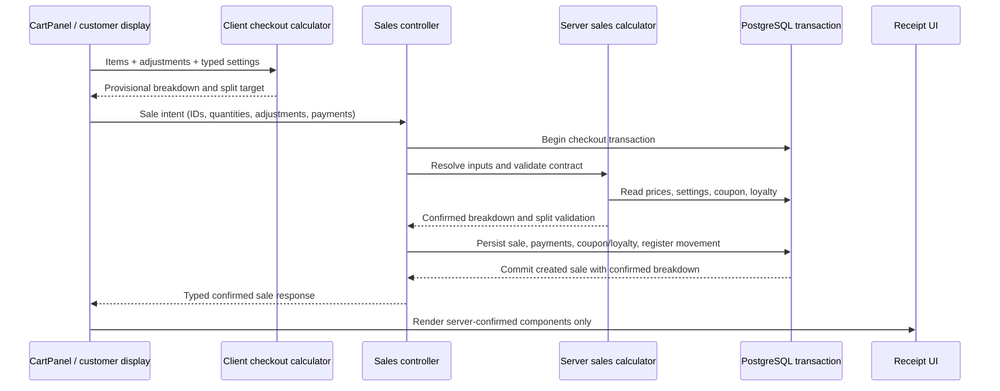
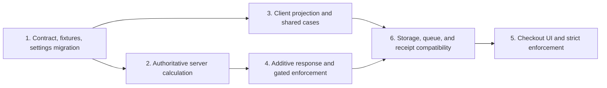
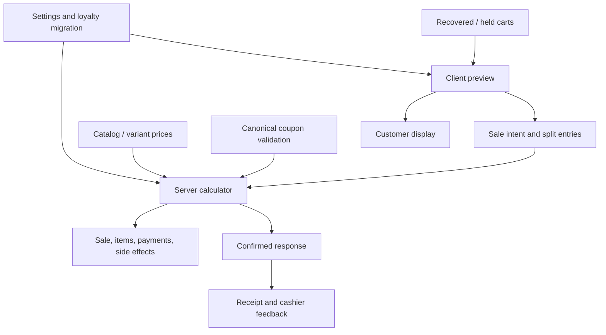

# fix: Align POS checkout totals with server financial rules

## Overview

Make every POS checkout surface use one explicit monetary contract while retaining the server as the authority that prices, validates, persists, and returns the completed sale. The client will keep a pure calculator for immediate cashier feedback, but a shared table of contract cases will prove that its preview matches the server for manual discounts, coupons, tax modes, loyalty, tips, and split tenders to the cent.

This is a deep, P0 financial-integrity fix based on GitHub issue #49. No matching requirements document exists in `docs/brainstorms/`; the issue body and related issues #31, #42, and #47 are the planning sources.

## Problem Frame

The client and server currently implement different formulas. `client/src/shared/lib/checkout.ts` subtracts tip, treats redemption value as currency per 100 points, and applies loyalty after tax. `server/src/modules/pos/sales/service.ts` adds tip, treats redemption value as currency per point, and reduces the taxable base by loyalty. Quick Discount in `client/src/features/pos/components/CartPanel.tsx` writes its amount into `tip`, split tender balances against the resulting incorrect client amount, and the receipt only partly reflects the confirmed server result.

The server also accepts client-supplied item prices and records split entries without checking that they equal the server-calculated total. A checkout can therefore look balanced at the till yet persist another amount. The correction must preserve existing browser storage keys and recover old carts without silently reinterpreting legacy `tip` values as discounts.

## Requirements Trace

- **R1 — Explicit calculation contract:** Define ordering, units, clamping, and cent rounding for subtotal, manual discount, coupon discount, loyalty redemption, tax, tip, and final amount due.
- **R2 — Correct tip and Quick Discount:** Tips increase amount due; Quick Discount changes the sale discount and never tip state.
- **R3 — Tax parity:** Inclusive and exclusive tax yield identical client previews and server-confirmed values.
- **R4 — Loyalty parity:** Redemption and earning use canonical settings, units, eligibility, caps, and ordering aligned with issue #31.
- **R5 — Split-payment integrity:** Split entries balance against the server-calculated amount to the cent and invalid allocations are rejected server-side.
- **R6 — Server authority:** Catalog pricing and final calculation are server-controlled; the creation response exposes the confirmed breakdown used by receipts and downstream UI.
- **R7 — Combination and rounding coverage:** Table-driven tests cover representative combinations and half-cent/cent boundaries.
- **R8 — Safe recovery:** Existing active and held carts retain their items and explicit discounts, preserve storage keys, and do not reinterpret legacy tip data after deployment.
- **R9 — Compatibility coordination:** Keep the work compatible with the atomicity/idempotency boundary of #42 and the typed-contract direction of #47.

## Scope Boundaries

- Do not implement general idempotency or row-locking strategy owned by issue #42. Checkout-scoped calculation, split validation, sale/items/payments, and register movement must nevertheless share one atomic boundary here, or the relevant #42 capability must land in the same release before strict enforcement.
- Do not perform the repository-wide DTO/error/OpenAPI refactor owned by issue #47; type only the sale request, totals breakdown, and confirmed sale response touched here.
- Do not redesign offline retry/idempotency owned by issues #30/#42. Version new sale entries and quarantine legacy entries for review so replay cannot silently use a different current price or total.
- Do not redesign coupons or promotions. Checkout must consume the canonical coupon validation rules and reject a coupon that is invalid when the authoritative sale calculation runs.
- Do not introduce a new tax or loyalty accounting policy. Initially preserve current server behavior: loyalty reduces taxable base, tip is added after tax, and earning uses confirmed final total. Any policy change requires a separate product/accounting decision.

## Context & Research

### Relevant Code and Patterns

- `client/src/shared/lib/checkout.ts` is the established pure client calculation and allocation seam from PR #28 / commit `aa51dc4`; extend it rather than reintroducing arithmetic into React components.
- `client/src/features/pos/components/CartPanel.tsx` composes the request, coupon preflight, checkout preview, Quick Discount, loyalty controls, split tender, and receipt handoff.
- `server/src/modules/pos/sales/service.ts` calculates and persists the sale inside a transaction, but currently has divergent loyalty math and trusts provided item prices.
- `server/src/modules/commerce/coupons/service.ts` is the canonical coupon validation surface; sale creation must not maintain a weaker parallel ruleset.
- `client/src/features/pos/store/cartStore.ts`, `client/src/features/pos/store/heldCartsStore.ts`, and `docs/CONVENTIONS.md` define persisted cart compatibility, including stable `moon-cart-recovery` and `moon-held-carts` keys.
- `client/src/shared/components/Receipt.tsx` and the `SaleResponse` shape local to `CartPanel.tsx` show that the receipt needs a confirmed server breakdown rather than reconstructed client values.
- `server/tests/sales.test.ts`, `client/src/shared/lib/checkout.test.ts`, and `client/src/features/pos/components/CartPanel.test.tsx` are the existing server, pure-calculation, and UI contract seams.

### Institutional Learnings

- `docs/plans/2026-08-21-003-refactor-backend-postgresql-modular-monolith-plan.md` already records the tip-sign bug, the reduced offline payload, duplicated tax/loyalty/coupon arithmetic, and historical trust in client prices. This plan closes the calculation subset without absorbing the broader backend program.
- PR #28 intentionally centralized client calculations and split allocation but left the server contract unchanged. Preserve that seam and add cross-runtime contract fixtures.
- Issue #31 documents missing/inverted loyalty setting names. The currently seeded `loyalty_points_per_egp` and `loyalty_egp_per_point` conflict with the client/server readers for `loyalty_earn_rate` and `loyalty_redeem_value`; reciprocal units can silently misprice redemptions.
- Existing persisted-state keys are global compatibility contracts. Use Zustand versioning/migration and field sanitization rather than renaming keys or clearing all storage.

### External References

- None. This repository already contains the target calculation, persistence, validation, and test patterns; external framework research would not resolve the project-specific financial contract.

## Key Technical Decisions

| Decision | Rationale |
|---|---|
| Make `SalesService` the runtime authority and retain a pure client projection | The server controls persistence and settings; the local projection keeps checkout responsive. Shared cases detect drift without introducing a new package or network-dependent keystroke flow. |
| Apply adjustments in the order `subtotal -> manual discount -> coupon -> loyalty -> tax -> tip` | This matches the current server tax-base policy, ensures tip is never discounted/taxed, and makes the loyalty tax treatment explicit. |
| Define loyalty settings in direct units: points earned per currency unit and currency redeemed per point | These units match the existing database keys, avoid the reciprocal “per 100 points” interpretation, and make client/server formulas identical. |
| Calculate internally and in contract fixtures using integer minor units | JavaScript float rounding is not a stable financial contract. Convert database decimals and HTTP numbers only at boundaries and derive every published component from minor units. |
| Validate split tender only after authoritative totals are known | Client balance is a usability check; only server validation protects persisted payments and register movements. |
| Preserve the existing success envelope and add a versioned `calculation` object | Existing consumers retain sale fields under `data`; `data.calculation.amount_due` equals `data.total`, and receipts consume only confirmed calculation/items/payments. |
| Preserve storage keys and migrate legacy cart shape conservatively | Existing `tip` may have been entered through the mislabeled Quick Discount UI, so it cannot safely be converted automatically into a discount. |
| Keep local preview but no separate quote endpoint in #49 | Create-sale remains the authoritative quote/commit boundary. A quote endpoint adds a second contract but cannot remove create-time races; stale splits are rejected with recalculation details. |
| Treat bundle allocation as an explicit authorized price source | `cartStore.addBundle` deliberately distributes a bundle price across lines, so authority must distinguish server-validated bundles from arbitrary client prices. |

## Canonical Calculation Contract

The following is directional contract notation, not implementation code:

| Stage | Rule |
|---|---|
| Subtotal | Sum server-resolved catalog/variant price, or a server-validated bundle allocation, multiplied by quantity; reject arbitrary client price overrides. |
| Manual discount | Percentage is capped at 100%; fixed discount is capped at subtotal. |
| Coupon | Validate against the post-manual-discount amount and canonical coupon scope/usage/customer rules; cap at the remaining amount. |
| Loyalty | If enabled and a customer is selected, cap redeemed points by balance and by remaining monetary value; `pointsDiscount = pointsRedeemed * currencyPerPoint`. |
| Tax base | Clamp `subtotal - manualDiscount - couponDiscount - pointsDiscount` at zero. |
| Tax | Exclusive mode adds rounded tax; inclusive mode extracts rounded tax already present in the tax base. |
| Tip | Clamp to a non-negative monetary value and add after tax. |
| Amount due | Inclusive: `taxBase + tip`; exclusive: `taxBase + taxAmount + tip`. Clamp and round to cents. |
| Loyalty earned | Compatibility rule: whole points from confirmed final amount due using configured points-per-currency-unit, matching current server semantics (after redemption and including tax/tip). |
| Payments | For split tender, the rounded sum of non-negative entries must equal confirmed amount due exactly to the cent. |

The ordering and earning base above are compatibility assumptions, not newly endorsed accounting policy. They preserve current server behavior while eliminating client drift; changing them requires owner/accounting approval and versioned contract cases.

## Open Questions

### Resolved During Planning

- **Which loyalty setting names and units are canonical?** Keep database-semantic keys `loyalty_points_per_egp` and `loyalty_egp_per_point`, add `loyalty_enabled`, and expose direct units. Migration uses a reviewed source-key/source-unit/conversion/precedence matrix and copies an alias only when the canonical value is absent and its units are known.
- **Should the client call a quote endpoint for every edit?** No. Use the pure client projection for responsiveness and the server result for authority, with shared table-driven cases enforcing parity.
- **How should legacy Quick Discount values be migrated?** Do not guess. Retain them as tip, label them correctly after hydration, and require the cashier to review the recalculated total before confirming.
- **Who validates split tender?** Both layers: client for immediate feedback, server as the enforcement boundary.

### Deferred to Implementation

- **Manager price overrides beyond bundles:** Search for any additional legitimate override flow. Bundles are known and require server-verifiable identity; any manager override becomes a separately authorized request field.
- **Deployed loyalty alias values:** Audit real values before rollout. Unknown or ambiguous units block automatic conversion and require manual resolution rather than a guessed reciprocal.

## High-Level Technical Design

The client amount is provisional until sale creation succeeds. On a stale split, the server returns a stable validation code plus the current authoritative calculation; the client keeps the cart and prompts the cashier to rebalance. The final response keeps the existing `data` envelope and sale fields while adding `calculation`, authoritative `items`, and `payments`. `calculation` includes contract version, applied coupon identity/amount, requested/applied points, tax mode/rate/amount, tip, amount due, and earned points.

## Implementation Units

- [x] **Unit 1: Define the financial contract and canonical loyalty settings**

**Goal:** Give both runtimes explicit, typed meanings for every calculation input/output and migrate loyalty settings without reciprocal-unit ambiguity.

**Requirements:** R1, R4, R7, R9

**Dependencies:** Issues #31 and #47 are coordination inputs; no implementation unit dependency.

**Files:**
- Modify: `server/src/modules/pos/sales/types.ts`
- Modify: `server/src/modules/core/settings/types.ts`
- Modify: `server/src/database/migrations/001_initial_schema.sql`
- Create: `server/src/database/migrations/002_checkout_financial_contract.sql`
- Create: `server/src/database/migrations/002_checkout_financial_contract.down.sql`
- Modify: `server/src/database/seed.ts`
- Create: `contracts/checkout-totals.v1.json`
- Modify: `client/src/shared/types/index.ts`
- Modify: `client/src/features/admin/pages/Settings.tsx`
- Modify: `client/src/shared/i18n/en.json`
- Modify: `client/src/shared/i18n/ar.json`
- Test: `server/tests/sales.test.ts`
- Test: `server/tests/database/migrate.test.ts`
- Test: `client/src/features/admin/pages/Settings.test.tsx`

**Approach:**
- Define a sale calculation breakdown containing subtotal, manual discount, coupon discount, points redeemed and their currency value, taxable base, tax mode/rate/amount, tip, amount due, and earned points.
- Canonicalize loyalty to `loyalty_enabled`, `loyalty_points_per_egp`, and `loyalty_egp_per_point`. Add a new migration because `_migrations` means editing applied `001` cannot upgrade deployed databases; update `001` only as the fresh-install baseline.
- Define the alias conversion matrix before migration. Never overwrite an existing canonical value; rollback removes only values proven to have been introduced by this migration and must not destroy a pre-existing canonical value.
- Version a neutral shared fixture with literal integer minor-unit inputs/outputs so both test roots consume one behavior contract.
- Keep the scope local to settings used by checkout and avoid the repository-wide contract refactor from #47.

**Execution note:** Start with setting parsing/migration and unit-semantics tests because reciprocal mistakes are valid-looking financial errors.

**Patterns to follow:**
- Typed parse boundaries in `server/src/modules/pos/sales/types.ts` and `server/src/modules/core/settings/types.ts`.
- Existing up/down migration pairing and seed conventions under `server/src/database/`.

**Test scenarios:**
- Happy path: canonical settings enabled with `2 points/EGP` and `0.10 EGP/point` parse to those exact direct units on server and client.
- Compatibility: only legacy alias keys exist -> migration preserves their configured business value under canonical keys rather than falling back.
- Edge case: canonical and alias keys both exist -> documented precedence produces one deterministic value.
- Migration: database with `001` already recorded applies `002`; fresh database reaches the same canonical settings/schema; down migration preserves pre-existing canonical values.
- Error path: zero, negative, non-numeric, or reciprocal-looking invalid values -> settings boundary rejects them or falls back to one documented safe default consistently.
- UI: saving Settings writes canonical keys and labels earn/redeem inputs with unambiguous units in English and Arabic.

**Verification:**
- Client and server expose the same setting names and units; a fresh database and an upgraded database both resolve one deterministic loyalty configuration.

- [x] **Unit 2: Centralize authoritative server pricing and total calculation**

**Goal:** Produce one server-side calculation result from authoritative catalog, coupon, loyalty, and tax data.

**Requirements:** R1, R3, R4, R6, R7, R9

**Dependencies:** Unit 1

**Files:**
- Modify: `server/src/modules/pos/sales/service.ts`
- Modify: `server/src/modules/pos/sales/repository.ts`
- Modify: `server/src/modules/pos/sales/types.ts`
- Modify: `server/src/modules/commerce/coupons/service.ts`
- Modify: `server/src/modules/commerce/coupons/repository.ts`
- Create: `server/src/database/migrations/003_sale_calculation_snapshot.sql`
- Create: `server/src/database/migrations/003_sale_calculation_snapshot.down.sql`
- Test: `server/tests/sales.test.ts`
- Test: `server/tests/commerce-contracts.test.ts`
- Test: `client/src/features/sales/pages/SalesHistory.test.tsx`

**Approach:**
- Extract a pure money-ordering calculation from database resolution so the same confirmed breakdown drives validation and persistence.
- Resolve normal product/variant prices server-side. Add bundle identity/allocation to the request so the server can validate the bundle definition and price; never accept an unexplained line `unit_price` as authority.
- Reuse canonical coupon eligibility/scope/limit rules within the sale transaction rather than copying the weaker lookup in `SalesService`.
- Clamp discounts/redemption to the remaining merchandise value, apply loyalty before tax, add tip after tax, and round published components consistently to cents.
- Preserve current earning-base compatibility (`floor(amountDue * pointsPerEgp)`) and make it a fixture-backed policy assumption.
- Persist an immutable calculation snapshot (manual discount amount, points discount, tax mode/rate, tip, applied coupon/points, amount due, earned points, and contract version) so historical receipts do not depend on current settings/formulas.
- Leave general locking/idempotency to #42, but keep calculation and snapshot persistence inside the checkout transaction.

**Execution note:** Implement the monetary behavior test-first with a table of contract cases before changing persistence.

**Patterns to follow:**
- Transaction-aware `Queryable` repository methods in `server/src/modules/pos/sales/`.
- Canonical coupon validation in `server/src/modules/commerce/coupons/service.ts`.

**Test scenarios:**
- Happy path: fixed and percentage manual discounts produce capped, rounded components from server catalog prices.
- Tax modes: the same discounted inputs under inclusive and exclusive tax return the contract-defined tax and amount due.
- Combination matrix: manual discount + coupon + points + exclusive/inclusive tax + tip returns the expected component sum and final cent value.
- Rounding: prices/quantities and percentage rates that yield half-cent intermediates produce deterministic component and final rounding.
- Edge case: discounts/coupon/points exceed remaining value -> tax base reaches zero, tip remains payable, and amount due never becomes negative.
- Error path: stale/missing product or variant, invalid/expired/out-of-scope coupon, missing customer, disabled loyalty, or excess points -> deterministic validation failure; no silent coupon omission.
- Security/integration: tampered client `unit_price` cannot change the server subtotal or persisted item price.
- Integration: a valid bundle checkout persists the server-validated allocated bundle price rather than reverting to catalog total.
- Historical read: GET sale/history and receipt reconstruction use the immutable calculation snapshot and remain stable after settings change. Partial-refund allocation remains outside issue #49.

**Verification:**
- One authoritative breakdown is produced before persistence and every stored financial component derives from it.

- [x] **Unit 3: Align the client projection through shared contract cases**

**Goal:** Make the responsive client preview exactly mirror the canonical server contract without making it authoritative.

**Requirements:** R1, R2, R3, R4, R7

**Dependencies:** Unit 1; can proceed in parallel with Unit 2 after the contract is fixed.

**Files:**
- Modify: `client/src/shared/lib/checkout.ts`
- Modify: `client/src/shared/lib/checkout.test.ts`
- Modify: `contracts/checkout-totals.v1.json`
- Test: `server/tests/sales.test.ts`

**Approach:**
- Correct the tip sign, direct per-point redemption units, loyalty-before-tax ordering, component rounding, redemption caps, and earned-point base in the pure calculator.
- Make the server and client suites consume the same neutral table of inputs and expected component outputs; the fixture defines behavior but production runtimes remain independently deployable.
- Keep `allocateSplit` in integer minor units with the same exact-equality rule as server payment validation.

**Execution note:** Replace incorrect expectations with explicit regression cases; do not preserve the current tip-subtraction behavior as compatibility.

**Patterns to follow:**
- Pure functions and focused Vitest tables in `client/src/shared/lib/checkout.test.ts`.
- PR #28's separation between calculation and React rendering.

**Test scenarios:**
- Table-driven: no adjustments, both manual discount types, coupon, loyalty, inclusive tax, exclusive tax, tip, and full combinations match expected components on both runtimes.
- Regression: 25 EGP tip on an 850 EGP post-discount amount yields 875 EGP due, never 825 EGP.
- Loyalty: 200 points at `0.10 EGP/point` yields a 20 EGP discount in both runtimes.
- Rounding: three-way split and tax/percentage cases with fractional cents balance only at the canonical rounded amount.
- Edge case: zero/negative rates or redemption beyond balance/value cannot create a negative component or amount due.

**Verification:**
- The identical fixture passes through client and server calculators with no client-only adjustment or tolerance.

- [x] **Unit 4: Add confirmed response and gated split-payment enforcement**

**Goal:** Reject payment allocations that do not match the authoritative total and return the complete calculation used for persistence.

**Requirements:** R5, R6, R7, R9

**Dependencies:** Unit 2

**Files:**
- Modify: `server/validators/saleSchema.ts`
- Modify: `server/src/modules/pos/sales/controller.ts`
- Modify: `server/src/modules/pos/sales/service.ts`
- Modify: `server/src/modules/pos/sales/repository.ts`
- Modify: `server/src/modules/pos/sales/types.ts`
- Modify: `server/src/modules/pos/register/service.ts`
- Modify: `server/src/modules/pos/register/repository.ts`
- Modify: `server/src/docs/openapi.ts`
- Test: `server/tests/sales.test.ts`
- Test: `server/tests/endpoint-contracts.test.ts`
- Test: `server/tests/register.test.ts`

**Approach:**
- Validate payment entry shape and compute its authoritative minor-unit sum, but keep strict rejection behind a disabled compatibility gate until Units 5 and 6 deploy. When enabled, reject underpayment, overpayment, negative/non-finite amounts, empty splits, and ambiguous mixed single/split representations.
- Persist exactly the validated entries; derive cash-register movement from confirmed split data rather than unchecked request values.
- Return the created sale with authoritative item prices, financial breakdown, payments, cashier metadata, and timestamp in a typed compatible envelope.
- Make register lookup, movement insert, and expected-cash update accept the same `Queryable` as `SalesService.executeSale`, run before commit, and propagate failures so checkout rolls back. Alternatively, make that exact #42 capability a hard same-release prerequisite. Document the additive response in scoped OpenAPI per #47.
- Define supported methods, duplicate-method policy, entry count/precision limits, and zero-due behavior. Split tender requires exact minor-unit equality; ordinary single Cash checkout continues to represent the sale amount rather than cash tender/change.

**Execution note:** Start with failing API/service contract tests for underpayment, overpayment, and the confirmed response.

**Patterns to follow:**
- Zod request validation in `server/validators/saleSchema.ts`.
- Shared success envelopes in `server/src/modules/pos/sales/controller.ts`.

**Test scenarios:**
- Happy path: Cash/Card entries summing exactly to the server amount persist and are returned unchanged.
- Edge case: entries such as `33.33 + 33.33 + 33.34` balance 100.00; `0.1 + 0.2`, negative zero, more than two decimals, huge values, and zero-due sales follow explicit minor-unit boundary rules.
- Error path: a client-balanced split based on tampered/stale preview differs from server total -> server rejects it with a stable validation code and persists nothing.
- Error path: negative, NaN-like, empty, duplicate/unsupported, underpaid, or overpaid entries -> deterministic boundary or service validation error.
- Integration: confirmed response components equal the `sales`, `sale_items`, and `sale_payments` rows and the cash movement uses the confirmed Cash component.
- Compatibility: a non-split sale without `payments` continues to work and returns the expanded envelope.

**Verification:**
- No sale or cash movement can be created with payments whose cent sum differs from its authoritative amount due.

- [x] **Unit 5: Correct checkout controls and all live amount surfaces**

**Goal:** Ensure the cashier edits the intended state and every pre-submit display uses the corrected projection.

**Requirements:** R2, R3, R4, R5, R7

**Dependencies:** Units 3, 4, and 6 compatibility adapters must be deployable before strict server enforcement is enabled.

**Files:**
- Modify: `client/src/features/pos/components/CartPanel.tsx`
- Modify: `client/src/features/pos/pages/POS.tsx`
- Modify: `client/src/features/pos/pages/CustomerDisplay.tsx`
- Modify: `client/src/shared/i18n/en.json`
- Modify: `client/src/shared/i18n/ar.json`
- Test: `client/src/features/pos/components/CartPanel.test.tsx`
- Test: `client/src/features/pos/pages/POS.test.tsx`

**Approach:**
- Make Quick Discount update manual discount state with explicit percentage/fixed semantics; give tip its own correctly labeled control and positive line item.
- Feed typed canonical loyalty settings into preview, cap point input by balance and sale value, and reset/recalculate dependent values when customer, coupon, settings, or cart contents change.
- Use the corrected amount due for split allocation and disable submission until entries balance; still handle server rejection if authoritative data changes.
- Broadcast the complete projected breakdown or canonical amount due to the customer display instead of `cartStore.getTotal()` plus a separately interpreted tip.
- Keep coupon preflight as feedback only; the checkout response remains authoritative.

**Patterns to follow:**
- Existing `calculateTotals` / `allocateSplit` memoized seam in `CartPanel.tsx`.
- Transport-level assertions in `client/src/features/pos/components/CartPanel.test.tsx`.

**Test scenarios:**
- Regression: selecting 10% Quick Discount changes `discount`/`discount_type`, leaves `tip` unchanged, and sends the correct request fields.
- Happy path: entering a tip renders a positive line and increases preview/split target.
- Loyalty: selecting a customer with 200 points at `0.10 EGP/point` caps input correctly and previews the server formula.
- Tax modes: checkout drawer, cart footer, and customer display show the same amount for inclusive and exclusive settings.
- Split: exact cent allocation enables Confirm; short/over allocations remain disabled and display the correct remaining/overpaid amount.
- State transition: changing items, discount, coupon, loyalty selection, tax settings, or tip recomputes the target and invalidates a formerly balanced split.
- Error path: server rejects a stale calculation/payment -> cart remains intact and cashier sees an actionable error rather than a false success.

**Verification:**
- Quick Discount never mutates tip; all live checkout-facing surfaces agree on one projected amount and submission handles authoritative mismatch safely.

- [x] **Unit 6: Migrate persisted carts/queues and render confirmed receipts**

**Goal:** Make post-submit output match persisted data and make deployment safe for active/held carts.

**Requirements:** R6, R7, R8

**Dependencies:** Units 3 and 4; this unit must ship before Unit 5 enables strict checkout behavior for existing browser state.

**Files:**
- Modify: `client/src/shared/components/Receipt.tsx`
- Modify: `client/src/shared/components/ReceiptDialog.tsx`
- Modify: `client/src/features/pos/components/CartPanel.tsx`
- Modify: `client/src/features/pos/store/cartStore.ts`
- Modify: `client/src/features/pos/store/heldCartsStore.ts`
- Modify: `client/src/features/pos/components/HeldCartsDialog.tsx`
- Modify: `client/src/shared/store/offlineStore.ts`
- Modify: `client/src/shared/hooks/useOffline.ts`
- Test: `client/src/shared/components/Receipt.test.tsx`
- Test: `client/src/features/pos/components/CartPanel.test.tsx`
- Test: `client/src/features/pos/store/cartStore.test.ts`
- Test: `client/src/features/pos/store/heldCartsStore.test.ts`
- Test: `client/src/shared/store/offlineStore.test.ts`
- Test: `client/src/shared/hooks/useOffline.test.ts`

**Approach:**
- Build `ReceiptData` solely from the confirmed response; render manual/coupon/loyalty discounts, extracted/added tax, tip, payments, and total using returned values rather than recomputation.
- Version persisted cart schemas while retaining storage keys. Define the v0-to-v1 mapping field by field: preserve zero values and nullable variant identity, reject non-finite/negative price or quantity, retain legacy `tip` as tip, keep `couponCode` but clear cached `couponDiscount`, and flag recovered state for review.
- Revalidate coupon, loyalty availability, catalog prices, tax settings, and total when a recovered/held cart reaches checkout; never carry a cached coupon amount as authority.
- Preserve item/discount recovery, memo, and variant identity. Held carts did not previously store notes/tip/coupon, so initialize those fields explicitly and remove a held cart only after successful transfer/revalidation.
- Add a sale-payload contract version to new offline entries. Quarantine legacy unversioned/reduced sales for cashier review instead of replaying them at current catalog prices; process mixed queues without blocking unrelated compatible actions and retain quarantine state across restart/logout.

**Execution note:** Add characterization fixtures for the previous persisted JSON shape before adding migration behavior.

**Patterns to follow:**
- Zustand `persist` migration hooks and stable keys declared in `client/src/shared/lib/storageKeys.ts` and `docs/CONVENTIONS.md`.
- Receipt composition in `client/src/shared/components/Receipt.tsx`.

**Test scenarios:**
- Integration: server confirms a combination sale -> receipt component values and total exactly equal response and persisted row components.
- Regression: response total differs from provisional preview -> receipt shows server total and no client reconstruction overwrites it.
- Recovery: a pre-deployment active cart hydrates with items/manual discount/tip intact, unchanged key, and a review warning; no value changes semantic category.
- Recovery: old/corrupt/missing numeric fields sanitize to safe defaults without discarding valid items.
- Held cart: retrieve preserves variant identity, quantities, discount type/value, and marks financial preview for recalculation.
- Offline compatibility: an unversioned queued sale is not auto-submitted; a reviewed/versioned entry revalidates against current authoritative total; compatible non-sale actions continue through a mixed queue.
- Error path: recovered coupon/loyalty setting is no longer valid -> checkout shows recalculated state or server rejection while retaining the cart.
- Receipt: manual discount, coupon, loyalty, inclusive/exclusive tax, tip, and split payment lines each render with correct sign and amount.

**Verification:**
- The printed/displayed receipt equals the confirmed sale breakdown, and representative old active/held cart payloads hydrate without data loss or semantic reinterpretation.

## System-Wide Impact

- **Interaction graph:** Settings feed both projections; product/coupon/customer state is resolved by the server; the confirmed response feeds receipt and cache invalidation; recovered carts feed only provisional UI state.
- **Error propagation:** Invalid financial intent must surface as a stable validation error, leave the cart visible, and create no sale/payment/cash movement. Typed errors remain compatible with #47.
- **State lifecycle risks:** Settings/catalog/coupon/loyalty can change between preview and submission; split tender can become stale; persisted legacy tip cannot be inferred as an intended discount; coupon and loyalty concurrency remains coordinated with #42.
- **API surface parity:** `POST /api/v1/sales`, its OpenAPI definition, client `SaleResponse`, receipt DTO, and offline replay payload must agree on request/confirmed-response semantics.
- **Integration coverage:** Cross-layer tests must prove request -> authoritative calculation -> persisted rows -> response/receipt parity; calculator unit tests alone cannot prove it.
- **Unchanged invariants:** Existing response envelope, storage keys, and non-split payment behavior remain. The checkout atomic boundary expands only as required for calculation/payment/register integrity; broader locking and idempotency remain with #42.

## Risks & Dependencies

| Risk | Likelihood | Impact | Mitigation |
|---|---|---|---|
| Loyalty alias migration inverts an existing configured value | Medium | High | Direct-unit names, explicit precedence, migration fixtures, and admin UI labels. |
| Editing the baseline migration leaves deployed databases unchanged | High | High | Add numbered forward/down migrations and test both fresh and already-migrated databases. |
| Server catalog authority breaks an undocumented manager price-override workflow | Medium | High | Inspect current usage before removing request price; model any legitimate override explicitly with authorization. |
| Bundle checkout is repriced at catalog total | High | High | Send bundle identity and validate allocation server-side; cover bundle checkout end to end. |
| Client/server rounding drifts again | Medium | High | Shared table of expected components, round published components, and require both suites to consume it. |
| Coupon or loyalty changes after preview invalidate a balanced split | High | Medium | Server rejects mismatch atomically; client retains cart and asks cashier to review/rebalance. |
| Legacy Quick Discount values are indistinguishable from real tips | High | Medium | Preserve as tip, never auto-convert, and flag recovered carts for review. |
| Legacy offline sale replays at a new catalog price | High | High | Version new entries and quarantine unversioned sale payloads for explicit review/revalidation. |
| #42 lands concurrently and moves the transaction/idempotency boundary | Medium | High | Keep calculator pure and transaction-compatible; coordinate payment/coupon/loyalty validation before merging. |
| Strict validation breaks an old deployed client | High | High | Compatibility gate plus coordinated client migration; enforce only after version telemetry/canaries pass. |
| Expanded response breaks older clients | Low | Medium | Additive `calculation`/items/payments in existing envelope; preserve existing fields and document compatibility per #47. |

## Documentation / Operational Notes

- Update `docs/CONVENTIONS.md` with the canonical calculation order, direct loyalty units, stable persisted-state migration rule, and server-authority invariant.
- Update `docs/ARCHITECTURE.md` only if sale calculation/contract ownership changes the documented POS-to-server dependency boundary.
- Record the checkout-specific migration/rounding lesson in the repository `AGENTS.md` `## Learnings` section after implementation validates it; do not add speculative learning during planning.
- Sequence by capability: canonical loyalty units; authoritative calculator/snapshot; additive response behind compatibility gating; client cart/queue migration and response support; corrected UI; then strict split enforcement. #42's checkout atomic capability must be in the same release before enforcement, while #47 may later consume the scoped DTO.
- Use a minimum client/API contract version, feature flag, or coordinated maintenance window: strict server validation is incompatible with the old client tip/split formula. Canary old-client non-split, old-client split, new-client/old-server, new-client/new-server, and quarantined legacy replay paths.
- Monitor `POST /api/v1/sales` by client contract version and stable validation code, split-payment failure rate, quarantined queue count, and preview/receipt mismatch. Roll back enforcement/UI independently; never destructively roll back migrated loyalty data.

## Success Metrics

- All shared checkout contract cases produce identical client and server components to the cent.
- No accepted split-payment sale has payment rows whose rounded sum differs from persisted sale total.
- Receipt total and component lines equal the created sale response and persisted values.
- Legacy active/held cart fixtures hydrate under unchanged storage keys and require review before confirmation.
- No production path treats a tip as a discount or trusts an unapproved client item price.

## Sources & References

- Origin issue: [#49 — Align POS checkout totals with server financial rules](https://github.com/zhamdy/moon-store/issues/49)
- Related issue: [#31 — Loyalty is silently disabled](https://github.com/zhamdy/moon-store/issues/31)
- Related issue: [#42 — Make POS financial mutations concurrency-safe and idempotent](https://github.com/zhamdy/moon-store/issues/42)
- Related issue: [#47 — Establish type-safe API and persistence contracts](https://github.com/zhamdy/moon-store/issues/47)
- Related code: `client/src/shared/lib/checkout.ts`
- Related code: `client/src/features/pos/components/CartPanel.tsx`
- Related code: `server/src/modules/pos/sales/service.ts`
- Prior analysis: `docs/plans/2026-08-21-003-refactor-backend-postgresql-modular-monolith-plan.md`
