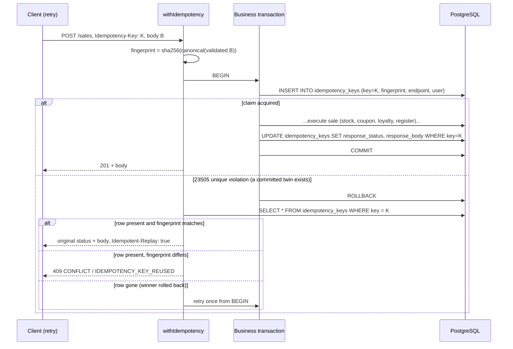

# fix: Make POS financial mutations concurrency-safe and idempotent

## Overview

Every financial mutation in this server reads a quantity or balance, computes a new absolute
value in JavaScript, and writes it back. Inside a transaction this is atomic against torn
writes but **not** against lost updates: two concurrent checkouts both read `stock = 5`, both
write `stock = 3`, and four units vanish. Nothing in the codebase takes a row lock
(`grep 'FOR UPDATE'` over `server/src` returns nothing) and nothing dedupes a retried request
(`grep -i idempot` over the server returns only an unrelated seed test).

This plan adds two server-side invariants and proves them against a real PostgreSQL instance:

1. **Concurrency safety** — quantities and balances change through conditional, relative SQL
   writes (`SET stock = stock - $1 WHERE stock >= $1`) or an explicit row lock, never through a
   read-then-write of an absolute value.
2. **Idempotency** — a caller-supplied `Idempotency-Key` makes a retried mutation return the
   original outcome instead of creating a second one, with a deterministic 409 when the same key
   arrives with a different payload.

The response envelope (`{ data, meta }` / `{ error: { code, message, details } }`) and every
existing field on every existing response are unchanged.

## Problem Frame

`SalesService.executeSale` (`server/src/modules/pos/sales/service.ts`) resolves each line in
`resolveLines`, capturing `previousStock` and computing `newStock = previousStock - quantity`.
Much later in the same transaction it calls
`repo.updateProductStock(item.product_id, item.newStock, client)`, which issues
`UPDATE products SET stock = $1 WHERE id = $2` — an absolute write derived from a stale read.
The stock sufficiency check (`if (Number(product.stock) < item.quantity)`) runs against the same
stale read. Under `READ COMMITTED` (the pool default; see `server/src/database/pool.ts`) two
concurrent checkouts of the last unit both pass the check and both commit.

The same shape appears in:

| Site | Read-then-write | Consequence |
|---|---|---|
| `pos/sales/service.ts` `executeSale` | `previousStock` → `updateProductStock` / `updateVariantStock` | Oversell, lost stock update |
| `pos/sales/service.ts` `executeRefund` | `sale.refunded_amount` → `updateSaleRefundStatus`; `product.stock` → `updateProductStock` | Over-refund past sale total, lost restock |
| `commerce/giftCards/service.ts` `redeem` | `card.balance` → `updateBalance` | Gift card spent twice, balance goes negative |
| `commerce/coupons/service.ts` `validate` | `getUsageCount` → later `createCouponUsage` | `max_uses` / `max_uses_per_customer` exceeded |
| `pos/sales/service.ts` loyalty | balance checked in `buildBreakdown`, debited via relative SQL | Balance can go negative (check is stale) |
| `pos/exchanges/service.ts` | relative SQL already, but unguarded | Stock can go negative |

Retry duplication is the second half. The client's offline queue
(`client/src/shared/hooks/useOffline.ts`) replays a queued sale body verbatim, and the transport
(`client/src/shared/lib/transport/http.ts`) retries after a token refresh. Neither carries
anything that lets the server recognize a replay, so a network failure after commit but before
the response reaches the till produces a second sale, a second stock deduction, a second coupon
use, and a second loyalty award.

Related client-side risk is tracked separately in #30; this plan makes the server authoritative
regardless of how the client behaves.

## Requirements Trace

- **R1.** Concurrent purchases cannot reduce stock below zero or lose a stock update.
- **R2.** Repeating an identical request with the same idempotency key creates one transaction
  and returns the original outcome.
- **R3.** Reusing a key with a different payload returns a deterministic conflict response.
- **R4.** A failed mutation leaves all related records unchanged (sale, items, payments, coupon
  usage, loyalty, stock adjustments, register movement).
- **R5.** Concurrency and retry behavior is tested against real PostgreSQL.
- **R6.** Existing clients continue working during an explicitly documented compatibility window.
- **R7.** The same invariant covers refunds, gift-card redemption, and coupon consumption.
- **R8.** Response envelopes and existing response fields are unchanged.

## Scope Boundaries

- **Not** fixing the client offline queue's replay/quarantine logic — that is #30. This plan
  touches the client only to stamp and persist a stable idempotency key (decided with the user).
- **Not** general authentication or observability work.
- **Not** introducing a reservation/hold system for cart stock. `stock_reservations` exists in the
  schema (`server/src/database/migrations/001_initial_schema.sql:307`) but does not participate in
  checkout today, and wiring it in is a behavior change, not a concurrency fix.
- **Not** changing the checkout financial contract established by
  `docs/plans/2026-08-30-001-fix-pos-checkout-total-parity-plan.md`. Amounts, rounding, and the
  `sale_calculations` snapshot stay exactly as they are.
- **Not** raising the transaction isolation level globally. `READ COMMITTED` plus conditional
  writes and explicit locks is the chosen mechanism (see Key Technical Decisions).
- **Not** rewriting `server/services/*.ts` legacy shims beyond what compiles.

## Context & Research

### Relevant Code and Patterns

- `server/src/database/transaction.ts` — `withTransaction(callback, poolOrClient)`; accepts an
  already-open client for nesting. Every service mutation already routes through it. This is where
  a bounded deadlock/serialization retry belongs.
- `server/src/database/pool.ts` — single `pg.Pool`, `max` 10 (dev) / 20 (prod), `setPool()` exists
  for tests to swap in pg-mem.
- `server/src/database/migrate.ts` — file-ordered `NNN_name.sql` + `NNN_name.down.sql`, each
  applied inside `withTransaction`. Next number is `004`.
- `server/src/database/migrations/003_sale_calculation_snapshot.sql` — the house style for a new
  migration: long header comment explaining *why*, `CREATE TABLE IF NOT EXISTS`, `TIMESTAMPTZ`,
  paired `.down.sql`.
- `server/src/http/errors.ts` — `PublicError`, `PublicErrorCode` already includes `CONFLICT` → 409,
  and `ValidationDetail { field, code, message }` is the established way to attach a machine
  code. `SPLIT_PAYMENT_MISMATCH_CODE` in `server/src/modules/pos/sales/types.ts` is the precedent
  for a named, client-consumed error code.
- `server/src/modules/pos/sales/repository.ts` — `ISalesRepository` is an explicit interface with a
  hand-written fake in tests; new repository methods must be added to the interface.
- `server/src/modules/pos/exchanges/repository.ts:125-152` — already uses relative SQL
  (`SET stock = stock + $1`). Good shape, missing the `WHERE stock >= $1` guard.
- `server/src/modules/pos/sales/controller.ts` — maps domain errors to `PublicError` by string
  matching. New failures should be typed (like `SalesValidationError`) rather than string-matched.
- `client/src/shared/lib/transport/types.ts` — `TransportRequest` has no header channel; adding one
  is the minimal client seam.
- `client/src/shared/store/offlineStore.ts` — `OfflineAction.payload` is persisted verbatim and
  replayed verbatim, so a key stamped into the queued entry survives reloads and replays.

### Institutional Learnings

`docs/solutions/` does not exist in this repo, so there are no recorded prior solutions to carry
forward. The nearest institutional context is
`docs/plans/2026-08-30-001-fix-pos-checkout-total-parity-plan.md`, whose central lesson —
*the server computes the authoritative value; the client is never trusted* — this plan extends
from **amounts** to **quantities and retries**.

### External References

- Stripe's idempotency contract (`Idempotency-Key` header, stored response replay, 409 on payload
  mismatch, 24h retention) is the model for the semantics chosen here.
- PostgreSQL `READ COMMITTED` re-evaluates a `WHERE` clause after a concurrent update releases its
  row lock, which is precisely what makes `UPDATE ... SET stock = stock - $1 WHERE stock >= $1`
  correct without a higher isolation level.
- SQLSTATE `40001` (serialization failure) and `40P01` (deadlock detected) are the two retryable
  transaction errors; `23505` (unique violation) is the idempotency-claim collision signal.

## Key Technical Decisions

- **Conditional relative writes over row locks, where a single row carries the invariant.**
  `UPDATE products SET stock = stock - $1 WHERE id = $2 AND stock >= $1 RETURNING stock` is atomic,
  needs no lock ordering of its own, and reports insufficiency through `rowCount === 0`. Rationale:
  it removes the stale-read window entirely instead of narrowing it, and it is a smaller change
  than restructuring `resolveLines` around a lock phase.

- **`SELECT ... FOR UPDATE` only where the invariant spans rows.** Coupon `max_uses` counts rows in
  `coupon_usage`, and refund cumulative amount compares against sibling refunds; neither can be
  expressed as a single conditional write. Locking the parent row (`coupons`, `sales`) serializes
  the counters. Rationale: the narrowest correct tool per invariant, rather than one blanket
  mechanism.

- **Canonical lock order, enforced by sorting.** Within a transaction, resources are touched in a
  fixed order: `idempotency_keys` → `products`/`product_variants` (sorted ascending by kind then
  id) → `coupons` → `customers` → `gift_cards` → `sales` → `register_sessions`. Rationale: two
  concurrent multi-line checkouts sharing two products in opposite request order would otherwise
  deadlock. Sorting the resolved lines before the write phase removes the cycle. The write phase is
  therefore decoupled from the request's line order (the persisted `sale_items` order changes; no
  consumer depends on it — verify in Unit 4).

- **Bounded retry on `40001`/`40P01` in `withTransaction`.** Ordering makes deadlock unlikely, not
  impossible. Two retries with a short jittered backoff. Rationale: the whole transaction rolls
  back, including the idempotency claim, so a retry is genuinely a fresh attempt with no partial
  side effects. Non-transactional side effects (`notifySale`, `logAuditFromReq`) already live in the
  controller *after* the transaction, so they cannot double-fire.

- **The idempotency claim is the first statement inside the business transaction** (chosen with the
  user over a two-phase claim + lease). A duplicate blocks on the unique index until the first
  transaction ends, then either sees a unique violation (winner committed → replay the stored
  response) or acquires the claim itself (winner rolled back → proceed normally). Rationale:
  exactly-once by construction, no `in_progress` state, no lease expiry, no stale-claim reaper. The
  accepted cost is that a duplicate holds a pooled connection for the duration of a checkout —
  bounded and small for a POS, and only for genuine duplicates.

- **A rolled-back mutation releases its key.** Because the claim lives inside the transaction, a
  failure removes it, and the client may retry the same key. Rationale: this is what makes R4 and R2
  compose — the key identifies a *committed outcome*, never a *failed attempt*. Consequence to
  document: a deterministic 400 (bad payload) is not cached and will be recomputed on retry.

- **Key uniqueness is global; scope is validated, not keyed.** `UNIQUE (key)` with `endpoint`,
  `user_id`, and `request_fingerprint` stored alongside. A key that arrives on a different endpoint,
  from a different user, or with a different fingerprint gets the same 409 with code
  `IDEMPOTENCY_KEY_REUSED`. Rationale: prevents cross-endpoint key confusion and never discloses
  what the original request was.

- **Fingerprint = SHA-256 over canonical JSON of the *validated* (post-Zod) body.** Key-sorted,
  computed after parsing so that key order, whitespace, and stripped unknown fields do not produce
  false conflicts. Node's built-in `crypto` — no new dependency.

- **`Idempotency-Key` is optional during a documented compatibility window**, gated by a new
  `IDEMPOTENCY_REQUIRED` env flag defaulting to `false`. Without the header, behavior is exactly
  today's (minus the concurrency bugs). Rationale: satisfies R6 without stranding an unpatched till,
  and gives a single switch to close the window later.

- **Non-negative invariants as `CHECK ... NOT VALID` constraints.** `products.stock >= 0`,
  `product_variants.stock >= 0`, `gift_cards.balance >= 0`, `customers.loyalty_points >= 0` as
  defense-in-depth behind the application logic. `NOT VALID` because existing rows may already be
  negative (nothing has been guarding exchanges) and the migration must not fail on legacy data.
  Rationale: a future code path that forgets the guard fails loudly at the database instead of
  silently corrupting inventory.

- **Replay is signalled additively.** A replayed response carries an `Idempotent-Replay: true`
  response header and is otherwise byte-identical to the original body and status. Rationale: R8
  — no envelope or field changes; a header is invisible to every existing consumer.

## Open Questions

### Resolved During Planning

- **Real-Postgres harness scope** — `TEST_DATABASE_URL`-gated tests plus a new
  `.github/workflows/ci.yml` with a `postgres:16` service container and a local
  `docker-compose.test.yml`. No CI exists in the repo today, so the criterion "tested against real
  PostgreSQL" cannot be met without adding one. *(user decision)*
- **Client scope** — minimal stamping only: an `idempotencyKey` field on `TransportRequest`, a
  stable UUID generated at ring-up and persisted with the queued sale, sent as `Idempotency-Key`.
  #30's queue logic is untouched. *(user decision)*
- **Claim placement** — inside the business transaction. *(user decision)*
- **Isolation level** — stays `READ COMMITTED`. `REPEATABLE READ` would convert the lost update
  into a `40001` the caller must retry, which is strictly more machinery than a conditional write.
- **Key TTL** — 24 hours, enforced by `expires_at` plus opportunistic deletion of the expired row
  during a claim collision. No background reaper in this plan.

### Deferred to Implementation

- **Whether pg-mem supports the new SQL** (`ON CONFLICT DO NOTHING`, `RETURNING` on a guarded
  `UPDATE`, `FOR UPDATE`). If a construct is unsupported, the affected existing tests move to the
  real-PG harness rather than the SQL being weakened. Knowable only by running the suite.
- **Exact repository method names and signatures** for the new atomic primitives.
- **Whether any consumer depends on `sale_items` insertion order** — confirmed by reading callers
  during Unit 4, not assumed here.
- **Whether `register.recordSaleMovement`'s `findOpenSessionByCashierId` needs its own lock.** A
  cashier is single-session by construction; concurrency across a single cashier's two devices is
  the only exposure, and it is assessed against the real-PG suite in Unit 9.
- **Backfill/repair of already-negative stock rows**, if the `NOT VALID` constraint reveals any.
  Surfaced by a validation query in Unit 2; remediation is an operational decision.

## High-Level Technical Design

*Directional only — signatures, error wording, and SQL are for the implementer to finalize.*

### Idempotent mutation flow



### Stock write, before and after

```
before:  read stock -> check in JS -> compute newStock -> UPDATE stock = newStock
         └─ stale between read and write; two writers both "win"

after:   UPDATE products
            SET stock = stock - :qty
          WHERE id = :id AND stock >= :qty
      RETURNING stock AS new_stock            -- previous = new_stock + :qty
         └─ rowCount 0 => insufficient stock => throw, transaction rolls back
```

The early check in `resolveLines` is kept but demoted to a fail-fast courtesy; the guarded
`UPDATE` is the authority. `stock_adjustments` rows derive `previous_qty`/`new_qty` from the
`RETURNING` value, not from the earlier read.

### Invariant → mechanism map

| Invariant | Mechanism |
|---|---|
| Product / variant stock never negative | Guarded relative `UPDATE` + `CHECK` |
| Gift-card balance never negative | Guarded relative `UPDATE` + status/expiry in the `WHERE` |
| Loyalty balance never negative | Guarded relative `UPDATE` |
| Coupon `max_uses` / per-customer limit | `SELECT ... FOR UPDATE` on the coupon row before counting |
| Cumulative refund ≤ sale total | `SELECT ... FOR UPDATE` on the sale row |
| One outcome per idempotency key | `UNIQUE (key)` claimed inside the transaction |

## Implementation Units

### Phase 1 — Foundations

- [x] **Unit 1: Real-PostgreSQL test harness and CI**

**Goal:** Give the suite a way to run against real PostgreSQL, so every later unit can be proven
rather than argued. Existing pg-mem tests keep running unchanged.

**Requirements:** R5

**Dependencies:** None

**Files:**
- Create: `server/tests/support/realPostgres.ts` (connect via `TEST_DATABASE_URL`, run migrations
  into a per-run schema or database, truncate between tests, expose a `describeWithPostgres` guard
  that skips with a clear message when the URL is absent)
- Create: `docker-compose.test.yml` (a `postgres:16` service for local runs)
- Create: `.github/workflows/ci.yml` (lint + typecheck + `npm test` for `server/` and `client/`,
  with a `postgres:16` service container and `TEST_DATABASE_URL` exported)
- Modify: `server/tests/setup.ts` (leave existing env stubs; do not force a DB connection)
- Modify: `CLAUDE.md` (how to run the real-PG tests locally)

**Approach:**
- The guard must *skip loudly*, never silently pass, when `TEST_DATABASE_URL` is unset — a
  concurrency suite that quietly no-ops is worse than no suite.
- Each real-PG test file gets an isolated schema (or database) created and dropped around the file,
  so parallel vitest files cannot see each other's rows.
- Migrations run through the existing `runMigrationsUp` so the harness exercises the real schema
  path rather than a hand-written DDL copy.
- CI runs the full suite once with `TEST_DATABASE_URL` set; there is no separate "unit vs
  integration" split to maintain.

**Patterns to follow:**
- `server/tests/sales.test.ts` head — pg-mem construction, `setPool`/`closePool`, `runMigrationsUp`.
- `server/src/database/migrate.ts` — `runMigrationsUp(pool, migrationsDir)` accepts an explicit pool.

**Test scenarios:**
- Happy path: with `TEST_DATABASE_URL` set, the harness applies all migrations and a trivial
  `SELECT 1` round-trips.
- Happy path: two concurrent clients obtained from the harness can hold overlapping transactions
  (proves it is real PG, not pg-mem).
- Edge case: with `TEST_DATABASE_URL` unset, guarded suites report as skipped and the rest of the
  suite still passes.
- Edge case: two harness-using test files run in the same vitest run without cross-contaminating
  rows.

**Verification:**
- `npm test` in `server/` passes both with and without `TEST_DATABASE_URL`, with the guarded suites
  visibly skipped in the latter case.
- A pushed branch shows a green CI run in which the guarded suites actually executed.

---

- [x] **Unit 2: Migration 004 — idempotency keys and non-negative invariants**

**Goal:** Add the `idempotency_keys` table and the database-level floors that back the application
guards.

**Requirements:** R1, R2, R3

**Dependencies:** Unit 1 (to test the migration against real PG)

**Files:**
- Create: `server/src/database/migrations/004_concurrency_and_idempotency.sql`
- Create: `server/src/database/migrations/004_concurrency_and_idempotency.down.sql`
- Test: `server/tests/database/migrate.test.ts` (extend)

**Approach:**
- `idempotency_keys`: `key TEXT PRIMARY KEY`, `endpoint TEXT NOT NULL`,
  `user_id INTEGER REFERENCES users(id)`, `request_fingerprint TEXT NOT NULL`,
  `response_status INTEGER`, `response_body JSONB`, `resource_type TEXT`, `resource_id INTEGER`,
  `created_at TIMESTAMPTZ DEFAULT CURRENT_TIMESTAMP`, `expires_at TIMESTAMPTZ NOT NULL`.
  Index on `expires_at` for cleanup.
- `CHECK` constraints added `NOT VALID`: `products.stock >= 0`, `product_variants.stock >= 0`,
  `gift_cards.balance >= 0`, `customers.loyalty_points >= 0`. New and updated rows are enforced;
  legacy rows are not retroactively rejected.
- Include, as a comment in the migration, the query an operator can run to find pre-existing
  violating rows, and note that `VALIDATE CONSTRAINT` is a follow-up once they are cleaned.
- The `.down.sql` drops the table and the four constraints.

**Patterns to follow:**
- `server/src/database/migrations/003_sale_calculation_snapshot.sql` — header comment explaining
  the *why*, `IF NOT EXISTS`, `TIMESTAMPTZ`, paired down file.

**Test scenarios:**
- Happy path: `runMigrationsUp` on a fresh real-PG database creates `idempotency_keys` with the
  expected columns and the primary key on `key`.
- Happy path: `runMigrationsDown(1)` removes the table and the constraints; a subsequent up
  re-applies cleanly.
- Error path: inserting two rows with the same `key` raises SQLSTATE `23505`.
- Error path: `UPDATE products SET stock = -1` is rejected by the check constraint.
- Edge case: a pre-existing row with negative stock does not block the migration (`NOT VALID`).
- Integration: the migration applies on top of the existing 001–003 chain, in order, through the
  real `runMigrationsUp`.

**Verification:**
- Migration up/down/up is idempotent against real PG and leaves `_migrations` consistent.
- The existing pg-mem-based suites still pass (or, where a construct is unsupported, the affected
  file is moved to the real-PG harness rather than the SQL being softened).

---

- [x] **Unit 3: Shared idempotency helper and conflict semantics**

**Goal:** One reusable helper that wraps a business transaction with claim, replay, and conflict
handling — so no module reimplements the protocol.

**Requirements:** R2, R3, R4, R6, R8

**Dependencies:** Unit 2

**Files:**
- Create: `server/src/http/idempotency.ts` (fingerprint canonicalization, `withIdempotency`,
  `IdempotencyConflictError`, the `IDEMPOTENCY_KEY_REUSED` code constant, header name constant)
- Create: `server/src/http/idempotency.test.ts` (colocated per `docs/CONVENTIONS.md`)
- Modify: `server/src/config/env.ts` (add `IDEMPOTENCY_REQUIRED`, boolean, default `false`)
- Modify: `server/src/database/transaction.ts` (bounded retry on `40001` / `40P01`, opt-in via an
  options argument so existing callers are untouched)
- Test: `server/tests/database/transaction.test.ts` (extend for the retry behavior)

**Approach:**
- `withIdempotency({ key, endpoint, userId, payload, run })`:
  - No `key` and `IDEMPOTENCY_REQUIRED` false → call `run` directly; today's behavior, no table row.
  - No `key` and `IDEMPOTENCY_REQUIRED` true → `PublicError('VALIDATION_ERROR', …)` naming the
    missing header.
  - With a `key` → open a transaction, `INSERT` the claim as the first statement, call `run(client)`,
    then write `response_status` / `response_body` before commit.
  - `23505` → rollback, re-read the row on the pool, and branch: fingerprint+endpoint+user all match
    → return the stored outcome flagged as a replay; any mismatch → `IdempotencyConflictError`; row
    absent (winner rolled back, or the key had expired and was cleaned) → one retry of the whole
    flow, then give up with a 409 rather than looping.
- Fingerprint canonicalization sorts object keys recursively and rejects non-finite numbers, so
  `{a:1,b:2}` and `{b:2,a:1}` fingerprint identically.
- Key format validation: non-empty, ≤ 255 chars, printable ASCII. A malformed key is a 400, not a
  silent bypass.
- The retry in `withTransaction` must be opt-in and must never wrap a callback that has already
  performed a non-transactional side effect.

**Technical design:** see the sequence diagram above; the helper owns every branch in it, and the
calling service supplies only `run`.

**Execution note:** implement test-first. The interleavings here are the whole point of the unit,
and the tests are cheaper to write than the debugging is.

**Patterns to follow:**
- `server/src/http/errors.ts` — `PublicError` with `CONFLICT`, and `ValidationDetail` for the
  machine code.
- `server/src/modules/pos/sales/types.ts` — `SalesValidationError` + `SPLIT_PAYMENT_MISMATCH_CODE`
  as the precedent for a typed, coded domain error.
- `server/src/config/env.ts` — Zod-parsed env with defaults.

**Test scenarios:**
- Happy path: first call with key K runs the callback once and returns its result.
- Happy path: second call with K and the identical payload does not run the callback and returns the
  stored status and body.
- Happy path: no key supplied, flag off → callback runs, no row is written.
- Edge case: payload with the same fields in a different key order fingerprints identically and
  replays rather than conflicting.
- Edge case: a key whose row has passed `expires_at` is treated as fresh — the callback runs again.
- Error path: same key, different payload → `IdempotencyConflictError` carrying
  `IDEMPOTENCY_KEY_REUSED`; the callback does not run.
- Error path: same key, different endpoint or different `user_id` → the same conflict, and the
  original response body is not disclosed.
- Error path: the callback throws → the transaction rolls back, no key row survives, and an
  immediate retry with the same key runs the callback again.
- Error path: no key supplied, flag on → 400 naming the missing header; the callback does not run.
- Error path: malformed key (empty, over-long, control characters) → 400.
- Integration: two concurrent calls with the same key against real PG produce exactly one callback
  execution and two identical successful responses.
- Integration: a callback that raises `40P01` is retried by `withTransaction` and ultimately
  commits once.

**Verification:**
- The concurrent-duplicate test passes repeatedly against real PG without flaking.
- `idempotency_keys` holds exactly one row per committed outcome and none for failed attempts.

---

### Phase 2 — Checkout

- [x] **Unit 4: Atomic stock mutation in checkout**

**Goal:** Replace `executeSale`'s read-then-write stock path with guarded relative writes applied in
a canonical order.

**Requirements:** R1, R4, R8

**Dependencies:** Units 1, 2

**Files:**
- Modify: `server/src/modules/pos/sales/repository.ts` (add guarded decrement/increment methods to
  `ISalesRepository` and `SalesRepository`; keep the existing absolute setters only if a
  non-checkout caller still needs them, otherwise remove them from the interface)
- Modify: `server/src/modules/pos/sales/service.ts` (`executeSale` write phase: sort resolved lines
  canonically; derive `previousStock`/`newStock` from `RETURNING`; throw a typed insufficient-stock
  error on `rowCount === 0`)
- Modify: `server/src/modules/pos/sales/types.ts` (a typed `InsufficientStockError` carrying the
  offending product/variant id, so the controller stops string-matching)
- Modify: `server/src/modules/pos/sales/controller.ts` (map the typed error; keep the existing
  message text so client-facing wording is unchanged)
- Test: `server/tests/sales.test.ts` (extend)
- Test: `server/tests/concurrency/checkout.concurrency.test.ts` (new, real-PG guarded)

**Approach:**
- The `resolveLines` pre-check stays (fail fast, better error before any write) but is explicitly
  documented as advisory; the guarded `UPDATE` is authoritative.
- Sort the write phase by `(isVariant, variant_id ?? product_id)` ascending before applying, to fix
  lock order. Confirm no consumer depends on `sale_items` insertion order before landing this.
- `stock_adjustments.previous_qty` / `new_qty` derive from the `RETURNING` value so the audit trail
  records what actually happened, not what was predicted.
- Pricing reads in `resolveLines` are unchanged — price staleness is not a lost-update problem, and
  the financial contract from the previous plan must not shift.

**Technical design:** see "Stock write, before and after" above.

**Execution note:** add the failing concurrent-oversell test first; it is the unit's definition of
done and it will fail loudly against the current code.

**Patterns to follow:**
- `server/src/modules/pos/exchanges/repository.ts:125-152` — relative-SQL shape to mirror (plus the
  guard it is missing).
- `server/src/modules/pos/sales/types.ts` — `SalesValidationError` as the typed-error precedent.

**Test scenarios:**
- Happy path: a single-line sale of qty 2 against stock 5 leaves stock 3 and writes one
  `stock_adjustments` row with `previous_qty` 5 / `new_qty` 3.
- Happy path: a variant line decrements `product_variants.stock`, not `products.stock`.
- Happy path: a multi-line sale decrements every line exactly once.
- Edge case: a sale of exactly the remaining stock succeeds and leaves stock at 0.
- Edge case: a bundle group deducts each member product by its allocated quantity, with financial
  amounts unchanged from the existing bundle fixtures.
- Error path: qty exceeding stock throws the typed insufficient-stock error, the controller returns
  the existing 400 wording, and no sale, items, payments, or adjustments are written.
- Error path: a line whose product row was deleted between resolve and write fails the transaction
  rather than writing a partial sale.
- Integration: 10 concurrent checkouts of 1 unit each against stock 5 → exactly 5 succeed, 5 fail
  with insufficient stock, final stock is 0, and `sale_items` count equals 5 (R1).
- Integration: 2 concurrent 2-line checkouts requesting the same two products in opposite order
  both complete without a deadlock error surfacing to the caller.
- Integration: a checkout that fails at the register-movement step leaves stock, coupon usage, and
  loyalty untouched (R4).

**Verification:**
- The 10-way oversell test passes on real PG across repeated runs.
- Final stock never goes negative in any concurrency scenario, with the `CHECK` constraint as the
  backstop that would have caught it.

---

- [x] **Unit 5: Serialize coupon consumption and loyalty redemption**

**Goal:** Make coupon usage limits and loyalty balances hold under concurrency, inside the checkout
transaction.

**Requirements:** R1, R4, R7

**Dependencies:** Unit 4

**Files:**
- Modify: `server/src/modules/commerce/coupons/repository.ts` (a lock-taking `findByCodeForUpdate`
  used only on the consuming path)
- Modify: `server/src/modules/commerce/coupons/service.ts` (`validate` gains an explicit
  "for consumption" mode that locks the coupon row before counting usage; the preview/read path
  stays lock-free)
- Modify: `server/src/modules/pos/sales/repository.ts` (guarded loyalty debit:
  `SET loyalty_points = loyalty_points - $1 WHERE id = $2 AND loyalty_points >= $1`)
- Modify: `server/src/modules/pos/sales/service.ts` (call the consuming variant from `executeSale`
  only; `calculateSaleTotals` keeps the non-locking path)
- Test: `server/tests/commerce-contracts.test.ts` (extend)
- Test: `server/tests/concurrency/checkout.concurrency.test.ts` (extend)

**Approach:**
- Lock order matters: the coupon row is taken *after* the stock rows and *before* the customer row,
  matching the canonical order in Key Technical Decisions.
- The preview path (`calculateSaleTotals`, and the standalone coupon-validate endpoint) must not take
  locks — a preview that blocks a checkout would be a self-inflicted contention source.
- The loyalty debit becomes authoritative at the write; the balance check in `buildBreakdown` stays
  as the source of the user-facing error message.
- Earned-points credit is already a relative write and stays as-is.

**Patterns to follow:**
- `server/src/modules/commerce/coupons/service.ts` `validate` — already accepts a `Queryable` so it
  can run inside the checkout transaction; extend that seam rather than adding a parallel path.

**Test scenarios:**
- Happy path: a coupon with `max_uses = 1` applies to one sale and records one `coupon_usage` row.
- Happy path: loyalty redemption of 100 points debits exactly 100 and writes one `redeemed`
  transaction row.
- Edge case: a coupon with no `max_uses` never takes the counting path.
- Edge case: `max_uses_per_customer` is enforced per customer while a different customer still
  succeeds concurrently.
- Error path: redeeming more points than the balance fails the transaction and leaves the balance
  and `loyalty_transactions` unchanged.
- Error path: a coupon at its usage limit yields the existing `CouponError` wording and 400.
- Integration: 5 concurrent sales using a `max_uses = 1` coupon → exactly 1 succeeds, 4 fail with
  the usage-limit error, and `coupon_usage` holds exactly 1 row.
- Integration: 3 concurrent sales each redeeming 100 points from a 150-point balance → exactly 1
  succeeds, balance is 50, never negative.
- Integration: a coupon-limit failure rolls back the stock decrement from the same transaction.

**Verification:**
- Coupon `max_uses` and loyalty balances hold under concurrent load on real PG.
- The preview endpoints take no row locks (verified by a concurrent preview-during-checkout test
  that does not block).

---

- [x] **Unit 6: Wire idempotency into sale creation**

**Goal:** `POST /api/v1/sales` honours `Idempotency-Key` end to end.

**Requirements:** R2, R3, R4, R6, R8

**Dependencies:** Units 3, 4, 5

**Files:**
- Modify: `server/src/modules/pos/sales/controller.ts` (read the header, compute the fingerprint from
  `parsed.data`, wrap `executeSale` in `withIdempotency`, set `Idempotent-Replay` on a replay, map
  `IdempotencyConflictError` to a 409)
- Modify: `server/src/modules/pos/sales/service.ts` (`executeSale` accepts the caller's transaction
  client so the claim and the sale share one transaction)
- Modify: `server/src/docs/openapi.ts` (document the header, the 409, and the replay header on the
  sales endpoints)
- Test: `server/tests/sales.test.ts` (extend)
- Test: `server/tests/concurrency/sales.idempotency.test.ts` (new, real-PG guarded)

**Approach:**
- Non-transactional side effects stay where they are, *after* the transaction:
  `logAuditFromReq` and `notifySale` must not fire on a replay — a replayed request should not send
  a second SMS. Gate them on the "was this a replay?" flag the helper returns.
- The stored `response_body` is exactly the `success(...)` payload the first request returned,
  including `cashier_name`, `calculation`, `items`, and `payments`, so a replay is byte-identical.
- `resource_type` / `resource_id` are set to `'sale'` / the sale id, so an operator can trace a key
  to its sale without parsing the stored body.

**Patterns to follow:**
- `server/src/modules/pos/sales/controller.ts` `createSale` — the existing parse → execute → audit →
  notify → respond shape; the wrapper slots between parse and execute.

**Test scenarios:**
- Happy path: a request with a key returns 201 and persists one `idempotency_keys` row linked to the
  sale.
- Happy path: replaying that request returns the same 201 status and an identical body, with
  `Idempotent-Replay: true`.
- Happy path: a request with no key behaves exactly as before, writes no key row, and returns the
  unchanged response shape (R6, R8).
- Edge case: two *different* keys with identical bodies create two distinct sales — identical
  payloads are not treated as duplicates.
- Edge case: a replay does not re-send the sale notification or write a second audit entry.
- Error path: the same key with a changed cart returns 409 with `IDEMPOTENCY_KEY_REUSED` and creates
  no second sale.
- Error path: a request that fails validation (split-payment mismatch) with a key returns the
  existing 400 and leaves no key row, so a corrected retry with the same key succeeds.
- Error path: a request that fails on insufficient stock leaves no key row and no sale.
- Integration: 20 concurrent identical requests with one key → exactly 1 `sales` row, 1 stock
  decrement, 1 coupon usage, 1 loyalty award, and 20 identical 201 responses (R2, R4).
- Integration: with `IDEMPOTENCY_REQUIRED=true`, a keyless request is rejected and a keyed one
  succeeds (R6 window closure).

**Verification:**
- 20-way concurrent replay produces exactly one sale and twenty identical bodies on real PG.
- Every existing sales test passes unmodified, proving the envelope and fields are untouched.

---

### Phase 3 — The remaining retry-prone mutations

- [x] **Unit 7: Concurrency-safe and idempotent refunds**

**Goal:** Refunds cannot over-refund a sale or lose a restock, and a retried refund does not refund
twice.

**Requirements:** R1, R2, R4, R7

**Dependencies:** Units 3, 4

**Files:**
- Modify: `server/src/modules/pos/sales/repository.ts` (`findByIdForUpdate`; guarded restock)
- Modify: `server/src/modules/pos/sales/service.ts` (`executeRefund` locks the sale row before
  reading `refunded_amount`; restock uses the relative guarded write)
- Modify: `server/src/modules/pos/sales/controller.ts` (wrap `executeRefund` in `withIdempotency`;
  move `recordRefundMovement` inside the transaction so a rolled-back refund cannot leave a register
  movement behind)
- Test: `server/tests/sales.test.ts` (extend)
- Test: `server/tests/concurrency/refunds.concurrency.test.ts` (new, real-PG guarded)

**Approach:**
- `recordRefundMovement` is currently called from the controller *after* the transaction and
  swallows its own errors — that violates R4. Moving it inside the refund transaction mirrors what
  Unit 4 of the previous plan already did for sale movements.
- The cumulative check (`previouslyRefunded + refundAmount > sale.total`) becomes correct once the
  sale row is locked for the duration.
- Refund amounts still come from the request's `unit_price`; tightening that to server-authoritative
  pricing is a separate concern and explicitly not in this plan.

**Patterns to follow:**
- `server/src/modules/pos/sales/service.ts` `executeSale`'s in-transaction register movement — the
  established shape for "this side effect commits with the mutation".

**Test scenarios:**
- Happy path: a partial refund sets `refund_status = 'partial'` and increments `refunded_amount`.
- Happy path: a refund with `restock: true` increments product stock by the refunded quantity.
- Edge case: a refund bringing the cumulative total exactly to the sale total sets `'full'`.
- Error path: a refund exceeding the remaining refundable amount is rejected and changes nothing.
- Error path: refunding an already fully-refunded sale returns the existing error.
- Integration: 3 concurrent partial refunds that together exceed the sale total → only the ones that
  fit succeed, `refunded_amount` never exceeds `total`.
- Integration: a retried refund with the same idempotency key produces one refund row, one restock,
  and one register movement.
- Integration: a refund that fails after the refund row is created leaves no register movement (R4).

**Verification:**
- Cumulative refunds never exceed the sale total under concurrent load.
- No register movement exists for any refund that did not commit.

---

- [x] **Unit 8: Gift cards, exchanges, and manual stock adjustments**

**Goal:** Apply the same two invariants to the remaining balance- and stock-mutating endpoints named
in the issue.

**Requirements:** R1, R2, R4, R7

**Dependencies:** Units 3, 4

**Files:**
- Modify: `server/src/modules/commerce/giftCards/repository.ts` (guarded balance debit that also
  asserts `status = 'active'` and non-expiry in the `WHERE`)
- Modify: `server/src/modules/commerce/giftCards/service.ts` (`redeem` uses it; `rowCount === 0`
  distinguishes insufficient balance from inactive/expired via a follow-up read for the message)
- Modify: `server/src/modules/commerce/giftCards/controller.ts` (idempotency wrapper on redeem)
- Modify: `server/src/modules/pos/exchanges/repository.ts` (add the missing `AND stock >= $1` guard
  to `deductProductStock` / `deductVariantStock`)
- Modify: `server/src/modules/pos/exchanges/service.ts` (sort item writes canonically; surface the
  guard failure as a typed error)
- Modify: `server/src/modules/pos/exchanges/controller.ts` (idempotency wrapper)
- Modify: `server/src/modules/inventory/stockAdjustments/repository.ts` and `service.ts` (relative
  guarded writes for manual adjustments)
- Test: `server/tests/exchanges.test.ts`, `server/tests/commerce-contracts.test.ts`,
  `server/tests/inventory-bounded.test.ts` (extend)
- Test: `server/tests/concurrency/balances.concurrency.test.ts` (new, real-PG guarded)

**Approach:**
- Gift-card redemption is the clearest double-spend surface: the status, expiry, and balance
  conditions all move into the `WHERE` clause so a single statement decides eligibility.
- Exchanges already use relative SQL; this is a small guard plus lock ordering, not a rewrite.
- Manual stock adjustments that *set* an absolute value (a stock count reconciliation) are a
  legitimately absolute operation — leave `stockCounts` alone and note why in the code comment.

**Patterns to follow:**
- Unit 4's guarded-`UPDATE` + `rowCount` shape, reused verbatim.

**Test scenarios:**
- Happy path: redeeming 50 from a 100 balance leaves 50 and writes one transaction row.
- Edge case: redeeming the exact remaining balance succeeds and leaves 0.
- Error path: redeeming from an inactive, expired, or insufficient card fails with the existing
  message and changes no balance.
- Error path: an exchange whose new items exceed available stock fails wholly — no returned-item
  restock survives.
- Integration: 5 concurrent redemptions of 100 against a 100 balance → exactly 1 succeeds, balance
  is 0, never negative.
- Integration: a retried gift-card redemption with the same key debits once.
- Integration: concurrent exchanges on the same product never drive stock negative.

**Verification:**
- No balance or stock column can be driven negative by any concurrent combination in the suite.
- The `CHECK` constraints from Unit 2 are never the thing that catches a bug in these paths — they
  stay a silent backstop.

---

- [x] **Unit 9: Client idempotency key stamping**

**Goal:** Give the till a stable key per rung-up sale that survives a reload and every offline
replay, so the server-side guarantee is actually reachable.

**Requirements:** R2, R6

**Dependencies:** Unit 6

**Files:**
- Modify: `client/src/shared/lib/transport/types.ts` (optional `idempotencyKey` on
  `TransportRequest`)
- Modify: `client/src/shared/lib/transport/http.ts` (send it as the `Idempotency-Key` header)
- Modify: `client/src/shared/lib/transport/memory.ts` (honour it in the fake so tests exercise the
  same seam)
- Modify: `client/src/features/pos/components/CartPanel.tsx` (generate one `crypto.randomUUID()` per
  checkout attempt, pass it on the online POST, and store it on the queued entry for the offline
  fallback)
- Modify: `client/src/shared/store/offlineStore.ts` (carry `idempotencyKey` on `OfflineAction`)
- Modify: `client/src/shared/hooks/useOffline.ts` (send the stored key on replay)
- Test: `client/src/shared/lib/transport/client.test.ts`,
  `client/src/shared/store/offlineStore.test.ts`, `client/src/shared/hooks/useOffline.test.tsx`,
  `client/src/features/pos/components/CartPanel.test.tsx` (extend)

**Approach:**
- The key is generated once per *checkout attempt*, not per HTTP request — that is what makes a
  transport-level retry and an offline replay collapse onto the same key.
- A new key is generated when the cashier changes the cart and rings up again; a genuinely new sale
  must not inherit the previous key.
- The queued-entry field is additive and optional, so entries persisted before this ships still
  replay (keyless, exactly as today). This is deliberately the *only* offline-queue change; #30's
  quarantine and replay logic is untouched.
- `crypto.randomUUID()` needs a secure context; note the fallback if the till is ever served over
  plain HTTP.

**Patterns to follow:**
- `client/src/shared/store/offlineStore.ts` `contractVersion` — the established precedent for an
  optional additive field on a persisted queue entry, with older entries handled explicitly.

**Test scenarios:**
- Happy path: a successful checkout sends an `Idempotency-Key` header.
- Happy path: an offline checkout stores the key on the queue entry and the replay sends the same
  value.
- Edge case: two consecutive distinct checkouts send two different keys.
- Edge case: a queue entry persisted without a key still replays, with no header.
- Edge case: a reload between queueing and replay preserves the key (it round-trips through the
  persist middleware).
- Error path: a failed checkout that the cashier immediately retries with the same cart reuses the
  same key, so the server can dedupe.
- Integration: a checkout whose response is lost and then retried results in one sale server-side
  (exercised against the real-PG server suite, not only the client fake).

**Verification:**
- The client sends a stable key across a retry of the same rung-up sale, and a distinct key for a
  distinct sale.
- Existing client tests pass unchanged where they do not assert on headers.

---

- [x] **Unit 10: Contract documentation and the compatibility window**

**Goal:** Write down what callers can rely on, and when the optional header stops being optional.

**Requirements:** R3, R6, R8

**Dependencies:** Units 6, 7, 8

**Files:**
- Modify: `server/src/docs/openapi.ts` (the `Idempotency-Key` request header, the `Idempotent-Replay`
  response header, and the 409 response with `IDEMPOTENCY_KEY_REUSED`, on every wrapped endpoint)
- Modify: `docs/CONVENTIONS.md` (a short "concurrency and idempotency" contract: never write an
  absolute quantity read earlier in the same request; the canonical lock order; when to reach for
  `FOR UPDATE`)
- Modify: `CLAUDE.md` (running the real-PG suite; the `IDEMPOTENCY_REQUIRED` flag)
- Modify: `server/.env.example` if present, otherwise the env table in `CLAUDE.md`
- Create: `docs/reports/` entry or issue comment recording the compatibility window's dates and the
  flip criteria

**Approach:**
- The compatibility window is stated concretely: the header is optional while
  `IDEMPOTENCY_REQUIRED=false`; it flips to required only once telemetry (or a manual check of the
  deployed client version) shows every till sending a key. Name the observable that gates the flip
  rather than only a date.
- The convention entry is what stops this regressing — the next read-then-write is the next
  oversell.

**Test scenarios:**
- Test expectation: none — documentation and OpenAPI metadata only. The OpenAPI document's own
  structural assertions in `server/tests/api-contract-conformance.test.ts` cover that the added
  header and response definitions parse and conform.

**Verification:**
- `server/tests/api-contract-conformance.test.ts` passes with the enriched spec.
- The Scalar reference renders the header and the 409 on the sales, refunds, exchanges, and
  gift-card endpoints.

---

## System-Wide Impact

- **Interaction graph:** `executeSale` reaches `bundlesRepository`, `couponsService`,
  `registerService`, and the settings reads — all of which now run inside a transaction that also
  holds an idempotency claim and (transiently) row locks. Lengthening that transaction increases
  contention, so nothing slow (notifications, audit writes, external calls) may move into it.
  `notifySale` and `logAuditFromReq` stay outside and must be suppressed on replay.
- **Error propagation:** three new typed errors cross the service→controller boundary
  (`InsufficientStockError`, `IdempotencyConflictError`, and the gift-card/exchange guard failures).
  The controller's existing string-matching remains for the errors it already handles; new errors
  are typed so the string list stops growing.
- **State lifecycle risks:** the claim row and the mutation share a fate by construction. The
  residual risk is a *committed* mutation whose response never reaches the client and whose client
  never retries — unchanged from today, and outside this plan.
- **API surface parity:** the same wrapper must be applied to every retry-prone mutation named in
  the issue, not just sales. Units 7 and 8 exist for exactly that reason; layaway payments and
  online-order transitions are adjacent surfaces worth a follow-up issue but are not in the issue's
  enumerated scope.
- **Integration coverage:** none of the core claims (oversell, lost update, duplicate suppression,
  usage-limit enforcement) can be proven by unit tests with a fake repository. Every one of them
  needs two real concurrent connections; that is what Unit 1 buys.
- **Connection pool:** a blocked duplicate holds a pooled connection for the duration of the winning
  checkout. With `max` 10 in dev, a pathological retry storm could saturate the pool. The real-PG
  suite should include a modest storm to confirm the pool recovers.
- **Unchanged invariants:** the `{ data, meta }` / `{ error }` envelope; every existing field on
  every existing response; the checkout financial contract and `sale_calculations` snapshot from
  `docs/plans/2026-08-30-001-fix-pos-checkout-total-parity-plan.md`; the split-payment validation
  policy and its `SPLIT_PAYMENT_MISMATCH` code; the offline queue's quarantine semantics; and the
  behavior of every request that sends no `Idempotency-Key`.

## Risks & Dependencies

| Risk | Likelihood | Impact | Mitigation |
|---|---|---|---|
| pg-mem does not support `ON CONFLICT` / guarded `UPDATE ... RETURNING` / `FOR UPDATE`, breaking existing tests | Med | Med | Verify in Unit 2 before building on it. Where unsupported, move that test file to the real-PG harness rather than weakening the SQL. Unit 1 lands first precisely so this escape hatch exists. |
| Longer checkout transactions increase lock contention at a busy till | Med | Med | Keep every slow operation outside the transaction; sort writes to a canonical lock order; include a pool-saturation scenario in the real-PG suite. |
| Deadlock between checkout and exchange/refund paths touching the same rows in different orders | Low | High | One documented lock order across all units, enforced by sorting; bounded `40001`/`40P01` retry in `withTransaction`; explicit cross-path concurrency test. |
| `CHECK (stock >= 0)` fails to apply because legacy rows are already negative | Med | Low | Added `NOT VALID`; the migration ships the query to find violators and `VALIDATE CONSTRAINT` is left as an operational follow-up. |
| A blocked duplicate exhausts the connection pool under a retry storm | Low | Med | Duplicates block only for the winner's duration; test the storm; the two-phase alternative is documented in Key Technical Decisions should this prove real. |
| Client ships a key but the server has not deployed yet, or vice versa | Med | Low | The header is optional on both sides for the whole compatibility window; neither order of deployment breaks. |
| No CI exists, so the concurrency suite could silently stop running | Med | High | Unit 1 adds the workflow, and the harness skips *loudly* rather than passing silently when `TEST_DATABASE_URL` is missing. |
| Scope creep into #30's offline-queue logic | Med | Med | Unit 9 is deliberately bounded to one additive field and the header; the queue's replay and quarantine behavior is not touched. |

## Documentation / Operational Notes

- **Rollout order:** server first (idempotency optional), then client. Neither half breaks the other
  at any point in between.
- **Compatibility window:** `IDEMPOTENCY_REQUIRED` defaults to `false`. It flips to `true` only once
  every deployed till is confirmed to send the header; the flip is a config change, not a deploy.
- **Migration:** `004` is additive and online — a new table plus four `NOT VALID` constraints. No
  table rewrite, no lock on a large table, and the `.down.sql` is a clean reversal.
- **Operational follow-up:** `idempotency_keys` grows with sale volume. TTL is 24h and expired rows
  are cleaned opportunistically on collision; if volume warrants it, a scheduled
  `DELETE FROM idempotency_keys WHERE expires_at < NOW()` is the intended next step.
- **Monitoring worth adding later (not in this plan):** counts of 409 `IDEMPOTENCY_KEY_REUSED`,
  replay hits, insufficient-stock rejections, and deadlock retries. Each is a leading indicator of a
  misbehaving till.
- **Stale docs found during research:** `C:\Users\opggh\CLAUDE.md` still describes this server as
  SQLite/better-sqlite3 with a JavaScript `routes/` layout. The server is PostgreSQL + TypeScript +
  modular monolith. Worth correcting alongside Unit 10, though it is outside this issue.

## Sources & References

- **Origin issue:** [zhamdy/moon-store#42](https://github.com/zhamdy/moon-store/issues/42) —
  "fix: Make POS financial mutations concurrency-safe and idempotent" (P0, backend)
- Related issue: #30 (client offline queue) — explicitly out of scope
- Prior plan (financial contract this must not disturb):
  `docs/plans/2026-08-30-001-fix-pos-checkout-total-parity-plan.md`
- Prior plan (backend architecture this builds on):
  `docs/plans/2026-08-21-003-refactor-backend-postgresql-modular-monolith-plan.md`
- Core code: `server/src/modules/pos/sales/service.ts`,
  `server/src/modules/pos/sales/repository.ts`, `server/src/database/transaction.ts`,
  `server/src/http/errors.ts`, `server/src/modules/commerce/giftCards/service.ts`,
  `server/src/modules/commerce/coupons/service.ts`, `server/src/modules/pos/exchanges/service.ts`
- Client seam: `client/src/shared/lib/transport/http.ts`,
  `client/src/shared/store/offlineStore.ts`, `client/src/shared/hooks/useOffline.ts`
