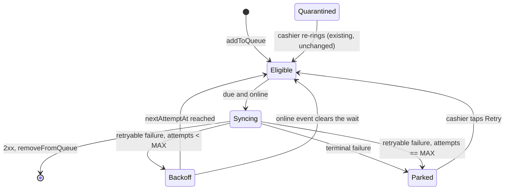

# fix: Stop the offline sale queue busy-looping and make failures visible

## Overview

`client/src/shared/hooks/useOffline.ts` retries a failed sale replay with no delay, for as long as
the queue is non-empty and the till is online. There is no attempt counter, no backoff, and no way
for a permanently-rejecting sale to stop spinning or to become visible to the cashier as something
that needs attention.

This plan adds a per-entry retry state (attempt count, next-attempt time, terminal failure flag)
to the persisted queue, replaces the identity-driven auto-sync effect with a scheduled one, and
surfaces parked entries in the existing "needs manual review" banner with an explicit Retry action.

It also fixes a second, unreported defect discovered in the same file while planning: queue entries
are identified by `id: Date.now()`, so two sales queued in the same millisecond share an id and
`removeFromQueue` deletes both — a silently lost sale, with the same P0 blast radius as the issue
itself.

The `Idempotency-Key` contract, the queued payload, the split-mismatch quarantine, and every
behavior of a queue that syncs successfully on the first attempt are unchanged.

## Problem Frame

### The busy loop (issue #30, problem 1)

`useOffline` destructures the whole store (`const { queue, removeFromQueue, ... } = useOfflineStore()`),
so every `set()` re-renders the hook. `syncQueue` is a `useCallback` whose deps include `isSyncing`
and `queue`. The auto-sync effect depends on `syncQueue`:

```
setSyncing(true)  -> store set -> re-render -> new syncQueue identity -> effect re-fires (guarded by isSyncing)
   ...replay fails, item stays queued...
setSyncing(false) -> store set -> re-render -> new syncQueue identity -> effect re-fires -> syncQueue runs again
```

Nothing spaces those iterations. `queue.length` is also a dep but is unchanged on failure, so it is
`syncQueue`'s identity that drives the spin. The existing test suite documents this rather than
asserting it — `failingTransport()` in `client/src/shared/hooks/useOffline.test.tsx` has to *hang*
the second attempt, with the comment "the hook retries a failed replay for as long as the queue is
non-empty", precisely so the test can observe post-failure state instead of a spin.

Two consequences beyond the one the issue names:

- A **quarantined-only queue spins with zero network requests.** Every entry hits
  `if (isQuarantined(item)) continue`, so the loop does no work at all, yet `queue.length > 0`
  keeps the effect re-firing and `setSyncing` keeps churning store state. A till that has parked
  one legacy sale burns CPU and re-renders `Layout` indefinitely.
- A **server outage becomes a request storm.** Every online till with a queued sale hammers a
  recovering server as fast as its event loop allows, with no jitter.

### The double-charge window (issue #30, problem 2) — already closed

The issue states "the queue has no idempotency key, so the server cannot recognise the retry as the
same sale." **That is no longer true.** It was closed by
`docs/plans/2026-08-30-002-fix-pos-concurrency-idempotency-plan.md` (Unit 9, shipped in `1c8d7fb`,
PR #60), which post-dates the issue. Verified in the current tree:

- `OfflineAction.idempotencyKey` is persisted on the queue entry
  (`client/src/shared/store/offlineStore.ts`).
- `useOffline.ts` replays it verbatim, and omits the field entirely for pre-key entries.
- `client/src/shared/lib/transport/http.ts` sends it as the `Idempotency-Key` header.
- Server-side, `server/src/http/idempotency.ts` wraps `POST /api/v1/sales` and three sibling
  mutations; `server/tests/concurrency/sales.idempotency.test.ts` proves 20 simultaneous identical
  posts commit one sale.

This plan therefore does **not** re-implement idempotency. It treats the key as an existing
guarantee and relies on it: because a replay is safe, the retry budget below can be generous, and
an attempt cap is a *visibility* mechanism rather than a correctness one.

### Queue-entry identity (found while planning, in scope per user decision)

```
addToQueue: (action) => set((state) => ({
  queue: [...state.queue, { ...action, id: Date.now(), createdAt: ... }],
}))
```

`removeFromQueue(id)` and `markMismatched(id)` both filter/map on that id. Two sales queued within
the same millisecond — an offline cashier ringing up quickly, or any programmatic double-enqueue —
collide, and syncing the first silently deletes the second. That is unrecoverable data loss in the
same file, on the same P0 surface. The retry state this plan adds is *also* keyed by id, so the
collision would corrupt attempt counters too.

### Persisted `isSyncing` (latent, adjacent)

`isSyncing` sits in the persisted slice with no `partialize`. A tab killed mid-sync writes
`isSyncing: true` to `localStorage`; on the next load `syncQueue` early-returns forever and the
queue never syncs again. This plan fixes it because the scheduler it introduces would otherwise
inherit the same trap.

## Requirements Trace

- **R1.** A failed replay never retries immediately. Consecutive failures back off exponentially
  with a ceiling and jitter.
- **R2.** An entry that keeps failing stops being auto-replayed after a bounded number of attempts
  and becomes visible to the cashier as "failed to sync".
- **R3.** A rejection the server will never accept (a deterministic 4xx) parks immediately rather
  than consuming the retry budget.
- **R4.** A parked entry is never dropped and is recoverable by an explicit cashier action that
  resets its retry state.
- **R5.** Queue entries have collision-free identity, so syncing one entry can never remove another.
- **R6.** A queue whose every entry is ineligible (quarantined, parked, or not yet due) performs no
  work and schedules no immediate wake-up.
- **R7.** No behavior change for a queue that syncs on the first attempt. Entries already persisted
  in cashiers' browsers — which carry none of the new fields and a numeric id — keep replaying
  exactly as they do today.
- **R8.** The `Idempotency-Key` replay contract established by #42 is unchanged: the same key on
  every replay of the same queued sale, no key for pre-key entries.

## Scope Boundaries

- **Not** re-implementing or changing idempotency-key generation or stamping — shipped in #42,
  Unit 9. This plan consumes that guarantee.
- **Not** changing the queued sale payload, its `contractVersion` stamping, or the existing
  `SPLIT_PAYMENT_MISMATCH` quarantine semantics. The split-mismatch branch becomes one case of the
  new terminal classification; its outcome is identical.
- **No server changes.** `Idempotent-Replay` is not readable cross-origin today (no
  `exposedHeaders` in `server/index.ts`), but nothing in this plan needs to read it. Recorded as a
  follow-up below.
- **Not** changing `client/src/app/session.ts`, which calls `clearQueue()` on logout and therefore
  discards unsynced sales. Real, out of scope, recorded as a follow-up.
- **Not** background or service-worker sync, and not general PWA/offline policy — that is #53.
- **Not** retrying non-`sale` queue entry types. `type: 'sale'` is the only type ever enqueued
  today; the retry state is generic but only the sale branch exercises it.

## Context & Research

### Relevant Code and Patterns

- `client/src/shared/hooks/useOffline.ts` — the hook under change: online/offline listeners,
  `syncQueue`, and the auto-sync effect.
- `client/src/shared/store/offlineStore.ts` — persisted queue (`moon-offline-queue` via
  `client/src/shared/lib/storageKeys.ts`), `OfflineAction` / `OfflineQueueItem`, `isQuarantined`,
  `markMismatched`. **The pattern to follow throughout**: `contractVersion` and `idempotencyKey` are
  both optional additive fields with an explicitly documented meaning for entries that predate them.
  Every field this plan adds follows that shape.
- `client/src/shared/lib/transport/types.ts` — `ApiError { status, code, details }`. Note that
  `client/src/shared/lib/transport/http.ts` deliberately discards axios's "Network Error" text, so a
  **network failure surfaces as `ApiError` with `status: null`** — that is the primary retryable
  signal.
- `client/src/shared/lib/transport/idempotency.ts` — `createIdempotencyKey()`, with a documented
  `crypto.randomUUID` → `crypto.getRandomValues` → `Math.random` fallback chain for a till served
  over plain HTTP on a shop LAN. Reuse for queue-entry ids rather than minting a second scheme.
- `client/src/shared/lib/checkout.ts` — `SPLIT_PAYMENT_MISMATCH_CODE`, the existing precedent for
  a named error code shared between `CartPanel.tsx` and `useOffline.ts`.
- `client/src/app/Layout.tsx:73-92` — the two existing banner branches (offline, and
  always-visible quarantined-needs-review). The new "failed to sync" state extends the second.
- `client/src/features/pos/components/CartPanel.tsx:468-500` — the only `addToQueue` call site.
- `client/src/shared/i18n/en.json` / `ar.json` — flat `offline.*` keyspace, `{param}` interpolation.
  Verified at key parity (1395 keys each) as of this plan; keep it that way.

### Institutional Learnings

`docs/solutions/` is empty. The nearest institutional record is
`docs/plans/2026-08-30-002-fix-pos-concurrency-idempotency-plan.md`, which is the direct upstream:

> "**Not** fixing the client offline queue's replay/quarantine logic — that is #30. This plan
> touches the client only to stamp and persist a stable idempotency key."

and, in its Unchanged Invariants: "the offline queue's quarantine semantics". This plan is the
other half of that split, and inherits its constraint that persisted entries from before a change
must keep working.

Server error codes that constrain the classifier (from `server/src/http/idempotency.ts`), both
409s and easy to conflate:

| `details[0].code` | Meaning | Correct client action |
|---|---|---|
| `IDEMPOTENCY_KEY_REUSED` | Same key, different payload/endpoint/user | **Park.** A human must resolve it; retrying is guaranteed to fail identically. |
| `IDEMPOTENCY_UNRESOLVED` | A concurrent duplicate held the claim past a 3s `lock_timeout` | **Retry.** The message literally says "Please retry." |

A failed server mutation *releases* its idempotency key (the claim shares the business
transaction's fate), so a corrected retry under the same key runs normally. Retrying is therefore
safe at every point in this design.

### External References

None gathered. This is a standard retry/backoff shape, and the repo already carries every pattern
the work needs (optional additive persisted fields, transport-seam test fakes, the quarantine
concept). External research would have added nothing the local code does not already answer.

## Key Technical Decisions

- **Per-entry retry state, not queue-level.** A poison sale must not stall a healthy one behind it.
  The queue is already iterated per item with per-item outcomes (`removeFromQueue`,
  `markMismatched`); attempt counters belong at the same granularity.
  *(user decision: "Backoff + attempt cap → needs-review")*

- **Failures are classified before they are counted.** A deterministic 4xx parks on the first
  failure; only genuinely retryable failures consume the backoff budget. Burning ten spaced-out
  attempts on a validation error the server will never accept is the same busy loop, just slower.

  | Outcome | Classification | Rationale |
  |---|---|---|
  | `status: null` (network failure) | Retryable | The till or the link is down; nothing is wrong with the sale. |
  | `>= 500` | Retryable | Server-side, transient by assumption. |
  | `408`, `429` | Retryable | Explicitly "try again"; `429` uses the backoff ceiling as its floor. |
  | `401` | Retryable | The transport's refresh interceptor may recover it; a hard failure redirects to login and moots the question. |
  | `409` + `IDEMPOTENCY_UNRESOLVED` | Retryable | The server says to retry. |
  | `409` + `IDEMPOTENCY_KEY_REUSED` | **Terminal** | The payload no longer matches the key. Needs a human. |
  | `400` + `SPLIT_PAYMENT_MISMATCH` | **Terminal** (existing `markMismatched` path, unchanged) | Already the established behavior. |
  | Any other `4xx` | **Terminal** | Deterministic; a replay produces the identical rejection. |

- **A generous retryable budget, a hard terminal one.** `MAX_RETRYABLE_ATTEMPTS = 10` with a base
  of 1s, a 5-minute ceiling and ±20% jitter — roughly 40 minutes of trying before parking. Because
  idempotency makes replay safe, the cost of retrying too long is bounded, whereas parking a
  legitimate sale during a ten-minute server restart forces manual re-ringing. Terminal failures
  park at attempt one.

- **Jitter is not optional.** Every till in the shop comes back online on the same `online` event
  and would otherwise retry in lockstep against a server that just restarted.

- **The scheduler replaces the identity-driven effect.** `syncQueue` reads the queue via
  `useOfflineStore.getState()` at call time rather than closing over it, so it no longer depends on
  `queue` or `isSyncing` and its identity stops churning. A separate effect subscribes to a *scalar*
  — the earliest due `nextAttemptAt` among eligible entries — and arms a single `setTimeout`. When
  nothing is eligible, no timer is armed at all (R6). This is the actual root-cause fix; backoff
  values alone would only slow the loop down.

- **An in-flight guard that is not the persisted flag.** A `useRef` guards re-entry within the
  session; `isSyncing` stays as the store-visible indicator but is removed from the persisted slice
  (`partialize`), with an `onRehydrateStorage` reset so blobs already carrying `isSyncing: true`
  from a killed tab do not permanently deadlock the queue.

- **Queue ids become opaque strings via `createIdempotencyKey()`.** Reusing the existing generator
  keeps one uniqueness scheme in the client and inherits its non-secure-context fallback, which the
  till deployment actually needs. `id` widens to `string | number` so numeric ids already in
  `localStorage` keep matching. *(user decision: "Fix it in this plan")*

- **Parking is reversible and never destructive.** A parked entry keeps its payload and its
  idempotency key; Retry clears `syncFailed`, `attempts` and `nextAttemptAt` and nothing else. The
  key is deliberately preserved — if the original attempt did commit server-side, the manual retry
  replays onto the same key and returns the original outcome instead of double-charging.

- **`isQuarantined` is not widened.** It keeps its current two meanings (legacy-unversioned,
  split-mismatched) so existing tests and comments stay true. A new `needsReview(item)` predicate
  covers "quarantined or parked", and the hook exposes both counts so the banner can say which is
  which.

## Open Questions

### Resolved During Planning

- *Does #30's double-charge half still need work?* No — closed by #42 Unit 9 (`1c8d7fb`). Verified
  in the current tree at all four layers (store field, hook replay, transport header, server
  wrapper + real-PG test). The issue text predates that commit.
- *Should an attempt cap exist at all, given replays are now idempotent?* Yes, but as a visibility
  mechanism. Hence the generous retryable budget and the immediate terminal park.
- *Reuse `isQuarantined` for the parked state, or add a new one?* New flag, new predicate. See above.
- *Is the `Date.now()` id collision in scope?* Yes — user decision.
- *Does the client need to read `Idempotent-Replay`?* No. Nothing in this design branches on
  whether a replay was a replay; a 2xx means "committed, dequeue" either way. Which is fortunate,
  because it is not currently exposed cross-origin.

### Deferred to Implementation

- **Exact `waitFor` / fake-timer interaction.** `client/vitest.config.ts` configures no global fake
  timers and `client/src/shared/tests/setup.ts` adds none. Testing backoff needs `vi.useFakeTimers()`
  per-test with `advanceTimersByTime` wrapped in `act`; whether `@testing-library/react`'s `waitFor`
  needs an explicit `advanceTimers` option under this vitest version is worth one experiment rather
  than a guess in a plan.
- **Whether the scheduler effect wants `nextAttemptAt` as an epoch scalar or a derived
  `dueInMs`.** Both avoid the identity churn; which reads better falls out of writing it.
- **Whether `recordFailure` and `markMismatched` collapse into one store action.** They may be the
  same operation with different terminal reasons once both exist.
- **Whether `Layout.tsx` wants one combined review banner or two.** Depends on how the two message
  strings read side by side once translated.

## High-Level Technical Design

Directional only — shapes and control flow, not signatures.

### Entry lifecycle



`Quarantined` (legacy-unversioned / split-mismatched) is the pre-existing state and is entered by
the paths that already exist. `Parked` is new. Both render in the review banner; neither is ever
auto-replayed.

### Scheduling, in outline

```
syncQueue():                         # no queue/isSyncing in its closure
  if offline or in-flight: return
  items = getState().queue
  due   = items where not quarantined, not parked, nextAttemptAt <= now
  if due is empty: return            # R6 - no work, no state churn
  for item in due:
     try post -> removeFromQueue
     catch -> classify(err) -> recordFailure(id, classification)

scheduler effect (deps: isOnline, earliestDueAt):
  if offline or nothing eligible: arm nothing
  if something is due now: syncQueue()
  else: setTimeout(syncQueue, earliestDueAt - now)   # cleared on unmount/dep change

backoff(attempts) = min(1s * 2^(attempts-1), 5min) * jitter(0.8 .. 1.2)
```

The `online` event handler additionally clears pending `nextAttemptAt` values (without resetting
`attempts`), so reconnecting retries at once but a poison item still parks on schedule.

## Implementation Units

- [ ] **Unit 1: Collision-free queue-entry identity**

**Goal:** Make a queue entry's id unique, so syncing one entry can never delete another — and so
the per-entry retry state Units 2-3 add is addressable at all.

**Requirements:** R5, R7

**Dependencies:** None

**Files:**
- Modify: `client/src/shared/store/offlineStore.ts` (`OfflineQueueItem.id` widens to
  `string | number`; `addToQueue` mints via `createIdempotencyKey()`)
- Modify: `client/src/shared/hooks/useOffline.ts` (id type only, if it names the type)
- Test: `client/src/shared/store/offlineStore.test.ts` (extend)

**Approach:**
- Widen the type rather than migrate persisted data. Entries already in `localStorage` carry
  numeric ids; `filter`/`map` on `!==` / `===` keeps matching them, so no rehydrate migration is
  needed and R7 holds for free.
- Reuse `createIdempotencyKey()` from `client/src/shared/lib/transport/idempotency.ts` rather than
  calling `crypto.randomUUID()` directly — a till on plain HTTP has no secure context, and that
  function already documents and handles the fallback chain.
- Consider a thin named re-export (`createQueueItemId`) so the store does not read as if the queue
  id and the `Idempotency-Key` are the same concept. They are generated the same way and mean
  different things.
- Sanity-check that nothing outside the store treats `id` as a number (arithmetic, sort, `toFixed`).
  Grep says the only consumers are the store's own `filter`/`map` and test fixtures, but confirm.

**Patterns to follow:**
- `client/src/shared/lib/transport/idempotency.ts` — the existing generator and its documented
  secure-context fallback.

**Test scenarios:**
- Happy path: two `addToQueue` calls in immediate succession produce two entries with different ids.
- Happy path: `removeFromQueue` on one of two same-millisecond entries leaves exactly the other.
- Edge case: an entry rehydrated with a legacy numeric id is still removable by that numeric id.
- Edge case: `markMismatched` on one of two entries flags exactly one.
- Edge case: ids survive a persist round-trip (`useOfflineStore.persist.rehydrate()`), mirroring the
  existing `idempotencyKey` round-trip test in the same file.

**Verification:**
- No pair of entries enqueued in the same tick shares an id, and removing one never affects another.
- Entries persisted before this change still remove and flag correctly.

---

- [ ] **Unit 2: Retry state on the persisted queue entry**

**Goal:** Give each entry an attempt count, a next-attempt time, and a terminal-failure flag, plus
the store actions that move it between those states — with entries persisted before this change
behaving exactly as they do today.

**Requirements:** R1, R2, R4, R6, R7

**Dependencies:** Unit 1

**Files:**
- Modify: `client/src/shared/store/offlineStore.ts`
- Test: `client/src/shared/store/offlineStore.test.ts` (extend)

**Approach:**
- Add to `OfflineAction`, all optional and all documented in the house style already used for
  `contractVersion` and `idempotencyKey` (what the field means, and what its absence means for an
  entry persisted before it existed): `attempts?`, `nextAttemptAt?` (ISO string, matching
  `createdAt`), `syncFailed?`, and a short `lastFailure?` reason for the UI and for support.
- New actions: `recordFailure(id, { retryable, reason })` — increments `attempts`, and either sets
  `nextAttemptAt` from the backoff formula or sets `syncFailed: true` when terminal or when the
  budget is exhausted; `clearRetryState(id?)` — the cashier's Retry, clearing `syncFailed`,
  `attempts` and `nextAttemptAt` (and **not** `idempotencyKey`, so a manual retry of a sale that
  did commit replays onto the original key); `clearBackoff()` — drops pending `nextAttemptAt` on
  reconnect without touching `attempts`.
- Export the backoff policy as named constants (`RETRY_BASE_MS`, `RETRY_CEILING_MS`,
  `MAX_RETRYABLE_ATTEMPTS`, jitter fraction) and a pure `nextAttemptDelay(attempts)` so the tests
  assert the policy, not a hard-coded ladder.
- Add `needsReview(item)` alongside `isQuarantined`, and a `getFailedCount()` selector. Leave
  `isQuarantined` semantically untouched.
- Remove `isSyncing` from the persisted slice via `partialize`, and force it to `false` in
  `onRehydrateStorage` so a blob persisted as `true` by a killed tab cannot deadlock the queue.
- An entry with no `attempts` field is at attempt zero and due immediately — that is what makes R7
  hold.

**Patterns to follow:**
- `client/src/shared/store/offlineStore.ts` — the `contractVersion` / `idempotencyKey` doc-comment
  shape, and `isQuarantined` as a standalone exported predicate rather than a method.

**Test scenarios:**
- Happy path: `recordFailure(id, { retryable: true })` on a fresh entry sets `attempts: 1` and a
  `nextAttemptAt` in the future.
- Happy path: successive retryable failures produce strictly increasing delays until the ceiling,
  after which they stay at the ceiling (assert the band, since jitter is applied).
- Happy path: `recordFailure(id, { retryable: false })` sets `syncFailed: true` immediately, with
  `attempts: 1` — the budget is not consumed.
- Edge case: the `MAX_RETRYABLE_ATTEMPTS`-th retryable failure sets `syncFailed: true` rather than
  scheduling another attempt.
- Edge case: `nextAttemptDelay` never returns a value outside `[base*0.8, ceiling*1.2]` across the
  attempt range.
- Edge case: an entry with no `attempts`/`nextAttemptAt` (persisted before this unit) is reported
  as due now and not failed.
- Edge case: `clearRetryState` clears `attempts`, `nextAttemptAt` and `syncFailed` but preserves
  `payload`, `idempotencyKey` and `contractVersion`.
- Edge case: `clearBackoff` drops `nextAttemptAt` and leaves `attempts` intact.
- Edge case: `needsReview` is true for a legacy entry, a mismatched entry, and a `syncFailed`
  entry, and false for a healthy one; `isQuarantined` still answers false for a `syncFailed` entry.
- Edge case: rehydrating a persisted blob containing `isSyncing: true` yields `isSyncing: false`,
  and a fresh persist writes no `isSyncing` key at all.
- Integration: retry fields survive a persist round-trip via `useOfflineStore.persist.rehydrate()`.

**Verification:**
- The retry state machine is fully exercisable through store actions with no React involved.
- Entries persisted before this unit are indistinguishable from fresh ones at attempt zero.

---

- [ ] **Unit 3: Classify failures and replace the busy loop with a scheduler**

**Goal:** Stop the unbounded retry. Classify each replay failure, apply the retry state from Unit 2,
and drive auto-sync from a timer keyed on the earliest due entry rather than from callback identity.

**Requirements:** R1, R2, R3, R6, R7, R8

**Dependencies:** Unit 2

**Files:**
- Modify: `client/src/shared/hooks/useOffline.ts`
- Create: `client/src/shared/lib/offlineRetry.ts` (the failure classifier, as a pure function of
  `unknown` → `{ retryable, reason }`)
- Test: `client/src/shared/lib/offlineRetry.test.ts`
- Test: `client/src/shared/hooks/useOffline.test.tsx` (extend, and rewrite `failingTransport`)

**Approach:**
- The classifier is a pure function over `ApiError` and lives in `shared/lib/` so it can be tested
  exhaustively without rendering anything. It implements the table in Key Technical Decisions —
  most importantly, it must distinguish the two 409 codes: `IDEMPOTENCY_UNRESOLVED` is retryable
  and `IDEMPOTENCY_KEY_REUSED` is terminal, and getting that backwards either parks a recoverable
  sale or spins on an unrecoverable one.
- A non-`ApiError` throw (a bug in the hook itself) classifies as terminal, so a defect surfaces to
  a human instead of retrying forever.
- `syncQueue` stops closing over `queue` and `isSyncing`: it reads `useOfflineStore.getState()` at
  call time and guards re-entry with a `useRef`. Its `useCallback` deps shrink to `[isOnline,
  transport]` (plus stable store actions), which is what stops the identity churn.
- Prefer narrow `useOfflineStore(selector)` subscriptions over destructuring the whole store, so an
  unrelated `set()` no longer re-renders the hook and `Layout` beneath it.
- The auto-sync effect depends on `isOnline` and the earliest due timestamp among eligible entries.
  Nothing eligible → no timer armed (R6). Something due later → one `setTimeout`, cleared on
  cleanup. Something due now → call `syncQueue`.
- Keep the split-mismatch branch as the first terminal case so its existing behavior and its
  `offline.splitMismatch` toast are byte-identical; route it through `recordFailure` only if that
  does not change what the cashier sees.
- Preserve the `...(item.idempotencyKey ? { idempotencyKey: ... } : {})` conditional spread exactly
  — R8 depends on a pre-key entry sending no header at all, and the existing test asserts the
  request object has no such property.
- The `online` handler calls `clearBackoff()` before the effect re-evaluates, so reconnecting
  retries promptly rather than waiting out a backoff that a network change just invalidated.
- Extend the hook's return with `failedCount` for Unit 4, and a `retryFailed` action.

**Execution note:** Write the classifier's test table first — it is a pure function with an
enumerable input space, and the two-409-codes distinction is the single easiest thing in this plan
to get backwards.

**Patterns to follow:**
- `client/src/shared/lib/checkout.ts` — a shared, testable pure module holding a named error-code
  contract used by both `CartPanel.tsx` and `useOffline.ts`.
- The existing hand-written `Transport` object in `useOffline.test.tsx`'s split-mismatch test — the
  established way to fake repeated/typed failures, since `createMemoryTransport().failNext` only
  fails the next matching request.

**Test scenarios:**

*Classifier (`offlineRetry.test.ts`):*
- Happy path: `ApiError` with `status: null` (the shape `http.ts` produces for a network failure) →
  retryable.
- Happy path: `500`, `502`, `503` → retryable; `408`, `429`, `401` → retryable.
- Error path: `409` with `details[0].code === 'IDEMPOTENCY_UNRESOLVED'` → retryable.
- Error path: `409` with `details[0].code === 'IDEMPOTENCY_KEY_REUSED'` → terminal.
- Error path: `400` with a `SPLIT_PAYMENT_MISMATCH` detail → terminal, carrying the mismatch reason.
- Error path: `400`, `403`, `404`, `422` with no special code → terminal.
- Edge case: a plain `Error` or a thrown string → terminal.
- Edge case: `409` with no `details` → terminal (unknown conflict, needs a human).

*Hook (`useOffline.test.tsx`):*
- Happy path: a successful replay still dequeues, still posts exactly one request with the exact
  queued body, and still sends the stored idempotency key (the existing tests, unchanged).
- **Regression, the issue's core claim:** with a transport that always rejects with a 500, exactly
  one attempt occurs before the timers are advanced — replacing today's `failingTransport`, whose
  comment documents the spin. Rewrite that helper and its docstring; leaving it would leave the
  suite asserting the old behavior.
- Happy path: advancing timers past the first backoff produces a second attempt, and past the second
  produces a third, with the third strictly later than the second.
- Happy path: an attempt that succeeds after two failures dequeues the entry and clears its retry
  state.
- Error path: a terminal 400 produces exactly one attempt, marks the entry `syncFailed`, and no
  further attempt occurs however far the timers advance.
- Error path: `MAX_RETRYABLE_ATTEMPTS` consecutive 500s park the entry; the attempt count stops
  growing after that.
- Edge case (R6): a queue containing only quarantined entries issues zero requests, and no timer is
  pending after the effect settles — the case that busy-loops with zero network traffic today.
- Edge case (R6): a queue whose only entry is in backoff issues no request until its
  `nextAttemptAt`, and a queue whose only entry is parked issues none at all.
- Edge case: a poison entry in backoff does not delay a healthy entry queued behind it — the
  healthy one posts on the next due sweep.
- Edge case: an `online` event while an entry is in backoff triggers an attempt immediately and
  does not reset `attempts`.
- Edge case (R8): a pre-key entry replays with no `idempotencyKey` property on the request; a keyed
  entry replays under the same key on every attempt, not a fresh one per retry.
- Edge case: the split-mismatch rejection still marks the entry mismatched and still surfaces the
  existing toast, with sync not blocked for other entries.
- Edge case: unmounting mid-backoff clears the pending timer (no post-unmount state update).
- Integration: the offline → online → replay → dequeue path end-to-end through the hook, with the
  banner counts the hook returns matching the store at each step.

**Verification:**
- A permanently-rejecting sale produces a bounded, strictly increasing sequence of attempts and then
  stops, instead of an unbounded burst.
- A quarantined-only or parked-only queue arms no timer and issues no request.
- Every existing test in `useOffline.test.tsx` still passes, except `failingTransport`, which is
  rewritten because it encodes the bug being fixed.

---

- [ ] **Unit 4: Surface parked entries and give the cashier a way back**

**Goal:** Make "this sale failed to sync" visible where the cashier already looks for queue trouble,
with an explicit action that puts the entry back in play.

**Requirements:** R2, R4

**Dependencies:** Unit 3

**Files:**
- Modify: `client/src/app/Layout.tsx` (review banner branch + Retry control)
- Modify: `client/src/shared/i18n/en.json`
- Modify: `client/src/shared/i18n/ar.json`
- Create: `client/src/app/__tests__/Layout.test.tsx` (the app layer keeps its tests in
  `client/src/app/__tests__/`, alongside `Sidebar.test.tsx` and `UIProvider.test.tsx`, rather than
  colocated — follow that layer's existing placement, not the general R5 colocation rule)

**Approach:**
- The hook already returns `quarantinedCount`; add `failedCount` and `retryFailed`. The existing
  always-visible `isOnline && quarantinedCount > 0` branch is the model — parked entries have the
  same "never resolves on its own" property and belong in the same place.
- New keys in the established flat `offline.*` keyspace with `{count}` interpolation:
  `offline.failedToSync` and `offline.retry`. Add both to `en.json` and `ar.json` at the same
  position; the files are currently at exact key parity (1395 each) and must stay there.
- The Retry control calls `clearRetryState()` for all parked entries, which makes them eligible and
  lets Unit 3's scheduler pick them up on the next tick. It does not itself post anything.
- Match the existing banner's markup and warning tokens rather than introducing a new treatment;
  RTL-safe logical properties per `docs/CONVENTIONS.md`.
- Keep the offline-banner branch's message composition unchanged — only the online review branch
  gains the new state.

**Patterns to follow:**
- `client/src/app/Layout.tsx:87-92` — the existing always-visible quarantined-review banner.
- `client/src/shared/i18n/en.json:600-606` — the `offline.*` block and its `{count}` phrasing.

**Test scenarios:**
- Happy path: with one parked entry and the till online, the banner renders the failed-to-sync
  message with the correct count.
- Happy path: tapping Retry clears `syncFailed`/`attempts`/`nextAttemptAt` on every parked entry in
  the store.
- Edge case: parked and quarantined entries coexisting render both messages with independent,
  correct counts — a parked entry is not counted as quarantined, and vice versa.
- Edge case: with a healthy queue, neither review banner renders.
- Edge case: while offline, the offline banner still composes exactly as it does today.
- Edge case: the Retry control has an accessible name and is reachable by keyboard.
- Edge case: both new keys exist in `en.json` and `ar.json`, and the two files remain at key parity
  (a parity assertion is worth adding if the suite has none).

**Verification:**
- A cashier can see that a sale failed to sync and can put it back in the queue without dev tools.
- `en.json` and `ar.json` still have identical key sets.

---

- [ ] **Unit 5: Record the replay contract**

**Goal:** Write down the retry/park semantics so the next change to this file does not reintroduce
the loop.

**Requirements:** R1, R2, R4

**Dependencies:** Units 1-4

**Files:**
- Modify: `docs/CONVENTIONS.md` (a short "offline queue replay contract" entry near the existing
  global string-coupling section, which already discusses `moon-offline-queue`)
- Modify: `CLAUDE.md` (one line in the offline/PWA area pointing at the contract)

**Approach:**
- State the four invariants plainly: every queued entry has a unique id; a failed replay is
  classified before it is counted; a retryable failure backs off and a deterministic one parks; a
  parked entry is never dropped and only a cashier action revives it.
- Note that the retry budget is deliberately generous *because* replays carry an idempotency key,
  and link the #42 plan — the two decisions are coupled, and someone removing the key later would
  need to shrink the budget.
- Add the persisted-field rule that this file has now applied three times (`contractVersion`,
  `idempotencyKey`, and this plan's retry fields): a new field on a persisted queue entry is
  optional and documents what its absence means.

**Test scenarios:**
- Test expectation: none — documentation only. The behavior it describes is covered by Units 1-4.

**Verification:**
- The contract is discoverable from `docs/CONVENTIONS.md` without reading `useOffline.ts`.

## System-Wide Impact

- **Interaction graph:** `useOffline` has exactly one consumer, `client/src/app/Layout.tsx`, which
  wraps every authenticated page — so a re-render loop in the hook re-renders the whole shell.
  Narrowing the store subscription (Unit 3) removes that pressure as a side effect of the fix. The
  only enqueue site is `CartPanel.tsx`; it is untouched.
- **Error propagation:** a replay failure currently vanishes into a bare `catch`. After this plan it
  becomes a classified, persisted, cashier-visible outcome. The classifier is the single place that
  decides retryable vs terminal — a new server error code that should be retried needs adding there
  and nowhere else.
- **State lifecycle risks:** the queue is persisted in `localStorage` on real tills with real
  unsynced sales. Every new field is optional, and the id widening is type-only, so a cashier
  updating mid-shift keeps their queue. The one persisted-state *change* is removing `isSyncing`,
  which is a strict improvement (it currently deadlocks a queue after a mid-sync tab kill) — but it
  needs the explicit rehydrate reset, not just `partialize`, since existing blobs already contain
  `true`.
- **API surface parity:** none. No server change, no request shape change, no new endpoint. The
  request `useOffline` sends after this plan is byte-identical to the one it sends today.
- **Integration coverage:** the timing behavior cannot be proven by store unit tests alone — the
  loop lives in the interaction between `useCallback` identity, store subscriptions and effect deps.
  The Unit 3 hook tests with fake timers are where the issue's actual claim is verified.
- **Unchanged invariants:** the queued sale payload and its `contractVersion`; the `Idempotency-Key`
  contract from #42 (same key on every replay, no key for pre-key entries); `isQuarantined`'s two
  existing meanings and the `SPLIT_PAYMENT_MISMATCH` quarantine outcome; the offline banner's
  composition; `clearQueue()` on logout; every server endpoint and response.

## Risks & Dependencies

| Risk | Mitigation |
|---|---|
| A too-eager attempt cap parks legitimate sales during a routine server restart, forcing manual re-ringing — turning a UX fix into a workflow regression | Budget sized for ~40 minutes of retrying (10 attempts, 5-min ceiling), which is only affordable because replays are idempotent. Terminal 4xx park immediately, so the budget is spent only on genuinely transient failures. |
| The classifier gets the two 409 codes backwards, parking recoverable sales or spinning on unrecoverable ones | Both codes are enumerated in Key Technical Decisions and have dedicated tests; the classifier is a pure function tested independently of the hook, written test-first. |
| Fake-timer tests are flaky or the hook's timer leaks across tests | An explicit unmount-clears-the-timer test; per-test `vi.useFakeTimers()` with restore in `afterEach`, matching the file's existing `navigator.onLine` save/restore discipline. |
| The persisted-state change strands a cashier's queued sales | Every new field optional; id widened rather than migrated; the `isSyncing` removal paired with an explicit rehydrate reset. Covered by round-trip tests in Units 1 and 2. |
| Fleet-wide retry stampede against a recovering server | ±20% jitter on every computed delay, and a 5-minute ceiling. |
| Scope creep into #53 (PWA/offline policy) or back into #42 (idempotency) | Both named as explicit non-goals; the request shape is an unchanged invariant. |
| `docs/plans/2026-08-30-002-…` is `status: completed` but its Unit 9 client code is what this plan builds on — a later revert there silently breaks R8 | Unit 5 documents the coupling: the generous retry budget is justified *by* the idempotency key. |

## Documentation / Operational Notes

- No deploy coupling and no env flag. This is client-only and independently deployable; a till on
  the old bundle keeps working against the same server.
- No change to the `IDEMPOTENCY_REQUIRED` flip criterion in `CLAUDE.md`. Worth noting for whoever
  flips it: after this plan a parked sale stops posting, so the "keys per day matches sales per day"
  observable can legitimately undercount by the number of parked entries.
- Support-facing behavior change: a cashier may now see "N sale(s) failed to sync". The runbook
  answer is the Retry control; the sale is not lost and its idempotency key guarantees a retry
  cannot double-charge.

**Follow-ups this plan deliberately does not do:**
- `client/src/app/session.ts:36` calls `clearQueue()` on logout, discarding unsynced sales. Parking
  makes this more likely to bite, since a parked sale can now sit in the queue across a shift change.
  Worth its own issue.
- `server/index.ts` sets no `exposedHeaders`, so `Idempotent-Replay` is unreadable cross-origin.
  Nothing here needs it; a future "this was already recorded" receipt hint would.
- `server/index.ts` also sets no `allowedHeaders`; `Idempotency-Key` passes preflight only because
  the `cors` package echoes the requested headers by default. Undeclared, not broken.

## Sources & References

- Origin issue: [#30 — Offline sale queue busy-loops on failure and can double-charge](https://github.com/zhamdy/moon-store/issues/30)
- Upstream plan (server idempotency + client key stamping): `docs/plans/2026-08-30-002-fix-pos-concurrency-idempotency-plan.md`
- Checkout total parity (source of `contractVersion` and the quarantine concept): `docs/plans/2026-08-30-001-fix-pos-checkout-total-parity-plan.md`
- Related code: `client/src/shared/hooks/useOffline.ts`, `client/src/shared/store/offlineStore.ts`,
  `client/src/shared/lib/transport/`, `client/src/app/Layout.tsx`,
  `client/src/features/pos/components/CartPanel.tsx`, `server/src/http/idempotency.ts`
- Related PRs: #60 (idempotency), #59 (checkout totals), #13 (transport seam)
- Adjacent open issues: #53 (PWA/offline policy), #52 (mutation errors and double-submit), #57 (checkout reliability epic)
- Conventions: `docs/CONVENTIONS.md` (R5 placement, transport test seam, string-coupling contract)
