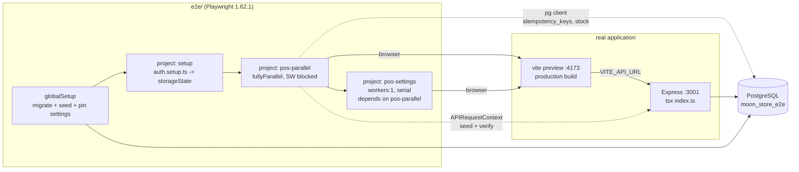
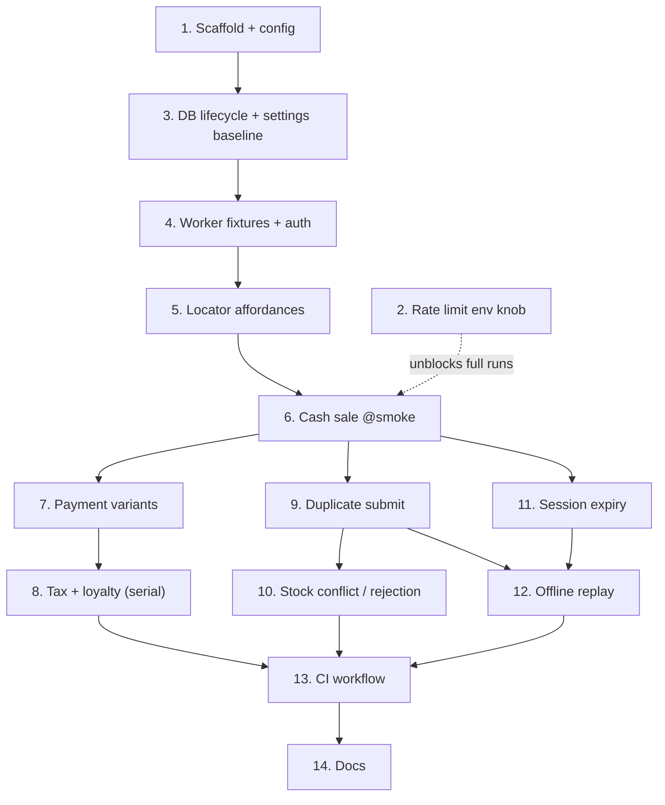

# test: End-to-end coverage for critical POS workflows

## Overview

Stand up a Playwright end-to-end suite that drives the real client build against a real Express
server and a real PostgreSQL database, and use it to cover the cashier workflows that carry money:
login, register readiness, search, cart, checkout across every payment and adjustment mode, and the
failure paths (stock conflict, rejected sale, expired session, duplicate submit, offline replay).

The repo has strong *unit* coverage — 42 client test files (~351 cases) and 35 server files (~290
cases), including real-PostgreSQL concurrency suites. What it has is coverage of **halves**. The
client's money math is proven against `contracts/checkout-totals.v1.json` through an in-process
memory transport; the server's idempotency and stock invariants are proven against real PostgreSQL
through direct service calls. **Nothing exercises the wire between them.** A regression in the
transport layer, the React Query cache, the offline scheduler's browser integration, or the
serialization boundary can land with every suite green.

This plan closes that gap. It is greenfield: there is no browser runner, no `e2e/` directory, and no
CI artifact upload anywhere in the repo today.

## Problem Frame

From issue #50:

> Unit and component tests do not verify the complete cashier workflow across routing, state,
> transport, and server behavior. Financial regressions can survive while isolated helpers remain
> green.

Two recently-closed issues make this urgent rather than merely nice:

- **#42** (`fix(pos)`, commit `1c8d7fb`) made sale creation concurrency-safe and idempotent. Its
  invariants — one sale per `Idempotency-Key`, guarded relative stock writes, `409
  IDEMPOTENCY_KEY_REUSED` on payload divergence — are proven at the service layer only. Whether the
  *browser* sends the header on a double-click, and whether the till's UI reflects a replayed
  outcome correctly, is untested.
- **#30** (`fix(offline)`, commit `49f29e8`) rebuilt the offline replay scheduler with backoff,
  parking, and per-entry idempotency keys. Its 26 tests run in jsdom with a fake transport. Whether
  a genuinely offline browser queues, and a genuinely reconnected browser replays exactly once, is
  untested.

Both are double-charge-adjacent. Unit tests cannot prove either end to end.

## Requirements Trace

Directly from the issue's scope and acceptance criteria:

- **R1.** Cover login, register readiness, product search, cart changes, and sale completion.
- **R2.** Cover cash, card, split payment, discount, tip, coupon, tax modes, loyalty, and receipt output.
- **R3.** Cover stock conflicts, expired sessions, rejected payments, duplicate submission, and retry.
- **R4.** Cover offline queueing and reconnection, in coordination with #30 and backend #42.
- **R5.** Use stable fixtures, and test IDs *only* where accessible queries are insufficient.
- **R6.** Critical POS paths run against a real application and API test environment.
- **R7.** Assertions verify both visible cashier state **and** persisted server state.
- **R8.** Duplicate interaction cannot create duplicate sales.
- **R9.** Failure cases preserve or recover cart state predictably.
- **R10.** Tests produce useful diagnostics and artifacts on CI failure.
- **R11.** A documented smoke subset runs quickly on pull requests.

## Scope Boundaries

- **Not** a rewrite or expansion of the existing vitest suites. Client unit tests keep the memory
  transport; server suites keep pg-mem and `describeWithPostgres`. This plan adds a third layer, it
  does not relocate the first two.
- **Not** cross-browser. Chromium only until the suite is green and stable; Firefox/WebKit is
  follow-up work with its own flake budget.
- **Not** visual regression, performance, or load testing.
- **Not** coverage tooling. The repo has no `@vitest/coverage-*` today and this plan does not add it.
- **Not** non-POS slices. Inventory, purchasing, fulfillment, analytics, and admin are touched only
  where a POS path requires them (e.g. an admin token seeding a product).
- **Not** a payment-gateway integration. There is none — `PaymentMethod` is `'Cash' | 'Card' |
  'Other'`, a label on the sale record with no processor behind it. See the scope clarification
  under Key Technical Decisions.
- **Not** the PWA service worker's own caching behavior. See D3.
- **Held carts are a deliberate addition beyond issue #50's stated requirements.** R1 names "cart
  changes" and R9 names failure-case cart preservation; hold/resume is neither, strictly read. It is
  included because it is a persisted, money-adjacent surface with a client-only lifecycle and no
  server record — the exact shape a jsdom test proves in isolation and a real browser breaks across a
  reload. Recorded here as an addition rather than mapped to a requirement it does not serve; drop it
  first if Unit 7 needs trimming.
- **Not** camera barcode *decoding*. `client/src/shared/hooks/useScanner.ts` drives Quagga2 in
  `LiveStream` mode against a real camera, and there is no keyboard-wedge path to substitute. Decoding
  a barcode from a synthetic video stream in headless Chromium is a disproportionate amount of
  machinery for the one step it would prove. The **consequence** of a scan — the
  `GET /api/v1/products/barcode/:barcode` lookup and the resulting cart line — is covered in Unit 6;
  only the optical decode is excluded. See the note in Unit 6.

## Context & Research

### Relevant Code and Patterns

**Client — the POS surface**

| Path | Note |
|---|---|
| `client/src/features/pos/pages/POS.tsx` | 527 lines. Main page; renders `CartPanel`, `BarcodeScanner`, `StartupPrompt`. |
| `client/src/features/pos/components/CartPanel.tsx` | 1487 lines. **Cart, checkout sheet, payment UI and receipt all live here.** There is no separate Checkout or Payment component. Holds `paymentMethod`, `splitPayment`, `payments[]`, `couponInput`, `redeemPoints`/`pointsToRedeem`, `receiptData`. |
| `client/src/features/pos/components/StartupPrompt.tsx` | Gates the till on an open shift + open register. Dismissal persists to `sessionStorage` under `moon-startup-dismissed`. |
| `client/src/features/auth/pages/Login.tsx` | HeroUI `Input`s via react-hook-form. No `data-testid`. |
| `client/src/shared/lib/checkout.ts` | Client projection of the money contract; consumes `contracts/checkout-totals.v1.json`. |
| `client/src/shared/lib/transport/client.ts` | `baseURL: import.meta.env.VITE_API_URL \|\| 'http://localhost:3001'`. **No Vite proxy** — the client always talks to an absolute origin. |
| `client/src/shared/lib/transport/http.ts:39` | The single place `Idempotency-Key` is attached. |
| `client/src/shared/hooks/useOffline.ts` | Replay scheduler. `REPLAY_TIMEOUT_MS = 30_000`, `RECONNECT_RETRY_THROTTLE_MS = 60_000`. Exports `resetOfflineSchedulerForTests()`. |
| `client/src/shared/store/offlineStore.ts` | Persisted queue; exports `isQuarantined`, `isParked`, `isEligible`, `earliestAttemptAt`. |
| `client/src/shared/lib/offlineRetry.ts` | `classifyFailure`, `FAILURE_REASON`, `RETRY_CEILING_MS`. |
| `client/src/shared/lib/storageKeys.ts` | `moon-auth`, `moon-cart-recovery`, `moon-held-carts`, `moon-offline-queue`, `moon-settings`. |
| `client/src/shared/store/settingsStore.ts` | **Default locale is `'ar'`, direction `rtl`.** `client/index.html` is `<html lang="ar" dir="rtl">`. |

**Server**

| Path | Note |
|---|---|
| `server/index.ts:70-77` | **Global rate limiter: 200 requests / 15 min, hardcoded**, applied ahead of every route including `/api/health`. |
| `server/src/modules/core/auth/routes.ts:9-18` | **A second, tighter limiter — `authLimiter`, `max: 10` / 15 min — on `POST /login` and `POST /refresh`.** No `keyGenerator`, so it keys on `req.ip`; every Playwright worker is `127.0.0.1`, sharing one in-process bucket. **This, not the 200 ceiling, is the binding constraint** (Unit 2). |
| `server/src/modules/core/auth/service.ts:30-35` | Refresh tokens are `jwt.sign({ id }, …, { expiresIn: '7d' })` — payload is user id plus second-resolution `iat`/`exp`, no jti — stored in `refresh_tokens.token … UNIQUE`. Two logins as the same user in the same second collide. See the Unit 4 note and the pre-existing-defect callout under Risks. |
| `server/index.ts:37-44` | CORS allowlist is `CLIENT_URL` plus `localhost:5173/5174/5175`, under `credentials: true`. **The preview port 4173 is not on it** (D2). |
| `server/src/http/idempotency.ts` | `withIdempotency`, `IDEMPOTENCY_HEADER`, `IDEMPOTENCY_KEY_REUSED`, `IDEMPOTENCY_REPLAY_HEADER`. |
| `server/src/modules/pos/sales/routes.ts` | `GET /`, `GET /:id`, `POST /` (Admin/Cashier), `POST /:id/refund`. Mounted at `/api/v1/sales`. |
| `server/src/modules/pos/register/routes.ts` | `register/current`, `register/open`, cash movements. |
| `server/src/modules/pos/shifts/routes.ts` | `shifts/current`, `shifts/clock-in`, `shifts/clock-out`. |
| `server/src/modules/core/settings/routes.ts` | `GET /` (any authed), `PUT /` (**Admin only**). Key/value rows (`SettingsMap`, `upsertMany` in `repository.ts`), not a single row — globally shared, the parallelism hazard behind D5. The server re-reads on every call and holds no cache; the **client** caches them for 5 minutes (see D5). |
| `server/src/database/seed.ts` | `seedDatabase(pool?)` issues `DELETE FROM` over a fixed list of **77 tables** (not `TRUNCATE`) inside a transaction, restarts every public sequence at 1, then reseeds. **Doubles as the reset mechanism — but the list does *not* include `idempotency_keys`** (see Unit 3). |
| `server/tests/support/realPostgres.ts` | `describeWithPostgres`, `setupRealPostgres` — schema-per-file, `truncate()`, `teardown()`. The pattern this plan's DB lifecycle mirrors in spirit but cannot reuse directly (see D4). |
| `server/tests/verification/authHelpers.ts` | `getAdminToken()`, `getCashierToken()`, `getDeliveryToken()` — JWT signing helpers worth mirroring. |
| `server/scripts/assertRealPostgresSuitesRan.mjs` | Precedent for **guarding against silently-skipped suites**. Unit 13 applies the same idea to the smoke tag. |

**Shared**

- `contracts/checkout-totals.v1.json` — the runtime-agnostic money contract already consumed by both
  `client/src/shared/lib/checkout.ts` and `server/src/modules/pos/sales/service.ts`. **The E2E suite
  must not re-derive these numbers.** See D7.

**Conventions that bind this work**

- `docs/CONVENTIONS.md` → *Offline queue replay contract* (four invariants; parked entries keep their
  idempotency key; an entry with no key parks on first failure).
- `docs/CONVENTIONS.md` → *Concurrency and idempotency* (guarded relative writes, the lock-order
  table, `withIdempotency` claiming inside the business transaction).
- `CLAUDE.md` → *Idempotency compatibility window* (`IDEMPOTENCY_REQUIRED` defaults `false`).

### Institutional Learnings

`docs/solutions/` does not exist in this repo. The nearest equivalents are the three plan documents
whose invariants this suite exists to protect, and they are the right reading before writing specs:

- `docs/plans/2026-08-30-001-fix-pos-checkout-total-parity-plan.md` — the canonical calculation contract.
- `docs/plans/2026-08-30-002-fix-pos-concurrency-idempotency-plan.md` — Unit 9 is where the queued
  sale's idempotency key was introduced.
- `docs/plans/2026-08-31-001-fix-offline-queue-backoff-and-identity-plan.md` — backoff ladder, parking,
  queue-id migration.

### External References

Playwright research (2026-08-31), Chromium-only starting stack:

- Pin **`@playwright/test` 1.62.1**. 1.62.0 shipped TS config-resolution regressions that break
  monorepo config discovery. Bundles Chromium 151.
- [`webServer` array](https://playwright.dev/docs/test-webserver) — each entry polled independently;
  prefer `url` over `port` (proves the app *answers*, not merely that a socket is bound); `env`
  inherits `process.env` and adds `PLAYWRIGHT_TEST=1`; `reuseExistingServer: !process.env.CI`.
- [Parallelism](https://playwright.dev/docs/test-parallel) — the docs' own guidance for a shared
  backend is *"Use worker index for isolating test data across workers, such as creating separate
  database users per worker."* Per-test transaction rollback is explicitly unworkable for E2E: the
  transaction lives on a connection owned by the **server's** pool, and the browser's requests are
  served by arbitrary pooled connections that cannot see uncommitted rows.
- [Service workers](https://playwright.dev/docs/service-workers) — *"`browserContext.route()` will
  not intercept requests intercepted by a Service Worker."* Decisive for D3.
- [Auth](https://playwright.dev/docs/auth) — setup-project + `storageState`; worker-scoped variant
  for per-worker accounts. `storageState` captures cookies **and** localStorage.
- [Retries](https://playwright.dev/docs/test-retries) — `retryStrategy: 'isolated'` (1.62) runs
  retries at the end in a single worker; the right lever for a DB-sharing suite.
- [Sharding](https://playwright.dev/docs/test-sharding) — `blob` reporter per shard +
  `merge-reports`; the merge job needs `if: ${{ !cancelled() }}` or the report is lost precisely
  when it is needed.
- [Locators](https://playwright.dev/docs/locators) — documented priority role → label → text → test
  id. Test ids justified *"when you can't locate by role or text."*

## Key Technical Decisions

### D1 — Playwright, in a new top-level `e2e/` npm project

R6 requires "a real application and API test environment," which rules out extending the jsdom
vitest suites. Playwright over Cypress for the `webServer` array, worker-scoped fixtures, trace
viewer, and blob-report sharding — all of which this plan uses directly.

`e2e/` becomes a third independent npm project alongside `client/` and `server/`, with its own
`package.json` and lockfile. This matches the repo's existing shape (there is no npm workspace) and
keeps Playwright and its browser binaries out of the client install. *(User decision, 2026-08-31.)*

### D2 — Run against `vite preview` on a production build, not the dev server

The built artifact is what ships: real bundling, real TanStack Router code-splitting
(`autoCodeSplitting` is on), real asset paths. The dev server has a different module graph, and HMR
reconnects and error overlays are a documented flake source. The build runs as its own CI step, never
inside the `webServer` `command` — otherwise the boot `timeout` silently covers compilation and
produces misleading timeout failures.

**Consequence, accepted:** `vite-plugin-pwa` only emits a service worker on build, so the preview
build registers one. See D3.

### D3 — `serviceWorkers: 'block'` globally; the SW's own behavior is out of scope

`client/vite.config.ts` configures Workbox with `StaleWhileRevalidate` on `/api/v1/products` and
`NetworkFirst` on `/api/v1/sales`, and `injectRegister` defaults to `'auto'`, so the built HTML
registers it. Left unblocked, it breaks this suite in four distinct ways:

**Correction on the scope of that caching, because the precise mechanism matters.** Neither
`runtimeCaching` entry sets `method`, so Workbox's `registerRoute` default applies and **both routes
handle GET only**. There is no `BackgroundSyncPlugin` and no `navigateFallback`. The checkout
`POST /api/v1/sales` is therefore *never* touched by the service worker — the SW caches sales
**reads**, not writes. Two claims that an earlier draft of this decision rested on are simply false,
and are struck here rather than left to mislead a later reader: an offline checkout is *not* served a
cached 200, and POST counting is *not* undercounted by the cache.

What genuinely remains:

| Failure | Mechanism | Holds? |
|---|---|---|
| `page.route()` mocks silently shadowed on **GET** | The SW answers `/api/v1/products` and `/api/v1/sales` reads from cache; the route handler never runs. The test exercises stale data while appearing to pass. | Yes |
| Stale product/stock reads | `StaleWhileRevalidate` with `maxAgeSeconds: 86400` can serve 24-hour-old product rows, including stock — the exact input to Unit 6's search assertions and Unit 10's oversell scenario. | Yes |
| Registration races | Activation timing differs between first and later navigations — the classic "passes alone, fails in the suite". | Yes |
| Offline assertions inverted | Would require the SW to answer the checkout POST. It does not. | **No — struck** |
| POST counts undercount | Same reason. | **No — struck** |

The decision to block still stands on the surviving rows: a `StaleWhileRevalidate` product cache
shadowing search and stock reads would undermine Unit 6 and Unit 10 directly.

**The unresolved tension with D2, stated rather than glossed.** D2 pays for a production build
because "the built artifact is what ships" — and D3 then disables the one capability that exists
*only* in that artifact. The residue is not neutral: in production a real till can render 24-hour-old
cached product rows, including stock, while this suite always sees live data. The suite therefore
proves the POS works in a configuration no deployed till actually runs, which is a real qualification
on R6's "real application." Compounding it, `registerType: 'autoUpdate'` with no `useRegisterSW`
hook, no update toast and no install-prompt handler anywhere in `client/src` means SW versions swap
silently on reload with no user-visible surface at all — an unowned behavior this suite is now
formally not looking at. Blocking is still the right default, because a suite whose money assertions
are poisoned by a stale cache is worse than one with a documented gap. But "cost-free" would be the
wrong word, and Unit 14 must record this gap prominently rather than as a footnote.

### D4 — Namespaced, API-seeded, worker-scoped test data — not schema-per-worker

The server test suite isolates by PostgreSQL schema (`setupRealPostgres`), which works because the
test process owns the pool. E2E cannot reuse it: one long-lived server process holds one
`search_path`, and the API exposes no tenant or schema header.

Instead each worker seeds its own namespace (`e2e-w{workerIndex}-…`) **through the real HTTP API**,
so fixture data passes the same validation and invariants as production data. Three rules keep it
honest:

1. Every test creates the rows it mutates. Never mutate shared seed rows.
2. Assert on scoped locators (`getByRole('row', { name: sku })`), never "the first row" or "3 items".
3. Never assert on global aggregates (dashboard revenue) from a parallel worker.

Register sessions and shifts are **per user**, so a per-worker cashier account isolates them for
free. Truncate-between-tests is rejected: it forces `workers: 1` and defeats `fullyParallel`.

### D5 — A separate serial project for the specs that mutate global settings

This is the sharpest hazard the research surfaced, and it is easy to miss. Tax and loyalty are **not**
per-sale inputs — `CartPanel.tsx` reads them from `appSettings` (`tax_enabled`, `tax_rate`,
`tax_mode`, `loyalty_enabled`, `loyalty_points_per_egp`, `loyalty_egp_per_point`), and
`PUT /api/v1/settings` writes a single global row. A worker that flips `tax_enabled` to test
inclusive mode silently changes the totals every other worker is asserting on.

Mitigation is two-part:

- `globalSetup` pins a **known settings baseline** — **tax disabled**, loyalty enabled with fixed
  `points_per_egp` / `egp_per_point` (see D5a for why tax is off). The parallel project asserts
  against that baseline and never writes settings.
- Only the *mode variants* — inclusive, disabled, loyalty off — live in a `pos-settings` project
  with `workers: 1`, `test.describe.configure({ mode: 'serial' })`,
  `dependencies: ['setup', 'pos-parallel']` so it cannot overlap, and an `afterAll` that restores the
  baseline.

Pinning the baseline in setup is what keeps this project down to a single spec file of three or four
scenarios instead of a third of the suite.

**A settings write is not visible to an already-loaded page, and this nearly makes Unit 8
worthless.** The server holds no settings cache — `repository.ts` re-reads on every call — so a `PUT`
is instantly visible over HTTP. The *client* is the problem: `CartPanel.tsx:211-213` reads settings
through `useApiQuery(['settings'], …)` over a query client configured `staleTime: 5 * 60 * 1000`,
`gcTime: 15min`, `refetchOnWindowFocus: false` (`client/src/shared/lib/queryClient.ts:26-33`). A page
loaded before the write keeps rendering and submitting under the **old** settings for up to five
minutes.

The consequence is precisely inverted from what a reader would assume: the inclusive-tax case — which
this plan calls "the case most likely to be silently wrong" — becomes the case most likely to
**silently pass**, because the page under test never picked up the mode it claims to be testing. The
loyalty controls are gated on `appSettings?.loyalty_enabled === 'true'`, so a stale cache also hides
the very controls the loyalty cases need to click.

Therefore: every settings write in `e2e/fixtures/settings.ts` is followed by a full `page.reload()`
(or an explicit `queryClient` invalidation via `page.evaluate`) before any assertion, and the
`afterAll` restore reloads any context that stays open. Unit 8 carries a scenario asserting the UI
*visibly* reflects the written mode, so that a stale-cache pass is impossible by construction.

### D5a — The baseline is pinned tax-*disabled*, and every tax variant is serial

D5 and D7 initially over-constrained each other, and the resolution shapes which specs live in which
project. Six of the contract's ten cases specify `tax.enabled: false` — `no-adjustments-tax-disabled`,
`fixed-manual-discount`, `percentage-manual-discount`, `coupon-discount`,
`loyalty-redemption-and-earning`, `tip-after-tax-regression` — and `half-minor-unit-rounding-boundary`
needs a 50% rate. Under a tax-*enabled* baseline the parallel project may never change, entering those
inputs through the UI yields a different `amountDueMinor` than the case records, so Unit 7's discount,
coupon and tip specs could not satisfy their own verification rule. Only two cases would have
survived, and only at exactly 14%.

**Decision:** pin the baseline **tax disabled, loyalty enabled**. This matches the contract's dominant
configuration, so the parallel project reads six cases directly and D7 needs no exception. Every
tax-mode case — inclusive, exclusive, and the 50% rounding boundary — moves into the serial
`pos-settings` project, which is where D5 already routes tax variants, so this costs no additional
machinery. The only consequence is that Unit 6's smoke cash sale asserts a tax-free total, which is
if anything the simpler assertion.

| Project | Baseline | Contract cases |
| --- | --- | --- |
| `pos-parallel` | tax off, loyalty on | `no-adjustments-tax-disabled`, `fixed-manual-discount`, `percentage-manual-discount`, `coupon-discount`, `loyalty-redemption-and-earning`, `tip-after-tax-regression` |
| `pos-settings` (serial) | writes and restores | `inclusive-tax`, `exclusive-tax`, `full-combination-exclusive-tax`, `half-minor-unit-rounding-boundary` |

Rejected: adding tax-enabled variants to `contracts/checkout-totals.v1.json` (edits a shared artifact
both calculators must reproduce, for the test layer's convenience), and deriving expectations by
running the contract's calculator in the suite (a third implementation of the money rules — exactly
what D7 exists to prevent).

### D6 — i18n-catalog-driven role locators; test ids only for the genuinely nameless

R5 asks for test ids only where accessible queries are insufficient. Two facts make this a real
design question rather than a formality: the app defaults to Arabic RTL, and there is effectively
**no test-id surface in shipped UI today** — 19 occurrences repo-wide, 17 of which are test-local
fixtures, and none in POS, cart, checkout, or login.

The suite drives accessible names through the **same `shared/i18n/*.json` catalogs the app uses**, so
a locator reads `t('pos.checkout')` rather than a hardcoded string. This keeps selectors valid in
both locales and makes the translation itself part of what is tested. Where a role query cannot
find an element, the first move is to **fix the accessible name** — a missing name is a real a11y
defect, and reaching for a test id buries it. Test ids are reserved for surfaces with no meaningful
accessible name: cart line containers, Recharts internals, virtualized rows.

The bulk of the suite runs with locale pinned to `en` (via a seeded `moon-settings`) for readable
diagnostics, with one Arabic-RTL smoke spec proving the shipped default renders and completes a sale.

### D7 — The suite verifies wiring, not arithmetic

`contracts/checkout-totals.v1.json` is already consumed by both calculators, and
`client/src/shared/lib/checkout.test.ts` (34 cases) plus `server/tests/sales.test.ts` prove each side
against it. Re-deriving those expectations in E2E would duplicate the contract in a third place and
create a two-way maintenance burden the contract file exists to prevent.

E2E instead asserts that a specific fixture case, **entered through the UI**, produces the contract's
`amountDueMinor` on screen *and* the matching persisted row. Where an E2E spec needs an expected
total, it reads the named case from `contracts/checkout-totals.v1.json` rather than hardcoding a
number.

### D8 — Both halves of every financial assertion (R7)

Every money-path spec asserts twice, because the two failures are different bugs:

- **Visible cashier state** — the total in the checkout sheet, the receipt, the toast.
- **Persisted server state** — read back via the API (`GET /api/v1/sales/:id`), and via a direct
  `pg` client for tables the API does not expose (`idempotency_keys`, raw `products.stock`).

One POST on the wire with two rows in the database, and two POSTs with one row, are distinct
defects. Asserting only the wire, or only the screen, catches neither reliably.

### Scope clarification — "rejected payments" (R3)

There is no payment processor in this system: `PaymentMethod` is `'Cash' | 'Card' | 'Other'`, a label
persisted on the sale, and a repo-wide search for `stripe|paymob|gateway|payment_provider` returns
nothing. "Rejected payment" is therefore read as **server-rejected sale** — insufficient stock, an
invalid coupon, a validation failure, or a 5xx — which is the failure a cashier actually experiences.
Unit 10 covers it under that reading. If a gateway is later introduced, gateway-decline coverage is
new work, not a gap in this plan.

## Alternative Approaches Considered

### A cheaper real-server integration suite instead of a browser (the main fork)

The most serious alternative, and the one worth stating plainly because it is genuinely cheaper: add
`supertest` (or `app.listen(0)`) to the existing server vitest suites and drive the real Express app
against real PostgreSQL, with no browser at all. It would need no new npm project, no browser
binaries, no `webServer` orchestration, no service-worker problem, no locator strategy, and no
sharding — perhaps a tenth of the setup in this plan. It would cover R7 and R8 well, and it is
independently a good idea (`server/tests/verification/endpointHealth.test.ts` currently hand-rolls
fake `req`/`res` objects and would benefit from a real socket regardless).

**Rejected as a substitute** because it cannot see the layer where the actual risk lives. Every bug
this plan exists to catch is on the client side of the wire:

- Whether the browser attaches `Idempotency-Key` on a double-click (`transport/http.ts:39`) — a
  server-side test supplies the header itself and so can never detect its absence.
- Whether a genuinely offline browser queues and a genuinely reconnected one replays once — the
  `online`/`offline` events, `localStorage` persistence across reload, and the scheduler's timers have
  no server-side representation at all.
- Whether the refresh interceptor's request queue replays in-flight calls after a 401.
- Whether a correct `409 IDEMPOTENCY_KEY_REUSED` renders as a message a cashier can act on.

The server already has real-PostgreSQL concurrency suites (`server/tests/concurrency/`, seven files)
proving its half. Adding an HTTP layer to them would deepen coverage of the half that is already
covered while leaving the untested half untested. R6's "real application **and** API test environment"
reads as both, not either.

**Partially adopted:** where this plan needs to assert server state or seed data, it uses an
`APIRequestContext` rather than the UI (D4, D8) — so the cheap layer is used for what it is good at,
inside the browser suite rather than instead of it. Promoting `supertest` into the server suites
remains worthwhile follow-up work on its own merits; it is simply not a substitute for this plan.

### Cypress instead of Playwright

Comparable capability for the happy paths. Rejected on four specifics this plan depends on: the
`webServer` array for orchestrating two servers with independent readiness probes; worker-scoped
fixtures, which are the mechanism behind the D4 isolation model; `serviceWorkers: 'block'`, which is
load-bearing for D3; and blob-report sharding with `merge-reports` for the CI shape. Cypress's
one-browser-context-per-spec model also makes the concurrent double-submit assertions in Unit 9
harder to express.

### Truncate the database between tests instead of namespacing

Simpler to reason about and eliminates a class of isolation bugs outright. Rejected because it makes
the database global mutable state, forcing `workers: 1` and serialization across the whole suite —
which conflicts directly with R11's fast PR subset. Namespacing costs more design (D4) but keeps
`fullyParallel` available.

### Run E2E against the Vite dev server

Faster feedback, readable stacks, and no service worker to block. Rejected as the default because it
does not test the artifact that ships: different module graph, no minification, no real
`autoCodeSplitting` route chunks, plus HMR reconnects and error overlays as a documented flake
source. Kept as an opt-in local debugging mode rather than the CI path (D2).

## Open Questions

### Resolved During Planning

- **Runner?** Playwright 1.62.1, Chromium-only to start. (D1)
- **Where does the suite live?** New top-level `e2e/`. *(User decision.)*
- **CI shape?** `@smoke` on PRs, full 4-way-sharded suite on `main` with merged reports. *(User decision.)*
- **Dev server or preview build?** Preview build, with the SW blocked. (D2, D3)
- **How is data isolated across workers?** API-seeded per-worker namespaces. (D4)
- **What about global settings?** Pinned baseline + a serial settings project. (D5)
- **Test ids or accessible queries?** i18n-driven role locators first. (D6)
- **Does E2E re-check the money math?** No — it reads `contracts/checkout-totals.v1.json`. (D7)
- **How do the D5 baseline and the D7 contract rule stop over-constraining each other?** The baseline
  is pinned **tax-disabled**, matching the contract's own dominant configuration; every tax variant
  moves to the serial project. See D5a. *(User decision, 2026-08-31.)*
- **What is a "rejected payment" with no gateway?** A server-rejected sale. (Scope clarification.)

### Deferred to Implementation

- **How many role storageState files are actually needed.** Admin and Cashier are certain; Delivery
  is only needed if a POS path turns out to touch fulfillment. Decide when Unit 4 lands.
- **Whether the worker-scoped auth variant is required.** The plain setup-project pattern is simpler,
  but the access token is 15 minutes and a long full run relies on the refresh interceptor firing on
  the first 401. Start with the setup project; if `storageState` staleness flakes, move to the
  worker-scoped variant, which re-authenticates once per worker. (Unit 11 tests the refresh path
  deliberately either way.)
- **Whether project `dependencies` compose cleanly with 4-way sharding.** `dependencies:
  ['pos-parallel']` is the documented mechanism for ordering the settings project, but its
  interaction with `--shard` needs to be confirmed empirically. Fallback: run the settings project
  as a separate unsharded CI step.
- **Exact accessible-name gaps in `CartPanel.tsx` / `POS.tsx` / `Login.tsx`.** Unit 5 is an audit;
  the specific elements needing `aria-label` or a `<label>` association are only knowable by running
  role queries against the rendered page.
- **Whether the 30s `REPLAY_TIMEOUT_MS` makes the offline specs uncomfortably slow.** If so, the
  timeout may need to become injectable rather than a module constant. Do not pre-emptively change
  it — measure first.
- **Whether `seedDatabase()` is fast enough to run per-shard**, or whether the E2E database should be
  migrated and seeded once per CI job. Measure in Unit 3. Note this is now a *speed* question only —
  the correctness side (each shard needs its own database) is settled as an invariant in Unit 13.
- **What a retried spec is allowed to assume.** `retryStrategy: 'isolated'` replays a spec at the end
  of the run, against a database mutated by everything that ran in between, while the only reset is
  in `globalSetup`. Specs written against a fresh worker namespace may or may not survive that.
  Establish the rule when the first retry actually fires rather than guessing now.
- **Whether the local iteration loop is fast enough to be used.** The plan budgets CI precisely (~3
  min for smoke) and says nothing about the developer loop: change a line, re-run one spec, see a
  result. If that is slow, developers stop running E2E locally, PRs go red on a suite nobody can
  reproduce, and muting becomes the fastest fix. Measure it during Phase 2 and record it beside the
  CI budget.

## High-Level Technical Design

Directional only — these sketches communicate shape, not implementation.

### Harness topology



The dotted edges are D8: every money-path spec closes the loop against server state, not just the
screen.

### Worker-scoped fixture lifecycle

```
worker starts
  |- authenticate admin (or reuse storageState)
  |- POST /api/v1/users        -> cashier "e2e-w{N}@moon.test"
  |- authenticate that cashier -> per-worker storageState
  |- POST /api/v1/shifts/clock-in
  |- POST /api/v1/register/open { opening_float }
  |
  +-- test: POST /api/v1/products -> "E2E-W{N}-T{testId}-SKU" (owned by this test)
  |     ... drive UI, assert screen + assert server state ...
  +-- test: ...
  |
  worker ends -> best-effort cleanup (CI database is disposable)
```

### Unit dependency graph



Units 1 and 2 are independent and can land in parallel.

### Spec-to-requirement coverage matrix

| Spec file | Covers | Project | `@smoke` |
|---|---|---|---|
| `specs/checkout-cash.spec.ts` | R1 (login, register, search, cart, sale), R2 (cash), R7 | parallel | yes |
| `specs/locale-rtl.spec.ts` | R1 in the shipped Arabic default | parallel | yes |
| `specs/payments.spec.ts` | R2 (card, split, discount, tip, coupon), R7 | parallel | partial |
| `specs/cart-operations.spec.ts` | R1 (cart changes), R9 (held-cart persistence) | parallel | no |
| `specs/tax-loyalty.spec.ts` | R2 (tax modes, loyalty) | **settings/serial** | no |
| `specs/duplicate-submit.spec.ts` | R3, R8 | parallel | yes |
| `specs/failures.spec.ts` | R3 (stock, rejection), R9 | parallel | no |
| `specs/session.spec.ts` | R3 (expiry), R9 | parallel | no |
| `specs/offline.spec.ts` | R4, R8 | parallel | yes (one case) |

## Implementation Units

### Phase 1 — Harness

- [x] **Unit 1: Scaffold the `e2e/` project and Playwright config**

**Goal:** A runnable, empty Playwright project that boots both servers and produces artifacts.

**Requirements:** R6, R10

**Dependencies:** None

**Files:**
- Create: `e2e/package.json`, `e2e/package-lock.json`, `e2e/tsconfig.json`, `e2e/playwright.config.ts`, `e2e/.gitignore`, `e2e/README.md`
- Modify: `.gitignore` (ignore `e2e/playwright-report/`, `e2e/blob-report/`, `e2e/test-results/`, `e2e/playwright/.auth/`)

**Approach:**
- Pin `@playwright/test` to `1.62.1` exactly (1.62.0 has monorepo config-resolution regressions).
- `webServer` as an **array**: an `API` entry (`npm run start` in `server/`, readiness `url`
  `http://localhost:3001/api/health` — that route does a real `SELECT 1`) and a `Web` entry
  (`vite preview --port 4173 --strictPort` in `client/`). `reuseExistingServer: !process.env.CI`.
  The client build is **not** part of `command` (D2).
- **The API entry's `env` block is load-bearing and must be explicit.** `webServer.env` *inherits*
  `process.env`, and `server/index.ts` additionally calls `dotenv/config` — so without an explicit
  override the server under test picks up the developer's `server/.env` and connects to their **dev
  database**, while `globalSetup` and `e2e/support/db.ts` operate on `E2E_DATABASE_URL`. That
  combination is not a confusing test failure; it is the suite writing sales and users into a live
  database while the assertions read an empty one. Set at minimum:

  | Variable | Value | Why |
  |---|---|---|
  | `DATABASE_URL` | `process.env.E2E_DATABASE_URL` | Binds the server to the same database the suite migrates, seeds and reads. Without this the D8 assertions are meaningless. |
  | `CLIENT_URL` | `http://localhost:4173` | The CORS allowlist is `CLIENT_URL` + `localhost:5173/5174/5175` under `credentials: true`; the preview origin is on no list, so **every** API call fails preflight without this. |
  | `RATE_LIMIT_MAX` | a high ceiling | Unit 2. |
  | `AUTH_RATE_LIMIT_MAX` | a high ceiling | Unit 2 — the 10/15min limiter is the binding one. |
  | `JWT_SECRET`, `JWT_REFRESH_SECRET` | test values | `server/index.ts` hard-exits without them; mirror the literals already in `.github/workflows/ci.yml`'s `server` job rather than reaching for repository secrets. |
  | `NODE_ENV` | `test` | — |

  The fix for a CORS failure is to set `CLIENT_URL` for the test run — **never** to widen
  `allowedOrigins` in `server/index.ts` or set `origin: true`. Pinning the preview to 5173 instead
  would also work and needs no variable; 4173 plus an explicit `CLIENT_URL` is preferred so the
  suite cannot collide with a dev server the developer already has running.
- `reuseExistingServer: !process.env.CI` is a convenience with teeth: locally it attaches to whatever
  server is already listening, pointed at whatever database that server uses. Unit 3's preflight
  check is what makes this safe.
- `use`: `baseURL` the preview origin, `serviceWorkers: 'block'` (D3),
  `testIdAttribute: 'data-testid'`, `trace: 'on-first-retry'`, `video: 'retain-on-failure'`,
  `screenshot: 'only-on-failure'`.
- Projects: `setup`, `pos-parallel` (`dependencies: ['setup']`), `pos-settings`
  (`dependencies: ['setup', 'pos-parallel']`, `workers: 1`) — D5.
- CI knobs: `forbidOnly`, `retries: 2`, `retryStrategy: 'isolated'`, `workers: 2`,
  `reporter: [['blob'], ['github']]` on CI and `[['html', { open: 'on-failure' }]]` locally.
- Add `lint`/`typecheck` scripts so `e2e/` is held to the same bar as its siblings.

**Patterns to follow:** `client/package.json` and `server/package.json` script naming (`lint`,
`lint:fix`, `format`, `test`), plus `server/package.json`'s `typecheck` — the client has none, and
the comment in `.github/workflows/ci.yml` explains why (`tsc --noEmit` on `client/` reports
pre-existing errors). The root `lint-staged` glob list needs an `e2e/` entry.

**Before writing the config, verify the pinned Playwright API surface.** The version claims here come
from research, not from an installed package: `@playwright/test` 1.62.1, the 1.62.0
config-resolution regression, and in particular `retryStrategy: 'isolated'`, which is recent. If
`retryStrategy` does not exist at the pinned version the whole config fails to load. Confirm against
the installed package and drop or substitute anything that does not resolve.

**Test scenarios:**
- Test expectation: none — pure scaffolding with no behavior of its own. Its verification is that
  Unit 6's first spec runs at all.

**Verification:**
- `npx playwright test --list` enumerates projects and exits clean.
- A throwaway spec navigating to `/login` passes against the preview build, with both servers booted
  by Playwright.
- Killing the API mid-run produces a readiness failure with a clear message, not a hang.

---

- [x] **Unit 2: Make the server's rate limits test-operable**

**Goal:** Stop **both** rate limiters from throttling the suite, without weakening production defaults.

**Requirements:** R6

**Dependencies:** None (parallel with Unit 1)

**Files:**
- Modify: `server/index.ts` (the `rateLimit` block at lines 70-77)
- Modify: `server/src/modules/core/auth/routes.ts` (the `authLimiter` block at lines 9-18)
- Modify: `server/.env.example` if one exists; otherwise document in `e2e/README.md`
- Test: `server/tests/http/rateLimit.test.ts` (create)

**Approach:**
- **There are two limiters, and the plan originally saw only one.** `server/index.ts` hardcodes
  `max: 200`/15 min globally. But `server/src/modules/core/auth/routes.ts:9-18` mounts `authLimiter`
  at **`max: 10`/15 min on `POST /login` and `POST /refresh`** — and *that* is the binding
  constraint, not the 200. Neither sets a `keyGenerator`, so both key on `req.ip`, and every
  Playwright worker connects from `127.0.0.1` into one in-process `MemoryStore` that persists for the
  server's lifetime.
- The suite spends that budget of 10 almost immediately: `auth.setup.ts` logs in per role, each
  worker authenticates its own cashier, Unit 6 adds a wrong-password case, and Unit 11 exercises
  `/auth/refresh` deliberately — all multiplied by `retries: 2`. The eleventh auth request onward
  returns `RATE_LIMITED`, and it will land on **Unit 11**, whose whole purpose is distinguishing one
  correct refresh from a refresh storm. A 429 there is indistinguishable from the bug the spec exists
  to catch.
- Read each ceiling from its **own** variable — `RATE_LIMIT_MAX` (default 200) and
  `AUTH_RATE_LIMIT_MAX` (default 10) — so production behavior is byte-identical when both are unset.
  **Do not fold the auth ceiling into `RATE_LIMIT_MAX`**: they guard different things, and one
  variable raising both means a config intended to unblock a test suite silently relaxes the
  credential brute-force ceiling too.
- Bound the suite's own appetite as well as raising the ceiling: reuse `storageState` so the suite
  logs in roughly once per role per worker rather than per test. Raising a brute-force limit is the
  mitigation of last resort, not the first move.
- Do **not** disable either limiter under `NODE_ENV=test` — an env-driven ceiling keeps the
  middleware in the request path, so a misconfiguration surfaces as a slow test rather than as
  untested middleware in production.
- **Make an override observable.** Once `RATE_LIMIT_MAX=100000` exists in a workflow file it is one
  copy-paste from a deploy environment, where a 500x-raised abuse ceiling would produce no signal
  whatsoever. Log a warning at boot naming the effective ceiling whenever either variable differs
  from its default — the same posture `server/index.ts` already takes for missing JWT secrets.

**Execution note:** Test-first. This is a production file, the change is small, and a test asserting
"unset env reproduces the current 200/15min" is what makes the change provably non-behavioral.

**Patterns to follow:** `server/src/http/idempotency.ts`'s treatment of `IDEMPOTENCY_REQUIRED` —
env-driven, defaulting to the pre-existing behavior, documented in `CLAUDE.md`.

**Test scenarios:**
- *Happy path:* With `RATE_LIMIT_MAX` unset, the 200th request succeeds and the 201st returns the
  `RATE_LIMITED` error envelope — identical to today.
- *Happy path:* With `RATE_LIMIT_MAX=100000`, 500 sequential requests all succeed.
- *Edge case:* `RATE_LIMIT_MAX` set to a non-numeric string falls back to 200 rather than `NaN`
  (which would reject every request).
- *Edge case:* `RATE_LIMIT_MAX=0` — decide and assert one behavior explicitly (treat as unset, or as
  "block everything"); do not leave it ambiguous.
- *Happy path:* With `AUTH_RATE_LIMIT_MAX` unset, the 10th login succeeds and the 11th is rate
  limited — the brute-force ceiling is unchanged.
- *Error path (the one that matters):* Raising **only** `RATE_LIMIT_MAX` leaves the auth limiter at
  its default of 10. This is the regression guard against the two ceilings being merged later.
- *Edge case:* The auth limiter still applies to `/refresh` as well as `/login`.
- *Integration:* Both limiters still sit ahead of their controllers, so a rate-limited request never
  reaches one.
- *Integration:* A boot with either variable overridden logs the effective ceiling; a default boot
  logs nothing.

**Verification:**
- Existing server suites stay green.
- Default-path behavior is unchanged with no env set.
- A 500-request E2E run against the server with the ceiling raised produces zero 429s.

---

- [x] **Unit 3: Database lifecycle, global setup, and the settings baseline**

**Goal:** A deterministic, known-state E2E database and a pinned settings baseline before any spec runs.

**Requirements:** R6, R7, and the precondition for D5

**Dependencies:** Unit 1

**Files:**
- Create: `e2e/support/globalSetup.ts`, `e2e/support/db.ts`, `e2e/support/settingsBaseline.ts`
- Modify: `e2e/playwright.config.ts` (wire `globalSetup`)
- Modify: `docker-compose.test.yml` (add a `moon_store_e2e` database, or document reusing the
  existing service — prefer the latter if it avoids a second container)

**Approach:**
- `globalSetup` runs `runMigrationsUp` then `seedDatabase()` against `E2E_DATABASE_URL`.
  `seedDatabase` issues `DELETE FROM` over a fixed list of **77 tables** inside a transaction and
  restarts every public sequence at 1 before reseeding, so it is both the seed and the reset.
- **`idempotency_keys` is not on that list, and nothing else clears it.** Its only user link is
  `user_id … ON DELETE SET NULL`, so deleting users does not cascade either. Rows therefore
  accumulate across runs, pointing at `resource_id`s of long-deleted sales — while Units 9 and 12
  assert *"exactly one `idempotency_keys` row"* directly against that table. The reset story must
  cover the table the sharpest assertions read: `globalSetup` clears it explicitly after
  `seedDatabase()`. Prefer doing that from the E2E side (`e2e/support/db.ts`) rather than editing the
  server's seed list, so the change stays inside the test project.
- Note the sequence restart: primary keys are reused between runs. A `storageState` or browser
  profile captured before a reseed can therefore reference an id that now belongs to a different row.
- **Preflight the server's database before touching anything.** The destructive-write guard cannot
  live only on `globalSetup`, because `globalSetup` is not the process that writes most of the data —
  the Express server is, and it reads `DATABASE_URL` (Unit 1). After the servers report ready and
  *before* any delete, assert the running API is actually on `E2E_DATABASE_URL` and abort otherwise.
  This is what makes `reuseExistingServer` safe locally.
- Immediately after seeding, write the **pinned settings baseline** — tax **disabled**, loyalty
  enabled at fixed rates (D5a). Prefer writing it through
  `e2e/support/db.ts` rather than `PUT /api/v1/settings`: the HTTP route needs the API listening and
  an admin session, which entangles `globalSetup` with `webServer` boot ordering that Playwright does
  not clearly guarantee. Settings are plain key/value rows, so a direct write is simpler and has no
  ordering dependency. If the HTTP route is used instead, confirm the boot ordering empirically and
  record it here.
- `e2e/support/db.ts` exposes a small `pg` client for the assertions the API does not expose —
  `idempotency_keys` rows and raw `products.stock` (D8). Read-only by contract; the suite mutates
  only through the API.
- Guard hard: if `E2E_DATABASE_URL` is unset, **fail loudly** rather than defaulting to a developer's
  dev database. Seeding truncates 40 tables; a wrong URL destroys real local work.

**Patterns to follow:** `server/tests/support/realPostgres.ts` — its `Pool` construction, its
migration invocation, and above all its *skip-loudly* posture. `server/src/database/seed.ts`'s
production refusal (`FORCE_SEED`) is the same instinct.

**Test scenarios:**
- *Happy path:* After `globalSetup`, `GET /api/v1/settings` returns exactly the baseline values —
  `tax_enabled` false, loyalty enabled at the fixed rates.
- *Happy path:* After `globalSetup`, the seeded admin/cashier/delivery logins from `AGENTS.md` all
  authenticate successfully.
- *Edge case:* Running `globalSetup` twice in a row leaves the same state — including an empty
  `idempotency_keys`, which the seed path alone does **not** deliver.
- *Error path:* `E2E_DATABASE_URL` unset aborts the run with an explicit message and touches no
  database.
- *Error path:* A running API pointed at a database other than `E2E_DATABASE_URL` aborts the run
  **before** any delete. This is the guard that protects a developer's dev database.
- *Error path:* `E2E_DATABASE_URL` pointing at an unreachable host fails during setup with a
  connection error, not partway through the first spec.
- *Integration:* `e2e/support/db.ts` and the API observe the same row — a product created over HTTP
  is visible to the direct `pg` read.

**Verification:**
- Two consecutive full runs produce identical results with no manual cleanup between them.
- No spec file imports `pg` directly; all direct reads route through `e2e/support/db.ts`.

---

- [x] **Unit 4: Worker-scoped fixtures — auth, per-worker cashier, namespaced data**

**Goal:** Every worker gets an isolated cashier, an open shift and register, and a namespace it owns.

**Requirements:** R5, R6

**Dependencies:** Unit 3

**Files:**
- Create: `e2e/fixtures/test.ts` (the extended `test` every spec imports), `e2e/fixtures/auth.setup.ts`, `e2e/fixtures/seed.ts`, `e2e/fixtures/types.ts`
- Modify: `e2e/playwright.config.ts` (setup project `testMatch`, per-project `storageState`)

**Approach:**
- `auth.setup.ts` logs in through the real login form (not by minting a JWT) and writes
  `e2e/playwright/.auth/{admin,cashier}.json`. Driving the real form means the setup project is
  itself the login smoke test.
- A worker-scoped fixture then creates `e2e-w{workerIndex}@moon.test` as a Cashier via the admin API,
  authenticates it, clocks in a shift, and opens a register. Register sessions and shifts are
  per-user, so this isolates them for free (D4).
- Seed `moon-settings` (localStorage) through `storageState` so locale is pinned to `en` (D6).
- **`moon-startup-dismissed` needs a different mechanism.** It lives in `sessionStorage`
  (`StartupPrompt.tsx:20`), and `storageState` serializes cookies and localStorage **only** — so
  writing it into the storage state silently does nothing, and every spec meant to skip
  `StartupPrompt` would instead sit behind the gate, looking like an application bug in the very
  first specs written. Seed it with `context.addInitScript(...)` before the first navigation instead,
  and keep the two mechanisms visibly distinct.
- **A per-worker cashier is only isolating if the specs actually use it.** The rule is stronger than
  "don't create rows you don't own": a spec may *authenticate* as a fixed seeded account, but must
  never mutate its shift, register, or sale state. `register_sessions` allows one open session per
  `cashier_id` and carries `expected_cash` as a running accumulator mutated by every sale; `shifts`
  has the same one-active-per-user shape. Two workers driving the shared `sarah@moon.com` drawer
  would have one worker's register-open fail outright and the other's balance assertions race — the
  exact hazard D5 treats as first-class for settings.
- **Do not authenticate every worker as the same admin simultaneously.** Refresh tokens are
  `jwt.sign({ id }, …, { expiresIn: '7d' })` — user id plus second-resolution `iat`/`exp`, no jti —
  stored in `refresh_tokens.token … UNIQUE`. Two logins as the same user inside one second produce a
  byte-identical token and the second insert fails on `23505`; worse, because the tokens are
  identical, a logout revokes every holder's session at once. Worker startup is exactly that burst.
  Reuse the setup project's admin `storageState` rather than re-logging-in per worker, and stagger
  any unavoidable same-identity logins. This is a pre-existing server defect, not one this plan
  introduces — see Risks.
- A test-scoped helper mints products named `E2E-W{worker}-{testId}-{sku}` via
  `POST /api/v1/products`, so a spec never mutates a row another spec reads.
- Cleanup is best-effort on worker teardown; the CI database is disposable and a failed cleanup must
  never fail a passing test.

**Execution note:** Write one throwaway spec that asserts fixture isolation *before* writing real
specs. A fixture bug discovered later looks like a flaky application bug and costs far more.

**Patterns to follow:** `server/tests/verification/authHelpers.ts` for the role/credential table;
`client/src/shared/lib/storageKeys.ts` for the exact persist key names (these are literal
`localStorage` keys under the global string-coupling contract — read them from the source, never
retype them).

**Test scenarios:**
- *Happy path:* A spec using the cashier storage state loads `/pos` directly without a login redirect.
- *Happy path:* The worker fixture's cashier has an open shift and an open register before the first
  test body runs.
- *Edge case:* Two workers running concurrently create distinct cashiers and distinct register
  sessions; neither sees the other's open register.
- *Edge case:* Product names/SKUs generated by two workers never collide (the barcode and SKU columns
  are `UNIQUE` — a collision surfaces as a confusing 409 mid-test).
- *Error path:* If per-worker cashier creation fails, the fixture throws with a message naming the
  worker index, rather than leaving tests to fail later on a missing register.
- *Integration:* `storageState` restores both the `moon-auth` localStorage entry **and** the httpOnly
  refresh cookie — assert the cookie is present, since losing it silently breaks Unit 11.

**Verification:**
- Running the same spec file with `--workers=4` passes repeatedly with no cross-talk. This is a local
  isolation stress check invoked by CLI override — the committed config stays at `workers: 2` until
  the flake rate has been observed (Unit 13).
- A spec may authenticate as a fixed seeded account, but no spec mutates a seeded account's shift,
  register, or sale state.

---

- [x] **Unit 5: Locator affordances — accessible names, i18n-driven selectors, minimal test ids**

**Goal:** POS, cart, checkout and login are addressable by role and label in both locales.

**Requirements:** R5

**Dependencies:** Unit 4

**Files:**
- Create: `e2e/support/locators.ts` (i18n-catalog-driven locator helpers), `e2e/support/i18n.ts`
- Modify (as the audit requires): `client/src/features/auth/pages/Login.tsx`,
  `client/src/features/pos/pages/POS.tsx`,
  `client/src/features/pos/components/CartPanel.tsx`,
  `client/src/features/pos/components/StartupPrompt.tsx`
- Test: existing colocated client tests must stay green; add cases to
  `client/src/features/pos/components/CartPanel.test.tsx` for any name added

**Approach:**
- Audit first, change second. Run role queries against the rendered POS and record what is
  unreachable before editing a component.
- Where an element has no accessible name, **add one** (`aria-label`, or a real `<label>`
  association) — that is an accessibility improvement the app wants independently. Reaching for a
  test id there would bury a genuine defect (D6).
- `e2e/support/locators.ts` reads `client/src/shared/i18n/en.json` and `ar.json` and exposes
  `byLabelKey('pos.checkout')`-style helpers, so a selector is locale-parameterized and a renamed
  translation key fails loudly instead of silently matching nothing.
- Add `data-testid` **only** to surfaces with no meaningful accessible name — the cart line
  container, a virtualized row wrapper. Keep the existing kebab-case convention. Every test id added
  gets a one-line comment saying why a role query was insufficient.
- `CartPanel.tsx` is 1487 lines and holds cart, checkout sheet, payment UI and receipt. Do not
  refactor it here; this unit adds names, nothing else.
- **Bound this unit, because it sits on the critical path.** R5 authorizes test ids sparingly; it does
  not commission an open-ended accessibility remediation of a 1487-line component, and everything in
  Phases 2 and 3 is blocked behind this unit completing. Fix accessible names only for controls on
  the Unit 6 critical path. Anything the audit turns up beyond that path is filed as a follow-up a11y
  issue, not fixed inline. If the blocking set on the critical path exceeds roughly ten elements,
  fall back to test ids with justification comments and file the a11y debt — Phase 2 must never be
  blocked on an unsized remediation.
- Adding an accessible name changes what assistive technology and page scrapers expose. If a role
  query would need an element to carry customer or payment data in its accessible name, use a test id
  instead.

**Patterns to follow:** the existing single production test id at
`client/src/shared/components/forms/ImageUploader.tsx:172` for naming style; `docs/CONVENTIONS.md`
→ *i18n* → *Adding New Keys* for any key added.

**Test scenarios:**
- *Happy path:* Every interactive control on the checkout path resolves via `getByRole` with an
  accessible name, in `en`.
- *Happy path:* The same locators resolve in `ar` when driven through the i18n catalog.
- *Edge case:* A locator helper given an i18n key that does not exist throws at construction with
  the missing key named — it must not degrade to an empty-string match that silently matches everything.
- *Edge case:* `en.json` and `ar.json` both contain every key the locator helpers reference (a
  catalog-parity assertion).
- *Integration:* Existing `CartPanel.test.tsx` (22 cases) and `POS.test.tsx` still pass after the
  accessible-name additions — these are the same DOM the unit tests query.

**Verification:**
- No spec in `e2e/specs/` contains a hardcoded user-facing string or a CSS-class selector.
- The count of production `data-testid` attributes added is small, and each carries its justification comment.

### Phase 2 — Money paths

- [x] **Unit 6: The critical cash sale, end to end (`@smoke`)**

**Goal:** The spine of R1 — login through receipt — proven against the real stack.

**Requirements:** R1, R2 (cash), R6, R7, R11

**Dependencies:** Unit 5

**Files:**
- Create: `e2e/specs/checkout-cash.spec.ts`, `e2e/specs/locale-rtl.spec.ts`
- Create: `e2e/support/assertSale.ts` (the D8 two-sided assertion helper)

**Approach:**
- One spec walks: login → `StartupPrompt` clock-in and register open → product search → add to cart →
  adjust quantity → checkout as Cash → receipt visible. Tagged `@smoke`. `locale-rtl.spec.ts` is
  tagged `@smoke` as well, matching the coverage matrix.
- **The register-readiness path needs its own identity, and this is not a detail.** The worker fixture
  already clocks in a shift and opens a register (Unit 4), so a worker-scoped cashier has nothing for
  `StartupPrompt` to do — bypassing `moon-startup-dismissed` is not the same as having no open shift.
  Driving the shared seeded `sarah@moon.com` instead would violate Unit 4's rule and race any other
  worker on the same drawer. So this one spec mints its own throwaway cashier via the admin API, with
  no shift and no register, and does **not** use the worker-scoped fixture. Every other spec uses the
  worker cashier.
- `assertSale.ts` is the shared shape for D8: given a sale id, assert the on-screen total, the
  `GET /api/v1/sales/:id` payload, and the product's decremented stock read directly.
- Expected totals come from a named case in `contracts/checkout-totals.v1.json`, never hardcoded (D7).
  Under the tax-disabled baseline (D5a) the smoke sale asserts `no-adjustments-tax-disabled`.
- `locale-rtl.spec.ts` runs the same happy path with `moon-settings` left at the shipped Arabic
  default and asserts `<html dir="rtl">` plus a completed sale — the default configuration must be
  covered, not just the convenient one.
- **Product search has two paths, and R1 names both.** The text input (`POS.tsx:244`,
  `t('pos.searchPlaceholder')`) is driven through the UI as normal. The barcode path
  (`POS.tsx:154 handleBarcodeDetected`) is camera-only via Quagga `LiveStream`, so the optical decode
  is out of scope — but the two steps that follow it are not. Cover
  `GET /api/v1/products/barcode/:barcode` directly via the API, including its miss case, so the lookup
  contract the scanner depends on is verified even though the decode is not. Note the seam explicitly
  in the spec, so a future reader knows the gap is deliberate rather than overlooked.

**Test scenarios:**
- *Happy path:* Login as this spec's freshly-minted cashier lands on the till after clocking in a
  shift and opening a register through `StartupPrompt`.
- *Happy path:* Searching a worker-namespaced SKU returns that product and no other worker's.
- *Happy path:* Adding an item, then raising quantity to 3, shows a subtotal of 3 x unit price.
- *Happy path:* Completing a Cash sale shows a success toast and a receipt with the correct total,
  line items, and payment method.
- *Happy path (R7):* `GET /api/v1/sales/:id` returns matching `total`, `payment_method: 'Cash'`, and
  one `sale_item` at the expected `unit_price`; `products.stock` read directly is down by exactly 3.
- *Edge case:* Removing the last cart line returns the cart to its empty state and disables checkout.
- *Edge case:* Searching a SKU that does not exist shows the empty-result state, not a spinner that
  never resolves.
- *Integration:* `GET /api/v1/products/barcode/:barcode` returns the worker's seeded product for a
  known barcode — the lookup the scanner's `handleBarcodeDetected` depends on.
- *Error path:* The same endpoint with an unknown barcode returns a not-found the caller can
  distinguish, rather than a null product that would add an empty cart line.
- *Error path:* Login with a wrong password shows the error and does not navigate.
- *Integration:* Opening the register records an opening float retrievable at `register/current`.
- *Integration (RTL):* With the Arabic default, `<html>` is `lang="ar" dir="rtl"` and a Cash sale
  still completes and persists identically.

**Verification:**
- `npx playwright test --grep @smoke` passes from a clean database in under ~3 minutes.
- The spec passes at `--workers=4` and at `--workers=1`.

---

- [x] **Unit 7: Payment, adjustment, and cart-operation variants**

**Goal:** R2's breadth (minus the two settings-driven modes), plus the cart operations R1 names.

**Requirements:** R1 (cart changes), R2, R7, R9

**Dependencies:** Unit 6

**Files:**
- Create: `e2e/specs/payments.spec.ts`, `e2e/specs/cart-operations.spec.ts`
- Create: `e2e/fixtures/coupon.ts` (creates a worker-namespaced coupon via the API)

**Approach:**
- **Held carts belong here, and are easy to miss.** `handleHoldCart` (`CartPanel.tsx:574`) persists a
  suspended cart — items, discount, notes, tip and coupon code — to `moon-held-carts` via
  `heldCartsStore`. That is a persisted, money-adjacent surface with a client-only lifecycle and no
  server record, which makes it exactly the kind of state a unit test proves in isolation and a real
  browser breaks across reloads. `cart-operations.spec.ts` covers hold, resume, and survival across a
  reload. Good news for D6: the hold control already carries an `aria-label` (`CartPanel.tsx:609`),
  so no locator work is needed.
- One spec per mode, each ending in the D8 two-sided assertion. Card and split are `@smoke`; the rest
  are full-suite only, to keep the PR job under budget.
- Split payment is the subtle one: `CartPanel.tsx:536` persists `payment_method: 'Cash'` whenever
  `splitPayment` is on, while the individual `payments[]` entries carry the real breakdown. The spec
  must assert the **persisted breakdown**, not just the summary label, or it will pass on a bug.
- Coupons are created per worker (`E2E-W{N}-...`) so `max_uses` counting — which the server guards
  with `SELECT ... FOR UPDATE` on `coupons` — cannot be perturbed by a parallel worker.

**Test scenarios:**
- *Happy path:* A Card sale persists `payment_method: 'Card'` and shows Card on the receipt.
- *Happy path:* A split Cash + Card sale allocating a known amount to each persists both payment
  entries summing to the total, with the cash portion recorded as a register movement.
- *Happy path:* A percentage discount and a fixed discount each produce the contract's expected
  `amountDueMinor` on screen and in the persisted row.
- *Happy path:* A tip is added after tax, is never discounted or taxed, and appears separately on the
  receipt and the sale row.
- *Happy path:* A valid coupon applies its discount and records a `coupon_usage` row.
- *Edge case:* A discount larger than the cart is capped at the remaining amount, not driven negative.
- *Edge case:* A split allocation that does not sum to the total is refused before submission.
- *Edge case:* A negative or malformed tip is clamped to zero.
- *Error path:* An invalid coupon code shows an error, applies no discount, and leaves the cart intact.
- *Error path:* An expired or fully-consumed coupon is refused with a distinguishable message.
- *Integration:* The cash component of a split sale moves the register balance by exactly that
  component — not by the full sale total.

Cart operations (`cart-operations.spec.ts`):

- *Happy path:* Holding a cart clears the active cart and lists the held cart by its generated name.
- *Happy path:* Resuming a held cart restores its items, quantities, discount, notes, tip and coupon
  code, and removes it from the held list.
- *Happy path:* A resumed cart checks out normally and persists the same totals it would have before
  being held.
- *Edge case:* Two carts held in succession get distinct names and neither overwrites the other.
- *Edge case:* Held carts survive a full page reload — `moon-held-carts` is persisted, and a cashier
  losing a suspended order to a refresh is a real money loss.
- *Edge case:* Holding an empty cart is refused rather than creating an empty held entry.
- *Integration (R9):* Holding a cart does **not** create a sale or move stock — assert no new `sales`
  row and unchanged stock.

**Verification:**
- Every expected total **for a case the contract names** traces to that case. The contract's own
  notes state that caps are deliberately *not* exercised by its cases ("caps are exercised by Units
  2/3, not by this fixture's simple cases"), so cap and clamp scenarios assert the documented cap
  *behavior* — the total equals the remaining amount, the tip is zero, the base is not negative —
  rather than a fixture number. Do not hardcode a total for a case the contract does not name; if a
  cap case genuinely needs an exact figure, add a named case to the contract first.
- No spec in this file writes `/api/v1/settings`.
- The held-cart cases assert the persisted `moon-held-carts` contents, not only the rendered list.

---

- [x] **Unit 8: Tax modes and loyalty (serial settings project)**

**Goal:** The settings-driven half of R2, without destabilizing the parallel suite.

**Requirements:** R2 (tax modes, loyalty), R7

**Dependencies:** Unit 7

**Files:**
- Create: `e2e/specs/tax-loyalty.spec.ts`
- Create: `e2e/fixtures/settings.ts` (set-and-restore helper)
- Create: `e2e/fixtures/customer.ts` (namespaced customer with a known starting point balance)
- Modify: `e2e/playwright.config.ts` (confirm the `pos-settings` project's `testMatch`)

**Approach:**
- **All four tax cases live here**, not just the mode variants: under the tax-disabled baseline
  (D5a), `exclusive-tax`, `inclusive-tax`, `full-combination-exclusive-tax` and
  `half-minor-unit-rounding-boundary` all require a settings write, so all four are serial.
- This file is the **only** place in the suite that writes `PUT /api/v1/settings`. It runs in the
  `pos-settings` project: `workers: 1`, `mode: 'serial'`, `dependencies: ['setup', 'pos-parallel']`
  (the explicit form — it needs the setup project's admin `storageState`, not just the ordering).
- `e2e/fixtures/settings.ts` captures the current settings in `beforeAll` and restores them in
  `afterAll` — including on failure, so a crashed spec does not strand the database in inclusive-tax
  mode for the next run.
- Loyalty units are direction-sensitive and easy to invert: per the contract file, `pointsPerEgp` is
  points earned per 1 EGP, and `egpPerPointMinor` is minor units redeemed per 1 point. Neither is
  "per 100 points." Assert both directions explicitly, and take the expected `earnedPoints` from the
  contract's named case rather than restating the formula here — D7 applies to points exactly as it
  applies to totals.
- **Loyalty needs a customer, which no other fixture creates.** Points live on
  `customers.loyalty_points`, and the sale service refuses redemption outright without one
  (`sales/service.ts:495-496`), while every other spec in the suite rings up anonymous sales with a
  null `customer_id`. `e2e/fixtures/customer.ts` creates a namespaced customer with a known starting
  balance. `customers.phone` is `UNIQUE NOT NULL`, so the phone number must be namespaced too — a
  hardcoded test number collides across re-runs and with anything `pos-parallel` left behind, even
  though this project runs serially.
- Every settings write is followed by a reload before assertions (D5) — without it the page under
  test keeps rendering the previous mode for up to five minutes.

**Execution note:** Write the restore-on-failure path before the first assertion. A settings spec
that fails without restoring poisons every subsequent run, and that failure is far more expensive to
diagnose than the bug it was chasing.

**Test scenarios:**
- *Happy path:* Exclusive tax at a known rate adds tax on top of the discounted base, matching the
  contract case on screen and in the persisted `tax_amount`.
- *Happy path:* Inclusive tax at the same rate leaves the displayed total unchanged but persists a
  different `tax_amount` — the case most likely to be silently wrong.
- *Happy path:* Tax disabled produces zero tax and a total equal to the discounted subtotal.
- *Happy path:* Loyalty earn — a completed sale with a customer attached credits the contract case's
  `earnedPoints`, read from `contracts/checkout-totals.v1.json`.
- *Edge case:* An anonymous sale (no customer) earns nothing and does not error — this is what every
  other spec in the suite does, so the negative must hold.
- *Happy path:* Loyalty redeem — spending N points reduces the total by `N * egpPerPointMinor` and
  debits exactly N points.
- *Edge case:* Redemption is capped by the customer's balance; requesting more than they hold redeems
  their balance, not a negative one.
- *Edge case:* Redemption is capped by the remaining taxable amount after manual and coupon discounts,
  and cannot drive the total below zero.
- *Edge case:* Tax is computed on a taxable base clamped at zero when discounts exceed the subtotal.
- *Error path:* A non-Admin attempting `PUT /api/v1/settings` is refused — the fixture must fail
  loudly rather than silently proceeding under the wrong settings.
- *Integration:* After `afterAll`, `GET /api/v1/settings` equals the Unit 3 baseline exactly — every
  key, not just the ones this spec wrote.
- *Integration (anti-stale-pass guard):* After a settings write and reload, the **UI visibly** shows
  the new mode (the tax line changes, the loyalty controls appear/disappear) before any total is
  asserted. Without this, a stale React Query cache makes the inclusive-tax case pass while testing
  the old mode.

**Verification:**
- The parallel project's specs pass unchanged before and after this project runs.
- Deliberately failing a spec mid-file still restores the baseline.
- No assertion in this file runs against a page loaded before the settings write it depends on.

### Phase 3 — Failure and resilience

- [x] **Unit 9: Duplicate submission and idempotent retry**

**Goal:** R8 — prove in a real browser that a double interaction cannot create two sales.

**Requirements:** R3, R7, R8

**Dependencies:** Unit 6

**Files:**
- Create: `e2e/specs/duplicate-submit.spec.ts`
- Create: `e2e/support/network.ts` (request counting, response gating)

**Approach:**
- Counting must be exact, so attach the `page.on('request')` counter **before** the action and filter
  on `method === 'POST'` and the exact pathname. `page.waitForRequest` proves presence and is useless
  for proving absence; use counting plus `expect.poll`.
- A real double-click rarely reproduces the bug — the first request completes in milliseconds. Widen
  the window deliberately: `page.route` the sales endpoint and hold the response behind a promise,
  click twice while the first is in flight, then release.
- The second click needs `force: true`. If the button correctly disables itself, actionability would
  block the click forever and the test would be measuring its own timeout rather than the guard.
- Separately, drive the **server's** contract directly from the page via `page.evaluate` with two
  concurrent `fetch` calls sharing one `Idempotency-Key`, so the session and cookies are real. Assert
  one sale id and exactly one `Idempotent-Replay: true`.
- Close the loop on state (D8): one `sales` row, one `idempotency_keys` row, stock decremented once.
- **Label which scenarios are cashier-reachable and which are server-contract only.** The key is
  derived from a payload fingerprint: `idempotencyKeyFor` (`CartPanel.tsx:372-390`) returns the
  stored key only while `JSON.stringify(saleData)` matches the previous attempt and mints a fresh one
  otherwise, persisting the attempt in `cartStore` so it survives a reload. The key is therefore
  stable *per payload*, not per attempt — which means **the till can never send one key with a
  different payload**, and the `IDEMPOTENCY_KEY_REUSED` conflict is unreachable through any cashier
  interaction. The same applies to "a corrected retry under the same key": correcting the cart
  changes the fingerprint and so changes the key. Those two cases are legitimate and worth keeping,
  but they are **server-contract assertions driven by raw `page.evaluate` fetches**, and the spec must
  say so — otherwise a later reader takes them as proof of UI behavior the UI does not have. Only the
  double-click and offline-replay paths are genuinely cashier-visible.

**Test scenarios:**
- *Happy path:* Two rapid checkout clicks with the response gated produce exactly one
  `POST /api/v1/sales` and one success toast.
- *Happy path (R7):* Exactly one `sales` row exists for the cart, and the product's stock decreased by
  the cart quantity — once, not twice.
- *Happy path:* Two concurrent `fetch` calls with the same key return the same sale id, and exactly
  one carries `Idempotent-Replay: true`.
- *Edge case:* Replaying the same key after the first completes returns the original outcome
  byte-identically with the replay header set.
- *Edge case:* A replay does **not** re-fire side effects — assert no duplicate register movement,
  loyalty credit, or coupon usage row.
- *Error path (server contract, raw fetch):* The same key with a **different payload** returns `409`
  with code `IDEMPOTENCY_KEY_REUSED`. Not reachable through the till — see the note above.
- *Error path (server contract, raw fetch):* A failed mutation releases its key — a corrected retry
  under the same key succeeds (the documented "key identifies a committed outcome" semantic;
  regressing it would strand cashiers).
- *Edge case:* Every checkout POST carries a non-simple `Idempotency-Key` header and is therefore
  preceded by a CORS preflight. Count `method === 'POST'` only, so the `OPTIONS` requests do not
  register as phantom duplicates.
- *Integration:* `idempotency_keys` holds exactly one row for the key after all of the above.

**Verification:**
- The spec fails if `Idempotency-Key` is stripped from `client/src/shared/lib/transport/http.ts` —
  confirm by temporarily removing it. A spec that passes without the header is not testing anything.

---

- [x] **Unit 10: Stock conflicts, rejected sales, and cart preservation**

**Goal:** R3's rejection paths and R9's recovery guarantee.

**Requirements:** R3, R7, R9

**Dependencies:** Unit 9

**Files:**
- Create: `e2e/specs/failures.spec.ts`

**Approach:**
- Oversell is created for real, not mocked: seed a product with `stock: 1`, add 1 to the cart in the
  browser, consume the unit out-of-band via the API, then check out. The server's guarded relative
  write (`decrementProductStock` returning `null`) is what must reject it, and the till must show that
  clearly.
- R9 is the assertion that matters most here and is the easiest to get wrong: after **every**
  rejection, the cart must still hold its items. A till that silently empties on a failed sale makes
  the cashier re-ring the order, and that is a worse outcome than the original error.
- Server-side rejection variants use `page.route().fulfill()` for the 5xx and network-abort cases,
  where producing a genuine server fault is not practical.

**Test scenarios:**
- *Happy path:* A sale for exactly the available stock succeeds and leaves stock at zero.
- *Error path:* Checking out for more than available shows an insufficient-stock message naming the
  product; no `sales` row is created and stock is unchanged.
- *Error path (R9):* After that rejection the cart still holds its lines at their quantities, and a
  retry after restocking succeeds.
- *Error path:* A concurrent consumption between add-to-cart and checkout is rejected at checkout
  rather than overselling — stock never goes negative.
- *Error path:* A 500 from `POST /api/v1/sales` shows an error, creates no sale, and preserves the cart.
- *Error path:* An aborted (network-failure) checkout while **online** surfaces as an error rather
  than silently entering the offline queue path — the two must not be conflated.
- *Edge case:* A validation rejection (e.g. a malformed split allocation) is refused client-side
  without a network round trip.
- *Integration (R7):* After every rejection above, `GET /api/v1/sales` shows no new row, stock is
  unchanged, and no register movement was recorded — a partial write is the failure this asserts against.

**Verification:**
- Every error-path case asserts cart preservation explicitly; none relies on it implicitly.
- No case leaves the worker's product stock in a state a later test depends on.

---

- [x] **Unit 11: Expired session, token refresh, and cart recovery**

**Goal:** R3's session-expiry path, and R9 across a forced logout.

**Requirements:** R1, R3, R9

**Dependencies:** Unit 6

**Files:**
- Create: `e2e/specs/session.spec.ts`

**Approach:**
- The access token is 15 minutes and lives in the `moon-auth` persist key; the refresh token is an
  httpOnly cookie. Two distinct scenarios, and they must not be conflated:
  - **Recoverable:** access token expired, refresh cookie valid → the interceptor refreshes silently
    and the cashier's action completes. The cashier should never see this happen.
  - **Terminal:** both gone → redirect to `/login`, and the cart must survive via `moon-cart-recovery`.
- Rather than waiting 15 minutes, corrupt or expire the stored access token directly in
  `localStorage` and let the next request 401. This is also the scenario the deferred worker-scoped
  auth question hinges on.
- Assert that concurrent in-flight requests during a refresh are queued and replayed, not dropped —
  `client/src/shared/lib/transport/client.ts` implements that queue and it is untested end to end.

**Test scenarios:**
- *Happy path:* With a stale access token and a valid refresh cookie, adding to the cart succeeds and
  the cashier sees no interruption; a `POST /api/v1/auth/refresh` occurs exactly once.
- *Happy path:* After a silent refresh, `moon-auth` holds a new access token.
- *Edge case:* Two requests firing simultaneously against a stale token trigger exactly **one**
  refresh, and both original requests are replayed and succeed.
- *Error path:* With both the access token and the refresh cookie cleared, the next action redirects
  to `/login`.
- *Error path (R9):* After that redirect, logging back in restores the cart from `moon-cart-recovery`
  with its lines and quantities intact.
- *Edge case:* A refresh that itself fails does not loop — assert a bounded number of refresh attempts.
- *Integration:* No sale is created during any expiry scenario.

**Verification:**
- The refresh-count assertions are exact (`toBe(1)`), not `toBeGreaterThan(0)` — a refresh storm is
  precisely the bug worth catching.

---

- [x] **Unit 12: Offline queueing and reconnection replay**

**Goal:** R4 — prove the queue in a real browser, closing the loop on issues #30 and #42 together.

**Requirements:** R3, R4, R7, R8, R9

**Dependencies:** Unit 9, Unit 11

**Files:**
- Create: `e2e/specs/offline.spec.ts`

**Approach:**
- Use `context.setOffline(true)` — that is what `useOffline.ts` actually listens to. `page.route()`
  aborts are a *different* failure (one endpoint dies while the app is healthy) and belong in Unit 10.
- The service worker is blocked suite-wide (D3), which is what makes these assertions meaningful at
  all: with Workbox's `NetworkFirst` on `/api/v1/sales` active, an offline checkout could be served
  from cache and never reach the queue.
- The single most valuable assertion is exactly-once replay: a sale queued offline, replayed on
  reconnect, must produce **one** `sales` row. The queued entry carries an `Idempotency-Key`
  (`CartPanel.tsx:383` → `useOffline.ts:190`), which is the mechanism that makes the generous retry
  budget safe. Assert the key is actually on the wire, not merely present in `localStorage`.
- Terminal-failure parking: per the replay contract, a deterministic rejection parks immediately and
  is never dropped, keeping its payload **and** its key until a cashier's explicit Retry.
- Tag one basic queue-and-replay case `@smoke`; leave backoff-timing cases out of the PR job.

**Test scenarios:**
- *Happy path:* Offline, a completed checkout is queued, the offline banner appears, and the cashier
  sees the sale as pending rather than failed.
- *Happy path:* On reconnect, the queue drains, exactly one `POST /api/v1/sales` is sent, and the
  entry is removed.
- *Happy path (R7, R8):* Exactly one `sales` row exists after replay, stock decremented once, and one
  `idempotency_keys` row.
- *Happy path:* The replayed request carries the same `Idempotency-Key` the entry was queued with.
- *Edge case:* Two sales queued offline replay as two distinct sales with distinct keys — the
  queue-id uniqueness fix from #30 means neither silently deletes the other.
- *Edge case:* A sale that committed server-side but whose response was lost does not double-charge
  on replay — the server returns the original outcome with `Idempotent-Replay: true` and the entry
  clears.
- *Error path:* A deterministically-rejected sale (e.g. a `409` the server will always repeat) parks
  immediately rather than retrying, and surfaces a visible failed-to-sync state.
- *Error path (R9):* A parked entry keeps its payload and its idempotency key across a page reload —
  `moon-offline-queue` is persisted, and money must not be lost to a refresh.
- *Error path:* An explicit cashier Retry on a parked entry re-attempts it, and a now-valid entry succeeds.
- *Edge case:* Going offline and online repeatedly does not burn the retry budget in seconds — the
  reconnect throttle (`RECONNECT_RETRY_THROTTLE_MS`) holds.
- *Integration:* Nothing is queued while online; a normal sale never touches `moon-offline-queue`.

**Verification:**
- Read `docs/CONVENTIONS.md` → *Offline queue replay contract* and confirm each of its four
  invariants has a corresponding assertion here.
- The exactly-once assertion fails if the idempotency key is stripped from the replay path.

### Phase 4 — CI and documentation

- [x] **Unit 13: CI workflow — smoke on PRs, sharded full suite on `main`**

**Goal:** R10 and R11, with the smoke subset genuinely fast and the full suite genuinely enforced.

**Requirements:** R10, R11

**Dependencies:** **13a depends on Unit 6 only; 13b depends on Units 8, 10, 12.**

**Files:**
- Modify: `.github/workflows/ci.yml`
- Create: `e2e/scripts/assertSmokeTestsRan.mjs`

**Approach:**
- **Land this unit in two halves, because R10 and R11 should not wait for the whole suite.** Unit 6
  already produces `@smoke`-tagged specs, so the PR gate is deliverable as soon as Phase 2 opens.
  Gating it behind the serial tax/loyalty project — which contributes zero smoke cases — means the
  suite enforces nothing for the entire span of Phases 2 and 3, and the plan's own cut-short
  fallback ("Phases 1-2 plus Unit 9") would deliver R10 and R11 not at all.
  - **13a — the PR gate.** The `e2e-smoke` job, `assertSmokeTestsRan.mjs`, and artifact upload.
    Depends on Unit 6. Lands immediately after the first specs exist, so every subsequent unit is
    developed against a live gate.
  - **13b — the full matrix.** The sharded `main` job and `merge-reports`. Depends on Units 8, 10
    and 12, since it runs everything.
- `e2e-smoke` runs on pull requests: one unsharded job, `--grep @smoke`, targeting under ~3 minutes.
  `e2e-full` runs on pushes to `main`: a 4-way `--shard` matrix with `fail-fast: false`, plus a
  `merge-reports` job producing one HTML report.
- **State the sharding invariant D5 depends on.** `dependencies: ['setup', 'pos-parallel']` orders
  projects *within one Playwright process*; a 4-way shard matrix is four independent processes, each
  running its own `globalSetup`. If those shards ever shared one database, shard 3's `pos-settings`
  project could write global settings while shard 1's `pos-parallel` asserts totals — reintroducing
  exactly the hazard D5 exists to remove — and each shard's reseed would wipe the others mid-run,
  restarting sequences under the direct `pg` reads D8 relies on. On GitHub Actions a matrix gives
  each shard its own service container, so this holds today. Record it as a **required invariant**,
  not an accident: *each shard gets its own server process and its own database.* Consolidating to
  one shared service to save CI minutes silently breaks D5.
- Steps: `npm ci` in `server/`, `client/` and `e2e/` → `npx playwright install --with-deps chromium`
  → **`npm run build` in `client/` as its own step** (D2) → `npx playwright test`.
- The `merge-reports` job needs `if: ${{ !cancelled() }}`, or the report is lost exactly when a
  failure makes it valuable. Upload traces, videos and screenshots too — R10 asks for diagnostics,
  and a bare pass/fail from a browser suite is close to useless.
- **These artifacts contain live credentials, and this repository is public.** A Playwright trace
  records full request and response headers and bodies: the `Authorization: Bearer <JWT>` on every
  call, the `Set-Cookie` carrying the 7-day refresh token, and the login POST body with the password.
  Videos and screenshots capture the same on screen. Actions artifacts on a public repo are
  downloadable by anyone. Against a disposable CI database seeded with credentials already published
  in `CLAUDE.md` the live exposure is small — which is exactly why it would go unexamined — but this
  is the repo's first `actions/upload-artifact` and it sets the precedent for every artifact after
  it. Therefore: set a short `retention-days` (7), keep `e2e/playwright/.auth/` outside `outputDir`
  so auth state is never swept into an artifact, and record in `e2e/README.md` that **this suite and
  its artifacts are for disposable environments only** — never point it at staging or production. If
  a shared environment is ever targeted, traces must be disabled or scrubbed first.
- Reuse the existing Postgres 16 service pattern from the `server` job, pointed at a separate
  `moon_store_e2e` database.
- Do not cache Playwright browser binaries — restore costs about as much as download, and OS deps
  are not cacheable.
- `assertSmokeTestsRan.mjs` guards the tag the way
  `server/scripts/assertRealPostgresSuitesRan.mjs` guards `describeWithPostgres`: a typo in a tag
  silently empties the PR job, and a green CI that ran zero tests is the failure mode most likely to
  go unnoticed for months.
- Add `--fail-on-flaky-tests` to the full run so retries surface flakes instead of absorbing them.

**Patterns to follow:** `.github/workflows/ci.yml`'s existing service block, env block, and the
"Fail if the real-PostgreSQL suites did not actually run" step — the same instinct, applied to tags.

**Test scenarios:**
- *Happy path:* A PR touching client code runs `e2e-smoke` and it passes in under ~3 minutes.
- *Happy path:* A push to `main` runs all four shards and produces one merged HTML report artifact.
- *Error path:* A deliberately failing spec uploads a trace, a video and a screenshot, and the trace
  opens in the Playwright trace viewer.
- *Error path:* Renaming the `@smoke` tag so nothing matches fails the job via
  `assertSmokeTestsRan.mjs` instead of passing green with zero tests.
- *Edge case:* A cancelled run still produces whatever reports exist (`if: ${{ !cancelled() }}`).
- *Integration:* The existing `server` and `client` jobs are unaffected and still run in parallel
  with the new job.

**Verification:**
- Smoke job wall-clock measured and recorded in `e2e/README.md`; if it exceeds ~3 minutes, cases are
  moved out of `@smoke` rather than the budget being quietly raised.
- Full-suite flake rate observed over several `main` runs before considering `workers: 4`.

---

- [x] **Unit 14: Documentation**

**Goal:** The suite is runnable and extendable by someone who did not write it.

**Requirements:** R11, and the repo's standing "update docs when changing code" rule

**Dependencies:** Unit 13

**Files:**
- Modify: `e2e/README.md` (created in Unit 1; extended by Units 2 and 13 — do not overwrite)
- Modify: `CLAUDE.md`, `AGENTS.md` (both carry the same Quick Start / Testing content — keep them in sync)
- Modify: `docs/CONVENTIONS.md` (a new *E2E test conventions* section)
- Modify: `docker-compose.test.yml` (document the E2E database alongside the existing note)

**Approach:**
- `CLAUDE.md` and `AGENTS.md` gain an **E2E** subsection under Testing: how to run locally; the
  required `E2E_DATABASE_URL`; `CLIENT_URL`, `RATE_LIMIT_MAX` and `AUTH_RATE_LIMIT_MAX`, each
  optional for the server but all of which the E2E run must set; and the explicit warning that the
  suite **deletes every row in 77 tables and restarts their sequences** — the same loud posture
  `CLAUDE.md` already takes for the real-PostgreSQL suites.
- `docs/CONVENTIONS.md` records the rules that will otherwise erode: locators come from the i18n
  catalog; a new test id needs a justification comment; only `tax-loyalty.spec.ts` writes settings;
  every money assertion is two-sided (D8); expected totals come from
  `contracts/checkout-totals.v1.json`, never hardcoded.
- Document the `@smoke` subset explicitly (R11): what qualifies, the time budget, and that adding to
  it is a deliberate decision with a cost.
- Record what this suite does **not** cover — service-worker caching, cross-browser, camera barcode
  decode, gateway declines — so a future reader does not mistake blocked-SW green for SW-tested
  green, or a green barcode-lookup case for a tested scanner.

**Test scenarios:**
- Test expectation: none — documentation. Verified by the fresh-clone walkthrough below.

**Verification:**
- A fresh clone, following only `e2e/README.md`, gets to a passing `@smoke` run.
- `CLAUDE.md` and `AGENTS.md` do not drift from each other.

## System-Wide Impact

- **Interaction graph.** The suite reaches almost everything: TanStack Router guards, the auth
  refresh interceptor, React Query caches, the transport seam, `withIdempotency`, `withTransaction`,
  register/shift services, and the offline scheduler. That breadth is the point, and it is also why
  a fixture bug will masquerade as an application bug — hence Unit 4's isolation spec before any real
  spec is written.
- **Error propagation.** Specs assert the *cashier-visible* error, not just the HTTP status. A
  correct 409 rendered as "Something went wrong" is a real defect for a till operator, and this suite
  is the only layer positioned to catch it.
- **State lifecycle risks.** The three obvious *server-side* shared mutable surfaces are the global
  settings rows (D5), product stock (namespaced per test), and register sessions plus shifts
  (per-user, so per-worker cashiers isolate them). **But that list is not the whole boundary, and
  stating it as though it were is itself the hazard** — a reader takes an audited-sounding count and
  stops looking. Others already exist in this repo and are *not* addressed by D4:
  - Three in-process rate-limiter `MemoryStore`s, keyed on `req.ip` (all workers are `127.0.0.1`) and
    unresettable for the server's lifetime — Unit 2.
  - `stock_reservations` has no user or session column, so `available = stock - reservedTotal` is
    computed across every worker, and a process-global `setInterval(cleanupExpiredReservations, 5min)`
    (`server/index.ts:131`) mutates it on a wall clock.
  - `branches.is_main` is a global exclusive flag: creating or updating any branch with `is_main`
    demotes every other branch.
  - `GET /products/generate-sku/:categoryId` and `/generate-barcode` are unlocked `MAX(...)+1` reads,
    so two workers requesting one get the same value and the loser's `POST /products` 409s. Unit 4's
    fixtures must mint SKUs and barcodes from the worker namespace, never from these endpoints.
  - `audit_log` accumulates a row per mutation, and notifications fan out to every admin with
    `userId: null` — shared counters no spec should assert totals against.

  Treat this as a live list to extend, not a closed audit. Any new spec touching a surface not
  namespaced per worker or per test needs the D5 treatment.

  Separately, four *client-side* persisted
  surfaces carry state across reloads and are asserted directly rather than inferred from the
  rendering: `moon-offline-queue` (Unit 12), `moon-cart-recovery` (Unit 11), `moon-held-carts`
  (Unit 7), and `moon-auth` (Unit 4). These are per-browser-context, so they are not a parallelism
  hazard — but each one holds money-adjacent state that survives a refresh, which is precisely why a
  browser suite can see failures the jsdom suites cannot.
- **API surface parity.** None. The suite consumes the existing API and adds no endpoints. The only
  production change is Unit 2's rate-limit ceiling, which defaults to today's value.
- **Integration coverage.** This plan exists specifically for what mocks cannot prove: that the
  browser attaches `Idempotency-Key`, that a genuinely offline browser queues, that a genuinely
  reconnected browser replays once, and that serialization across the wire preserves the money
  contract both calculators already satisfy in isolation.
- **Unchanged invariants.** No API contract, response envelope, database schema, or client behavior
  changes. `server/index.ts`'s limiter keeps its 200/15-min default when `RATE_LIMIT_MAX` is unset.
  Unit 5 adds accessible names and a small number of test ids to POS components — additive
  attributes, no logic or layout change, with the existing colocated unit tests as the guard.

## Pre-existing defects this planning pass surfaced

None of these are introduced by this plan, and none are in its scope to fix. They are recorded
because the suite will collide with them, and because a reader who meets them mid-implementation
should know they are known.

1. **Refresh tokens are not unique per session** — filed as **#62**. `auth/service.ts:30-35` signs
   `{ id }` with `expiresIn: '7d'` — user id plus second-resolution `iat`/`exp`, no jti or nonce —
   into `refresh_tokens.token … UNIQUE`. Two logins by the same user in the same second produce a
   byte-identical token: the second insert fails on `23505`, and because the tokens are identical, a
   logout revokes every holder's session. Two tills logging the same account in together would hit
   this in production, not only in tests. **Worth its own issue.**
2. **The global rate limit may be too tight for a real shop** — filed as **#63**. 200 requests / 15 min keyed on
   `req.ip`, with no `trust proxy` configured, is a *per-shop* budget, not per-till — several tills
   behind one NAT share it. If a scripted run of the happy path exhausts it, so plausibly does a busy
   Saturday, and the cashier-visible result is `RATE_LIMITED` mid-checkout. Unit 2 deliberately
   changes only the test-time ceiling and leaves production behavior byte-identical; whether the
   production value is right is a separate question that should not be settled inside a test PR.
   **Worth its own issue.**
3. **SKU and barcode generation races.** `productService.ts:88-140` derives both from an unlocked
   `MAX(...)+1`, so concurrent callers collide on a `UNIQUE` column. Unit 4 routes around it; the
   endpoint itself is unchanged.

## Risks & Dependencies

| Risk | Likelihood | Impact | Mitigation |
|---|---|---|---|
| **Flaky E2E erodes trust and gets ignored.** The most common way a suite like this dies. | High | High | Chromium only; `fullyParallel` with per-worker isolation; `retryStrategy: 'isolated'`; `--fail-on-flaky-tests` on the full run; role-based auto-waiting locators; no `waitForTimeout`. Watch the flake rate before raising `workers` past 2. |
| **A parallel worker mutates global settings and corrupts another's totals.** Silent, and produces wrong-total failures that look like money bugs. | High | High | D5: pinned baseline in `globalSetup`; a single serial project owns settings and restores on failure; no other spec writes them. |
| **The service worker shadows route mocks and inverts offline assertions.** Would compromise exactly the assertions this suite exists to make. | High | High | D3: `serviceWorkers: 'block'` globally; SW behavior explicitly out of scope and documented as such. |
| **The 200-req/15-min rate limiter throttles the suite**, producing failures that look like app bugs. | High | Med | Unit 2, env-driven with the current value as default, test-first. |
| **The suite pointed at a real database.** `seedDatabase()` deletes every row in 77 tables and restarts their sequences — and the *server*, not `globalSetup`, is what writes most test data, so guarding only the setup path protects the wrong process. | Med | High | Unit 1 binds the server's `DATABASE_URL` to `E2E_DATABASE_URL` explicitly; Unit 3 aborts if it is unset **and** preflights that the running API is on that database before any delete; never defaults to `DATABASE_URL`; documented loudly in `e2e/README.md` and `CLAUDE.md`. |
| **Both rate limiters throttle the suite** — especially `authLimiter` at 10/15 min on `/login` and `/refresh`, shared across all workers on one IP. A 429 lands on Unit 11 and is indistinguishable from the refresh-storm bug it exists to catch. | High | High | Unit 2 gives each limiter its own env knob defaulting to today's value, and bounds the suite's login count via `storageState` reuse. |
| **A settings write is invisible to an already-loaded page** for up to 5 minutes (React Query `staleTime`), turning Unit 8's inclusive-tax case into a silent pass. | High | High | D5 requires a reload after every settings write, plus a scenario asserting the UI visibly reflects the new mode. |
| **Arabic-RTL default makes text selectors locale-dependent.** | Med | Med | D6: locators driven from the i18n catalog; suite pinned to `en` with one RTL spec on the shipped default. |
| **`CartPanel.tsx` is 1487 lines** and holds cart, checkout, payment and receipt — a tempting refactor target mid-plan. | Med | Med | Unit 5 adds accessible names only. Splitting `CartPanel` is legitimate follow-up work with its own plan. |
| **Smoke budget creeps** until the PR job is no longer fast, defeating R11. | Med | Med | Budget documented in `e2e/README.md` and measured in Unit 13; exceeding it moves cases out of `@smoke` rather than raising the budget. |
| **Playwright 1.62.0's config-resolution regression** breaks monorepo config discovery. | Low | Med | Pin `1.62.1` exactly. |
| **CI time and cost grow** with a browser suite plus a Postgres service. | High | Low | Smoke-only on PRs; sharded full suite on `main` only; no browser-binary caching (it does not pay). |

## Phased Delivery

Each phase is independently valuable and independently mergeable.

- **Phase 1 (Units 1-5) — Harness.** Ships no coverage, but produces a runnable Playwright project
  with isolation and locators proven. Worth merging alone: nothing after it is possible without it,
  and its correctness is easiest to verify while the suite is empty.
- **Phase 2 (Units 6-8) — Money paths.** Ships R1, R2, R7. The point at which the suite starts
  earning its keep.
- **Phase 3 (Units 9-12) — Failure and resilience.** Ships R3, R4, R8, R9 — the coverage that
  actually protects the invariants from #30 and #42.
- **Phase 4 (Units 13-14) — CI and docs.** Ships R10, R11. Until this lands the suite is a local
  tool; after it, it is a gate.

If the work must be cut short, Phases 1-2 plus Unit 9 is the minimum that justifies the
infrastructure: the critical path plus the double-charge guard.

## Documentation / Operational Notes

- Environment variables the E2E run sets, all documented in `e2e/README.md` and `CLAUDE.md`:

  | Variable | Default | Set by the E2E run because |
  |---|---|---|
  | `E2E_DATABASE_URL` | none — **run aborts if unset** | The database the suite owns and resets. Also passed to the server as its `DATABASE_URL`. |
  | `CLIENT_URL` | `http://localhost:5173` | The preview origin `:4173` is otherwise rejected by CORS. |
  | `RATE_LIMIT_MAX` | 200 | Global ceiling. |
  | `AUTH_RATE_LIMIT_MAX` | 10 | The binding ceiling on `/login` and `/refresh`. |
  | `JWT_SECRET`, `JWT_REFRESH_SECRET` | none — server hard-exits | Mirror the literals in `ci.yml`'s `server` job. |

  Only `RATE_LIMIT_MAX` and `AUTH_RATE_LIMIT_MAX` are new production-facing knobs; both default to
  today's values, so an unset server behaves exactly as it does now.
- CI gains a Postgres 16 service on the E2E jobs and, for the first time in this repo,
  `actions/upload-artifact` steps. **Required invariant:** each shard gets its own server process and
  its own database (Unit 13).
- `e2e/playwright/.auth/` holds real session state — gitignored, kept outside `outputDir`, and never
  uploaded as an artifact.
- **This suite runs against disposable databases only.** Never point it at staging or production:
  it deletes every row in 77 tables, creates privileged accounts cleaned up only best-effort, and
  uploads traces containing live session tokens.
- **Ownership and response, which the plan otherwise leaves unowned.** The top-rated risk here is
  that the suite is ignored rather than that it fails, and every mitigation listed for it is a
  build-time decision. Before Unit 13b merges, record in `e2e/README.md`: who owns the suite, what
  flake rate triggers fixing rather than muting, and what happens when `e2e-full` goes red on `main`
  (revert, block deploy, notify — but something). A post-merge job with no defined response is not a
  gate, and two thirds of this suite's coverage lives behind one.
- No production rollout, migration, or feature-flag impact.

## Sources & References

- **Origin issue:** #50 — *test: Add end-to-end coverage for critical POS workflows*
- **Coordinating issues:** #30 (offline queue, closed — commit `49f29e8`), #42 (server concurrency and
  idempotency, closed — commit `1c8d7fb`)
- **Spun out of this planning pass:** #62 (refresh tokens not unique per session), #63 (global rate
  limit is per-shop, not per-till). Neither is in this plan's scope; the suite works around both.
- **Prior plans:** `docs/plans/2026-08-30-001-fix-pos-checkout-total-parity-plan.md`,
  `docs/plans/2026-08-30-002-fix-pos-concurrency-idempotency-plan.md`,
  `docs/plans/2026-08-31-001-fix-offline-queue-backoff-and-identity-plan.md`
- **Contracts:** `contracts/checkout-totals.v1.json`
- **Conventions:** `docs/CONVENTIONS.md` (*Offline queue replay contract*, *Concurrency and
  idempotency*), `CLAUDE.md` (*Idempotency compatibility window*, *Real-PostgreSQL suites*)
- **External:** [Playwright release notes](https://playwright.dev/docs/release-notes) ·
  [webServer](https://playwright.dev/docs/test-webserver) ·
  [Parallelism](https://playwright.dev/docs/test-parallel) ·
  [Fixtures](https://playwright.dev/docs/test-fixtures) ·
  [Auth](https://playwright.dev/docs/auth) ·
  [Service workers](https://playwright.dev/docs/service-workers) ·
  [Network](https://playwright.dev/docs/network) ·
  [Locators](https://playwright.dev/docs/locators) ·
  [Best practices](https://playwright.dev/docs/best-practices) ·
  [CI](https://playwright.dev/docs/ci) ·
  [Sharding](https://playwright.dev/docs/test-sharding) ·
  [Retries](https://playwright.dev/docs/test-retries)
