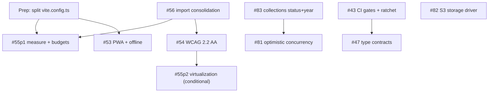

# Parallel execution map for the nine open issues

## Overview

Nine actionable issues are open (`#83`, `#82`, `#81`, `#56`, `#55`, `#54`, `#53`, `#47`, `#43`).
`#57` and `#48` are epics — trackers, not work. This plan decides **which of the nine can be
worked at the same time without collision**, in what order the rest must land, and what small
enabling work has to happen first to make the parallelism real rather than optimistic.

The output is a wave schedule with explicit **file ownership per wave**. The rule the whole plan
rests on: *within a wave, exactly one lane may write any given file.* Where two issues need the
same file, either one waits, or a prep unit splits the file so they no longer share it.

## Problem Frame

Running these issues concurrently is attractive — several are independent in intent — but four of
them converge on the same handful of shared configuration and shared-component files. Discovered
collision points, ranked by how much rework a conflict costs:

| Rank | File | Issues that want it | Why it hurts |
|---|---|---|---|
| 1 | `client/src/shared/components/{DataTable,PageHeader,ConfirmDialog,StatusBadge}.tsx` + canonical targets | #54, #55, #56 | #56 rewrites 45 import lines across ~30 files while #54 edits the same components' internals |
| 2 | `client/eslint.config.mjs` | #54, #55, #56 | All three add to the same `rules` object |
| 3 | `client/vite.config.ts` | #53, #55 | #53 edits `VitePWA`/`workbox`, #55 edits `build.rollupOptions` — adjacent keys of one exported object |
| 4 | `.github/workflows/ci.yml` | #43, #47, #53, #54, #55, #82 | Six issues want to add or tighten a gate in one 300-line file |
| 5 | `server/src/modules/inventory/collections/*` | #83, #81 | Same Zod schema, same `service.update` transaction, same `repository.update` call |
| 6 | `client/src/shared/index.ts` | #55, #56 | **Opposing intents** — #55 wants to break the barrel's pull-through of `xlsx`; #56 wants the barrel to *be* the canonical path |

## Requirements Trace

- R1. Every one of the nine issues is placed in exactly one wave with a named lane.
- R2. No two lanes in the same wave write the same file.
- R3. Sequencing dependencies (not merely file overlaps) are stated with their reason.
- R4. Where a shared file blocks parallelism and can be cheaply split, a prep unit splits it.
- R5. Where two issues have opposing intent on one file, the plan resolves the intent, not just the merge.
- R6. The schedule survives a lane slipping — a delayed lane must not strand another wave.

## Scope Boundaries

- **Not** an implementation plan for any individual issue. Each lane still needs its own plan or
  is executed straight from its issue body. This plan says *when* and *alongside what*.
- Does not re-scope, re-prioritize, or close any issue. Priority labels stay as they are.
- Does not decide staffing or wall-clock estimates. Lanes are units of isolation, not of effort.
- The two epics (#57, #48) are updated only as trackers, never worked directly.

## Context & Research

### Already landed, so several acceptance criteria are met before work starts

- **Client typecheck is gated.** `origin/main` commit `4202598` (PR #89) added the client
  `tsc --noEmit` step and cleared the 35 errors behind it. #43's "TypeScript compilation passes
  with no errors" criterion is satisfied for both halves. *(The local branch
  `zhamdy/sales-insufficient-stock-code` is 2 commits behind `origin/main` and still shows the old
  `ci.yml` — rebase before quoting CI state.)*
- **Real-PostgreSQL CI exists.** `.github/workflows/ci.yml` already provisions `postgres:16`, sets
  `TEST_DATABASE_URL`, and runs `server/scripts/assertRealPostgresSuitesRan.mjs` as an
  anti-silent-skip guard. The e2e suite is sharded with per-shard "ran nothing" guards.
- **The `StorageDriver` abstraction exists.** `server/src/storage/` already defines the full
  interface including the `ownsUrl` / `keyFromUrl` distinction. #82 is a new file plus a
  `createStorageDriver` case, not an architecture change.
- **ESLint boundary enforcement exists.** `client/eslint.config.mjs` runs `eslint-plugin-boundaries`
  with element-type policies and a `no-restricted-imports` block. #56 adds one entry to an existing
  mechanism rather than introducing one.
- **`server/tests/concurrency/collections.concurrency.test.ts` already proves #81** and documents
  the drop as accepted current behaviour. Fixing #81 means rewriting that test's assertions.

### What is genuinely still missing

- `.github/workflows/` contains **only** `ci.yml`. No migration up/down verification job, no
  coverage threshold, no dependency audit, no bundle-size check.
- `npm run lint --prefix server` exits 0 with **391 warnings**, essentially all
  `@typescript-eslint/no-explicit-any`. No `--max-warnings` flag, so warnings gate nothing.
- `collections` has a `status` column that no `UPDATE` has ever written, and **no `year` column at all**.
- `client/public/` holds only `_redirects` and `moon-logo.svg`; the PWA manifest references two
  PNGs that **do not exist**.
- No a11y tooling anywhere (`axe`, `@axe-core/playwright`, `eslint-plugin-jsx-a11y` all absent).
- No virtualization anywhere; `DataTable` paginates at 10 rows, the POS grid is a plain `.map()`.
- `contracts/` holds exactly one file (`checkout-totals.v1.json`). There is no generated OpenAPI —
  `server/scripts/generateOpenApi.ts` is a **regex scraper over the manifest source text**, and
  `server/src/docs/openapi.ts` is 11,865 hand-maintained lines.

### Incidental findings worth a ticket, not a lane

- `xlsx@0.18.5` is a known-CVE version, and it is re-exported through `client/src/shared/index.ts`,
  so anything importing `@/shared` pulls it into its chunk. Belongs to #55's lane as a finding.
- `@tanstack/router-devtools` sits in `dependencies`, not `devDependencies`.
- Locale and text direction are **not linked**: `settingsStore` drives `isRtl` while
  `DirectionProvider` uses a separate `moon-store-direction` key, and nothing sets
  `documentElement.lang`. This is #54's problem and is larger than "audit the markup".
- `docs/CONVENTIONS.md` still carries a **"SQLite Gotchas"** section after the PostgreSQL migration.
- A stray `nul` file sits at the repo root (a Windows redirection artifact).

## Key Technical Decisions

- **#56 lands before #54 and before any #55 virtualization.** #56 is a mechanical rewrite of 45
  import lines across ~30 files — the single worst thing in this backlog to rebase. Everything that
  edits shared components waits for it. *Cost:* #54 and #55's second half are pushed a wave.
  *Alternative rejected:* running #56 last, which converts every other lane's diff into a conflict.

- **The `client/src/shared/index.ts` intent conflict resolves in #56's favour, with #55's
  constraint written into #56's acceptance criteria.** The barrel stays the canonical path, and
  #56 additionally must not re-export anything that statically pulls a heavy dependency —
  `exportUtils` (and therefore `xlsx`) moves behind a lazy accessor. One decision, made once,
  instead of two lanes pulling the file in opposite directions.

- **#83 before #81.** Both rewrite `collectionUpdateSchema`, `service.update` and the same
  `buildPartialUpdate` call; they cannot be concurrent. #83 is smaller, carries the migration, and
  #81's precondition check rebases cleanly on top of it. The reverse order does not hold.

- **#81 takes optimistic concurrency on `updated_at`, not the partial API and not a row lock.**
  `collections.updated_at` already exists and is bumped unconditionally by `buildPartialUpdate`'s
  `alwaysSet`, so no migration is needed. The row lock is rejected for the reason the issue gives:
  the loser still writes a set computed from stale data, so it only *looks* like a fix. The genuine
  partial add/remove/reorder API is the better end state but is a separate, larger issue —
  optimistic concurrency stops the silent loss now and does not block that later.

- **#43 ships a lint ratchet at the current count rather than waiting for #47.** `--max-warnings 391`
  gates regression immediately; #47 lowers the number as it goes. This converts what looked like a
  hard #47 → #43 dependency into two independent lanes, which is what #43's own acceptance criterion
  ("establish a ratchet ... rather than an unsafe big-bang cleanup") already asks for.

- **#55 splits at the measurement boundary.** Phase 1 — measure, baseline, budgets, CI check — has
  zero overlap with #54. Phase 2 — virtualization of `DataTable` and the POS grid — collides with
  #54 head-on and waits for it. The issue itself says to virtualize "only where measurements
  justify it", so the split follows its own logic and may end with phase 2 unnecessary.

- **`ci.yml` gets an owner per wave rather than being split into reusable workflows.** Extraction
  into `workflow_call` files was considered and rejected: six issues touch it but each adds only a
  few lines, and reusable-workflow indirection would make the one file every contributor reads
  harder to read for the life of the repo. Cheaper to name an owner. *Revisit if a wave produces
  more than two `ci.yml` conflicts.*

## Open Questions

### Resolved during planning

- *Does #43 depend on #47?* No — the ratchet decouples them. They share only `ci.yml`, and #43 owns it.
- *Is #43's client-typecheck criterion still open?* No, PR #89 closed it.
- *Which direction does #83 take (real fields vs. remove them from the modal)?* Real fields. `status`
  is already a column and already flows out on reads, the client type already declares
  `year: number | null`, and the i18n catalogue carries `collections.season/year/spring/...`.
  Removing them would delete working data plumbing on three sides.
- *Should #83 also add `.strict()` repo-wide?* No. Scope it to the collections update schema; the
  repo-wide sweep is a separate issue with its own blast radius.

### Deferred to implementation

- Whether `status` and `is_featured` overlap in meaning — the issue flags it, and it is answerable
  only by reading how each is consumed. #83's lane resolves it before adding a second flag.
- Which S3 SDK #82 picks, and whether CI gets a MinIO service or the driver is tested against a
  fake. Determines whether #82 touches `ci.yml` at all.
- Whether #55 phase 2 is needed. Depends entirely on phase 1's measurements.
- Whether #54's locale/direction unification is in scope or spins out — it is a real architectural
  defect discovered during research, not something the issue anticipated.

## Wave schedule

| Wave | Lane | Issue | Owns exclusively | Must not touch |
|---|---|---|---|---|
| 0 | prep | — | `client/vite.config.ts`, `client/config/*` | everything else |
| 1 | A | #83 | `server/src/modules/inventory/collections/*`, migration `008_*`, `client/src/features/inventory/pages/Collections.tsx` | `ci.yml` |
| 1 | B | #82 | `server/src/storage/*`, `render.yaml`, `server/src/config/env.ts` | `ci.yml`, `openapi.ts` |
| 1 | C | #43 | `.github/workflows/*`, `server/tests/support/*`, `server/package.json` scripts | `server/src/**` |
| 1 | D | #56 | the 4 compat shims + canonical dirs, `client/src/shared/index.ts`, `client/eslint.config.mjs` | `client/vite.config.ts`, `ci.yml` |
| 1 | E | #53 | `client/config/pwa.ts`, `client/public/*`, `client/src/shared/hooks/useOffline.ts`, `client/src/shared/lib/queryClient.ts` | `client/config/build.ts`, `client/eslint.config.mjs` |
| 2 | A | #81 | collections module, `server/tests/concurrency/collections.concurrency.test.ts`, `server/src/http/errors.ts` | `ci.yml` |
| 2 | B | #47 | `server/src/modules/*/repository.ts`, module `types.ts`, `server/src/docs/openapi.ts` | `ci.yml`, collections module |
| 2 | D | #55p1 | `client/config/build.ts`, a new bundle-budget workflow, `client/package.json` | shared components |
| 3 | A | #54 | shared components, `client/eslint.config.mjs`, i18n/direction | `client/config/*` |
| 3 | D | #55p2 | `DataTable.tsx`, the POS grid in `POS.tsx` | — (runs only after #54 merges) |

**Wave 1 lanes A and D both touch `client/src/features/inventory/Collections.tsx`** — #56 rewrites
its import lines while #83 edits its submit payload. This is the one accepted overlap in the
schedule: both diffs are small and in different regions of the file. Lane D merges first and lane A
rebases; if this proves noisy, move #83 to wave 2 alongside #81 and lose nothing.

## Implementation Units

- [ ] **Unit 1: Split `client/vite.config.ts` so #53 and #55 stop sharing a file**

**Goal:** `client/vite.config.ts` becomes a thin composition that imports its PWA block and its
build/chunking block from two separate files, so wave 1 lane E and wave 2 lane D never write the
same file.

**Requirements:** R2, R4

**Dependencies:** None. This is the only thing that must land before wave 1 opens.

**Files:**
- Create: `client/config/pwa.ts` (the `VitePWA({...})` options object, including `manifest` and `workbox`)
- Create: `client/config/build.ts` (the `build.rollupOptions` object, including `manualChunks`)
- Modify: `client/vite.config.ts`

**Approach:**
- Pure move. The exported Vite config must be equivalent in effect — no chunk regrouping, no
  workbox rule changes, no manifest edits. Those are #55's and #53's work, not this unit's.
- Export plain objects or factories, not a plugin wrapper, so each lane edits data rather than
  indirection.

**Patterns to follow:** `client/eslint.config.mjs` already composes from multiple config objects;
match that shape rather than inventing a new one.

**Test scenarios:**
- Happy path: `npm run build --prefix client` emits the same chunk names and count as before the
  split — capture the pre-split output first and diff the two lists.
- Happy path: the generated service-worker precache manifest lists the same entries pre- and post-split.
- Edge case: `npm run dev --prefix client` starts and the PWA plugin registers in dev mode as before.

**Verification:** The build-output diff is empty apart from content hashes, and the e2e `@smoke`
suite still passes against the production build.

- [ ] **Unit 2: Open wave 1 — five isolated lanes**

**Goal:** #83, #82, #43, #56 and #53 proceed concurrently, each on a branch from `main`, each
respecting its ownership row in the wave table.

**Requirements:** R1, R2, R6

**Dependencies:** Unit 1, for lane E only — the other four lanes can start immediately.

**Files:** Per the wave-1 rows of the ownership table. No lane may write a file owned by another.

**Approach:**
- Lane C (#43) is the sole writer of `.github/workflows/`. Any other lane that wants a CI gate opens
  a follow-up against lane C's branch rather than editing `ci.yml` itself.
- Lane D (#56) carries the extra acceptance criterion from the intent-conflict decision: after
  consolidation, importing `@/shared` must not statically pull `xlsx`. Prove it from the build
  output, not by reading the code.
- Lane C's ratchet lands as `--max-warnings 391` on the server lint step, with the number in a
  comment naming #47 as the thing that lowers it.
- Lane A (#83) resolves the `status` vs `is_featured` semantic question before writing the
  migration, and adds `.strict()` to the collections update schema only.
- #43's remaining real gap is **migration up/down verification** — no job runs `migrate` or
  `migrate:down` standalone today; migrations run only implicitly inside `realPostgres.ts`.

**Execution note:** Lanes A and B are both behaviour changes with a data-loss or data-destruction
failure mode (#83 writes new columns; #82's `ownsUrl` bug class deletes images). Both benefit from a
failing test written first — for #82 specifically, a test that a legacy relative URL under an
absolute `MEDIA_PUBLIC_BASE_URL` is classified "mine but unresolvable" and **aborts the sweep**,
not "not mine".

**Patterns to follow:**
- #82: `server/src/storage/localDriver.ts`'s private `ownedPrefixes()` is the reference for getting
  the ownership distinction right.
- #43: `server/scripts/assertRealPostgresSuitesRan.mjs` and `e2e/scripts/assertSmokeTestsRan.mjs`
  are the established "this gate did not silently skip" pattern — a migration-verification job
  should carry the same guard.

**Test scenarios:** Each lane carries its own issue's scenarios. This unit's own scenarios are the
integration checks:
- Integration: each lane's branch, rebased onto the previous lane's merge, produces zero conflicts
  outside the one accepted `Collections.tsx` overlap.
- Integration: after all five merge, the full CI suite (all six jobs) is green on `main`.
- Error path: if lane C's ratchet number is stale when it merges — another lane changed the warning
  count — CI fails loudly on the lint gate rather than passing with a wrong ceiling.

**Verification:** Five PRs merged, `main` green, and the wave-2 lanes rebase cleanly.

- [ ] **Unit 3: Wave 2 — #81, #47, #55 phase 1**

**Goal:** The three lanes that were blocked on a wave-1 predecessor proceed concurrently.

**Requirements:** R1, R2, R3

**Dependencies:** #81 needs #83 merged (same files). #47 needs #43's ratchet in place, so its
progress is measured. #55p1 needs Unit 1 and #56 merged.

**Files:** Per the wave-2 rows of the ownership table.

**Approach:**
- #81 implements optimistic concurrency on `collections.updated_at` — the client round-trips the
  value it read, the server refuses a mismatch with a typed `409`. Follow the shape of the
  `INSUFFICIENT_STOCK` code that landed in PR #90: a typed code carrying the numbers behind it, not
  a message string.
- #81 must rewrite the `'survives a reorder racing an append'` case in
  `server/tests/concurrency/collections.concurrency.test.ts`, which currently *documents* the drop
  as accepted. Its comment becomes wrong the moment the fix lands.
- #47 works repositories first — `pos/sales/repository.ts` (31 `any` lines),
  `inventory/products/repository.ts` (28), `fulfillment/delivery/repository.ts` (17) — and lowers
  the ratchet in `ci.yml` via a one-line PR to lane C's file, per wave 1's ownership rule.
- #47 should record explicitly whether the regex-scraper `generateOpenApi.ts` is being replaced or
  kept. "Generate or verify OpenAPI from those contracts" is not currently possible against an
  11,865-line hand-maintained spec, and that gap is the largest unstated cost in the issue.

**Execution note:** #81 is a concurrency fix and belongs in the `describeWithPostgres` suites —
pg-mem cannot prove it. Write the failing interleaving first; the harness for it already exists.

**Test scenarios:**
- Happy path (#81): an update carrying the current `updated_at` succeeds and bumps it.
- Error path (#81): an update carrying a stale `updated_at` returns `409` with a typed code, and the
  collection's product set is unchanged.
- Integration (#81): the three-interleaving concurrency test now asserts *membership* — the appended
  product survives, or the reorder is refused, and it is never silently dropped.
- Happy path (#47): a known unique-constraint violation surfaces as a stable public error code with
  no error-message string parsing anywhere on the path.
- Happy path (#55p1): a documented, reproducible bundle baseline exists and the CI check fails on a
  deliberate size regression.
- Edge case (#55p1): the POS route's initial chunk contains none of `recharts`, `xlsx`, or
  `@ericblade/quagga2`.

**Verification:** Wave-2 PRs merged, the ratchet number strictly lower than 391, and the bundle
baseline committed and enforced.

- [ ] **Unit 4: Wave 3 — #54, then #55 phase 2**

**Goal:** The accessibility audit lands against stable canonical component paths, and virtualization
— if measurements justified it — follows it rather than racing it.

**Requirements:** R1, R2, R3, R5

**Dependencies:** #54 needs #56 merged. #55p2 needs #54 merged **and** a phase-1 measurement that
justifies it; if the measurements do not, this half does not happen.

**Files:** Per the wave-3 rows of the ownership table.

**Approach:**
- #54's first decision is whether the locale/direction split (`settingsStore.isRtl` versus
  `DirectionProvider`'s separate `moon-store-direction` key, with nothing setting
  `documentElement.lang`) is in scope. It is a real defect the issue did not anticipate and it
  underlies the RTL acceptance criterion, so it probably is — but it should be an explicit call.
- The eight chart files under `client/src/features/analytics/components/charts/` hard-code
  `dir="ltr"`. #54 must decide whether that is correct by intent (numeric axes) or a workaround.
- #55p2, if it happens, must not regress the row and grid semantics #54 just established.
  Virtualization and naive `role`/row-count a11y are directly at odds; #54's assertions are the
  regression net.

**Test scenarios:**
- Happy path (#54): POS checkout, inventory edit, and the login flow are each completable
  keyboard-only, with visible focus at every step.
- Edge case (#54): a dialog traps focus and restores it to the trigger on close, in both LTR and RTL.
- Integration (#54): an async mutation result, the offline banner state change, and a validation
  error are each announced to a screen reader.
- Error path (#54): CI fails on a deliberately introduced high-impact axe violation.
- Integration (#55p2, if it runs): the #54 keyboard and announcement assertions still pass against
  the virtualized `DataTable` and POS grid.

**Verification:** `main` green with the a11y gate active; if #55p2 ran, the a11y suite is green
against the virtualized components.

## System-Wide Impact

- **Interaction graph:** `ci.yml` is the single point every lane eventually touches; the ownership
  rule is what keeps it from becoming the bottleneck. `client/eslint.config.mjs` is second, owned by
  #56 in wave 1 and #54 in wave 3 — never both at once.
- **Error propagation:** #81 and #47 both introduce typed error codes. They should agree on the
  shape before either ships, or the API grows two conventions in one wave. #47's lane owns the
  convention; #81's lane consumes it.
- **State lifecycle risks:** #83 adds a migration (`008_*`) while #82 changes where bytes live. If
  both are in flight and a rollback is needed, the migration is reversible and the storage config is
  a config flip — neither depends on the other, which is why they are the safest wave-1 pairing.
- **API surface parity:** `server/src/docs/openapi.ts` is hand-maintained across 11,865 lines and is
  touched by #83, #81 and #47. It is the one server file where merge conflicts are likely despite
  the ownership rule, because all three append to different endpoint sections of one document.
- **Unchanged invariants:** No lane changes the checkout total calculation, the idempotency window,
  the refresh-token rotation contract, or the rate-limit bucketing. Those landed recently and are
  explicitly out of every lane's scope.

## Risks & Dependencies

| Risk | Likelihood | Impact | Mitigation |
|---|---|---|---|
| #56's 45-line import rewrite lands mid-wave and conflicts with lane A's `Collections.tsx` edit | Med | Low | Accepted overlap; lane D merges first, lane A rebases. Escalation is moving #83 to wave 2. |
| `ci.yml` conflicts despite the ownership rule | Med | Low | One owner per wave; other lanes PR into the owner's branch. Revisit reusable workflows if it happens twice. |
| `server/src/docs/openapi.ts` conflicts between #83, #81 and #47 | High | Low | Three-way append conflicts in one 11k-line file are noisy but mechanical. #47's lane should say early whether it is replacing the file wholesale — if so, the other two append minimally and let #47 absorb it. |
| #47's OpenAPI criterion is unachievable against a hand-maintained spec | High | Med | Surface it in wave 2 as an explicit scope call rather than discovering it at review. |
| #55 phase 1 measurements justify nothing, and phase 2 is built anyway | Low | Med | Phase 2 is conditional by construction; the plan permits it to be dropped. |
| #82 reintroduces the `ownsUrl` data-destruction bug in a new driver | Low | **High** | Test-first on the "mine but unresolvable → abort" case, per the execution note. Verify a key-preserving copy end to end before pointing production at a bucket. |
| A lane slips and strands its dependents | Med | Low | Only #81, #54 and #55p2 have hard predecessors. The other six proceed regardless. |

## Documentation / Operational Notes

- `docs/CONVENTIONS.md` still has a **"SQLite Gotchas"** section (`ALTER TABLE` limitations, the
  SQLite transaction pattern) after the PostgreSQL migration. Any lane touching that file should
  remove it; #47's lane is the natural owner.
- The user-level `CLAUDE.md` at the home directory describes the pre-migration SQLite/Radix
  architecture entirely and contradicts the repo's own `CLAUDE.md`. Worth correcting outside any
  lane — it is actively misleading to every session.
- A stray `nul` file sits at the repo root and should be removed.
- The two epics (#57, #48) should have their checkbox lists updated as lanes close, and #57's
  remaining P2/P3 items reordered to match this schedule.

## Sources & References

- Issues: #83, #82, #81, #57, #56, #55, #54, #53, #48, #47, #43
- Recently merged, which changes several stated preconditions: PR #89 (`4202598`, the client
  typecheck gate), PR #90 (`b383bc2`, typed `INSUFFICIENT_STOCK`), PR #87 (the partial-update contract)
- Existing plans in `docs/plans/` covering the already-landed backend hardening
- `docs/CONVENTIONS.md`, `AGENTS.md`, `CLAUDE.md`
