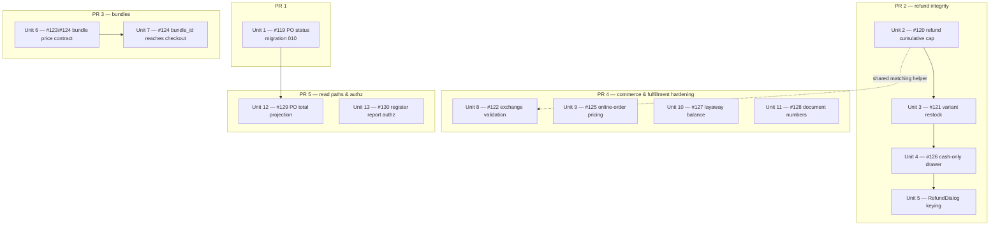

# fix: the open bug backlog (#119–#130), with #119 shipped alone

## Overview

Twelve open bug issues (#119–#130) describe defects across purchasing, refunds, bundles,
exchanges, online orders, layaway, document numbering and register reporting. Most are
financial-integrity or inventory-integrity defects; three are user-visible feature
breakage; one is a horizontal privilege escalation.

This plan covers all twelve. **#119 ships alone, first, in its own PR** — it is the only
one that changes a CHECK constraint and therefore the only one that runs a migration and
touches the migration-verification gate. The remaining eleven follow in four themed PRs,
grouped so that issues rewriting the same function land together and unrelated modules do
not share a diff.

## Problem Frame

Three defect families, all reachable through the normal UI by a Cashier:

1. **Money and stock can be created out of nothing.** A sale line can be refunded
   repeatedly at a client-chosen price (#120); an exchange accepts returned items that
   were never sold (#122); a public unauthenticated endpoint prices its own order (#125);
   a variant refund credits the wrong stock row (#121); concurrent layaway installments
   lose updates (#127).
2. **Two columns for one value.** `purchase_orders.total` / `.total_amount` (#129) and
   `product_bundles.price` / `.bundle_price` (#123, #124) are each written by one path and
   read by the other, so the read side returns a column nothing writes.
3. **Unmapped SQLSTATEs surfacing as 500.** A status value the CHECK rejects (#119), a
   random document number colliding on a UNIQUE index (#128), and an over-order tripping a
   non-negative CHECK (#125) all reach the client as `INTERNAL_ERROR`.

Plus one authorization gap: any Cashier can read any register session's X/Z report (#130).

## Requirements Trace

| ID | Requirement | Issue |
| --- | --- | --- |
| R1 | A purchase order moves Draft → Sent → Partially Received → Received, and a partial receive commits the stock it booked in. | #119 |
| R2 | A sale line's cumulative refunded quantity never exceeds the quantity sold, and the refund value comes from the persisted sale line, not the request. | #120 |
| R3 | A refunded variant line returns stock to `product_variants`; a refunded plain line returns it to `products`. | #121 |
| R4 | Exchange returned lines resolve to lines of the named sale, are capped by what was sold, and are valued from `sale_items.unit_price`. | #122 |
| R5 | A bundle can be created and edited from the Bundles page. | #123 |
| R6 | The bundles list returns the price that was written, and a bundle sells at its bundle price. | #124 |
| R7 | The public online-order endpoint prices from the catalog and refuses an over-order with a typed error rather than a 500. | #125 |
| R8 | A refund debits the drawer only to the extent the original sale brought cash in. | #126 |
| R9 | Concurrent layaway installments both land; the balance moves by a guarded relative write. | #127 |
| R10 | Document-number generation survives a collision without surfacing a 500. | #128 |
| R11 | The purchase-orders list shows each order's value. | #129 |
| R12 | A Cashier can read reports for their own register sessions only; another cashier's requires Admin. | #130 |

## Scope Boundaries

- **Not** implementing real stock reservations for online orders. #125's published contract
  promises reservation; this plan corrects the pricing, the unguarded write and the cancel
  transition, and files a follow-up for the reservation lifecycle. The contract text is
  corrected to describe what the code does.
- **Not** implementing store credit. #122 notes that `payment_method: 'store_credit'` is
  documented but no code writes any balance. That is a missing feature, not a bug fix;
  a follow-up issue records it.
- **Not** dropping the duplicated `purchase_orders.total_amount` and
  `product_bundles.price` columns. The read paths are corrected to select the written
  column; retiring the dead columns is a schema change with a lossy down-migration and
  belongs in its own migration PR (follow-up).
- **Not** adding a full purchase-order status state machine. #119 makes the five statuses
  writable; rejecting `Received → Draft` is a separate hardening task.
- **Not** raising either ratchet. `--max-warnings` stays at 385 and `EXPECTED_UNCONVERTED`
  stays at 3 / `EXPECTED_UNCLASSIFIED` at 0.

## Context & Research

### Relevant Code and Patterns

- **CHECK-constraint alteration**: `server/src/database/migrations/009_legacy_schema_alignment.sql:484-489`
  — `DROP CONSTRAINT IF EXISTS` then `ADD CONSTRAINT ... NOT VALID`. Migration files are
  numbered pairs (`NNN_name.sql` / `NNN_name.down.sql`), run one-per-transaction by
  `server/src/database/migrate.ts`, and verified one-at-a-time by
  `server/scripts/verifyMigrations.ts` (`npm run verify:migrations`). A down migration that
  genuinely cannot reverse carries the `Intentionally a no-op.` marker with `SELECT 1;`
  (`009_legacy_schema_alignment.down.sql`).
- **SQLSTATE mapping**: `server/src/database/constraintErrors.ts` exports
  `isUniqueViolation` (23505), `isCheckViolation` (23514) and `constraintName`. Modules
  catch these and rethrow `PublicError('CONFLICT', ...)` either in the controller
  (`server/src/modules/commerce/giftCards/controller.ts:22,58`) or the service
  (`server/src/modules/commerce/coupons/service.ts:13,42,73`). Unmapped errors fall through
  `mapPublicError` in `server/src/http/errors.ts` to `INTERNAL_ERROR` / 500.
- **Guarded relative write**: `server/src/modules/pos/sales/repository.ts:514-526` —
  `UPDATE products SET stock = stock - $1::int WHERE id = $2 AND stock >= $1::int RETURNING stock`,
  with a `null` return read as a refusal and a follow-up `getProductStock` to distinguish
  "no such row" from "insufficient". `decrementVariantStock` (`:552-564`) is the same shape
  on `product_variants`; `incrementProductStock` (`:537-549`) is deliberately unguarded.
- **Row lock**: `salesRepository.findByIdForUpdate` already locks the sale row for the whole
  refund transaction, precisely so a cumulative check can span sibling refund rows.
- **Idempotency**: `server/src/http/idempotency.ts` — `withIdempotency({ key, endpoint, userId, payload, run })`
  inserts the claim as the first statement of the business transaction. Call-site pattern:
  `server/src/modules/pos/sales/controller.ts:74-119`, including the
  `IDEMPOTENCY_REPLAY_HEADER` branch that suppresses audit/notification side effects on a
  replay.
- **Request contracts**: each module's `schemas.ts` declares Zod schemas and wires them with
  `defineRequestContract`; controllers parse through the contract
  (`contracts.createGiftCard.parseBody(...)`), never `schema.parse` directly. The
  `API documentation drift` CI step walks `server/src/router.ts` and fails if a served route
  is not covered by exactly one contract.
- **Tests**: server tests are flat `server/tests/*.test.ts` plus `concurrency/`, `database/`,
  `http/`. Real-PostgreSQL suites use `describeWithPostgres` / `setupRealPostgres` from
  `server/tests/support/realPostgres.ts` (example: `server/tests/concurrency/refunds.concurrency.test.ts`).
  pg-mem service tests build the repository and service directly with constructor injection
  (`server/tests/coupons.partial.test.ts`). Client tests are colocated
  (`client/src/features/inventory/pages/Bundles.test.tsx`) and use vitest +
  @testing-library with i18n catalogs for locator text.
- **Client surfaces**: `client/src/features/purchasing/pages/PurchaseOrders.tsx` (status
  chips, Send/Receive gating, `accessorKey: 'total'`),
  `client/src/features/inventory/pages/Bundles.tsx` (local `useState` form sending
  `price`/`status`), `client/src/features/sales/components/RefundDialog.tsx` (selection map
  keyed by `product_id` alone), `client/src/features/pos/store/cartStore.ts` (`addBundle`
  proportional re-pricing off `bundle.price`).

### Corrected Premise

Issue #128 cites `GiftCardsService.create` as the precedent that "does re-roll on
collision". It does not catch a unique violation — `server/src/modules/commerce/giftCards/service.ts:66-75`
runs a **check-then-insert loop** (`findByCode`, re-generate, up to 10 attempts), which is
itself TOCTOU-racy under concurrency. The pattern this plan adopts for #128 is the stronger
one: insert, catch `isUniqueViolation` with `constraintName`, re-roll, bounded retry. A
follow-up issue records the gift-card loop.

### Repo Conventions That Bind This Work

- Storage keys in `client/src/shared/lib/storageKeys.ts` are frozen values; none of this
  work touches them.
- E2E locators come from the i18n catalog (`e2e/support/i18n.ts`); a new `data-testid` in
  production code needs a one-line justification comment.
- Never deep-import another client slice; cross-slice exports go through the slice's
  `index.ts`.

## Key Technical Decisions

| Decision | Rationale |
| --- | --- |
| **#119: the application vocabulary wins.** Migration 010 backfills legacy status values and narrows `purchase_orders_status_check` to exactly `Draft, Sent, Partially Received, Received, Cancelled`. | Server enum, TS types, client chips, filters and i18n keys already speak this vocabulary in five places; the DB list is the outlier and carries three lowercase legacy spellings for states it already names in TitleCase. Narrowing rather than widening removes the eight-spellings-for-five-states ambiguity permanently. |
| **#119's down migration reverses rather than no-ops.** It maps `Sent → Ordered`, `Partially Received → Partial` and restores the 009 constraint list. | The mapping is total and information-preserving in both directions, so the `Migrations (up, down, re-apply)` gate can prove it. The `Intentionally a no-op.` marker is reserved for genuinely lossy reversals. |
| **#120/#121: refund lines are matched on `(product_id, variant_id)`, and prior refunded quantities are aggregated from the JSON in `refunds.items` under the existing `FOR UPDATE` lock.** | `refunds.items` is a `TEXT` blob (`001_initial_schema.sql:207-216`); there is no `refund_items` table. The sale row is already locked for the whole transaction, so aggregating in JS is correct here — the lock, not the storage shape, is what makes the cumulative check sound. Normalizing `refund_items` is a follow-up. |
| **The client's `unit_price` on a refund line stays in the contract but is ignored.** | This is exactly what checkout already does for `saleItemSchema` (`pos/sales/service.ts:270-296` re-prices every plain line and discards the client's price). Removing the field would be a breaking request-contract change for an offline queue that may already hold serialized refunds. The `beyondSchema` note records that it is accepted and ignored. |
| **#123/#124: `price` becomes the single wire name; the column stays `bundle_price`.** | The client, `client/src/features/inventory/types.ts`, `usePosData.ts` and `cartStore.addBundle` all say `price`; only the server schema and one column say `bundle_price`. The repository maps wire `price` → column `bundle_price` on write and selects `b.bundle_price AS price` on read, so one rename in `schemas.ts` fixes both halves and the dead `price` column stops being read by anything. |
| **#125: pricing and the guarded write now; reservations later.** | Catalog pricing and a guarded decrement remove the financial and 500-response defects immediately. A reservation lifecycle (write on create, release on expiry, deduct on confirm) is a feature with its own state machine and expiry job — it would dominate this batch. The published contract text is corrected to match the code, and a follow-up issue carries the reservation work. |
| **#128: bounded retry catching 23505, not a wider random suffix.** | Widening the suffix lowers the collision probability without removing the failure mode; a birthday problem does not have a safe constant. Catching the violation and re-rolling makes the failure unobservable regardless of daily volume. |
| **#130: scope by `req.user.id` with an Admin bypass in the controller.** | Every sibling handler in the same controller already resolves its session from `authReq.user!.id` (`register/controller.ts:22-95`); this is the one that does not. The fix restores the module's own pattern rather than introducing an authorization abstraction. |

## Open Questions

### Resolved During Planning

- *Which purchase-order status vocabulary is authoritative?* → The application's. Migration
  010 narrows the constraint (see Key Technical Decisions).
- *How far does #125 go?* → Catalog pricing + guarded decrement + cancel-transition check;
  reservations become a follow-up and the contract text is corrected.
- *How is the work delivered?* → #119 alone in PR 1; four themed PRs after it.
- *Does a `refund_items` table exist to aggregate prior refunds from?* → No.
  `refunds.items` is a JSON `TEXT` column; aggregation happens in JS under the existing
  `FOR UPDATE` lock.
- *Does `product_bundles` already have a `status` column?* → Yes,
  `001_initial_schema.sql:681`, `CHECK (status IN ('active','inactive'))`. The server schema
  simply does not accept it yet.

### Deferred to Implementation

- Whether the `'Ordered'` fixture at `server/tests/database/migration009.test.ts:123` should
  become `'Sent'` outright, or whether the `database(false)` branch should assert the 010
  backfill explicitly. The 009-only branch does not need to change either way.
- The exact aggregation key for historical `refunds.items` rows written before `variant_id`
  existed on the wire. Expect to treat a missing `variant_id` as `null` and match plain
  lines; confirm against real seeded data during implementation.
- Whether `resolveBundleGroup` (`pos/sales/service.ts:227-252`) needs changes once
  `bundle_id` actually reaches it, or whether it works as written. It has never executed.
- Whether the `savings` / `savings_percent` fields the client declares non-optional are best
  computed in the list SQL or derived client-side from the items.

## Implementation Units

### Dependency graph



---

### Phase 1 — #119, on its own branch and PR

- [x] **Unit 1: Narrow `purchase_orders_status_check` to the application vocabulary (#119)**

**Goal:** A purchase order can be Sent, partially received and received; a partial receive
commits the stock it booked in.

**Requirements:** R1

**Dependencies:** None.

**Files:**
- Create: `server/src/database/migrations/010_purchase_order_status_vocabulary.sql`
- Create: `server/src/database/migrations/010_purchase_order_status_vocabulary.down.sql`
- Modify: `server/src/modules/fulfillment/purchaseOrders/controller.ts` (map 23514 on a
  status write to a typed error instead of letting it reach `INTERNAL_ERROR`)
- Modify: `server/tests/database/migration009.test.ts` — its fixture inserts status `'Ordered'`
  at `:123`. The `database(true)` branch stops at 009 and stays green; the `database(false)`
  branch runs **all** migrations up including 010 and will then hit 23514 on that literal.
  That call site needs the canonical spelling.
- Create: `server/tests/purchaseOrders.status.test.ts`
- Create: `server/tests/database/migration010.test.ts`

**Approach:**
- The up migration backfills first, then narrows: `UPDATE purchase_orders SET status = CASE
  status WHEN 'Ordered' THEN 'Sent' WHEN 'Partial' THEN 'Partially Received' WHEN 'pending'
  THEN 'Draft' WHEN 'received' THEN 'Received' WHEN 'cancelled' THEN 'Cancelled' ELSE status
  END;` then `DROP CONSTRAINT IF EXISTS` / `ADD CONSTRAINT` with the five-value list.
- Add the constraint **validated** (no `NOT VALID`), because the backfill in the same
  transaction guarantees every row conforms. 009 used `NOT VALID` to avoid validating rows
  it had not repaired; that reason does not apply here.
- The down migration maps back (`Sent → Ordered`, `Partially Received → Partial`) and
  restores the 009 constraint list verbatim, so `npm run verify:migrations` can prove the
  reversal.
- No change to `schemas.ts`, `types.ts`, the service's `'Partially Received'` computation,
  or any client file — they are already the target vocabulary. The unit's client-side
  verification is that `PurchaseOrders.tsx` needs no edit and its existing test still passes.
- The controller guard is defence in depth: if a status value ever diverges again, the
  caller should see a typed 409/400, not a 500.

**Technical design** — directional only:

```
010.sql        backfill legacy spellings  ->  narrow CHECK to 5 values (validated)
010.down.sql   widen CHECK to the 009 list ->  map Sent/Partially Received back
```

**Patterns to follow:**
- `server/src/database/migrations/009_legacy_schema_alignment.sql:484-489` for the
  drop/add-constraint shape.
- `server/src/modules/commerce/coupons/service.ts:13` for catching a constraint error and
  rethrowing a typed one.

**Test scenarios:**
- *Happy path*: `PUT /api/v1/purchase-orders/:id/status` with `{"status":"Sent"}` on a Draft
  PO → 200, and a re-read returns `Sent`.
- *Happy path*: receive fewer units than ordered on a Sent PO → the transaction commits,
  `products.stock` reflects the received units, `purchase_order_items.received_quantity` is
  incremented, and the PO status is `Partially Received`.
- *Happy path*: receive the remainder → status becomes `Received`.
- *Edge case*: a PO whose stored status is legacy `'Ordered'` before the migration reads as
  `'Sent'` after it (migration010 test, seeded pre-migration).
- *Edge case*: the down migration returns a `Sent` PO to `'Ordered'` and re-applying 010
  returns it to `'Sent'` (covered by `verify:migrations`; assert explicitly in
  `migration010.test.ts`).
- *Error path*: a status value outside the five (write it directly through the repository,
  bypassing Zod) raises 23514 and the controller maps it to a typed `CONFLICT`, not a 500.
- *Integration*: the partial-receive path writes the stock adjustment rows and does **not**
  roll them back — assert `stock_adjustments` has the row after the call returns.

**Verification:**
- `npm run verify:migrations` passes with 010 in place.
- A PO can be created, sent, partially received and received end to end against a real
  PostgreSQL, with stock moving on each receive.
- `server/tests/database/migration009.test.ts` is green again.
- Neither ratchet moved.

---

### Phase 2 — PR 2: refund integrity (#120, #121, #126)

These three rewrite the same block (`SalesService.executeRefund`,
`server/src/modules/pos/sales/service.ts:905-984`) and cannot be landed independently
without conflicting. Unit 5 is the client half.

- [x] **Unit 2: Cap cumulative refunded quantity and derive the refund value from the sale (#120)**

**Goal:** A line cannot be refunded for more than it was sold, across all prior refunds, and
the payout is the persisted price.

**Requirements:** R2

**Dependencies:** None (first in PR 2).

**Execution note:** Write the failing test first — the cumulative rule is already documented
in `server/src/modules/pos/sales/schemas.ts:46-52`, so the test states an existing contract
before the code satisfies it.

**Files:**
- Modify: `server/src/modules/pos/sales/service.ts` (`executeRefund`)
- Modify: `server/src/modules/pos/sales/schemas.ts` (`beyondSchema` note: `unit_price` is
  accepted and ignored)
- Test: `server/tests/sales.test.ts` (extend) and
  `server/tests/concurrency/refunds.concurrency.test.ts` (extend)

**Approach:**
- Inside the existing `FOR UPDATE` transaction, after `findItemsBySaleId`, call
  `repo.findRefundsBySaleId(saleId, client)` and parse each row's `items` JSON into a
  `Map<lineKey, refundedQty>`.
- For each requested line: resolve the sale line, compute
  `remaining = sold - alreadyRefunded`, and reject when `requested > remaining` with a
  message naming the remaining quantity.
- Compute `refundAmount` from `saleItem.unit_price × quantity`, never from the request.
- Keep the existing `previouslyRefunded + refundAmount > sale.total` guard as a second belt;
  it is now redundant but harmless and cheap.

**Patterns to follow:**
- The existing lock comment above `findByIdForUpdate` in `executeRefund` — extend it to say
  the per-line aggregation depends on the same lock.
- `pos/sales/service.ts:270-296` for "the server prices the line, the client's price is
  discarded".

**Test scenarios:**
- *Happy path*: refund 1 of 2 sold → succeeds, refund amount equals `sale_items.unit_price`,
  status `partial`.
- *Happy path*: refund the remaining 1 → succeeds, status `full`.
- *Error path* (the issue's repro): refund 1 of 1 sold, then repeat the same call with
  `unit_price: 14` → the second call is rejected with `VALIDATION_ERROR`, stock is
  incremented exactly once, and exactly one `refunds` row exists.
- *Error path*: refund with a `unit_price` far above the sold price → the recorded refund
  amount is the sold price, not the requested one.
- *Edge case*: a sale with exclusive tax and a tip, refunded fully line-by-line → the
  cumulative total is the sum of the line prices and the sale is `full`, not left with
  headroom.
- *Error path*: a `product_id` not in the sale → `VALIDATION_ERROR` naming the product.
- *Integration (real PostgreSQL)*: two concurrent full refunds of the same single-unit line
  → exactly one commits, the other is rejected; `products.stock` moves by one.

**Verification:**
- The documented cumulative rule in `schemas.ts:46-52` is now true of the code.
- No refund can restock more than was sold, under concurrency.

---

- [x] **Unit 3: Restock variant lines to `product_variants` (#121)**

**Goal:** A refunded variant line returns to the variant's stock row, and two variants of one
product are distinguishable on the wire.

**Requirements:** R3

**Dependencies:** Unit 2 (shares the line-matching code introduced there).

**Files:**
- Modify: `server/validators/saleSchema.ts` (`refundItemSchema` gains optional nullable
  `variant_id`)
- Modify: `server/src/modules/pos/sales/service.ts` (`executeRefund` restock branch and line
  matching)
- Modify: `server/src/modules/pos/sales/repository.ts` (add `incrementVariantStock`)
- Modify: `server/src/modules/pos/sales/schemas.ts` (contract note for the new field)
- Test: `server/tests/sales.test.ts` (extend)

**Approach:**
- Match refund lines on the composite key `(product_id, variant_id ?? null)`, replacing the
  `product_id`-only `find` at `service.ts:906`. Unit 2's aggregation map uses the same key.
- Branch the restock exactly as checkout branches the deduction
  (`service.ts:751-758`): `variant_id ? incrementVariantStock(variant_id) : incrementProductStock(product_id)`.
- `incrementVariantStock` mirrors `incrementProductStock` — unguarded, since adding stock has
  no insufficiency to guard against.
- Adding `variant_id` to the request schema is a request-contract change: the module's
  contract list picks it up automatically, but the `API documentation drift` step must be
  re-run and neither ratchet may move.

**Patterns to follow:**
- `server/src/modules/pos/sales/repository.ts:537-564` for the increment/decrement pair
  shape and their doc comments.

**Test scenarios:**
- *Happy path* (the issue's repro): `products.stock = 10`, `product_variants.stock = 4`, sell
  2 of the variant, refund with `restock: true` → `products.stock` stays 10,
  `product_variants.stock` returns to 4.
- *Happy path*: a plain (non-variant) line still restocks `products.stock`.
- *Edge case*: a sale containing two different variants of the same product, each refunded
  separately → each credits its own variant row, and the cumulative cap from Unit 2 applies
  per variant, not per product.
- *Edge case*: `restock: false` → no stock write on either table.
- *Error path*: a `variant_id` that does not belong to a line of this sale →
  `VALIDATION_ERROR`.

**Verification:**
- Variant stock is conserved across a sell/refund round trip.
- Two variant lines of one product no longer collapse onto one sale line.

---

- [x] **Unit 4: Debit the drawer only for the cash component of a refund (#126)**

**Goal:** `expected_cash` and the Z report move only by cash that actually left the till.

**Requirements:** R8

**Dependencies:** Unit 2 (the refund amount it computes is the input to this calculation).

**Files:**
- Modify: `server/src/modules/pos/sales/service.ts` (`executeRefund`, the
  `recordRefundMovement` call at `:977` — the issue cites `:949`, which is the
  `updateSaleRefundStatus` call, not this one)
- Test: `server/tests/register.test.ts` (extend) and `server/tests/sales.test.ts` (extend)

**Approach:**
- Read the original tender split with `repo.findPaymentsBySaleId(saleId, client)`.
- Derive `cashTaken` the way checkout derives `cashComponentMinor` (`service.ts:845-864`):
  the `Cash` entries of the split, or the whole amount when `sale.payment_method === 'Cash'`
  and no split rows exist.
- Compute `cashAlreadyRefunded` from the prior refunds already loaded in Unit 2, and
  `refundCash = min(refundAmount, cashTaken - cashAlreadyRefunded)`.
- Call `recordRefundMovement` only when `refundCash > 0`, mirroring checkout's "only when it
  is positive" guard.

**Patterns to follow:**
- `server/src/modules/pos/sales/service.ts:845-864` — the checkout cash-component
  derivation is the reference implementation; keep the two visibly symmetric.

**Test scenarios:**
- *Happy path* (the issue's repro): open a session with a 500 float, sell 300 by Card, refund
  in full → no `refund` movement is written, `expected_cash` stays 500, the Z report shows
  no cash refund.
- *Happy path*: sell 300 by Cash, refund in full → a `refund` movement of 300,
  `expected_cash` drops to 200.
- *Edge case*: a split tender of 100 Cash + 200 Card, refunded in full → the movement is 100.
- *Edge case*: the same split refunded in two halves of 150 → the first movement is 100, the
  second is 0 (no movement written), never more than the cash taken in total.
- *Edge case*: a sale paid entirely by gift card or store credit → no movement.
- *Integration*: the X/Z report's `total_refunds` reflects only cash refunds after the change.

**Verification:**
- Close-out variance is zero after a full card refund on an otherwise reconciled session.

---

- [x] **Unit 5: Key the refund dialog by sale line and subtract what is already refunded (#120, #121 client half)**

**Goal:** The cashier cannot select more than remains refundable, and two variant lines of one
product are two rows.

**Requirements:** R2, R3

**Dependencies:** Units 2 and 3 (the API must accept `variant_id` and expose prior refunds).

**Files:**
- Modify: `client/src/features/sales/components/RefundDialog.tsx`
- Create: `client/src/features/sales/components/RefundDialog.test.tsx`
- Modify: `client/src/features/sales/` types as needed for the `variant_id` on the wire

**Approach:**
- Change the selection map's key from `item.product_id` to the sale line's own id (or a
  composite `${product_id}:${variant_id ?? ''}` if the line id is not in the sale detail
  response — confirm during implementation), and use the same value for the React `key`.
- Compute each line's `maxQty` as `sold − alreadyRefunded` from the sale's refunds, and
  render a line with nothing remaining as disabled rather than hiding it.
- Submit `variant_id` alongside `product_id` for variant lines.
- Accessible names come from the i18n catalog; do not introduce a `data-testid`.

**Patterns to follow:**
- `client/src/features/inventory/pages/Bundles.test.tsx` for the dialog test setup shape.
- The i18n-locator rule in `docs/CONVENTIONS.md` → *E2E test conventions*.

**Test scenarios:**
- *Happy path*: a sale with one line, nothing refunded → the line is selectable up to the
  sold quantity.
- *Happy path*: after a partial refund of 1 of 3, reopening the dialog offers at most 2.
- *Edge case*: a fully refunded line renders disabled with a "already refunded" label, and
  the submit button stays disabled when it is the only line.
- *Edge case*: two variants of one product render as two rows with independent checkboxes and
  quantities.
- *Integration*: submitting sends `variant_id` for the variant line and omits it for the plain
  line.

**Verification:**
- The dialog can no longer construct a request the server will reject on the cumulative rule.

---

### Phase 3 — PR 3: the bundle price contract (#123, #124)

- [x] **Unit 6: One wire name for the bundle price, and a list that returns what was written (#123, #124)**

**Goal:** Bundles can be created and edited from the UI, and the list returns the written
price plus the fields the client declares.

**Requirements:** R5, R6

**Dependencies:** None.

**Files:**
- Modify: `server/src/modules/inventory/bundles/schemas.ts` (`bundle_price` → `price`; accept
  `status`)
- Modify: `server/src/modules/inventory/bundles/repository.ts` (`create`/`update` map wire
  `price` → column `bundle_price` and persist `status`; the list selects
  `b.bundle_price AS price` and returns `savings` / `savings_percent`)
- Modify: `client/src/features/inventory/types.ts` if the `Bundle` shape drifts
- Test: `server/tests/inventory-bounded.test.ts` (extend) or a new
  `server/tests/bundles.test.ts`
- Test: `client/src/features/inventory/pages/Bundles.test.tsx` (extend)

**Approach:**
- Rename the schema field rather than adding an alias — two accepted spellings for one value
  is the defect this issue is about.
- The dead `product_bundles.price` column is left in place but nothing reads it after this
  unit; a follow-up retires it.
- `status` is already a column with a `CHECK (status IN ('active','inactive'))`; the schema
  should mirror that enum so an invalid value is a 400, not a 23514.
- Decide `savings` / `savings_percent` in the list SQL versus derived client-side during
  implementation; either way the response must satisfy the non-optional declaration in
  `client/src/features/inventory/types.ts:117-119` and `usePosData.ts:28-30`.

**Patterns to follow:**
- `server/src/modules/commerce/coupons/schemas.ts` for the schema/contract wiring shape.

**Test scenarios:**
- *Happy path* (the issue's repro): create a bundle from the Bundles page payload
  (`{name, description, price, status, items}`) → 201, and `product_bundles.bundle_price`
  holds the submitted price.
- *Happy path*: edit that bundle's price and status → 200, both persisted.
- *Happy path*: the list returns `price` equal to what was written, plus `savings` and
  `savings_percent` as numbers.
- *Error path*: `status: 'archived'` → 400 `VALIDATION_ERROR`, not a 500 from the CHECK.
- *Error path*: a missing or non-positive `price` → 400 naming `price`.
- *Integration*: the POS bundle tile shows the bundle price rather than 0
  (`Bundles.test.tsx` plus a POS-side assertion).

**Verification:**
- A bundle round-trips create → list → edit → list through the real API with the price intact.

---

- [x] **Unit 7: Let `bundle_id` reach the sales service so a bundle sells at its bundle price (#124)**

**Goal:** The amount charged matches the bundle price the cashier sees.

**Requirements:** R6

**Dependencies:** Unit 6 by sequencing, not by correctness — `resolveBundleGroup` already
reads `bundle_price ?? price`, so it would work against either spelling. Land Unit 6 first so
the two halves of the bundle contract ship together.

**Files:**
- Modify: `server/validators/saleSchema.ts` (`saleItemSchema` gains optional `bundle_id`)
- Modify: `server/src/modules/pos/sales/types.ts` (`SaleItemInput`)
- Modify: `server/src/modules/pos/sales/service.ts` if `resolveBundleGroup` needs adjustment
  once it actually executes
- Modify: `client/src/features/pos/store/cartStore.ts` (carry `bundle_id` on bundle lines)
  and `client/src/features/pos/lib/salePayload.ts` if it strips unknown fields
- Test: `server/tests/sales.test.ts` (extend), `client/src/features/pos/store/cartStore.test.ts`
  (extend), `client/src/features/pos/lib/salePayload.test.ts` (extend)

**Approach:**
- Zod currently strips `bundle_id`, which is why `resolveBundleGroup`
  (`service.ts:227-252`) has never run. Adding the field is the whole unblock; expect to
  find and fix at least one thing in that never-executed path.
- The server must still price the group itself — the client's `adjustedUnitPrice` is a
  display value, not an input, exactly as for plain lines.

**Test scenarios:**
- *Happy path*: a cart containing a bundle of two products priced 300 + 300 with a bundle
  price of 500 → the sale total is 500, and the persisted `sale_items` sum to 500.
- *Happy path*: a bundle line and a plain line in the same cart → the plain line is priced
  from the catalog and the bundle group from the bundle price.
- *Edge case*: two units of the same bundle → the group price applies twice.
- *Edge case*: the same product appearing both inside a bundle and as a loose line → the
  loose line is catalog-priced and the bundle line is not double-counted.
- *Error path*: a `bundle_id` that does not exist, or whose items do not match the submitted
  lines → `VALIDATION_ERROR`, not a silent fallback to catalog pricing.
- *Integration*: the total the POS displays equals the total the server writes.

**Verification:**
- Ringing up a bundle charges the bundle price, and the cashier's screen and the receipt agree.

---

### Phase 4 — PR 4: commerce and fulfillment hardening (#122, #125, #127, #128)

- [x] **Unit 8: Validate exchange returned items against the original sale (#122)**

**Goal:** Only goods that were actually sold on the named sale can be returned, at the price
they were sold for.

**Requirements:** R4

**Dependencies:** None, though it reuses the matching and cumulative-cap shape from Unit 2 —
land PR 2 first so the two are written the same way.

**Files:**
- Modify: `server/src/modules/pos/exchanges/service.ts` (`writeExchange`)
- Modify: `server/src/modules/pos/exchanges/repository.ts` (read the sale's items alongside
  the sale)
- Modify: `server/src/modules/pos/exchanges/schemas.ts` (`returned_items` gains
  `variant_id`; contract note that `price` is ignored)
- Test: `server/tests/exchanges.test.ts` (extend),
  `server/tests/concurrency/exchanges.concurrency.test.ts` (extend)

**Approach:**
- Resolve each returned line against `sale_items` of `original_sale_id` on
  `(product_id, variant_id)`, and value it from `sale_items.unit_price`.
- Cap the cumulative returned quantity using both prior exchanges on that sale **and** prior
  refunds — #122 notes the double-recovery path between the two, and closing only one leaves
  it open.
- Lock the sale row `FOR UPDATE` for the exchange transaction, as `executeRefund` does, so
  the cumulative check is sound against a concurrent refund.
- Restock a `condition === 'good'` line to the variant row when the line is a variant line,
  matching Unit 3.

**Test scenarios:**
- *Error path* (the issue's repro): exchange against sale #1 returning a product never in
  that sale → `VALIDATION_ERROR`, no stock write, no exchange row.
- *Error path*: returning more units than were sold → rejected.
- *Error path*: returning a line already fully refunded through `POST /sales/:id/refund` →
  rejected.
- *Happy path*: returning a line that was sold, at `condition: 'good'` → stock returns to the
  right row and `return_total` equals `sale_items.unit_price × quantity`, regardless of the
  `price` in the request.
- *Edge case*: `condition` other than `'good'` → the value still counts toward the exchange
  total but no sellable stock is written.
- *Integration (real PostgreSQL)*: a refund and an exchange of the same line racing → exactly
  one succeeds.

**Verification:**
- The exchange ledger can no longer describe goods that were never sold.

---

- [x] **Unit 9: Price online orders from the catalog and guard the stock write (#125)**

**Goal:** An unauthenticated shopper cannot dictate a price, and an over-order gets a typed
error.

**Requirements:** R7

**Dependencies:** None.

**Files:**
- Modify: `server/src/modules/commerce/onlineOrders/service.ts` (`createOrder`, `updateStatus`)
- Modify: `server/src/modules/commerce/onlineOrders/repository.ts` (`deductStock` becomes a
  guarded relative write returning the new stock or `null`)
- Modify: `server/src/modules/commerce/onlineOrders/schemas.ts` (correct the `beyondSchema`
  text, which currently documents reservation behavior that does not exist)
- Test: `server/tests/commerce-contracts.test.ts` (extend) or a new
  `server/tests/onlineOrders.test.ts`; `server/tests/concurrency/` for the guarded write

**Approach:**
- Look every line's price up from `products.price` / `product_variants.price` inside the
  transaction; keep accepting the request's `price` field but ignore it, with a contract note
  (same posture as refunds and checkout).
- Rewrite `deductStock` in the shape of
  `SalesRepository.decrementProductStock` — `AND stock >= $1::int RETURNING stock` — and treat
  `null` as a refusal, re-reading the row to distinguish "no such product" from "insufficient
  stock" and raising `PublicError('CONFLICT', ...)` accordingly.
- Add the missing state check on `updateStatus`: only a non-terminal status may transition to
  `cancelled` with a stock restore; a `delivered → cancelled` restore is the bug.
- Correct the published contract text rather than leaving the API documenting a promise the
  code does not keep; file the reservation follow-up.

**Patterns to follow:**
- `server/src/modules/pos/sales/repository.ts:514-526` and its doc comment, verbatim in shape.

**Test scenarios:**
- *Error path* (the issue's repro): unauthenticated order with `price: 0.01` on a real
  product → the stored `subtotal` is the catalog price, not 0.01.
- *Error path*: quantity greater than stock on hand → `CONFLICT` / out-of-stock, not a 500,
  and no stock is written.
- *Happy path*: an order within stock → stock decrements by exactly the ordered quantity and
  the total is catalog price + shipping fee.
- *Edge case*: a variant line prices and decrements from `product_variants`.
- *Error path*: `delivered → cancelled` → rejected, and stock is not restored.
- *Happy path*: `pending → cancelled` → stock is restored once; a second cancel is a no-op.
- *Integration (real PostgreSQL)*: two concurrent orders for the last unit → one succeeds, one
  gets the typed out-of-stock error, stock never goes negative.

**Verification:**
- The endpoint's published contract and its behavior describe the same thing.

---

- [x] **Unit 10: Move the layaway balance with a guarded relative write (#127)**

**Goal:** Two concurrent installments both reduce the balance, and a retried request is not a
second payment.

**Requirements:** R9

**Dependencies:** None.

**Execution note:** Start with the failing real-PostgreSQL concurrency test — this defect is
invisible on pg-mem and the test is the only thing that proves the fix.

**Files:**
- Modify: `server/src/modules/pos/layaway/service.ts` (`recordPayment`, `cancelPlan`,
  `createPlan`)
- Modify: `server/src/modules/pos/layaway/repository.ts` (`updatePlanBalance` becomes
  relative and guarded; `deductProductStock` becomes guarded)
- Modify: `server/src/modules/pos/layaway/controller.ts` (wrap the pay path in
  `withIdempotency`)
- Modify: `server/src/modules/pos/layaway/schemas.ts` (contract note for the
  `Idempotency-Key` header)
- Test: `server/tests/layaway.test.ts` (extend), new
  `server/tests/concurrency/layaway.concurrency.test.ts`

**Approach:**
- Replace the read-outside/write-absolute pair with
  `UPDATE layaway_plans SET remaining_balance = remaining_balance - $1 WHERE id = $2 AND status = 'active' AND remaining_balance >= $1 RETURNING remaining_balance`,
  run inside the same transaction as the payment row insert. A `null` return is the refusal
  path — overpayment or a plan that is no longer active — and re-reads the row to say which.
- Derive the new status from the returned balance rather than from the pre-read value.
- `cancelPlan` takes the same guarded shape so a cancel racing a payment is serialized.
- `createPlan`'s `deductProductStock` gets the guarded write and an availability refusal, so
  creating a plan for more units than exist is a typed conflict rather than a 500.
- Wrap `POST /api/v1/layaway/:id/pay` in `withIdempotency` following
  `server/src/modules/pos/sales/controller.ts:74-119`, including the replay branch that
  suppresses audit side effects.

**Patterns to follow:**
- `server/src/modules/pos/sales/repository.ts:500-525` — the doc comment there explains
  exactly why the absolute write is wrong; cite it.
- `server/tests/concurrency/balances.concurrency.test.ts` for the harness shape.

**Test scenarios:**
- *Happy path*: a single 400 payment on an 800 balance → balance 400, one payment row, status
  still `active`.
- *Happy path*: a payment that clears the balance → status `completed`, balance 0.
- *Error path*: a payment larger than the remaining balance → refused with a typed error, no
  payment row.
- *Error path*: a payment against a `cancelled` plan → refused.
- *Edge case*: `createPlan` for more units than are in stock → typed conflict, not a 500, and
  no plan row.
- *Integration (real PostgreSQL, the issue's repro)*: two concurrent 400 payments on an 800
  balance → both commit, balance ends at 0, two payment rows, status `completed`.
- *Integration*: the same `Idempotency-Key` replayed → one payment row, the second response
  carries the replay header.

**Verification:**
- The concurrency test fails against the current code and passes after the change.

---

- [x] **Unit 11: Allocate document numbers through a bounded retry on the unique violation (#128)**

**Goal:** Creating a delivery, purchase order, layaway plan or online order does not
intermittently 500.

**Requirements:** R10

**Dependencies:** None.

**Files:**
- Create: `server/src/database/documentNumber.ts` — cross-module server helpers live outside
  `modules/` (`server/src/database/constraintErrors.ts`, `server/src/http/idempotency.ts`);
  `server/src/modules/` has exactly the six domains named in `server/CLAUDE.md` and a
  seventh `shared/` module would contradict that contract
- Modify: `server/src/modules/fulfillment/delivery/service.ts`,
  `server/src/modules/fulfillment/purchaseOrders/service.ts`,
  `server/src/modules/pos/layaway/service.ts`,
  `server/src/modules/commerce/onlineOrders/service.ts`
- Test: new `server/tests/documentNumber.test.ts`; extend each module's existing suite

**Approach:**
- A single helper takes a generator and an insert closure, attempts the insert, catches
  `isUniqueViolation` narrowed by `constraintName` to the number column, re-rolls, and retries
  a bounded number of times before surfacing a typed `CONFLICT`.
- Narrowing by `constraintName` matters: a unique violation on some *other* column of the same
  insert must not be retried into an infinite masking loop.
- Widen delivery's 3-digit suffix to match the others as a secondary measure — it is an order
  of magnitude worse — but the retry, not the width, is the fix.
- Each retry must be its own transaction attempt, since a failed statement aborts the
  surrounding transaction in PostgreSQL. Confirm how this interacts with `withTransaction`
  during implementation.

**Patterns to follow:**
- `server/src/database/constraintErrors.ts` for `isUniqueViolation` / `constraintName`.
- Note that `GiftCardsService.create` is **not** the pattern to copy — see *Corrected Premise*.

**Test scenarios:**
- *Happy path*: a create with a free number → one insert, the returned number matches the row.
- *Error path*: the first generated number already exists (seed it) → the helper re-rolls and
  the create succeeds, with the response carrying the second number.
- *Error path*: every attempt collides (stub the generator to a constant that exists) → a typed
  `CONFLICT`, never a 500, after a bounded number of attempts.
- *Edge case*: a unique violation on a different constraint of the same insert → surfaced
  immediately, not retried.
- *Integration (real PostgreSQL)*: N concurrent creates in the same module → N rows, N distinct
  numbers, no 500.

**Verification:**
- A seeded-collision test that reproducibly 500s today returns a created resource after the
  change, in all four modules.

---

### Phase 5 — PR 5: read paths and authorization (#129, #130)

- [x] **Unit 12: The purchase-orders list projects the column the writer wrote (#129)**

**Goal:** The Total column shows each order's value.

**Requirements:** R11

**Dependencies:** Unit 1 is already merged; no code dependency, but the same module.

**Files:**
- Modify: `server/src/modules/fulfillment/purchaseOrders/repository.ts` (the list projection
  and its `GROUP BY`)
- Test: `server/tests/fulfillment-contracts.test.ts` (extend) or a new
  `server/tests/purchaseOrders.list.test.ts`
- Test: `client/src/features/purchasing/pages/PurchaseOrders.test.tsx` (extend)

**Approach:**
- Select `po.total` (the column `create` writes) instead of `po.total_amount`, in both the
  projection and the `GROUP BY`. The client's `accessorKey: 'total'` then resolves.
- `total_amount` is left in the table, read by nothing; the follow-up retires it along with
  `product_bundles.price`.

**Test scenarios:**
- *Happy path*: create a PO with two lines worth 500 → `GET /api/v1/purchase-orders` returns
  `total: "500"` for that row.
- *Edge case*: a PO with no items → `total` is `0`, and the client renders `0.00 EG`, not
  `NaN EG`.
- *Integration*: the list value and the detail dialog's `detail.total` agree for the same PO.

**Verification:**
- No row in the Purchase Orders list renders `NaN EG`.

---

- [x] **Unit 13: Scope the register session report to its owner, with an Admin bypass (#130)**

**Goal:** A Cashier reads only their own session reports.

**Requirements:** R12

**Dependencies:** None.

**Files:**
- Modify: `server/src/modules/pos/register/controller.ts` (`getSessionReport`)
- Modify: `server/src/modules/pos/register/service.ts` if the ownership check is better placed
  there
- Test: `server/tests/register.test.ts` (extend)

**Approach:**
- Resolve `authReq.user` in the handler as the sibling handlers do, load the session, and
  reject with `FORBIDDEN` when `session.cashier_id !== user.id` and the role is not `Admin`.
- Return `FORBIDDEN` rather than `NOT_FOUND` for a session that exists but is not the
  caller's — the id space is sequential and already enumerable, so a 404 would not conceal
  anything and a 403 is the honest answer.

**Patterns to follow:**
- `server/src/modules/pos/register/controller.ts:22-95` — the four sibling handlers that
  already resolve from `authReq.user!.id`.

**Test scenarios:**
- *Happy path*: a Cashier reads their own session's report → 200 with the full body.
- *Error path* (the issue's repro): a Cashier reads another cashier's session id → 403, and
  the response body carries no session data.
- *Happy path*: an Admin reads any cashier's session report → 200.
- *Edge case*: a session id that does not exist → 404 for both roles.
- *Edge case*: a closed session belonging to the caller → still readable by the caller.

**Verification:**
- Every cashier-reachable register endpoint now derives its subject from the token.

---

## System-Wide Impact

- **Verified against the code:** every path this plan names exists; `findPaymentsBySaleId`
  (`pos/sales/repository.ts:160-168`), `recordRefundMovement(cashierId, amount, queryable?)`
  (`pos/register/service.ts:206`) and `register_sessions.cashier_id` all have the shapes the
  units assume, and no legacy purchase-order status literal survives anywhere outside
  `server/tests/database/migration009.test.ts`.
- **Interaction graph:** `executeRefund` is touched by three units in one PR and is called by
  the sales controller, the offline-queue replay path on the client, and the E2E money-path
  specs. `product_bundles` is read by both the Inventory Bundles page and the POS tile grid.
  The purchase-order status vocabulary is referenced in the Zod enum, the TS union, two client
  components, the i18n catalogs and one migration test.
- **Error propagation:** Three units convert an unmapped SQLSTATE into a typed `PublicError`
  (23514 in Units 1 and 6, 23505 in Unit 11, the non-negative CHECK in Units 9 and 10). The
  client's generic network-failure path currently absorbs 500s; after these changes it will
  see 400/409 bodies with codes, so any client-side handling that only distinguishes
  "failed" may now be able to say something specific — worth a look but not required.
- **State lifecycle risks:** Unit 1's migration rewrites existing `purchase_orders.status`
  values. On a real database this is a data change, not just a schema change — the down
  migration reverses it, but a deploy that runs 010 and is rolled back to a build without it
  will find `Sent` rows the old CHECK rejects on the next write. Sequence the deploy so the
  migration and the code ship together.
- **API surface parity:** Three request contracts gain a field (`variant_id` on refund lines
  and exchange returned lines, `bundle_id` on sale lines) and one is renamed
  (`bundle_price` → `price`). The `API documentation drift` CI step must be re-run for each,
  and neither `EXPECTED_UNCONVERTED` (3) nor `EXPECTED_UNCLASSIFIED` (0) may move.
- **Integration coverage:** Four units have invariants that cannot be proven on pg-mem —
  Unit 2 (concurrent refunds), Unit 9 (concurrent over-order), Unit 10 (concurrent
  installments), Unit 11 (concurrent number allocation). All four need
  `describeWithPostgres` suites, and CI already fails a build where those skipped.
- **Unchanged invariants:** Checkout's pricing path, the idempotency contract, the offline
  queue's replay semantics, the five Zustand persist keys and every route string are
  unchanged by this plan. The refund wire format stays backward compatible: `unit_price` is
  still accepted (and now ignored), and `variant_id` is optional, so a queued offline refund
  written before this change still replays.

## Risks & Dependencies

| Risk | Likelihood | Impact | Mitigation |
| --- | --- | --- | --- |
| Migration 010 runs against a database with statuses outside both lists (hand-written data). | Low | High — the validated CHECK fails and the whole migration rolls back. | The backfill's `ELSE status` leaves unknown values untouched, so the failure is loud and immediate rather than silent. Add a pre-flight `SELECT DISTINCT status` note to the PR description so the operator can check first. |
| PR 2's three units all rewrite `executeRefund`; a partial merge leaves the cumulative check and the variant branch out of sync. | Medium | High | They ship as one PR by design, ordered 2 → 3 → 4 as commits, with the full refund suite green at each. |
| Unit 7 turns on `resolveBundleGroup`, code that has never executed in production. | High | Medium | Treat it as new code, not a bug fix: cover it with its own scenarios rather than assuming it works, and expect the unit to grow. |
| Aggregating prior refunds from the `refunds.items` JSON blob breaks on historical rows with a shape the parser does not expect. | Medium | Medium | Parse defensively — an unparseable historical row should fail the refund loudly rather than silently count as zero refunded. Confirm the real shape against seeded data before writing the parser. |
| Unit 11's retry interacts badly with `withTransaction` (a failed statement aborts the surrounding transaction). | Medium | Medium | Each attempt gets its own transaction; the concurrency test is the proof. Flagged as a deferred implementation question. |
| Renaming the bundle wire field breaks a consumer outside this repo. | Low | Medium | The only consumers are this client and the seed; `product_bundles` is empty in practice because the create path has never worked (#123). |

## Documentation / Operational Notes

- `server/CLAUDE.md` — add migration 010 to whatever migration inventory it carries, and
  record the layaway pay endpoint's new `Idempotency-Key` support alongside `POST /sales`.
- The top-level `CLAUDE.md` **Learnings** section gets entries for: the purchase-order status
  vocabulary split and which side won; the `refunds.items` JSON blob being the only record of
  prior refund quantities; and the `bundle_id`-stripped-by-Zod reason `resolveBundleGroup`
  never ran. Timestamp each `(2026-09-09)` and keep the section under 20 entries.
- `server/src/modules/commerce/onlineOrders/schemas.ts` — the `beyondSchema` text is corrected
  in Unit 9; it currently documents reservation behavior the code does not implement.
- Deploy note for PR 1: migration and code ship together (see System-Wide Impact).

## Delivery

Six PRs, in the order they merged. Every issue #119–#130 is closed.

| PR | Units | Issues |
| --- | --- | --- |
| #131 | 1 | #119 |
| #132 | 2, 3, 4, 5 | #120, #121, #126 |
| #133 | 6, 7 | #123, #124 |
| #134 | 8, 9, 10, 11 | #122, #125, #127, #128 |
| #135 | 12, 13 | #129, #130 |
| #136 | — | documentation |

One defect was found by this batch's own CI rather than by the plan: #143, a find-then-create
race on `customers.phone` in the online-order path. Two simultaneous first orders from one
phone both inserted, and the loser's 23505 — on `customers_phone_key`, not on the order
number — escaped the Unit 11 retry that correctly declined to re-roll it, reaching the
shopper as the 500 Unit 9 set out to remove. It surfaced intermittently, in the
three-concurrent-orders test where all three orders share a phone.

That is worth recording as a shape, not just an incident: narrowing a retry by constraint
name is right, and it means every *other* unique index reachable from the same insert is
a 500 waiting to happen unless something else handles it.

## Follow-Up Issues

All filed.

1. #137 — stock reservations for the public online-order endpoint, per the original
   published contract (#125 remainder).
2. #138 — store credit; `payment_method: 'store_credit'` is documented in the exchanges
   schema but no code writes any balance (#122 note).
3. #139 — retire the duplicated dead columns `purchase_orders.total_amount` and
   `product_bundles.price` in one migration.
4. #140 — normalize `refunds.items` into a `refund_items` table so cumulative quantities are
   a query rather than a JSON parse.
5. #141 — `GiftCardsService.create`'s check-then-insert loop is TOCTOU-racy; move it to the
   catch-and-retry helper from Unit 11.
6. #142 — a purchase-order status state machine (reject `Received → Draft` and friends).
7. #150 — `DeliveryService.resolveCustomer` inserts a customer with no lookup at all, so a
   delivery for an already-known phone collides deterministically. Found while fixing #143;
   not part of the original twelve.

## Sources & References

- Issues: #119, #120, #121, #122, #123, #124, #125, #126, #127, #128, #129, #130
- `server/src/database/migrations/001_initial_schema.sql:488-500`, `:671-684`, `:207-216`
- `server/src/database/migrations/009_legacy_schema_alignment.sql:484-489`
- `server/src/modules/pos/sales/service.ts:905-960`, `:751-758`, `:845-864`, `:227-296`
- `server/src/modules/pos/sales/repository.ts:171-183`, `:500-565`
- `server/src/modules/fulfillment/purchaseOrders/{schemas,service,repository}.ts`
- `server/src/database/constraintErrors.ts`, `server/src/http/idempotency.ts`
- `server/src/docs/requestContracts.ts`, `server/scripts/verifyMigrations.ts`
- `docs/CONVENTIONS.md`, `server/CLAUDE.md`, `client/CLAUDE.md`
