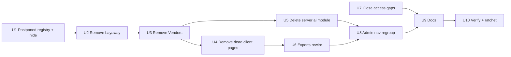

# refactor: Reduce Moon Store to the agreed MVP scope

## Overview

Remove six features that should no longer exist (Layaway, Vendors/Consignment, Report
Builder, Smart Pricing, the AI Insights page, the Backup page). Hide seven postponed
features from every MVP discovery surface (Branches, Transfers, Bundles, Feedback, Online
Orders, Storefront, Warranty). Repair the one retained page that is broken (Exports).
Regroup the Admin navigation. No new product capability is added.

The main research finding: **four of the six removed pages are already dead.**
ReportBuilder, SmartPricing, AiInsights and Backup call 15 endpoints the server never
implemented, and the retained Exports page calls two more. Layaway and Vendors are
different: they are working features with server modules and production data, and they
carry the real removal risk. Layaway holds deducted stock and customer payments (see
Operational Notes). The remaining risk sits where removed or hidden code touches retained
paths: the API-doc drift gate, the POS Bundles strip, and the public write endpoints of
hidden modules.

## Problem Frame

The product exposes about 40 navigation entries across four sidebar sections. About a
third of them are unfinished, broken, or misleadingly named: an "AI Insights" page with no
AI, a SQLite "backup" against a PostgreSQL server, a report builder with no backend. The
README advertises capabilities that do not exist (AI chat assistant, AI product
descriptions, saved custom reports). The objective is a smaller, coherent MVP with clean
foundations for the postponed features. The objective is not to minimize the amount of code.

No brainstorm document exists. The user's request, plus six decisions taken during
planning (see *Resolved During Planning*), is the source of truth.

## Requirements Trace

- R1. Layaway, Vendors/Consignment, Report Builder, Smart Pricing, AI Insights page and
  Backup page no longer exist as product features, client or server, wherever an artifact
  serves only them.
- R2. Branches, Transfers, Bundles, Feedback, Online Orders, Storefront and Warranty are
  absent from the sidebar, from in-app links, and from direct URL entry. Their code is
  retained.
- R3. Suppliers/distributors → purchase order → receive stock → inventory is untouched.
- R4. Every item on the KEEP list works as before. Bundles plumbing in checkout keeps
  working for historical and priced lines.
- R5. Every API path the retained client calls has a matching server route. Dead calls are
  removed, and any remaining mismatch is listed.
- R6. No historical migration is edited, and no table holding production data is dropped
  in this change. Retained objects are documented with the reason.
- R7. The navigation is role-appropriate: Cashier and Delivery see operational items only,
  and the Admin sidebar is regrouped by concern.
- R8. README and project docs distinguish active, hidden and removed, and make no false
  claims.
- R9. The CI gates stay green without weakening: API-doc drift, request-contract counts,
  migration verification, the lint ratchet (lowered, never raised), the bundle budget, and
  the e2e smoke suite.
- R10. The final structured report covers the sections the user listed (Removed, Hidden,
  Preserved, Database, API, Navigation, Tests, Remaining Risks).

## Scope Boundaries

- No new database backup system, no pg_dump endpoint.
- No new role. There is no Manager role today: roles are Admin, Cashier and Delivery, and
  `users.role` is unconstrained TEXT. Admin plays the manager role.
- No surfacing of retained heuristics into Dashboard, Inventory or Customers. That would be
  new UI.
- No feature-flag platform, server-side flags or runtime toggles.
- No `DROP TABLE` migration. The drop is a follow-up after a production export.
- No fixes to hidden-feature bugs: Storefront `storefront/config` dead calls, the Online
  Orders `confirmed` filter mismatch. These are recorded, not fixed.
- No tooling that cross-checks client paths against server routes. The audit is manual
  this time, and the tooling is a follow-up.
- No changes to the `reports` server module (predefined sales, inventory and profit-loss
  reports). It has no client consumer today, but it *is* the predefined-report capability
  the user asked to keep.

## Context & Research

### Dependency map (required before destructive changes)

Paths are grouped by artifact class. *Decision* is what this plan does.

**Layaway** — remove
- Client: route `client/src/routes/_authenticated/layaway.tsx` (Admin+Cashier); page and test
  `client/src/features/sales/pages/Layaway{,.test}.tsx`; barrel `features/sales/index.ts`;
  types `features/sales/types.ts` (`LayawayLine`, `LayawayOrder`, `LayawayDetail`); sidebar
  entry; i18n `layaway.*`, `nav.layaway`; query keys only via `resource('layaway')`.
- Server: `server/src/modules/pos/layaway/*` (7 files); `modules/pos/index.ts` export;
  `router.ts` import and mount; `http/endpointManifest.ts` group and operations;
  `docs/requestContracts.ts` import and spread; `docs/openapi.ts` tag "POS Layaway" and
  paths; tests `server/tests/layaway.test.ts`,
  `server/tests/concurrency/layaway.concurrency.test.ts`.
- DB: `layaway_plans`, `layaway_items`, `layaway_payments` (001, reshaped by 009). They FK
  out to customers, products, variants and users. Nothing FKs in.
- Shared, **retain**: the `reservations` module, `stock_reservations`, and the
  `reservation-cleanup` job. They are used by online orders and the scheduler, not by
  Layaway: Layaway decrements `products.stock` directly.
- Shared, **retain**: `sortForStockWrites` (used by sales, exchanges, online orders) and
  `withDocumentNumber`.
- Shared, **retain**: `activity.entity.layaway` and the `AuditLog.tsx` icon map entry,
  because historical audit rows still carry entity `layaway`.
- Decision: delete client and server code; tables dormant.

**Vendors / Consignment** — remove
- Client: route `_admin/vendors.tsx`; page `features/purchasing/pages/Vendors.tsx` (its
  types are inline); barrel `features/purchasing/index.ts`; sidebar entry; i18n `vendors.*`,
  `nav.vendors`. The page calls two routes that do not exist
  (`vendors/dashboard/stats`, `PUT vendors/:id/status`).
- Server: `server/src/modules/commerce/vendors/*`; `commerce/index.ts` export; router
  mount; manifest; contracts; OpenAPI tag and paths; tests `server/tests/vendors.test.ts`,
  the vendor part of `commerce-contracts.test.ts`, and the vendor fixture in
  `tests/verification/fixtureProvider.ts` and `endpointHealth.test.ts`.
- DB: `vendors`, `vendor_products`, `vendor_commissions`, `vendor_payouts`,
  `vendor_reviews`. No column on any other table references them; FKs point out only.
- Shared, **retain**: `distributors`, `products.distributor_id`, `purchase_orders.*`,
  `users.commission_rate` (staff commission, a separate concept), `vendor-*` build chunks,
  and the generic `editorDialog`/`resource` tests that only borrow the word "vendor".
- Decision: delete client and server code; tables dormant. Deleting
  `vendors/repository.ts` also removes the one cross-wire
  (`LEFT JOIN products p ON p.distributor_id = v.id`).

**Report Builder** — remove
- Client: route `_admin/report-builder.tsx`; page `features/analytics/pages/ReportBuilder.tsx`;
  barrel; sidebar; i18n `reportBuilder.*`, `nav.reportBuilder`. There are five dead calls:
  `GET/POST reports`, `DELETE reports/:id`, `POST reports/:id/run`, `POST reports/quick`.
- Server: none. No custom-report CRUD was ever implemented.
- DB: orphan tables `report_builder` and `saved_reports`. Nothing reads or writes them; they
  appear only in the seed clear list.
- Shared, **retain**: the `reports` module (`/reports/sales|inventory|profit-loss`), which
  holds the predefined reports.
- Decision: delete client; tables dormant; `reports` module kept.

**Smart Pricing** — remove
- Client: route `_admin/smart-pricing.tsx`; page `features/inventory/pages/SmartPricing.tsx`;
  types `PriceSuggestion` and `PricingRule` in `features/inventory/types.ts`; barrel;
  sidebar; i18n `smartPricing.*`, `nav.smartPricing`. There are five dead calls under
  `ai/pricing/*`.
- Server: `GET /ai/pricing-suggestions` exists under a different path and shape, and nothing
  calls it. It goes with the `ai` module below.
- DB: none. There were never any pricing-rule or suggestion tables.
- Markdown-candidate logic: `GET /analytics/dead-stock` already covers slow movers, and
  AdvancedAnalytics consumes it. Nothing is lost.
- Decision: delete client; delete with the `ai` module.

**AI Insights** — remove the page and the server `ai` module
- Client: route `_admin/ai-insights.tsx`; page `features/analytics/pages/AiInsights.tsx`;
  barrel; sidebar; i18n `aiInsights.*`, `nav.aiInsights`. There are four dead calls:
  `ai/predictions`, `ai/predictions/generate`, `GET/POST ai/knowledge-base`.
- Server: `server/src/modules/intelligence/ai/*` (forecast, recommendations,
  pricing-suggestions, churn-risk, anomalies). All are SQL heuristics with zero client
  **and** zero server-internal consumers, and several service methods are already
  unreachable. Coupled artifacts: `intelligence/index.ts`, router, manifest, contracts,
  OpenAPI tag "AI Insights", `tests/intelligence-contracts.test.ts` (the ai part), and
  `tests/intelligence-repository-pagination.test.ts` (the `AiRepository` part).
- DB: orphan tables `sales_predictions`, `ai_chat_sessions`, `ai_chat_messages` and
  `auto_descriptions`. Nothing reads or writes them.
- Shared, **retain**: `GET /analytics/reorder-suggestions` and `GET /analytics/dead-stock`,
  which live in the analytics module.
- Decision: delete page and module (user decision); tables dormant. The heuristics' shape
  is recorded in the follow-up issue.

**Backup** — remove
- Client: route `_admin/backup.tsx`; page `features/admin/pages/Backup.tsx`; barrel;
  sidebar; i18n `backup.*`, `nav.backup`. There is one dead call, `GET exports/backup`,
  which saved the result as `moon-backup-*.db`.
- Server: none. No backup or pg_dump endpoint exists.
- Decision: delete client. Its blob-download snippet is the pattern the Exports rewire
  (Unit 6) reuses.

**Exports** — keep and repair
- `features/analytics/pages/Exports.tsx` calls `GET exports` and `POST exports/generate`,
  and neither exists. The server serves `GET /exports/products|sales|customers` as CSV
  (Admin-only, `sales` takes optional `from`/`to`). No client calls them.
- Decision: rewire to the three CSV endpoints (user decision).

### Hidden-feature coupling

| Feature | Discovery surfaces | Embedded in retained UI | Server exposure |
|---|---|---|---|
| Branches (+Transfers tab) | Sidebar, `_admin/branches.tsx`, `/locations` redirect | none; the server accepts an optional `branch_id` on shift clock-in, and the client never sends it | Admin-only |
| Bundles | Sidebar, `_admin/bundles.tsx`, e2e a11y scan | **POS Bundles strip** (`POS.tsx` ~L396–440) plus fetch (`usePosData.ts` ~L105–112); cart, payload and `bundle_id` checkout pricing | Admin-only CRUD; checkout imports the bundles repository |
| Feedback | Sidebar, `_admin/feedback.tsx` | none | **public `POST /feedback`** |
| Online Orders | Sidebar, `_admin/online-orders.tsx` | none; Deliveries has no FK or field linking to it | **public `POST /online-orders`, holds stock 48h** |
| Storefront | Sidebar, `_admin/storefront.tsx` | none | public `GET /storefront/banners` (read-only) |
| Warranty | Sidebar, `_admin/warranty.tsx` | none | Admin+Cashier list/create |

There is no command palette, onboarding, dashboard shortcut, quick action or Settings tab
for any of these. The only in-app link on the Dashboard goes to `/inventory?lowStock=true`.
Notification links come only from server-generated retained routes. No feature-flag
mechanism exists in either half.

### Relevant code and patterns

- Role gating: `client/src/app/Sidebar.tsx` `navSections[].items[].roles`; route guard
  `client/src/routes/_authenticated/_admin.tsx` (`beforeLoad` → `getDefaultRoute`); catch-all
  `client/src/routes/$.tsx`.
- Routes are file-based. `client/src/routeTree.gen.ts` is committed and regenerated only by
  the Vite plugin, so it must be regenerated (dev or build) before `tsc`.
- Server API surface: `server/src/router.ts` `routeTable`; `server/src/http/endpointManifest.ts`
  (group plus operation entries, authorization kinds `adminOnly`, `publicAuth`, etc.);
  `server/src/docs/openapi.ts`; `server/src/docs/requestContracts.ts`. All four move together
  or `npm run check:api-docs` and `tests/requestContractCoverage.test.ts` fail.
- Mount count: `server/tests/api-contract-conformance.test.ts` expects exactly 38 today.
- Seed clear list: `server/src/database/seed.ts` `tablesToClear` (77). Every dormant table
  stays in it, because the tables still exist.
- i18n: flat keys in `client/src/shared/i18n/{en,ar}.json`; parity checked by
  `app/__tests__/Layout.test.tsx` and `e2e/specs/locator-audit.spec.ts`.
- Blob download: `features/admin/pages/Backup.tsx` (`responseType: 'blob'`, object URL,
  anchor click).
- Existing settings-boolean toggles (`tax_enabled`, `loyalty_enabled`) are *business*
  settings, not a feature-flag system. They are deliberately not reused (see decisions).

### Institutional learnings

- `docs/solutions/` does not exist. The relevant learnings are in `CLAUDE.md` *Learnings*:
  - **Test the boundary, not only the service.** Zod strips unknown keys, and `bundle_id`
    once never reached the service. Removing Bundles' UI must not touch `saleItemSchema`.
  - **The cart line `data-testid` is built from `lineKey`, which includes `bundle_id`.**
    `e2e/support/locators.ts` rebuilds it by hand, so leave cart line keys unchanged.
  - **The `CLAUDE.md` ratchet rule:** never raise a ratchet, and lower it in the commit that
    earns the reduction. The lint warning count and `EXPECTED_*` counts are exact.

### External references

None used. The work is subtraction inside well-established local patterns.

## Key Technical Decisions

- **The hide mechanism is one client registry, `client/src/shared/lib/postponedFeatures.ts`,
  consulted by three consumers.** The consumers are the Sidebar filter, the `_admin`
  `beforeLoad` guard, and the POS Bundles strip. Rationale:
  - It is the smallest thing that satisfies "not visible, not reachable by URL, code
    retained".
  - Re-enabling a feature is a one-line removal plus the reactivation checklist.
  - Route files, page components and their tests stay compiling and green.
  - It lives in `shared/lib/` beside `storageKeys.ts`, not in `app/`, because the POS slice must
    read it and features may not import `app/` (placement rule R5). It is a flat list of
    paths with one predicate: every feature maps to exactly one path.
  - Rejected alternatives:
    - Deleting the route files loses the page tests' route wiring and makes re-enabling a
      re-authoring job.
    - A settings-table flag is runtime state for a build-time product decision, and would
      need server, migration and admin UI.
    - Per-route guards in six files would duplicate the same check.
- **Hidden routes redirect; they are not 404s.** A hidden path under `_admin` redirects to
  `getDefaultRoute(user)`, which is the same behavior as the existing role guard and the
  catch-all. `/locations` keeps chaining to `/branches` and then to the default route.
- **Bundles hide at the POS strip and fetch only.** Cart, `lineKey`, `salePayload`,
  `saleItemSchema` and server bundle pricing are untouched (R4 and the Learnings above).
- **Hidden server modules stay mounted and documented. Their anonymous writes, the
  online-order detail read, and the reservations routes gate to Admin** (user decisions). `POST /online-orders` and `POST /feedback` get
  `verifyToken, requireRole('Admin')`, and both manifest entries become `adminOnly`. Online-orders was `publicAuth`; feedback was
  already, wrongly, `allAuthenticated`, while its route had no auth at all. This removes the only way an unauthenticated caller can reserve POS stock
  while the storefront is postponed. The public banner read stays, because it has no side
  effects.
- **Removed features' tables are retained dormant, with no migration** (user decision).
  Rationale:
  - Production has these tables. `vendor_payouts` and `layaway_payments` are financial
    history.
  - A drop migration's down must recreate 14 tables exactly for
    `verify:migrations`, and it still cannot restore data.
  - Consequences: the seed `tablesToClear` list, the "77 tables" e2e prose, the 009/011 migration tests and the production-schema fixture stay unchanged.
  - The owner will reset the production database before the MVP launch. That removes the
    data-loss argument, but the drop stays a dedicated follow-up. This change stays free of
    migration, seed, e2e-count and fixture churn.
- **Audit-history labels are kept** (`activity.entity.layaway`, `activity.entity.vendor`,
  and the AuditLog icon entry), because existing audit rows still render them.
- **i18n keys for removed features are deleted. Keys for hidden features are kept.**
  Removed prefixes: `layaway.*`, `vendors.*`, `reportBuilder.*`, `smartPricing.*`,
  `aiInsights.*`, `backup.*`, the matching `nav.*`, and any `exports.*` keys orphaned by the
  rewire.
- **No new role.** Role review confirms the Cashier nav (POS, Sales, Register, Shifts,
  Inventory, Barcode) and the Delivery nav (Shifts, Deliveries) are already operational.
  The Admin sidebar is regrouped by concern (user decision).
- **The `ai` module is deleted outright** (user decision), rather than renamed and kept
  without a consumer.

## Open Questions

### Resolved During Planning

- *Drop the removed features' tables?* No. They are retained dormant; a follow-up issue
  covers the export-then-drop migration (user decision).
- *Warranty is on no list; what is it?* Hidden for later, like Feedback (user decision).
- *Exports is broken; what should happen?* Rewire it to the existing CSV endpoints (user
  decision).
- *What happens to the `ai` module?* Delete it (user decision).
- *Server posture for hidden features?* Gate the two public writes, `GET /online-orders/:id`
  and the reservations routes to Admin, and keep the rest (user decisions).
- *Regroup the Admin nav?* Yes (user decision). The target layout is below.
- *Is `reservations` Layaway-owned?* No. Online orders and the scheduler use it, so it is
  retained.
- *Does Deliveries depend on Online Orders or Storefront?* No, not in either direction.
  `delivery_orders` has no source column, and Deliveries are entered manually.
- *Is `GET delivery/analytics/performance` a dead call?* No. The server serves it at
  `delivery/routes.ts`, and it was verified during planning.
- *Command palette or onboarding to clean?* Neither exists.
- *Can live production records be stranded?* Only if this change deploys before the
  production reset the owner has planned for the MVP launch (user decision, 2026-09-11).
  After the reset there are no layaway plans, online orders, warranty claims or transfers to
  strand, so hidden features need no preflight.
- *How is Layaway removed?* Removed now. If the deploy precedes the reset, the owner settles
  each open plan first (user decision).
- *Does the `analytics` bundle-budget chunk survive?* Yes. It is named after the retained
  `_admin/analytics.tsx` route under `autoCodeSplitting`. Confirm it on the first build.
- *Do existing server tests post anonymously to the gated routes?* No. The online-order suites
  call the service directly. Only the manifest-driven endpoint-health payloads go over HTTP.

### Deferred to Implementation

- Exact operation counts after removal: the "3 of 204" line in `CLAUDE.md`, and the count
  assertions in `requestContractCoverage.test.ts`. Read them from the gate output; don't
  pre-compute.
- The exact lint-warning reduction from deleting the vendors, layaway and ai modules. Measure
  it and lower `--max-warnings` by exactly that.

- Which `exports.*` i18n keys become unused after the rewire.

## High-Level Technical Design

*Directional only.* It shows the postponed-feature registry's shape and consumers, not
literal code.

```text
shared/lib/postponedFeatures.ts
  POSTPONED_PATHS = ['/branches', '/bundles', '/feedback', '/online-orders',
                     '/storefront', '/warranty']   // Transfers is a tab inside /branches
  isPostponedPath(pathname)  -> true when pathname equals or is under a listed path
  (header comment = reactivation checklist: delete key, restore a11y scan, re-check docs)

consumers
  app/Sidebar.tsx                  items.filter(role match AND NOT isPostponedPath(item.to))
  routes/_authenticated/_admin.tsx beforeLoad: not Admin OR isPostponedPath(location.pathname)
                                   -> redirect(getDefaultRoute(user))
  features/pos (usePosData, POS)   bundles query enabled + strip rendered only when
                                   NOT isPostponedPath('/bundles')
```

Target Admin navigation (Cashier and Delivery are subsets by role):

| Section | Items (roles) |
|---|---|
| Operations | Dashboard (A), POS (A,C), Sales (A,C), Register (A,C), Shifts (A,C,D), Deliveries (A,D) |
| Catalog | Inventory (A,C), Categories (A), Collections (A), Stock Count (A), Barcode (A,C) |
| Customers & Marketing | Customers (A), Segments (A), Promotions (A), Gift Cards (A) |
| Purchasing | Purchase Orders (A), Distributors (A), Expenses (A) |
| Insights | Analytics (A), Exports (A) |
| Administration | Users (A), Audit Log (A), Settings (A) |

Hidden entries stay in `navSections` and are filtered by the registry. Removed entries are
deleted.

Unit sequencing:



U2–U4 are sequential because they share `Sidebar.tsx`, the feature barrels and both locale
files. U2, U3 and U5 share `router.ts`, the manifest, OpenAPI, contracts and the mount-count
test. The rule is one editor per file; the units are otherwise independent.

## Implementation Units

- [x] **Unit 1: Postponed-feature registry and hiding**

**Goal:** Hide Branches (with Transfers), Bundles, Feedback, Online Orders, Storefront and
Warranty from the sidebar, from direct URLs, and from the POS screen.

**Requirements:** R2, R4, R7

**Dependencies:** None

**Files:**
- Create: `client/src/shared/lib/postponedFeatures.ts`
- Create: `client/src/shared/lib/postponedFeatures.test.ts`
- Modify: `client/src/app/Sidebar.tsx`
- Modify: `client/src/routes/_authenticated/_admin.tsx`
- Modify: `client/src/features/pos/hooks/usePosData.ts`
- Modify: `client/src/features/pos/pages/POS.tsx`
- Test: `client/src/app/__tests__/Sidebar.test.tsx`
- Test: `client/src/routes/__tests__/auth-guards.test.tsx`
- Test: `client/src/routes/__tests__/route-rendering.test.tsx`
- Test: `client/src/features/pos/pages/POS.test.tsx`
- Modify: `e2e/specs/a11y.spec.ts`

**Approach:**
- The registry follows the High-Level Technical Design. Match paths on equality or on a
  `/`-delimited prefix, so `/bundles/x` is hidden but `/bundles-report` would not be.
- The `_admin` guard adds the postponed check next to the role check, with the same redirect.
- In POS, disable the bundles query (no request fires) and do not render the strip. Leave
  `handleBundleClick`, `addBundle` and the cart plumbing in place.
- `route-rendering.test.tsx`: the Warranty cases (Admin renders, Cashier redirects) become
  "Admin is redirected to the default route".
- `auth-guards.test.tsx`: keep the existing unit assertion. `locations.tsx` is unchanged, so
  its `beforeLoad` still redirects to `/branches`. Add a `createTestRouter` case in which an
  Admin at `/locations` ends on `/`.
- `a11y.spec.ts`: remove the `/bundles` scan, because the route now redirects. Record its
  restoration in the registry's reactivation checklist rather than skipping it silently.

**Patterns to follow:**
- `client/src/shared/lib/authRedirect.ts` (`getDefaultRoute`) and the existing `_admin`
  guard.
- `storageKeys.ts`, a single-file constant registry with a colocated test.

**Test scenarios:**
- Happy path: `isPostponedPath` returns true for each of the six listed paths, and for a
  sub-path (`/branches/3`).
- Edge case: `isPostponedPath('/bundlesx')` is false, and so are `/` and `/inventory`.
- Happy path: an Admin navigating to `/branches`, `/bundles`, `/feedback`, `/online-orders`,
  `/storefront` or `/warranty` lands on `/`.
- Happy path: an Admin navigating to `/locations` lands on `/`.
- Happy path: the Admin sidebar contains none of Branches, Bundles, Feedback, Online Orders,
  Storefront or Warranty, but still shows Dashboard, Settings and Users.
- Happy path: a Cashier sees POS and none of the hidden or Admin items.
- Integration: POS rendered with an API that would return an active bundle issues no
  `bundles` request and shows no Bundles heading or button. Products still render.
- Regression: the existing `cartStore.test.ts` bundle cases and `salePayload.test.ts` pass
  unchanged, which proves the plumbing is intact.

**Verification:**
- No hidden feature is reachable by clicking or by typing a URL.
- The POS product grid is unchanged.
- The e2e smoke suite's cart-line locators still resolve.

---

- [x] **Unit 2: Remove Layaway**

**Goal:** Delete the Layaway client feature and server module. The tables become dormant.

**Requirements:** R1, R6, R9

**Dependencies:** Unit 1 (shares `Sidebar.tsx`)

**Files:**
- Delete: `client/src/routes/_authenticated/layaway.tsx`
- Delete: `client/src/features/sales/pages/Layaway.tsx`
- Delete: `client/src/features/sales/pages/Layaway.test.tsx`
- Modify: `client/src/features/sales/index.ts`, `client/src/features/sales/types.ts`,
  `client/src/app/Sidebar.tsx`
- Modify: `client/src/shared/i18n/en.json`, `client/src/shared/i18n/ar.json` (remove
  `layaway.*` and `nav.layaway`; keep `activity.entity.layaway`)
- Regenerate: `client/src/routeTree.gen.ts`
- Delete: `server/src/modules/pos/layaway/` (all files)
- Modify: `server/src/modules/pos/index.ts`, `server/src/router.ts`,
  `server/src/http/endpointManifest.ts`, `server/src/docs/openapi.ts`,
  `server/src/docs/requestContracts.ts`
- Delete: `server/tests/layaway.test.ts`, `server/tests/concurrency/layaway.concurrency.test.ts`
- Test: `server/tests/api-contract-conformance.test.ts` (mounts 38 → 37)
- Test: `client/src/routes/__tests__/auth-guards.test.tsx`

**Approach:**
- Remove the OpenAPI "POS Layaway" tag and paths, the manifest group and operations, and the
  contracts in one change, so `check:api-docs` stays consistent.
- Keep reservations everywhere.
- Keep `AuditLog.tsx`'s `layaway` icon mapping and the `CalendarClock` import it needs.
- Leave the `documentNumber.ts` comment mentioning layaway plans as is, or trim it to stay
  accurate. The helper itself is shared.
- Add a comment near `tablesToClear` in `seed.ts` noting that the layaway rows are dormant,
  retained pending the drop follow-up.

**Patterns to follow:** How the most recent module removals or renames kept manifest,
OpenAPI and contracts in lockstep (#101, `docs/CONVENTIONS.md`).

**Test scenarios:**
- Happy path: an authenticated Admin navigating to `/layaway` is redirected by the catch-all
  to `/`, and a Cashier to `/pos`.
- Integration: `api-contract-conformance` sees 37 mounts, and `check:api-docs` reports no
  documented-but-unserved or served-but-undocumented operation.
- Integration: the reservations, scheduler and online-orders suites (including concurrency)
  pass unchanged.
- Regression: the seed suite and the migration009/011 tests pass unchanged, which proves the
  tables are still present.

**Verification:**
- `grep -ri layaway` over `client/src` and `server/src` matches only the retained audit label
  and icon, migrations, the seed clear list and its comment, the historical fixture, and the
  `documentNumber.ts` comment if it was kept.

---

- [x] **Unit 3: Remove Vendors / Consignment**

**Goal:** Delete the vendors feature without touching distributors or purchase orders.

**Requirements:** R1, R3, R6, R9

**Dependencies:** Unit 2 (shared files)

**Files:**
- Delete: `client/src/routes/_authenticated/_admin/vendors.tsx`
- Delete: `client/src/features/purchasing/pages/Vendors.tsx`
- Modify: `client/src/features/purchasing/index.ts`, `client/src/app/Sidebar.tsx`, `en.json`,
  `ar.json` (remove `vendors.*` and `nav.vendors`; keep `activity.entity.vendor`)
- Regenerate: `client/src/routeTree.gen.ts`
- Delete: `server/src/modules/commerce/vendors/` (all files)
- Modify: `server/src/modules/commerce/index.ts`, `server/src/router.ts`,
  `server/src/http/endpointManifest.ts`, `server/src/docs/openapi.ts`,
  `server/src/docs/requestContracts.ts`
- Delete: `server/tests/vendors.test.ts`
- Modify: `server/tests/commerce-contracts.test.ts` (trim the vendor assertions, keep the
  orders and warranty assertions in the shared test)
- Modify: `server/tests/verification/fixtureProvider.ts`,
  `server/tests/verification/endpointHealth.test.ts` (drop the `:vendorId` fixture)
- Test: `server/tests/api-contract-conformance.test.ts` (37 → 36)
- Test: `client/src/routes/__tests__/auth-guards.test.tsx`

**Approach:**
- Leave `commissions.*` i18n (staff commission, unrelated) and the generic
  `editorDialog`/`resource` tests alone.

**Test scenarios:**
- Happy path: an Admin navigating to `/vendors` lands on `/`.
- Integration: the purchase-order suite passes unchanged: create PO against a distributor,
  receive, stock increments.
- Integration: the distributors suite passes unchanged.
- Integration: endpoint-health verification runs without the vendor fixture, and no
  remaining fixture queries `vendors`.
- Regression: `commerce-contracts.test.ts` still asserts the online-orders and warranty
  pagination contracts.

**Verification:**
- `grep -ri vendor` over `client/src` and `server/src` matches only migrations, the seed clear
  list, the S3 wording (`storage/s3Driver.ts`, `config/env.ts`), the retained
  `activity.entity.vendor` label, and the generic `editorDialog`/`resource` test fixtures.

---

- [x] **Unit 4: Remove the dead client pages (Report Builder, Smart Pricing, AI Insights,
  Backup)**

**Goal:** Delete four pages whose every API call targets a nonexistent route.

**Requirements:** R1, R5

**Dependencies:** Unit 3 (shared files)

**Files:**
- Delete: `client/src/routes/_authenticated/_admin/report-builder.tsx`, `smart-pricing.tsx`,
  `ai-insights.tsx`, `backup.tsx`
- Delete: `client/src/features/analytics/pages/ReportBuilder.tsx`, `AiInsights.tsx`
- Delete: `client/src/features/inventory/pages/SmartPricing.tsx`
- Delete: `client/src/features/admin/pages/Backup.tsx`
- Modify: `client/src/features/analytics/index.ts`, `client/src/features/inventory/index.ts`,
  `client/src/features/admin/index.ts`
- Modify: `client/src/features/inventory/types.ts` (remove `PriceSuggestion` and `PricingRule`)
- Modify: `client/src/app/Sidebar.tsx` (remove four entries and any now-unused icons)
- Modify: `en.json`, `ar.json` (remove `reportBuilder.*`, `smartPricing.*`, `aiInsights.*`,
  `backup.*` and their `nav.*` keys)
- Regenerate: `client/src/routeTree.gen.ts`
- Test: `client/src/routes/__tests__/auth-guards.test.tsx`

**Approach:**
- Only the client changes. The orphan tables stay dormant (Unit 9 documents them).
- Before deleting an icon import, confirm no other entry uses it (`Zap`, `Brain`,
  `BarChart3`, `Database`).

**Test scenarios:**
- Happy path: an Admin navigating to each of `/report-builder`, `/smart-pricing`,
  `/ai-insights` and `/backup` lands on `/`.
- Regression: Dashboard (`analytics/dashboard-all`) and AdvancedAnalytics (abc, dead-stock,
  ltv, heatmap) render. The existing `DashboardCharts.test.tsx` passes.

**Verification:**
- A client-wide search finds no remaining call to `ai/`, `reports` (bare), `reports/quick`,
  `reports/:id/run` or `exports/backup`.

---

- [x] **Unit 5: Delete the server `ai` module**

**Goal:** Remove the consumerless heuristic endpoints that were presented as AI.

**Requirements:** R1, R5, R9

**Dependencies:** Unit 3 (shared server files: router, manifest, OpenAPI, contracts and the
mount-count test). Units 4 and 5 can run in parallel: the dead client calls never targeted
this module's paths.

**Files:**
- Delete: `server/src/modules/intelligence/ai/` (all files)
- Modify: `server/src/modules/intelligence/index.ts`, `server/src/router.ts`,
  `server/src/http/endpointManifest.ts`, `server/src/docs/openapi.ts` (tag "AI Insights" and
  paths), `server/src/docs/requestContracts.ts`
- Modify: `server/tests/intelligence-contracts.test.ts` (drop the ai assertions, keep the
  reports ones)
- Modify: `server/tests/intelligence-repository-pagination.test.ts` (drop the `AiRepository`
  case, keep the rest)
- Test: `server/tests/api-contract-conformance.test.ts` (36 → 35)

**Approach:**
- The analytics module's `reorder-suggestions` and `dead-stock` are the retained
  equivalents. Confirm nothing in analytics imports from `ai/` before deleting.
- Record the five heuristics (formula and thresholds) in the follow-up issue body, not in a
  new doc file.

**Test scenarios:**
- Integration: `check:api-docs` is clean.
- Integration: `requestContractCoverage` counts reconcile, `EXPECTED_UNCONVERTED` stays 3
  and `EXPECTED_UNCLASSIFIED` stays 0.
- Integration: `GET /api/v1/ai/forecast` returns the standard not-found envelope.
- Regression: `GET /api/v1/analytics/dead-stock` and `/analytics/reorder-suggestions` behave
  as before.

**Verification:**
- No `ai` mount in `routeTable`.
- The OpenAPI document has no "AI" tag.

---

- [x] **Unit 6: Rewire the Exports page to the CSV endpoints**

**Goal:** Make the retained Exports page work against the endpoints that exist.

**Requirements:** R4, R5

**Dependencies:** Unit 4, only because both edit `en.json`/`ar.json` (one editor per file).
The blob-download approach comes from `Backup.tsx`, which Unit 4 deletes: copy the pattern
from git history, not an import.

**Files:**
- Modify: `client/src/features/analytics/pages/Exports.tsx`
- Modify: `en.json`, `ar.json` (prune `exports.*` keys that become unused, including `exports.downloaded`; add
  `exports.downloadedFile`)
- Create: `client/src/features/analytics/pages/Exports.test.tsx`
- Modify: `server/src/modules/intelligence/exports/service.ts` (`escapeCsv`),
  `server/src/modules/intelligence/exports/controller.ts` (charset and BOM)
- Test: `server/tests/exports.test.ts` (check for an existing exports suite first; create one
  if there is none)

**Approach:**
- Offer exactly three sources: products, sales, customers. Download is
  `GET exports/<source>` with `responseType: 'blob'`, saved via an object URL as
  `moon-<source>-<YYYY-MM-DD>.csv`.
- Remove the history table, `ExportRecord`, the `['exports']` query, and the
  `inventory`/`deliveries` options.
- No date-range UI. Sales exports everything, as the server allows by default. A date filter
  would be new UI.
- Use a translated error toast (the current fallback is hard-coded English).
- Success feedback is a count-free translated toast (`exports.downloadedFile`). A blob
  carries no row count, so `exports.downloaded` goes.
- The button stays disabled while a download is pending, so a double click fires one
  request.
- **Harden the CSV on the server** (user decision), where every consumer benefits:
  - `escapeCsv` neutralizes string cells that start with `=`, `+`, `-`, `@`, tab or CR by
    prefixing a single quote and quoting the field. Numeric cells are not touched, so
    negative amounts stay numbers.
  - The response is `text/csv; charset=utf-8` and starts with a UTF-8 BOM, so Excel reads
    Arabic correctly.
- The sales date range stays out of scope and becomes a follow-up (the server already
  accepts `from`/`to`).

**Patterns to follow:** The deleted `Backup.tsx` blob flow; `useTransport().request`;
`PageHeader`/`Card` layout as it exists today.

**Test scenarios:**
- Happy path: with Products selected, Download issues `GET exports/products` with
  `responseType: 'blob'` and creates a download named `moon-products-<date>.csv`.
- Happy path: Sales and Customers hit `exports/sales` and `exports/customers` respectively.
- Error path: a transport rejection shows the translated error toast, no download is
  created, and the button leaves its loading state.
- Edge case: the page issues no request to `exports` or `exports/generate` on mount. This
  guards against the dead history call returning.
- Edge case: the source selector offers exactly three options.
- Happy path: a successful download shows the translated count-free success toast.
- Edge case: a second press while a download is pending issues no second request.
- Security (server): a customer named `=HYPERLINK("x")` exports as a quoted, quote-prefixed
  cell. The same holds for a leading `+`, `-`, `@`, tab or CR.
- Edge case (server): a negative numeric value, such as a price of `-5`, exports without the
  prefix.
- Happy path (server): the response begins with the bytes `EF BB BF`, its content type
  declares `charset=utf-8`, and an Arabic customer name round-trips intact.

**Verification:**
- An Admin can download each of the three CSVs and open the customers CSV in Excel with
  Arabic names intact (manual check by the user; no browser testing by the agent).

---

- [x] **Unit 7: Close the hidden modules' and reservations' access gaps**

**Goal:** No unauthenticated caller can create online orders (which reserve stock) or
feedback while those features are postponed. No non-Admin role can hold or release stock
through `/reservations`, or read online-order customer details.

**Requirements:** R2, R4, R9

**Dependencies:** None. It is independent of the client units and can land in any order
before Unit 9.

**Files:**
- Modify: `server/src/modules/commerce/onlineOrders/routes.ts`,
  `server/src/modules/commerce/feedback/routes.ts`,
  `server/src/modules/pos/reservations/routes.ts`
- Modify: `server/src/http/endpointManifest.ts`:
  - `POST /online-orders` changes from `publicAuth` to `adminOnly`.
  - `POST /feedback` changes from `allAuthenticated` to `adminOnly`. The manifest already
    claimed auth that the route never enforced.
    - `GET /online-orders` and `PUT /online-orders/:id/status` change from `adminOrDelivery` to
    `adminOnly`, to match their routes. `GET /online-orders/:id` becomes `adminOnly` together
    with its new route gate.
  - Every reservations operation changes from `adminOrCashier` to `adminOnly`, to match its
    new route gate.
  - Group entries need no change.
- Modify: `server/src/docs/openapi.ts`:
  - `POST /online-orders`: change `security: []` to BearerAuth, and the summary and
    description from "Public" to Admin.
  - `POST /feedback`: it already declares BearerAuth, so only the allowed-roles text changes to Admin.
  - The online-orders read and status operations, and the reservations operations: update
    the allowed-roles text to Admin.
- Create: `server/tests/http/postponedWrites.test.ts`
- Modify: `server/tests/verification/payloads.ts` only if endpoint-health needs a changed
  payload
- Modify: the header comment of `server/tests/onlineOrders.test.ts` ("takes no token" is
  stale)

**Approach:**
- Add `verifyToken, requireRole('Admin')` to both POSTs, to `GET /online-orders/:id`, and to
  every reservations route. That is the same chain as the sibling routes. The online-orders
  service and the scheduler use the reservations *repository* directly, so they are
  unaffected.
- The existing online-order suites (including the real-PG concurrency suite) are
  service-level. They are unaffected and need no token.
- **No existing gate checks authorization.** `check:api-docs` compares endpoint sets and
  request shapes, and endpoint-health picks its token from the manifest's own roles. The
  new HTTP-level tests are therefore the only proof of the gate. Treat them as
  load-bearing.
- Build the PR's list of intentionally public write operations by walking the `routeTable`
  layer stacks for handlers without `verifyToken`, not by reading the manifest. The
  manifest is known to disagree with the routes.
- Note in each route comment that the gate lifts only when Storefront ships, and together
  with a named abuse control (rate limit or hold cap). It must not revert to fully
  anonymous stock holds.
- Leave the public `GET /storefront/banners` alone.

**Patterns to follow:** `server/tests/http/rateLimit.test.ts` and
`server/tests/observability/health.test.ts` (`app.listen(0, '127.0.0.1')` HTTP harness).

**Test scenarios:**
- Error path: `POST /api/v1/online-orders` with no token returns 401 with the standard
  envelope, and no `stock_reservations` or `customers` row is created.
- Error path: the same request with a Cashier token, and with a Delivery token, returns 403.
- Happy path: the same request with an Admin token returns 201 and creates the 48h
  reservation.
- Error path: `POST /api/v1/feedback` with no token returns 401, and no `customer_feedback`
  row is created. Cashier and Delivery get 403. Admin gets 201.
- Error path: `GET /api/v1/online-orders/:id` with a Cashier or Delivery token returns 403.
  Admin gets 200.
- Error path: `POST /api/v1/reservations` with a Cashier or Delivery token returns 403, and no
  row is created. The `DELETE` routes return 403 for those roles and leave the rows intact.
  Admin succeeds.
- Regression: the reservations, scheduler and online-orders suites pass unchanged. They work
  at the repository level.
- Integration: `check:api-docs` stays clean with the edited manifest and OpenAPI. That is
  necessary but not sufficient.

**Verification:**
- The HTTP tests for every gated route pass.
- The route-walk list of anonymous write handlers contains only auth login/refresh and the
  other intentionally public operations, each named in the PR.

---

- [ ] **Unit 8: Regroup the Admin navigation**

**Goal:** Arrange the retained items into the six concern-based sections.

**Requirements:** R7

**Dependencies:** Units 1–6 (all Sidebar edits land first)

**Files:**
- Modify: `client/src/app/Sidebar.tsx`
- Modify: `en.json`, `ar.json`:
  - Reuse `nav.sectionOperations` and `nav.sectionAdmin` with their existing labels.
  - Add `nav.sectionCatalog`, `nav.sectionCustomersMarketing`, `nav.sectionPurchasing` and
    `nav.sectionInsights`.
  - Remove `nav.sectionProducts` and `nav.sectionOrders`.
- Test: `client/src/app/__tests__/Sidebar.test.tsx`

**Approach:**
- Follow the target table above.
- Item role arrays are unchanged, except that Deliveries moves section (its roles stay
  A,D).
- Hidden items keep an entry, filtered out by the registry, in these sections: Online
  Orders → Operations; Bundles → Catalog; Feedback and Warranty → Customers & Marketing;
  Branches and Storefront → Administration. That is where they reappear on reactivation.
- The Arabic section labels need a native-quality check by the user.

**Test scenarios:**
- Happy path: the Admin sidebar renders the six section headings in order, with the
  expected items under each.
- Happy path: the Cashier sidebar shows Operations (POS, Sales, Register, Shifts) and
  Catalog (Inventory, Barcode) only, with no empty section headings.
- Happy path: the Delivery sidebar shows Operations (Shifts, Deliveries) only.
- Edge case: a section whose items are all hidden or role-filtered renders no heading.
- Integration: in Arabic (`locale=ar`), the section headings render translated and the
  drawer opens from the right.

**Verification:**
- The i18n parity test passes, and no `nav.*` key is left unused among the section keys.

---

- [ ] **Unit 9: Documentation**

**Goal:** Make the docs tell the truth about active, hidden and removed features, and
record what is dormant and why.

**Requirements:** R6, R8, R10

**Dependencies:** Units 1–8

**Files:**
- Modify: `README.md`
  - Features section split into *MVP*, *Postponed (hidden)* and *Removed*.
  - Delete the claims for AI chat, auto descriptions, the report builder, smart pricing,
    layaway, vendors and backup.
  - Rename "Analytics & Intelligence" honestly.
  - Update the client and server structure comments.
  - Update the deployment note, which says to verify "layaway" after deploy.
- Modify: `AGENTS.md` (the slices table)
- Modify: `CLAUDE.md` (the operations total in the ratchet table; one Learnings entry on the
  postponed registry and the dormant-tables decision)
- Modify: `server/CLAUDE.md`
  - Rewrite the layaway sentences at ~L82 and ~L147 so they stay accurate as history or are
    removed.
  - Add a short **Dormant tables** section. It lists the 14 retained tables, why they are
    retained (production data, no drop until export), and the deploy preflight. It also states
    that dormant is not inert: `layaway_plans.customer_id` and `layaway_items.product_id`
    restrict deletes. Deleting a customer or product that ever had a layaway plan already
    fails with an unmapped database error today, and that stays true until the drop.
- Modify: `client/CLAUDE.md` (a pointer to `shared/lib/postponedFeatures.ts` and its
  reactivation checklist)
- Leave `docs/reports/api-verification-report.md` and `docs/openapi-derivation-diff.md`
  unchanged. Both are dated snapshots, like plans, and the first is generated by
  `endpointHealth.test.ts` with `WRITE_API_REPORT=1`. Unit 10 may regenerate it.
- Leave `docs/plans/*` and `docs/brainstorms/*` unchanged (historical).

**Approach:**
- Flag in the PR, rather than create, that `AGENTS.md` and `CLAUDE.md` point to
  `docs/ARCHITECTURE.md`, which does not exist.
- No new markdown files beyond this plan.

**Test expectation:** none. The unit is docs only, and the verification is the removed-name
search in Unit 10.

**Verification:**
- README advertises nothing that is hidden or removed, and lists hidden features under
  Postponed.

---

- [ ] **Unit 10: Final verification, ratchet, API contract audit**

**Goal:** Prove R4, R5 and R9 across both halves, lower the lint ratchet, and produce the
final report.

**Requirements:** R4, R5, R9, R10

**Dependencies:** Units 1–9

**Files:**
- Modify: `server/package.json` (`--max-warnings` lowered by the measured reduction)
- Modify: `CLAUDE.md` (the ratchet table's lint value and the "391 → 385" prose, set to the
  measured number in the same commit)

**Approach:**
- Run client lint, typecheck, test and build (with `routeTree.gen.ts` regenerated and
  committed), plus `budget`.
- Run server lint, typecheck, test with `TEST_DATABASE_URL`, `check:api-docs` and
  `verify:migrations`. Migrations don't change, but running it proves nothing regressed.
- Run the e2e smoke suite against a disposable DB.
- **API contract audit:** enumerate every `transport.request` path, `resource(name)` path and
  `useApiQuery` path in the retained client, and map each to a served route. Record the
  table in the PR description. Expected residue:
  - Storefront's `storefront/config`: hidden, not fixed.
  - The Online Orders `confirmed` filter: hidden, not fixed.
- **Removed-name search** across the repo for `layaway`, `vendor`, `report-builder` and
  `reportBuilder`, `smart-pricing` and `smartPricing`, `ai-insights` and `aiInsights`,
  `backup`, and `/ai/`. Every remaining hit must be classified as retained-by-decision.
- Produce the final structured report (R10) from the unit outcomes.

**Test scenarios:** The retained-flow checklist maps to existing suites. Nothing new is
written here; confirm each of these is green:
- POS checkout: e2e `checkout-cash`, `payments`, `tax-loyalty`, `duplicate-submit`, and
  `sales.test.ts`.
- Sales history: `SalesHistory.test.tsx`.
- Refunds and exchanges: `RefundDialog.test.tsx`, plus the sales refund and exchange server
  suites.
- Inventory, stock count and adjustments: `Inventory.test.tsx` and the server suites.
- Purchase orders: `PurchaseOrders.test.tsx` and the server suite.
- Customers and loyalty: `tax-loyalty` e2e and the customers suite.
- Gift cards: the gift-card suite. Store credit: `storeCredit.test.ts`.
- Deliveries: `Deliveries.test.tsx` and the delivery suite.
- Register and shifts: `Register.test.tsx`, `Shifts.test.tsx` and the server suites.
- Analytics: `DashboardCharts.test.tsx`, plus AdvancedAnalytics and Segments route
  rendering.
- Arabic/RTL: e2e `locale-rtl` and the a11y RTL block.
- Removed and hidden unreachable: the Unit 1, 2, 3 and 4 route tests.

**Verification:**
- All gates are green.
- The ratchet is lower than 385 by exactly the measured amount.
- The audit table has no unexplained mismatch.

## System-Wide Impact

- **Interaction graph:**
  - The Sidebar, the `_admin` guard and POS all read the registry.
  - The server routeTable, manifest, OpenAPI and contracts must agree, and the drift gate
    enforces it. The gate checks endpoint sets and request shapes, not authorization.
  - The scheduler's `reservation-cleanup` is unaffected.
- **Error propagation:** Removed server paths fall through to the existing not-found
  envelope. Gated POSTs use the existing 401/403 error contract. No new error codes.
- **State lifecycle risks:**
  - Active production layaway plans have already decremented stock. With the code removed,
    nobody can complete or cancel them, and their stock stays out of sellable inventory
    until a follow-up reconciles it. This is a **deploy prerequisite** only if this change deploys before the production reset;
    see Operational Notes.
  - Persisted client state (cart, held carts) never contained layaway or vendor data. It is
    unaffected.
- **API surface parity:** API consumers other than the SPA would lose `/layaway`, `/vendors`
  and `/ai/*`, and need an Admin token for the gated routes. None are known; the storefront
  never shipped.
- **Integration coverage:** checkout with a `bundle_id` line still prices server-side
  (existing `sales.test.ts` bundle cases). Online-order stock holds, now created by an
  Admin, still reduce availability and expire.
- **Unchanged invariants:**
  - `saleItemSchema`, cart `lineKey`, `salePayload` and e2e locators.
  - All migrations 001–013 and their downs, and the seed data.
  - `EXPECTED_UNCONVERTED = 3` and `EXPECTED_UNCLASSIFIED = 0`.
  - The persist keys and the `['settings']` shared query key.
  - Distributors, purchase orders and receive-stock.

## Risks & Dependencies

| Risk | Likelihood | Impact | Mitigation |
|---|---|---|---|
| Open layaway plans (stock plus customer payments) are stranded | Low (production is reset before MVP) | High | Only if the deploy precedes the reset: the owner settles each open plan and records refunds owed before deploy (Operational Notes) |
| Drift gate or contract counts fail midway through a removal | High | Low | Each removal unit edits router, manifest, OpenAPI and contracts together; run `check:api-docs` per unit |
| A stale `routeTree.gen.ts` breaks CI typecheck | Med | Low | Regenerate and commit in every unit that deletes a route file |
| A POS bundle-strip change disturbs cart keys or e2e locators | Low | High | The strip and fetch are gated; cart and payload untouched; smoke suite in Unit 10 |
| Gating `POST /online-orders` breaks a consumer | Low | Med | No client or known external consumer; the storefront never shipped; recorded in the PR |

| The user reads dormant tables as leftover mess | Med | Low | The `server/CLAUDE.md` Dormant tables section states why, plus the follow-up issue |
| Arabic section labels read as machine-translated | Med | Low | The user reviews `ar.json` diffs for the six new keys |

## Documentation / Operational Notes

- **Production reset (owner decision, 2026-09-11):** the production database is
  re-provisioned before the MVP launch. After the reset there are no layaway plans, online
  orders, warranty claims or transfers to strand, so hidden features need no preflight.
- **Only if this change deploys before the reset (blocking):** list every layaway plan in a
  non-terminal status (anything other than `completed` or `cancelled`, since pre-009 rows may
  carry other spellings), with the amount the customer has paid so far. For each plan, the
  owner chooses honour, refund or complete, and settles it in the current release. Any
  refunds owed are recorded before deploy. Cancelling a plan puts the stock back but records
  no refund.
- Follow-up issues to propose. Their creation needs the user's approval, because it is
  outward-facing.
  1. Drop migration for the 14 dormant tables. Its down recreates them exactly for
     `verify:migrations`, and it removes them from the seed clear list, the e2e "77 tables"
     prose and the migration009/011 expectations. Land it after the production reset, when
     no export is needed. If the reset slips, export first. The export holds vendor contact
     and tax data and customer payment history, so it goes to access-controlled, encrypted
     storage (never the repo or a shared drive), with a named owner and a deletion date.
  2. Tooling that verifies client API paths against served routes, and manifest authorization
     against route middleware (turning both manual audits into gates).
  3. Hidden-feature defects to fix before reactivation: Storefront `storefront/config` and the Online Orders `confirmed` filter.
  4. Dead `cleanupExpiredReservations` export.
  5. The `reports` module's predefined reports have no client surface. Decide on a
     reports page later.
  6. The missing `docs/ARCHITECTURE.md` referenced by `AGENTS.md` and `CLAUDE.md`.
  7. The retired heuristics' formulas (from Unit 5) for any future Business Insights work.
  8. A sales date range on Exports (the server already validates `from`/`to`).
- Hidden and removed routes redirect silently, which is intended. Ship a short staff change
  note listing what left the till (Layaway, Warranty) and the Admin screens (the rest). That
  covers bookmarks and muscle memory.
- Predefined reports (`/reports/sales|inventory|profit-loss`) have no screen. README lists
  them as API-only rather than as a product feature (R8).
- The final deliverable report (R10) is produced at the end of execution, with the sections
  listed in the request.

## Sources & References

- Request: the `/dev-plan` invocation of 2026-09-11 (MVP scope decisions) and the planning
  Q&A answers.
- Related code: `client/src/app/Sidebar.tsx`, `client/src/routes/_authenticated/_admin.tsx`,
  `server/src/router.ts`, `server/src/http/endpointManifest.ts`,
  `server/src/docs/requestContracts.ts`, `server/src/database/seed.ts`,
  `server/src/database/migrations/009_legacy_schema_alignment.sql`.
- Related PRs: #101 (API-doc drift gate), #108 (legacy production schema upgrade), #123/#133
  (bundle pricing), #158 (online-order stock holds), #72 (Warranty reachability).
