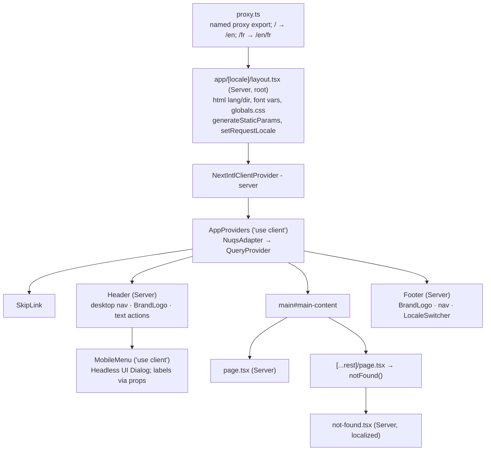
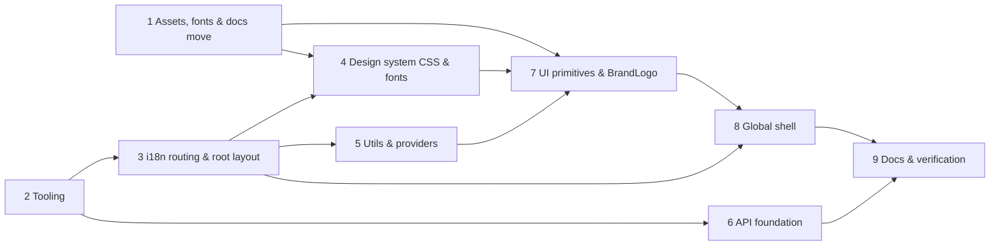

# feat: Moon Fashion storefront foundation

## Overview

Turn the empty `apps/storefront` Next.js shell into a foundation that later pages build on
without inventing architecture or design rules. It covers:

- locale routing for en/ar, with LTR/RTL
- the Moon Fashion design tokens and typography
- a thin provider boundary
- a `fetch`-based API client for the existing Express API
- three UI primitives and a brand logo component
- the global shell: header, mobile menu, footer

The homepage and every commerce surface are out of scope.

## Problem Frame

Today the storefront has `app/layout.tsx` and `app/page.tsx` rendering `Moon Store`, and a
`globals.css` that holds only `@import 'tailwindcss'`. Its dependencies are installed but unused.
The next task builds the homepage visuals. Without a foundation, that task would decide tokens,
locale handling, data access and shell structure ad hoc, page by page.

The visual source of truth is the supplied guideline, which Unit 1 moves to
`docs/design/moon-fashion-website-design-guideline.md`, plus the supplied logo.

## Requirements Trace

Requirement numbers follow the sections of the request.

- R1. Use the installed versions: Next 16.3.5, React 19.3, next-intl 4.14.4, nuqs 2.10, Tailwind 4.3, Headless UI 2.2, motion 13.2. Add no new runtime dependency.
- R2/R3. Follow the target tree, adapted to the installed framework conventions. Keep route files thin and create no empty speculative directories.
- R4. Route `/en` and `/ar`, with the correct `<html lang dir>` per locale. `messages/en.json` and `messages/ar.json` hold shell strings only. Use logical CSS properties.
- R5. Load Bodoni Moda + Manrope (en) and Noto Serif Arabic + IBM Plex Sans Arabic (ar) through `next/font`. Expose them as `--font-display` / `--font-body` and switch automatically by locale.
- R6/R7. Provide the raw `--moon-*` palette and semantic `--color-*` tokens, surfaced as Tailwind v4 utilities through `@theme`. No `tailwind.config.js`.
- R8/R9. Provide a 1440px container, responsive page gutters, section-spacing tokens and 12-column grid support. Radii are 2/4/8/12 (pill for chips), borders are 1px stone-200, and shadows are for overlays only.
- R10. Put `cn()` in `lib/utils/cn.ts`.
- R11. Add an `AppProviders` client boundary with TanStack Query (a client per server request, a singleton in the browser) and the nuqs App Router adapter. Layouts stay Server Components.
- R12. Build `lib/api/{client,endpoints,errors}.ts` on platform `fetch`: configurable base URL, typed errors that match the server contract, opt-in credentials, safe to call from the server. No product endpoints.
- R13. Create only `Button`, `Container` and `EditorialLink`.
- R14. Put the logo in `public/brand/`, keep the original, and render it through `BrandLogo` at its intrinsic aspect ratio. Only lossless operations touch the artwork: transparent-background cleanup, trimming excess canvas, extracting the existing mark. No new compositions.
- R15. Build the shell:
  - Header on desktop: Shop / New In / Collections, then the logo, then Search / Account / Bag. Include a variant hook for the transparent-over-hero state.
  - Header on mobile: Menu / Logo / Search / Bag. The menu is a Headless UI dialog holding the primary links, Account and language.
  - A restrained footer.
- R16. Define motion tokens in CSS, with global reduced-motion handling and no elaborate animation.
- R17. Lay the WCAG 2.2 AA foundation: focus-visible styles, landmarks, 44×44 icon targets, labelled icon buttons, a skip link, `aria-current`, and contrast rules for gold.
- R18. Order `globals.css` as import → tokens → base → typography → layout → a11y → reduced motion.
- R19. Keep a temporary `/[locale]` page that only verifies the system.
- R20. Document in `.env.example` only the variables the foundation reads.
- R21/R22. Use Server Components by default. `"use client"` goes only on the providers, the mobile menu, and the locale switcher if it needs the current pathname (an allowed exception, 2026-09-13).
- R23. Share nothing with the dashboard.
- R24/R25. Run typecheck, lint, the production build and the `/en` + `/ar` smoke checks. The final report follows the structure the request specifies (Architecture, Design system, Infrastructure, Components, Verification, Deferred intentionally).

## Scope Boundaries

- Not built: real homepage, product listing, collections, product detail, cart, checkout, auth, account, search results, wishlist, order history, payments, or any backend product integration.
- No header scroll-transition logic. Only the variant seam it will use is added.
- No `features/*`, `hooks/` or `types/` directories until a real unit of code needs one. The slice shape is documented instead (see Key Technical Decisions).
- No change to `apps/dashboard` or `apps/server` behaviour, and no shared UI or theme package.
- No storefront CI job in this task (see Deferred).
- No `Card`, `Badge`, `Modal`, `Tabs`, `Accordion`, `Carousel`, `ProductCard` or form controls. No button-as-link helper.
- No JS mirror of motion tokens. The first `motion` component adds one if it needs it.

### Deferred to Separate Tasks

- Homepage visual implementation: the next task. A light or ink logo tone for the `overlay` header over dark heroes is also decided there.
- Horizontal logo lockup: if the header genuinely needs one, it is designed and approved as a separate brand task. This task creates no generated or composed logo artwork.
- A storefront job in `.github/workflows/ci.yml`: a follow-up, once there is behaviour worth gating.
- Adding the storefront origin to the server's `ALLOWED_ORIGINS`: needed only when the browser first calls the API. Server-side `fetch` sends no `Origin` and is unaffected.
- Button loading state: added by the first commerce action that needs it.

## Context & Research

### Relevant Code and Patterns

- `apps/storefront/AGENTS.md` says to read the version-matched docs in `node_modules/next/dist/docs/` before coding. Consulted: `01-app/02-guides/upgrading/version-16.md`, `01-app/02-guides/internationalization.md`, `01-app/02-guides/environment-variables.md`, `01-app/03-api-reference/02-components/font.md`, `01-app/03-api-reference/03-file-conventions/not-found.md`, `01-app/03-api-reference/05-config/03-eslint.md`.
- Next 16 facts that shape the plan:
  - `middleware` is renamed to `proxy` (`proxy.ts`, Node runtime, named `proxy` export).
  - `next lint` is removed and `next build` no longer lints.
  - `params` are async only, and `PageProps`/`LayoutProps` come from `next typegen`.
  - `NEXT_PUBLIC_*` values are inlined at `next build` in server code as well as client code.
  - A segment `not-found.tsx` only catches `notFound()` calls; unmatched URLs need a root-level or catch-all route.
- next-intl 4.14.4 exports:
  - `./routing`: `defineRouting`
  - `./navigation`: `createNavigation`
  - `./server`: `getRequestConfig`, `getTranslations`, `setRequestLocale`
  - `./middleware`: default export
  - `./plugin`: `createNextIntlPlugin`
  - a server-side `NextIntlClientProvider`
  - `hasLocale(locales, candidate)` from the `next-intl` root, re-exported from `use-intl/core`
- nuqs 2.10 exports `NuqsAdapter` from `nuqs/adapters/next/app`.
- `next/font/google` in 16.3.5:
  - Bodoni Moda: variable (wght 400–900, opsz axis).
  - Manrope: variable (wght 200–800).
  - IBM Plex Sans Arabic: static only (100–700), has `arabic` and `latin` subsets.
  - **Noto Serif Arabic: absent**, so it must be self-hosted.
- `tailwind-merge` 3.x, installed and run by a reviewer: `twMerge('text-text text-h1')` returns `'text-h1'` and drops the colour. It does not deduplicate custom `ease-*` or `duration-*`. It handles `rounded-*` and `font-*` correctly. The plan avoids the conflict by naming typography utilities `type-*` rather than configuring merge groups.
- Tailwind 4.3 default radii are xs=2, sm=4, **md=6, lg=8**. The guideline's 8/12 need `--radius-md`/`--radius-lg` overrides.
- Root `.gitignore` ignores `*.png`, with a single `!apps/dashboard/public/*.png` exception (#53). It ignores `.env` but **not** `.env.local`.
- `apps/dashboard/src/shared/lib/apiBase.ts`: a production build must never silently fall back to `localhost`. In the browser it logs and degrades rather than throwing.
- `apps/dashboard/src/shared/lib/transport/http.ts`: the success envelope `{ success, data, meta }` is unwrapped to `data`/`meta`.
- `apps/server/src/http/errors.ts`: error bodies are `{ error: { code, message, details? } }`. The code is one of `VALIDATION_ERROR | UNAUTHORIZED | FORBIDDEN | NOT_FOUND | CONFLICT | RATE_LIMITED | INTERNAL_ERROR`, and each `details[]` entry is `{ field, code, message, meta? }`.
- `apps/server/index.ts`: CORS uses the `ALLOWED_ORIGINS` allow-list and supports credentials.
- `apps/server/src/router.ts`: every route sits under `/api/v1`.
- `apps/dashboard/eslint.config.mjs`: flat config, anchored with `import.meta.dirname` because lint-staged runs from the repo root.

### Institutional Learnings

- Root `CLAUDE.md` (2026-09-13): under pnpm, a config that reaches into a package path must point at a **direct** dependency. Tailwind v4 source detection needs no `node_modules` content globs, so add no `@source` into `node_modules`.
- Root `CLAUDE.md` (2026-09-13): the storefront keeps its own direct `@types/react@19`. Add no `paths` hacks here.
- `.gitignore` #53: shipped image assets need an explicit un-ignore, or they silently never reach git.
- Test the boundary, not only the unit (the Zod-stripping lesson). API client tests go through a real `Response` object.

### External References

- None fetched. The version-matched Next docs ship in `node_modules/next/dist/docs/`. next-intl, nuqs, Headless UI, tailwind-merge and the font data were confirmed from installed packages.

## Key Technical Decisions

- **`app/[locale]/layout.tsx` is the root layout. `app/layout.tsx` and `app/page.tsx` are removed.** The root layout owns `<html>`, and `lang`/`dir` must come from the locale segment. `proxy.ts` redirects `/` to the negotiated locale.
- **Unmatched localized paths go through a catch-all.** `app/[locale]/[...rest]/page.tsx` calls `notFound()`, so `/en/shop` renders `app/[locale]/not-found.tsx` inside the locale layout with the full shell and correct `lang`/`dir`. With `localePrefix: 'always'`, an unknown first segment such as `/fr` is redirected by the proxy to `/en/fr`, which then 404s through the same catch-all. The layout's `hasLocale` guard stays as defence in depth.
- **Locale config lives in `i18n/routing.ts`:** `defineRouting` with `locales: ['en','ar']`, `defaultLocale: 'en'` and `localePrefix: 'always'`, plus a direction map (`ar → rtl`). This one source feeds the proxy, the layout, navigation and `generateStaticParams`.
- **For this foundation task, `/en` and `/ar` should remain static.** The layout uses `generateStaticParams` and `setRequestLocale`, and so does the page. `not-found.tsx` takes no props, so it reads the locale that `setRequestLocale` set in the enclosing layout through `getTranslations`. The build output confirms that `[locale]` did not turn dynamic. This verifies the foundation and is not a permanent architectural rule: later data features choose caching, revalidation or dynamic rendering on their own merits.
- **`proxy.ts` uses a named `proxy` export** wrapping next-intl's middleware handler. Its matcher follows the next-intl recommendation: skip `_next`, `_vercel` and any path containing a dot. A future route segment containing a dot would bypass locale handling; that caveat is recorded in the storefront contract.
- **Localized navigation comes from `i18n/navigation.ts`** (`createNavigation`). Shell links use its `Link`, so the locale prefix is never built by hand.
- **Fonts live in `app/fonts.ts`.**
  - Three families come from `next/font/google`: Bodoni Moda (variable, latin), Manrope (variable, latin) and IBM Plex Sans Arabic (static, weights `400` and `500`, `arabic` + `latin` subsets).
  - **Noto Serif Arabic is self-hosted with `next/font/local`** from committed `woff2` files in `app/fonts/noto-serif-arabic/` (user decision, 2026-09-13). The Google data does not include it.
  - All faces use `display: 'swap'`.
  - Each instance exposes a family-specific variable: `--font-bodoni`, `--font-manrope`, `--font-plex-arabic`, `--font-noto-serif-arabic`.
- **Locale font switch through indirection names, never the theme names.** `:root` defines `--font-display-active: var(--font-bodoni)` and `--font-body-active: var(--font-manrope)`. `:lang(ar)` overrides both to the Arabic variables. `@theme inline` declares `--font-display: var(--font-display-active)` and `--font-body: var(--font-body-active)`. Reusing `--font-display` at any other layer would be self-referential or bypassed by `inline`. The Arabic body face loads the `latin` subset, so brand text and numerals on `/ar` don't fall back to system fonts.
- **Tailwind v4 is configured through CSS `@theme`, with no JS config.**
  - Raw `--moon-*` values and the guideline §19 names (`--container-max`, `--motion-fast/base/slow`, `--ease-ui`, `--ease-editorial`, `--radius-xs…lg`, `--radius-pill`) are declared verbatim in `:root`.
  - `@theme inline` maps the utilities to them: `bg-bg`, `bg-surface`, `bg-surface-soft`, `text-text`, `text-text-secondary`, `text-brand-dark`, `border-border`, `bg-action`/`text-on-action`, `bg-scrim`, `font-display`, `font-body`, `rounded-xs/sm/md/lg/pill` (md/lg overridden to 8/12), `ease-ui`, `ease-editorial`, `duration-fast/base/slow`.
  - **Tailwind's default palette stays available** (`text-white`, `bg-black`, and so on). The semantic Moon utilities (`bg-bg`, `bg-surface`, `text-text`, `text-text-secondary`, `text-brand-dark`, `border-border`) are the preferred API. The guideline and the storefront contract enforce brand discipline; no utilities are removed to force it (user decision, 2026-09-13). Default spacing stays, because the guideline's scale (4…160) is a subset of Tailwind's 4px scale.
- **Layout tokens are CSS variables overridden by media query.** `--page-gutter` is 20 / 32 / 48 / 64px at <768 / 768 / 1024 / 1440. `--section-space` is 80 / 112 / 144px at mobile / tablet / desktop, within the guideline ranges.
  - `Container` consumes both. There is no separate container utility.
  - A `section-y` `@utility` applies the section spacing.
  - `grid-editorial` is a `@utility`: 12 columns from 1024px up, 4 columns below, with a token gap.
- **Typography is exposed as composite `type-*` utilities, not `text-*` (user decision, 2026-09-13).** They cover guideline §5: `type-display-xl`, `type-display`, `type-h1…h4`, `type-body-lg`, `type-body`, `type-small`, `type-caption`, `type-label`.
  - Each sets family, `clamp()` size, line-height and tracking. Display and heading steps use `font-display`; the rest use `font-body`.
  - Colour stays a separate `text-*` utility, so `type-h1 text-text` needs no `tailwind-merge` configuration.
  - `type-label` is small uppercase at `0.08em` tracking, reset to normal case and `0` tracking under `:lang(ar)`. Header and footer nav use `type-label`.
- **One `--shadow-overlay` token**, used only by the mobile menu surface.
- **Focus ring is driven by `--focus-ring-color`**, default ink with a 2px outline and 3px offset. It switches to ivory inside `[data-surface="ink"]` and `[data-variant="overlay"]`.
- **Providers.**
  - `providers/app-providers.tsx` (`"use client"`) composes `NuqsAdapter` → `QueryProvider`.
  - `providers/query-provider.tsx` calls `getQueryClient()` directly in render, following TanStack's Next.js App Router guidance.
  - `lib/query/get-query-client.ts` uses TanStack's `isServer`: a new client per server render, a module singleton in the browser. `staleTime` is 60s. No persisters, no devtools.
  - `NextIntlClientProvider` stays in the server layout, outside `AppProviders`.
- **Client islands receive strings, not the message catalogue.** The server header translates labels and passes them to `MobileMenu` as props.
- **API client shape (directional).**
  - `apiFetch<T>(path, options)` resolves `path` against the base URL plus `/api/v1` and sends/parses JSON.
  - It unwraps `{ success, data, meta }` into `{ data, meta }`, and throws `ApiError` otherwise.
  - `ApiError` carries `status`, `code` (the server's union plus `NETWORK_ERROR` and `INVALID_RESPONSE`), `message`, `details` and `cause`.
  - `credentials` defaults to `'omit'` so public catalogue reads stay cacheable; authenticated calls opt into `'include'`.
  - Standard `RequestInit` fields (`headers`, `signal`, `cache`, `next`) pass through with no dedicated abstraction.
  - Only plain-object JSON bodies are supported. There is no upload handling.
  - `endpoints.ts` holds the prefix and an empty path registry, with a comment stating the DTO rule: storefront types model API DTOs, never server repository or database types.
- **Base URL uses split variables (user decision, 2026-09-13).**
  - `API_URL`, server-only, is read **at runtime** by server code, so one build can be promoted across environments.
  - `NEXT_PUBLIC_API_URL` is used only by browser code and is inlined at build.
  - The resolver picks by `typeof window`. In development both fall back to `http://localhost:3001`.
  - **Server** in production with `API_URL` unset: throws on use, naming `API_URL`.
  - **Browser** in production with `NEXT_PUBLIC_API_URL` unset: logs a console error naming the variable and falls back to same-origin, mirroring `apps/dashboard/src/shared/lib/apiBase.ts`. Throwing there would take the page down.
  - Nothing calls the API yet, so neither path runs during `next build` in this task. The first statically rendered data fetch must have `API_URL` set in the build environment, and the contract doc says so.
- **Logo: preserve the supplied artwork, lossless operations only (user decision, 2026-09-13).**
  - The untouched original moves to `docs/design/brand/moon-fashion-logo-original.png`.
  - Allowed operations: transparent-background cleanup, trimming excess canvas, and extracting the existing mark by crop. They use deterministic image operations, not a generative model. No redraw, recolour, re-layout or new composition.
  - Outputs in `public/brand/`:
    - `moon-fashion-logo.png`: the full stacked lockup, background removed and canvas trimmed. Used in the desktop header, the footer and the mobile menu top bar.
    - `moon-fashion-mark.png`: the crescent, figure and star, extracted by crop only if the crop cuts no artwork. Used in the mobile header. If it cannot be extracted cleanly, the mobile header uses the full lockup instead.
  - The desktop header shows the stacked lockup at a stated height: 56px in the 80px header. A horizontal lockup, if ever needed, is a separate designed and approved brand task.
  - `lib/brand/logo-assets.ts` records each file's path and intrinsic dimensions. `BrandLogo` takes `variant` and target `height` and derives width from the ratio. Swapping a file needs no component change.
- **Nav targets link to their planned localized paths** (`/shop`, `/new-in`, `/collections`, `/search`, `/account`, `/bag`) through one `components/layout/navigation-items.ts`. They land on the localized not-found page through the catch-all. Links show `aria-current="page"` when their path matches.
- **Nav link state set, applied to header, footer and menu links.**
  - Rest: `text` colour.
  - Hover and focus-visible: a 1px `brand` underline grows from the inline start over `duration-fast ease-ui`.
  - Current page: `aria-current="page"` plus a persistent 1px `brand` hairline underline.
  - Focus: the global ring.
  - This is where the shell uses gold, per guideline §3.2: fine rules and active indicators, never text.
- **Header variant seam, no scroll logic.** `Header` accepts `variant: 'solid' | 'overlay'` and exposes it as `data-variant`. Both styles live in CSS, but only `solid` renders now. Recolouring the logo for an overlay over dark heroes is deferred.
- **Motion is CSS only in this task.** Tokens live in CSS, and `motion` is not imported anywhere. Reduced motion collapses transition and animation durations globally and disables `scroll-behavior: smooth`.
- **Feature slice convention is documented, not scaffolded.** `apps/storefront/CLAUDE.md` defines `features/<slice>/{api,components,schemas,types,utils}` and the rule that `app/` composes while features implement.
- **Tooling additions are dev-only.**
  - `eslint-config-next` (user decision): native flat exports `eslint-config-next/core-web-vitals` and `eslint-config-next/typescript`, no FlatCompat.
  - `vitest` (user decision, 2026-09-13): limited to the API client contract tests and translation-key parity. CSS helpers and provider plumbing are exercised by typecheck, lint, build and the HTTP checks, not by unit tests. The primary gates stay typecheck, lint, production build and the `/en` + `/ar` HTTP checks.
  - No React Testing Library.
- **Root edits approved (2026-09-13):** a lint-staged entry for the storefront, and root `CLAUDE.md` updates.
- **`@/*` path alias** in `tsconfig.json`, rooted at the app directory.

## Open Questions

### Resolved During Planning

- Where are the guideline and logo? In `apps/storefront/public/`. The guideline moves to `docs/design/` so it is not publicly served.
- May the logo be altered? Only losslessly: background cleanup, canvas trim, mark extraction. There is no horizontal lockup in this task.
- How do we lint with no ESLint setup and no `next lint`? Add `eslint-config-next` with native flat exports and a `lint` script.
- Middleware or proxy? `proxy.ts` with a named `proxy` export.
- Where does the root layout go? `app/[locale]/layout.tsx`, plus a `[...rest]` catch-all for localized 404s.
- Where does `hasLocale` come from? `next-intl` root, called as `hasLocale(routing.locales, locale)`.
- Noto Serif Arabic isn't in `next/font/google`. Self-host it with `next/font/local`.
- What are the font weights? Bodoni Moda and Manrope are variable. IBM Plex Sans Arabic needs explicit `400`/`500`.
- Are PNGs git-ignored? Yes, `*.png` at root. Unit 1 adds explicit un-ignores.
- Is `NEXT_PUBLIC_*` build-time on the server too? Yes, so the split `API_URL` / `NEXT_PUBLIC_API_URL` applies.
- Does `tailwind-merge` need config? No. Typography uses `type-*` names, so `cn` is plain `twMerge(clsx(...))`.
- Keep vitest? Yes, for the API contract tests and translation-key parity only.
- Clear Tailwind's default palette? No. Semantic utilities are preferred, and the defaults stay.
- What is in the mobile menu? Primary links, then Account and the language switcher.
- Desktop actions? Text only. Mobile actions are icons with `aria-label`.

### Deferred to Implementation

- Whether `next/font` emits preload links for the inactive locale's faces when all four are declared in one module. Verify in build HTML. If it does, set `preload: false` on the non-critical pair or split the modules per locale.
- The Noto Serif Arabic source: download the static `woff2` files from Google Fonts or the notofonts release, and check the licence (OFL) is committed beside them. Choose the weights actually used, likely `400` and `600`.
- Whether `LocaleSwitcher` can stay a server component linking to the same path, or needs next-intl `usePathname` as a client leaf. The client leaf is the allowed exception under R21/R22.
- Whether background removal is clean on the off-white ground with soft gold edges, leaving no halo on ivory. If it is not, stop at trimming and ask for a designer-supplied transparent export rather than approximating. Flag either outcome in the final report.

## High-Level Technical Design

These sketches are directional. They show the intended shape, not code to copy.

**Render tree and client boundaries**



Server Components passed as `children` into the client `AppProviders` stay Server Components. Client code is limited to `AppProviders`, `QueryProvider`, `MobileMenu`, and `LocaleSwitcher` only if it needs the pathname.

**Token layering in `globals.css`**

```text
@import 'tailwindcss'
:root            --moon-* palette · --container-max · --page-gutter · --section-space
                 --motion-fast/base/slow · --ease-ui/-editorial · --radius-xs…lg,pill
                 --shadow-overlay · --focus-ring-color
                 --font-display-active: var(--font-bodoni) · --font-body-active: var(--font-manrope)
:lang(ar)        --font-display-active: var(--font-noto-serif-arabic) · --font-body-active: var(--font-plex-arabic)
@theme inline    --color-bg … --color-on-action, --color-scrim (default palette kept)
                 --font-display: var(--font-display-active); --font-body: var(--font-body-active)
                 --radius-md: 8px; --radius-lg: 12px; ease; durations → var(--motion-*)
@layer base      body bg/text/font; logical-property resets; headings font-display
typography       @utility type-display-xl … type-caption (family + clamp size + leading) · type-label (uppercase; ar: none)
layout           @utility section-y · grid-editorial
a11y             :focus-visible ring via --focus-ring-color; [data-surface=ink],[data-variant=overlay] override; .skip-link
reduced motion   @media (prefers-reduced-motion: reduce) { durations → 0.01ms; scroll-behavior: auto }
```

**API call flow**

```text
caller → apiFetch(path, opts)
  base = isServer ? API_URL (runtime; prod unset → throw naming API_URL)
                  : NEXT_PUBLIC_API_URL (build-inlined; prod unset → console.error + '')
  dev fallback for both: http://localhost:3001
  url = base + '/api/v1' + path
  fetch(url, { method, headers: JSON + opts.headers, body: JSON, credentials: opts.credentials ?? 'omit', signal, cache, next })
    network throw           → ApiError(0, 'NETWORK_ERROR', cause)
    204                     → { data: undefined }
    non-JSON body           → ApiError(status, 'INVALID_RESPONSE')
    !ok + { error:{…} }     → ApiError(status, error.code, error.message, error.details)
    !ok + other JSON        → ApiError(status, 'INVALID_RESPONSE')
    ok + no data field      → ApiError(status, 'INVALID_RESPONSE')
    ok + { data, meta }     → { data, meta }
```

**Unit dependencies**



## Implementation Units

- [x] **Unit 1: Brand assets, Arabic display font files and guideline relocation**

**Goal:** Put the guideline somewhere versioned but not publicly served. Keep the original logo. Produce lossless logo derivatives the shell can use. Commit the self-hosted Arabic display font. Make sure all of it actually reaches git.

**Requirements:** R14, R5 (plus the Problem Frame's source-of-truth location)

**Dependencies:** None

**Files:**
- Move: `apps/storefront/public/moon-fashion-website-design-guideline.md` → `docs/design/moon-fashion-website-design-guideline.md`
- Move: `apps/storefront/public/ChatGPT Image Sep 13, 2026, 08_26_28 AM.png` → `docs/design/brand/moon-fashion-logo-original.png`
- Create: `apps/storefront/public/brand/moon-fashion-logo.png`, `apps/storefront/public/brand/moon-fashion-mark.png` (the mark only if extraction is clean)
- Create: `apps/storefront/app/fonts/noto-serif-arabic/*.woff2` (+ `OFL.txt`)
- Create: `apps/storefront/lib/brand/logo-assets.ts`
- Modify: `.gitignore` (add `!apps/storefront/public/brand/*.png` and `!docs/design/brand/*.png` after the `*.png` rule, with a #53-style comment)

**Approach:**
- Lossless operations only, using deterministic tooling (no generative model):
  - Remove the flat background to transparency, with no halo on ivory `#FAF8F4`.
  - Trim excess canvas to the artwork's bounds.
  - Extract the mark by cropping above the wordmark, only if the crop cuts no artwork.
  - Colour, geometry and layout stay unchanged. No new compositions.
- Target render heights: full lockup 56px in the desktop header and 96–120px in the footer; mark 40px. Record legibility at each height in the final report.
- Record each file's path and intrinsic pixel width and height in `logo-assets.ts`. It is the only place dimensions live.
- If background removal or mark extraction cannot be done cleanly, stop, keep only what is lossless, and flag it for a designer-supplied export.

**Patterns to follow:** `.gitignore` #53 comment; guideline §3.2 and §8.

**Test scenarios:**
- Test expectation: none. These are static assets and a constant map. `git check-ignore` returning nothing for the new files is the check.

**Verification:**
- `public/` holds no guideline and no ChatGPT-named file.
- The original is byte-identical in `docs/design/brand/`.
- `git status` lists all PNGs and `woff2` files as untracked, not ignored.
- Dimensions recorded in `logo-assets.ts` match the files.
- Pixel colours inside the artwork match the original (spot-checked). No horizontal lockup or other composed asset exists.

- [x] **Unit 2: Storefront tooling (lint, test, alias, env)**

**Goal:** Make lint, unit tests and typecheck runnable in the storefront before any code lands.

**Requirements:** R1, R20, R24

**Dependencies:** None

**Files:**
- Modify: `apps/storefront/package.json` (devDeps `eslint-config-next`, `vitest`; scripts `lint`, `test`)
- Create: `apps/storefront/eslint.config.mjs`
- Create: `apps/storefront/vitest.config.ts`
- Modify: `apps/storefront/tsconfig.json` (`paths` `@/*`)
- Create: `apps/storefront/.env.example`
- Modify: `.gitignore` (add `.env*.local`)
- Modify: `package.json` (root `lint-staged` entry for `apps/storefront/**/*.{ts,tsx}`)
- Modify: `pnpm-lock.yaml`

**Approach:**
- The flat config spreads `eslint-config-next/core-web-vitals` and `eslint-config-next/typescript`, and ignores `.next/` and `next-env.d.ts`. Anchor paths with `import.meta.dirname`, because lint-staged runs from the repo root.
- Vitest runs in the `node` environment, resolves `@/*`, and picks up only `*.test.ts`.
- `.env.example` has two entries, each with a one-line comment:
  - `API_URL=http://localhost:3001` (server-only, read at runtime)
  - `NEXT_PUBLIC_API_URL=http://localhost:3001` (browser, inlined at build)

**Patterns to follow:** `apps/dashboard/eslint.config.mjs` (root-cwd anchoring), root `lint-staged` entries.

**Test scenarios:**
- Test expectation: none. This is configuration, proven by Unit 9's lint, test and typecheck runs.

**Verification:**
- `lint`, `test` and `typecheck` run in the storefront.
- A root-cwd ESLint call with `--config apps/storefront/eslint.config.mjs` resolves.
- `git check-ignore apps/storefront/.env.local` matches.

- [x] **Unit 3: Locale routing and root layout**

**Goal:** `/en` and `/ar` render through a locale root layout with correct `lang`/`dir`. `/` redirects to a locale. Unknown localized paths render the localized not-found page.

**Requirements:** R2, R3, R4, R19, R21

**Dependencies:** Unit 2

**Files:**
- Create: `apps/storefront/i18n/routing.ts` (locales, default, prefix, `getDirection`)
- Create: `apps/storefront/i18n/request.ts` (`getRequestConfig` loading `messages/<locale>.json`)
- Create: `apps/storefront/i18n/navigation.ts` (`createNavigation(routing)`)
- Create: `apps/storefront/proxy.ts` (named `proxy` export wrapping next-intl middleware; next-intl recommended matcher)
- Modify: `apps/storefront/next.config.ts` (wrap with `createNextIntlPlugin('./i18n/request.ts')`)
- Create: `apps/storefront/messages/en.json`, `apps/storefront/messages/ar.json`
- Create: `apps/storefront/app/[locale]/layout.tsx`, `apps/storefront/app/[locale]/page.tsx`, `apps/storefront/app/[locale]/not-found.tsx`, `apps/storefront/app/[locale]/[...rest]/page.tsx`
- Delete: `apps/storefront/app/layout.tsx`, `apps/storefront/app/page.tsx`
- Keep: `apps/storefront/app/globals.css` (imported from the locale layout; modified in Unit 4)
- Test: `apps/storefront/messages/messages.test.ts`

**Approach:**
- **Layout:**
  - Await `params` and validate with `hasLocale(routing.locales, locale)`, calling `notFound()` on failure.
  - Call `setRequestLocale`, then render `<html lang={locale} dir={getDirection(locale)}>`.
  - `generateMetadata` provides a localized title template (`%s · Moon Fashion`).
- **Catch-all** `[...rest]/page.tsx` does nothing but call `notFound()`.
- **Messages** hold shell strings only:
  - `metadata`: site title and description
  - `navigation`: shop, newIn, collections, search, account, bag, menu, closeMenu, primaryLabel, footerLabel
  - `common`: skipToContent, languageLabel, english, arabic
  - `footer`: rights line
  - `foundation`: the temporary page's two lines
  - `notFound`: title, body, backHome
  - Arabic is a real translation, for example تسوّق، وصل حديثًا، المجموعات، بحث، الحساب، الحقيبة، الصفحة غير موجودة.
  - No invented contact data.
- **Not-found page:**
  - A `type-display` heading.
  - One line in `text-secondary`.
  - An `EditorialLink` back to the localized home, once Unit 7 exists.
  - Laid out inside `Container` with `section-y`.
- **Temporary page:** `Moon Fashion` in `type-display` and `Storefront foundation ready.` in secondary text, inside `Container` once Unit 7 exists.

**Patterns to follow:** `node_modules/next/dist/docs/01-app/02-guides/internationalization.md`, `.../03-file-conventions/not-found.md`.

**Test scenarios:**
- Unit (vitest): `en.json` and `ar.json` have identical nested key sets, and no value is an empty string.
- Integration (build/HTTP, Unit 9):
  - `/en` has `lang="en" dir="ltr"`.
  - `/ar` has `lang="ar" dir="rtl"`.
  - `/` redirects to a locale.
  - `/en/shop` returns 404 with `lang="en"` and the localized not-found content.
  - `/fr` redirects to `/en/fr`, which returns 404.

**Verification:**
- For this foundation task, both locales prerender as static.
- No `MISSING_MESSAGE` warnings.
- The catch-all does not make `/en` and `/ar` dynamic.

- [x] **Unit 4: Design system CSS and fonts**

**Goal:** Put tokens, typography, layout utilities, a11y and reduced-motion rules into one ordered `globals.css`, and load locale-correct fonts with no layout shift.

**Requirements:** R5, R6, R7, R8, R9, R16, R17, R18, R22

**Dependencies:** Units 1, 3

**Files:**
- Modify: `apps/storefront/app/globals.css`
- Create: `apps/storefront/app/fonts.ts`
- Modify: `apps/storefront/app/[locale]/layout.tsx` (apply the active locale's font variable classes to `<html>`)

**Approach:**
- Follow the token layering in the High-Level Technical Design. All values come from guideline §4, §5, §6, §7 and §19.
- **Semantic mapping:**
  - bg → ivory, surface → white, surface-soft → cream
  - text → ink, text-secondary → stone-600
  - brand → gold, brand-dark → gold-dark, brand-soft → gold-soft
  - border → stone-200
  - action → ink, action-hover → charcoal, on-action → white
  - scrim → ink at 40%
  - Components never reference `--moon-*` directly.
- **Typography:** `type-*` utilities use `clamp()` sizes spanning the mobile and desktop ranges in §5. Headings are tight (line-height about 1.05–1.15) and body text uses 1.6. Under `:lang(ar)`, line-height goes up, and `type-label` drops uppercase and tracking. No `text-<size>` names are added.
- **Base:** `body` uses `bg-bg text-text font-body` with antialiasing. Resets use logical properties only.
- **A11y:**
  - `:focus-visible` is a 2px outline in `var(--focus-ring-color)` with a 3px offset.
  - The ring switches to ivory in `[data-surface="ink"]` and `[data-variant="overlay"]`.
  - `.skip-link` is visually hidden until focus. On focus it sits at `inset-block-start` and `inset-inline-start` 16px, with ink background, white Manrope text and `rounded-sm`, above the header.
- **Reduced motion:** transition and animation durations collapse to `0.01ms`, and `scroll-behavior` is `auto`.
- **Fonts:** as in Key Technical Decisions. Only the active locale's two variable classes go on `<html>`.

**Patterns to follow:** guideline §19 names verbatim; `node_modules/next/dist/docs/01-app/03-api-reference/02-components/font.md` (`next/font/google`, `next/font/local`, `variable`, `display`, `subsets`).

**Test scenarios:**
- Test expectation: none for CSS. Contrast is a design-time check recorded under Verification, and rendering is checked in Unit 9.

**Verification:**
- Contrast is computed once and recorded in the final report:
  - ink on ivory
  - stone-600 on ivory (≥4.5:1)
  - gold-dark on ivory (≥4.5:1)
  - white on ink
  - the ink focus ring on ivory and white (≥3:1)
- Gold `#B79564` is never used for text.
- Semantic utilities (`bg-bg`, `text-text`, `border-border`) generate CSS, and default utilities such as `text-white` still work.
- `rounded-md` resolves to 8px and `rounded-lg` to 12px.
- `/ar` build HTML applies the Arabic font variables, and its Arabic text is not rendered in Bodoni.

- [x] **Unit 5: Utilities and providers**

**Goal:** Add `cn()` and a minimal client provider boundary with TanStack Query and nuqs.

**Requirements:** R10, R11, R21, R22

**Dependencies:** Units 2, 3

**Files:**
- Create: `apps/storefront/lib/utils/cn.ts`
- Create: `apps/storefront/lib/query/get-query-client.ts`
- Create: `apps/storefront/providers/query-provider.tsx`
- Create: `apps/storefront/providers/app-providers.tsx`
- Modify: `apps/storefront/app/[locale]/layout.tsx` (wrap body content in `AppProviders` inside `NextIntlClientProvider`)

**Approach:**
- `cn` is `twMerge(clsx(...))` with no merge configuration. The `type-*` naming keeps typography out of the `text-*` groups.
- `getQueryClient` returns a new client when `isServer`, and a module singleton otherwise. `staleTime` is 60000. `QueryProvider` calls it directly in render.
- `AppProviders` receives `children` only.

**Test scenarios:**
- Test expectation: none. This is plumbing; typecheck, the production build and the HTTP checks exercise it. The `isServer` split follows TanStack's documented pattern verbatim.

**Verification:**
- The build treats the locale layout and page as Server Components.

- [x] **Unit 6: API foundation**

**Goal:** Build a typed, `fetch`-based client for the Express API that later features call from Server Components or queries.

**Requirements:** R12, R20, R23

**Dependencies:** Unit 2

**Files:**
- Create: `apps/storefront/lib/api/errors.ts`
- Create: `apps/storefront/lib/api/endpoints.ts`
- Create: `apps/storefront/lib/api/client.ts`
- Test: `apps/storefront/lib/api/client.test.ts`, `apps/storefront/lib/api/errors.test.ts`

**Approach:**
- Follow the call flow in the High-Level Technical Design.
- `errors.ts` defines:
  - the `ApiError` class
  - the `ApiErrorCode` union: server codes plus `NETWORK_ERROR` and `INVALID_RESPONSE`, typed as a string fallback so a new server code is not rejected
  - the `isApiError` guard
  - The server union is duplicated with a comment pointing to `apps/server/src/http/errors.ts`, not imported.
- `endpoints.ts` holds `API_PREFIX = '/api/v1'` and an empty `endpoints` object with the DTO rule in a comment.
- `client.ts` includes `resolveApiBaseUrl()`, which picks the environment by `isServer`, trims trailing slashes and applies the dev fallback. `apiFetch` JSON-serialises plain-object bodies and forwards `RequestInit` passthrough fields.

**Execution note:** Implement test-first. The envelope and error mapping are the contract every future feature inherits.

**Patterns to follow:** `apps/dashboard/src/shared/lib/apiBase.ts` (browser degrade), `apps/dashboard/src/shared/lib/transport/http.ts` (envelope unwrap), `apps/server/src/http/errors.ts` (error body).

**Test scenarios:** Stub the global `fetch` to return real `Response` objects.
- Happy path: a 200 `{ success: true, data: { id: 1 }, meta: { total: 1 } }` returns `{ data: { id: 1 }, meta: { total: 1 } }`.
- Happy path (server, dev): a GET goes to `http://localhost:3001/api/v1/ping` with `Accept: application/json`, no body and `credentials: 'omit'`.
- Happy path: a POST with an object body sets `Content-Type: application/json` and sends the JSON string. `credentials: 'include'` is forwarded when requested.
- Happy path (server): with `API_URL=https://api.example.com/` set at call time, a path of `/x` resolves to `https://api.example.com/api/v1/x`, with no double slash.
- Edge case: a 204 returns `{ data: undefined }` and the body is not parsed.
- Error path: a 400 `{ error: { code: 'VALIDATION_ERROR', message: 'Request validation failed', details: [{ field: 'email', code: 'invalid_string', message: '…' }] } }` throws `ApiError` with status 400 and that code, message and details.
- Error path: a 401 `{ error: { code: 'UNAUTHORIZED', … } }` throws with `code === 'UNAUTHORIZED'`.
- Error path: a 502 with an HTML body throws `ApiError` `INVALID_RESPONSE` with status 502.
- Error path: when `fetch` rejects with `TypeError: Failed to fetch`, the client throws `ApiError` `NETWORK_ERROR` with status 0 and the original error as `cause`.
- Error path: a 200 whose JSON has no `data` throws `INVALID_RESPONSE`.
- Error path (server, production): with `API_URL` unset, the call throws an error naming `API_URL`, and `fetch` is never called.
- Edge case (browser, production): with `NEXT_PUBLIC_API_URL` unset, `console.error` names the variable and the request goes to the same-origin `/api/v1/...`.
- Happy path: `isApiError` returns true for a thrown `ApiError` and false for a plain `Error`.

**Verification:**
- Nothing under `apps/storefront` imports from `apps/server` or `apps/dashboard`.

- [x] **Unit 7: UI primitives and BrandLogo**

**Goal:** Build the three primitives and the logo component that the shell and homepage will use.

**Requirements:** R8, R13, R14, R17, R22

**Dependencies:** Units 1, 4, 5

**Files:**
- Create: `apps/storefront/components/ui/button.tsx`
- Create: `apps/storefront/components/ui/container.tsx`
- Create: `apps/storefront/components/ui/editorial-link.tsx`
- Create: `apps/storefront/components/brand/brand-logo.tsx`
- Modify: `apps/storefront/app/[locale]/page.tsx`, `apps/storefront/app/[locale]/not-found.tsx` (use `Container`, `EditorialLink`, tokens)

**Approach:**
- **`Button`** is Server-compatible and uses no hooks. It renders a `<button>`.
  - Props: `variant: 'primary' | 'secondary'`, and an optional `trailingArrow` slot that shifts 4px toward the inline end on hover and focus-visible.
  - Sizing and type: `min-h-12`, `padding-inline` 28px, `rounded-sm`, `font-body` medium.
  - Primary states:
    - Rest: `bg-action text-on-action`.
    - Hover: `action-hover`, over `duration-fast ease-ui`.
    - Active: `action-hover`.
    - Disabled: `stone-400` background with `on-action` text, no hover, `cursor-not-allowed`, native `disabled`.
  - Secondary states:
    - Rest: transparent, 1px `text` border, `text` colour.
    - Hover: `surface-soft` fill.
    - Disabled: `stone-400` border and text.
  - No transforms on the button itself.
  - The focus ring comes from the global rule, and ink buttons carry `data-surface="ink"` so the ring stays visible.
- **`Container`**
  - Props: `as` (`div | section | header | footer | nav`) and `bleed?: boolean`.
  - Default styling: `max-inline-size: var(--container-max)`, `margin-inline: auto`, `padding-inline: var(--page-gutter)`.
  - `bleed` drops the max width and the gutters.
- **`EditorialLink`** wraps the localized `Link`: text plus an `ArrowRight` icon marked `aria-hidden`.
  - The underline is 0% wide at rest. On hover and focus-visible it grows to 100% from the inline start: `background-position` left in LTR, right under `[dir=rtl]`.
  - The arrow shifts 4px toward the inline end, and flips under `[dir=rtl]`.
  - Under reduced motion the underline appears without a transition.
  - Tone: `text` by default, `tone="brand"` uses `brand-dark`.
- **`BrandLogo`** is `next/image` fed from `logo-assets.ts`.
  - Props: `variant: 'logo' | 'mark'`, `height`, `priority`. Width is derived from the aspect ratio.
  - Alt text is `Moon Fashion`.

**Patterns to follow:** guideline §9, §7, §18.

**Test scenarios:**
- Test expectation: none as unit tests, since these are presentational and have no DOM test runner by decision. Covered by typecheck, lint, and the manual checks in Unit 9:
  - focus ring visible on both button variants, including on ink
  - disabled state visible
  - arrow and underline direction in `/ar`
  - logo not stretched

**Verification:**
- The temporary page and not-found page render at all four breakpoints using display type, secondary text and container gutters.
- `BrandLogo`'s rendered ratio matches the asset ratio.

- [x] **Unit 8: Global shell (header, mobile menu, footer)**

**Goal:** Build the first real shell: landmarks, skip link, desktop and mobile navigation, and a restrained footer.

**Requirements:** R15, R17, R21, R22, R4

**Dependencies:** Units 3, 7

**Files:**
- Create: `apps/storefront/components/layout/navigation-items.ts`
- Create: `apps/storefront/components/layout/nav-link.tsx`
- Create: `apps/storefront/components/layout/skip-link.tsx`
- Create: `apps/storefront/components/layout/header/header.tsx`
- Create: `apps/storefront/components/layout/mobile-menu/mobile-menu.tsx`
- Create: `apps/storefront/components/layout/footer/footer.tsx`
- Create: `apps/storefront/components/layout/locale-switcher.tsx`
- Modify: `apps/storefront/app/[locale]/layout.tsx` (SkipLink → Header → `main#main-content` → Footer)

**Approach:**
- **`navigation-items.ts`**
  - `primary`: shop, newIn, collections.
  - `actions`: search, account, bag. Each item has a message key, a localized href, and a lucide icon used on mobile only.
- **`NavLink`** applies the nav state set from Key Technical Decisions and `aria-current`. It is the only nav link style and uses `type-label`.
- **Header** is a Server Component: `<header data-variant>`.
  - Block size 72px on mobile, 80px on desktop.
  - `solid`: `bg-bg` with a bottom `border-border`. `overlay` styles are defined but not used.
  - Desktop (≥1024px) is a three-column grid:
    - start: primary `<nav aria-label={primaryLabel}>`
    - centre: `BrandLogo variant="logo"` at 56px inside a home link
    - end: text-only action `NavLink`s
  - Below 1024px:
    - start: menu trigger (inside `MobileMenu`), 44×44
    - centre: `BrandLogo variant="mark"` (40px) inside a home link, or the full lockup at 48px if the mark could not be extracted
    - end: Search and Bag as 44×44 icon-only links with `aria-label`
    - The start and end columns are equal width so the mark stays centred.
- **`MobileMenu`** is `"use client"`. It receives translated labels and resolved items as props.
  - Container: Headless UI `Dialog`, full-screen, `bg-bg`, `--shadow-overlay`.
  - Top bar mirrors the header: `BrandLogo variant="mark"` and a Close button (44×44, `aria-label`) at the inline end.
  - Body, in order:
    1. The three primary links in `type-h3`, a deliberate editorial exception to §5 recorded in the storefront contract.
    2. A hairline `border-border` divider.
    3. A secondary group: Account `NavLink`, then `LocaleSwitcher`.
  - Links close the menu on click, and focus returns to the trigger.
  - Entry uses Headless UI transition data attributes: opacity plus a 16px translate from the inline start, over `duration-base ease-editorial`. Reduced motion shows it instantly.
- **Footer** is a Server Component: `bg-bg`, top border, `section-y` padding. It contains:
  - `BrandLogo variant="logo"`
  - a `<nav aria-label={footerLabel}>` with the primary `NavLink`s
  - `LocaleSwitcher`
  - `© {year} Moon Fashion`
  - No social, contact, policy or newsletter entries.
- **`LocaleSwitcher`**: the current locale shows as plain text with `aria-current="true"`, and the other locale is a link with its `lang` attribute. Labels are `English` / `العربية`. It links to the same pathname if that can be done on the server; otherwise it is a client leaf using next-intl `usePathname`.
- **`SkipLink`** targets `#main-content`, and `main` has `tabIndex={-1}`.

**Patterns to follow:** guideline §8 and §12; `docs/ACCESSIBILITY.md` vocabulary.

**Test scenarios:**
- Test expectation: no automated DOM tests, by decision. You run these manual scenarios in Unit 9:
  - Keyboard: the skip link comes first and moves focus to `main`, then the header follows DOM order (start nav → logo → actions).
  - Current page: `aria-current` and the gold hairline appear only on the matching link, never on the home logo.
  - Mobile menu below 1024px:
    - The dialog opens with focus inside, and Tab is trapped.
    - Escape closes it and focus returns to the trigger.
    - Account and the language switch are reachable.
    - Choosing a link closes the menu and navigates.
  - RTL (`/ar`):
    - Primary nav on the right, actions on the left, Close at the inline end.
    - The menu slides in from the right.
    - Nav labels are not uppercase-tracked.
  - Screen reader: each icon link announces its translated label, the two `nav` landmarks have distinct names, and the current locale announces as current.
  - Locale switch: `/en` → `/ar` flips `dir`.

**Verification:**
- No horizontal overflow at 320px in either locale.
- Header height stays within 72–84px.
- Client components are only `MobileMenu`, plus `LocaleSwitcher` if it needed the pathname.

- [x] **Unit 9: Documentation and verification**

**Goal:** Record the storefront contract where future agents will load it, run every gate, and hand manual checks to the user.

**Requirements:** R24, R25, R20, R3

**Dependencies:** Units 1–8

**Files:**
- Modify: `apps/storefront/CLAUDE.md`. Keep `@AGENTS.md`, and add a storefront contract covering:
  - guideline location
  - token and utility vocabulary: semantic Moon utilities and `type-*` are the preferred API; default Tailwind utilities remain available, but brand colours come from tokens
  - locale/RTL rules and the dotted-segment matcher caveat
  - the client boundary rule
  - the feature slice shape
  - the API/DTO rule and the `API_URL` vs `NEXT_PUBLIC_API_URL` build/runtime semantics
  - the logo rule (lossless operations only; new compositions are a separate approved brand task) and the asset swap procedure
  - rendering strategy: static is this foundation's state, not a rule
  - the mobile-menu display-type exception
  - that nothing is shared with the dashboard
- Modify: root `CLAUDE.md`:
  - Subsystem contracts gains `apps/storefront/CLAUDE.md`
  - Quick Start gains the storefront `.env.local` note
  - Testing gains the storefront `test` command

**Approach:**
- Run the storefront `typecheck`, `lint`, `test` and `build`.
- Smoke test without driving a browser (a global instruction: the user does browser testing). Start the production server and fetch `/`, `/en`, `/ar`, `/en/shop`, `/fr` and `/brand/moon-fashion-logo.png`. Check the server logs for hydration or missing-message warnings.
- Give the user a short manual checklist:
  - fonts per locale
  - logo quality and legibility at header size
  - the keyboard path
  - the mobile menu
  - focus visibility
  - reduced motion, via the OS toggle
  - no horizontal scroll at 320, 768, 1024 and 1440px
- Write the final report in the requested structure. Include the Unit 4 contrast ratios and the outcome of the lossless logo operations from Unit 1 (clean, or flagged for a designer export).

**Test scenarios:**
- Integration: with no `Accept-Language`, `/` redirects (307/308) to `/en`. With `Accept-Language: ar` it redirects to `/ar`.
- Integration: `/en` returns 200 with `<html lang="en" dir="ltr">`, and `/ar` returns 200 with `<html lang="ar" dir="rtl">`.
- Integration: `/en/shop` returns 404 with `lang="en"` and the localized not-found heading.
- Integration: `/fr` redirects to `/en/fr`, which returns 404.
- Integration: `/brand/moon-fashion-logo.png` returns 200 `image/png` with no locale redirect.
- Integration: for this foundation task, build output lists `/en` and `/ar` as statically prerendered.

**Verification:**
- All four scripts exit 0, and the HTTP smoke assertions hold.
- Done means the brief's gates plus the smoke checks. The manual checklist is a handoff to the user, not a blocker. Its results feed follow-up fixes.

## System-Wide Impact

- **Interaction graph:** `proxy.ts` now fronts every storefront request. Its matcher skips `_next`, `_vercel` and dotted paths, so assets are never locale-redirected. No effect on dashboard or server processes.
- **Error propagation:** API errors reach callers as `ApiError`. Nothing calls the API in this task.
- **State lifecycle risks:** a shared server-side `QueryClient` would leak one visitor's data into another's request. The `isServer` split is tested.
- **API surface parity:** the storefront duplicates the server's error-code union as a type with a string fallback, so a new server code does not break anything.
- **Integration coverage:** locale redirect, `lang`/`dir`, the catch-all 404 and static prerender are proven by the build and HTTP smoke, not by unit tests.
- **Unchanged invariants:**
  - Dashboard, server, e2e, the CI workflow and the root ratchets are untouched.
  - Root `package.json` changes only in `lint-staged`.
  - `.gitignore` gains only un-ignores for the brand PNGs and `.env*.local`.
  - `pnpm-lock.yaml` changes only for the storefront devDependencies.

## Risks & Dependencies

| Risk | Mitigation |
|------|------------|
| Stacked lockup is small in an 80px header (wordmark legibility) | Accepted for the foundation; legibility recorded in the final report; a horizontal lockup is a separate designed and approved brand task |
| Background removal leaves a halo on ivory | Deterministic cleanup only; stop and request a designer export rather than approximating |
| Self-hosted Noto Serif Arabic files missing or mis-licensed | OFL text committed beside files; `next/font/local` fails the build loudly if a path is wrong |
| Default palette invites off-brand colours | Semantic Moon utilities documented as the preferred API in the storefront contract and guideline; review catches raw palette use |
| Four font families inflate first load | Only active locale's variables applied; IBM Plex Sans Arabic limited to two weights; verify preload tags in build HTML |
| Custom theme names confuse `tailwind-merge` | Typography named `type-*`, outside `text-*`; `cn` stays unconfigured |
| Nav links land on 404s | Intentional; catch-all renders localized not-found with a way home; replaced as routes ship |
| `eslint-config-next` enables only a subset of jsx-a11y rules | Accepted for the foundation; manual a11y checklist covers the shell; adding `jsx-a11y` recommended is a follow-up if needed |
| `API_URL` missing in a build environment once a static page fetches | Contract doc states it; server throw names the variable |

## Documentation / Operational Notes

- Deployment:
  - `API_URL` must be set in the storefront's runtime environment. It must also be set at build time once any statically rendered page fetches data.
  - `NEXT_PUBLIC_API_URL` must be set at build time once browser-side calls exist.
  - The server's `ALLOWED_ORIGINS` needs the storefront origin at that point.
- `apps/storefront/AGENTS.md` is managed by `next dev`. All contract prose goes in `apps/storefront/CLAUDE.md`, below the `@AGENTS.md` include.
- Root `CLAUDE.md` Learnings: add an entry only if implementation hits a real quirk, such as font preload behaviour or the catch-all's effect on static rendering.

## Sources & References

- Guideline: `docs/design/moon-fashion-website-design-guideline.md` (after Unit 1)
- Original logo: `docs/design/brand/moon-fashion-logo-original.png` (after Unit 1)
- Next 16 docs:
  - `apps/storefront/node_modules/next/dist/docs/01-app/02-guides/upgrading/version-16.md`
  - `.../02-guides/internationalization.md`
  - `.../02-guides/environment-variables.md`
  - `.../03-api-reference/02-components/font.md`
  - `.../03-api-reference/03-file-conventions/not-found.md`
  - `.../03-api-reference/05-config/03-eslint.md`
- Font availability: `apps/storefront/node_modules/next/dist/compiled/@next/font/dist/google/font-data.json`
- Server error contract: `apps/server/src/http/errors.ts`
- Server CORS: `apps/server/index.ts`
- Dashboard base-URL lesson: `apps/dashboard/src/shared/lib/apiBase.ts`
- Dashboard envelope unwrap: `apps/dashboard/src/shared/lib/transport/http.ts`
- Lint anchoring pattern: `apps/dashboard/eslint.config.mjs`
- PNG ignore rule: `.gitignore` (#53)
