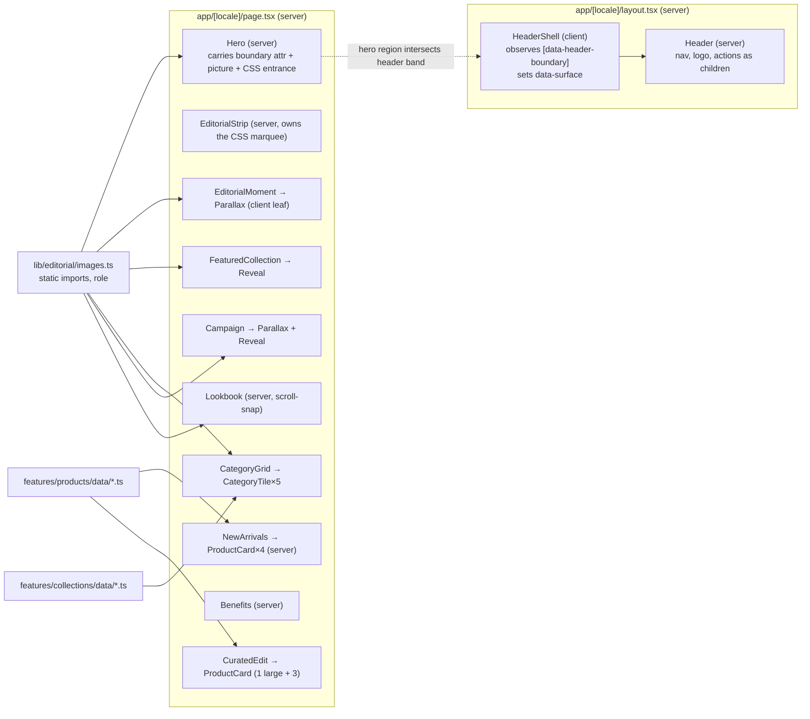

# feat: Moon Fashion storefront homepage, header and footer

Target: `apps/storefront` only. All paths below are relative to the repository root.

## Overview

Replace the foundation placeholder at `/[locale]` with the first real Moon Fashion homepage
(ten editorial/commerce sections, static mock content), redesign the header with the
transparent-over-hero → solid-on-scroll behaviour, redesign the mobile menu as an editorial
panel, and redesign the footer. Introduce the first feature slices (`features/home`,
`features/products`, `features/collections`), a small motion primitive set, and an image
pipeline whose assets are swappable by file drop. No API, cart, auth or backend work.

## Problem Frame

The storefront foundation (plan `2026-09-13-001`) shipped locale routing, tokens, the API
client and a deliberately minimal shell. Every nav target 404s and the homepage is a
one-line placeholder. This task establishes the visual system and homepage storytelling
so that the following Shop/Collections task inherits a proven composition, motion and
image vocabulary rather than inventing one under commerce pressure.

No `dev:brainstorm` requirements document exists; the request itself is a detailed brief,
and `docs/design/moon-fashion-website-design-guideline.md` §12 already specifies the ten
sections. The brief cites a "supplied concept image" as the primary composition
reference; **none exists in the repository or was supplied**, so the guideline §12 is the
composition source of truth (user decision, 2026-09-13).

## Requirements Trace

- R1. Homepage at `/[locale]` composes ten sections in the guideline §12 order, minus
  Newsletter: Hero, Editorial strip, New Arrivals, Editorial moment, Featured collection,
  Shop by category, Full-bleed campaign, Curated edit, Shopping benefits, Lookbook.
- R2. Header: desktop IA `Shop · New In · Collections | logo | Search · Account · Bag`,
  72–84px, transparent over the hero, solid ivory + ink + hairline after the hero
  boundary; boundary observed, not a magic pixel value; client boundary kept small.
- R3. Header stays readable over the hero without recolouring or regenerating the logo.
- R4. Mobile header `Menu | mark | Search · Bag`; mobile menu is an editorial full-screen
  panel on the existing Headless UI Dialog, preserving focus trap, Escape, focus
  restoration, translated labels, RTL, reduced motion.
- R5. Footer redesigned, spacious, actual logo, gold as fine detail only.
- R6. Nowhere on homepage, header, mobile menu or footer: FAQ, Blog, About, Newsletter, or
  any renamed equivalent (Journal, Stories, Our Story, Subscribe, Stay Connected…).
- R7. Mock data only, typed, kept out of JSX; products and collections live in their own
  slices; nothing under `features/*/api/`.
- R8. 2–4 motion ideas reused consistently, `motion` package meaningfully used, every effect
  has a reduced-motion fallback; no scroll hijacking, loaders, pinning, bounce, 3D.
- R9. Every section works in `ar` (RTL): logical properties, mirrored arrows and marquee
  direction, photography not mechanically flipped.
- R10. Intentional layouts at 320/375/768/1024/1440; no horizontal overflow.
- R11. Next Image with correct `sizes`, one eager LCP image, everything else lazy;
  transform/opacity animation only; client islands small; Server Components by default.
- R12. WCAG 2.2 AA preserved: heading hierarchy, alt text, decorative images, keyboard,
  focus visibility, icon labels, contrast, 44px targets.
- R13. Storefront `typecheck`, `lint`, `test`, `build` green; existing foundation tests
  preserved; new tests only for genuinely testable logic.
- R14. Header/mobile-menu/footer/homepage and the storefront contract doc stay in sync.

## Scope Boundaries

- No real API integration, no `features/*/api/`, no `next.config` `remotePatterns` for the
  Express uploads host (that is the Shop task's, when the first real product image loads).
- No Shop, Collections, Product detail, Search, Cart, Checkout, Auth, Account pages, and
  **no placeholder pages** to stop links 404ing — nav hrefs stay as they are.
- No cart/wishlist/search behaviour, and no wishlist icon on cards (a control with no
  behaviour is worse than none).
- No FAQ, Blog, About, Newsletter, social links, contact details, or policy text (R6).
- No backend or dashboard change; nothing imported across apps.
- No new runtime dependency. `motion` 13.2.0, `@headlessui/react`, `lucide-react`,
  `embla-carousel-react` are already installed; Embla is **not** used (see decisions).
- No horizontal logo lockup or any new logo artwork (foundation plan deferred that to a
  brand task; still deferred).
- No Customer Care footer column: Shipping/Returns/Contact are neither built nor planned,
  and the brief forbids fake policies. Add the column in the task that plans those pages.

## Context & Research

### Relevant Code and Patterns

- `apps/storefront/CLAUDE.md` — the contract this plan extends: token/utility vocabulary,
  the three-boundary `"use client"` rule, string props to client islands (`messages={null}`),
  logical CSS only, the feature-slice shape, "nothing shared with the dashboard".
- `apps/storefront/app/globals.css` — tokens (`--moon-*` → `--color-*`), `type-*`
  utilities, `section-y`, `grid-editorial`, `--ease-editorial`, `--duration-*`, the global
  reduced-motion collapse, `[data-surface='ink']` / `[data-variant='overlay']` focus-ring
  switch (already anticipates an overlay header and an ink surface).
- `apps/storefront/components/layout/header/header.tsx` — `variant?: 'solid' | 'overlay'`
  seam left for this task; 3-column desktop grid; mark on mobile, lockup on desktop.
- `apps/storefront/components/layout/mobile-menu/mobile-menu.tsx` — Headless UI Dialog with
  `transition` + `data-closed:` classes; the pattern to extend, not replace.
- `apps/storefront/components/layout/nav-link.tsx` (`typography` prop, why two `type-*`
  classes must never coexist), `components/ui/editorial-link.tsx` (RTL arrow flip and
  underline-origin flip pattern), `components/ui/container.tsx` (`bleed`), `components/
  brand/brand-logo.tsx` + `lib/brand/logo-assets.ts` (the asset-registry pattern to mirror
  for editorial images).
- `apps/storefront/messages/messages.test.ts` — key-parity and no-empty-string test
  already covers every new `home.*`/`footer.*` key added here.
- `apps/server/src/database/seed.ts` — the real category vocabulary (فساتين، تريكو، حقائب،
  بناطيل، مجوهرات، بلوزات، جاكيتات، أحذية، إكسسوارات، عبايات، حجاب) and product names/
  prices (1,200–4,500 EGP). Mock data mirrors this domain instead of inventing one.
- `apps/storefront/public/brand/moon-fashion-logo.png` — **gold** artwork (≈`--moon-gold`),
  stacked lockup 1031×749. This drives the hero contrast decision below.

### Institutional Learnings

- `docs/solutions/` does not exist in this repo. Relevant `CLAUDE.md` learnings: the pnpm
  `@types/react` hoist pin (do not touch `tsconfig.json` `paths`); a Tailwind `content`-style
  path must belong to a direct dependency; string-coupling contracts (persist keys,
  `data-testid` from `lineKey`) must be documented where both halves live.

### External References (verified against installed packages)

Next 16.3.5 — `apps/storefront/node_modules/next/dist/docs/01-app/03-api-reference/02-components/image.md`:
- `priority` is deprecated in favour of `preload`; docs say `preload` is the narrow tool
  and "in most cases you should use `loading="eager"` or `fetchPriority="high"` instead".
- `images.qualities` defaults to `[75]`; any other `quality` is silently coerced. The
  storefront `next.config.ts` has no `images` block today.
- Static imports (`import hero from '…/hero.jpg'`) supply `width`/`height`/`blurDataURL`
  automatically; a `public/` path string does not. Files under `public/` are not needed
  for `next/image` at all.
- Art direction has no first-class prop: the documented form is `getImageProps()` × 2 →
  one `` inside `<picture>`; it cannot be combined with `placeholder="blur"`. Two
  `<Image>`s hidden by CSS cannot be combined with `preload`/`eager` (both would load).
- A `"use client"` island never makes a route dynamic; only `cookies()`, `headers()`,
  `searchParams`, `draftMode()` do (`04-glossary.md`). `/en` and `/ar` stay SSG.

motion 13.2.0 (`framer-motion@13.2.0` types and ESM source):
- `motion/react-client` exports **elements only** and is already a `"use client"` module —
  a Server Component may render `<motion.div>` from it without becoming a client file.
  Hooks (`useInView`, `useScroll`, `useTransform`, `useReducedMotion`) and `LazyMotion`/
  `MotionConfig` come from `motion/react` and are client-only.
- Measured gzip: `m` alone 6.4 KB, `m + domAnimation` 14 KB, full `motion` 39 KB.
- `useInView(ref, { once, amount, margin, initial })` is a 20-line wrapper over `inView()`.
- `useScroll({ target, offset })` + `useTransform` runs on a **native ScrollTimeline**
  only when `offset` is one of four presets; `["start end", "end start"]` (`cover`) is
  one of them. Motion values initialise to `0` on the server, so first paint is the
  progress-0 state — no hydration mismatch, but pre-animation state is in the HTML.
- `MotionConfig reducedMotion="user"` makes positional/transform keys instant but leaves
  `opacity` animating; it does **not** touch `useScroll`/`useTransform` values. Parallax
  must be gated on `useReducedMotion()` manually. `useReducedMotion()` snapshots once and
  does not re-render on preference change.
- 13.2.0 carries the Turbopack OOM fix (#3741); do not downgrade.

## Key Technical Decisions

- **Hero is dark/dusk-toned; navigation is ivory over it; the gold logo is never
  recoloured.** The logo is gold, so it reads on ink and reads weakly on ivory. A dusk hero
  ("Moonlight, redefined") makes the gold logo and ivory nav the natural pairing and
  satisfies R3 with zero logo intervention. Contrast is **code-guaranteed, not
  image-dependent**: a soft top-down ink scrim (≤ 35% at the top edge, transparent by
  ~30% of hero height) behind the header band, a second soft bottom-start scrim behind the
  hero copy zone (both crops), and a local scrim behind the campaign line — each tuned to
  be near-invisible on a correctly dark image and only *visible* when a swapped asset is
  too light. The image brief additionally constrains those zones' luminance, and the swap
  procedure ends with a contrast re-check, so a light swap is caught twice. Rejected: CSS `filter` inversion of the logo (a render-time recolour, and
  it would turn gold to blue-ish, not white).
- **Header height stays 80px desktop / 64px mobile with the stacked lockup at 52px.**
  The lockup is 1.38:1, so at 52px it is ~72px wide with a ~13px wordmark — legible, small.
  The brief's "MOON FASHION centred" reads as the lockup, and a horizontal lockup is
  forbidden here. The wordmark size is the known cost; a brand-approved horizontal lockup
  is the unblock, recorded as a deferred brand task. Mobile shows the mark at 36px.
- **Header overlay is decided per page by a DOM boundary, not by route matching.** The
  homepage hero element itself carries a `data-*` attribute exported from one constant in
  `components/layout/header/header-boundary.ts` (the constant only; no JSX in a `.ts`
  file); a small client `HeaderShell` observes **the hero region** with
  `IntersectionObserver` using `rootMargin: '-<header-h>px 0px 0px 0px'` and threshold
  `0`, so "intersecting" means "some of the hero is still under the header band" — not
  "the hero's bottom edge is on screen". It toggles `data-surface="overlay" | "solid"` on
  `<header>`; `--header-h` is read from computed style so the observer and the CSS token
  cannot drift. Pages with no boundary element are solid, so the 404 route and every
  future page need nothing. Rejected: a zero-height sentinel at the hero's bottom edge
  (stops intersecting after ~1px of scroll, and never intersects at rest when the hero
  exceeds the viewport); React context provider in the layout; `usePathname` route check.
  **The homepage's server HTML is already overlay, with no JS:** a pure-CSS rule
  `body:has([<boundary-attr>]) header[data-surface='auto']` applies the overlay surface,
  so first paint is correct and there is never an ivory→transparent flip on load;
  `HeaderShell` writes `data-surface='solid'` once the hero leaves the header band and
  `'auto'` when it returns. Non-home pages have no boundary element, so `'auto'` resolves
  to solid there. The one degraded case — no JS *and* scrolled past the hero — is overlay
  over ivory, accepted because the scrim keeps the at-rest state readable and no-JS is
  not a supported browsing mode for this storefront. `HeaderProps.variant` and `data-variant` are removed — `HeaderShell` is the sole
  owner of `data-surface`; no caller passes `variant` today.
- **Overlay/ink colours are a scoped indirection override, mirroring the existing
  `--font-display-active` pattern — not a `--color-*` override.** The tokens are declared
  `@theme inline`, so `text-text` compiles to `color: var(--moon-ink)` and a scoped
  `--color-text` override would be inert (verified in the built CSS). `globals.css`
  already solves exactly this for fonts: `--font-display: var(--font-display-active)`,
  with `:lang(ar)` overriding the `-active` variable. Colours get the same seam:
  `--surface-text`, `--surface-text-secondary`, `--surface-bg`, `--surface-border` on
  `:root` (defaulting to the ink/stone/ivory values), `--color-text: var(--surface-text)`
  etc. inside `@theme inline`, and `[data-surface='overlay']` / `[data-surface='ink']`
  override the `--surface-*` variables (overlay: ivory text, transparent bg and border;
  ink: ivory text, ink bg, stone-600 border). `NavLink`, icons and `EditorialLink` read
  `text-text` and need no change. `globals.css` already switches the focus ring for
  `[data-variant='overlay']`; that selector is renamed to `[data-surface='overlay']` so
  one attribute drives both. Rejected: moving colours out of `@theme inline` (changes
  every compiled colour utility for one feature); overriding raw `--moon-*` in scope
  (breaks the "components never touch `--moon-*`" rule and recolours `--color-action`).
- **The header is `position: sticky`, and the hero pulls up beneath it.** The header keeps
  its 80px flow slot; the hero applies a negative block-start margin equal to a new
  `--header-h` token and pads its own content by the same amount. Non-home pages are
  untouched. Rejected: `position: fixed` (every page would need top padding).
- **Four motion ideas, three of them without the motion runtime.** (1) *Entrance* — hero
  entrance is CSS keyframes with staggered `animation-delay` (0ms image, 100ms image
  settle `scale(1.05) → 1`, 200ms label, 300ms title lines, 450ms copy, 550ms CTA; done by
  ~1100ms), no JS, and the keyframes run unconditionally from the server HTML (never gated
  on a JS-applied class, so no-JS users see the copy); section headings reuse the
  line-mask keyframe triggered by `Reveal`. (2) *Scroll reveal* — `Reveal` client leaf:
  `useInView` from `motion/react` toggles a data attribute; the transition itself is CSS.
  (3) *Image scale/parallax* — `Parallax` client leaf: `useScroll` with the `cover` preset
  offset, `useTransform` producing a `transform` string (`translateY(±4%)`), bound to
  `style.transform` — `transform` is in motion's `acceleratedValues`, `y` is not, so this
  is what lets it ride a native ViewTimeline where supported (JS fallback elsewhere,
  including Safari). Verified against the installed source: an `m` element only writes
  live `MotionValue` changes when a `LazyMotion` renderer exists, so `Parallax` wraps its
  `m` element in `LazyMotion` with an async `domAnimation` import and `strict`, scoped to
  that leaf (~6 KB gz initial, ~14 KB gz total). Reduced motion is gated on the **value**,
  not the element: `useReducedMotion()` is `null` on the server and a boolean on the first
  client render, so branching the element shape would be a hydration mismatch; instead the
  transform range collapses to `[0, 0]` and the same element renders in every state.
  (4) *Editorial marquee* — pure CSS keyframes on a track rendered twice (the second copy
  `aria-hidden`), paused on hover/focus-within, keyframe direction reversed under
  `[dir="rtl"]`, and under reduced motion the copy is `display: none` so the static strip
  shows the content once and scrolls naturally; a Server Component owned by the editorial
  strip (its only consumer). Product hover crossfade, link underlines and arrow shifts
  stay CSS micro-interactions. No global `MotionConfig`/`LazyMotion` provider is added.
- **New client boundaries: exactly three** — `components/motion/reveal.tsx`, `components/
  motion/parallax.tsx`, `components/layout/header/header-shell.tsx`. `ProductCard` hover
  is CSS `group-hover` on two stacked `<Image>`s (Server Component), no hover-revealed
  wishlist. Lookbook rail is CSS
  scroll-snap (Server Component) made focusable (`tabindex="0"`, `aria-label`) because it
  contains no focusable children; Embla is not justified by a static image strip. The
  storefront `CLAUDE.md` boundary list grows from three to six **entries** (the two
  provider files share one entry, so seven files).
- **Reveal must never hide content from the HTML or from no-JS users.** Server HTML is the
  visible state. On mount, `Reveal` marks elements *below the viewport* as pending and
  reveals them on intersection; elements already in view at mount are never hidden. Under
  reduced motion there is no pending state at all — `decideInitialRevealState` returns
  `in` and nothing animates.
- **Image pipeline: static imports behind one registry, swappable by file drop.** Files
  live in `apps/storefront/assets/editorial/<slot>.jpg` (not `public/` — static imports
  give blur + dimensions for free). `lib/editorial/images.ts` is the only module that
  imports them and exports a typed map keyed by slot with role (alt text is a message
  key resolved by the consuming section). A companion `docs/design/editorial-image-brief.md` lists every slot with
  ratio, minimum pixels, art direction and a generation prompt — the user generates the
  final assets externally and replaces files at the same paths; no code changes. There
  is deliberately no image-shape unit test: under vitest's node environment a static
  `.jpg` import is a URL string with no dimensions, every frame is `aspect-ratio` +
  `object-cover` (a wrong shape crops, never distorts), and the screenshot review is the
  guard. Until real assets exist, implementation ships toned placeholder JPEGs at the exact
  ratios (ivory/stone/ink fields, no text), so the layout system is provable now.
- **Hero is the only art-directed image and the only eager one.** Two crops (desktop
  16:10 ≥ 2400×1500, mobile 4:5 ≥ 1200×1500) via `getImageProps()` × 2 → `<picture>`,
  `loading="eager"`, `fetchPriority="high"`, `sizes="100vw"`, no blur (irrelevant for an
  eager LCP image; documented as incompatible anyway). Every other image is a single
  static import, `placeholder="blur"`, lazy, with an honest `sizes` string. Catalog images
  are 4:5; the campaign is 21:9 cropped to 4:5 on mobile via `object-position`. No
  `images` block is added to `next.config.ts` in this task: the default `qualities: [75]`
  cannot be judged on flat placeholders, and the brief notes that if 75 shows artefacts on
  the real hero/campaign assets, `qualities` is added then.
- **Prices are formatted on the server, Western digits in both locales, currency label
  trailing as in the guideline card (`1,250 EGP`).** `features/products/utils/price.ts`
  formats the number with `Intl.NumberFormat` (`ar` with the `nu-latn` numbering extension
  so `1,250` does not become `١٬٢٥٠`, no decimals) and appends the localised currency
  label from `products.currency` (`EGP` / `ج.م`) — not `style: 'currency'`, whose
  symbol choice and position differ per ICU and per locale. Digit assumption flagged for
  the user; a one-line change if Eastern Arabic digits are preferred. Server-only
  formatting removes any ICU hydration risk.
- **Mock product names are bilingual in the mock only.** The real `products.name` is a
  single Arabic string; the mock carries `{ en, ar }` purely so the English homepage reads
  correctly. The type is named `HomeProductMock`-style, not `Product`, so nobody mistakes
  it for the DTO the Shop task will define.
- **Guideline §12·11 (Newsletter) and §12·12's "newsletter if not already above" are
  overridden** by the brief's explicit exclusion; §12·04's "Explore the story →" link is
  dropped for the same reason (an About-shaped destination). (`§N` is a top-level chapter;
  `§12·NN` is a homepage sub-section.) Recorded in the storefront `CLAUDE.md`.
- **Footer is deep ink.** The Lookbook closes on ivory imagery; an ink footer gives the
  page a definitive close and is the surface the gold logo reads best on. `[data-surface=
  'ink']` already switches the focus ring; nav text uses the same scoped token override as
  the header overlay.
- **Shopping benefits are three typographic items with hairlines, marked temporary.** Copy
  stays generic (delivery, returns, secure payment) with no numbers or policy specifics;
  the data file carries a comment that the wording is unconfirmed. Flagged for the user.
- **Design skills are an execution posture.** `frontend-design` and `ui-ux-pro-max` are
  loaded before any markup in Units 3, 4, 7, 8, 9 (global `CLAUDE.md` rule), and the
  guideline overrides both where they disagree.

## Open Questions

### Resolved During Planning

- Concept image: none available → guideline §12 is the composition reference.
- Imagery source: AI-generated by the user (Codex) after implementation → registry +
  brief + exact-ratio placeholders (above).
- Category names: real seed vocabulary exists → five homepage tiles chosen from it:
  Dresses, Tops, Knitwear, Bags, Abayas (فساتين، بلوزات، تريكو، حقائب، عبايات). Abayas over
  Outerwear because it is a real Moon category and differentiates the brand.
- Footer surface: ink (above). Customer Care column: omitted (Scope Boundaries).
- Embla: not used.
- Header pre-hydration surface: overlay from the server HTML via a CSS `:has()` rule;
  JS narrows to solid on scroll (user decision after review, 2026-09-13).
- Text-over-image contrast: code scrims behind every text zone plus brief constraints
  and a post-swap re-check (user decision, 2026-09-13).
- Image ratio guard: no unit test — vitest cannot read static-import dimensions; CSS
  frames crop rather than distort; screenshot review is the guard (user decision,
  2026-09-13).
- Wishlist icon: not rendered until wishlist behaviour exists (user decision, 2026-09-13).

### Deferred to Implementation

- Exact scrim stops, hero `object-position` per breakpoint, parallax travel (4–8%),
  reveal `amount`/`margin`, marquee speed — tuned against the placeholder images and
  re-tuned when real assets land.
- Exact `sizes` strings per slot — derived from the final grid columns.
- Whether Safari's lazy-image grey border (Next docs, "Known browser bugs") shows on the
  4:5 catalog grid; apply the documented `clip-path: inset(0.6px)` only if seen.
- Arabic copy for all new `home.*` strings: implementer drafts, user reviews.

## High-Level Technical Design

Directional only — not implementation specification.



Header surface decision matrix:

| Boundary element present | Hero under header band | JS ran | Rendered surface |
|---|---|---|---|
| no (any non-home page) | — | any | solid (`auto` with no boundary resolves to solid) |
| yes | yes (top of homepage) | any | overlay — from the CSS `:has()` rule, before any JS |
| yes | no (scrolled past hero) | yes | solid (`HeaderShell` writes `data-surface='solid'`) |
| yes | no | no | overlay over ivory — the accepted no-JS degraded case |

The server attribute is always `auto`; CSS resolves it, JS only narrows it. That is why
there is no first-paint flip and no route awareness in the header.

## Implementation Units

- [x] **Unit 1: Image pipeline — registry, brief, placeholders, config**

**Goal:** Every image slot the homepage needs exists as a typed entry with a real file
behind it, swappable by file drop, with the shape guarded by a test.

**Requirements:** R7, R11, R13

**Dependencies:** None

**Files:**
- Create: `apps/storefront/assets/editorial/` (hero-desktop, hero-mobile, strip-01…04,
  moment, featured-large, featured-small, category-{dresses,tops,knitwear,bags,abayas},
  campaign, lookbook-01…05, product-{01…08}-{a,b}) — placeholder JPEGs at exact ratios
- Create: `apps/storefront/lib/editorial/images.ts`
- Create: `docs/design/editorial-image-brief.md`

**Approach:**
- Registry entries: `{ src: StaticImageData, role: 'hero' | 'editorial' | 'catalog' |
  'category' | 'lookbook' }`, keyed by slot name. No `ratio` field: every frame is CSS
  `aspect-ratio` + `object-cover`, so a wrong-shape swap crops rather than distorts, and
  the screenshot review catches crops. Expected ratios (21:9, 16:10, 4:5, 3:2, 1:1, 3:4)
  are recorded per slot in the brief only. The registry also exports its slot-name list
  from a separate plain module so data tests can validate slot references without
  importing image files.
  Alt text is not stored here — it is a message key resolved by the consuming section,
  so it localises.
- Brief lists per slot: ratio, minimum pixels, subject/crop, lighting, palette words from
  guideline §10, and the negative constraints (no text, no logos, no HDR). One paragraph
  of shared art direction at the top so the set stays consistent.
- Placeholders: flat toned fields — no text, no gradients, so a placeholder is never
  mistaken for a design choice. The hero (both crops) and campaign slots ship **charcoal/
  ink** so the overlay header and ivory copy are reviewable now; catalog, category,
  lookbook and strip slots ship ivory/cream/stone-200.
- The brief also states, per slot, which zones must stay dark enough for ivory text (hero
  top band and copy zone in both crops; campaign copy line); the code scrims are the
  guarantee, the brief is the first line of defence.
- No `images` block in `next.config.ts`; no `remotePatterns`.

**Patterns to follow:** `lib/brand/logo-assets.ts` (`as const` registry, key type derived).

**Test scenarios:**
- Test expectation: none — asset registry and documentation; shape is verified visually
  (see Key Technical Decisions). No spec may import `images.ts` under vitest.

**Verification:** `next build` resolves every static import (a missing file is **not** a
typecheck error — Next's ambient `declare module '*.jpg'` matches any path); the brief
lists the same slot names the registry exports (a reviewer can diff them by eye).

---

- [x] **Unit 2: Motion primitives — `Reveal`, `Parallax`, marquee utility, entrance keyframes**

**Goal:** The four motion ideas exist once, as reusable primitives, with reduced-motion
and no-JS behaviour settled before any section uses them.

**Requirements:** R8, R11, R12

**Dependencies:** None (parallel with Unit 1)

**Files:**
- Create: `apps/storefront/components/motion/reveal.tsx` (client)
- Create: `apps/storefront/components/motion/reveal-policy.ts` (pure, no React)
- Create: `apps/storefront/components/motion/reveal-policy.test.ts`
- Create: `apps/storefront/components/motion/parallax.tsx` (client)
- Create: `apps/storefront/features/home/components/editorial-strip/marquee.tsx` (server;
  single consumer, so it lives in the slice — promoted to `components/` only if the Shop
  task reuses it)
- Modify: `apps/storefront/app/globals.css` (`@keyframes` for line-mask reveal, fade-up,
  image settle, marquee; `[data-reveal]` state styles; `[dir="rtl"]` marquee reversal;
  reduced-motion rules for the marquee and reveal states)

**Approach:**
- `Reveal`: props `as`, `delay` step index, `children`. Renders children unhidden on the
  server. On mount, `decideInitialRevealState` decides `in` | `pending` from the element's
  rect, the viewport and `useReducedMotion()`; `useInView({ once: true, amount, margin })`
  flips `pending` to `in`. All visuals are CSS driven by the attribute.
- `Parallax`: props `travel` (fraction), `children` (an image wrapper). `useScroll({ target,
  offset: ['start end', 'end start'] })`, `useTransform` → a `transform` string bound to
  `style.transform` on an `m` element inside a leaf-scoped `LazyMotion` (`domAnimation`
  loaded async, `strict`). The **same element renders in every state**; reduced motion
  collapses the transform range to zero rather than swapping the element (hydration
  safety — see Key Technical Decisions).
- `Marquee`: prop `children`; duration set in CSS (one consumer, one speed). Renders the
  track twice; the second copy carries `aria-hidden="true"`, the first is the accessible
  content. CSS `animation-play-state: paused` on `:hover` and `:focus-within`; reduced
  motion → no animation, the `aria-hidden` copy is `display: none`, and the single track
  overflows naturally with `overflow-x: auto`.
- Entrance keyframes: `moon-line-reveal` (clip/translate line mask), `moon-fade-up`
  (opacity + 24px) and `moon-image-settle` (`scale(1.05) → 1`, ~900ms, `--ease-editorial`,
  transform only). Consumed by the hero (with delays, unconditionally from server HTML)
  and — the first two — by `Reveal`.

**Technical design (directional):**

```text
Reveal state machine
  server HTML ──(mount, below fold, motion ok)──▶ pending ──(inView once)──▶ in
  server HTML ──(mount, in fold)────────────────▶ in            (never hidden)
  server HTML ──(mount, reduced motion)─────────▶ in            (no pending state)
```

**Patterns to follow:** `components/ui/editorial-link.tsx` for the RTL flip technique;
`globals.css` motion tokens (`--ease-editorial`, `--duration-slow`).

**Test scenarios (`reveal-policy.test.ts`):** the one behaviour with a correctness
consequence — "never hide content the user can already see" — is isolated as a pure
function `decideInitialRevealState(rect, viewport, reducedMotion)` → `'in' | 'pending'`,
so it is testable without a DOM library (none is installed; none is added).
- Happy path: element top below viewport height → `pending`.
- Happy path: element fully inside the viewport at mount → `in`.
- Edge case: element straddling the fold (top above, bottom below) → `in` — partially
  visible content is visible content.
- Edge case: viewport height `0` or rect with `NaN` (jsdom-less SSR call) → `in` — the
  safe default is always visible.
- Edge case: `reducedMotion === true` → `in` regardless of position.
- No DOM tests for `Reveal`, `Parallax` or `Marquee` themselves: their remaining
  contract is visual and verified in the browser review (Unit 10).

**Verification:** A scratch page (deleted before commit) shows: reveal fires once, in-fold
content never flashes, marquee pauses on hover, reverses under `dir="rtl"`, and is static
and single-copy with `prefers-reduced-motion`; parallax moves on scroll and is inert with
reduced motion; no hydration warning in the console in either state.

---

- [x] **Unit 3: Header redesign and scroll surface**

**Goal:** The header matches R2/R3: transparent and ivory-text over the hero, ivory/ink
with a hairline after the boundary, restrained height, unchanged logo.

**Requirements:** R2, R3, R4 (header part), R9, R12

**Dependencies:** None (independent of Units 1–2; may run in parallel with them)

**Files:**
- Create: `apps/storefront/components/layout/header/header-shell.tsx` (client)
- Create: `apps/storefront/components/layout/header/header-boundary.ts` (the attribute
  constant only)
- Modify: `apps/storefront/components/layout/header/header.tsx` (remove `variant` prop and
  `data-variant`; wrap content in `HeaderShell`)
- Modify: `apps/storefront/app/globals.css` (`--header-h` per breakpoint; `--surface-*`
  indirection variables and their `[data-surface='overlay']` overrides; rename
  `[data-variant='overlay']` focus selector; header `z-index` above the hero)
- Modify: `apps/storefront/components/layout/navigation-items.ts` only if desktop actions
  change to icon+label (they stay text links; no change expected)

**Approach:**
- `Header` stays a Server Component and renders `<HeaderShell>` around its existing
  content; `HeaderShell` renders `<header data-surface=…>` and owns the observer.
- `header-boundary.ts` exports the attribute name; the hero (Unit 7) sets that attribute
  on its own root element. `HeaderShell` queries it on mount, observes it with
  `rootMargin: '-<header-h>px 0px 0px 0px'`, threshold `0`, and disconnects on unmount.
- The sticky header needs an explicit `z-index` above the hero, which is later in DOM
  order and positioned (for its scrim) — otherwise the hero paints over it.
- `<header>` renders with `data-surface="auto"`; `globals.css` carries the
  `body:has([boundary]) header[data-surface='auto']` overlay rule, so the surface is
  correct in the server HTML. `HeaderShell` only ever writes `'solid'` / `'auto'`.
- Overlay state: `bg` transparent, text ivory, border transparent (all via `--surface-*`).
- Transition: `background-color`, `color`, `border-color` over `--duration-fast` with
  `--ease-ui`, suppressed until the observer's first callback so the initial state is a
  cut, never an animation. No shadow, no blur, no pill.
- Heights: `--header-h: 64px` (<1024), `80px` (≥1024). Lockup at 52px desktop, mark 36px
  mobile. Desktop actions remain text (`Search · Account · Bag`) per the brief; mobile
  keeps the two icon buttons at 44×44.
- Logo `preload` handling stays as the foundation wrote it (mark preloaded, lockup lazy).

**Execution note:** Load `frontend-design` and `ui-ux-pro-max` before markup.

**Patterns to follow:** existing `Header` grid; `[data-surface='ink']` focus-ring switch.

**Test scenarios:**
- Happy path (browser): `/en` after hydration shows the overlay header; scrolling until
  the hero's bottom edge passes under the header switches to solid with a hairline;
  scrolling back restores overlay.
- Happy path (browser): scroll 1px on `/en` at 375 and 1440 — header remains overlay.
- Happy path (browser): `/en/anything` (404 page) renders solid from first paint.
- Edge case: JS disabled → homepage header is overlay from the CSS rule and readable over
  the scrimmed hero; the 404 page is solid; the no-JS scrolled state is the accepted
  degraded case.
- Integration: the boundary attribute constant is imported by both `header-shell.tsx` and
  `features/home/components/hero/hero.tsx` — a rename in one fails typecheck in the other
  (string coupling contained by the type system; documented in the storefront `CLAUDE.md`).
- Accessibility: Tab order unchanged; focus ring is ivory in overlay, ink in solid.

**Verification:** Both surfaces pass 4.5:1 for nav text (ivory on the scrimmed hero top;
ink on ivory); header height measures 80/64; no layout shift on surface change.

---

- [x] **Unit 4: Mobile menu editorial panel**

**Goal:** The menu feels like a fashion panel: full-screen ivory, oversized display links,
staggered link entrance, account + language in a quiet lower band.

**Requirements:** R4, R6, R8, R9, R12

**Dependencies:** Unit 2 (entrance keyframes)

**Files:**
- Modify: `apps/storefront/components/layout/mobile-menu/mobile-menu.tsx`
- Modify: `apps/storefront/app/globals.css` if a `data-closed`-driven stagger needs a rule

**Approach:**
- Keep Headless UI `Dialog`/`DialogPanel` (focus trap, Escape, restoration are theirs).
- Panel slides from inline-start over `--duration-base` (already RTL-aware via
  `rtl:data-closed:translate-x-4`); links use `type-h2` instead of `type-h3` and a
  stagger of 60–90ms using the fade-up keyframe, driven by CSS, not state.
- Header row inside the panel matches the new mobile header height (64px) with the mark.
- Lower band: Account link, then the locale switcher, separated by a hairline; a single
  gold hairline detail is the only gold in the panel.
- Items remain the three primary links + Account + language (R6).

**Execution note:** Load `frontend-design` and `ui-ux-pro-max` before markup.

**Patterns to follow:** existing `MobileMenu`; `NavLink typography` prop for the size swap.

**Test scenarios:**
- Happy path (browser): open → focus lands inside; Escape closes and focus returns to the
  Menu button; links close the panel.
- Edge case: `prefers-reduced-motion` → panel appears without slide or stagger, still opens.
- RTL: panel enters from the right; text right-aligned; close button at inline-end.
- Accessibility: every control ≥ 44px; `DialogTitle` present; menu button labelled.

**Verification:** Keyboard-only run through open/navigate/close on `/en` and `/ar`.

---

- [x] **Unit 5: Products slice — types, mock data, `ProductCard`, price formatter**

**Goal:** The first reusable commerce unit: a lightweight card (image, name, price,
optional New label) with CSS-only hover crossfade.

**Requirements:** R1 (03, 08), R7, R9, R11, R12, R13

**Dependencies:** Unit 1

**Files:**
- Create: `apps/storefront/features/products/types/home-product.ts`
- Create: `apps/storefront/features/products/data/home-products.ts`
- Create: `apps/storefront/features/products/components/product-card.tsx` (server)
- Create: `apps/storefront/features/products/utils/price.ts`
- Create: `apps/storefront/features/products/utils/price.test.ts`
- Create: `apps/storefront/features/products/data/home-products.test.ts`
- Modify: `apps/storefront/messages/en.json`, `messages/ar.json` (`products.new`,
  `products.currency`)

**Approach:**
- Mock shape: `{ slug, name: { en, ar }, price: number (EGP), images: { a, b } (registry
  slot keys), isNew?: boolean }`. Eight products drawn from the seed vocabulary (silk midi
  dress, embroidered evening dress, linen summer dress, cashmere pullover, long wool
  cardigan, cross-body leather bag, velvet evening bag, …). Two datasets exported: four
  for New Arrivals, four for the Curated Edit, no overlap.
- Card: `<article>` with the 4:5 frame, two stacked `<Image>`s (`b` at `opacity-0`,
  `group-hover:opacity-100`, 1 → 1.02 scale on the frame, 260ms `--ease-ui`), name as the
  link text (whole image linked, single accessible name), price below, small `New`
  label top-start. **No wishlist icon** in this task — a focusable control with no
  behaviour is a dead control for keyboard and screen-reader users; the Shop task adds it
  when it has behaviour (as a sibling of the link, never nested inside the `<a>`).
- Card links to `/shop/<slug>` (404s today; intended href preserved, R7/§20).
- Price: `formatPrice(amount, locale, currencyLabel)` → number via `Intl.NumberFormat`
  (`nu-latn` for `ar`, no decimals) + a space + the localised label; the label comes from
  `products.currency` and is passed in by the server component so the util stays pure.
- Dataset shape: the two datasets have **four** and **five** products (New Arrivals 4;
  Curated Edit 1 large + 4 standard) — see Unit 8 for why.

**Patterns to follow:** `components/ui/editorial-link.tsx` hover technique; `Container`.

**Test scenarios (`price.test.ts`):**
- Happy path: `formatPrice(1250, 'en', 'EGP')` → exactly `1,250 EGP`.
- Happy path: `formatPrice(1250, 'ar', 'ج.م')` → exactly `1,250 ج.م` (Western digits,
  Arabic label, no `١`).
- Edge case: `0` → `0 EGP`; `4500.5` → `4,501 EGP` (rounded, no decimals).

**Test scenarios (`home-products.test.ts`):**
- Happy path: slugs unique across both datasets; every `images.a`/`images.b` names an
  existing catalog slot, validated against the registry's slot-name list (a plain module
  with no image imports); prices are positive integers; both `name.en` and `name.ar` non-empty.

**Verification:** Card renders identically as a Server Component in both locales; hover
crossfade only on hover-capable devices; the whole card has exactly one accessible name.

---

- [x] **Unit 6: Collections slice — category data and `CategoryTile`**

**Goal:** Image-led category tiles from the real category vocabulary.

**Requirements:** R1 (06), R7, R9, R11

**Dependencies:** Unit 1

**Files:**
- Create: `apps/storefront/features/collections/types/home-category.ts`
- Create: `apps/storefront/features/collections/data/home-categories.ts`
- Create: `apps/storefront/features/collections/components/category-tile.tsx` (server)
- Modify: `messages/en.json`, `messages/ar.json` (`categories.{dresses,tops,knitwear,bags,abayas}`)

**Approach:**
- Five tiles, `{ key, href: '/collections/<key>', image slot, messageKey }`. Tile is an
  image frame (3:4) with the name set in `type-h4` at the block-end inside a soft scrim;
  hover 1 → 1.03 scale, 300ms.

**Patterns to follow:** `navigation-items.ts` (`messageKey: keyof Messages[...]` typing).

**Test scenarios:**
- Test expectation: none — data typed against the message catalogue and registry; the
  messages parity test and typecheck already guard it.

**Verification:** Five tiles render, names localised, hrefs carry the locale prefix.

---

- [x] **Unit 7: Home slice — hero, editorial strip, page composition**

**Goal:** The homepage's strongest moment plus its transition, and a page that composes
sections rather than containing them.

**Requirements:** R1 (01, 02), R2 (boundary attribute), R8, R9, R10, R11, R12

**Dependencies:** Units 1, 2, 3

**Files:**
- Create: `apps/storefront/features/home/components/hero/hero.tsx`
- Create: `apps/storefront/features/home/components/editorial-strip/editorial-strip.tsx`
- Create: `apps/storefront/features/home/data/editorial-strip.ts`
- Modify: `apps/storefront/app/[locale]/page.tsx` (compose; remove `foundation` usage)
- Modify: `messages/en.json`, `messages/ar.json` (`home.hero.*`, `home.strip.*`; remove
  `foundation.*` once nothing reads it)

**Approach:**
- Hero: full-viewport (min 88svh desktop, 100svh mobile), root element carries the header
  boundary attribute (Unit 3), `<picture>` via `getImageProps` (desktop 16:10 / mobile
  4:5; `` must stay the direct child of `<picture>` — `@next/next/no-img-element`
  exempts exactly that nesting), `object-position` favouring the subject's
  upper-inline-end so the copy sits in negative space at inline-start bottom; top scrim
  for the header and bottom-start scrim behind the copy zone; copy block in **ivory**: `type-label` "New collection", the title
  (two authored lines, `home.hero.title1` / `home.hero.title2` so each locale chooses its
  own break; each line is its own overflow-hidden mask so a wrapped line is never
  clipped; `type-display-xl` ≥768, `type-display` below), `type-body-lg` support line,
  `EditorialLink` "Explore Collection" → `/collections`. Entrance via CSS delays running
  unconditionally from the server HTML; nothing is interaction-blocking.
- Hero copy in Arabic drafted by the implementer, reviewed by the user.
- Editorial strip: one `Marquee` mixing four 3:4 images (short height, ~180px) with
  oversized `type-display` collection words ("Evening", "Linen", "Knit", "Abaya") on an
  ivory→cream band; the only marquee on the page.
- Page: `Container`-free composition, each section owns its container/bleed decision.
  `generateStaticParams`/`setRequestLocale` unchanged.

**Execution note:** Load `frontend-design` and `ui-ux-pro-max` before markup.

**Patterns to follow:** existing `page.tsx` locale guard; `EditorialLink`.

**Test scenarios:**
- Happy path (browser): hero LCP image is the only eager image; entrance completes
  ≤ ~1200ms; CTA is focusable immediately.
- Edge case: reduced motion → hero copy is simply visible; marquee static, single-copy
  and scrollable.
- Edge case: 320px — the two authored title lines each fit or wrap inside their own mask
  without clipping; no horizontal overflow.
- RTL: copy block sits at inline-start (right) without the photo being mirrored; marquee
  travels right-to-left… i.e. reversed.
- Accessibility: hero image has meaningful alt (a fashion description, not "hero");
  strip images are `alt=""` decorative; `h1` is the hero title, the only `h1`.

**Verification:** `/en` and `/ar` still list as SSG in the build output; no `foundation.*`
key remains in either catalogue.

---

- [x] **Unit 8: Home slice — commerce and editorial sections 03–10**

**Goal:** New Arrivals, Editorial moment, Featured collection, Shop by category, Campaign,
Curated edit, Benefits, Lookbook, composed into the page in guideline order.

**Requirements:** R1 (03–10), R6, R8, R9, R10, R11, R12

**Dependencies:** Units 5, 6, 7

**Files:**
- Create under `apps/storefront/features/home/components/`: `new-arrivals/new-arrivals.tsx`,
  `editorial-moment/editorial-moment.tsx`, `featured-collection/featured-collection.tsx`,
  `category-grid/category-grid.tsx`, `campaign/campaign.tsx`, `curated-edit/curated-edit.tsx`,
  `benefits/benefits.tsx`, `lookbook/lookbook.tsx`
- Create: `apps/storefront/features/home/data/benefits.ts`, `features/home/data/lookbook.ts`
- Modify: `apps/storefront/app/[locale]/page.tsx`
- Modify: `messages/en.json`, `messages/ar.json` (`home.*` per section)

**Approach (composition direction, desktop → mobile):**
- *03 New Arrivals*: eyebrow + `type-h2` at inline-start, `EditorialLink` at inline-end;
  4 columns ≥1024, **2 at 768 and below** (four products never leave a 3+1 orphan row;
  guideline §16 allows 2–3 on tablet); `Reveal` on the heading only, not on cards.
- *04 Editorial moment*: 12-col grid; portrait 4:5 image spans cols 7–12 inside
  `Parallax`; statement in `type-display` spans cols 1–7 and overlaps the image by one
  column, block-end aligned; no link (R6). Mobile: image full-width first, statement
  below pulled up with negative margin so the overlap survives.
- *05 Featured collection*: large 3:2 image cols 1–8; title "The Evening Edit" `type-h1`
  cols 8–12 top; small 4:5 image cols 9–12 overlapping the large image's bottom edge;
  `EditorialLink` "Discover" under it. Mobile: large image, then title + small image side
  by side 3:2 split, then link — recomposed, not stacked.
- *06 Shop by category*: five tiles as `2fr 1fr 1fr / 1fr 1fr 2fr`-style asymmetric grid
  ≥1024; 2 columns at 768 (last tile spans 2); mobile horizontal scroll-snap row with
  3:4 tiles at 70vw.
- *07 Campaign*: `Container bleed`, 21:9 (desktop) / 4:5 (mobile via `object-position`,
  single image) inside `Parallax`; one line of `type-display` ivory copy in `Reveal`
  masked over a local soft scrim; no box, no card. Cream band before/after for the ivory→cream transition.
- *08 Curated edit*: one large card (4:5, spans 2 cols and 2 rows) + **four** standard
  cards in a 4-col grid — fills the 4×2 desktop grid exactly; mobile 2 columns with the
  large card spanning both, then the four standard cards 2×2. Heading "The Edit" differs
  from 03 visually by the asymmetry.
- *09 Benefits*: three items in a row separated by hairlines, `type-label` title + one
  `type-small` line, no icons, no cards; stacked with hairlines on mobile.
- *10 Lookbook*: 5-image mosaic on a 12-col grid with varied ratios (4:5, 1:1, 3:4)
  ≥1024; mobile horizontal scroll-snap rail with items at ~78vw so the next image peeks;
  the rail is `tabindex="0"` with an `aria-label` (region) because it contains no
  focusable children — Safari/Firefox do not make scrollers focusable on their own; the
  category rail needs none of this because its tiles are links. No handles, captions or
  social chrome.
- Section rhythm: `section-y` everywhere, with 04→05 and 07 breaking it by overlap and
  bleed; background alternates ivory → cream only at 02 and 07. The three horizontal
  devices on mobile (02 marquee, 06 rail, 10 rail) are separated by at least two
  non-horizontal sections each, so they read as rhythm rather than one repeated widget.
- Heading and landmark model (every section is a `<section>` with `aria-labelledby`
  pointing at its `h2`; the hero `h1` is the only `h1`):

  | Section | `h2` | Visible? | Decorative display text |
  |---|---|---|---|
  | 02 Strip | "Collections" | `sr-only` | marquee words are not headings |
  | 03 New Arrivals | section title | yes | — |
  | 04 Editorial moment | the statement itself | yes | — |
  | 05 Featured collection | "The Evening Edit" | yes | — |
  | 06 Categories | section title | yes | — |
  | 07 Campaign | the campaign line itself | yes | — |
  | 08 Curated edit | "The Edit" | yes | — |
  | 09 Benefits | section title | `sr-only` | items are a `<ul>` |
  | 10 Lookbook | "Lookbook" | `sr-only` | — |

**Execution note:** Load `frontend-design` and `ui-ux-pro-max` before markup.

**Patterns to follow:** `grid-editorial`, `section-y`, `Container bleed`; Units 5/6 cards.

**Test scenarios:**
- Happy path (browser): all ten sections render in order in both locales; headings form
  `h1` → `h2` per section with no skipped level.
- Edge case: 320px — no horizontal overflow; overlaps degrade to negative margins, not
  clipped content; scroll-snap rails do not cause page-level horizontal scroll.
- RTL: grid column starts mirror; overlaps occur at the mirrored edge; arrows flip.
- Accessibility: category tiles have one accessible name each; lookbook images have
  descriptive alt; benefits are a `<ul>`.
- Performance: no image other than the hero carries `eager`/`fetchPriority`; every
  non-hero image has `placeholder="blur"` and a `sizes` narrower than `100vw` where its
  layout is narrower.

**Verification:** Reviewer answers "premium fashion brand, not assembled sections" for
desktop EN/AR and mobile EN/AR captures (user provides screenshots — see Unit 10).

---

- [x] **Unit 9: Footer redesign**

**Goal:** A spacious ink footer with the real logo, primary links, language switcher and
copyright; nothing excluded by R6.

**Requirements:** R5, R6, R9, R12

**Dependencies:** Unit 3 (token-override pattern)

**Files:**
- Modify: `apps/storefront/components/layout/footer/footer.tsx`
- Modify: `apps/storefront/app/globals.css` (`[data-surface='ink']` `--surface-*` overrides)
- Modify: `messages/en.json`, `messages/ar.json` (`footer.tagline`, `footer.shopLabel`)

**Approach:**
- `<footer data-surface="ink">`; 12-col grid ≥1024: lockup at 120px in cols 1–4 with a
  one-line `type-body` tagline — the existing `metadata.description` line ("luxury
  fashion, edited for the modern wardrobe") reused verbatim, so no new About-shaped copy
  is written; Shop column cols 7–9
  (`Shop · New In · Collections`); Language column cols 10–12 (`LocaleSwitcher`).
  Bottom row: gold hairline (the only gold), `type-caption` copyright.
- Mobile: logo, then the two columns side by side, then the hairline row.
- No social, contact, policies, newsletter, customer-care (Scope Boundaries).

**Execution note:** Load `frontend-design` and `ui-ux-pro-max` before markup.

**Patterns to follow:** existing `Footer`; `LocaleSwitcher` props contract.

**Test scenarios:**
- Happy path: footer nav landmark labelled; links carry locale prefix; locale switch
  preserves path.
- Accessibility: ivory-on-ink ≥ 4.5:1; focus ring ivory (`[data-surface='ink']`).
- R6 audit: grep of the rendered HTML for the excluded words (and their Arabic
  equivalents) finds nothing.

**Verification:** Lookbook → footer transition reads as a deliberate close in both locales.

---

- [x] **Unit 10: Contract docs, verification, browser review handoff**

**Goal:** The storefront contract describes the new reality; all gates are green; the
visual review is performed on the user's captures.

**Requirements:** R13, R14, R10

**Dependencies:** Units 1–9

**Files:**
- Modify: `apps/storefront/CLAUDE.md` — client boundary list (3 → 6 entries, each
  justified); the `--surface-*` indirection rule (why `@theme inline` needs it, mirroring
  fonts); image pipeline and swap procedure (including the contrast re-check after a
  swap); the header boundary constant and its two consumers; `--header-h`; the mobile
  menu typography exception (`type-h3` → `type-h2`); the guideline overrides (§12·11
  Newsletter, §12·04 "Explore the story", §12·12 Customer Care); price-digit and
  currency-label decisions; scope of "no commerce pages" updated to "homepage only".
- Modify: `CLAUDE.md` (root) — Quick Start sentence "no commerce pages yet" → homepage
  exists; add a Learnings entry for the gold-logo/dark-hero decision if it proves
  non-obvious in review.

**Approach:**
- Run `typecheck`, `lint`, `test`, `build`; confirm `/en` and `/ar` are `●` SSG.
- Per the user's standing rule, **do not test in the browser**: request screenshots at
  1440 EN/AR and 375 EN/AR (top of page, mid-scroll with solid header, footer), plus
  320/768/1024 EN for overflow, and dev-console output for hydration/missing-message
  errors. Iterate composition on the captures; do not declare complete on a
  template-looking result.

**Test scenarios:**
- Test expectation: none — documentation and verification unit.

**Verification:** Four CI-equivalent commands green locally; the storefront CI job green;
the contract doc's boundary list accounts for every `.tsx` file whose first line is a
`use client` directive (the codebase uses single quotes — seven files across six entries).

## System-Wide Impact

- **Interaction graph:** `HeaderShell` ↔ hero boundary attribute (DOM attribute contract). `Reveal`/
  `Parallax` are leaves with no shared state. Nothing touches `AppProviders`, `proxy.ts`,
  `i18n/*`, or `lib/api/*`.
- **Error propagation:** none — static content. A missing message key fails the parity
  test; a missing image file fails `next build` (not typecheck); a wrong-shape image
  crops inside its CSS frame and is caught by the screenshot review.
- **State lifecycle risks:** `HeaderShell` observer must disconnect on unmount; `Reveal`
  must not re-hide on re-render (`once: true`); `useReducedMotion` snapshots once — a
  preference change mid-session is not honoured until reload (accepted, documented).
- **API surface parity:** none. The dashboard is untouched; no shared package.
- **Integration coverage:** the SSG guarantee (`/en`, `/ar` remain `●`) is proven by the
  build output, not by a unit test; the no-JS header state is proven by review.
- **Unchanged invariants:** locale routing and `proxy.ts` matcher; `messages={null}` on
  the client provider (no client file calls `useTranslations`; every new client leaf takes
  strings or children); the `tsconfig.json` `paths` pin; `apiFetch` untouched and still
  uncalled; logo assets and `logo-assets.ts` unchanged; `NavLink`/`EditorialLink`/
  `Button`/`Container` public props unchanged (overlay/ink colouring is a scoped
  `--surface-*` override, not a prop). The one public prop change is `Header`: `variant`
  is removed (never passed by any caller).

## Risks & Dependencies

| Risk | Mitigation |
|------|------------|
| Placeholder images make the "does it look premium" judgement impossible until real assets land | Composition, type and motion are reviewed on placeholders; the final review is repeated after the user's Codex assets are dropped in — a file swap, no code |
| Stacked gold lockup at 52px reads too small in the header | Recorded as the known cost of "no new logo composition"; the unblock is a brand-approved horizontal lockup (separate task) |
| `Parallax`'s native ViewTimeline path is unsupported (Safari) or the `transform` binding does not accelerate as expected | Motion falls back to its JS scroll listener automatically; 4–8% transform-only travel is cheap either way — the native path is a bonus, not a dependency |
| `Reveal` pre-hydration flash or hidden no-JS content | Server HTML is the visible state; hiding happens only after mount and only below the fold |
| `:has()` unsupported (pre-2023 browsers) | Header falls back to solid over the scrimmed hero — readable; `HeaderShell` still narrows to `'solid'`, so nothing breaks |
| A swapped hero/campaign image is lighter than the brief allows | Code scrims keep ivory copy readable; the post-swap contrast re-check flags it for regeneration |
| Overlap compositions (04, 05) break at 768–1023 | Tablet treated as its own breakpoint in Unit 8, not as "small desktop" |
| Arabic copy quality | Implementer drafts; user reviews before merge; catalogue parity test guards completeness only |
| Western-digit price assumption wrong for Egyptian audience | One-line change in `lib/format/price.ts`; flagged in the contract doc |
| Benefits wording implies policies that don't exist | Generic wording, no numbers, code comment marks it unconfirmed; user confirms or removes |
| Header overlay + sticky affects the 404 page | `data-surface="auto"` resolves to solid wherever no boundary element exists; the 404 page is untouched |

## Documentation / Operational Notes

- `apps/storefront/CLAUDE.md`, `docs/CONVENTIONS.md`, root `CLAUDE.md` updated in Unit 10.
- `docs/design/editorial-image-brief.md` is the user's hand-off for asset generation; it
  is also the record of every slot's ratio for the later Shop task.
- Do not deploy publicly; nav targets still 404 by design.

## Alternative Approaches Considered

- **Light hero + ink nav over it.** Rejected: the gold logo is weak on light imagery, and
  the fix would be a logo recolour, which is forbidden.
- **`MotionConfig reducedMotion="user"` as the single reduced-motion switch.** Rejected:
  verified not to cover `useScroll`/`useTransform`; per-primitive gating is required
  anyway, and the global `globals.css` rule already collapses CSS motion.
- **`whileInView` on `motion.*` elements from `motion/react-client` for reveals.** Simpler
  ergonomics, but needs the `inView` feature (full bundle or `domAnimation`) in every
  section: ~14–39 KB gz vs a 20-line hook plus CSS.
- **Embla for the lookbook / category rails.** Rejected: CSS scroll-snap gives drag/swipe,
  keyboard and RTL for free with zero JS; Embla earns its place only with autoplay or
  programmatic navigation, neither of which is wanted.
- **Two `<Image>`s + CSS for the hero art direction.** Rejected: forbids `eager`/
  `fetchPriority` on the LCP element (both would load).

## Sources & References

- Brief: the `/dev-plan` request (2026-09-13); no origin requirements document.
- Design source of truth: `docs/design/moon-fashion-website-design-guideline.md` (§4–§16, §19–§22).
- Foundation plan: `docs/plans/2026-09-13-001-feat-storefront-foundation-plan.md` (deferred
  items this plan picks up: homepage, header overlay logo tone; still deferred: horizontal lockup).
- Contract: `apps/storefront/CLAUDE.md`; conventions: `docs/CONVENTIONS.md`.
- Next 16.3.5 local docs: `apps/storefront/node_modules/next/dist/docs/01-app/03-api-reference/02-components/image.md`,
  `…/01-app/02-guides/upgrading/version-16.md`, `…/01-app/04-glossary.md`.
- motion 13.2.0: `framer-motion/dist/index.d.ts`, `motion-dom/dist/index.d.ts`, `motion/package.json` exports.
- Motion reference sites (energy only): Modévo, Astral Threads, Bella, Vessa (guideline §1).
