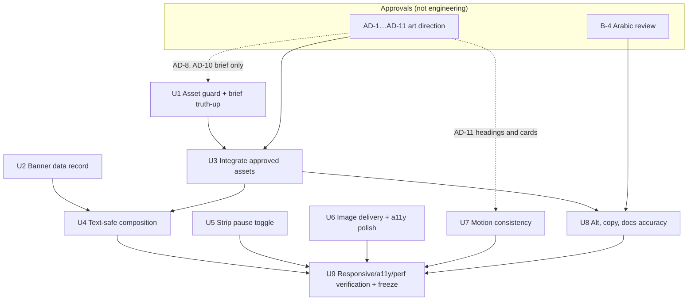

# feat: Moon Fashion homepage final polish and freeze

Target: `apps/storefront` only. All paths are relative to the repository root.

## Overview

The homepage from `docs/plans/2026-09-13-002-feat-storefront-homepage-header-footer-plan.md`
(status `completed`, merged in #194) has final photography in every slot, the ten approved
sections in order, and a motion system that has already had its stronger pass. This plan is
**not a redesign**. It closes the gaps that inspecting the current repository actually found,
separates the calls that belong to art direction and the business from engineering work, and
ends with a verification that lets the homepage be declared frozen before Shop + Collections.

What inspection found, in one line each (evidence in *Context & Research*):

- **Imagery is final, not placeholder**: all 45 slots hold generated photographs at or above the
  brief's pixel minimums, and every file is registered. The open problems are *repetition*,
  *two sleeveless looks*, and two photographs whose copy zones are not calm.
- **Composition**: hero copy clears the figure in all four slides. The campaign line very
  likely crosses the model on phones, and the promo banner relies on a 0.72 ink scrim over
  a bright wall and a patterned skirt instead of empty space.
- **Alt text** mostly matches the final assets; three strings describe the wrong colour,
  garment or direction.
- **Code**: no high-severity defects. Medium items: the marquee has no stop mechanism for
  keyboard or touch users, one image `sizes` is roughly half what it needs, the hover photo
  downloads on touch devices, and the focus ring is clipped on the phone category rail. Six
  consecutive sections open with the same label-wipe plus word-rise entrance.
- **Copy**: no invented delivery or returns promise in English. One Arabic string strengthens
  a claim, and the Arabic homepage addresses the reader differently from the header, footer
  and 404 page.
- **Asset hygiene is already clean in the repository**: no stray, duplicate or rejected
  generation is tracked or untracked. What's missing is a guard that keeps it that way, and a
  record of where the source generations live.

## Problem Frame

The homepage has to be frozen as the reference surface before commerce pages begin, because
Shop + Collections will reuse its tokens, cards, motion primitives and image pipeline. A
freeze with unresolved art-direction questions, a WCAG 2.2.2 gap, or copy that drifts
between locales would propagate into every later page. Some remaining decisions are
not engineering: whether sleeveless looks fit the brand, whether one photographic set may
recur across the hero and lookbook, and whether "Easy returns" can be said at all. The plan
has to keep those decisions visible and owned rather than resolve them silently in code.

No requirements document exists under `docs/brainstorms/` for this work. The user's request
is detailed enough to plan directly, and the repository contract (`apps/storefront/CLAUDE.md`)
plus the image brief (`docs/design/editorial-image-brief.md`) supply the standing decisions.

## Requirements Trace

- R1. Every major homepage visual is final-quality and appropriate to its section, and
  no placeholder remains. *(Already true; the plan guards it: U1, U9.)*
- R2. No dominant editorial image, outfit or near-identical pose/set repeats across
  Hero, Promo banner, Featured collection, Campaign and Lookbook. *(AD-2 to AD-5, U3.)*
- R3. Headlines, navigation and CTAs never collide with the model in EN/LTR or AR/RTL,
  on mobile or desktop, solved by crop and placement before overlays. *(U4.)*
- R4. The "Dressed for the night." line does not cross the model at any width. *(U4.)*
- R5. Meaningful images have alt text matching the final asset. Decorative images stay
  `alt=""`. *(U8, U3.)*
- R6. Garment, pose, background and framing vary enough that the page reads as a
  collection, not one shoot reused. *(AD-2 to AD-5.)*
- R7. The two sleeveless looks are located exactly and held as an explicit decision.
  *(AD-1.)*
- R8. Delivery/returns/payment copy promises nothing unconfirmed; confirmed vs awaiting
  confirmation is explicit. *(B-1 to B-3, U8.)*
- R9. Arabic homepage copy is natural, premium and consistent in address, without
  inventing policy. *(B-4, U8.)*
- R10. Motion: strong at editorial moments, quiet on commerce; fix only real
  inconsistencies (repetition, off-token timing, off-screen rotation). *(AD-11, U7.)*
- R11. Responsive review at 320/375/768/1024/1440 × `/en` `/ar` across the listed areas,
  with no horizontal overflow. *(U9.)*
- R12. WCAG 2.2 AA preserved and the open gaps closed: moving content can be stopped,
  focus is visible, targets are adequate, hero state is not visual-only. *(U5, U6, U9.)*
- R13. Performance fixes only where the implementation shows a real cost. *(U6, U9.)*
- R14. Asset hygiene: production vs original/reference vs retained source is explicit and
  guarded. *(U1, U2.)*
- R15. Promo banner is reusable by changing content and imagery only. *(U2.)*
- R16. All storefront CI gates pass, and the freeze is recorded. *(U9.)*

## Scope Boundaries

- Ten sections, current order. No section added or removed. The header and footer change
  only where this review requires it (the localised logo label, U6).
- No FAQ, Blog, About, Newsletter or signup anywhere.
- No Shop, Collections listing, PDP, Search, Filters, Cart, Checkout, Auth, Account,
  Orders, Wishlist, Payments, real API integration, dashboard or server changes.
- No motion-system rewrite. `Reveal`, `Parallax`, `TextReveal`, `Marquee` and the hero
  sequence keep their architecture. U7 adjusts usage and tokens only.
- No new `'use client'` boundary (U5's pause toggle is deliberately CSS-only).
- No mirrored photography for RTL, and no new logo artwork.
- **Engineering does not generate or pick replacement photography.** Asset regeneration is
  the user's art-direction work (Codex). U3 only integrates approved files at existing
  paths and updates what depends on them.
- The footer's placeholder contact details (`CONTACT_IS_PLACEHOLDER`) are a launch blocker
  tracked elsewhere, not a homepage-freeze item.

### Deferred to Separate Tasks

- A `no-restricted-imports` lint rule banning `motion/react`: carried from the previous
  review, independent of visual polish.
- Unit coverage for `HeaderShell` lifecycle and the `Reveal` observer flip, which needs a
  DOM test environment the storefront does not have.
- A brand-approved horizontal logo lockup (still deferred by the foundation plan).
- Renaming the `moment` / `moment-wide` slots to banner names: when Collections reuses the
  banner (user decision, 2026-09-14).

## Context & Research

### Relevant Code and Patterns

- Image pipeline: `apps/storefront/lib/editorial/slots.ts` holds the plain slot list (vitest-safe).
  `apps/storefront/lib/editorial/images.ts` is the only module importing files.
  `apps/storefront/assets/editorial/*.jpg` holds the 45 files, all tracked. `.gitignore`
  whitelists only that directory for `*.jpg`.
- Sections: `apps/storefront/features/home/components/*/` (hero, editorial-strip, new-arrivals,
  promo-banner, featured-collection, category-grid, campaign, curated-edit, benefits,
  lookbook) and `section-heading.tsx`. Data: `apps/storefront/features/home/data/`,
  `apps/storefront/features/products/data/home-products.ts`,
  `apps/storefront/features/collections/data/home-categories.ts`.
- Art-directed `<picture>` via `getImageProps()`: `hero.tsx`, `promo-banner.tsx`.
- Motion: `apps/storefront/components/motion/{reveal,reveal-policy,parallax,text-reveal}.tsx`, the
  marquee in `features/home/components/editorial-strip/marquee.tsx`, and all rules in
  `apps/storefront/app/globals.css` (hero ~L590–650, marquee ~L700–760, reduced motion
  ~L760+). Scrim tokens: `--color-scrim` 0.4, `--color-scrim-strong` 0.72.
- Pure-logic test seams to extend rather than invent: `hero-carousel-state.ts` +
  `.test.ts`, `reveal-policy.ts` + `.test.ts`, `messages/messages.test.ts`,
  `features/products/data/home-products.test.ts`.
- CI job `Storefront (typecheck, lint, test, build)` in `.github/workflows/ci.yml`.

### Inspection findings — imagery (viewed directly)

| Slot(s) | Section | What it shows | Finding |
| --- | --- | --- | --- |
| `hero-desktop` / `hero-mobile` | Hero · Evening | Black long-sleeved velvet column gown, dark marble hall, centred, empty floor | Composition good; alt matches |
| `hero-linen-*` | Hero · Linen | Ivory linen fit-and-flare, **sleeveless (wide straps)**, dark courtyard with lattice, vase and bench | Same garment as `product-03`; **sleeveless (AD-1)** |
| `hero-abaya-*` | Hero · Abaya | Black abaya over brown dress, lattice window, **vase left, bench right** | **Same room, props and pose as knitwear hero and lookbook-01 (AD-2)** |
| `hero-knitwear-*` | Hero · Knitwear | Cream sweater, **brown** wide trousers, same room | Alt says "wide trousers" without the colour, slightly off; set repetition (AD-2) |
| `moment-wide` / `moment` | Promo banner · The Silk Edit | Ivory full-sleeve silk shirt, brown linen skirt, seated on a bright limestone ledge | Left 45% is a **bright** wall and the mobile copy sits over the skirt: contrast comes from the scrim, not the photograph (AD-6); shirt repeats in lookbook-04 (AD-3) |
| `featured-large` | Featured · Evening Edit | Champagne long-sleeved satin gown, lamplit steps, figure left | Good; distinct |
| `featured-small` | Featured | Hands, black velvet clutch, champagne satin | Same clutch as `product-07` (allowed: product repeat) |
| `campaign` | Campaign | Umber silk dress from behind, dusk colonnade, figure at ~72% width, feet ~83% height | Desktop left 55% calm. **Mobile 4:5 window puts the figure centre-frame, and the bottom line overlaps the lower dress (U4)** |
| `lookbook-01` | Lookbook | Brown blazer, ivory trousers, **same room, vase and bench as hero abaya/knitwear** | Near-duplicate set and pose of a hero slide (AD-2) |
| `lookbook-02` | Lookbook | Hand with the `product-06` black flap bag against a brown coat | Same bag also in `category-bags` and `strip-02` (AD-4) |
| `lookbook-03` | Lookbook | Camel coat over a **dark satin cowl-neck dress**, carved door | Alt says "black top", inaccurate (U8) |
| `lookbook-04` | Lookbook | Ivory full-sleeve shirt, black wide trousers, on limestone stairs (**stepping down**) | Alt says "climbing" (U8); shirt repeats the banner (AD-3) |
| `lookbook-05` | Lookbook | Brown wool jacket lapel on ivory silk | Good |
| `category-dresses` | Categories | `product-01` champagne slip dress on model, **spaghetti straps, bare shoulders, deep V** | **Sleeveless (AD-1)**; editorial, not the brief's studio look (AD-8) |
| `category-tops/knitwear/bags/abayas` | Categories | Editorial model/still-life shots | Match their labels; differ from brief's studio direction (AD-8) |
| `strip-01…04` | Strip | Silk on stone; hand + `product-06` bag; linen hem with **thigh-high slit**; rib knit | Decorative, `alt=""` correct; strip-03 borderline for AD-1 |
| `product-01…09-a/b` | New Arrivals / The Edit | Ghost-mannequin on ivory, consistent | `product-01` / `-03` sleeveless (AD-1); artefacts in `05-b` (pocket shows through) and `09-b` (misplaced pocket) (AD-9); `product-01` is ankle-length but named "midi" (U8) |

Cross-image patterns: the same model appears in every model shot, turning her head to her right
(the viewer's left) in 8 of 10 major images, and wears a gold cuff in nearly all of them (AD-5). Brief pixel
minimums are met by Lanczos upscaling from ~1.5–1.9k native output, per the brief itself
(AD-7).

### Inspection findings — code (read-only audit, verified unless marked)

- `category-grid.tsx`: the last tile spans two columns at 768–1023, but `sizes` says `48vw`.
  It should be ~`92vw`.
- `lookbook.tsx`: the wide tile's `sizes` runs under (460px vs ~528px at 1440). `tabIndex=0`
  on the region persists from 1024, where it is no longer a scroller.
- `product-card.tsx`: the alternate (hover) image is in the viewport at opacity 0, so lazy
  loading still fetches it on touch devices (9 extra requests). The "New" badge precedes the
  name inside the link, so the accessible name starts with "New".
- `category-grid.tsx` rail: `overflow-x-auto` without block padding clips the tile focus
  ring's top edge on phones.
- `globals.css` marquee: pauses on `:hover` and `:focus-within` only, and nothing inside is
  focusable. **No stop mechanism for keyboard/touch (WCAG 2.2.2).** The `marquee.tsx` doc
  comment overstates this.
- Hero hidden slides use `visibility:hidden` inside the viewport box, so their lazy ``s
  may still load on first paint *(speculative — confirm in the network panel)*. Rotation
  continues while the hero is scrolled out of view.
- `hero-carousel.tsx`: `aria-live` flips off→polite in the same render as the first manual
  change, so the first change may go unannounced *(speculative)*.
- Entrance repetition: New Arrivals, Promo, Featured, Categories and Curated all use a label
  wipe followed by a word-masked rise, and Campaign uses the word-masked rise without a label. Image wipe + 1.06 zoom repeats on Featured,
  every product card, the first category tile and The Edit.
- Off-token motion: the hero title exit easing (`globals.css` ~L643) and strip pan
  `ease-in-out` (~L733) fall outside `--ease-editorial` / `--ease-ui`. Hover durations are
  hard-coded (`duration-300`, 400/350/260ms) in `category-tile.tsx`, `product-card.tsx`
  and `nav-link.tsx`.
- `header.tsx` / `footer.tsx`: the logo link label "Moon Fashion" is hard-coded English.
- `promo-banner.tsx`: `BANNER_HREF` constant in the component. Slot names `moment` /
  `moment-wide` are left over from the replaced brand-moment section. No Silk-specific
  logic otherwise.
- `messages.test.ts` checks key parity and non-empty values, but not that ICU placeholders
  (`{index}`, `{total}`, `{year}`) match across locales.
- Contract drift: `apps/storefront/CLAUDE.md` says `HeaderShell` owns an IntersectionObserver
  (it is a scroll listener), says the hero copy is `max-w-md` (code: `max-w-[26rem]`), and
  says "before adding a fourth `use client` boundary" (seven exist). `locale-switcher.tsx`,
  `nav-link.tsx` (`type-h3` vs `type-h2`) and `benefits.ts` ("cards with icons") comments
  are stale.
- Clean: heading order (sr-only h1 → slide h2 → section h2s → card/benefit h3s → footer),
  tablist semantics with RTL arrows, inert inactive slides, marquee copies `aria-hidden`,
  44px header/tab/social targets, RTL motion direction, no layout `100vw`, reduced-motion in
  CSS and JS, one eager hero image, blur on everything else, 4 shared observers.

### Inspection findings — copy

- EN benefits are generic and invent nothing. `features/home/data/benefits.ts` already
  marks delivery/returns UNCONFIRMED.
- AR `home.benefits.payment.body` "بيانات الدفع محمية **دائمًا**" adds "always", which the
  English does not claim. That is a strengthening.
- Address register: the home slice uses feminine singular (`اكتشفي`, `تسوّقي`, `اختاري`, `غيّرتِ`).
  The footer uses plural (`تابعوا`) and the 404 page masculine (`تبحث`).
- The word "مختارات" is used twice: banner title "مختارات الحرير" and curated title "المختارات".
- Transliterations / literal phrasings worth a native read: "اللوك بوك",
  "حضورٌ / بهدوء." (reads split), metadata "مختارة لخزانة الملابس العصرية".
- `home.curated`, hero `slideOf` and footer `rights` interpolations exist in both locales.

### Asset hygiene

- `git status --ignored` on `apps/storefront` and `docs/design` shows no untracked images.
  45 tracked files match exactly the 45 registered slots. `docs/design/brand/` holds only
  the logo original.
- There is no record of where native-resolution source generations live, and nothing fails
  if an unregistered file lands in `assets/editorial/` or a registered one is removed
  (`next build` catches only the latter).

### Institutional Learnings

- `docs/solutions/` does not exist. Relevant standing decisions come from
  `apps/storefront/CLAUDE.md` (hero has no pause button by user decision; physical-left copy
  on banner/campaign; `Reveal` and hover never share an element; nothing imports
  `motion/react`; client islands take resolved strings) and the root `CLAUDE.md` Learnings
  (the `@theme inline` surface seam; the gold logo is never recoloured).
- Previous review `.context/compound-engineering/dev-code-review/2026-09-13-storefront-homepage/review.md`:
  all five fixes are present, and its human-owned residuals (Arabic review, benefits wording,
  screenshot review) are still open and are carried here.

### External References

None gathered. Every layer this plan touches has direct local precedent. The design-review
input came from the `frontend-design` and `ui-ux-pro-max` checklists (carousel/auto-motion
controls, focus-not-obscured, target size, motion restraint, exit < enter).

## Approvals Required (not engineering)

These gate specific units. Engineering never picks an option by default: until a row is
decided, the current asset or copy stays exactly as it is, and the row stays open in the
freeze record.

### Art direction (owner: user)

| ID | Decision | Exact locations | Options | Recommendation | Gates |
| --- | --- | --- | --- | --- | --- |
| AD-1 | **Two sleeveless looks** (plus one borderline) | (a) Linen dress, wide straps: `hero-linen-desktop.jpg`, `hero-linen-mobile.jpg` (`hero-slides.ts` slide `linen`), `product-03-a/b.jpg` (`home-products.ts` `curatedEdit`, linen summer dress). (b) Silk slip, spaghetti straps: `category-dresses.jpg` (`home-categories.ts` `dresses`, the largest tile), `product-01-a/b.jpg` (`newArrivals`, silk midi dress). Borderline: `strip-03.jpg` thigh-high slit | Approve as-is / regenerate the garment with sleeves across **all** its images so product and editorial stay the same piece / replace with a different garment | No recommendation: brand and market call | U3, U8 |
| AD-2 | One photographic set repeats across major sections | `hero-abaya-*`, `hero-knitwear-*` and `lookbook-01` share the room, vase, bench and lattice; `hero-linen-*` shares vase and bench. `lookbook-01` closely echoes `hero-knitwear` (standing, hands in pockets, same props) | Regenerate `lookbook-01` in a different location / also move one hero slide to a new set / accept | Regenerate `lookbook-01` in daylight (brief allows street or interior). Consider a new set for Abaya or Knitwear so the four hero slides read as four collections | U3 |
| AD-3 | Ivory full-sleeve shirt repeats between promo banner and lookbook | `moment.jpg`, `moment-wide.jpg`, `lookbook-04.jpg` (also `category-tops`, `product-08`: allowed) | Regenerate `lookbook-04` with a different top / accept | Regenerate `lookbook-04`: the banner is the campaign garment | U3, U8 |
| AD-4 | One bag repeats in a major section | `lookbook-02.jpg` shows the `product-06` bag (also `category-bags`, `strip-02`) | Regenerate `lookbook-02` as a shoe/jewellery detail / accept | Regenerate: the brief already allows shoe or jewellery | U3, U8 |
| AD-5 | Pose and accessory sameness | Same model turning her head to her right in 8 of 10 major images; gold cuff in nearly all | Accept as signature casting / vary pose and accessories in any image regenerated under AD-1 to AD-4 | Keep the casting; vary pose and accessories in regenerations | U3 |
| AD-6 | Promo banner copy zones aren't calm | `moment-wide.jpg` left 45% is a sunlit wall; `moment.jpg` bottom 40% is the patterned skirt | Regenerate both with shadowed or empty copy zones (brief-compliant), then lighten the scrim / accept the 0.72 scrim | Regenerate, since the banner is designed to be reused and its photos swapped | U3, U4 |
| AD-7 | Native resolution | Hero and campaign are upscaled from ~1.5–1.9k | Regenerate at native ≥2400 / accept | Decide from a 1440 @2x capture of the hero and campaign, requested **before** U3 so a "regenerate" outcome lands inside U3 | U3 |
| AD-8 | Category tiles vs brief | All five `category-*.jpg` are editorial, not the brief's "neutral/studio" | Approve and update the brief / regenerate | Approve: they read as a set. Update the brief | U1 (brief only, not freeze) |
| AD-9 | Product image artefacts | `product-05-b.jpg` (pocket shows through the back), `product-09-b.jpg` (pocket misplaced), `product-02-a/b.jpg` (soft embroidery) | Regenerate / accept | Regenerate `05-b` and `09-b` | U3 |
| AD-10 | Where source generations live | Not recorded | Outside the repo, path recorded in the brief / `docs/design/editorial-sources/` in git | Outside the repo: native masters would add tens of MB to git history for no build value | U1 (brief only, not freeze) |
| AD-11 | Entrance repetition across sections | New Arrivals, Categories and The Edit headings (`section-heading.tsx`) share the word-masked rise with Banner, Featured and Campaign; every product card has the image wipe + zoom | Quiet commerce (`SectionHeading` single rise; cards rise only; The Edit feature card and first category tile keep the image wipe) / keep the current section-level entrances | No recommendation: you set the motion levels on 2026-09-14, and Shop/Collections inherit the outcome | U7 (headings and cards only) |

### Business / content (owner: business)

| ID | Decision | Current state | Gates |
| --- | --- | --- | --- |
| B-1 | Delivery wording | "Every order is carefully packed and delivered to your address." Technically complete, **awaiting policy confirmation**. No area, speed or fee may be added until confirmed | Launch, not freeze |
| B-2 | Whether returns and exchanges are offered at all | "Easy returns" / "Returns and exchanges are kept simple." implies a returns policy exists. **User decision, 2026-09-14:** U8 neutralises it to wording that promises no service, drafted in EN and AR and approved by you. Once the business confirms, the wording is restored or strengthened. Never a window, fee or "unconditional" claim | Launch, not freeze |
| B-3 | "Secure payment" before any checkout exists | Generic. **Awaiting confirmation** of the payment provider's assurances | Launch, not freeze |
| B-4 | Arabic native review and address register | Home slice feminine singular, footer plural, 404 masculine. Candidate edits listed in U8 | U8 |
| B-5 | Promo banner destination | `/collections/silk` 404s by design until Collections exists | Collections plan |

Freeze is allowed with B-1 to B-3 and B-5 open, because the wording is non-committal (returns neutralised in U8) and
marked. They remain **launch blockers** in the freeze record. AD-1 to AD-7, AD-9, AD-11 and B-4 must
be decided (any option, including "accept") before freeze. AD-8 and AD-10 change only the brief,
and U9 applies them whenever they arrive.

## Key Technical Decisions

- **Strip stop mechanism: a CSS-only pause toggle** (user decision, 2026-09-14). It is a
  native checkbox with `role="switch"`, **icon-only with an `aria-label`** from messages
  ("Pause motion" / localised), following the header's icon-button pattern. Its visible icon is
  the action available next (pause while moving, play while paused). The switch state is
  "on = paused". It sits below the tracks at the inline end at every width, outside the moving
  tracks, with a ≥44px target and the cream surface's focus ring. The paused state comes from
  a strip-scoped selector (`[data-strip]:has([data-strip-toggle]:checked)`), never a bare
  `section:has(:checked)`. Rationale: it closes WCAG 2.2.2 without an eighth
  client boundary, stays in the Server Component, and needs no hydration. It is hidden under
  reduced motion (nothing moves) and when `:has()` is unsupported (it would do nothing).
  The hero's no-pause-button decision is unchanged and stays documented.
- **Promo banner becomes data-driven, not generalised.** The href, the two slots and the
  per-crop `object-position` move to `features/home/data/promo-banner.ts`, beside
  `hero-slides.ts`. Copy stays in `home.banner`. The slot names `moment` / `moment-wide` stay as they
  are (user decision, 2026-09-14: the rename is deferred to the Collections task). One banner, one data record: no carousel, variants or
  props API. Rationale: "change content and image, not code" is the stated goal, and the
  hero already sets this pattern.
- **Composition before overlay.** For the campaign on phones, first change line placement and
  crop: the line at the top over dark masonry, or the figure shifted right (a *lower*
  `object-position` X), keeping the line off the figure. Scrims change only if a measured contrast check fails after that. The
  banner's scrim is lightened only after AD-6 delivers calm copy zones, never before.
- **Proposed, gated on AD-11: commerce sections go quiet, signature moments keep the word
  rise** (user decision, 2026-09-14: this is an art-direction call, and "keep current" is a
  valid outcome). `SectionHeading`
  (New Arrivals, Categories, The Edit and whatever else uses it) drops the word mask for a
  single label fade plus one title rise. Promo banner, Featured and Campaign keep the
  label wipe and word rise. Product cards lose the image wipe+zoom and keep a plain rise.
  The first category tile, Featured and The Edit's feature card keep the image wipe, through
  a `reveal` prop on `ProductCard` that mirrors `CategoryTile`'s. Rationale: R10's "strong
  editorial, quiet commerce" and the audit's six-in-a-row finding. It is a usage change,
  not a system change.
- **Hero rotation pauses while out of view**, inside the existing `hero-carousel.tsx`
  island (one `IntersectionObserver`, no new boundary). Out of view maps to the carousel's
  existing `paused` state: the progress fill freezes and resumes where it left off, exactly as
  hover does today. The derivation of the existing state union (`idle | running | paused |
  stopped`) becomes a pure function in `hero-carousel-state.ts` so it is unit-testable.
- **The hover photo only exists where hover exists.** The alternate image renders inside an
  element that is `display:none` unless `(hover: hover) and (min-width: 768px)`. Lazy images
  inside `display:none` are not fetched.
- **The asset guard is a filesystem test, not an image-shape test.** It checks that
  `assets/editorial/` contains exactly the files named by `editorialSlots` +
  `catalogSlots`, reading the directory and `slots.ts` only (never `images.ts`, per contract).
  Visual repetition cannot be tested and stays with the art-direction review. A slot-level
  "no reuse across sections" test is **not** added: campaign and featured slots live in
  components, and moving them into data only to test them would be architecture for a
  test.
- **Hero lazy-download fix is conditional, and likely.** Hidden slides keep a layout box in the
  viewport, so their lazy images are probably fetched. Measure first (U6's own capture request). Only if
  hidden slides load on first paint, defer non-first slides' `<picture>` until the carousel
  hydrates. That is acceptable because pre-hydration only slide 1 is visible, and the no-JS
  HTML still carries slide 1.
- **Captures come from a script the user runs** (user decision, 2026-09-14). Per the global
  instruction, the implementer does not drive a browser. The implementer writes a throwaway
  Playwright capture script (U9), the user runs it, and the implementer reviews the saved
  images. Composition sign-off, contrast measurement, the screen-reader pass and real-device
  network checks stay manual.

## Open Questions

### Resolved During Planning

- Is placeholder imagery still present? No: 45/45 final photographs (see findings).
- Do the sleeveless looks still exist? Yes: two garments across seven image files (AD-1).
- Strip stop mechanism: CSS-only pause toggle (user, 2026-09-14).
- Does the promo banner contain Silk-specific behaviour? No, only the href constant and
  legacy slot names (U2).
- Are there generation artefacts mixed into production assets? No. Only the guard and
  a sources record are missing (U1).
- Is a motion rewrite needed? No. Usage and token fixes only (U7).

### Deferred to Implementation

- Exact campaign mobile `object-position` and line placement (top-left over dark
  masonry vs bottom-left beside the figure): decided against the user's 320/375 screenshots.
- Whether hidden hero slides download on load: the network capture U6 requests before its
  conditional edits decides.
- Whether the first manual hero change is announced: a user-run screen-reader check
  (VoiceOver or NVDA), requested at the start of U6, decides whether `aria-live` must be
  mounted `polite`-ready before the first change.
- Whether `Reveal` pending elements visibly fade out on hydration during fast scroll:
  user screen capture. Fix in `reveal-policy.ts` only if seen.
- Measured contrast of hero eyebrow/tab labels and the campaign line over real pixels:
  dictates whether any scrim stop moves.
- Final Arabic strings: drafted by the implementer, approved under B-4.

## High-Level Technical Design

Directional only. Unit sequencing and the gates that feed it:

U2, U5, U6 and U7's hero pause and token work do not depend on approvals and can land while
regeneration is in progress. U7's heading and card change waits on AD-11.
If an AD row is decided "accept", U3 does nothing for it.

## Implementation Units

- [x] **Unit 1: Asset guard and brief truth-up**

**Goal:** Make asset hygiene mechanical and make the brief describe the assets that
actually ship.

**Requirements:** R1, R14

**Dependencies:** None (AD-8 and AD-10 answers are applied if already decided; otherwise the brief marks them pending)

**Files:**
- Create: `apps/storefront/lib/editorial/asset-guard.ts` (pure comparison of a file list against slot lists)
- Create: `apps/storefront/lib/editorial/assets.test.ts`
- Modify: `docs/design/editorial-image-brief.md`
- Modify: `apps/storefront/CLAUDE.md` (*Image pipeline*: name the guard)

**Approach:**
- A pure helper takes a file list and the slot lists and returns orphans, missing slots and
  unexpected extensions, so the error paths run against fixtures. The real-data test lists
  `apps/storefront/assets/editorial/` and calls it, comparing against `editorialSlots` +
  `catalogSlots` in both directions. Known OS metadata (`Thumbs.db`, `desktop.ini`,
  `.DS_Store`) is ignored, because `.gitignore` keeps it out of the repo and failing on it
  would only break local runs. Any other non-`.jpg` file fails.
- Brief additions: a short *Asset classes* section (production = `apps/storefront/assets/editorial`;
  original/reference = `docs/design/brand/`; source generations = location per AD-10, never
  in the production directory), category-tile direction per AD-8, and the repetition rule
  extended to **sets and props** (AD-2's finding).

**Patterns to follow:**
- `apps/storefront/features/products/data/home-products.test.ts` (slot-reference assertions under node vitest).

**Test scenarios:**
- Happy path: current directory vs slot lists → passes with 45/45.
- Error path: a file in the directory with no slot (e.g., a leftover `hero-linen-desktop-v2.jpg`) → fails, naming the file.
- Error path: a slot with no file → fails, naming the slot.
- Edge case: a non-`.jpg` image (`.png`, `.webp`) → fails with a clear message rather than being silently ignored.
- Edge case: `Thumbs.db`, `desktop.ini` or `.DS_Store` present → ignored.

**Verification:**
- The storefront test gate passes. The brief states where each asset class lives, and nothing in
  it contradicts the shipped category tiles.

---

- [x] **Unit 2: Promo banner as data**

**Goal:** Repurpose the banner by editing data, copy and files only.

**Requirements:** R15

**Dependencies:** None

**Files:**
- Create: `apps/storefront/features/home/data/promo-banner.ts`
- Modify: `apps/storefront/features/home/components/promo-banner/promo-banner.tsx`
- Modify: `docs/design/editorial-image-brief.md` (repurposing = edit the data record, `home.banner` and the two files), `apps/storefront/CLAUDE.md` (`BANNER_HREF` references)
- Test: `apps/storefront/features/home/data/promo-banner.test.ts`

**Approach:**
- The data record holds `href`, `wide` and `portrait` slots (typed `EditorialSlot`) and the two
  `object-position` classes currently inline. The component reads it; its markup, scrims,
  motion and physical-left rule are unchanged.
- The slot names `moment` / `moment-wide` stay. Renaming them is deferred to the Collections task that reuses the banner.

**Patterns to follow:**
- `apps/storefront/features/home/data/hero-slides.ts` (slide record with `wide` / `portrait` / `imageClassName`).

**Test scenarios:**
- Happy path: the banner record's `wide` and `portrait` are members of `editorialSlots` and differ from each other.
- Edge case: `href` is a locale-less absolute path (starts with `/`, no `/en` or `/ar` prefix), because `@/i18n/navigation`'s `Link` adds the locale.
- Integration: `promo-banner.tsx` holds no href or slot literal; both come from the record.

**Verification:**
- `next build` succeeds. The banner renders identically at 375 and 1440 in both locales
  (captured before and after), and the component holds no href or slot literal.

---

- [x] **Unit 3: Integrate approved replacement assets**

**Goal:** Land the art-direction outcomes of AD-1 to AD-7 and AD-9 as file swaps at existing
paths.

**Requirements:** R1, R2, R6, R7

**Dependencies:** Unit 1; AD decisions; the user supplies files

**Files:**
- Modify (replace in place, only rows decided "regenerate"): candidates are `apps/storefront/assets/editorial/lookbook-01.jpg`, `lookbook-02.jpg`, `lookbook-04.jpg`, `moment.jpg`, `moment-wide.jpg`, `hero-abaya-*.jpg` or `hero-knitwear-*.jpg`, `hero-linen-*.jpg`, `category-dresses.jpg`, `product-01-*.jpg`, `product-03-*.jpg`, `product-05-b.jpg`, `product-09-b.jpg`
- Modify (if a new garment changes the product): `apps/storefront/features/products/data/home-products.ts`, `apps/storefront/messages/en.json`, `apps/storefront/messages/ar.json`
- Modify: `apps/storefront/features/home/data/hero-slides.ts` (per-slide `imageClassName` only if a new hero crop needs it)

**Approach:**
- Before swapping, check each file against the brief's ratio, minimum pixels, contrast zones
  and the extended repetition rule. A file that fails goes back to art direction, not into the
  repo.
- AD-1 "regenerate" must keep the product and editorial images of one garment consistent
  (e.g. `product-03-a/b` and `hero-linen-*` show the same new dress).
- Record each AD row's outcome in the freeze record (U9). No source generations enter
  `assets/editorial/`.

**Patterns to follow:**
- Brief *Slots* table and *Contrast zones*. `apps/storefront/CLAUDE.md` *Image pipeline*: swap by file drop, no code change.

**Test scenarios:**
- Test expectation: none for the swap itself — vitest cannot read image content. Unit 1's guard proves no orphan or missing file, and `home-products.test.ts` covers any product-data edit.

**Verification:**
- The guard and build pass. The user confirms on screenshots that no major section repeats a set,
  outfit or accessory as a dominant subject, and every AD row has a recorded outcome.

---

- [x] **Unit 4: Text-safe composition (campaign, banner, hero)**

**Goal:** No headline, nav item or CTA crosses the model at any reviewed width or locale,
solved by crop and placement first.

**Requirements:** R3, R4

**Dependencies:** Unit 2 (banner positions live in its record) and Unit 3 (compose against the final files)

**Files:**
- Modify: `apps/storefront/features/home/components/campaign/campaign.tsx`
- Modify: `apps/storefront/features/home/data/promo-banner.ts` (object-position), `apps/storefront/features/home/components/promo-banner/promo-banner.tsx` (scrim stops only if AD-6 delivered calm zones)
- Modify: `apps/storefront/features/home/data/hero-slides.ts` (only if a crop needs a per-slide position)
- Modify: `docs/design/editorial-image-brief.md` (record the final mobile window for `campaign`)

**Approach:**
- Campaign below 768: `object-[72%_50%]` already renders the figure at ~72% of the 4:5 window,
  which shows only ~34% of the image width, so the figure fills a large share of the frame. The
  collision with the bottom-anchored line is mostly **vertical**: the dress runs to ~83% of the
  height. Try, in order: (1) the line at the top over the dark masonry, clear of the lit
  archway. This is the likely fix, and it updates the documented "bottom on mobile" rule in
  `campaign.tsx` and `apps/storefront/CLAUDE.md`. (2) Shift the figure further right with a *lower*
  X percentage (≈65% puts it near 85% of the window) and keep the line bottom-left. (3) If
  neither clears the figure at 320 in Arabic, return `campaign` to art direction for a
  mobile-specific crop rather than raising the scrim. Arabic keeps its natural alignment,
  but the block must not move over the figure. Mirror the banner's "physical side, not reading
  side" rule and document it in the component comment.
- Banner: if AD-6 regenerated calm zones, reduce `from-scrim-strong` toward `scrim` only while
  measured contrast stays ≥4.5:1 for body and label, and ≥3:1 for the `type-h1` title **only at
  widths where its rendered size is WCAG large text** (≥24px regular / ≥18.66px bold, checked
  against `globals.css` at 320 and 375). Below that, 4.5:1 applies. If AD-6 is
  "accept", leave the scrims and record why.
- Hero: all four current slides already clear the figure. Re-check only the slides replaced in U3,
  at 1024×768 (portrait crop by shape) and 1440.

**Patterns to follow:**
- `promo-banner.tsx` physical-left rule and its `rtl:md:ms-auto` usage. `hero-slides.ts` `imageClassName`.

**Test scenarios:**
- Test expectation: none — visual composition; vitest has no layout engine. Verified by the screenshot matrix below.

**Verification:**
- User screenshots at 320, 375 and 768 × `/en` `/ar` for Campaign and Banner, plus 1024 and 1440 for
  any replaced hero slide. No glyph of the heading, body or CTA overlaps the figure's silhouette.
  Measured contrast is recorded for the campaign line and banner copy.

---

- [x] **Unit 5: Editorial strip pause toggle**

**Goal:** Close WCAG 2.2.2 for the marquee without a new client boundary.

**Requirements:** R10, R12

**Dependencies:** None

**Files:**
- Modify: `apps/storefront/features/home/components/editorial-strip/editorial-strip.tsx`
- Modify: `apps/storefront/features/home/components/editorial-strip/marquee.tsx` (doc comment: correct the focus-within claim, name the toggle)
- Modify: `apps/storefront/app/globals.css` (paused state via `:has()`, toggle visibility under reduced motion and `@supports not selector(:has(*))`)
- Modify: `apps/storefront/messages/en.json`, `apps/storefront/messages/ar.json` (`home.strip.pause`)
- Modify: `apps/storefront/CLAUDE.md` (*Motion* §5 and the WCAG 2.2.2 paragraph)
- Test: `apps/storefront/messages/messages.test.ts` (parity covers the new key)

**Approach:**
- A native checkbox with `role="switch"`, icon-only, with an `aria-label` from messages, per the
  Key Technical Decision. It sits below the tracks at the inline end, outside both
  `.marquee-track`s, so it is neither duplicated nor animated, with a ≥44×44 target and the
  surface focus ring. When hidden (reduced motion, no `:has()`), it takes no space, so the
  section does not keep an empty gap.
- Checked pauses both `.marquee-track` and `[data-strip-pan]` (same selectors as the hover
  rule), scoped by `data-strip` / `data-strip-toggle`. The icon shows the next action (pause
  while moving, play while paused), and the checked state carries the announced state. Focusing
  the unchecked toggle must not pause the tracks, so the `:focus-within` pause rule stays on
  `.marquee` and the toggle sits outside it.
- Session-only state (no storage): the page is static and a reload restarting motion is
  acceptable, with the reason recorded in the comment.

**Patterns to follow:**
- The existing `.marquee:hover` pause rule. `EditorialLink` / header icon buttons for focus ring and target size. `Marquee` stays a Server Component.

**Test scenarios:**
- Happy path: `home.strip.pause` exists in both catalogues with non-empty values (parity test).
- Test expectation for behaviour: none in vitest (CSS state). Covered by manual checks: Tab reaches the toggle; Space toggles; tracks and image drift stop and resume; the screen reader announces "Pause motion, switch, off/on" in EN and the Arabic label in AR; under reduced motion the toggle is absent and the strip is static; in RTL the toggle sits at the inline end.

**Verification:**
- No new `'use client'` file (`rg "use client"` count unchanged at eight files). The toggle
  works by keyboard and touch in both locales.

---

- [x] **Unit 6: Image delivery and accessibility polish** (conditional hero fix done: hidden slides no longer download their photographs; the screen-reader conditional was not run, see freeze record)

**Goal:** Fix the verified delivery and a11y defects with the smallest local change each.

**Requirements:** R12, R13

**Dependencies:** None

**Files:**
- Modify: `apps/storefront/features/home/components/category-grid/category-grid.tsx` (last tile `sizes` at 768–1023; rail block padding so focus rings are not clipped)
- Modify: `apps/storefront/features/home/components/lookbook/lookbook.tsx` (wide tile `sizes`; comment recording the accepted extra tab stop at 1024+)
- Modify: `apps/storefront/features/products/components/product-card.tsx` (alternate image not rendered for non-hover/narrow; accessible-name order: name, price, then badge)
- Modify: `apps/storefront/components/layout/header/header.tsx`, `apps/storefront/components/layout/footer/footer.tsx`, `apps/storefront/messages/en.json`, `apps/storefront/messages/ar.json` (logo link label from a dedicated `common.brandName` key)
- Modify (conditional, per this unit's network capture): `apps/storefront/features/home/components/hero/hero.tsx`, `hero-carousel.tsx` (defer non-first slide pictures until hydration)
- Modify (conditional, per this unit's screen-reader check): `apps/storefront/features/home/components/hero/hero-carousel.tsx` (live region ready before first change)
- Test: `apps/storefront/messages/messages.test.ts` (ICU placeholder parity, via a local pure `placeholderMismatches(en, ar)` helper)

**Approach:**
- First, request from the user: a first-load network capture of `/en` at 375 and 1440 (which hero
  images load before interaction), and a screen-reader pass over the first manual hero tab change.
  Their results decide the two conditional edits in this unit. U9 re-verifies them and does not
  decide them.
- `sizes`: derive from the rendered grid (last tile ≈ `92vw` at md; lookbook wide tile from its
  column span at 1024 and 1440).
- Hover image: wrap in a container hidden unless `(hover: hover) and (min-width: 768px)`. Keep
  the rule that hover never shares an element with a reveal.
- Card name: move the badge after the name and price in DOM order, and give the card `Link`
  `relative` so the badge's `absolute start-3 top-3` still resolves to the image frame's corner
  (the frame starts at the Link's top-left). Otherwise the badge would jump when the reveal
  transform clears. Record the announced order in the card's doc comment, since Shop and
  Collections reuse the card.
- Lookbook tab stop at 1024+: **accepted** as one labelled extra stop. CSS cannot change
  `tabindex`, and the only no-JS alternative renders the mosaic twice (two DOM trees, ten
  `Parallax` instances, duplicated alt). Record it in the component comment.

**Patterns to follow:**
- `CATALOG_CARD_SIZES` beside `ProductCard`. `apps/storefront/CLAUDE.md` *Client boundary rule* (resolved strings into islands).

**Test scenarios:**
- Happy path: `slideOf` in EN and AR both contain `{index}` and `{total}`; `rights` in both contain `{year}`.
- Error path: a fixture catalogue pair where AR drops `{total}` → the parity check fails naming the key.
- Edge case: a key with no placeholders in either locale → passes.
- Happy path: `common.brandName` exists in both catalogues (parity test).
- Manual (user capture): at 375 on a real iOS device and in touch emulation, the network panel shows no `product-*-b` requests; at 1440 on a hover-capable device the alternates load as the cards near the viewport. At 768 the last category tile requests a ~1400w-class candidate, not ~750w. Tab through the phone rail — every tile's focus ring is fully visible.

**Verification:**
- Test gate passes. The user's network and focus captures confirm each manual scenario, and the
  logo link reads "مون فاشون" on `/ar`.

---

- [x] **Unit 7: Motion consistency pass**

**Goal:** Editorial moments stay strong, commerce sections go quiet, and all timing sits on
the documented tokens. No system rewrite.

**Requirements:** R10, R13

**Dependencies:** AD-11, for the `SectionHeading`, `ProductCard` and `curated-edit` entrance changes only. The hero out-of-view pause, hover-duration tokens and easing comments are ungated.

**Files:**
- Modify (AD-11): `apps/storefront/features/home/components/section-heading.tsx`
- Modify (AD-11): `apps/storefront/features/products/components/product-card.tsx` (`reveal?: 'image' | 'rise'` prop, default `rise`, mirroring `CategoryTile`)
- Modify (AD-11): `apps/storefront/features/home/components/curated-edit/curated-edit.tsx` (pass `reveal="image"` for the index-0 feature card)
- Modify: `apps/storefront/features/collections/components/category-tile.tsx`, `apps/storefront/components/layout/nav-link.tsx` (hover durations → tokens)
- Modify: `apps/storefront/app/globals.css` (comment only: record the hero title exit's ease-in curve and the strip pan's `ease-in-out` as deliberate. Moving them onto the entrance/UI easings would change how they feel, not just make them consistent)
- Modify: `apps/storefront/features/home/components/hero/hero-carousel-state.ts`, `hero-carousel.tsx` (pause rotation out of view)
- Modify: `apps/storefront/CLAUDE.md` (*Motion*: record the signature/commerce split)
- Test: `apps/storefront/features/home/components/hero/hero-carousel-state.test.ts`

**Approach:**
- Only if AD-11 approves quiet commerce; if AD-11 is "keep current", skip this bullet. `SectionHeading`: label fade plus a single title rise (no per-word masks). Promo banner,
  Featured and Campaign keep `TextReveal`. The Edit's large feature image keeps its image reveal
  as the one editorial beat inside a commerce section; standard cards rise.
- Hover durations use `duration-fast|base|slow` (180/300/650ms). 350 and 400ms map to `base`,
  and 260ms to `fast` or `base` by feel, judged in the U7 capture. Exits stay shorter than
  entrances.
- Out-of-view pause: a pure `carouselState({ hydrated, reducedMotion, stopped, hovered, inView,
  total })` returns the existing union, with out of view mapped to `paused`. It is wired to one
  observer in the existing island. The progress fill freezes and resumes where it left off.
  The slide never changes on return, and "stopped by interaction" survives leaving and
  re-entering the viewport.

**Patterns to follow:**
- `reveal-policy.ts` (pure decision + unit test, effect wiring in the island). *Reveal and hover never share an element*.

**Test scenarios:**
- Happy path: hydrated, `inView` true, not stopped, no reduced motion, not hovered, `total` > 1 → `running`.
- Edge case: `inView` false → `paused`. Back to true → `running`.
- Edge case: stopped by interaction, then out of view and back → `stopped` throughout.
- Edge case: reduced motion true → never `running`, regardless of other inputs.
- Edge case: hovered while in view → `paused`. Hover ends → `running`.
- Edge case: not hydrated → `idle`. `total` of 1 → never `running`.
- Manual (user capture): scroll past the hero mid-fill and back. The progress bar is frozen while away and continues from the same point, and the slide has not changed.
- Manual (user capture, only if AD-11 approves the change): scroll the page top to bottom at 1440 EN — headings in New Arrivals, Categories and The Edit arrive as one rise; Banner, Featured and Campaign still split by word; no heading is invisible on load when above the fold; AR headings rise identically (no direction change needed).

**Verification:**
- The hero test suite passes. No hard-coded ms remain in hover classes under `apps/storefront/features` or
  `apps/storefront/components`, and every easing in `globals.css` outside the two documented ones
  carries a comment explaining why.

---

- [x] **Unit 8: Alt text, copy accuracy and contract sync**

**Goal:** Every string describes what ships, Arabic says no more than English, and the contract
matches the code.

**Requirements:** R5, R8, R9

**Dependencies:** Unit 3 (alt for any replaced image); B-4 (Arabic wording beyond fidelity fixes)

**Files:**
- Modify: `apps/storefront/messages/en.json`, `apps/storefront/messages/ar.json`
- Modify: `apps/storefront/features/products/data/home-products.ts` (product-01 name)
- Modify: `apps/storefront/features/home/data/benefits.ts` (stale "cards with icons" comment)
- Modify: `apps/storefront/components/layout/locale-switcher.tsx`, `apps/storefront/components/layout/nav-link.tsx` (stale comments)
- Modify: `apps/storefront/CLAUDE.md` (HeaderShell scroll listener, `max-w-[26rem]`, client-boundary count wording, Arabic review status)
- Test: `apps/storefront/features/products/data/home-products.test.ts` (unchanged assertions must still pass)

**Approach:**
- Alt fixes against the current assets (re-do for any U3 replacement):
  `hero.slides.knitwear.imageAlt` names the brown trousers; `lookbook.alt3` describes a dark satin
  dress, not a black top; `lookbook.alt4` says "on limestone stairs" instead of "climbing". Same in AR.
  Product, category and strip images stay `alt=""` (named by their links or words).
- Fidelity fix (does not need B-4, because it only removes a claim): drop "دائمًا" from
  `home.benefits.payment.body`.
- Mock product-01 name: "Silk slip dress" / Arabic equivalent, matching the ankle-length garment
  (or the AD-1 replacement).
- For B-4, present the native reviewer with: (1) one address register for the whole storefront
  (feminine singular, as the home slice uses, vs neutral/plural); (2) "المختارات" colliding with
  "مختارات الحرير"; (3) "اللوك بوك" vs an Arabic title; (4) "حضورٌ / بهدوء." reading as a split
  phrase; (5) the metadata description's literal "خزانة الملابس". Apply only approved wording.
- Returns (user decision, 2026-09-14): replace `home.benefits.returns.title` and `.body` with
  wording in EN and AR that promises no service. It must not mention returns, exchanges,
  refunds, a window or a fee. Draft both locales here and land them only after your approval.
  Keep the `returns` key and icon so B-2 can restore or strengthen the copy once the business
  confirms. Update the UNCONFIRMED comment in `benefits.ts` to say returns is neutralised
  pending B-2.
- Do not change the meaning of `delivery` or `payment` beyond the fidelity fix above (B-1, B-3).

**Patterns to follow:**
- `apps/storefront/CLAUDE.md` *Guideline overrides and copy decisions*. `messages.test.ts` parity.

**Test scenarios:**
- Happy path: parity and non-empty tests pass after edits.
- Happy path: `home-products.test.ts` still passes (names in both locales, slot references).
- Test expectation for alt accuracy: none automatable — reviewed against the images in the U9 freeze record.

**Verification:**
- Each meaningful image's EN and AR alt has been checked against the file it renders. No Arabic
  benefits string claims more than its English, and no statement in `apps/storefront/CLAUDE.md`
  contradicts the code.

---

- [ ] **Unit 9: Responsive, accessibility and performance verification; freeze record** (all automated and screenshot verification done; the manual screen-reader pass is outstanding)

**Goal:** Prove the definition of done and record the freeze.

**Requirements:** R11, R12, R13, R16, plus the closure of every AD/B row

**Dependencies:** Units 1–8

**Files:**
- Modify: `docs/plans/2026-09-14-001-feat-storefront-homepage-polish-freeze-plan.md` (tick units, fill the freeze record below, `status: completed`)
- Modify: `apps/storefront/CLAUDE.md` (a one-line "homepage frozen 2026-MM-DD; changes need a reason tied to Shop/Collections" note)
- Modify: root `CLAUDE.md` *Learnings* (only if a non-obvious quirk surfaced)

**Approach — capture script (user decision, 2026-09-14):**

- The implementer writes a throwaway Playwright script that is never committed. It lives under
  `.context/compound-engineering/storefront-freeze/`, uses the Playwright already installed in
  `e2e/` with no database and none of the e2e harness, and targets a `next start` of the
  storefront on port 3000. For each width (320/375/768/1024/1440) × `/en` `/ar`, it saves one
  screenshot per section, found through the sections' `aria-labelledby` ids, plus a full page. It
  also saves hero and campaign at 1440 @2x, and records `scrollWidth === innerWidth`. Reduced
  motion is emulated for one extra pass. The user runs it and shares the output folder; the
  implementer reviews the images.
- Manual judgments that stay with the user: composition sign-off, measured contrast, the
  screen-reader pass, the OS reduced-motion setting, and real-device network checks.

**The matrix the script covers:**

| Area | 320 | 375 | 768 | 1024 | 1440 | Check |
| --- | --- | --- | --- | --- | --- | --- |
| Hero (all 4 slides) | ✓ | ✓ | ✓ | ✓ (4:3 → portrait crop) | ✓ | Copy clears figure; tabs readable; header over overlay legible |
| Header (top, scrolled) | ✓ | ✓ | ✓ | ✓ | ✓ | Contrast ≥4.5:1 on overlay; solid after scroll |
| Editorial strip + toggle | ✓ | ✓ | ✓ | ✓ | ✓ | No overflow; toggle target; RTL direction |
| New Arrivals | ✓ | ✓ | ✓ | ✓ | ✓ | 2 → 4 columns; price wrapping in AR |
| Promo banner | ✓ | ✓ | ✓ | ✓ | ✓ | Copy side; scrim not visible as a band |
| Featured overlap | ✓ | ✓ | ✓ | ✓ | ✓ | Small image never covers the title/link |
| Categories grid / rail | ✓ | ✓ | ✓ | ✓ | ✓ | Rail snap + focus ring; asymmetric grid at 1024/1440; last tile at 768 |
| Campaign | ✓ | ✓ | ✓ | ✓ | ✓ | Line clear of figure; contrast measured |
| The Edit | ✓ | ✓ | ✓ | ✓ | ✓ | Feature + 4 layout |
| Benefits | ✓ | ✓ | ✓ | ✓ | ✓ | Wrapping, icon alignment |
| Lookbook | ✓ | ✓ | ✓ | ✓ | ✓ | Rail below 1024; staggered from 1024 |
| Footer | ✓ | ✓ | ✓ | ✓ | ✓ | Columns, social targets |
| Horizontal overflow | ✓ | ✓ | ✓ | ✓ | ✓ | `document.documentElement.scrollWidth === innerWidth` |

Each ✓ applies to `/en` and `/ar`. Hero and Campaign are also captured at 1440 @2x (AD-7).

- **Late brief updates:** apply any AD-8 / AD-10 outcome decided after U1 to
  `docs/design/editorial-image-brief.md` before filling the freeze record.

- **Accessibility checks:** heading outline (unchanged from findings); alt for meaningful images;
  icon labels (header, strip toggle, social); keyboard path home→footer with visible focus on
  ivory, cream, ink and overlay surfaces; focus not obscured by the sticky header;
  targets ≥24px everywhere and ≥44px on header, tabs, toggle and social; hero tabs announce
  selection and "n of total"; rotation stops on interaction and is out-of-view aware;
  reduced motion (OS setting) shows all content with no motion and no toggle; no content
  exists only mid-animation.
- **Performance checks:** first-load network at 375 and 1440 (hero: exactly one eager image;
  count of hero candidates fetched before interaction → decides U6's conditional); no
  `product-*-b` on touch; CLS on load and on first scroll with no visible jump from
  reveals; the eager JS chunks for `/en` grow by no more than 1 KB gz over the baseline
  (U7's observer), with no `motion/react` present. **The baseline is recorded before any code
  unit lands:** build at `39cc5f8` and write the eager chunk sizes of
  `.next/server/app/en.html` into the freeze record.
- **Gates:** storefront typecheck, lint, test, build; `/en` and `/ar` still `●` SSG.

**Freeze record (filled at completion):**

| Item | Outcome | Date |
| --- | --- | --- |
| Bundle baseline at `39cc5f8` (eager `/en` chunks, gz) | 10 chunks, 236.13 KB. After all units and the image batch: 10 chunks, 236.42 KB (+0.29 KB, under the 1 KB budget); no `motion/react` | 2026-09-14 |
| AD-1 to AD-11 | All decided; see Decision Outcomes. 16-file regeneration landed in c5ff944 and integrated in U3: 45 of 45 assets, exact ratios, asset guard green | 2026-09-14 |
| B-4 | Feminine singular register and title fixes applied; native-speaker review remains a launch item | 2026-09-14 |
| B-1, B-2, B-3, B-5 | B-1, B-3 open; B-2 neutralised pending policy; B-5 resolved by the Collections plan. B-1 to B-3 are launch blockers | 2026-09-14 |
| Screenshot matrix | 320, 375, 768, 1024 and 1440 in en and ar, plus 1440 @2x and reduced motion (captures 2026-09-14T05-30-42-731Z, not committed). Found and fixed: promo banner copy on the model on portrait tablets, Arabic campaign line on the figure on phones, knitwear crop against the copy at 1024x768, price overflow at en 320 | 2026-09-14 |
| Network / CLS / bundle | Before interaction only the lead and next hero photographs load (was all four); lead only under reduced motion. No console, hydration or request errors, no broken images, no leaked message keys, 0px overflow at every width. CLS not measured separately; no visible jump in the captures | 2026-09-14 |
| CI gates | Typecheck, lint, 114 tests and build green; /en and /ar static (SSG) | 2026-09-14 |
| Still deferred (not closed by freeze): `motion/react` lint rule, HeaderShell/Reveal DOM tests, horizontal logo lockup | Open | |
| Screen-reader pass (NVDA or VoiceOver) over the first hero tab change | Not performed: no screen reader in this environment and deferred by the user. Code-level only: tabs carry their collection names, aria-selected and roving tabindex; panels are labelled "n of total"; any interaction stops rotation | Open |

**Test scenarios:**
- Test expectation: none new — this unit verifies. All suites from U1, U2, U5, U6, U7 and U8 must be green.

**Verification:**
- Every matrix cell is captured and passing. Every AD row and B-4 has an outcome, B-1 to B-3 and B-5
  are listed as launch blockers, all four storefront gates are green, and the plan is `completed`.

## System-Wide Impact

- **Interaction graph:** `SectionHeading` and `ProductCard` changes reach every section that
  uses them. Shop + Collections will inherit the quieter commerce motion, which is intended.
  The header/footer logo label change reaches every page, including 404.
- **Error propagation:** a missing or renamed asset fails `next build`. Unit 1 fails earlier
  in `test`, with the file named.
- **State lifecycle risks:** the strip toggle state is per page view and resets on reload by
  design. Hero out-of-view pause must not reset the "stopped by interaction" state.
- **API surface parity:** none. No API, dashboard or server surface changes.
- **Integration coverage:** composition, contrast, network behaviour and screen-reader
  announcements are only provable in a browser, via the U9 user captures.
- **Unchanged invariants:** ten sections and order; `Reveal`/`Parallax`/`TextReveal`/`Marquee`
  architecture; seven client boundaries in eight files; `motion/react` never imported; hero
  has no pause button; physical-left copy on banner and campaign from 768; photographs never
  mirrored; SSG for `/en` and `/ar`; nothing imported from `apps/server` or `apps/dashboard`.

## Risks & Dependencies

| Risk | Likelihood | Impact | Mitigation |
| --- | --- | --- | --- |
| AD decisions stall and the freeze waits on imagery | Med | High | U5–U7 proceed independently; "accept" is a valid AD outcome that closes a row with no work |
| Regenerated images introduce new repetition or contrast failures | Med | Med | U3's pre-swap check against the extended repetition rule and contrast zones; rejected files never enter the repo |
| CSS-only toggle unsupported somewhere | Low | Low | Hidden where `:has()` is unsupported; reduced motion still stops the strip |
| Quieter `SectionHeading` reads flat against the editorial moments | Low | Med | Decided up front as AD-11; the U7 scroll capture confirms it before U9 |
| Neutral returns copy reads weaker than the other two benefits | Med | Low | Temporary by decision; B-2 restores or strengthens it once the policy is confirmed |
| Deferring hero slides changes the pre-hydration experience | Low | Med | Only runs if measured; slide 1 stays in server HTML |
| Arabic review changes lengths and breaks layout at 320 | Med | Low | U8 lands before U9's 320 captures |

## Documentation / Operational Notes

- `apps/storefront/CLAUDE.md`: contract drift fixed (U8), strip toggle and motion split (U5, U7),
  banner data record (U2), asset guard (U1), freeze note (U9).
- `docs/design/editorial-image-brief.md`: asset classes, set/prop repetition, category direction,
  banner repurposing via its data record, campaign mobile window.
- No rollout concerns: the storefront is not deployed to users yet.

## Sources & References

- Prior plan: `docs/plans/2026-09-13-002-feat-storefront-homepage-header-footer-plan.md`
- Prior review: `.context/compound-engineering/dev-code-review/2026-09-13-storefront-homepage/review.md`
- Contract: `apps/storefront/CLAUDE.md`, `apps/storefront/AGENTS.md`
- Brief: `docs/design/editorial-image-brief.md`; guideline: `docs/design/moon-fashion-website-design-guideline.md`
- Related code: `apps/storefront/features/home/`, `apps/storefront/features/products/`, `apps/storefront/features/collections/`, `apps/storefront/components/motion/`, `apps/storefront/lib/editorial/`, `apps/storefront/app/globals.css`
- Related PR: #194

## Decision Outcomes

Recorded as each approval row is decided. Engineering applies these in U3/U4/U7/U8/U9.

- **AD-1 — Option B (2026-09-14).** Keep look (a), the ivory linen dress (`hero-linen-*`,
  `product-03-a/b`). Regenerate look (b) across `category-dresses.jpg`, `product-01-a.jpg`
  and `product-01-b.jpg` as one consistent garment: ivory silk, feminine, premium, evening;
  refined neckline, no spaghetti straps, no deep V; a light sleeve preferred (short, cap or
  draped). Product is not renamed unless the garment category changes. `strip-03.jpg` stays
  (knee-level slit accepted). Scope: removes the one noticeably more exposed garment; not a
  move to modest-fashion positioning.
- **AD-2 — Option D (2026-09-14).** Abaya hero stays in the lattice room. Regenerate
  `hero-linen-desktop/mobile.jpg` (same AD-1-approved linen dress; deep-shadowed stone
  courtyard, walking, warm architecture, softer summer mood), `hero-knitwear-desktop/mobile.jpg`
  (same cream sweater + brown trousers; darker room, low directional window light, intimate
  autumn/winter mood) and `lookbook-01.jpg` (warm daylight; street, terrace or a clearly
  different interior; no hand-in-pocket pose). The AD-1 `category-dresses.jpg` replacement must
  not use the lattice room. New hero images keep the hero composition rules (figure clear of
  copy in EN and AR, dark top zone, usable lower zone for tabs, both crops) without leaning on
  overlays; U4 re-checks them in both locales.
- **AD-3 — Option C (2026-09-14).** Banner (`moment`, `moment-wide`) keeps the ivory
  balloon-sleeve silk shirt as the Silk Edit garment; if AD-6 regenerates the banner, that
  outfit stays. Regenerate `lookbook-04.jpg` with a different top and a setting that is not
  sunlit limestone. Regenerate `category-tops.jpg` outside the lattice room (an ivory blouse
  is allowed). `lookbook.alt4` is rewritten in U8 for the new image.
- **Addendum to AD-2 (found during AD-3):** besides `category-dresses`, `category-tops` and
  `category-bags` also use the lattice room; `category-knitwear` and `category-abayas` do not.
  Tops is handled by AD-3, Bags by AD-4.
- **AD-4 — Option C (2026-09-14).** Regenerate `lookbook-02.jpg` as a non-bag detail (footwear
  on stone preferred; no gold cuff). Regenerate `category-bags.jpg` outside the lattice room with
  a different leather bag (e.g. structured top-handle, tan or brown). `strip-02.jpg` stays.
  `lookbook.alt2` is rewritten in U8.
- **AD-5 — Option B (2026-09-14).** Same model kept for continuity. Every image regenerated
  under AD-1…AD-4 and AD-6 varies the pose (toward camera, looking down, in motion, seated or
  leaning — not the head-turned-to-viewer's-left default) and omits the gold cuff (other fine
  jewellery or none). Images that are not regenerated keep the cuff.

From here the user delegated the remaining rows to the recommended option ("keep doing
recommended, don't ask me again", 2026-09-14):

- **AD-6 — Regenerate (2026-09-14).** `moment.jpg` and `moment-wide.jpg` regenerated with calm,
  shadowed copy zones (wide: left 45% calm and not bright; portrait: bottom 40% calm and not
  patterned), same AD-3 outfit, AD-5 pose/accessory rules. The scrim is lightened in U4 only if
  measured contrast still passes (4.5:1 body/label; 3:1 title only where it is WCAG large text).
- **AD-7 — Native resolution for new files; existing kept pending capture (2026-09-14).** Every
  regenerated file is delivered at or above the brief minimum natively (no upscaling). Existing
  Evening, Abaya, campaign and featured files stay unless the U9 1440 @2x capture shows visible
  softness, in which case that file returns to art direction.
- **AD-8 — Approve editorial category tiles (2026-09-14).** The brief is rewritten to describe
  editorial tiles (model or styled still life, each in its own setting, never the lattice room).
- **AD-9 — Regenerate `product-05-b.jpg` and `product-09-b.jpg` (2026-09-14).** `product-02-a/b`
  soft embroidery accepted.
- **AD-10 — Outside the repository (2026-09-14).** Native source generations live in the user's
  art-direction archive, never in git and never in `assets/editorial/`; the brief records this.
- **AD-11 — Quiet commerce (2026-09-14).** `SectionHeading` (New Arrivals, Categories, The Edit):
  label fade plus one title rise, no word masks. Banner, Featured and Campaign keep the label wipe
  and word rise. `ProductCard` gains `reveal?: 'image' | 'rise'` (default `rise`, no image wipe or
  zoom); The Edit's feature card passes `image`. The first category tile keeps its image reveal.
- **AD-1 addendum:** the regenerated silk dress is midi length, so `product-01` keeps the name
  "Silk midi dress" and the U8 rename is dropped.
- **B-1 — Open, launch blocker (2026-09-14).** Delivery wording unchanged; no area, speed or fee.
- **B-2 — Neutralised pending policy (2026-09-14).** The `returns` benefit key stays, re-worded to
  promise no service (fabric quality, no returns/exchanges/refunds/window/fee), with a neutral
  icon so the tile does not imply returns. Restored or strengthened only once the business
  confirms a policy. Launch blocker.
- **B-3 — Open, launch blocker (2026-09-14).** Payment wording stays generic; only the Arabic
  "دائمًا" strengthening is removed.
- **B-4 — Implementer wording applied; native review remains a launch item (2026-09-14).** One
  register storefront-wide: feminine singular (the home slice's existing voice), applied to the
  navigation, footer and 404. "المختارات" becomes "قطع منتقاة" so it no longer collides with
  "مختارات الحرير"; "اللوك بوك" becomes "ألبوم الموسم"; "حضورٌ / بهدوء." becomes "حضورٌ / هادئ.";
  the metadata/footer "مختارة لخزانة الملابس العصرية" becomes "بروح عصرية".
- **B-5 — Resolved by the Collections plan (2026-09-14).** `/collections/silk` stays and 404s by
  design until Collections exists.
