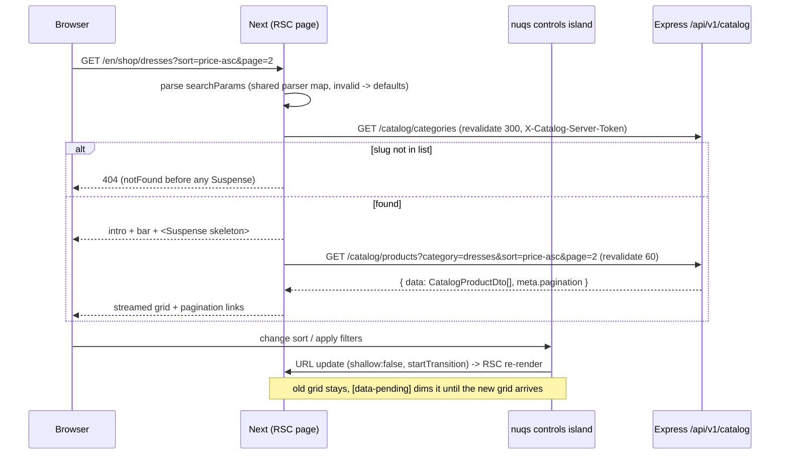
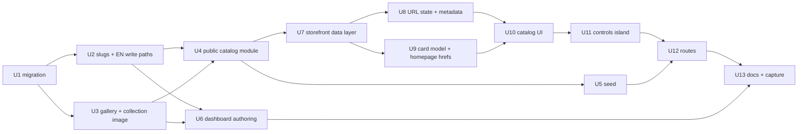

# feat: Moon Fashion storefront Shop + Collections

Targets `apps/server`, `apps/dashboard` and `apps/storefront`. All paths are relative to the
repository root.

## Overview

The homepage is frozen and merged (`docs/plans/2026-09-14-001-feat-storefront-homepage-polish-freeze-plan.md`).
Every commerce link it carries (`/shop`, `/new-in`, `/collections`, `/collections/<key>`,
`/shop/<product>`) still 404s through the catch-all. This plan builds the first real
browsing surface: Shop All, category pages, New In, the collections index and editorial
collection pages. It also starts the move from static mocks to the real Express API.

Research changed the shape of the work. **The server has no public catalog today**: every
product, category and collection read requires a staff token, and every one of those
responses includes `cost_price`, supplier and reorder columns. Products have one `name`
string (Arabic), no slug, one `image_url`, no compare-at price and no "new" flag.
Categories and collections are separate tables with no slugs. So this is a three-app
feature: a small public read module plus schema additions on the server, the matching
authoring fields in the dashboard, and the storefront pages on top.

Seven decisions were made with the user during planning and document review (2026-09-14) and shape everything
below:

| # | Decision | Effect |
|---|---|---|
| UD-1 | Build a public read-only catalog module now | New `/api/v1/catalog/*` routes return whitelisted fields only; the storefront consumes the real API from day one |
| UD-2 | Add optional English fields | `name_en` (and `description_en` where a description exists) on products, categories and collections; the storefront falls back to `name` |
| UD-3 | URL model: `/shop/[category]` for categories, `/collections/[slug]` for editorial collections, products move to `/products/[slug]` | The product card href and the homepage category/hero hrefs change (a shared integration fix, not a redesign) |
| UD-4 | Add a product image gallery now | `product_images` table, gallery upload/delete/reorder in the dashboard, media sweep updated; the card's hover swap works with real data |
| UD-5 | Per-shopper rate limiting lives at the edge; the API hardens its queries | B-9 requires a CDN/WAF/reverse-proxy limit in front of Next; the API caps `page`, snaps price bounds, adds listing indexes and a statement timeout (KD-5, KD-17) |
| UD-6 | Keep collection image upload | Collections gain the product-style single image upload so the collection intro band is authorable (R10b) |
| UD-7 | In-stock pieces first | Within `newest` and price sorts, available products sort before sold-out ones; `curated` is untouched (KD-4) |

## Problem Frame

Moon Fashion needs a browsing experience that reads as a continuation of the homepage:
editorial, image-first, spacious, quick. It must not look like a marketplace, an admin
inventory list or a SaaS filter panel. The homepage owns cinematic storytelling; Shop and
Collections are calmer and product-led, with "Medium" motion for collection pages and less
for plain listing (guideline §14).

Browsing has to be honest about the data that actually exists. No "Sale" badge without a
sale price, no size or colour filter without a size or colour vocabulary, no "Best selling"
without sales-ranking data. What the domain does support is: categories (flat), editorial
collections with a merchandised order (`collection_products.position`), a single price,
stock (per product or summed across variants), `created_at`, and collection
status/season/year.

The storefront itself has strong conventions to preserve: Server Components by default and
a counted list of client boundaries, an `apiFetch` → `{ data, meta }` client with a typed
`ApiError`, DTO types that never mirror server internals, locale routing through
`@/i18n/navigation`, `--surface-*` token indirection, the `Reveal` trigger model, and
message-parity tests.

## Requirements Trace

**Routes and information architecture**
- R1. `/[locale]/shop` lists every active product, newest first, paginated. *(U4, U11, U12.)*
- R2. `/[locale]/shop/[category]` lists one category's products; an unknown slug is a real 404, and a known category with no active products shows an empty state, never a 404. *(U4, U10, U12.)*
- R3. `/[locale]/new-in` is derived from product `created_at` (no duplicated product lists). *(U4, U12.)*
- R4. `/[locale]/collections` lists live editorial collections; `/[locale]/collections/[slug]` shows one, in its merchandised order; unknown, upcoming or archived collections are 404s. *(U4, U12.)*
- R5. Categories and collections stay distinct concepts in URLs, API and UI. One listing endpoint and one grid serve every route; there is one routing system. *(U4, U8, U12.)*
- R6. The homepage links resolve: category tiles and category hero slides point at `/shop/<category>`, collection slides and the promo banner at `/collections/<slug>`, and product cards at `/products/<slug>` (which 404s until the product detail task). No visual change to the homepage. *(U5, U9, U13.)*

**Data and API**
- R7. Public catalog reads need no token, return only whitelisted fields (never cost, supplier, reorder, ABC, SKU or barcode), and pass every existing CI gate (request contracts, API docs drift, manifest authorization). *(U4.)*
- R8. Public reads carry a named abuse control consistent with `apps/server/CLAUDE.md` → *Postponed modules*. Storefront server-side traffic, which arrives from one IP, must not share an anonymous per-IP bucket; per-shopper limiting is an edge requirement (UD-5). *(U4.)*
- R9. Products, categories and collections gain stable, unique, URL-safe slugs and optional English names/descriptions, authorable in the dashboard. *(U1, U2, U6.)*
- R10. Products gain an ordered gallery; the card shows the primary image and crossfades to the second on desktop hover. POS behaviour, which reads `products.image_url`, is unchanged. *(U1, U3, U6, U9.)*
- R10b. Collections carry an optional authorable image shown in the collection intro. *(U3, U6, U10.)*
- R11. The storefront preserves page → feature API function → `apiFetch` → `/api/v1`; UI components never call `apiFetch` directly; DTO types model the API response, not server types. *(U7.)*

**Browsing behaviour**
- R12. Filters are limited to real data: availability (in stock) and price range, plus category navigation on Shop All. Sorts are limited to real data: newest, price low→high, price high→low, and "curated" (collection position) on collection pages. *(U4, U8, U11.)*
- R13. Filter, sort and page state lives in the URL and survives refresh, copy/paste and back/forward. Malformed values fall back to defaults and never crash or 500. *(U8, U11, U12.)*
- R14. Pagination is numbered and server-rendered, uses real links, and has an accessible current-page state. *(U8, U10.)*
- R15. Loading shows stable skeletons for first navigation and a subtle pending state while filters change; empty states exist for an empty catalog, zero filter results, an out-of-range page and an empty collection; errors never leak technical messages and offer retry. *(U10, U11, U12.)*

**Quality**
- R16. EN and AR ship together: every string in both catalogues, the Arabic feminine-singular register, ICU plurals for counts, logical properties, mirrored arrows, unmirrored photography, long Arabic names that wrap cleanly. *(U10, U11, U12.)*
- R17. Composed intentionally at 320, 375, 768, 1024 and 1440; no horizontal overflow. *(U10, U11, U13.)*
- R18. WCAG 2.2 AA: a semantic product list, a heading hierarchy, meaningful alt text, an accessible filter dialog with focus management, announced result changes, a native-keyboard sort, accessible pagination, ≥44px targets, reduced motion. *(U9, U10, U11.)*
- R19. Metadata per route: localized title and description, a canonical, `en`/`ar` alternates; filtered or sorted URLs are `noindex, follow`; paginated pages stay indexable with a self canonical. *(U8, U12.)*
- R20. Performance: `next/image` with honest `sizes`, only the first row eager, no hover image downloaded on touch, no `motion/react`, catalog client JS limited to one controls island and one error boundary. *(U7, U9, U11, U13.)*
- R21. Motion is low-to-medium: a single grid rise, the hover swap, a drawer transition, a restrained heading fade. No parallax, marquee or word-masked headings on these routes; filter changes never replay entrances. *(U10, U11.)*

## Scope Boundaries

- No product detail page (`/products/[slug]` 404s through the catch-all), cart, checkout, payment, authentication, account, order history, wishlist, reviews, recommendations, CMS, FAQ, blog, about or newsletter.
- No homepage redesign. The only homepage changes are hrefs and the product card's data seam (U9), verified by re-running the freeze capture.
- No size or colour filter and no colour swatches: `product_variants.attributes` is free-form key/value text with no vocabulary.
- No "Sale" badge or compare-at price: no sale price exists. A collection's `on_sale` status describes the collection, not a product price.
- No full search. The listing function takes a query object so a future search page can add `q` without a second data path.
- No `sitemap.ts`, `robots.ts` or Open Graph image generation.
- No `cacheComponents` / `use cache`. That is an app-wide switch and belongs to its own decision.
- No browser-side catalog calls, so no CORS change: every catalog read happens in Server Components.
- No slug redirect history. Changing a slug breaks old links, and the dashboard says so next to the field.
- No in-app per-shopper rate limiting for storefront traffic: it is an edge responsibility (UD-5, B-9).

### Deferred to Separate Tasks

- The product detail page and its gallery viewer (the gallery data lands here).
- A size/colour attribute vocabulary on variants, then size/colour filters and swatches.
- Search (`/search`), which reuses the listing function with `q`.
- `aria-current` on header nav items: the header has no pathname today, and adding one means a client boundary (or passing the segment down).
- A sitemap covering categories, collections and products.
- Variant price ranges ("from 1,250 EGP") if variants start overriding price.
- Catalog listing cost (review decision, 2026-09-14): each request runs its scoped join+aggregate twice (count/priceRange, then the page) and pins one pooled connection (production pool 20, shared with POS) across 3-4 queries. Revisit with the B-9 launch load review: fold both into one window-aggregate CTE, and move the gallery lookup off the pinned connection.

## Context & Research

### Relevant Code and Patterns

**Server**
- `apps/server/src/database/migrations/001_initial_schema.sql`: `products` (`name`, `sku`, `price NUMERIC`, `cost_price`, `stock`, `category_id`, `status`, `image_url`, `has_variants`, `created_at`), `product_variants` (`stock`, `price` nullable, free-form `attributes`), `categories` (`name UNIQUE`, `code UNIQUE`, `description`), `collections` (`name`, `description`, `image_url`, `season`, `is_featured`, `status`, and `year` from 008) and `collection_products` (`position UNIQUE(collection_id, position)` from 006). The latest migration is `013_customer_credit_ledger`, so the next is `014`.
- `apps/server/src/modules/inventory/products/repository.ts`: `list()` builds its WHERE clause by hand and selects `p.*`. `lookup()` shows the explicit column-list style a public projection should use.
- `apps/server/src/modules/inventory/products/types.ts` → `productListQuerySchema` (strict Zod, `page`, `pageSize` enum, `sortBy`/`sortOrder`) and `apps/server/src/http/pagination.ts` (`meta.pagination = { page, pageSize, totalItems, totalPages, hasNextPage, hasPreviousPage }`).
- `apps/server/services/productService.ts`: the legacy service the products module calls for create (`INSERT INTO products`) and CSV import (`ON CONFLICT(sku) DO UPDATE` inside `withTransaction`). `apps/server/validators/{productSchema,categorySchema}.ts`. `apps/server/middleware/cache.ts` (`cacheControl`, always `private`).
- `apps/server/tests/support/pgMem.ts` → `toPgMemCompatibleSql`: strips tagged backfill blocks pg-mem cannot parse (BACKFILL_012). pg-mem 3.0.14 has no `regexp_*` functions.
- `apps/server/src/storage/localDriver.ts`: `baseUrl` defaults to relative `/uploads`; `MEDIA_PUBLIC_BASE_URL` is optional in `env.ts`.
- `apps/server/src/modules/commerce/storefront/routes.ts`: the only public route today (`GET /storefront/banners`, `cacheControl(60)`); every other storefront route is Admin-gated.
- `apps/server/src/http/endpointManifest.ts`: `publicEntry([...])` prefixes, `publicAuth`, route entries with classification letters (`B` bounded read, `P` paginated, `M` mutation).
- `apps/server/src/http/rateLimits.ts`: one global limiter (200 per 15 min) keyed by verified JWT user or `ip:`, `resolveCeiling`, `isRateLimitExempt` for health probes.
- `apps/server/src/app.ts`: CORS allowlist (requests with no `Origin`, such as Next server fetches, are allowed), `/uploads` static mount.
- `apps/server/src/storage/keys.ts` (`PRODUCT_IMAGE_PREFIX`, `productImageKey`), `upload.ts`, and `apps/server/src/modules/inventory/products/routes.ts` → `POST /:id/image` (`uploadRateLimit`, `upload.single('image')`, `validateImageBytes`).
- `apps/server/src/scheduler/mediaSweep.ts` → `REFERENCED_URLS_SQL`: **"Adding a table with an image URL means adding it here."**
- `apps/server/src/docs/openapi.ts` (hand-written spec), `apps/server/src/docs/requestContracts.ts`, `tests/requestContractCoverage.test.ts`.
- `apps/server/src/database/seed.ts`: 11 Arabic categories with codes (`DRS`, `KNT`, `BAG`, `TOP`, `ABA`, …); no collections seeded.
- `apps/server/tests/support/realPostgres.ts` → `describeWithPostgres`; `tests/concurrency/collections.concurrency.test.ts` is the closest sibling.

**Dashboard**
- `apps/dashboard/src/features/inventory/components/inventory/ProductFormDialog.tsx`: single image upload after the product exists (`assetUrl(image_url)`). Inputs are HeroUI and need `Controller` for programmatic values (root *Learnings*).
- `apps/dashboard/src/features/inventory/pages/Collections.tsx` (name, season, year, status, description) and the categories form (name, code).

**Storefront**
- `apps/storefront/lib/api/client.ts`: `apiFetch<T>` returns `{ data, meta }` (meta is kept), `credentials: 'omit'`, `timeoutMs` (a server caller that passes one gives up memoization), `next` fetch options. `lib/api/errors.ts`: `ApiError` codes. `lib/api/endpoints.ts`: only `API_PREFIX`.
- `apps/storefront/lib/query/get-query-client.ts` and `providers/app-providers.tsx`: `NuqsAdapter` is mounted; nuqs 2.10.1 has no usages yet (`createLoader`, `createSerializer` and `createSearchParamsCache` are available).
- `apps/storefront/app/[locale]/layout.tsx`: `generateMetadata` with a title template, no `metadataBase`, no `alternates`. `app/[locale]/[...rest]/page.tsx`: `notFound()` catch-all. No `loading.tsx` or `error.tsx` anywhere.
- `apps/storefront/features/products/components/product-card.tsx`: 4:5 frame, `.hover-alt-image` (CSS `display:none` outside `(hover:hover) and (min-width:768px)`, so touch never loads it), `CATALOG_CARD_SIZES`, name as link text, `New` label at top-start, `reveal` prop. Typed to `HomeProductMock` and static `CatalogSlot` images.
- `apps/storefront/features/collections/components/category-tile.tsx`, `features/collections/data/home-categories.ts` (hrefs `/collections/<key>`), `features/home/data/hero-slides.ts` (`/collections/evening|linen|abayas|knitwear`), `features/home/data/promo-banner.ts` (`/collections/silk`).
- `apps/storefront/features/products/utils/price.ts` → `formatPrice` (Western digits, trailing localized currency label).
- `apps/storefront/components/ui/{button,container,editorial-link}.tsx`; `components/motion/reveal.tsx` (`data-motion`, `--motion-stagger`); `components/layout/mobile-menu/mobile-menu.tsx` (the Headless UI Dialog pattern).
- `apps/storefront/app/globals.css`: `type-*` utilities, `--page-gutter` (20/32/48/64), `--container-max: 1440px`, the `[data-strip]:has([data-strip-toggle]:checked)` pattern, and `@layer components` motion rules.
- `apps/storefront/messages/messages.test.ts` (key, placeholder and non-empty parity); `vitest.config.ts` (`node`, `.test.ts` only, no jsdom).
- `apps/storefront/node_modules/next/dist/docs/01-app/03-api-reference/03-file-conventions/{page,loading,error,not-found}.md` and `04-functions/generate-metadata.md`: see *External References*.

### Institutional Learnings

`docs/solutions/` does not exist. The relevant learnings live in the root `CLAUDE.md` and `apps/storefront/CLAUDE.md`:

- **Zod strips unknown keys.** A field missing from a request schema never reaches the service, while service-level tests stay green. Test new fields (`slug`, `name_en`, `description_en`) at the HTTP boundary.
- **pg-mem returns `NUMERIC` as a number; node-postgres returns a string.** The public mapper must convert `price` explicitly (`Number(...)`) and be proven on real PostgreSQL. pg-mem also omits `err.constraint`, so slug-collision retry logic that narrows by constraint name needs a real-PG suite.
- **HeroUI inputs hold their own value.** New dashboard fields that are auto-filled (the slug suggestion) must use `Controller`.
- **`useSearchParams` in a prerendered client component needs a Suspense boundary or the build fails.** The controls island reads URL state through nuqs, so it sits inside Suspense.
- **The motion/react import cost** (~46 KB gz): nothing in the catalog imports it.
- **Homepage performance lessons:** hidden hover images must not download on touch (already solved in CSS); lazy loading isn't enough for off-screen but laid-out media; measure eager chunks after touching client islands.
- **A hero streamed behind Suspense on a future page would leave the header in overlay** (homepage review advisory). Catalog pages have no header boundary, so they're solid; the header-boundary attribute must not appear inside a streamed catalog subtree.
- **`e2e` deletes every row and runs the orphan sweep against a temp root.** A new image table that is missing from `REFERENCED_URLS_SQL` would lose gallery files in production, not in e2e.

### External References

From `apps/storefront/node_modules/next/dist/docs` (Next 16.3.5):
- `page.md`: `searchParams` is a `Promise`; reading it makes the route render at request time.
- `loading.md`: a `loading.js` wraps the page in Suspense, and a streamed response returns `200`. `not-found.md`: `notFound()` returns a real `404` only for non-streamed responses. Call it before any Suspense boundary or suspending `await`.
- `error.md`: error boundaries are Client Components; `retry()` is preferred over `reset()`.
- `generate-metadata.md`: `params`/`searchParams` are Promises; fetches are memoized across metadata and page when the request is identical (no `signal`).
- `fetch.md` / `caching-without-cache-components.md`: without `cacheComponents`, `fetch` is not cached by default; `next: { revalidate }` opts a request into the data cache.
- `images.md`: remote images need `remotePatterns`, and `qualities` is required in Next 16. `placeholder="blur"` on remote images needs `blurDataURL`. `dangerouslyAllowLocalIP` defaults to `false`, so the optimizer refuses `localhost` and private-network upstreams.
- nuqs 2.10 (`node_modules/nuqs`): `createLoader`/`createSerializer`/`parseAs*` share one parser map between server and client; `shallow: false` re-runs the Server Component; the `startTransition` option exposes the pending state.

## Approvals Required (not engineering)

| ID | Decision | Locations | Options | Recommendation | Gates |
|---|---|---|---|---|---|
| B-6 | Catalog content readiness: every launch product needs `name_en`, a readable slug, a 4:5 primary image and a second image | dashboard data entry | Enter before launch / launch with Arabic names in EN | Enter before launch; the storefront falls back safely either way | Launch, not merge |
| B-7 | "New" window | `apps/server/src/modules/commerce/catalog/constants.ts` | 14 / 30 / 60 days | 30 days; one constant drives both the badge and `/new-in` | Merge (default 30) |
| B-8 | Collections to launch with (`evening`, `linen`, `silk` are linked from the homepage) | dashboard data entry, seed | Create them / change hrefs | Create them; seed creates them for dev | Launch; closes B-5 when `silk` exists |
| B-9 | Production edge and env: a per-client rate limit (CDN/WAF/reverse proxy) in front of Next (UD-5); `TRUST_PROXY` hop count for the actual topology (assumed: Next → API over a private network, browsers never reach the API); `CATALOG_RATE_LIMIT_MAX`, `CATALOG_SERVER_RATE_LIMIT_MAX`, `CATALOG_SERVER_TOKEN` (≥32 random bytes); absolute `MEDIA_PUBLIC_BASE_URL` | deployment env | — | Set all of these before the storefront goes public; the API refuses to boot in production without an absolute media base | Launch |
| AD-12 | Catalog page intro and filter bar composition, reviewed on screenshots | U10–U13 capture | — | The composition described in *High-Level Technical Design*, adjusted after review | Freeze of Shop + Collections |

Existing launch blockers carry forward unchanged: B-1 delivery wording, B-2 returns
(neutralised), B-3 payment assurance, B-4 Arabic native-speaker review (now also covering
catalog strings), and `CONTACT_IS_PLACEHOLDER` footer contact details. B-5 (`/collections/silk`)
closes when B-8's `silk` collection exists.

## Key Technical Decisions

**KD-1. The public catalog is its own module and prefix: `apps/server/src/modules/commerce/catalog`, mounted at `/api/v1/catalog`.**
The storefront module is postponed and Admin-gated by policy. Adding public reads there
would mix a live public surface into a dormant admin one, and the manifest prefix
`/api/v1/storefront` already admits mutations. A separate prefix registered with
`publicEntry(['B', 'P'])` makes "nothing under this prefix writes" structurally checkable.
Routes:

| Route | Class | Purpose |
|---|---|---|
| `GET /api/v1/catalog/products` | P | The one listing: all, by category, by collection, new; filters, sort, page |
| `GET /api/v1/catalog/categories` | B | Every category with its active `productCount` (including 0); the nav hides empty ones, the page does not 404 on them |
| `GET /api/v1/catalog/collections` | B | Live collections (`active`, `on_sale`), featured first |
| `GET /api/v1/catalog/collections/:slug` | B | One live collection's editorial metadata (no products) |

A category is resolved from the categories list, not a fourth detail route: there are about
11, the list is cached, and the page needs the list anyway for the category navigation row.

**KD-2. The whitelist lives in the repository SQL and a mapper, and a test pins the response key set.**
No CI gate inspects responses, so `SELECT p.*` is banned in this module: every query names
its columns, and a mapper builds the DTO. A test asserts `Object.keys` of each DTO equals the
documented set, so a future `p.*` or a new column cannot leak cost.

**KD-3. Public product DTO (directional):**
`{ slug, name, nameEn|null, price:number, images:[{ url }] (at most 2 in lists), isNew:boolean, inStock:boolean }`. No numeric `id` (the storefront keys on slug, and sequential ids expose catalog size) and no `categorySlug` (no unit consumes it).
- `price` is `products.price`, converted with `Number()` (the NUMERIC string learning).
- `images` is `[image_url, ...gallery by position]` with nulls removed, truncated to 2 in lists. With no primary, the first gallery image becomes `images[0]`; with neither, `[]`.
- `url` is made absolute on the server from an absolute `MEDIA_PUBLIC_BASE_URL`, **never from the request `Host` or `X-Forwarded-Host`** (a forged host would poison publicly cached responses). Absolute stored URLs (S3) pass through unchanged. In production the app refuses to boot when the base is missing or relative; dev falls back to `http://localhost:3001/uploads`. The storefront never resolves URLs itself. The frame is CSS aspect-ratio, so no width/height.
- `isNew` is `created_at >= now() - NEW_IN_DAYS` (B-7), computed in SQL.
- `inStock` is `has_variants ? SUM(variant.stock) > 0 : stock > 0`.
- `status = 'active'` is always enforced; inactive and discontinued products never appear.
- No SKU, barcode, stock count, cost, supplier or category id.

Category DTO: `{ slug, name, nameEn|null, description|null, descriptionEn|null, productCount }`.
Collection DTO: `{ slug, name, nameEn|null, description|null, descriptionEn|null, season|null, year|null, imageUrl|null, isFeatured, productCount }`, where `productCount` counts active products only, as for categories.
`upcoming` and `archived` collections are invisible (404 on detail, absent from the list), and
their 404 body is byte-identical to an unknown slug's, so slugs can't be probed for unreleased
collections. `on_sale` is not exposed as a label (it would imply prices the data doesn't have).

**KD-4. One listing endpoint, one query grammar (flat camelCase, strict, following the 2026-08-22 listing plan):**
`page` (1–500), `category` (slug), `collection` (slug), `new=true`, `inStock=true`, `priceMin`,
`priceMax` (non-negative integers, whole EGP, multiples of 50), `sort` (`newest` | `price-asc` | `price-desc` | `curated`).
`pageSize` is fixed at **24** server-side (divisible by 2, 3 and 4 columns) and is not a
parameter, which bounds cost. Rules:
- `category`, `collection` and `new` are mutually exclusive (400).
- `curated` requires `collection` (400) and is the default when `collection` is present; otherwise the default is `newest`.
- `priceMin > priceMax` is a 400 at the server. The storefront normalizes before sending, so shoppers never see it.
- Unknown `category` or `collection` slug returns 404 `NOT_FOUND`, not an empty list, so a stale link can't masquerade as "no results".
- `newest` and price sorts put in-stock products first (UD-7): `in_stock DESC`, then the sort, then `id`. `curated` orders by `position, id` only.
- `meta.priceRange { min, max }` gives the scope's active price bounds ignoring the price filter, computed in the same aggregate as the count; the filter sheet uses it as a hint.
- Out-of-range pages return empty `data` with correct meta (the existing contract).

**KD-5. Abuse control: a dedicated catalog limiter with a trusted storefront-server bucket.**
Every SSR request reaches Express from the Next server's IP. Under the global per-IP limiter,
all shoppers would share 200 requests per 15 minutes and the site would start returning 429s
at modest traffic. So:
- `/api/v1/catalog/*` GETs and HEADs are exempt from the global limiter (added beside the health exemption, sharing its "predicate in one place" rationale) and use `catalogRateLimit`. The predicate matches `^/api/v1/catalog(/|$)` case-insensitively, built from the same exported prefix constant the router mount uses, so a lookalike sibling prefix isn't exempt and an uppercase path can't spend both budgets.
- `catalogRateLimit` keys a request carrying a valid `X-Catalog-Server-Token` to one `catalog-server` bucket with a high ceiling (`CATALOG_SERVER_RATE_LIMIT_MAX`). Everything else keys per IP with `CATALOG_RATE_LIMIT_MAX`.
- Token check: compare the SHA-256 of the header with the SHA-256 of each configured token using `timingSafeEqual` (equal lengths by construction, so no length leak and no throw). A missing, repeated or non-string header counts as no token. `CATALOG_SERVER_TOKEN` accepts a comma list (current and next) for rotation, and `env.ts` rejects any entry shorter than 32 bytes. A production boot refuses to start when it is unset unless `CATALOG_PUBLIC_ONLY=true`, and that opt-out logs a warning in the style of `logRateLimitOverrides` (review decision, 2026-09-14).
- **This bucket is not a per-shopper limit.** Every shopper's SSR request lands in it, so one client varying query values could spend it. Per-client limiting is an edge responsibility (UD-5, B-9), and KD-17 keeps each uncached request cheap.
- Unset token: the trusted bucket doesn't exist, and every request is per-IP. That's safe for dev and fails closed in production (B-9).
- The storefront sends the token from `API_URL` server fetches only. It is server-only env and never `NEXT_PUBLIC_`.
- This is the "named abuse control" `apps/server/CLAUDE.md` requires. Reads have no side effects, so no hold cap applies.
- Successful (2xx) catalog responses send `Cache-Control: public, max-age=60`; every other status sends `no-store`, so a 404, 429 or 500 is never shared-cached. The limiter is mounted before the cache middleware.

**KD-6. Slugs: a column on each table, unique, admin-editable, generated when absent.**
- Pattern `^[a-z0-9]+(?:-[a-z0-9]+)*$`, 1–80 characters, enforced in the Zod request schemas. pg-mem has no regex support, so there is no database `CHECK`.
- The column is **nullable with a `UNIQUE` index**. `NOT NULL` would break the legacy `productService` create and import inserts, the seed and about 60 raw test-fixture inserts, and a collection's id-based fallback isn't known before its row exists. The public catalog only returns rows with `slug IS NOT NULL`.
- Migration backfill runs inside a tagged `DO $backfill_014$` block that `toPgMemCompatibleSql` strips (the BACKFILL_012 pattern). Products and categories slugify `sku` / `code` (lowercase, non-alphanumerics to hyphens, trimmed, `left(…, 70)`). An empty result becomes `product-<id>` / `category-<id>`; a value shared by more than one row (`count(*) OVER (PARTITION BY …) > 1`) gets `-<id>` appended. Collections get `collection-<id>`.
- Product slugs backfilled from SKUs republish an internal code in URLs. Accepted as temporary: B-6's content pass replaces them with `name_en`-derived slugs before launch.
- On create without a slug, the service picks the first free candidate from `name_en`, then `sku`/`code`, in one statement (`INSERT … SELECT` over `base`, `base-2` … `base-10` `WHERE NOT EXISTS`). A collection with neither gets `collection-<id>` through `UPDATE … RETURNING` in the same transaction.
- A concurrent race that still hits `23505` on the slug constraint is retried inside a `SAVEPOINT`. A unique violation aborts the enclosing transaction, which matters inside CSV import. This path is proven on real PostgreSQL.
- The seed sets readable slugs for categories (`dresses`, `tops`, `knitwear`, `bags`, `abayas`, …) so the homepage hrefs resolve in dev.
- Arabic names are never transliterated: slugs are ASCII from `name_en` or the operator's input.

**KD-7. English fields are nullable columns, not a translations table.**
Only two locales exist, one of them primary (`name`). `name_en` / `description_en` on three
tables is the smallest honest model. A translations table is justified only by a third locale.
The storefront's `localizedName(dto, locale)` returns `nameEn ?? name` for `en` and `name`
for `ar`.

**KD-8. Gallery: `product_images` holds additional images; `products.image_url` stays the primary.**
POS, lookup and the dashboard already read `image_url`. Moving the primary into the new table
would ripple through checkout code for no browsing benefit.
- `product_images(id, product_id FK ON DELETE CASCADE, image_url, position, created_at, UNIQUE(product_id, position))`, capped at 8 per product in the service.
- Routes (Admin, `uploadRateLimit`, `validateImageBytes`): `POST /products/:id/images` appends, `DELETE /products/:id/images/:imageId` removes the row then the object best-effort, and `PUT /products/:id/images/order` takes the complete ordered id list and rewrites positions in one transaction, rejecting a list that doesn't match the current set.
- `REFERENCED_URLS_SQL` gains `UNION SELECT image_url FROM product_images`.
- Keys reuse `productImageKey` (the `products/` prefix the sweep already lists).
- Collections gain (UD-6, R10b) the same single-image upload products have (`POST`/`DELETE /collections/:id/image`) so the collection page's optional visual is authorable. Its key also uses the `products/` prefix, which the sweep scans; renaming the prefix is not this plan's job.

**KD-9. Rendering: request-time Server Components with data-cache revalidation; the URL is the only catalog state.**
- Pages read `searchParams`, so they render per request. `/collections` reads none, so it calls `await connection()` to render at request time as well. No catalog route calls the API during `next build`.
- Catalog fetches opt into the Next data cache: `revalidate: 60` for product lists, `300` for categories and collections.
- No TanStack Query for the catalog: the server render is the source of truth, and a client cache would be a second one.
- Filter and sort changes go through nuqs with `shallow: false` and `startTransition`: the URL updates, the Server Component re-renders, and React keeps the current grid visible, marked pending, until the new one streams.
- Pagination is plain `Link`s rendered on the server.

**KD-10. Entity first, grid in Suspense: real 404s and no layout jump.**
- Routes with a slug resolve their category or collection before rendering anything that suspends, and call `notFound()` first. That keeps a real `404` status, since a `loading.tsx` would stream a 200.
- The heading renders immediately. The product grid is an async component inside `<Suspense>` with a skeleton of the same card geometry.
- No `loading.tsx` on catalog routes. `/shop` and `/new-in` follow the same shape for consistency.
- This is an invariant recorded in `apps/storefront/CLAUDE.md`: no `loading.tsx` at or above a catalog segment, and the entity is resolved in the page body before any JSX that suspends. A later `loading.tsx` would silently turn every 404 into a streamed 200.
- The Suspense boundary is not keyed by search params. A key would replace the grid with the skeleton on every filter change; without one, transitions keep the old grid with the pending treatment.

**KD-11. URL state grammar (storefront), one parser map shared by server and client (`features/catalog/search-params.ts`):**
`?sort=newest|price-asc|price-desc|curated&stock=in&min=500&max=3000&page=2`
- Short storefront names, mapped to the API's `inStock`/`priceMin`/`priceMax` in one function. The public URL grammar can change without an API change, and vice versa.
- Defaults are omitted from URLs (`clearOnDefault`).
- Invalid `page` and `sort` values parse to the default (`page=0`, `page=abc`, `page=501`, `sort=best`). Invalid `min`, `max` and `stock` values are dropped (`min=-5`, `stock=yes`). `min>max` is swapped. `curated` outside a collection becomes the route default.
- Price bounds snap to 50 EGP steps (min down, max up). Eastern Arabic and Persian digits and thousands separators are normalised before validation.
- Any change other than `page` resets `page`.
- Category is a path segment only. `/shop?category=` is not a thing, so there is one routing system (R5).

**KD-12. Slices: a new `features/catalog` composition slice; entity DTOs and API functions stay in their entity slices.**
- `features/products`: `types/catalog-product.ts` (DTO), `api/list-catalog-products.ts`, `utils/localized-name.ts`, and the generalized `ProductCard`.
- `features/collections`: `types/{catalog-category,catalog-collection}.ts`, `api/{list-catalog-categories,list-catalog-collections,get-catalog-collection}.ts`, and a `CollectionCard` for the index.
- `features/catalog` composes both, the way `features/home` does: page intro, category nav, grid, pagination, controls island, empty/error states, search-param parsers and the metadata builder.
- `products` and `collections` still never import each other.
- Shared API plumbing (the server token header, revalidate presets) sits in `lib/api/catalog.ts`, which the entity API functions call. UI never imports `apiFetch`, and the server owns image URLs (KD-3).

**KD-13. `ProductCard` takes a view model, not a data source.**
`ProductCardModel = { href, name: { text, lang }, price, primary: ImageSource|null, secondary: ImageSource|null, badge: 'new'|'soldOut'|null }`,
where `ImageSource` is a static import (homepage) or a remote URL (catalog).
- The homepage maps `HomeProductMock` to the model; the catalog maps the DTO to the model.
- Rendering, classes and motion are unchanged, so the homepage is visually identical, verified by the freeze capture.
- Blur is kept for static imports and omitted for remote images, which use the existing `bg-surface-soft` frame fill.
- One badge at most (guideline §11). `soldOut` wins over `new`, and the price stays visible (§17, "visible product prices"). The sold-out label is `text-text-secondary` on `bg-bg`, and so is the price; the photograph is never greyed.
- A missing image renders the 4:5 `bg-surface-soft` frame with the brand mark (`public/brand/moon-fashion-mark.png`) small and low-opacity at its centre. That keeps it distinct from the skeleton, which is a flat tone with no mark.
- `name` carries its language. `localizedName` returns `{ text, lang }`, and an Arabic fallback on an English page renders in `<span lang="ar" dir="auto">`: `:lang(ar)` switches to Tajawal, the bidi run is isolated from the price, and screen readers use an Arabic voice.
- Card text layout is unchanged: the existing wrap, no line clamp, no phone-specific price line. This keeps U9's no-diff expectation.

**KD-14. Client boundaries: +2 (from 7 entries to 9).**
- `features/catalog/components/catalog-controls.tsx`: sort select, filter button, the Headless UI filter Dialog, the active-filter summary and the pending flag. One module, one boundary; it receives resolved strings as props, and pagination and category nav stay server-rendered.
- `app/[locale]/(catalog)/error.tsx`: error boundaries must be client components (Next docs). Every catalog page lives under the `(catalog)` route group (URLs unchanged), so this one file covers all five routes.
  - Its strings come from `(catalog)/layout.tsx`, which wraps the segment in a nested `NextIntlClientProvider` holding only the `catalog.error` messages. That is a recorded, single-namespace exception to `messages={null}`; no client file calls `useTranslations` for anything else.
  - The layout fetches nothing, so it can't throw past its own boundary.
- Both are added to `apps/storefront/CLAUDE.md` → *Client boundary rule*.

**KD-15. Filter UX: a quiet bar and a sheet, never a sidebar.**
- The listing page is at most 4 columns of 4:5 photography. A permanent sidebar would steal a column for two controls (availability and price) and read as admin/SaaS.
- Two rows sit under the intro at every width, separated by one hairline.
  - Row 1 is the category nav (Shop All and category pages only): text links, `aria-current` on the active one, horizontally scrollable with scroll-snap and an inline-end fade mask at every width, since 11 categories never fit one row at 1024.
  - Row 2 is the utility row: the result count at the start, then `Filter` (with an active count) and a native `<select>` for sort at the end.
- Filters open a Headless UI `Dialog`: an inline-end side sheet ≥768px (mirrors in RTL), a bottom sheet below 768px. The bottom sheet is at most 85dvh with a scrollable body, a close button beside the heading, and `padding-bottom: env(safe-area-inset-bottom)`. Its sticky footer holds "Clear all" as a text link at the start and a full-width "Show results" at the end, and a focused price input scrolls into view above the keyboard.
- Inside the sheet, changes are staged and committed with "Show results". Price inputs don't re-render the grid per keystroke, and the button label shows nothing speculative (no pre-count request).
- "Clear all" resets. Active filters appear as one quiet `type-small` summary in the utility row ("In stock · 500–3,000 EGP"), each part an underlined remove control named "Remove: In stock", followed by "Clear".
  - No pill chips: with two filters, a counted button plus chips plus Clear says the same thing three times and reads as marketplace faceting.
  - The row's height is reserved, so applying a filter never shifts the grid.
- The utility row doesn't stick in v1. Whether phones below 1024 need a compact sticky Filter/Sort row is an AD-12 screenshot-review question.
- Sort commits immediately on change: a native select is keyboard- and screen-reader-complete with no custom listbox.

**KD-16. Page intro: calm, typographic, no hero.**
- Shop/New In/category: eyebrow (`type-label`), `h1` (`type-h1`, display face), and an optional one-line description on categories, with ~64–96px of breathing room before the bar.
- The eyebrow is a quiet link that doubles as the only breadcrumb: "Shop" → `/shop` on category pages and New In, "Collections" → `/collections` on a collection page (plain text on `/shop` and `/collections` themselves). After pagination, one editorial link keeps browsing going: "Explore all collections" on a collection page, "Shop by category" on New In. No full breadcrumb trail.
- Collection page: the same heading plus season/year as uppercase metadata (English only; `type-label` is not uppercased in Arabic) and a description capped at a readable measure.
- When the collection has `imageUrl`, a restrained image band sits beside the text ≥1024px (text 5 of 12 columns at start, 4:5 image at end, ≤560px tall) and above the text below 1024px (16:9, capped). No parallax, no scrim, no copy on the photograph, so there's no contrast dependency on unknown uploads.
- Headings fade the eyebrow and rise the title once (the AD-11 commerce entrance). No `TextReveal` word mask.

**KD-17. Query hardening (UD-5).**
- Migration 014 adds listing indexes: `products (status, created_at DESC, id)`, `products (status, price, id)`, `products (category_id, status)`, and `product_variants (product_id) WHERE stock > 0`. Measured (U4 EXPLAIN, 8,000 products): only `(status, created_at DESC, id)` was used (for `new=true`), so the other three were dropped from 014.
- Catalog repository queries run in a transaction with `SET LOCAL statement_timeout = '2s'`. A timeout maps to a 503, not a pinned connection.
- `page` is capped at 500, and price bounds must be multiples of 50 EGP (the storefront snaps before sending). That bounds OFFSET cost and cache-key fragmentation.
- A real-PG test runs the worst combination (`inStock` + price range + `price-desc` + a deep page) against a seeded volume and asserts it completes under the timeout.

## Open Questions

### Resolved During Planning

- *Public API or reuse of authed routes?* A public module (UD-1, KD-1).
- *English names?* Nullable `name_en` / `description_en` (UD-2, KD-7).
- *URL structure?* `/shop`, `/shop/[category]`, `/new-in`, `/collections`, `/collections/[slug]`; products at `/products/[slug]` (UD-3).
- *Hover image?* Gallery now (UD-4, KD-8).
- *Per-shopper rate limiting?* At the edge (UD-5); the API hardens its queries (KD-17).
- *Sold-out ordering?* In stock first, except curated (UD-7).
- *Collection image upload?* Kept (UD-6, R10b).
- *Is New In a collection, a filter or a route?* A route backed by `new=true` on the one listing endpoint, sorted newest. No stored list (KD-4).
- *Which filters?* Availability and price only; size and colour are excluded for lack of a vocabulary (Scope Boundaries).
- *Which sorts?* Newest, price both directions, curated for collections. No "Featured" on Shop All, because nothing ranks products.
- *Pagination model?* Numbered, 24 per page, server links. Infinite scroll and Load More lose URL/back fidelity or need client state.
- *Does the browser call the API?* No, so no CORS change (KD-9).
- *Is the slice rule compatible with a page that needs products and collections?* Yes, through the `catalog` composition slice (KD-12).
- *Should `SectionHeading` move to `components/`?* No. Catalog pages need an `h1`, and the intro lives in `features/catalog`. The CLAUDE.md sentence saying Shop/Collections headings use `SectionHeading` is corrected in U13.

### Deferred to Implementation

- The exact `sizes` strings for the 2/3/4-column grid. Derive them from the final gap values and verify against the capture's `currentSrc` widths.
- The exact `MEDIA_ORIGIN` wiring into `next.config.ts`: a build-time value equal to the server's `MEDIA_PUBLIC_BASE_URL` origin. Dev sets `images.dangerouslyAllowLocalIP: true` only when `NODE_ENV !== 'production'`, with `qualities: [75]`. Confirm that an unmatched origin fails visibly in dev.
- Whether `cacheControl` gains a status-aware public variant or the catalog module ships its own header middleware (2xx public, otherwise `no-store`). Pick whichever keeps the `apps/server/middleware/cache.ts` tests simplest.
- The exact first-row eager count per breakpoint (2 on phones, 3 or 4 on desktop). Measure LCP candidates in the capture.
- Whether KD-17's indexes are the right set. Confirm with `EXPLAIN` on real PostgreSQL against a seeded volume, and add or drop an index in 014 before merge.

## High-Level Technical Design

*Directional only; not implementation specification.*

### Request flow



### Route → API mapping

| Route | Resolves first | Listing query | Default sort | Filters | Category nav |
|---|---|---|---|---|---|
| `/shop` | categories (for nav) | — | newest | stock, price | yes |
| `/shop/[category]` | categories → slug or 404 (known but empty → empty state) | `category=` | newest | stock, price | yes (active item) |
| `/new-in` | — | `new=true` | newest | stock, price | no |
| `/collections` | collections list | — (no product grid) | — | — | no |
| `/collections/[slug]` | collection by slug or 404 | `collection=` | curated | stock, price | no |

### Layout sketches

```
>= 1024 (4 cols from 1280, 3 at 1024-1279)
+--------------------------------------------------------------------------+
| EYEBROW                                                                  |
| Dresses                                              (h1, display face)  |
| One restrained line of description                                       |
|--------------------------------------------------------------------------|  hairline
| All  Dresses  Tops  Knitwear  Bags  Abayas  Jackets  Shoes ...        >  |  scroll-snap row
|--------------------------------------------------------------------------|
| 86 pieces   In stock x  500-3,000 EGP x  Clear         Filter (2)  Sort v |
|                                                                          |
| [ 4:5 ] [ 4:5 ] [ 4:5 ] [ 4:5 ]                                          |
| Name    Name    Name    Name                                             |
| 1,250   2,400   980     3,100                                            |
| ...                                                                      |
|              <- Previous   1  2 [3] 4 ... 12   Next ->                   |
+--------------------------------------------------------------------------+

< 768 (2 cols)
+--------------------------+
| EYEBROW                  |
| Dresses                  |
|--------------------------|
| All Dresses Tops Kn... > |  scroll-snap row
| 86 pieces   Filter  Sort |
| [4:5 ] [4:5 ]            |
| Long Arabic   Name       |
| name wraps    1,250 EGP  |
|  <-  Page 3 of 12  ->    |  numbers collapse to "Page x of y"
+--------------------------+
```

### Grid composition

| Width | Columns | Column gap | Row gap | Notes |
|---|---|---|---|---|
| 320–767 | 2 | 12px | 32px | Existing card text wrap; long names wrap naturally with no line clamp |
| 768–1023 | 2 | 20px | 48px | Two larger columns read more premium than three cramped ones at a 28–32px gutter |
| 1024–1279 | 3 | 24px | 56px | |
| ≥1280 | 4 | 24px | 64px | Capped by `--container-max` |

## Implementation Units



### Phase A — Server

- [x] **Unit 1: Migration 014 — slugs, English fields, product gallery**

**Goal:** Add the columns and table the catalog needs, reversibly.

**Requirements:** R9, R10

**Dependencies:** None

**Files:**
- Create: `apps/server/src/database/migrations/014_storefront_catalog.sql`
- Create: `apps/server/src/database/migrations/014_storefront_catalog.down.sql`
- Modify: `apps/server/tests/support/pgMem.ts` (strip `BACKFILL_014`)
- Test: `apps/server/tests/database/storefrontCatalogMigration.test.ts`
- Test: `apps/server/tests/concurrency/storefrontCatalogMigration.realpg.test.ts` (the backfill itself, on real PostgreSQL)

**Approach:**
- Add a nullable `slug` with a `UNIQUE` index on `products`, `categories` and `collections`, and backfill it inside the tagged `DO $backfill_014$` block (KD-6). No `NOT NULL`, no database `CHECK`.
- Add KD-17's listing indexes.
- Add nullable `name_en` to all three, and `description_en` to `categories` and `collections`.
- Create `product_images` (KD-8), with an index on `(product_id, position)` covered by the unique constraint.
- The down migration drops the table and columns. It's lossy for authored English text and gallery rows, so say so in the file header, the way 013 does.

**Patterns to follow:** `013_customer_credit_ledger.sql` / `.down.sql` headers; `006` (position uniqueness); `apps/server/CLAUDE.md` → *Migration verification*.

**Test scenarios:**
- Happy path (real PG): after up, every existing product, category and collection has a slug matching the pattern, and all slugs are unique per table.
- Edge case (real PG): SKUs `ABC-1`, `abc 1` and `ABC_1` backfill to three distinct slugs (`abc-1-<id>` each); an Arabic-only SKU backfills to `product-<id>`; a 100-character SKU backfills to at most 80 characters.
- Edge case: inserting a duplicate slug raises a unique violation; inserting a row without a slug still succeeds, so legacy inserts and fixtures keep working.
- Integration: the pg-mem suites migrate through 014 with the backfill stripped.
- Happy path: deleting a product cascades its `product_images` rows.
- Integration: up → down → up leaves the schema identical (the CI migrations job).

**Verification:** `Migrations (up, down, re-apply)` passes; the pg-mem and real-PG suites migrate cleanly.

---

- [x] **Unit 2: Slug generation and English fields on the admin write paths**

**Goal:** Admins can set or receive slugs and English text for products, categories and collections through the existing Admin routes.

**Requirements:** R9

**Dependencies:** U1

**Files:**
- Create: `apps/server/src/modules/inventory/shared/slug.ts` (slugify, pattern, candidate list)
- Modify: `apps/server/services/productService.ts` (create and `importProducts` choose slugs; import resolves a slug collision without aborting its transaction)
- Modify: `apps/server/validators/productSchema.ts`, `apps/server/validators/categorySchema.ts`
- Modify: `apps/server/src/modules/inventory/products/{types,schemas,service,repository}.ts`
- Modify: `apps/server/src/modules/inventory/categories/{schemas,service,repository}.ts`
- Modify: `apps/server/src/modules/inventory/collections/{types,schemas,service,repository}.ts`
- Modify: `apps/server/src/docs/openapi.ts` (request and response schemas for the three resources)
- Test: `apps/server/tests/inventory/slug.test.ts`, `apps/server/tests/products.test.ts`, `apps/server/tests/collections.test.ts`, `apps/server/tests/inventory-bounded.test.ts` (categories)
- Test: `apps/server/tests/concurrency/catalogSlug.concurrency.test.ts`

**Approach:**
- Add `slug` (optional on create, validated on update), `name_en` and `description_en` to the strict request schemas. Zod strips unknown keys, so a field left out of a schema silently disappears.
- Generation and the savepoint-guarded race retry follow KD-6. When all ten candidates are taken, return `409 CONFLICT` with a field detail.
- An explicit slug that collides is a `409` with `details[].field = 'slug'`, not auto-suffixed: an operator who typed it should know.
- Bulk update and import paths keep working without slugs (generated).

**Patterns to follow:** `productListQuerySchema` strictness; document-number retry (narrow by constraint, proven on real PG); root *Learnings* on Zod stripping.

**Test scenarios:**
- Happy path: `POST /products` with `name_en: "Silk Slip Dress"` and no slug gives slug `silk-slip-dress`.
- Happy path: a product with no `name_en` gets a slug from its SKU.
- Edge case: a second product with the same `name_en` gets `silk-slip-dress-2`.
- Edge case: `name_en` of only Arabic characters or punctuation falls through to the SKU slug.
- Error path: `PUT /products/:id` with `slug: "Silk Dress"` gives 400 `VALIDATION_ERROR` on `slug`.
- Error path: an explicit slug already in use gives 409 with field `slug`.
- Integration (HTTP boundary): `name_en` and `description_en` sent to `PUT /collections/:id` persist and come back from `GET /collections/:id`. This proves the schema doesn't strip them.
- Integration (real PG): two concurrent creates with the same `name_en` both succeed with distinct slugs.
- Integration (real PG): a CSV import with two rows whose `name_en` collide imports both with distinct slugs and does not abort the transaction.
- Integration (HTTP boundary): `slug` and `name_en` columns in a CSV import persist.

**Verification:** The server job is green, including request-contract coverage (no change to `EXPECTED_UNCONVERTED`) and API docs drift.

---

- [x] **Unit 3: Product gallery routes, collection image upload, media sweep**

**Goal:** Additional product images and a collection image can be uploaded, reordered and removed; the sweep never deletes them.

**Requirements:** R10, R10b

**Dependencies:** U1

**Files:**
- Modify: `apps/server/src/modules/inventory/products/{routes,controller,service,repository,schemas}.ts`
- Modify: `apps/server/src/modules/inventory/collections/{routes,controller,service,repository}.ts`
- Modify: `apps/server/src/scheduler/mediaSweep.ts` (`REFERENCED_URLS_SQL`)
- Modify: `apps/server/src/http/endpointManifest.ts`, `apps/server/src/docs/openapi.ts`
- Test: `apps/server/tests/productImages.test.ts`, `apps/server/tests/scheduler.test.ts`, `apps/server/tests/collections.test.ts`

**Approach:**
- Mirror `POST /:id/image` exactly for middleware order (Admin, `uploadRateLimit`, multer, `validateImageBytes`).
- Append at `max(position) + 1` inside a transaction that locks the product row, so concurrent appends don't collide on the unique position. Cap at 8 (409 beyond).
- The reorder request body is `{ imageIds: number[] }` and must be a permutation of the current set (400 otherwise). Positions are rewritten in two passes (offset, then final) to avoid transient unique violations.
- Delete removes the row, then deletes the object best-effort (the sweep is the backstop).
- Manifest: three product-image routes and two collection-image routes, all `adminOnly`, class `M`.

**Patterns to follow:** The existing product image upload/delete controller and service; `collection_products` position handling in `collections/repository.ts`.

**Test scenarios:**
- Happy path: uploading two images gives positions 0 and 1; `GET` shows them in order.
- Edge case: a ninth upload gives 409 and no object is stored (or it's cleaned up).
- Error path: a non-image payload (magic bytes fail) gives 400, as the existing route does.
- Error path: reorder with a missing id, a foreign product's image id, or a duplicate id gives 400 and positions are unchanged.
- Happy path: reorder `[b, a]` swaps positions.
- Error path: a non-admin token gives 403 on every new route.
- Integration: the sweep with one `product_images` URL and one unreferenced file older than the grace window deletes only the unreferenced file.
- Integration: a collection image upload sets `collections.image_url`; delete clears it.

**Verification:** Manifest authorization, docs drift and request-contract coverage pass. The multipart routes follow the existing pattern in `products/schemas.ts`, and `PUT /products/:id/images/order` gets a JSON contract. The sweep test proves gallery files survive.

---

- [x] **Unit 4: Public catalog module `/api/v1/catalog`**

**Goal:** Four public, whitelisted, rate-limited read routes serving every storefront listing.

**Requirements:** R1–R5, R7, R8, R12

**Dependencies:** U2, U3

**Files:**
- Create: `apps/server/src/modules/commerce/catalog/{routes,controller,service,repository,types,schemas,constants,index}.ts`
- Create: `apps/server/src/modules/commerce/catalog/mappers.ts` (row → DTO, absolute media URLs)
- Modify: `apps/server/src/router.ts` (mount), `apps/server/src/http/endpointManifest.ts` (`publicEntry(['B','P'])` and four `publicAuth` entries)
- Modify: `apps/server/src/http/rateLimits.ts` (catalog exemption from global, `createCatalogLimiter`, token bucket), `apps/server/src/config/env.ts` (`CATALOG_RATE_LIMIT_MAX`, `CATALOG_SERVER_RATE_LIMIT_MAX`, `CATALOG_SERVER_TOKEN` as a list of ≥32-byte entries, absolute `MEDIA_PUBLIC_BASE_URL` in production)
- Modify: `apps/server/middleware/cache.ts` (2xx-only public variant)
- Modify: `apps/server/src/docs/openapi.ts`, `apps/server/.env.example`
- Test: `apps/server/tests/catalog.test.ts`, `apps/server/tests/http/catalogRateLimit.test.ts`
- Test: `apps/server/tests/concurrency/catalog.realpg.test.ts` (NUMERIC price type, `inStock` aggregate, ordering on real PG)

**Approach:**
- Query grammar and defaults per KD-4; DTOs per KD-2/KD-3; the "new" window constant per B-7.
- One repository listing query with explicit columns:
  - A lateral or grouped subquery for variant stock.
  - A lateral subquery for the first gallery image.
  - A join to `collection_products` only when `collection` is set.
  - `status = 'active'` always.
- Resolve `category`/`collection` slugs to ids first. An unknown slug, or a collection that isn't `active`/`on_sale`, is 404 with one shared `NOT_FOUND` body. A known category with no active products is a normal empty page.
- Every query follows KD-17 (statement timeout, capped page).
- `GET /catalog/categories` returns every category that has a slug, with its active `productCount` (0 included), ordered by name. `GET /catalog/collections` orders `is_featured DESC, year DESC NULLS LAST, created_at DESC`.
- The rate limiter follows KD-5. The exemption predicate is added to `isRateLimitExempt` with a comment explaining the shared-IP problem, beside the health rationale.
- The public manifest classification is enforced by the existing route-auth gate: no `verifyToken` on these routes.

**Technical design (directional):**
```
listProducts(query):
  scope   = resolveScope(query)          # category|collection|new|all -> ids or 404
  where   = active AND scope AND stock? AND priceRange?
  order   = curated ? position,id : inStock DESC, (newest ? created_at DESC : price ASC|DESC), id
  rows    = select whitelisted columns + inStock + isNew + secondImage limit 24 offset
  return  { data: rows.map(toCatalogProductDto), meta: { pagination, priceRange } }
```

**Patterns to follow:** `createListQuerySchema` and `pagination.ts`; `storefront/routes.ts` public route; `products/repository.ts` `lookup()` explicit columns; `defineRequestContract` in module `schemas.ts`.

**Test scenarios:**
- Happy path: `GET /catalog/products` with no token gives 200 and 24 items max, `meta.pagination` correct, newest first.
- Happy path: `category=dresses` returns only that category; `collection=evening` returns products in `position` order by default.
- Happy path: `new=true` excludes a product created 31 days ago and includes one created today; `isNew` agrees.
- Happy path: `inStock=true` excludes a simple product with `stock 0` and a variant product whose variants sum to 0, and includes a variant product with one variant in stock.
- Happy path: `priceMin=1000&priceMax=2000` is inclusive at both ends.
- Security: each product DTO's key set equals exactly `{slug, name, nameEn, price, images, isNew, inStock}`, and no `id`, `cost_price`, `sku`, `barcode` or `stock` appears anywhere in the body.
- Edge case: inactive and discontinued products never appear, including inside a collection that contains them.
- Edge case: a product with no primary but one gallery image returns one image; with neither, `images: []`.
- Edge case: `page=999` gives an empty `data` with correct `totalPages`.
- Error path: unknown query param gives 400 (strict); `category` + `collection` gives 400; `sort=curated` without `collection` gives 400; `priceMin>priceMax` gives 400.
- Error path: unknown category slug gives 404 `NOT_FOUND`; an `upcoming` or `archived` collection gives 404 on both `/collections/:slug` and `products?collection=`, with a body identical to the unknown-slug 404.
- Happy path: `/catalog/categories` includes a category whose only products are inactive, with `productCount: 0`; `products?category=` for it returns 200 with empty `data`.
- Happy path: relative `image_url` rows come back absolute on `MEDIA_PUBLIC_BASE_URL`; absolute (S3) rows are unchanged; a request with forged `Host` and `X-Forwarded-Host` returns identical URLs.
- Rate limit: requests without a token past `CATALOG_RATE_LIMIT_MAX` get 429; a valid token uses the server bucket and isn't limited by the per-IP ceiling; a wrong token is treated as no token; catalog traffic doesn't consume the global bucket (a staff request still succeeds after catalog exhaustion). A wrong-length token returns no 500. `/API/V1/Catalog/products` and `/api/v1/catalog/` are exempt from the global bucket; `/api/v1/catalogue` is not.
- Happy path: `sort=newest` puts in-stock products before sold-out ones; `sort=curated` keeps pure position order.
- Happy path: `meta.priceRange` reflects the scope and ignores `priceMin`/`priceMax`.
- Error path: `page=501` and `priceMin=1234` give 400.
- Cache: a 200 carries `public, max-age=60`; 400, 404 and 429 carry `no-store`.
- Boot: production without an absolute `MEDIA_PUBLIC_BASE_URL` refuses to start; a `CATALOG_SERVER_TOKEN` entry under 32 bytes is rejected.
- Integration (real PG): `price` is a JS number in the DTO even though node-postgres returns NUMERIC as a string; ordering by price is numeric, not lexical.

**Verification:** The server job is green, including manifest authorization (4 new public entries, `UNDER_PROTECTED_ROUTES` still 0), docs drift and request-contract coverage.

---

- [x] **Unit 5: Seed data for browsing**

**Goal:** A dev database exercises every storefront route and state.

**Requirements:** R1–R4, R6

**Dependencies:** U4

**Files:**
- Modify: `apps/server/src/database/seed.ts`

**Approach:**
- Categories get `slug` and `name_en`; the five homepage categories use the homepage keys (`dresses`, `tops`, `knitwear`, `bags`, `abayas`).
- Products get `name_en` for most (leave a few null to exercise fallback), a spread of `created_at` across 90 days, some zero-stock and some variant products, and prices across ranges.
- Create `evening`, `linen` and `silk` collections (`active`), one `upcoming` and one `archived`, with ordered products.
- A known category with no active products, to exercise the empty-category state.
- No photography in the seed; image URLs stay null. Before the U13 capture, the operator uploads a handful of 4:5 images through the U6 gallery, which also exercises that flow, and leaves some products imageless for the fallback state.

**Test scenarios** (`apps/server/tests/database/seedCatalogKeys.test.ts`):
- Happy path: after seeding, categories `dresses`, `tops`, `knitwear`, `bags` and `abayas` and collections `evening`, `linen` and `silk` exist with those slugs. The list is duplicated from the storefront's `REQUIRED_CATALOG_KEYS`, with a comment naming its twin (the string-coupling contract in `docs/CONVENTIONS.md`).

**Verification:** After `migrate && seed`, `/api/v1/catalog/products?collection=silk` returns products and the homepage hrefs resolve in dev.

### Phase B — Dashboard

- [x] **Unit 6: Dashboard authoring — slugs, English fields, gallery, collection image**

**Goal:** Operators can fill in everything the storefront reads.

**Requirements:** R9, R10

**Dependencies:** U2, U3

**Files:**
- Modify: `apps/dashboard/src/features/inventory/types.ts` (`ProductFormData` etc.)
- Modify: `apps/dashboard/src/features/inventory/components/inventory/ProductFormDialog.tsx`
- Create: `apps/dashboard/src/features/inventory/components/inventory/ProductGalleryManager.tsx`
- Modify: `apps/dashboard/src/features/inventory/pages/Collections.tsx` (and its form component), plus the categories form
- Modify: `apps/dashboard/src/shared/i18n` locale files (en/ar)
- Test: `apps/dashboard/src/features/inventory/components/inventory/ProductGalleryManager.test.tsx`, `apps/dashboard/src/features/inventory/pages/Inventory.test.tsx`, `apps/dashboard/src/features/inventory/pages/Collections.test.tsx`

**Approach:**
- Add fields: English name and English description (where applicable), and a slug with a helper line ("Changing this breaks existing links"). The suggested slug is derived from the English name while the slug is untouched, via `Controller`.
- The gallery manager is shown only after the product exists, like the current image. It shows thumbnails in order, with upload, remove, and "move earlier"/"move later" buttons (keyboard and pointer alternatives to dragging, WCAG 2.5.7). Order commits through the reorder route.
- The collection form gains the single-image upload the product form has.
- Server 409 on slug shows inline on the field.

**Patterns to follow:** The existing image section of `ProductFormDialog.tsx`; the root *Learnings* on HeroUI + `Controller`; `docs/ACCESSIBILITY.md`.

**Test scenarios:**
- Happy path: typing an English name fills the untouched slug field with its slugified value; editing the slug manually stops auto-fill.
- Error path: a 409 slug response shows an inline error on the slug field.
- Happy path: the gallery renders images in position order; "move later" on the first image calls reorder with the swapped id list.
- Edge case: "move earlier" is disabled on the first image and "move later" on the last; upload is disabled at 8 images with a visible reason.
- Error path: a failed upload shows an error and leaves the list unchanged.
- Happy path: the collection form sends `name_en`, `description_en` and `slug`.

**Verification:** `Client (lint, typecheck, test)` is green; the e2e smoke still passes (product form selectors unchanged for existing fields).

### Phase C — Storefront

- [x] **Unit 7: Storefront catalog data layer**

**Goal:** Typed, tested functions every catalog page uses; images configured.

**Requirements:** R7, R11, R20

**Dependencies:** U4

**Files:**
- Create: `apps/storefront/lib/api/catalog.ts` (server-only fetch helper: token header, revalidate presets)
- Create: `apps/storefront/features/products/types/catalog-product.ts`, `apps/storefront/features/products/api/list-catalog-products.ts`, `apps/storefront/features/products/utils/localized-name.ts`
- Create: `apps/storefront/features/collections/types/{catalog-category,catalog-collection}.ts`, `apps/storefront/features/collections/api/{list-catalog-categories,list-catalog-collections,get-catalog-collection}.ts`
- Modify: `apps/storefront/lib/api/endpoints.ts` (catalog paths), `apps/storefront/next.config.ts` (`images.remotePatterns` from `MEDIA_ORIGIN`, `qualities: [75]`, dev-only `dangerouslyAllowLocalIP`), `apps/storefront/.env.example` (`CATALOG_SERVER_TOKEN`, `MEDIA_ORIGIN`, `SITE_URL`), `apps/storefront/package.json` (`server-only`), `apps/storefront/vitest.config.ts` (stub alias)
- Test: `apps/storefront/features/products/api/list-catalog-products.test.ts`, `apps/storefront/features/collections/api/catalog-collections.test.ts`, `apps/storefront/features/products/utils/localized-name.test.ts`

**Approach:**
- The helper wraps `apiFetch`, adds the token header, and passes `next: { revalidate }`. It never sets `credentials`.
- `server-only` becomes a direct storefront dependency, imported unconditionally in `lib/api/catalog.ts` and every `features/*/api` file. `vitest.config.ts` aliases it to an empty stub so node tests resolve it.
- `listCatalogProducts(query)` takes a storefront query object (`{ scope, sort, inStock, priceMin, priceMax, page }`), serializes it to the API grammar, and returns `{ items, pagination }`, validating `meta.pagination` shape (throw `INVALID_RESPONSE` otherwise).
- `getCatalogCollection(slug)` returns `null` on `NOT_FOUND` and rethrows everything else, so pages can call `notFound()` for null and let real failures reach the error boundary. The same applies to category lookup from the list.
- No `timeoutMs` on entity reads (keep memoization between `generateMetadata` and the page). The product list passes `timeoutMs: 15_000` (review decision, 2026-09-14): it is fetched once per render (ProductGrid only), so the signal costs no memoization, and a `TIMEOUT` reaches the `(catalog)` error boundary.

**Patterns to follow:** `lib/api/client.test.ts` fetch-mocking style; the DTO rule in `apps/storefront/CLAUDE.md`.

**Test scenarios:**
- Happy path: a query with `scope: { collection: 'silk' }, sort: 'curated', page: 2` requests `/api/v1/catalog/products?collection=silk&sort=curated&page=2`, and default values are omitted.
- Happy path: the token header is present when `CATALOG_SERVER_TOKEN` is set and absent when unset.
- Happy path: the response maps to `items` and `pagination`.
- Error path: missing `meta.pagination` throws `ApiError` `INVALID_RESPONSE`.
- Error path: a 404 from the collection endpoint returns `null`; a 500 rethrows `ApiError` `INTERNAL_ERROR`; `NETWORK_ERROR` rethrows.
- Happy path: `localizedName({ name: 'فستان', nameEn: 'Dress' }, 'en')` gives `{ text: 'Dress', lang: 'en' }`; `'ar'` gives `{ text: 'فستان', lang: 'ar' }`; `nameEn: null` in `en` gives `{ text: 'فستان', lang: 'ar' }`; a whitespace-only `nameEn` counts as empty.

**Verification:** Storefront typecheck, lint and test are green; nothing under `apps/storefront` imports from `apps/server` (existing check).

---

- [x] **Unit 8: URL state and metadata builders**

**Goal:** One parser map for server and client; a canonical/noindex rule every catalog route uses.

**Requirements:** R13, R19

**Dependencies:** U7

**Files:**
- Create: `apps/storefront/features/catalog/search-params.ts` (parsers, `loadCatalogParams`, `serializeCatalogParams`, `toProductQuery`)
- Create: `apps/storefront/features/catalog/utils/catalog-metadata.ts`
- Create: `apps/storefront/features/catalog/utils/pagination-window.ts`
- Modify: `apps/storefront/app/[locale]/layout.tsx` (`metadataBase` from `SITE_URL`; no other change)
- Test: `apps/storefront/features/catalog/search-params.test.ts`, `apps/storefront/features/catalog/utils/catalog-metadata.test.ts`, `apps/storefront/features/catalog/utils/pagination-window.test.ts`

**Approach:**
- Parser behaviour per KD-11. `toProductQuery(params, context)` drops `curated` outside a collection and supplies the per-route default sort.
- `buildCatalogMetadata({ locale, path, title, description, params })` returns `title`, `description`, `alternates.canonical` (path plus `?page=N` only when N>1), `alternates.languages` for `en`/`ar` of the same path, and `robots: { index: false, follow: true }` when any of `sort`/`stock`/`min`/`max` is non-default.
- `paginationWindow(current, total)` returns items like `[1, 'gap', 4, 5, 6, 'gap', 12]` (at most 7 slots) for ≥768px. Phones render "Page x of y" from the same data.

**Patterns to follow:** `reveal-policy.ts` / `hero-carousel-state.ts` (pure, unit-tested logic beside the component).

**Test scenarios:**
- Happy path: `?sort=price-desc&stock=in&min=500&max=3000&page=2` parses to those typed values.
- Edge case: `page=0`, `page=-1`, `page=1.5`, `page=abc` and `page=501` all give 1; `sort=best` gives the default; `min=-5` is dropped; `min=3000&max=500` swaps; `stock=yes` is dropped; a repeated `sort` param uses the first valid value.
- Edge case: `min=1234&max=2980` snaps to `1200` and `3000`; `min=٥٠٠` parses to `500`; `max=1,250` parses to `1250`.
- Edge case: `sort=curated` on `/shop` gives `newest`; on a collection route it's the default and serializes to no param.
- Happy path: serializing defaults yields an empty query string; changing `sort` from a page-3 state yields no `page`.
- Metadata: `/en/shop` has canonical `/en/shop`, alternates `/en/shop` and `/ar/shop`, and is indexable.
- Metadata: `/en/shop?page=3` has canonical `/en/shop?page=3` and is indexable.
- Metadata: `/ar/shop/dresses?sort=price-asc` has canonical `/ar/shop/dresses` and `robots.index = false`, `follow = true`.
- Pagination window: (1,1) gives `[1]`; (1,5) gives `[1..5]`; (6,12) gives `[1,gap,5,6,7,gap,12]`; (12,12) gives `[1,gap,10,11,12]`.

**Verification:** Tests are green; `layout.tsx` still prerenders the homepage as SSG.

---

- [x] **Unit 9: Product card view model and homepage href alignment (shared integration)**

**Goal:** One card serves homepage mocks and real catalog DTOs; homepage links resolve to the new URL model with no visual change.

**Requirements:** R6, R10, R18, R20

**Dependencies:** U7

**Files:**
- Modify: `apps/storefront/features/products/components/product-card.tsx`
- Create: `apps/storefront/features/products/utils/product-card-model.ts` (`fromHomeMock`, `fromCatalogDto`)
- Create: `apps/storefront/features/collections/data/required-catalog-keys.ts`
- Modify: `apps/storefront/features/home/components/new-arrivals/new-arrivals.tsx`, `apps/storefront/features/home/components/curated-edit/curated-edit.tsx` (map through `fromHomeMock`)
- Modify: `apps/storefront/features/collections/data/home-categories.ts` (`/shop/<key>`), `apps/storefront/features/home/data/hero-slides.ts` (`abayas` and `knitwear` to `/shop/...`; `evening` and `linen` stay `/collections/...`)
- Modify: `apps/storefront/messages/{en,ar}.json` (`products.soldOut`)
- Test: `apps/storefront/features/products/utils/product-card-model.test.ts`, `apps/storefront/features/products/data/home-products.test.ts`, `apps/storefront/features/home/data/promo-banner.test.ts`

**Approach:**
- Model per KD-13; card `href` becomes `/products/<slug>`.
- For a remote `ImageSource`, render `next/image` without `placeholder`; the static branch is unchanged. The hover image stays inside `.hover-alt-image`, so touch never fetches it.
- Alt text: the primary image uses `""` when the name is the adjacent link text (unchanged). Revisit only if the capture's screen-reader pass shows otherwise, since a named link plus a described image would double-announce.
- Badge text order is unchanged (name, price, badge), per the freeze U6 decision.
- Add `REQUIRED_CATALOG_KEYS` (categories `dresses`, `tops`, `knitwear`, `bags`, `abayas`; collections `evening`, `linen`, `silk`) and a data test that every homepage `/shop/` and `/collections/` href names one of them. The seed tie is checked by U5's server test against a duplicated list; the storefront never imports `apps/server`.
- Execution note: capture the homepage with the freeze script before touching the card and compare after. Card markup and classes must diff to nothing but the href and image source attribute.

**Patterns to follow:** `features/products/data/home-products.test.ts`; `lib/editorial/asset-guard.ts` (pure checks over data).

**Test scenarios:**
- Happy path: `fromCatalogDto` with 2 images gives primary and secondary remote sources and `href: /products/silk-slip-dress`; an Arabic-fallback name carries `lang: 'ar'`.
- Edge case: 1 image gives `secondary: null`; 0 images gives both null.
- Edge case: `inStock: false, isNew: true` gives `badge: 'soldOut'`; `inStock: true, isNew: true` gives `'new'`.
- Happy path: `fromHomeMock` preserves the existing static slots and `isNew → 'new'`.
- Integration: every `/shop/` and `/collections/` href in `home-categories.ts`, `hero-slides.ts` and `promo-banner.ts` names a key in `REQUIRED_CATALOG_KEYS`; any other commerce href fails the test.
- Happy path: message parity passes with `products.soldOut` in both locales.

**Verification:** The homepage capture at 1440/375 in en/ar is pixel-equivalent to the freeze run (hover state aside); `/en` and `/ar` still build as SSG; no new client boundary.

---

- [x] **Unit 10: Catalog UI — intro, category nav, grid, skeleton, pagination, empty states**

**Goal:** The server-rendered browsing surface and every non-error state.

**Requirements:** R2, R10b, R14, R15, R16, R17, R18, R21

**Dependencies:** U8, U9

**Files:**
- Create: `apps/storefront/features/catalog/components/page-intro.tsx`
- Create: `apps/storefront/features/catalog/components/category-nav.tsx`
- Create: `apps/storefront/features/catalog/components/product-grid.tsx` (async, fetches and renders the list and pagination)
- Create: `apps/storefront/features/catalog/components/product-grid-skeleton.tsx`
- Create: `apps/storefront/features/catalog/components/catalog-pagination.tsx`
- Create: `apps/storefront/features/catalog/components/catalog-empty.tsx`
- Create: `apps/storefront/features/catalog/utils/result-count.ts`
- Create: `apps/storefront/features/collections/components/collection-card.tsx`
- Modify: `apps/storefront/app/globals.css` (`[data-catalog]` pending rule, skeleton surface; no token changes)
- Modify: `apps/storefront/messages/{en,ar}.json` (`catalog.*` namespace)
- Test: `apps/storefront/features/catalog/utils/result-count.test.ts` (ICU plural selection via the message formatter), `apps/storefront/messages/messages.test.ts` (existing parity)

**Approach:**
- **Semantics:**
  - Grid is `<ul role="list">` of `<li>` wrapping `<article>` cards; the result count is a `<p>` associated with the list by `aria-describedby`.
  - Headings: `h1` intro; the grid has a visually hidden `h2` with `id="catalog-results"` ("Products", plus the page position on pages 2 and later).
  - Pagination is `<nav aria-label>` with `aria-current="page"` and previous/next links that are omitted (not disabled) at the ends.
  - Every page link targets `#catalog-results`, the grid heading (`tabIndex={-1}`, `scroll-margin-top: var(--header-h)`), whose visually hidden text includes "Page 3 of 12". Fragment navigation lands the view on the first row and moves the sequential focus start there.
  - Page changes don't dim the grid, because plain links don't go through the island's transition. The capture checks focus position going from page 2 to the last page.
- **Motion:**
  - The grid `<ul>` is one `Reveal` with `data-motion="rise"` and `--motion-stagger` on the first 8 items only; the rest rise without stagger.
  - A filter re-render mounts no new trigger for items already in view (`decideInitialRevealState` marks only below-fold elements pending), so entrances never replay on a filter change.
  - The intro gets the eyebrow fade and a single title rise.
- **Pending state:** CSS only. `[data-catalog]:has([data-catalog-controls][data-pending]) [data-catalog-grid] { opacity: .55; transition }`, plus `aria-busy` set by the island on its own root. Reduced motion keeps the opacity change, not the transition.
- **Empty states** (in `catalog-empty.tsx`), each with one action:
  - Catalog empty: "New pieces are on their way" plus a link to the homepage.
  - Filters with zero results: "No pieces match these filters" plus "Clear filters", a link to the same path with filter params removed (sort kept).
  - Page out of range: "This page is empty" plus a link to page 1.
  - Collection with no active products: "This collection is being prepared" plus a link to `/shop`.
  - Known category with no active products: "This edit is being restocked" plus a link to `/shop`.
- **Result count:** ICU plural ("{count, plural, one {# piece} other {# pieces}}"; Arabic uses `zero`, `one`, `two`, `few`, `many`, `other`) in the feminine-singular register for any imperative copy.
- **Category nav:** text links in `type-label`, horizontally scrollable with scroll-snap below 768px, fade-edge mask on the inline end, `aria-current="page"` on the active category, and "All" linking to `/shop`.
- **Collections index:** composed by count, not a uniform card grid.
  - The first featured collection is a large split: image 7 of 12 columns, text 5 (the KD-16 band vocabulary), stacked below 1024. The rest follow as 2-up rows; a single collection is just the split.
  - A collection without an image renders as a text-led row (name in `type-h2`, season · year, an editorial "Explore" link), never a fake image tile.
  - Card content is name, season · year and the link; no product count. Only the feature split uses `reveal="image"` (AD-11).
- **Skeleton:** same grid geometry, `bg-surface-soft` 4:5 frames plus two text bars, no shimmer animation (a static tone reads calmer and needs no reduced-motion variant), `aria-hidden`, with a visually hidden "Loading products" status.
- **Arabic:** names wrap naturally with no line clamp, prices use `tabular-nums` and never break (`whitespace-nowrap` on the price only), Arabic fallback names on English pages carry `lang="ar"` (KD-13), and pagination arrows use `rtl:-scale-x-100`.
- **Wayfinding:** the eyebrow link and the end-of-listing editorial link per KD-16.

**Patterns to follow:** `features/home/components/section-heading.tsx` (fade/rise markup), `category-tile.tsx`, `components/ui/editorial-link.tsx`, `apps/storefront/CLAUDE.md` → *Motion* ("Reveal and hover never share an element").

**Test scenarios:**
- Happy path: `catalog.resultCount` formats `0`, `1`, `2`, `11` and `100` in `en` and `ar` to the expected plural forms (Arabic `two` and `few` distinct).
- Happy path: message parity includes every new `catalog.*` key with identical ICU placeholders.
- Component rendering is covered by the capture in U13; the vitest environment is `node` with no DOM, and adding jsdom for this plan isn't justified.

**Verification:** Typecheck and lint are green; the capture shows each state at all five widths in both locales (U13).

---

- [x] **Unit 11: Catalog controls island — filter sheet, sort, filter summary, pending**

**Goal:** The only interactive catalog island, URL-driven.

**Requirements:** R12, R13, R15, R16, R18, R20, R21

**Dependencies:** U10

**Files:**
- Create: `apps/storefront/features/catalog/components/catalog-controls.tsx` (`'use client'`)
- Create: `apps/storefront/features/catalog/components/catalog-controls-state.ts` (pure staged-filter reducer)
- Modify: `apps/storefront/messages/{en,ar}.json` (`catalog.filters.*`, `catalog.sort.*`)
- Test: `apps/storefront/features/catalog/components/catalog-controls-state.test.ts`

**Approach:**
- Props: resolved strings, the route's allowed sorts, the current total, `priceRange`, and the currency label. No message catalogue, and no `useTranslations`.
- **URL state:** `useQueryStates` with the U8 parser map, `shallow: false`, `startTransition`, and `history: 'push'` for filter/sort commits (so back undoes a filter). Pagination stays plain links.
- **Pending:** `isPending` sets `data-pending` and `aria-busy` on the island root.
- **Sort:** a native `<select>` with a visible label (visually subtle, not hidden). `onChange` commits and resets page.
- **Filter button:** "Filter" plus the active count in text ("Filter, 2 active" as its accessible name).
- **Filter sheet** (Headless UI `Dialog`):
  - Initial focus on the sheet heading, `Escape`/close button/backdrop close without applying, focus returns to the Filter button.
  - Contents: availability (native checkbox); price (two `inputmode="numeric"` inputs with visible labels, the currency label as a suffix, `meta.priceRange` as placeholders and a caption such as "Pieces from 650 to 8,900 EGP"); "Clear all"; "Show results".
  - Price digits are normalised and bounds snapped per KD-11. `min > max` shows an inline error and disables "Show results".
  - The bottom-sheet layout follows KD-15.
  - Sheet side is `end-0` so it mirrors in RTL. Transition is transform plus opacity at `--ease-ui` ~300ms; reduced motion makes it instant.
- **Active filter summary** (KD-15): underlined remove buttons ("Remove: In stock"), each committing its removal. After a removal, focus moves to the next remove control or to the Filter button.
- **Announcements:** a polite live region, mounted on first render and empty initially (root *Learnings*), is updated with the result count after a transition completes ("24 pieces"). No other announcements.
- **Suspense:** the island renders inside `<Suspense>` with a static fallback of the same height, since nuqs reads search params on a request-time route and the build requires it (Learnings).
- Targets ≥44px; chip hit areas are extended with padding.

**Patterns to follow:** `components/layout/mobile-menu/mobile-menu.tsx` (Headless UI Dialog, strings as props); `hero-carousel-state.ts` (pure state beside the island); the `[data-strip]:has()` CSS pattern.

**Test scenarios:**
- Happy path: staging `stock: in` and then "Show results" yields a commit with `{ stock: 'in', page: null }`.
- Happy path: closing without applying discards staged changes; reopening shows the committed values.
- Edge case: staging `min=3000, max=500` marks it invalid, so apply is not allowed.
- Edge case: clearing an empty value from a price input removes that bound; `min` alone is valid.
- Edge case: staged `min=٥٠٠` normalises to `500`; staged `max=2980` commits as `3000`.
- Happy path: "Clear all" from `{stock, min, max, sort: price-asc}` commits `{stock: null, min: null, max: null}` and keeps sort.
- Happy path: removing one summary part commits only that key's removal and resets page.
- Happy path: the active count derives from committed params (`stock` and a price range count as 2, sort doesn't count).

**Verification:** Keyboard-only: sort, open filters, apply, remove a filter, back button restores the previous filter, all in both locales (manual step listed in U13); the eager chunk grows only by the island (measured).

---

- [x] **Unit 12: Routes, errors and metadata**

**Goal:** Wire the five routes with real 404s, error boundaries and metadata.

**Requirements:** R1–R5, R13, R15, R16, R19

**Dependencies:** U5, U11

**Files:**
- Create: `apps/storefront/app/[locale]/(catalog)/shop/page.tsx`
- Create: `apps/storefront/app/[locale]/(catalog)/shop/[category]/page.tsx`
- Create: `apps/storefront/app/[locale]/(catalog)/new-in/page.tsx`
- Create: `apps/storefront/app/[locale]/(catalog)/collections/page.tsx`
- Create: `apps/storefront/app/[locale]/(catalog)/collections/[slug]/page.tsx`
- Create: `apps/storefront/app/[locale]/(catalog)/layout.tsx` (scoped `catalog.error` provider only; fetches nothing)
- Create: `apps/storefront/app/[locale]/(catalog)/error.tsx`
- Create: `apps/storefront/features/catalog/utils/catalog-route.ts` (route config table)
- Create: `apps/storefront/features/catalog/components/catalog-page.tsx` (shared composition: intro, controls, Suspense grid)
- Modify: `apps/storefront/messages/{en,ar}.json` (`catalog.meta.*`, `catalog.error.*`)
- Test: `apps/storefront/features/catalog/utils/catalog-route.test.ts` (route config table: default sort, allowed sorts, API scope per route)

**Approach:**
- Each page does `await params`, `hasLocale`/`setRequestLocale`, then parses `searchParams` through `loadCatalogParams`.
- Slug routes resolve the entity (the categories list, or the collection by slug) and call `notFound()` before rendering the Suspense tree (KD-10). A category that exists with `productCount: 0` renders the empty-category state, not a 404.
- `generateMetadata` reuses the same memoized entity fetch and `buildCatalogMetadata`. Titles:
  - "Shop" / "New In" / category `localizedName` / collection `localizedName`.
  - Descriptions come from the entity's localized description, or a per-route message.
- A route config table (pure data) declares each route's API scope, default sort, allowed sorts and whether category nav shows. `catalog-page.tsx` reads it, which removes per-route drift.
- **Errors:**
  - A thrown `ApiError` (network, timeout, 5xx, invalid response) reaches `error.tsx`: "We couldn't load these pieces" plus "Try again" calling `retry()`, and a link to the homepage.
  - The message never includes the error's message or code. The `digest` is logged by Next on the server.
  - A `VALIDATION_ERROR` should be impossible (the storefront normalizes) and is treated like any failure.
- `/collections` has no product grid; it lists `CollectionCard`s and shows the empty state when no collection is live. It calls `await connection()` (KD-9).
- The catch-all keeps handling `/products/*` and everything else.

**Patterns to follow:** `app/[locale]/page.tsx` (params, locale guard), `app/[locale]/not-found.tsx`.

**Test scenarios:**
- Happy path: the route table gives `/collections/[slug]` default sort `curated` and allowed sorts `[curated, newest, price-asc, price-desc]`; `/shop` gives `newest` and `[newest, price-asc, price-desc]`; `/new-in` has category nav `false`.
- Integration (capture, U13):
  - `/en/shop/not-a-category` and `/en/collections/archived-one` return HTTP 404 (status asserted in the capture script, not just the rendered page).
  - A seeded empty category returns 200 with the restocking state.
  - `/en/shop?page=abc&sort=best` renders page 1 newest with no error.
  - With the API stopped, `/en/shop` shows the error state with "Try again", and no API error text appears in the HTML.
  - Back after applying a filter restores the unfiltered grid.

**Verification:** `next build` lists the five routes as dynamic (`ƒ`) and `/en`, `/ar` as SSG (`●`); storefront typecheck, lint, test and build are green.

---

- [ ] **Unit 13: Verification capture and documentation**

**Goal:** Prove composition, states and performance at every width and locale; record the new contracts.

**Requirements:** R6, R16–R21

**Dependencies:** U6, U12

**Files:**
- Create (uncommitted, per the freeze process): `.context/compound-engineering/storefront-catalog/capture.mjs`
- Modify: `apps/storefront/CLAUDE.md` (routes and URL model, catalog slice, client boundary list 7→9, the no-`loading.tsx` 404 invariant, the `(catalog)` scoped-provider exception to `messages={null}`, `server-only` on catalog API modules, `ProductCard` model, catalog motion level, image remote patterns and env, `SectionHeading` sentence correction, rendering strategy now includes dynamic routes)
- Modify: `apps/server/CLAUDE.md` (public catalog module, catalog rate limiting and the server token, `product_images` in the media sweep reference set, the postponed-modules paragraph now naming the live public catalog)
- Modify: root `CLAUDE.md` (workspace note that commerce pages exist, and a *Learnings* entry for the shared-IP SSR rate-limit trap)
- Modify: `docs/design/editorial-image-brief.md` only if catalog imagery guidance is added (a 4:5 product photo spec for operators)

**Approach:**
- The capture script is run by the user against `next start` plus the seeded API. It covers 320/375/768/1024/1440 × en/ar for:
  - `/shop` (with and without filters)
  - `/shop/dresses`
  - `/new-in`
  - `/collections`
  - `/collections/silk`
  - each empty state
  - the error state (API stopped)
  - the filter sheet open
  - a reduced-motion pass
  - `scrollWidth === innerWidth`
  - HTTP status for the 404 cases
  - the homepage regression pair from U9
- Measure eager JS on `/en/shop` against `/en` (the island plus nuqs only; no `motion/react`), and assert that the configured `CATALOG_SERVER_TOKEN` value and the header name are absent from every `.next/static` chunk.
- Named checks:
  - 1024 in Arabic with all seeded categories (category row scroll, utility row fit)
  - 375 in English with an Arabic-fallback product name
  - a no-image card beside a loading skeleton
  - the filter sheet at 320 with the numeric keyboard open
  - focus position after paginating to the last page
- Manual items for the user: keyboard-only flow (U11), screen-reader pass on a filter apply and pagination, contrast of the filter summary and pending state.

**Test expectation:** none. Documentation and a throwaway capture script.

**Verification:** The user has reviewed the capture output, AD-12 is decided, and docs match the shipped contracts.

## System-Wide Impact

- **Interaction graph:** New router mount and manifest prefix; global rate-limit exemption predicate; `cacheControl` variant; media sweep reference set; product and collection admin routes; dashboard inventory forms; storefront `next.config.ts`, root layout metadata, product card, and three homepage data files.
- **Error propagation:** Server `ApiError` envelope, then storefront `ApiError`. `NOT_FOUND` on an entity becomes `null`, then `notFound()` (404). Everything else reaches the route `error.tsx` with a generic message and `retry()`. The dashboard shows 409 slug conflicts inline.
- **State lifecycle risks:**
  - A slug change breaks shared links (accepted; warned in the dashboard).
  - The data cache serves up to 60s-stale lists (a newly deactivated product can linger ≤60s; acceptable for browsing, never for checkout).
  - Gallery reorder is one transaction.
  - A best-effort object delete leaves orphans for the sweep.
- **API surface parity:**
  - Admin `GET /products` responses gain `slug`, `name_en` (additive).
  - POS lookup is unchanged.
  - `openapi.ts` documents all new fields and routes.
  - `check:client-paths` only scans the dashboard; the dashboard's new gallery calls must map to served routes.
- **Integration coverage:**
  - Response key-set whitelist tests (unit tests of the service alone would miss a controller-level leak).
  - Real-PG NUMERIC and slug-race suites.
  - The capture's HTTP-status assertions for 404s.
- **Unchanged invariants:**
  - `products.image_url` remains the POS primary image.
  - No existing route changes authorization.
  - `UNDER_PROTECTED_ROUTES` stays 0.
  - `EXPECTED_UNCONVERTED` stays 3.
  - The lint warning ratchet isn't raised: new server code adds no `any`.
  - The homepage stays SSG and visually identical.
  - No storefront import from `apps/server` or `apps/dashboard`.
  - `messages={null}` on the root client provider (the `(catalog)` layout's single-namespace provider is the one recorded exception).

## Risks & Dependencies

| Risk | Likelihood | Impact | Mitigation |
|---|---|---|---|
| A later query selects `p.*` and leaks `cost_price` publicly | Med | High | KD-2 explicit columns plus key-set tests on every DTO; module comment banning `*` |
| SSR traffic exhausts a shared per-IP bucket in production | High without KD-5 | High | Trusted server-token bucket; B-9 env checklist; a test proving catalog traffic doesn't consume the global bucket |
| One client varying query values spends the shared server bucket through SSR | Med | High | Edge per-client limit (UD-5, B-9); KD-17 page cap, price snapping, indexes and statement timeout; boot warning when the token is unset |
| Host-header poisoning of publicly cached image URLs | Low after KD-3 | High | Absolute `MEDIA_PUBLIC_BASE_URL` only; forged-host test; 2xx-only public caching |
| Migration 014 backfill fails on production data | Med | High | Collision- and empty-safe backfill (KD-6); real-PG migration test with case-duplicate, Arabic and long SKUs; take a dump before migrating |
| `CATALOG_SERVER_TOKEN` leaks into client bundles | Low | Med | `server-only` imports on every catalog API module; no `NEXT_PUBLIC_` variant; U13 scans `.next/static` for the token value and header name |
| `remotePatterns` is build-time, and Next 16 refuses local or private image upstreams | Med | Med | Build-time `MEDIA_ORIGIN` equal to the server's public media base; dev-only `dangerouslyAllowLocalIP`; the capture checks real images render |
| Product card generalization shifts the frozen homepage | Low | High | Before/after capture comparison in U9; markup-diff expectation |
| Real content isn't ready (Arabic-only names, no 4:5 photos, missing `silk`) | High | Med | Fallbacks render cleanly; B-6/B-8 are launch blockers, not merge blockers |
| Dashboard form changes break e2e selectors | Low | Med | Existing field labels and test ids unchanged; e2e smoke in CI |
| Slug backfill from SKU produces ugly URLs for existing products | High | Low | Dashboard edit with auto-suggest from `name_en`; B-6 content pass |
| Filter transitions feel slow on a cold data cache | Med | Low | Pending dim keeps the old grid; the 24-item cap; measure in the capture |
| Arabic plural forms mis-select | Low | Low | ICU plural tests for 0, 1, 2, 11, 100 |

## Documentation / Operational Notes

- New env:
  - Server: `CATALOG_RATE_LIMIT_MAX`, `CATALOG_SERVER_RATE_LIMIT_MAX`, `CATALOG_SERVER_TOKEN` (≥32 bytes, comma list for rotation), an absolute `MEDIA_PUBLIC_BASE_URL` in production, and `TRUST_PROXY` matching the topology.
  - Storefront: `CATALOG_SERVER_TOKEN`, `MEDIA_ORIGIN`, `SITE_URL`.
  - Both `.env.example` files are updated. A per-client edge rate limit in front of Next is a launch requirement (B-9).
- The first dynamic storefront routes mean `next build` no longer needs `API_URL` for them (they render at request time). The homepage remains static and still fetches nothing.
- Migration 014's down migration is lossy for authored English text and gallery rows. Take a dump before rolling back in production.
- Operators should upload 4:5 product photography (at least 1200×1500). Other ratios crop via `object-cover`, never distort.
- After merge: B-6, B-8 and B-9 before public launch; the existing B-1 to B-4 and contact placeholders remain.

## Alternative Approaches Considered

- **Reuse staff routes with a service token server-side:** rejected. It puts a staff credential in the storefront runtime and returns cost fields that a mapper would have to remember to drop.
- **Categories as a query filter (`/shop?category=`):** rejected by UD-3. Categories deserve indexable pages, and the query form would compete with the path form.
- **`/collections/[slug]` resolving both categories and collections:** rejected. It merges two domain concepts and invites slug collisions across tables.
- **Infinite scroll or Load More:** rejected. They weaken back/forward and deep links, and need client-held lists; numbered pages are SEO- and screen-reader-friendly.
- **Permanent desktop filter sidebar:** rejected (KD-15). Two filters don't earn a column, and the result reads as admin UI.
- **TanStack Query for catalog lists:** rejected (KD-9). It creates a second source of truth beside the server render, plus hydration payload.
- **Translations table:** rejected (KD-7) until a third locale exists.
- **Moving the primary image into `product_images`:** rejected (KD-8). It would ripple into POS and lookup for no browsing benefit.
- **Per-shopper limiting inside the app** (a signed client-IP header, or an in-memory limiter in `proxy.ts`): rejected (UD-5). A per-IP header varies every fetch and likely defeats the shared data cache; an in-memory limiter isn't shared across replicas.
- **`NOT NULL` slugs:** rejected (KD-6). They break legacy and fixture inserts for no public benefit, since the catalog filters on `slug IS NOT NULL`.

## Sources & References

- Prior plans: `docs/plans/2026-09-13-001-feat-storefront-foundation-plan.md`, `docs/plans/2026-09-13-002-feat-storefront-homepage-header-footer-plan.md`, `docs/plans/2026-09-14-001-feat-storefront-homepage-polish-freeze-plan.md`, `docs/plans/2026-08-22-001-refactor-api-contract-server-listing-plan.md`
- Design: `docs/design/moon-fashion-website-design-guideline.md` §5, §6, §7, §10, §11, §13, §14, §15, §16, §17, §18
- Contracts: `apps/storefront/CLAUDE.md`, `apps/server/CLAUDE.md`, root `CLAUDE.md` *Learnings*
- Next 16.3.5 docs: `apps/storefront/node_modules/next/dist/docs/01-app/03-api-reference/03-file-conventions/{page,loading,error,not-found}.md`, `04-functions/{generate-metadata,fetch}.md`, `05-config/01-next-config-js/images.md`

## Collections index refresh (2026-09-21)

The index now opens with a full-width editorial split: localized introduction, directory anchor, and the existing lookbook-01 brand photograph. On mobile the copy and photograph stack. The masthead image is page-level editorial imagery; collections without their own images retain typographic entries with larger titles and underlined links. Live collection ordering and featured/pair grouping remain unchanged.
