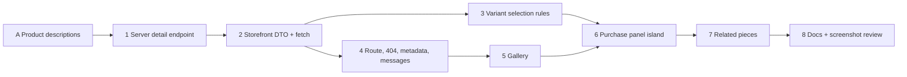

# feat: Moon Fashion storefront Product Detail on the real catalog API

Targets `apps/server`, `apps/storefront` and, for product descriptions only (PD-A),
`apps/dashboard`. All paths are relative to the repository root.

## Overview

Every product card on the homepage, Shop, category pages, New In and collection pages
links to `/[locale]/products/<slug>`, which still 404s through the catch-all. This plan
builds that page on the public catalog API merged in #196. It adds **one** public read
(`GET /api/v1/catalog/products/:slug`) inside the existing catalog module, a storefront
route in the `(catalog)` group, a CSS-only gallery, and one client island for variant
selection that Cart will later attach to.

Research changed the brief in four places, and each is a decision below:

1. **Products have no description column.** Only categories and collections carry
   `description` / `description_en`. There is also no material, care, fit or compare-at
   price anywhere in the schema, dashboard or seed.
2. **Variants are free-form.** `product_variants.attributes` is a TEXT JSON
   `Record<string, string>` typed by staff in `VariantManagerDialog`, with no key
   vocabulary, no ordering, no colour value and no per-variant image. The seed uses one
   key, `size` (`S`/`M`/`L`). Variants do carry their own stock and a nullable price.
3. **Availability is binary.** The only customer-safe signal is stock > 0.
   `products.min_stock` is a staff reorder threshold, not a low-stock rule.
4. **POS and the storefront would disagree on variant price.** POS reads
   `SELECT * FROM product_variants` and uses `Number(variant.price)`, so a variant with a
   NULL price (every seeded variant) sells at **0** (`apps/server/src/modules/pos/sales/service.ts`,
   the `item.variant_id` branch). ~90% confident this is a live bug. It is out of scope
   here, but it must be resolved before Cart (PD-C).

## Problem Frame

Shoppers can browse the storefront but cannot open a product. The page must show a real
product from the database in both locales, 404 honestly for anything that is not public,
and leave a purchase seam that Cart can fill without a redesign, with no fake cart
behaviour. It has to read as a continuation of Shop and Collections (quiet, led by the
photographs) while staying within the product page's "medium / low" motion tier
(guideline §14).

## Requirements Trace

- R1. `/[locale]/products/[slug]` renders a real public product (active, slug not null).
- R2. Unknown, `inactive`, `discontinued`, deleted or slug-less products are real 404s
  (HTTP 404, localized not-found). A transient API failure is never a 404.
- R3. The gallery shows the primary image plus every gallery image in dashboard order.
- R4. Name, price and category/collection context in both locales, using the existing
  fallback rules (`localizedName`).
- R5. Price uses `formatPrice`, with no invented compare-at price or discount.
- R6. Variant options, per-value availability and variant price appear exactly as the
  model supports them: no colour swatches, no per-variant images.
- R7. Availability is "In stock" / "Sold out" only: no quantities, no low-stock state.
- R8. The Add to Bag seam is ready for Cart, with no localStorage and no simulated success.
- R9. EN/AR, RTL, WCAG 2.2 AA, responsive at 320/375/768/1024/1440.
- R10. The lead image is the only eager, high-priority image. Nothing downloads twice
  across mobile and desktop, and there is one small client island.
- R11. Real metadata: localized title and description, canonical, alternates, Open Graph image.
- R12. Server: public whitelist, catalog limiter, cache headers, statement timeout, shared
  404 body, media URL rules, every CI documentation and manifest gate green.
- R13. Existing homepage, Shop and Collections pages unchanged, apart from one copy
  change (PD-6).
- R14. Product descriptions in both locales, editable in the
  dashboard.

## Scope Boundaries

- No Cart, drawer, checkout, payment, auth, account, wishlist, reviews, ratings,
  recommendations, search, CMS, FAQ/About/Blog/Newsletter.
- No change to `ProductCard` or any listing page layout.
- One migration only: `015_product_descriptions` (PD-A), additive and nullable. Nothing else
  needs schema changes.
- No lightbox, zoom, thumbnail strip, or URL state for variant selection.
- No JSON-LD `Product` structured data (PD-7).
- No slug redirect history: a renamed slug 404s at its old URL, as categories and
  collections already do.

## Context & Research

### Relevant Code and Patterns

Server (`apps/server`):
- `src/modules/commerce/catalog/*` is the module this extends:
  - `repository.ts`: named columns only; variant stock is a grouped LEFT JOIN because
    pg-mem has no LATERAL; `IN_STOCK_SQL` is keyed on `has_variants`.
  - `mappers.ts`: `absoluteMediaUrl`, and `productImages` capped by `CATALOG_LIST_IMAGE_COUNT`.
  - `service.ts`: `runCatalogRead`, `catalogNotFound`.
  - `schemas.ts`: `catalogCollectionParamsSchema`, `defineRequestContract`, the `.strict()` empty query.
  - `routes.ts`: the limiter, then `publicCacheOnSuccess`.
- `src/http/endpointManifest.ts` (detail entries, `publicAuth`), `src/docs/openapi.ts`
  (catalog paths), `src/docs/requestContracts.ts` (spreads `catalogContractList`).
- `tests/catalog.test.ts` pins exact DTO key sets and forbidden keys.
  `tests/concurrency/catalog.realpg.test.ts` covers NUMERIC as a string and the timeout.
  `tests/support/pgMem.ts` holds the `slug IS NOT NULL` rewrite.
- Variant and gallery model:
  - `src/database/migrations/001_initial_schema.sql`: `product_variants`.
  - `014_storefront_catalog.sql`: `product_images`, slugs, `name_en`.
  - `validators/productSchema.ts`: `variantSchema.attributes` is `record<string,string>`,
    `price` is optional and nullable.
  - Gallery cap of 8: `apps/dashboard/src/features/inventory/lib/gallery.ts`.
- `src/database/seed.ts`:
  - Variants for `MN-DRS-001` and `MN-KNT-001` (mixed stock) and `MN-DRS-004` (every size sold out).
  - No product images.
  - Collections: `evening`, `linen` and `silk` are public, `winter-tailoring` is upcoming,
    `summer-2025` is archived.

Storefront (`apps/storefront`):
- `app/[locale]/(catalog)/collections/[slug]/page.tsx`: the resolve-then-`notFound()` shape
  that the page and `generateMetadata` share (KD-10).
- `app/[locale]/(catalog)/layout.tsx` + `error.tsx`: the KD-14 scoped error strings.
- `app/catalog-routes.test.ts`: no `loading.tsx`; slug pages must call `notFound()`.
- Data layer:
  - `lib/api/catalog.ts`: `catalogFetch`, `CATALOG_REVALIDATE`, and the timeout caveat.
  - `lib/api/endpoints.ts`.
  - `features/collections/api/get-catalog-collection.ts`: NOT_FOUND returns `null`, anything else rethrows.
  - `features/products/api/list-catalog-products.ts`: response validation throws `INVALID_RESPONSE`.
- `features/products/utils/{localized-name,price,product-card-model}.ts` and
  `features/products/components/product-card.tsx`, reused unchanged for related pieces.
- `features/catalog/utils/catalog-metadata.ts` (canonical/alternates shape),
  `catalog-path.ts`, `grid-layout.ts` (sizes table).
- `components/motion/reveal.tsx`, `components/ui/{container,button,editorial-link}.tsx`.
- `messages/{en,ar}.json` and `messages/messages.test.ts` (key parity).

### Institutional Learnings

- There is no `docs/solutions/`; learnings live in the root and app `CLAUDE.md` files.
- KD-10: any `loading.tsx` at or above the segment turns `notFound()` into a streamed 200.
- A `fetch` with a `signal` loses per-render memoization (`apps/storefront/CLAUDE.md`, API client).
- pg-mem traps:
  - no LATERAL or correlated subqueries;
  - NUMERIC comes back as a number;
  - `slug IS NOT NULL` with mixed statuses returns no rows unless the shim rewrites it.
- Zod strips unknown keys, so test the HTTP boundary as well as the service (root Learnings).
- Never import `motion/react`, and measure the eager chunks after any motion work.
- Hero freeze: lazy loading is not enough while hidden images stay laid out. Measure
  downloads in a network capture, not by reading markup.
- Reveal and hover never share an element.
- A live region must be mounted before its content changes (root Learnings).

### External References

- Next 16 local docs: `node_modules/next/dist/docs/01-app/01-getting-started/06-fetching-data.md`
  says `React.cache` memoizes per request, and `03-api-reference/04-functions/fetch.md` says
  a signal opts a fetch out of memoization. No web research was needed, because local
  patterns cover the rest.

## Key Technical Decisions

| # | Decision | Rationale |
|---|---|---|
| PD-1 | Add `GET /api/v1/catalog/products/:slug` to the catalog module | The listing DTO is compact on purpose: 2 images, no variants, no category. No existing route returns one product. Using the same router means the limiter, `Cache-Control: public, max-age=60`, statement timeout and shared 404 body come for free. |
| PD-2 | A 404 for anything that is not `status = 'active'`, has no slug, or has no row, all with one shared body | Mirrors the listing's publication rule. `inactive` and `discontinued` look the same as unknown, so slugs cannot be probed. |
| PD-3 | No internal ids, SKUs, barcodes, stock numbers or cost in the DTO; variants are identified by their option values | Cart can resolve `(slug, options)` to a variant on the server. If Cart later needs an opaque public variant key, that decision belongs to Cart and is recorded there. |
| PD-4 | Effective variant price = `COALESCE(variant.price, product.price)` | Matches what the dashboard means by an optional price override. It conflicts with POS today (PD-C). |
| PD-5 | The storefront route lives under `(catalog)`: `app/[locale]/(catalog)/products/[slug]/page.tsx` | It inherits the catalog error boundary and the KD-14 provider, so no new boundary or provider is needed. |
| PD-6 | Make the catalog error title neutral (EN "We couldn't load this page", plus an AR equivalent) | "these pieces" reads wrong on a single product. The key stays in the same namespace, so the KD-14 object does not grow. |
| PD-7 | No JSON-LD Product until Cart makes the product purchasable | `offers` with a price and availability for an item that cannot be bought online is misleading, and cache staleness (at least 60s, see PD-8) matters more once it can be bought. |
| PD-8 | Dynamic route (`await connection()` in `resolve()`, as `collections/page.tsx` does); the product read is cached with `revalidate: 60` (the list lifetime) | Without `connection()`, a segment that reads no search params and has no `generateStaticParams` is prerendered at runtime and full-route cached (Next docs, `generate-static-params.md`), so the plan's data-cache model would not apply. Price and availability arrive in the same payload as the name and images. The data cache is stale-while-revalidate: at least 60s stale, and unbounded after a quiet period, because the first request after expiry is served the old entry. Listing cards, the detail read and the related row are cached separately and can briefly disagree. Never trusted for checkout. |
| PD-9 | Wrap the product read in `React.cache` **and** give it `timeoutMs` | `React.cache` memoizes per request across `generateMetadata` and the page, so a deadline no longer costs a second API call (which is why entity reads skip timeouts today). Unit 2 verifies this by counting API hits; the fallback is the entity convention (no timeout). ~75% confident. |
| PD-10 | The gallery is a Server Component with **no JS**: one list, a CSS grid at ≥1024 and a CSS scroll-snap rail below | One set of `` elements serves every breakpoint, so nothing downloads twice. Embla stays unused (storefront convention: scroll-snap gives swipe, keyboard and RTL). |
| PD-11 | One new client island, `features/products/components/purchase-panel.tsx` (the tenth boundary) | The selection drives price and per-value availability, which CSS cannot compute, and Cart will need a client island here anyway. It takes resolved strings and a plain slice of the DTO as props. |
| PD-12 | Variant selection is component state, not URL state (no nuqs) | Real data only has sizes. Deep-linking a size adds history noise and canonical risk for little gain. Revisit if colour becomes a modelled option. |
| PD-13 | Related pieces reuse `GET /catalog/products` through `listCatalogProducts(toProductQuery(...))`: the product's first collection in the DTO's order (featured first, then the `listCollections` order), else its category. Take 4, excluding the product itself, inside a Suspense boundary whose failure stays contained | Deterministic and needs no new endpoint. It goes through the same function, path and revalidate as the collection or category page 1, so it shares their data-cache entry; a hand-built fetch would not. A failed related read renders nothing instead of replacing a loaded product with the error screen. The trade-off is accepted: a 24-item list is fetched to show 4. |
| PD-14 | No sticky mobile purchase bar in this plan | While Add to Bag is deferred (PD-B), a sticky bar would hold a control that does nothing. Cart evaluates it once there is a real button. |
| PD-15 | At ≥1024 the info column is `position: sticky` beside the gallery | Keeps the name, price and options beside the scrolling photographs without a floating panel. It is part of the layout, not overlay UI, and never covers the focused control. |

### Variant and availability model (directional, not implementation)

```
server (per product, in the detail read)
  hasVariants := products.has_variants = 1             -- existing authority
  variants    := product_variants ORDER BY id           -- creation order is display order
  hasVariants = 0 -> options = [], variants = [] even if variant rows exist
                     (deleteVariant clears the flag outside a transaction, so rows and
                     flag can briefly disagree; the flag stays the authority)
  per variant:
    attrs      := parse attributes -> string->string, keys and values trimmed
    option key := lower(trim(key))                      -- "Size" and "size" merge
    value      := trimmed; matched case-insensitively, first-seen spelling shown
    usable     := attrs parse, no empty key or value, AND its key set equals the
                  product's canonical key set
    price      := COALESCE(variant.price, product.price)
    inStock    := stock > 0
  canonical key set := the key set shared by the most variants; tie -> the lowest id's set
                       (so `size` and `المقاس` on different variants never produce two
                       options that no variant can satisfy together)
  unusable variants -> dropped from options and variants, logged with product slug
  options := canonical keys in first-appearance order, each with values in
             first-appearance order (creation order = display order: an accepted
             limitation, see PD-D); label = first-seen original spelling of the key
  product inStock (detail) := hasVariants ? any USABLE variant in stock : products.stock > 0
      -- differs from the listing's IN_STOCK_SQL only for malformed/mixed data; the listing
         card may then say in stock while the page says sold out (accepted, logged)

DTO (sketch)
  { slug, name, nameEn, price, isNew, inStock,
    images: [{ url }],                              -- primary + gallery by position, <= 9
    category: { slug, name, nameEn } | null,        -- via category_id, slug not null
    collections: [{ slug, name, nameEn }],          -- active/on_sale with slug, listCollections order
    options: [{ key, label, values: [string] }],    -- [] when there are no variants
    variants: [{ options: { [key]: value }, price, inStock }] }

client (purchase panel; the pure rules live in variant-selection.ts)
  selection := { [key]: value | null }
  valueAvailable(key, value, selection) :=
      some in-stock variant matches the selection with key=value on every other chosen key
  selectedVariant := the variant matching every key, or null
  displayed price := selectedVariant?.price
                     ?? (all effective prices equal ? that price : "From {min}")
  status line     := selectedVariant ? (inStock ? In stock : Sold out)
                     : product inStock ? nothing : Sold out
  an option with a single value is preselected; nothing else is
  options = [] and inStock = false (includes a variant product with no usable variants)
                -> readiness soldOut, never ready
```

Sold-out values stay **focusable and selectable** and are announced as "sold out"; they
are never `disabled`. A shopper has to be able to find out that M is sold out, and
disabled radios are skipped by the keyboard and hidden by many screen readers. Sold-out
values are struck through and muted, never marked by colour alone.

### Page composition (directional)

```
>=1024 (Container, 12 cols)                  <1024 (single column)
+------------ 7 ------------+---- 5 ----+    +--------------------------+
| lead image 4:5 (eager)    | eyebrow   |    | rail: 4:5 slides, peek   |
|                           | h1 name   |    | ----- scroll progress    |
+-------------+-------------+ price     |    +--------------------------+
| img 2  4:5  | img 3  4:5  | status    |    | eyebrow . h1 . price     |
+-------------+-------------+ options   |    | options (size radios)    |
| img 4       | img 5 ...   | [seam]    |    | [seam]                   |
| (an odd last image spans) | context   |    | context links            |
+---------------------------+-(sticky)--+    +--------------------------+
        related pieces (4-up >=1024, 2-up below; reuses ProductCard)
```

- The eyebrow is a category link (`/shop/<slug>`) in `type-label`. There is no breadcrumb
  trail: the eyebrow is already the one step back, the same device the catalog intro uses.
- Collection membership sits under the purchase area as quiet text links ("Part of
  Evening"), not chips.
- With 1 image: the lead only, with no rail chrome. With no image: the brand-mark frame
  `ProductCard` already uses.
- The rail (<1024):
  - Slides are about 86vw wide at 320–767 and about 58vw at 768–1023, so a tablet shows a
    clear second slide instead of one oversized portrait.
  - Scroll progress is a hairline outside the rail, so it cannot follow the nearest
    scroller. The rail declares `scroll-timeline: --gallery inline`, the wrapper
    `timeline-scope: --gallery`, and the bar uses `animation-timeline: --gallery`. The bar
    renders only inside `@supports (animation-timeline: scroll())`; elsewhere there is no
    bar, not a static one. A visually hidden "N images" description sits on the rail.
  - The rail is a focusable, labelled region, and arrow keys scroll it natively.
  - `dir` handles RTL order; photographs are never mirrored.
- The signature moment, and the only place the design takes a risk: the lead photograph at
  full column height beside a very spare type column. The name is set in Lora at
  `type-h1`, the price in tabular figures, and the options as hairline square cells, so
  the page reads like a lookbook plate rather than a marketplace listing. No boxes, and at
  most one badge ("Sold out" wins, as on cards).

## Open Questions

### Resolved During Planning

- Does an existing endpoint suffice? No (PD-1).
- Colours? Not modelled. A staff-typed `color` key renders as a text option like any
  other, with no swatches and no hex values.
- Low stock? No business rule supports it, so it is not shown (R7).
- Variant-specific images? Not in the model, so not built.
- Breadcrumb? The eyebrow link only (see page composition).
- Mobile sticky action? No (PD-14).
- Loading state? No `loading.tsx` (KD-10). The product block renders complete on the
  server from one cached, fast read. Only the related pieces stream, over a 4-card
  skeleton in `ProductGridSkeleton` proportions.
- Rendering strategy? PD-8.

### Deferred to Implementation

- Whether `React.cache` plus `timeoutMs` really yields one API hit per render (PD-9). Measure it.
- Whether lazy images in the horizontal rail stay unfetched until they are near the
  viewport, since browser lazy-load heuristics differ inside scroll containers. Verify in a
  network capture at 375.
- Exact `sizes` strings once the column widths are set in CSS. Derive them from one table,
  as `grid-layout.ts` does.
- Exact openapi example payloads.
- Arabic wording for the new keys, beyond the register (feminine singular) and tone.

## Implementation Units



Units 5, 6 and 7 each render into `product-detail.tsx`, so they run in sequence (one
editor per file). Unit A runs first. The
storefront `CLAUDE.md` *Product detail* section is written once, in Unit 8.

- [x] **Unit 1: Server: `GET /api/v1/catalog/products/:slug`**

**Goal:** One public, whitelisted product read carrying the gallery, category, public
collections, options and variant availability.

**Requirements:** R1, R2, R3, R5, R6, R7, R12

**Dependencies:** Unit A

**Files:**
- Modify: `apps/server/src/modules/commerce/catalog/constants.ts` (`CATALOG_DETAIL_IMAGE_COUNT = 9`;
  `productImages` takes the cap as a parameter and the listing passes `CATALOG_LIST_IMAGE_COUNT`
  explicitly, because `listGallery` has no SQL `LIMIT` and only the dashboard enforces 8)
- Modify: `apps/server/src/modules/commerce/catalog/repository.ts` (product row by slug,
  variants for one product, collections for one product; reuse `listGallery`)
- Modify: `apps/server/src/modules/commerce/catalog/types.ts` (row type and `CatalogProductDetailDto`)
- Modify: `apps/server/src/modules/commerce/catalog/mappers.ts` (detail mapper, attribute
  parsing and option derivation; `productImages` takes the cap as an argument)
- Modify: `apps/server/src/modules/commerce/catalog/service.ts`, `controller.ts`, `routes.ts`
- Modify: `apps/server/src/modules/commerce/catalog/schemas.ts` (`getCatalogProduct` contract
  reusing the slug params schema, strict empty query)
- Modify: `apps/server/src/http/endpointManifest.ts` (detail entry, `publicAuth`, classification
  `B` like the collection detail)
- Modify: `apps/server/src/docs/openapi.ts`
- Modify: `apps/server/CLAUDE.md` (*Public catalog*: five GETs, the detail rules)
- Test: `apps/server/tests/catalog.test.ts`, `apps/server/tests/concurrency/catalog.realpg.test.ts`

**Approach:**
- Every read runs in one `runCatalogRead` transaction:
  - the product row: named columns, `WHERE p.slug = $1 AND p.status = 'active'` (equality
    already excludes a null slug, and avoids the pg-mem `slug IS NOT NULL` shim), a
    `LEFT JOIN categories c ON c.id = p.category_id` with a null `c.slug` turned into
    `category: null` in the mapper. Detail `inStock` is computed in the mapper from usable
    variants, so no variant-stock join is needed here;
  - the gallery;
  - variants, `ORDER BY id`;
  - collections: a `collection_products` join, public statuses only, in `listCollections` order.
- No `SELECT *`.
- Register `/products/:slug` after `/products`; the strict empty query rejects junk parameters.
- The mapper names every key. Options are derived in the mapper, which is pure and
  unit-testable.
- `isNew` uses the same `NEW_IN_DAYS` SQL expression as the listing.

**Patterns to follow:** `getCollection` (service, controller, contract), `toCatalogProductDto`,
the key-set pinning in `tests/catalog.test.ts`.

**Test scenarios:**
- Happy path: an active seeded product with gallery rows at positions 2, 0, 1 → `images` is
  the primary, then positions 0, 1, 2. The DTO key set is exact, and the response carries
  `Cache-Control: public, max-age=60`.
- Happy path: `MN-KNT-001` → one option, `size`, with values `S,M,L` in creation order; the
  `M` variant is `inStock: false`; the product is `inStock: true`.
- Edge: every size sold out (`MN-DRS-004`) → the product and every variant are `inStock: false`.
- Edge: no variants and `stock 0` → `options: []`, `variants: []`, `inStock: false`.
- Edge: `has_variants = 1` with zero variant rows → `inStock: false` and no options.
- Edge: a variant with a NULL price → its effective price equals the product price. A variant
  with its own price → that price. It is a NUMERIC string on real PG and a number on pg-mem,
  and always a number in the DTO.
- Edge: attribute keys `Size` and `size` on different variants merge into one option,
  labelled with the first-seen spelling.
- Edge: malformed `attributes` text, a non-string value, or `{}` → that variant is absent
  from `variants` and `options`, and the request is still a 200.
- Edge: 9 images (the primary + 8) → all returned; a tenth stored gallery row is dropped; a
  stored `javascript:` URL is dropped.
- Edge: `has_variants = 0` with variant rows present → `options: []`, `variants: []`, and
  `inStock` follows `products.stock`.
- Edge: mixed key sets (two variants `{size}`, one `{المقاس}`) → one option, `size`; the
  odd variant is dropped. If only the dropped variant is in stock → product `inStock: false`.
- Edge: values `M` and `m` → one value `M`; an empty value `""` → that variant is unusable.
- Edge: every variant malformed while one has stock → `inStock: false`, `options: []`.
- Edge: a product with no category, or whose category has no slug → `category: null` (also
  on real PG).
- Edge: a product in `evening` (active) and `winter-tailoring` (upcoming) → only `evening` is listed.
- Error: an unknown slug, `inactive`, `discontinued`, or a NULL slug → 404 with a body
  byte-identical to an unknown collection's, and `no-store`.
- Error: an invalid or over-length slug → 400; an unknown query parameter → 400.
- Error: statement timeout (real PG) → 503 `SERVICE_UNAVAILABLE`.
- Integration: no `id`, `sku`, `barcode`, `stock`, `cost_price`, `min_stock` or `product_id`
  appears anywhere in the body, variants included (recursive key scan).
- Integration: listing `inStock` and detail `inStock` agree for the well-formed seed products,
  including the sold-out one (they may differ only for malformed or mixed variant data).

**Verification:** The server job is green, including documentation drift, manifest
authorization and the request-contract ratchets (`EXPECTED_UNCONVERTED` stays at 3,
`EXPECTED_UNCLASSIFIED` stays at 0).

- [x] **Unit 2: Storefront: detail DTO and `getCatalogProduct`**

**Goal:** A typed, validated server read, memoized per request, with honest 404 and error
semantics.

**Requirements:** R1, R2, R10, R12

**Dependencies:** Unit 1

**Files:**
- Create: `apps/storefront/features/products/types/catalog-product-detail.ts`
- Create: `apps/storefront/features/products/api/get-catalog-product.ts`
- Modify: `apps/storefront/lib/api/endpoints.ts` (`CATALOG_ENDPOINTS.product(slug)`)
- Test: `apps/storefront/features/products/api/get-catalog-product.test.ts`

**Approach:**
- `server-only`. Uses `catalogFetch` with `CATALOG_REVALIDATE.list`, wrapped in `React.cache`,
  with a deadline (PD-9). NOT_FOUND returns `null`; anything else rethrows.
- Validate the parts that drive rendering decisions (the images array of `{url}`, the
  `options`/`variants` shapes, a numeric price) and throw `INVALID_RESPONSE`, as
  `listCatalogProducts` does for its meta.
- The endpoint builder URL-encodes the slug.
- Measure PD-9 here: one API request per page render, counted on the dev API.

**Patterns to follow:** `get-catalog-collection.ts`, `list-catalog-products.ts`,
`catalog-collections.test.ts`.

**Test scenarios:**
- Happy path: a valid payload is returned as the DTO; the path is `/api/v1/catalog/products/<slug>`;
  the token header is sent when `CATALOG_SERVER_TOKEN` is set.
- Error: API 404 NOT_FOUND → `null`.
- Error: 503, a network failure or `TIMEOUT` → the `ApiError` is rethrown, not turned into `null`.
- Error: `variants` is not an array, or the price is not a number → `INVALID_RESPONSE`.
- Edge: a slug with characters that need encoding is encoded.

**Verification:** Storefront typecheck and tests are green, and nothing imports the module
from the client (the build fails if something does).

- [x] **Unit 3: Storefront: variant selection rules (pure)**

**Goal:** Every selection, availability and price rule as a pure function the island consumes.

**Requirements:** R5, R6, R7, R8

**Dependencies:** Unit 2 (types only)

**Files:**
- Create: `apps/storefront/features/products/utils/variant-selection.ts`
- Test: `apps/storefront/features/products/utils/variant-selection.test.ts`

**Approach:** Implements the directional model above:
- the initial selection (options with a single value are preselected);
- `valueAvailable` and `selectedVariant`;
- the displayed price (`exact` or `from`) and the status line;
- a `purchaseReadiness` result (`needsSelection: key[]` | `soldOut` | `ready(variantOptions)`)
  that Cart will call.

No React import.

**Execution note:** Test-first: this module is the Cart contract.

**Test scenarios:**
- Happy path: one option; selecting `L`, which is in stock → the selected variant, the exact
  price, "in stock", and `ready`.
- Edge: no options → `ready` immediately when the product is in stock, `soldOut` when it is
  not (the server sends `inStock: false` for a variant product with no usable variants, so it
  is never `ready`).
- Edge: a single-value option is preselected; a multi-value option is not.
- Edge: two options (`size`, `color`) with a missing combination → that value is unavailable
  given the other choice, and available again once the other choice changes or is cleared.
- Edge: selecting a sold-out value → the selected variant exists, the status is sold out, and
  readiness is `soldOut`.
- Edge: variant prices differ and nothing is selected → `from` the minimum; all prices equal → `exact`.
- Edge: nothing selected and the product is sold out → the status is sold out without a selection.
- Error path: readiness with a required key still unselected → `needsSelection` lists it, in option order.

**Verification:** All rules covered by tests.

- [x] **Unit 4: Storefront: route, 404, metadata, messages**

**Goal:** The page shell: resolve then `notFound()`, the information hierarchy, metadata
and strings.

**Requirements:** R1, R2, R4, R9, R11, R13

**Dependencies:** Unit 2

**Files:**
- Create: `apps/storefront/app/[locale]/(catalog)/products/[slug]/page.tsx`
- Create: `apps/storefront/features/products/components/product-detail.tsx` (the Server Component layout)
- Create: `apps/storefront/features/products/utils/product-metadata.ts`
- Modify: `apps/storefront/app/catalog-routes.test.ts` (add the product slug page to `SLUG_PAGES`)
- Modify: `apps/storefront/messages/en.json`, `apps/storefront/messages/ar.json`
  (`product.*`, `catalog.meta.productDescription`, and the PD-6 error title)
- Test: `apps/storefront/features/products/utils/product-metadata.test.ts`

**Approach:**
- `resolve(props)` works as in the collection page and calls `await connection()` first
  (PD-8); `generateMetadata` and the page share it.
- The page renders the category eyebrow and the "Part of {collection}" links itself, and
  passes the related row to `product-detail.tsx` as a slot.
- Metadata:
  - The title is the localized name.
  - The description is the localized product description (PD-A) when one exists in the page's
    locale, otherwise `catalog.meta.productDescription` with the name.
  - Canonical is `/{locale}/products/{slug}`, with alternates for both locales.
  - `openGraph.images` is the first image URL (already absolute from the API) when there is one.
  - The page is indexable, and there is no query handling (the route reads no search params).
- The name carries `lang` and `dir="auto"` when it is a fallback, uses `text-balance`, and is
  never truncated.
- New keys, in EN and AR (feminine singular in Arabic):
  - availability: in stock, sold out;
  - price: "From {price}";
  - option legends for the known keys (`size`, `color`), the selected value, and the
    sold-out suffix on a value;
  - gallery: the region label and "{count} images";
  - context: "Part of {collection}"; related heading: "More from {name}";
  - no Add to Bag copy (PD-B: no button in this plan).
- The catch-all stays; the more specific route wins.

**Patterns to follow:** `collections/[slug]/page.tsx`, `catalog-metadata.ts`, `page-intro.tsx`.

**Test scenarios:**
- Happy path: metadata for `en` → canonical `/en/products/silk-midi-dress`, alternates for
  `en` and `ar`, and the first image as the OG image.
- Edge: an English page with an Arabic-only name → the title uses the Arabic name.
- Edge: no images → no `openGraph.images` key.
- Integration: `catalog-routes.test.ts` fails if a `loading.tsx` appears or the product page
  stops calling `notFound()`.
- Integration: `messages.test.ts` key parity passes with the new keys.

**Verification:**
- `/en/products/<seed slug>` returns 200. `/en/products/nope` and an `inactive` product return
  404 with the localized not-found body.
- With the API stopped, an uncached slug returns 500 with the catalog error screen.
- `next build` lists the route as `ƒ`.

- [x] **Unit 5: Storefront: gallery (Server Component, no JS)**

**Goal:** The editorial desktop grid and the mobile rail, built from one list of images.

**Requirements:** R3, R9, R10

**Dependencies:** Unit 4

**Files:**
- Create: `apps/storefront/features/products/components/product-gallery.tsx`
- Create: `apps/storefront/features/products/utils/gallery-layout.ts` (sizes and span rules)
- Modify: `apps/storefront/features/products/components/product-detail.tsx` (render the gallery)
- Modify: `apps/storefront/app/globals.css` (rail and grid rules and the scroll-timeline
  progress, under `@layer components`, safe under reduced motion)
- Test: `apps/storefront/features/products/utils/gallery-layout.test.ts`

**Approach:** Follows PD-10 and the composition sketch.
- The lead image is `loading="eager"` with `fetchPriority="high"`. Every other image is lazy
  with the default `fetchPriority`.
- Alt text: the product name on the lead, "{name}, image {n} of {count}" on the rest. The
  model has no per-image alt text.
- Frames use `aspect-4/5` and `object-cover`.
- No Reveal on the lead image, because it is the LCP element. Supporting images may fade in
  under the page's single Reveal.

**Test scenarios:**
- Happy path: 5 images → the lead spans the full column and images 2–5 sit in pairs, with
  separate `sizes` for the lead and the supporting images.
- Edge: 1 image → the lead only, with no progress or description.
- Edge: an odd number of supporting images → the last one spans both columns.
- Edge: 0 images → the placeholder frame.

**Verification:** Network captures at 375 and 1440 show one eager image. Rail images beyond
the first two are not fetched before interaction; if the browser prefetches them anyway,
record it and make a decision. Image loads cause no layout shift.

- [x] **Unit 6: Storefront: purchase panel island (tenth client boundary)**

**Goal:** Accessible option selection, a live price and status, and the Add to Bag seam.

**Requirements:** R5, R6, R7, R8, R9

**Dependencies:** Units 3, 5

**Files:**
- Create: `apps/storefront/features/products/components/purchase-panel.tsx` (`'use client'`)
- Modify: `apps/storefront/features/products/components/product-detail.tsx` (render the panel
  with resolved strings)

**Approach:**
- Each option is a `<fieldset>` with a `<legend>`: the translated label for `size`/`color`,
  otherwise the staff label with `dir="auto"`. The legend echoes the selected value.
- Each value is a native `<input type="radio">` with a visible label. Native radios provide
  arrow-key movement and state announcements.
- Styling hangs off `:checked` and `:focus-visible` on the label: cells at least 44×44 with
  8px gaps, in rows that wrap.
- Sold-out values stay enabled, carry a visually hidden "sold out" in their label, and are
  struck through in `text-disabled`.
- Price and status share one polite `aria-live` region, mounted on the first render.
- The seam follows PD-B: no button, a reserved action slot below the options, and nothing that
  claims online ordering.
- Props are the DTO's `price`, `inStock`, `options` and `variants` plus resolved strings,
  never the message catalogue.
- No `motion/react`. Value changes use CSS transitions of at most 180ms (`--ease-ui`).

**Patterns to follow:** `catalog-controls.tsx` (resolved strings as props, `fillTemplate`).
Headless UI is not needed; native radios cover the behaviour.

**Test scenarios:** Unit 3 covers the rules. Test expectation for the component itself: none
beyond typecheck. The storefront has no component-test harness, and the behaviour is checked
in the Unit 8 review. If a harness is added later, its first test is "selecting a sold-out
size announces sold out and keeps the price".

**Verification:**
- Keyboard: Tab enters each fieldset once, arrow keys move and select, and the focus ring is visible.
- VoiceOver/NVDA announce something like "M, sold out, 2 of 3, selected".
- The product route's eager JS grows only by the island. Measure the eager chunks, as the
  motion rule requires.

- [ ] **Unit 7: Storefront: related pieces**

**Goal:** A short related row whose failure stays contained.

**Requirements:** R4, R9, R10

**Dependencies:** Unit 6

**Files:**
- Create: `apps/storefront/features/catalog/components/related-products.tsx`
- Create: `apps/storefront/features/catalog/utils/related-scope.ts`
- Modify: `apps/storefront/app/[locale]/(catalog)/products/[slug]/page.tsx` (pass the row as the slot)
- Test: `apps/storefront/features/catalog/utils/related-scope.test.ts`

**Approach:** Follows PD-13.
- The files live in `features/catalog`, the composition slice, which already imports from
  `products`. Putting them in `products` would add a second reverse edge that the storefront
  contract does not allow.
- Scope: the DTO's first collection (sort `curated`), otherwise the category (sort `newest`), page 1.
- Call `listCatalogProducts(toProductQuery(...))`, never a fetch built by hand, so the path,
  revalidate and token match the listing page and the data-cache entry is shared.
- Exclude the current slug, take 4, and hide the section when nothing is left.
- Fetch inside `<Suspense>` over a skeleton. The catch block calls `unstable_rethrow(error)`
  first, swallows only `ApiError` (logged) and renders nothing; any other error is rethrown.
- Cards come from `fromCatalogDto` + `ProductCard` with honest `sizes`. One `Reveal` on the
  list, and cards rise (the catalog motion level).

**Test scenarios:**
- Happy path: a product in `evening` → collection scope, `curated`.
- Edge: no public collection but a category → category scope, `newest`.
- Edge: neither → no related section.
- Edge: the listing returns the product itself among 3 → 2 cards; it returns only the product
  itself → the section is hidden.
- Integration: the related API path equals what `buildCatalogProductsPath` produces for the
  collection page's page-1 default.
- Error path: a non-`ApiError` thrown by the read propagates; an `ApiError` yields no section.

**Verification:** If the related list is uncached and the API is unreachable, the product
page still renders, without a related row, instead of the error screen.

- [ ] **Unit 8: Docs and screenshot/keyboard review**

**Goal:** Contracts recorded, plus a visual and accessibility review across the agreed matrix.

**Requirements:** R9, R13

**Dependencies:** Unit 7

**Files:**
- Modify: `apps/storefront/CLAUDE.md` (*Product detail* section: route, PD decisions, gallery,
  island, open review items; *Client boundary rule* gains the tenth entry (PD-E); *Feature slice shape* notes the related row in `catalog`; remove "Product detail
  still 404s")
- Modify: `CLAUDE.md` (the Quick Start sentence about product detail 404ing)
- Modify: `docs/ACCESSIBILITY.md` (the radio pattern, the rail region, manual checks)

**Approach:** The owner runs the browser review; the agent does not test in a browser. The
agent prepares the fixtures in a dev database:
- upload 5+ gallery images to one seeded dress and 1 image to another;
- set a long `name_en` and a long Arabic name on a third product;
- use `MN-KNT-001` (mixed sizes) and `MN-DRS-004` (sold out).

The review covers 320/375/768/1024/1440 × EN/AR. Check:
- image crops, long Arabic titles, price wrapping and option wrapping;
- the rail's peek and progress hairline;
- that the sticky info column does not look detached at 1024;
- the solid header, the footer, reduced motion, the keyboard path, and no horizontal overflow.

**Test expectation:** none: documentation and manual review.

**Verification:** Review screenshots are accepted, and any open items are recorded under
*Open for the screenshot review*.

- [x] **Unit A: product descriptions (PD-A)**

**Goal:** `description` / `description_en` on products, editable in the dashboard and shown
on the page.

**Requirements:** R14

**Dependencies:** None; lands before Unit 1

**Files:**
- Create: `apps/server/src/database/migrations/015_product_descriptions.sql` and `.down.sql`
- Modify: `apps/server/validators/productSchema.ts`, the products repository and service, the
  catalog detail mapper and types
- Modify: `apps/dashboard/src/features/inventory/components/inventory/ProductFormDialog.tsx`,
  dashboard i18n files
- Test: `apps/server/tests/catalog.test.ts`, the products route tests, the migration up/down
  CI job, the dashboard `Inventory.test.tsx`

**Approach:**
- Additive, nullable TEXT columns with no backfill and no CHECK, so the 014 NOT VALID caveat
  does not apply.
- The dashboard fields use `Controller`, because HeroUI inputs ignore `setValue` (root Learnings).
- The storefront reuses `localizedDescription` and shows plain paragraphs under the purchase
  area, with no accordion. The metadata description switches to it when it exists in the
  page's locale.

**Test scenarios:**
- Happy path: create and update a product with both descriptions → persisted and returned by
  the detail DTO.
- Edge: descriptions omitted on update → stored values kept; `null` → cleared.
- Integration: the listing DTO key set is unchanged (descriptions are detail-only).
- Integration: the down migration reverses the up migration in CI.

**Verification:** The migrations job is green, and a description entered in the dashboard
appears on `/ar` and `/en` (English falls back to Arabic, marked with `lang`).

## System-Wide Impact

- **Interaction graph:** the catalog router gains one route, and the limiter, cache
  middleware, 404 fallback, manifest walk, documentation drift check and request-contract
  gates all see it. The dashboard changes only for the two description fields (PD-A).
- **Error propagation:**
  - An API 404 becomes `null`, then `notFound()` before render, then HTTP 404.
  - Any other failure reaches `(catalog)/error.tsx`, as a 500 when it happens before Suspense.
  - A related-row failure stays inside that row.
- **State lifecycle risks:** the Next data cache is stale-while-revalidate, so price and
  availability are at least 60s stale and can be older after a quiet period. The API is called
  server to server, so no CDN sits on that path. Listing, detail and related reads are separate
  cache entries and can briefly disagree (a card says sold out, the page says in stock). That
  is fine for browsing, never for Cart, which must re-price and re-check stock on the server.
- **API surface parity:** listing `inStock` and detail `inStock` use the same rule, and a test
  pins their agreement.
- **Integration coverage:** real PG proves NUMERIC-as-string for variant prices, and the
  Unit 4 smoke checks the KD-10 status codes.
- **Unchanged invariants:** the existing four catalog routes, their DTOs and tests;
  `ProductCard`; the listing pages; the homepage's static SSG; the shape of the `(catalog)`
  provider object.

## Risks & Dependencies

| Risk | Mitigation |
|---|---|
| The POS null-variant-price bug makes storefront and till prices disagree | PD-C: a separate fix issue before Cart; the storefront rule is documented |
| Staff attribute keys are inconsistent (`Size`, `size `, `المقاس`) | Keys are normalized (trim + lowercase), unknown keys render as typed, and a content pass happens before launch |
| `React.cache` + timeout doubles API calls | Measure in Unit 2 and fall back to the entity convention |
| Lazy rail images download early in some browsers | Network capture in Unit 5; the worst case is a bounded 9 images at rail width |
| The seed has no product images, so the review would miss real crops | Unit 8 prepares fixtures through the dashboard gallery |
| Legacy products still have SKU-derived slugs (the 014 note) | Unchanged; the B-6 content pass handles it |
| A tenth client boundary sets a precedent | Documented entry with its reason; strings arrive as props only |

## Documentation / Operational Notes

- `apps/server/CLAUDE.md` *Public catalog*: five routes, plus the detail rules (option
  derivation, effective price).
- `apps/storefront/CLAUDE.md`: remove "Product detail still 404s", and add a *Product detail*
  section and the tenth boundary. Update the root `CLAUDE.md` Quick Start sentence.
- No environment changes: `CATALOG_SERVER_TOKEN`, `MEDIA_ORIGIN` and `SITE_URL` already cover it.

## Owner decisions (approved 2026-09-14)

All recommendations were approved as written.

- **PD-A Descriptions: in scope.** Unit A adds the additive 015 migration (`description`,
  `description_en` on products) and two dashboard textareas; the page shows the localized
  description. Rejected: shipping without descriptions.
- **PD-B Add to Bag seam: no button.** Selection, price and availability work; the action slot is
  reserved in the layout (an empty element with a stable place, no placeholder copy), and
  `purchaseReadiness` is the Cart contract. Rejected: a disabled button with "Online ordering
  opens soon" (a business claim).
- **PD-C Variant price rule: `variant.price ?? product.price`.** The POS bug (`Number(null)` is 0)
  is fixed in a separate issue, which must land before Cart.
- **PD-D Attribute keys and order:** the canonical key set (translated for `size`/`color`),
  variants with a different key set dropped, creation order as display order. Rejected: a fixed
  order for known sizes.
- **PD-E Client island now (PD-11, the tenth boundary).** Rejected: CSS-only now, island at Cart.
- **PD-6** error title becomes "We couldn't load this page" on every catalog page; **PD-7** JSON-LD
  deferred to Cart; **PD-14** no sticky mobile Add to Bag bar until a real button exists.

## Next feature

Cart: puts the Add to Bag action into the reserved slot using `purchaseReadiness`, re-prices on
the server, and settles the public variant key question (PD-3) and the mobile sticky action (PD-14).

## Sources & References

- Prior plan: `docs/plans/2026-09-14-002-feat-storefront-shop-collections-plan.md` (KD-1…KD-17)
- Design guideline: `docs/design/moon-fashion-website-design-guideline.md` §10, §11, §14, §17, §18
- PR #196 (catalog API + Shop/Collections)
