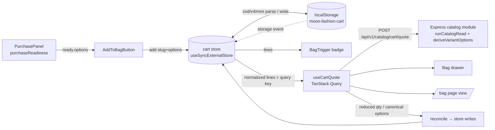
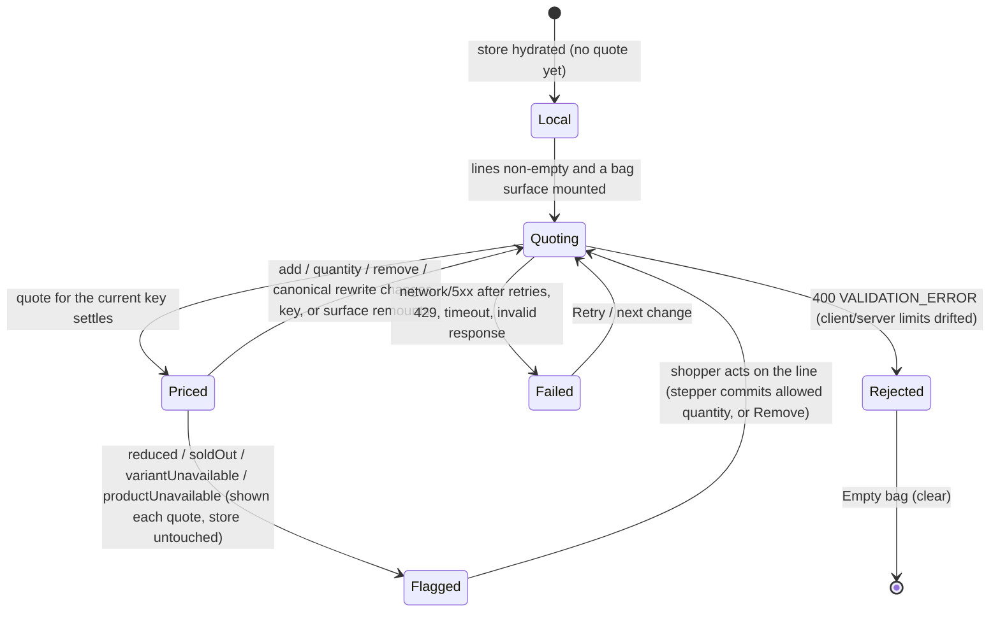
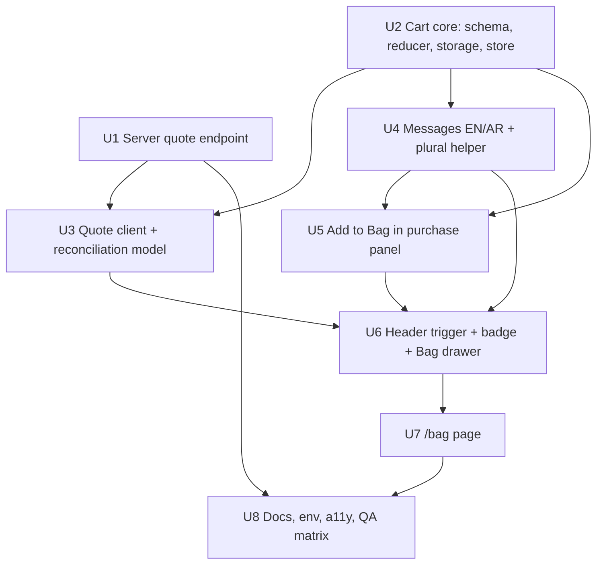

# feat: Storefront Cart (guest Bag, drawer, /bag page, server quote)

## Overview

Make products purchasable-in-intent: an Add to Bag action in the product page's reserved
seam, a guest bag persisted in `localStorage`, a Bag drawer, a full bag page, and a new
public, read-only **cart quote** endpoint that re-prices and re-checks every line against
current server data. The bag in the browser is intent only (`slug`, options, quantity);
names, images, prices, availability and totals always come from the quote.

Checkout, payment, accounts, server carts and stock reservation are out of scope. The
architecture leaves one seam for Checkout: a reserved, empty `[data-checkout-action]` slot
(the same way PD-B reserved Add to Bag) and a quote that Checkout can re-run server-side.
Checkout readiness rules belong to the Checkout plan.

Decision labels in this plan are **CD-n** (cart decisions). Earlier plans' labels are
always qualified: *catalog KD-9* / *catalog KD-10* (`2026-09-14-002`), *PD-n* (`2026-09-14-003`).

## Problem Frame

Product Detail (plan `2026-09-14-003`) shipped variant selection, live price/availability,
`purchaseReadiness` ("the Cart contract", PD-B) and an empty `[data-product-action]` slot.
The header already renders a Bag icon linking to `/bag`, which 404s. The public DTO has no
variant id by decision (PD-3): a variant is identified by its option values, and PD-3
explicitly left "an opaque public variant key" to Cart. #202/#203 fixed the NULL variant
price in POS, so storefront and till now agree on `variant.price ?? product.price`.

The owner decisions in the request are carried as requirements (guest bag, `localStorage`,
server authority, both surfaces, no checkout/payment/account sync, no reservation, no
server cart table).

## Requirements Trace

- R1. Guests can add, change quantity, remove, and keep a bag across visits with no account.
- R2. Persist a versioned, minimal, storefront-owned shape in `localStorage`: product
  identity, variant identity, quantity — never price, stock, name, image or promo state.
- R3. The server is authoritative for existence, publication, variant validity, effective
  price, availability, stock and quantity limits; the request carries no price.
- R4. Effective price reuses the catalog's single rule (`variant.price ?? product.price`);
  NULL variant price never becomes 0; covered at the quote boundary on real PostgreSQL.
- R5. Bag drawer: confirmation after add, contents, quantity, remove, link to the bag page,
  a Checkout seam. Bag page: full review with lines and summary.
- R6. Reconciliation: price changed, product unpublished/deleted, variant gone, variant sold
  out, stock below quantity — visible, explicit, never silent substitution or deletion.
- R7. Add to Bag uses `purchaseReadiness`; no parallel selection logic; no data fetching.
- R8. Same product + same options merges quantity; different options is a new line.
- R9. Quantity stepper stops at 1; deletion is an explicit Remove.
- R10. Totals: subtotal only. No shipping, tax, VAT, discount, delivery estimate.
- R11. Reuse `formatPrice`; EN/AR copy with correct Arabic plurals; RTL via logical CSS.
- R12. Header count = total pieces, restrained, accessible, no header redesign, no
  whole-shell client conversion, no hydration mismatch.
- R13. Graceful degradation: endpoint down, 5xx, 429, malformed storage, storage
  unavailable, stale variant — never the global error route.
- R14. WCAG 2.2 AA: focus management, Escape, focus return, labelled controls, a defined,
  non-noisy announcement policy, reduced motion.
- R15. Controlled client growth; new boundaries and bundle impact recorded.
- R16. No stock reservation on add; no cart expiry timers; no server cart persistence.

## Scope Boundaries

- No Checkout, payment, addresses, delivery method, customer details, order placement.
- No auth, account carts, guest/account merge, wishlist, promo codes, shipping fees,
  taxes, recommendations, abandoned-cart tracking.
- No dashboard changes. No quick-add on `ProductCard`, related products or listings.
- No new database tables or migrations.
- No sticky mobile Add to Bag bar (PD-14 stays; revisit after launch screenshots).
- No JSON-LD `Product` (PD-7 ties it to purchasability; a bag is not a purchase).
- No "Clear bag" control in this phase (see CD-17). The reducer keeps a `clear` operation
  for the future Checkout completion and for the rejected-bag recovery path (a 400 quote).
- No `checkoutReadiness` function: only the empty slot. The summary needs just "stale vs
  current subtotal" and "excluded pieces", which the reconcile model provides.

## Context & Research

### Relevant Code and Patterns

Storefront (`apps/storefront/`):
- `features/products/utils/variant-selection.ts` — `purchaseReadiness` returns
  `soldOut | needsSelection{keys} | ready{options}`; `ready.options` is the canonical
  option map from the DTO. Unit-tested in `variant-selection.test.ts`.
- `features/products/components/purchase-panel.tsx` (boundary 10) owns selection;
  `purchase-panel-slot.tsx` resolves strings and pre-formats prices on the server.
- `features/products/components/product-detail.tsx` — `[data-product-action]` is an empty
  sibling *after* the purchase slot, so today the island that owns selection cannot fill it.
- `features/products/types/catalog-product-detail.ts` — variants: `{ options, price, inStock }`,
  no id, no stock number.
- `features/products/utils/price.ts` — pure `formatPrice(amount, locale, currencyLabel)`.
- `features/products/utils/localized-name.ts` — `localizedName`, `langProps`.
- `components/layout/header/header.tsx` + `components/layout/navigation-items.ts` — Bag is an
  icon `Link` to `/bag` (`navigation.bag`: "Bag" / "الحقيبة"), rendered from
  `headerActionItems`.
- `components/layout/mobile-menu/mobile-menu.tsx` and
  `features/catalog/components/catalog-controls.tsx` — the Headless UI `Dialog` +
  `DialogBackdrop` + `DialogPanel` + `DialogTitle` pattern with `transition`, `data-closed:`
  variants, `bg-scrim`, `DialogTitle as="h2" tabIndex={-1} data-autofocus`, safe-area footer.
- `providers/app-providers.tsx` — `NuqsAdapter` > `QueryProvider`; TanStack Query is
  mounted but has **no consumer yet**. `lib/query/get-query-client.ts` retries only status 0
  or 5xx, at most 2, never `INVALID_RESPONSE`.
- `lib/api/client.ts` — `apiFetch`; browser base `NEXT_PUBLIC_API_URL`, 10s browser
  timeout, `credentials: 'omit'`; `lib/api/errors.ts` codes include `RATE_LIMITED`,
  `NETWORK_ERROR`, `TIMEOUT`, `INVALID_RESPONSE`.
- `useSyncExternalStore` precedent: `hero-carousel.tsx`, `product-gallery-viewer.tsx`.
- Tests: vitest, `environment: 'node'`, `**/*.test.ts` only, no jsdom/testing-library.
  `messages/messages.test.ts` enforces EN/AR key and placeholder parity.
- No `localStorage` anywhere yet; no storefront e2e.

Server (`apps/server/`):
- `src/modules/commerce/catalog/` — `routes.ts` (limiter, then `publicCacheOnSuccess(60)`,
  six GETs; header comment "nothing that writes"), `service.ts` (`runCatalogRead`:
  transaction + `statement_timeout 2000ms`, 57014 → 503), `repository.ts` (public predicate
  `status = 'active'` + slug; named columns only), `mappers.ts`
  (`deriveVariantOptions(variants, productPrice)`: normalization, canonical key set, dropped
  variants logged, **`price: toNumber(variant.row.price ?? productPrice)` at ~l.232**,
  `inStock: stock > 0`), `schemas.ts` (`.strict()` contracts via `defineRequestContract`).
- Stock: `products.stock` / `product_variants.stock` (on-hand). The catalog subtracts no
  reservations. `onlineOrders` subtracts active `stock_reservations`; POS does not.
  `branch_inventory` is unused by catalog and sales.
- Pricing elsewhere: POS `SalesRepository.getProductVariantById` and online orders
  `getCatalogLine` use SQL `COALESCE(pv.price, p.price)` — and neither checks `status`.
- `src/http/rateLimits.ts` — `isCatalogRead` exempts GET/HEAD under `/api/v1/catalog` from
  the global limiter; `createCatalogLimiter` 300/15min per IP, 20000 with a valid
  `X-Catalog-Server-Token`.
- `src/app.ts` — CORS allowlist from `ALLOWED_ORIGINS` (default: dashboard dev ports only);
  `express.json({ limit: '10mb' })` app-wide.
- CI registration for a route: contract in module `schemas.ts` (collected by
  `src/docs/requestContracts.ts`), OpenAPI path in `src/docs/openapi.ts`, manifest entry in
  `src/http/endpointManifest.ts` with `publicAuth`, route-auth check.
- Tests: `tests/catalog.test.ts` (pg-mem), `tests/http/catalogRateLimit.test.ts`,
  `tests/concurrency/catalog.realpg.test.ts` (`describeWithPostgres`).

### Institutional Learnings

- pg-mem returns `NUMERIC` as a number, node-postgres as a string (root `CLAUDE.md`), so the
  NULL-price fallback and price arithmetic must be proven on real PostgreSQL.
- Zod strips/rejects at the boundary; test the HTTP boundary, not only the service (the
  `bundle_id` lesson). Here the contract is `.strict()`, so a `price` key is a 400.
- The trusted catalog bucket is shared by every shopper; per-client limiting is an edge
  concern (UD-5). This decides the transport (CD-4).
- `role="status"` must be mounted before its message changes; a region rendered with its
  own message announces nothing (dashboard learning, applies to the drawer and page).
- Hidden-but-laid-out media still downloads (hero `slideMediaVisible`); the drawer mounts
  line images only while open.
- `docs/solutions/` does not exist in this repo.

### External References

None gathered: every layer this plan touches has a direct local precedent (Headless UI
dialogs, `useSyncExternalStore` islands, catalog contracts/limiter, real-PG suites). Next 16
docs read from `node_modules/next/dist/docs/` (Route Handlers, backend-for-frontend,
preventing-flash-before-hydration, lazy-loading, server-and-client-components
"Interleaving") to settle CD-4, CD-8, CD-11 and CD-19.

## Key Technical Decisions

| # | Decision | Rationale |
| --- | --- | --- |
| CD-1 | **Route is `/[locale]/bag`**, UI noun "Bag". Domain, API, store, types and the slice say `cart`; UI components and message keys that render the shopper-facing noun say `bag` | The header already links `/bag` with the "Bag" label, which the request named as the override condition. The domain says `cart` because Checkout, reservations (`source_type 'cart'`) and orders speak that word. |
| CD-2 | **Line identity = `slug` + canonical `options` map.** No public variant key | PD-3 hides ids; option values are already the public identity and `purchaseReadiness.ready.options` produces them. Costs, all visible as `variantUnavailable`/`productUnavailable` and never substituted: a renamed slug or option value, and **canonical key-set drift** (`deriveVariantOptions` picks the key set by majority, so adding a key such as `color` to most variants strands every existing line for that product at once). Accepted: visible, recoverable by re-adding; revisit with an opaque public key if drift is seen in practice. |
| CD-3 | **New read-only endpoint `POST /api/v1/catalog/cart/quote`** in the catalog module | POST only because the payload is a list; it writes nothing, so the "nothing under this prefix writes" rule holds. One batched read, not N product-detail calls (which are also 60s publicly cached). |
| CD-4 | **Browser calls the API directly** (not a Next Route Handler) | A Route Handler would send every quote through the trusted server-token bucket (one abuser drains SSR catalog reads for all shoppers) or through the Next server's single IP (all shoppers share one bucket). Direct calls can be limited per shopper IP. **Prerequisite:** production `TRUST_PROXY` set to the exact proxy hop count or list (never `true`), otherwise every shopper lands in the proxy's one bucket; carrier NAT still shares IPs, so edge per-client limiting (UD-5) remains the real control. Catalog KD-9's "no browser calls the catalog API" becomes "no browser reads listings"; recorded in storefront `CLAUDE.md`. |
| CD-5 | **Pricing and matching reuse the catalog mapper** | `deriveVariantOptions` gains an internal result carrying each usable variant's row (for stock) beside the unchanged DTO list, and the attribute normalizers inside `parseAttributes` are exported for request matching. The quote can never disagree with PDP; the SQL COALESCE copies in POS/online orders are not the storefront's source. |
| CD-6 | **Stock = the catalog's on-hand formula**; reservations not subtracted; nothing reserved on add. Quote stock is **advisory** | Matches what PDP says. Online orders subtract active reservations under lock, so a line the quote calls `ok` can still fail at Checkout; that recheck belongs to Checkout. Cart is not an order (R16). |
| CD-7 | **`MAX_LINE_QUANTITY = 10`, `MAX_CART_LINES = 30`; every line is evaluated independently** against `maxQuantity = min(stock, 10)` | Bounds abuse and body size. Independent evaluation keeps disclosure at "at most 10" even when many request lines name the same variant (cumulative allocation would reveal stock up to 300). Duplicates are a client concern, merged by canonical key. Residual: in-stock state and stock below 10 are enumerable across the catalog by anyone, within rate limits — accepted, see owner decisions. |
| CD-8 | **Local cart store: a module-level external store + `useSyncExternalStore`**, no provider, no new library | Header badge, Add to Bag, drawer and page are separate islands; a module store shares one state without a context provider around the layout. Server snapshot is "not hydrated"; the store reads storage on first subscribe **and notifies**, so subscribers re-render into the hydrated snapshot. SSR never pretends to know the bag. |
| CD-9 | **Server-authoritative data via TanStack Query** (`useQuery`, key = normalized lines) with **`staleTime: 0` and `refetchOnMount: 'always'`** | Query is mounted with the repo's retry policy; drawer and page share one entry; `placeholderData` keeps the previous quote visible while refetching. The app default `staleTime` is 60s, which would show a minute-old quote on reopen, so the hook overrides it. Local intent never goes into Query. |
| CD-10 | **Persisted shape validated with `zod/v4/mini`** | The store is imported by the header island on every page and the storefront imports no Zod today, so the whole cost is new eager weight; mini is far smaller than full Zod. Subpath verified in `zod@3.25.76`; the size is measured, not assumed. |
| CD-11 | **Add to Bag lives in the purchase panel's tree via a tiny selection context**, not in `ProductDetail`'s empty sibling | The button needs the island's selection. `PurchasePanel` provides `{ readiness, focusFirstUnselected }`; the page passes `<AddToBagButton>` as the panel's `action` prop, which renders inside the provider (Next 16 "interleaving"). `features/products` never imports `features/cart`; the page composes both. The `[data-product-action]` wrapper moves inside the panel, same position. |
| CD-12 | **Header Bag stays a `Link` to `/bag`** (a client island); an unmodified click opens the drawer, except on `/bag` | No-JS and modified clicks still reach the page; server and first client render are the same element. After hydration and off `/bag` the link carries `aria-haspopup="dialog"`; on `/bag` it carries `aria-current="page"` instead. |
| CD-13 | **One acknowledgement for add: the drawer opens** | Its title plus a visible description line fixed at open is the acknowledgement: "Added to your bag: {name}" (PDP name), or the capped/full notice. No toast, banner or extra live region. |
| CD-14 | **Stepper stops at 1**; Remove is explicit (owner preference, confirmed) | No zero-quantity ambiguity. |
| CD-15 | **Stock shortfall is shown, not written**: a `reduced` line displays and totals the allowed quantity with an "Only {count} available" notice, but the stored quantity changes only when the shopper acts on that line (stepper or Remove). Sold-out and unavailable lines are kept, flagged, excluded from subtotal, never auto-removed | Quote stock is advisory (CD-6), so a momentary dip must not destroy intent; the notice reappears on every quote until the shopper acts or stock recovers, so it can never be lost by closing the drawer. Also removes the clamp/merge correction loop. |
| CD-16 | **No cross-visit "price changed" notice**; in-session changes are flagged | A cross-visit notice would require persisting a price, which R2 forbids. Previous unit prices per line key live in the store's session memory (not persisted), so a change is flagged once ("Price updated"). |
| CD-17 | **No Checkout button and no Clear bag control in this phase** | PD-B precedent: no control that does nothing. The summary reserves an empty `[data-checkout-action]` slot; readiness rules belong to Checkout. Clear bag risks accidental loss for little value while per-line Remove exists. |
| CD-18 | **Header count = local sum of stored quantities**, always | Owner recommendation. One stable data source on every page; the header never reads the quote (which exists only on bag surfaces). Exclusions are explained in the drawer and page summaries. |
| CD-19 | **The drawer body is lazy-loaded** through one shared `loadDrawer = () => import(...)` used by `dynamic()` and by warm-up calls on trigger pointer/focus and on `AddToBagButton` mount | `next/dynamic` in the app router has no `.preload()`; warming on mount means the first add does not wait for a chunk before the dialog and its focus move. Eager cost on every page stays the badge, store and trigger. |
| CD-20 | **Prices format on the client with the shared `formatPrice`** | Bag content never renders on the server, so there is no hydration comparison. The currency label arrives resolved. |
| CD-21 | **The quote path has its own edge chain in `app.ts`, ahead of the app-wide CORS, global limiter and 10 MB parser**: path-scoped CORS (`STOREFRONT_ORIGINS`, `credentials: false`, POST/OPTIONS, `Content-Type` only), a dedicated per-IP quote limiter (`CART_QUOTE_RATE_LIMIT_MAX`, default 300/15min, no server-token bucket), `express.json({ limit: '16kb' })`. The app-wide chain skips this exact path | The app-wide CORS is credentialed and would give the storefront origin credentialed access to every route (and the `.vercel.app` branch would open it wider); a public POST must not parse and sanitize 10 MB before any limit counts it. The storefront never joins `ALLOWED_ORIGINS`. |
| CD-22 | **The quote route is registered before `publicCacheOnSuccess`** with its own `no-store` middleware | `publicCacheOnSuccess` wraps `writeHead` and overwrites `Cache-Control` on any 2xx regardless of method, so a header set in the controller would ship `public, max-age=60`. |

## Open Questions

### Resolved During Planning

- *Can the existing catalog API validate a bag?* Only by N `GET /products/:slug` calls, each
  cached 60s by `publicCacheOnSuccess`. Neither fresh nor batched, so CD-3.
- *Where is the single price rule?* `deriveVariantOptions` in `catalog/mappers.ts` for the
  storefront. POS and online orders have their own SQL `COALESCE`, now equivalent after #203.
- *Is exact stock public?* No. The quote exposes only `maxQuantity`, capped at 10, per
  independent line (CD-7).
- *Reserve on add?* No (CD-6, R16).
- *Does TanStack Query fit?* Yes for the quote only, with freshness overrides (CD-9).
- *Does a POST under `/api/v1/catalog` escape the global limiter?* No; `isCatalogRead` is
  GET/HEAD only. The quote path gets its own pre-parse chain instead (CD-21); the existing
  GET/HEAD-only assertion in `catalogRateLimit.test.ts` changes deliberately.
- *Does `publicCacheOnSuccess` skip POST?* No; it overwrites at `writeHead` (CD-22).
- *Can the quote reuse `deriveVariantOptions` unchanged?* No; it returns DTOs only and keeps
  normalization private (CD-5). A batched variant read must order by `product_id, id` and
  group per product, because the canonical tie-break is lowest id.
- *Arabic plurals in a client island without the catalogue?* Per-category message keys
  `bag.count.{zero,one,two,few,many,other}` with a `{count}` placeholder (both locales carry
  all six so the parity test holds; English repeats `other` where unused). The server
  passes the six resolved templates; the island picks with
  `new Intl.PluralRules(locale).select(n)` and fills with `fillTemplate` (Unit 4).
- *Stale POS NULL-price note:* `apps/server/CLAUDE.md` still says POS sells NULL-priced
  variants at 0 "fix that before Cart". #203 fixed it, so Unit 8 removes that note.
- *A product with variants but none usable:* PDP says sold out; the quote returns
  `variantUnavailable`, since no variant matches. Accepted; both block purchase and read
  as unavailable.

### Deferred to Implementation

- pg-mem support for `slug = ANY($1)` / `product_id = ANY($1)`. Fall back to a bounded
  `IN (...)` list (≤30 values) if the shim fails; real PG covers the SQL either way.
- The exact debounce for quantity-driven re-quotes (start at 300ms).
- How `sanitizeBody` treats option values; values containing tag-like text would be
  rewritten before matching and resolve `variantUnavailable`. Verify against real sizes.
- Whether the dropped-variant warning on the quote path is suppressed or rate-limited
  per product (it is uncached and batched, so it can amplify log volume).
- Measured eager-bundle delta (budget below) after the header island lands.

## High-Level Technical Design

> Directional only: shapes and flows to validate the approach, not implementation specs.

### Data flow



### Persisted shape (v1)

```text
key: "moon-fashion-cart"
{
  "version": 1,
  "lines": [
    { "slug": "silk-midi-dress", "options": { "size": "M" }, "quantity": 2 },
    { "slug": "leather-tote",   "options": {},              "quantity": 1 }
  ]
}
```

- `slug`: the public slug pattern, ≤80 chars. `options`: ≤5 entries, key ≤40, value ≤60.
  `quantity`: integer 1..10. `lines`: ≤30, unique by line key.
- Line key (directional): `slug` + options sorted by key, JSON-encoded. Built by one pure
  function used for merge, React keys and Query keys.
- Read policy: malformed JSON → reset; unknown `version` → reset (v1 is the only version;
  a future v2 adds a migration here); valid envelope with some invalid lines → drop only the
  invalid lines and rewrite; duplicates by line key → merge (sum capped at 10); storage
  throws (private mode, quota, disabled) → in-memory bag for the session, no crash.

### Quote contract

```text
POST /api/v1/catalog/cart/quote          (public, catalog limiter, Cache-Control: no-store)
request  (.strict(), no price key accepted)
  { lines: [{ slug, options: Record<string,string>, quantity: int 1..10 }]  (1..30) }

200 { data: {
        lines: [{
          index,                       // request position
          slug,                        // as requested
          status: "ok" | "reduced" | "soldOut" | "variantUnavailable" | "productUnavailable",
          product: { slug, name, nameEn, image: { url } | null } | null,   // null only for productUnavailable
          options: [{ key, label, value }],   // canonical spellings; [] for no-variant products
                                              // or when the variant is not resolved
          unitPrice: number | null,           // effective price; null for product/variantUnavailable
          requestedQuantity, quantity,        // quantity = allowed (0 when not purchasable)
          maxQuantity,                        // min(stock, 10); 0 when not purchasable
          lineTotal                           // unitPrice × quantity; 0 when not purchasable
        }],
        subtotal,                     // Σ lineTotal
        itemCount,                    // Σ quantity
        maxLineQuantity: 10
      } }
400 VALIDATION_ERROR (shape, extra keys incl. price, quantity 0/negative/float/>10, >30 lines)
429 RATE_LIMITED   503 SERVICE_UNAVAILABLE (statement timeout)
```

Line resolution (directional):

| Request line | Server state | status | quantity |
| --- | --- | --- | --- |
| slug not found, `inactive`, `discontinued`, or no slug | — | `productUnavailable` | 0 |
| no-variant product, `options` non-empty | — | `variantUnavailable` | 0 |
| has variants, options don't match a usable variant (normalized match: trim, NFC, key lower-case, value case-insensitive) | — | `variantUnavailable` | 0 |
| resolved, stock 0 | — | `soldOut` (unitPrice shown) | 0 |
| resolved, stock ≥ requested | — | `ok` | requested |
| resolved, 0 < stock < requested | — | `reduced` | stock (≤10) |
| several request lines resolve to the same variant | — | each line evaluated **independently** as above | never cumulative (CD-7) |

No 404 for unknown slugs: a bag line's product vanishing is a normal line state, and the
response for a missing and an inactive product is identical (no existence oracle beyond the
public listing).

Edge chain for this one path (CD-21, CD-22), directional:
`app.ts`: quote CORS → observability → quote limiter → 16kb JSON parser → sanitize → router;
the app-wide CORS, global limiter and 10 MB parser skip the path.
`catalog/routes.ts`: `no-store` → quote handler, registered **before**
`publicCacheOnSuccess`; the catalog read limiter does not apply to it.

### Client line states and reconciliation



- Quote lines join to current lines **by line key** (the request's keys are stored with
  each quote result), never by position; a current line with no key in a stale quote shows
  no price.
- Corrections, in order, once per settled quote key: (1) canonical options differing from
  the stored spelling → rewrite stored options and merge duplicates (sum capped at 10);
  that changes the key and re-quotes. (2) Nothing else writes the store: `reduced` is
  display-only (CD-15). A second quote is therefore always a fixed point.
- `reduced` line: stepper shows the allowed quantity with an "Only {count} available"
  notice; the first stepper press commits a quantity within 1..`maxQuantity` to the store.
- In-session price change → per-line "Price updated" when the unit price differs from the
  previous price stored in session memory for that line key.
- Subtotal reads only a quote whose key equals the current lines; otherwise it is dimmed
  with `aria-busy`. Summary pieces = the quote's `itemCount`; excluded pieces = local sum −
  `itemCount`.

### Announcement policy

One polite live region for the drawer, mounted in the always-present `BagTrigger` (so it
exists before the lazy drawer renders content); one on the bag page, mounted in the
server-rendered page shell. Messages are written only after mount. "Already announced"
quote keys and previous prices live in the store's session memory, so reopening a surface
never repeats an announcement.

| Event | Announcement |
| --- | --- |
| Add to Bag (drawer opens) | Nothing extra: dialog title "Bag" + description fixed at open, "Added to your bag: {name}" (PDP name) |
| Add when the line is already at 10 (`capped`) | Drawer opens in browse mode; description is "You can add up to 10 of this piece"; the line is scrolled into view |
| Add with 30 lines (`full`) | Drawer opens; description is "Your bag is full. Remove a piece to add another"; nothing added |
| Add while needs selection | Focus moves to the first unselected option group; the panel's existing live region says "Choose a {option}" (localized legend) |
| Quantity change | After the quote settles: "{name}, quantity {n}. Subtotal {subtotal}" (one message, debounced) |
| Remove | "{name} removed from your bag"; after the row unmounts, focus moves to the next line's name link, else previous, else the empty-state heading (`tabIndex=-1`) |
| Settled quote with issues, first time this key is seen in the session | "Your bag was updated" + counts ("1 piece is no longer available", "1 quantity limited", "1 price updated") |
| Quote failure | "We couldn't update your bag" once; Try again button beside the message |
| Header count | Never live; the link's accessible name carries it ("Bag, 3 items") |

## Implementation Units



- [x] **Unit 1: Server — public cart quote endpoint**

**Goal:** A read-only, batched, fresh quote that re-prices and re-checks bag lines with the
catalog's rules.

**Requirements:** R3, R4, R6, R8, R13, R16

**Dependencies:** None

**Files:**
- Modify: `apps/server/src/modules/commerce/catalog/routes.ts` (POST `/cart/quote`)
- Modify: `apps/server/src/modules/commerce/catalog/controller.ts`
- Modify: `apps/server/src/modules/commerce/catalog/service.ts` (`quoteCart`)
- Modify: `apps/server/src/modules/commerce/catalog/repository.ts` (batched product + variant reads by slug set)
- Modify: `apps/server/src/modules/commerce/catalog/mappers.ts` (quote line mapping; expose derived variant stock internally)
- Modify: `apps/server/src/modules/commerce/catalog/schemas.ts` (strict request contract, `cartQuote` operation)
- Modify: `apps/server/src/modules/commerce/catalog/types.ts` (quote row/DTO types)
- Modify: `apps/server/src/modules/commerce/catalog/constants.ts` (`MAX_LINE_QUANTITY`, `MAX_CART_LINES`)
- Modify: `apps/server/src/http/rateLimits.ts` (`createCartQuoteLimiter`, per IP, `CART_QUOTE_RATE_LIMIT_MAX`; global limiter skips exactly the quote path)
- Modify: `apps/server/src/app.ts` (the quote path's own edge chain ahead of the app-wide CORS/limiter/parser, CD-21; `STOREFRONT_ORIGINS` read here, dev default `http://localhost:3000`; `ALLOWED_ORIGINS` unchanged)
- Modify: `apps/server/src/config/env.ts` (`STOREFRONT_ORIGINS`, `CART_QUOTE_RATE_LIMIT_MAX`)
- Modify: `apps/server/src/docs/openapi.ts`, `apps/server/src/http/endpointManifest.ts` (`publicAuth`)
- Test: `apps/server/tests/catalogCartQuote.test.ts` (pg-mem, through `createApp()`)
- Test: `apps/server/tests/concurrency/catalogCartQuote.realpg.test.ts` (`describeWithPostgres`)
- Test: `apps/server/tests/http/catalogRateLimit.test.ts` (extend)

**Approach:**
- One `runCatalogRead`: products by the deduplicated slug set with the public predicate
  (`status = 'active'`, slug match), named columns only (`id, slug, name, name_en, price,
  stock, has_variants, image_url`); variants for those product ids ordered by
  `product_id, id` and grouped per product; then per product the mapper's internal
  derivation (CD-5), so dropped variants and effective price are exactly what PDP shows.
- Option matching uses the mapper's exported normalizers; the response returns canonical
  spellings and labels as the DTO does.
- Every line is evaluated independently against `min(stock, 10)` (CD-7).
- The quote route is registered before `publicCacheOnSuccess` behind a `no-store`
  middleware (CD-22); the edge chain in `app.ts` owns CORS, limiting and the 16kb parser
  (CD-21). Preflight `OPTIONS` is answered by the path CORS without credentials.
- Image: primary `image_url` through the existing media URL builder (never Host).
- Output whitelist: no `id`, `sku`, `barcode`, `stock`, `cost_price`, `product_id`,
  `min_stock`. `maxQuantity` is the only stock-derived number.
- `Cache-Control: no-store` on success and error.
- The contract is converted (schema-derived), so `EXPECTED_UNCONVERTED` stays 3 and
  `EXPECTED_UNCLASSIFIED` stays 0; the operation count rises by one.

**Execution note:** Start with failing boundary tests through the real app (the `bundle_id`
lesson): the NULL-price and strict-body cases first.

**Patterns to follow:** `getProduct` flow in `catalog/service.ts`; whitelist and key-set
assertions in `tests/catalog.test.ts`; `tests/concurrency/catalog.realpg.test.ts`.

**Test scenarios:**
- Happy path: a no-variant active product, quantity 2, stock 5 → `ok`, `unitPrice` = product price, `lineTotal` = 2 × price, `maxQuantity` 5, `subtotal`/`itemCount` match.
- Happy path: variant with explicit price 3100, product price 2850 → `unitPrice` 3100.
- Happy path (real PG): variant with NULL price, product price 2850 → `unitPrice` 2850 (a number, not `"2850.00"`, never 0), `lineTotal` correct.
- Happy path: request options `{ "Size": " m " }` against stored `{"size":"M"}` → resolves; response options canonical `[{ key: "size", value: "M" }]`.
- Edge: stock 12, requested 10 → `ok`, `maxQuantity` 10 (cap hides 12).
- Edge: stock 2, requested 4 → `reduced`, `quantity` 2, `requestedQuantity` 4, `maxQuantity` 2.
- Edge: variant stock 0 → `soldOut`, `unitPrice` present, `quantity`/`lineTotal` 0, excluded from subtotal.
- Edge: two lines resolving to the same variant (3 + 3, stock 4) → both `ok` 3, each `maxQuantity` 4 (independent).
- Security: 30 lines naming one variant with quantity 10 each, stock 250 → every line `ok` 10, `maxQuantity` 10; no field anywhere exceeds 10.
- Edge: product `inactive`, `discontinued`, slug unknown → identical `productUnavailable` lines with `product: null`, and the response for each is byte-identical apart from `index`/`slug`.
- Edge: variant attributes unusable (dropped by `deriveVariantOptions`) → `variantUnavailable`; options for a no-variant product → `variantUnavailable`; `{}` for a variant product → `variantUnavailable`.
- Edge: a product with variants where the product row's own `stock` is positive but all variants are 0 → `soldOut` (variant stock wins, like PDP).
- Error: body containing `price` on a line or at the root → 400 `VALIDATION_ERROR`.
- Error: quantity `0`, `-1`, `1.5`, `"2"`, `11`, `1e3` → 400 each; 31 lines → 400; empty `lines` → 400; option value of 61 chars → 400; malformed slug → 400.
- Error: statement timeout → 503 `SERVICE_UNAVAILABLE` (reuse the existing timeout harness).
- Integration: response key sets pinned exactly; no forbidden key anywhere in the JSON.
- Integration: the quote is charged to the quote limiter per IP (a valid `X-Catalog-Server-Token` earns no bigger bucket), not to the global or catalog read limiters; 429 carries `no-store`; a `GET` to the same path is 404 per router convention.
- Integration: `Cache-Control: no-store` on 200, 400, 429 and 503 (proves the route sits before `publicCacheOnSuccess`).
- Integration: a 20 KB body → 413 without reaching the service; a request over the quote limit is refused before parsing.
- Integration: from the storefront origin, the quote preflight and POST get `Access-Control-Allow-Origin` with no `Access-Control-Allow-Credentials`; the same origin on a non-quote route (e.g. `/api/v1/auth/refresh`) gets no CORS allowance; a dashboard origin on the quote path is not allowed.
- Integration: API docs drift, manifest authorization and request-contract coverage gates pass with the new operation.

**Verification:** Server job green including real-PG suites; the quote for seeded fixtures
(`silk-midi-dress`, `silk-slip-dress`, `cashmere-pullover`) matches what each product page shows.

---

- [x] **Unit 2: Storefront — cart core (persisted schema, reducer, storage, store)**

**Goal:** Local cart intent with safe persistence, cross-tab sync and SSR-safe hydration.

**Requirements:** R1, R2, R8, R9, R12, R13, R16

**Dependencies:** None (limits mirror Unit 1's constants)

**Files:**
- Create: `apps/storefront/features/cart/schemas/persisted-cart.ts` (`zod/v4/mini`)
- Create: `apps/storefront/features/cart/utils/cart-lines.ts` (line key, add/merge, setQuantity, remove, clear, applyCanonical, totals)
- Create: `apps/storefront/features/cart/utils/cart-storage.ts` (read/parse/repair/write, guarded access)
- Create: `apps/storefront/features/cart/store/cart-store.ts` (external store, `storage` listener, hooks `useCartLines`, `useCartActions`, drawer UI state)
- Create: `apps/storefront/features/cart/constants.ts` (`CART_STORAGE_KEY`, `CART_VERSION`, `MAX_LINE_QUANTITY`, `MAX_CART_LINES`)
- Test: `apps/storefront/features/cart/utils/cart-lines.test.ts`
- Test: `apps/storefront/features/cart/utils/cart-storage.test.ts`
- Test: `apps/storefront/features/cart/schemas/persisted-cart.test.ts`

**Approach:**
- Store snapshot: `{ hydrated: false }` on the server and during hydration;
  `{ hydrated: true, lines }` after the first client subscription reads storage. The badge,
  button and views render the non-hydrated state identically on server and first client render.
- Mutations: pure reducer → write storage (try/catch) → notify. Storage failure keeps
  in-memory state.
- `add` returns an outcome: `added | merged | capped (already 10) | full (30 lines)`, so the
  caller can show a notice.
- UI and session state in the same store, never persisted: `drawer: { open, mode: 'browse' | 'added', addedKey, description }`, previous unit prices per line key, and announced quote keys.
- `storage` events from other tabs re-read and re-parse.

**Execution note:** Test-first; this is the persistence contract a future v2 migrates from.

**Patterns to follow:** `useSyncExternalStore` in `product-gallery-viewer.tsx`
(`subscribe`/`snapshot`/`serverSnapshot`); pure-state modules like `catalog-controls-state.ts`.

**Test scenarios:**
- Happy path: add a line to an empty cart → one line, quantity 1, total pieces 1.
- Happy path: add the same slug + options twice → one line, quantity 2 (`merged`).
- Happy path: add same slug with options listed in a different key order → same line key, merged.
- Happy path: add same slug, different size → two lines; total pieces = sum.
- Happy path: no-variant product (`{}`) merges with itself.
- Edge: increment to 10 then add again → quantity stays 10, outcome `capped`.
- Edge: 31st distinct line → rejected, outcome `full`, lines unchanged.
- Edge: `setQuantity(key, 0)` / negative → clamped to 1; `11` → clamped to 10; `1.5` or `NaN` → rejected, state unchanged (decrement stops at 1).
- Integration: the first subscription reads storage and notifies, so a subscriber moves from the not-hydrated to the hydrated snapshot without another mutation.
- Edge: remove the only line → empty lines; remove unknown key → no-op.
- Edge: `applyCanonical` rewrites `{size:"m"}` to `{size:"M"}` and merges with an existing `M` line, sum capped at 10.
- Edge: `clear` → empty.
- Error: storage value `"{not json"` → empty cart, storage rewritten.
- Error: `{ version: 2, lines: [...] }` → empty cart, reset.
- Error: `{ version: 1, lines: [valid, { slug: 5 }, { slug:"x", options:{}, quantity: 0 }] }` → one valid line kept, storage rewritten.
- Error: stored line carrying `price`/`name` → extra keys dropped on rewrite (never read).
- Error: duplicate lines in storage → merged on read.
- Error: storage access throws on read and write → in-memory cart works, no throw.
- Integration: serialize → parse round-trip preserves lines exactly.

**Verification:** All cart-core tests green; no module under `features/cart/utils` or
`schemas` touches `window` at import time.

---

- [x] **Unit 3: Storefront — quote client, Query hook, reconciliation model**

**Goal:** Fetch authoritative line data and turn it into view state and store corrections.

**Requirements:** R3, R5, R6, R10, R13, R14

**Dependencies:** Unit 1 (contract), Unit 2

**Files:**
- Create: `apps/storefront/features/cart/types/cart-quote.ts` (response DTO)
- Create: `apps/storefront/features/cart/api/quote-cart.ts` (browser `apiFetch` POST; validates response shape, throws `INVALID_RESPONSE`)
- Create: `apps/storefront/features/cart/api/use-cart-quote.ts` (`useQuery`; key `['cart-quote', locale-free normalized lines]`; `staleTime: 0`, `refetchOnMount: 'always'`; `placeholderData` previous; the result carries the request's line keys; enabled when hydrated and non-empty and a surface is mounted)
- Create: `apps/storefront/features/cart/utils/reconcile.ts` (quote + lines + session memory → line view models joined by line key, notices, the canonical-rewrite correction, summary state, announcement inputs)
- Test: `apps/storefront/features/cart/api/quote-cart.test.ts`
- Test: `apps/storefront/features/cart/utils/reconcile.test.ts`

**Approach:**
- `quote-cart.ts` is a browser module: **no `server-only`, no catalog token**. It sends only
  `slug`, `options`, `quantity`.
- The quote is fetched when the drawer or bag page is mounted, not on every page.
- The only store correction is the canonical rewrite/merge, applied once per settled quote
  key; `reduced` is display-only (CD-15), so reconciliation reaches a fixed point in two quotes.
- Retries follow `get-query-client.ts` (0/5xx only). 429 and 400 are not retried. All
  failures share one `failed` view state; a 400 additionally offers "Empty bag" (the only
  use of `clear`), since retrying it cannot succeed.
- View models list lines newest first and join quote lines by line key, never by position.
- Rows without quote data: while loading with no usable previous quote, skeleton rows
  (count = local lines, `aria-hidden`, no Remove); in `failed`, no rows, only "{count} pieces
  in your bag", the message and Try again; a `productUnavailable` line shows the image
  placeholder, "A piece that is no longer available", the stored option text and Remove.

**Patterns to follow:** `lib/api/client.test.ts` contract style;
`features/products/api/list-catalog-products.ts` response validation (`INVALID_RESPONSE`).

**Test scenarios:**
- Happy path: all `ok` → view models priced, subtotal from quote, summary `current`.
- Happy path: request body built from lines contains exactly `slug`, `options`, `quantity` (no price/name keys).
- Edge: quote key ≠ current lines key (quantity changed) → summary `stale`; unchanged lines keep their previous unit price; the changed line shows no line total until settled.
- Edge: a line removed while a quote is pending → remaining lines still show their own prices (joined by key), never a neighbour's.
- Edge: `reduced` (requested 4, allowed 2) → view shows quantity 2, line total for 2, notice `quantityLimited` {count: 2}; **no store write**; the same notice appears on the next quote.
- Edge: `soldOut` → line kept, notice `soldOut`, excluded from subtotal and summary pieces.
- Edge: `variantUnavailable` / `productUnavailable` → notices distinct; name shown when `product` non-null; placeholder + stored options when null.
- Edge: session memory price 2850, new quote 3100 for the same key → notice `priceUpdated`; first quote of a session → no notice.
- Edge: canonical options differ from stored → one `applyCanonical` correction; applying it and re-quoting yields no further correction (fixed point).
- Edge: an issue set already announced for a key → no announcement input on remount.
- Edge: empty lines → no fetch enabled; empty view state.
- Error: response missing `lines` or with non-numeric `unitPrice` → `INVALID_RESPONSE`.
- Error: `RATE_LIMITED`, `TIMEOUT`, `NETWORK_ERROR`, 5xx → `failed`: no rows, piece count from local, Try again; badge unaffected.
- Error: `VALIDATION_ERROR` → `failed` with Empty bag offered and no retry.
- Integration: mounting a surface with an unchanged key triggers a fetch (freshness overrides in effect).

**Verification:** Reconciliation tests cover every row of the status table; no path computes
a subtotal from anything but a quote for the current key.

---

- [x] **Unit 4: Messages EN/AR and count plurals**

**Goal:** All bag copy, bilingual, feminine-singular Arabic register, plural-correct.

**Requirements:** R11, R14

**Dependencies:** Unit 2 (vocabulary), can run beside Unit 3

**Files:**
- Modify: `apps/storefront/messages/en.json`, `apps/storefront/messages/ar.json` (new `bag` namespace; `product.addToBag` keys)
- Create: `apps/storefront/features/cart/utils/plural-templates.ts` (server resolves per-category templates; client selects by `Intl.PluralRules`)
- Create: `apps/storefront/features/cart/utils/bag-strings.ts` (server-side builder of the resolved string objects the islands take)
- Test: `apps/storefront/features/cart/utils/plural-templates.test.ts`
- Test: `apps/storefront/messages/messages.test.ts` (existing parity test covers the new keys)

**Approach:**
- Keys (directional): `product.addToBag` ("Add to Bag" / "أضيفي إلى الحقيبة"),
  `product.chooseOption` ("Choose a {option}" / "اختاري {option}"), `bag.title` ("Bag" /
  "الحقيبة"), `bag.added` ("Added to your bag" / "أُضيفت إلى حقيبتك"), `bag.viewBag`
  ("View bag" / "عرض الحقيبة"), `bag.continueShopping` ("Continue shopping" / "تابعي التسوّق"),
  `bag.empty.title` ("Your bag is empty" / "حقيبتك فارغة"), `bag.empty.action`,
  `bag.quantity` ("Quantity" / "الكمية"), `bag.increase` ("Increase quantity, {name}" /
  "زيادة الكمية، {name}"), `bag.decrease`, `bag.atLimit` ("Only {count} available"),
  `bag.remove` ("Remove" / "إزالة"), `bag.removeLabel` ("Remove {name}"), `bag.removed`,
  `bag.unavailablePiece` ("A piece that is no longer available"), `bag.piecesInBag`
  (per-category like `bag.count`), `bag.subtotal` ("Subtotal" / "المجموع
  الفرعي"; deliberately no "delivery calculated at checkout" note, since no delivery policy
  exists), `bag.notice.soldOut`,
  `bag.notice.variantUnavailable` ("This size is no longer available"),
  `bag.notice.productUnavailable` ("This piece is no longer available"),
  `bag.notice.quantityLimited` ("Only {count} available"),
  `bag.notice.priceUpdated` ("Price updated"), `bag.notice.capped` ("You can add up to {max}
  of this piece"), `bag.notice.full` ("Your bag is full. Remove a piece to add another"),
  `bag.added` ("Added to your bag: {name}" / "أُضيفت إلى حقيبتك: {name}"),
  `bag.error.load` ("We couldn't update your bag"), `bag.error.retry` ("Try again"),
  `bag.error.emptyBag` ("Empty bag" / "إفراغ الحقيبة"), `bag.updated`, `bag.updating`
  (sr-only), `bag.metaTitle`.
- Count labels are per-category keys, not ICU: `bag.count.{zero,one,two,few,many,other}`
  ("Bag, {count} items" family; e.g. EN `one` "Bag, {count} item"). Both locales carry all
  six keys so the parity test holds. The server passes the six resolved templates; the
  island picks with `Intl.PluralRules(locale).select(n)` and fills `{count}` with
  `fillTemplate`, so no catalogue ships to the client. A hydrated empty bag uses plain
  `navigation.bag` ("Bag"), the same as before hydration.
- Arabic copy is a first draft in the storefront register; native review stays on #201.

**Patterns to follow:** `purchase-panel-slot.tsx` (resolved strings, `t.raw` templates);
`components/layout/locale-labels.ts`.

**Test scenarios:**
- Happy path: EN count 1 → "Bag, 1 item"; 3 → "Bag, 3 items".
- Happy path: AR counts 1, 2, 3, 11, 100 → the `one two few many other` template each (AR `zero` exists for parity; count 0 uses plain "Bag").
- Edge: a category missing from a resolved map falls back to `other`.
- Integration: messages parity test passes (keys, non-empty, placeholders) for the new namespace.

**Verification:** Parity test green; no client component imports a message file.

---

- [x] **Unit 5: Add to Bag in the purchase panel**

**Goal:** Fill the reserved seam with a real action driven by `purchaseReadiness`.

**Requirements:** R5, R7, R8, R14, R15

**Dependencies:** Units 2, 4

**Files:**
- Modify: `apps/storefront/features/products/components/purchase-panel.tsx` (provide selection context; render `action` inside `[data-product-action]` after the fieldsets; expose `focusFirstUnselected`; "Choose a {option}" through the existing live region)
- Create: `apps/storefront/features/products/components/purchase-selection-context.ts` (context + hook; no JSX)
- Modify: `apps/storefront/features/products/components/purchase-panel-slot.tsx` (accept and forward `action`; resolve `chooseOption`)
- Modify: `apps/storefront/features/products/components/product-detail.tsx` (remove the empty sibling slot; comment updated)
- Create: `apps/storefront/features/cart/components/add-to-bag-button.tsx` (`'use client'`, boundary 14)
- Create: `apps/storefront/features/cart/utils/add-to-bag-action.ts` (readiness + store outcome → `{ kind: 'add' | 'focusSelection' | 'none', notice? }`)
- Modify: `apps/storefront/app/[locale]/(catalog)/products/[slug]/page.tsx` (compose `<AddToBagButton slug name strings />` into the slot)
- Test: `apps/storefront/features/cart/utils/add-to-bag-action.test.ts`
- Test: `apps/storefront/features/products/utils/variant-selection.test.ts` (unchanged contract; add a case that `ready.options` equals the variant's DTO options object)

**Approach:**
- `ready` → primary `Button`, full width in the info column ("Add to Bag"); click adds
  `{ slug, options: readiness.options }` and opens the drawer in `added` mode with the PDP's
  localized name as an in-memory hint (never persisted).
- `needsSelection` → same button, enabled; click focuses the first unselected option's
  checked-or-first radio and announces "Choose a size". No disabled button.
- `soldOut` → button reads "Sold out", `aria-disabled="true"`, stays focusable, does nothing.
- One piece per press; no PDP quantity stepper (quantity lives in the bag).
- 2026-09-15, owner override of the line above: a 1..10 stepper beside Add to Bag adds that many pieces, combining with the bag's line up to 10 (the drawer says when capped), and resets to 1 after an add.
- The button warms the drawer chunk on mount through the shared `loadDrawer` (CD-19), so
  the first add does not wait on a chunk before the dialog opens.
- Before hydration the button renders but is inert; acceptable, no-JS is not a supported mode.

**Patterns to follow:** `Button` (`components/ui/button.tsx`); PD-11 resolved-strings rule.

**Test scenarios:**
- Happy path: readiness `ready{size:M}` → action `add` with options `{size:"M"}`.
- Happy path: readiness `ready{}` (no options) → `add` with `{}`.
- Edge: `needsSelection{keys:["size"]}` → `focusSelection` for `size`, no store write.
- Edge: `soldOut` → `none`.
- Edge: store outcome `capped` → drawer opens in `browse` mode, description = capped notice, `addedKey` set for scroll-into-view; `full` → drawer opens, description = full notice, no line added.
- Edge: `ready` add returns a description "Added to your bag: {name}" built from the PDP name, fixed for that opening.
- Integration (manual, QA matrix): the size radios, price/status region, gallery and tabs are unchanged; `data-readiness` still reflects readiness.

**Verification:** Product page renders the button in the old slot position at 320–1440 in
both locales; `features/products` has no import from `features/cart`.

---

- [x] **Unit 6: Header Bag trigger, count badge and Bag drawer**

**Goal:** A restrained count in the existing header and a lazy drawer for quick review.

**Requirements:** R5, R6, R9, R10, R11, R12, R13, R14, R15

**Dependencies:** Units 3, 4, 5

**Files:**
- Create: `apps/storefront/features/cart/components/bag-trigger.tsx` (`'use client'`, boundary 15: `Link` + badge + drawer host)
- Create: `apps/storefront/features/cart/components/bag-drawer.tsx` (dynamic import target; Headless UI `Dialog`)
- Create: `apps/storefront/features/cart/components/cart-line.tsx` (shared line row; client-bundled, no directive)
- Create: `apps/storefront/features/cart/components/quantity-stepper.tsx`
- Create: `apps/storefront/features/cart/utils/quantity-control.ts` (min/max/disabled/label/description state)
- Create: `apps/storefront/features/cart/utils/bag-trigger-label.ts` (count → badge text, accessible label, `aria-haspopup`/`aria-current` choice)
- Modify: `apps/storefront/components/layout/header/header.tsx` (accept a `bag` slot rendered in the end cluster; Search/Account unchanged)
- Modify: `apps/storefront/components/layout/navigation-items.ts` (Bag removed from `headerActionItems`; keeps its href for the slot)
- Modify: `apps/storefront/app/[locale]/layout.tsx` (compose `<Header bag={<BagTrigger …resolved strings />} />`)
- Test: `apps/storefront/features/cart/utils/quantity-control.test.ts`
- Test: `apps/storefront/features/cart/utils/bag-trigger-label.test.ts`

**Approach:**
- **Trigger:** same 44px icon link as today. Badge: small `type-caption tabular-nums`
  ink-on-ivory (overlay surface: ivory-on-transparent via `--surface-*`), positioned with
  logical `-end-*`, `aria-hidden`; hidden when not hydrated or count 0, so first paint never
  shows a wrong number. Once hydrated with a non-empty bag, the link's `aria-label` is the
  per-category count template (CD-18: local sum); empty stays "Bag". Unmodified primary
  click opens the drawer (`browse` mode) unless the pathname is `/bag` (CD-12 attributes).
  Count ≥ 100 displays "99+". The trigger also hosts the drawer's live region.
- **Drawer:** `Dialog` with `transition`, a full-height side panel from the inline end at
  **every** width (`w-full max-w-[26rem]`, `justify-end` wrapper;
  `data-closed:translate-x-full rtl:data-closed:-translate-x-full`, `duration-base ease-ui`),
  backdrop `bg-scrim`, closes on Escape, backdrop click and **any pathname change** (no
  focus restoration then; the new page's focus applies; Back never reopens it). Deliberately
  not the catalog filter's bottom sheet below 768: a bag list needs full height, and the
  panel comes from the same side as the Bag icon. At 320 the panel is full width and the
  close button is the dismissal. Header row: `DialogTitle as="h2" tabIndex={-1}
  data-autofocus` ("Bag") and an `X` close button (`h-11 w-11`, inline end). The
  description line (CD-13) renders under the title only in `added`/capped/full openings.
  Otherwise focus returns to the invoking element (Add to Bag or the header link) via
  Headless UI restoration.
- **Body:** scrollable list (`overscroll-contain`), newest line first; in an `added` or
  capped opening the target line is scrolled into view (focus stays on the title) and
  carries a hairline marker plus sr-only "Just added"; the mode ends at the first bag
  interaction. Rows: 72px 4:5 `rounded-media-sm` image (`next/image`, `sizes="72px"`,
  mounted only while open; `ProductImagePlaceholder` without image), localized name
  (`langProps`) linking to the product, option text ("Size: M"), unit price, stepper,
  Remove, notices under the line. Rows without quote data follow Unit 3. Hairline
  separators, no cards, no shadows.
- **Footer (non-empty only):** Subtotal row (dimmed + sr-only "Updating" while stale),
  "View bag" primary link to `/bag`, "Continue shopping" text button that closes. No
  Checkout control (CD-17).
- **States:** not hydrated → nothing to open; empty → heading "Your bag is empty"
  (`tabIndex=-1`) + one "Continue shopping" link to `/shop`, footer hidden; loading, failed
  and unavailable rows as defined in Unit 3.
- **Stepper:** `role="group"` labelled "Quantity, {name}"; − and + buttons `h-11 w-11` with
  name-bearing labels; value as text between. − `aria-disabled` at 1; + `aria-disabled` at
  the limit with an accessible description "Only {count} available" (stock limit) or the
  capped notice (10). While a re-quote is pending, + holds at the last known `maxQuantity`
  (10 only before any quote). Both disabled for sold-out/unavailable lines. Changes are
  local-immediate, re-quote debounced. Remove is a text button with a 44px hit area and at
  least 8px from the stepper.
- **Motion:** drawer slide 300ms; removed line fades 180ms, then unmounts, then focus moves
  (announcement policy); badge number swaps without animation; global reduced-motion rule
  applies.

**Technical design:** Directional composition. `layout.tsx` (server) resolves bag strings
once → `Header bag={<BagTrigger strings locale />}` → trigger reads store count → on open,
`dynamic(() => import('./bag-drawer'))` mounts → drawer calls `useCartQuote` → `reconcile`
→ renders `CartLine`s and applies corrections.

**Patterns to follow:** `catalog-controls.tsx` sheet (title autofocus, footer safe area,
`aria-haspopup`); `mobile-menu.tsx` transitions; `header-shell.tsx` surface variables.

**Test scenarios:**
- Happy path: not hydrated → "Bag", no badge; hydrated count 0 → "Bag", no badge; 3 → "Bag, 3 items", badge "3".
- Edge: 120 pieces → badge "99+", label says 120.
- Edge: off `/bag` hydrated → `aria-haspopup="dialog"`; on `/bag` → `aria-current="page"`, no `aria-haspopup`.
- Edge: stepper at 1 → decrement disabled; at `maxQuantity` 2 → increment disabled with "Only 2 available"; at 10 → capped description; no quote yet → max 10; pending re-quote → last known max.
- Edge: `soldOut`/unavailable line → both stepper buttons disabled, Remove enabled.
- Edge: count includes sold-out and unavailable lines (local sum, CD-18).
- Integration (manual, QA matrix): add opens the drawer with focus on the title; Escape and backdrop close; focus returns to Add to Bag; header click opens drawer; cmd/ctrl-click opens `/bag`; on `/bag` header click navigates; clicking a line name or View bag closes the drawer and navigates; removing the last line shows the empty state and focus lands on its heading.

**Verification:** Header markup and spacing unchanged apart from the badge; the eager JS on
`/en` grows within the budget (see Performance); no hydration warnings in dev.

---

- [x] **Unit 7: `/[locale]/bag` page**

**Goal:** The complete bag review: lines and summary, no checkout.

**Requirements:** R5, R6, R9, R10, R11, R13, R14

**Dependencies:** Unit 6 (shares `CartLine`, stepper, reconcile)

**Files:**
- Create: `apps/storefront/app/[locale]/bag/page.tsx` (server: `setRequestLocale`, `generateMetadata` with `robots: noindex, nofollow`, resolves strings, renders heading + island)
- Create: `apps/storefront/features/cart/components/bag-view.tsx` (`'use client'`, boundary 16)
- Create: `apps/storefront/features/cart/components/bag-summary.tsx`
- Modify: `apps/storefront/app/catalog-routes.test.ts` (or a sibling route test: `/bag` exists, is not inside `(catalog)`, has no `loading.tsx`, metadata is `noindex`)
- Test: `apps/storefront/features/cart/utils/reconcile.test.ts` (summary cases added in Unit 3)

**Approach:**
- Outside `(catalog)`: it fetches nothing on the server and needs no catalog error boundary.
  Static-renderable per locale (no request data); client content fills after hydration.
- Layout: `h1` "Bag" (`type-h1`, the page's own name, like `PageIntro`). From 1024 a
  two-column grid (lines ~2/3, summary ~1/3) with the summary `lg:sticky
  lg:top-[calc(var(--header-h)+2rem)]`; below 1024 linear, summary after the lines, not sticky.
- Line at 768+: 120px image, name/options column, stepper, line total at the inline end;
  below 768: image + text column, stepper and Remove on a row under it, line total under
  the unit price. Long Arabic names wrap (`text-balance` off, `min-w-0`).
- Summary: Subtotal only (from a quote for the current key), purchasable piece count (the
  quote's `itemCount`), an empty `[data-checkout-action]` slot, "Continue shopping" link to
  `/shop` (`catalogPath`). No shipping/tax/discount rows.
- Unavailable lines stay in place with their notice; a summary line says how many pieces
  are excluded.
- Before hydration: heading + `aria-busy` skeleton list; empty state appears only after the
  store hydrates (never flashes "empty" for a non-empty bag).
- The header Bag link on this page navigates, not opens.

**Patterns to follow:** `PageIntro` heading rules; catalog empty-state tone
(`catalogEmptyVariant`). No `loading.tsx` (nothing to stream; the catalog KD-10 rule is
unaffected since `/bag` is outside `(catalog)`).

**Test scenarios:**
- Happy path: route exists for `en` and `ar`; metadata title from `bag.metaTitle`; `noindex`.
- Edge: summary with one `soldOut` line (quantity 2) of 5 local pieces → subtotal excludes it; "3 pieces", excluded line says 2.
- Integration (manual, QA matrix): reload keeps the bag; quantity/remove update summary after quote; failed quote shows retry without breaking the page; 404 catch-all no longer serves `/bag`.

**Verification:** `/en/bag` and `/ar/bag` build as static routes; lines/summary layout holds at
320–1440; no Checkout, delivery or tax text anywhere.

---

- [x] **Unit 8: Docs, environment, accessibility record, QA matrix**

**Goal:** Keep the contracts true and hand the manual verification to the owner.

**Requirements:** R14, R15, and all doc sync rules

**Dependencies:** Units 1–7

**Files:**
- Modify: `apps/storefront/CLAUDE.md` (Client boundary rule 14–16; new *Cart* section: persisted shape, store, quote transport CD-4 and the catalog KD-9 wording change, reconciliation, announcement policy, Checkout seam; PD-B/PD-14 status)
- Modify: `apps/server/CLAUDE.md` (*Public catalog*: the quote endpoint, independent-line cap, the path edge chain and why the storefront is not in `ALLOWED_ORIGINS`, `no-store` placement before `publicCacheOnSuccess`, `TRUST_PROXY` prerequisite; remove the stale "POS sells NULL-priced variant at 0 … before Cart" note)
- Modify: `CLAUDE.md` (root: operation count 192 → 193 in the ratchet table; storefront summary no longer says cart 404s)
- Modify: `apps/storefront/.env.example` (`NEXT_PUBLIC_API_URL` now required for the bag); server `.env.example` (`STOREFRONT_ORIGINS` exact origins, never a `.vercel.app` wildcard; `CART_QUOTE_RATE_LIMIT_MAX`; `TRUST_PROXY` note)
- Modify: `docs/ACCESSIBILITY.md` (Manual scenario 8: storefront bag, keyboard and screen reader)
- Test expectation: none -- documentation and environment only; the gates in Unit 1 prove the API docs.

**Approach:** Record measured bundle deltas and the three new boundaries; record the
outcomes of *Owner Decisions Taken by Default* and *Deferred to Implementation*, and an
"Open for the screenshot review" list for the bag (drawer on phones after every add, stepper
at 320 in Arabic, long names).

**Verification:** Docs match the code; CI gates green; QA matrix handed to the owner.

## Browser QA Matrix (owner-run)

Widths 320, 375, 768, 1024, 1440 × `en` and `ar`. Fixtures in `moon_store_sf_smoke`:
`silk-midi-dress` (sizes), `cashmere-pullover` (mixed stock), `silk-slip-dress` (sold out),
`linen-summer-dress` (long names), a no-variant product.

| Area | Checks |
| --- | --- |
| Product page | Add in-stock size → drawer opens, title focused, "Added" shown; add same size again → quantity 2; add another size → second line; add with no size → focus to sizes + "Choose a size"; sold-out size → "Sold out", nothing added; add 11th piece → capped notice |
| Drawer | Header open/close; Escape; backdrop; focus returns (Add to Bag / header link); tab order stays inside; stepper min/max; Remove + focus move; empty state; RTL slide side and close position; long Arabic names; 320 full width |
| Bag page | Reload persistence; two-tab sync; summary sticky only ≥1024; stepper and Remove; empty state |
| Reconciliation (dashboard edits between reloads) | Change price → new price shown; set variant stock 0 → sold out kept; reduce stock below quantity → "Only N available", stored quantity unchanged after reload until the stepper is used; set product inactive → no longer available; edit variant attribute value → size no longer available; add an extra attribute key to most variants → existing lines unavailable (CD-2 cost); NULL variant price → product price |
| Failure | Stop API → failed state + Try again, count intact; corrupt `localStorage` by hand → empty bag, no crash; private window → works in-session |
| Motion/a11y | Reduced motion; 200% zoom; VoiceOver/NVDA announcements per the policy table; no duplicate announcements |

## System-Wide Impact

- **Interaction graph:** Locale layout → Header (new `bag` slot) on every page; product
  page purchase panel (new context + `action` prop); Express app-level CORS, global limiter
  and JSON parser (each now skips one path); catalog router order.
- **Error propagation:** Quote errors stay inside the drawer/page view state; nothing throws
  to `(catalog)/error.tsx` or the root. Storage errors never throw.
- **State lifecycle risks:** The canonical rewrite is the only reconciliation write and is
  applied once per quote key (fixed point in two quotes); cross-tab `storage` events can
  arrive mid-edit (last write wins, acceptable for a guest bag).
- **API surface parity:** POS and online orders keep their SQL COALESCE; Checkout later
  must re-validate with reservations under lock, not trust a quote.
- **Integration coverage:** NULL price and NUMERIC-as-string only on real PG; CORS and the
  drawer/focus flows only in the manual matrix (no storefront browser harness exists).
- **Unchanged invariants:** No catalog GET changes shape; product DTO unchanged (still no
  ids); `purchaseReadiness` unchanged; homepage stays SSG; catalog routes stay dynamic;
  catalog KD-10 404 invariant untouched; `ALLOWED_ORIGINS` and the dashboard's credentialed
  CORS unchanged; no dashboard code.

## Performance

- New client boundaries: 14 `add-to-bag-button`, 15 `bag-trigger`, 16 `bag-view`. The
  drawer is a dynamic chunk, not eager.
- Eager additions on every page: store + `zod/v4/mini` schema (the storefront's first Zod
  import, so all of it is new weight) + trigger + plural selection. Budget: **≤ +5 KB gz**
  on `/en` (baseline 195.2 KB from the product-detail measurement); measure `.next` eager
  chunks as `CLAUDE.md` prescribes, and if mini alone breaks the budget, replace the schema
  with a hand-written guard and record why. Product page adds the button (≤ +1 KB).
  `useQuery` loads only with the drawer/bag page.
- One POST per surface mount plus debounced changes. Per shopper this is far below 300 per
  15 minutes; behind a shared IP (carrier NAT, a misconfigured `TRUST_PROXY`) it is not,
  which is why the quote has its own budget apart from catalog reads.

## Risks & Dependencies

| Risk | Mitigation |
| --- | --- |
| Missing `STOREFRONT_ORIGINS`/`NEXT_PUBLIC_API_URL` in an environment makes every quote fail | Documented in both `.env.example`s; failed state is explicit, not a crash; add to the launch checklist in #201 |
| `TRUST_PROXY` unset or `true` in production: all shoppers share one quote bucket, or anyone picks a fresh bucket | Launch prerequisite (CD-4): exact hop count/list; recorded in `apps/server/CLAUDE.md` and #201; edge per-client limiting still required (UD-5) |
| Storefront origin gaining credentialed access to admin routes | Never added to `ALLOWED_ORIGINS`; path-scoped CORS without credentials (CD-21); CORS tests on a non-quote route |
| Stock disclosure below 10 and in-stock state enumerable catalog-wide | Independent per-line cap (CD-7), dedicated limiter; accepted residual, owner can lower the cap |
| Public cache headers on a priced quote | Route before `publicCacheOnSuccess` (CD-22); `no-store` pinned on 200/400/429/503 |
| Slug/option rename or canonical key-set drift strands lines | Visible `unavailable` state + Remove; recorded as CD-2 cost; QA row |
| Quote and product page disagree | Both use the catalog mapper (CD-5); PDP may be ≤60s stale by design; quote always wins |
| Reconcile correction loops | Only the canonical rewrite writes the store; fixed-point test |
| Eager bundle growth on every page | `zod/v4/mini` (measured, hand-guard fallback), lazy drawer, budget |
| No storefront browser test harness | Pure models tested; manual matrix; harness is a separate decision |
| 10 MB parse cost on a public POST | 16kb path parser and quote limiter ahead of parsing (CD-21); 413 test |

## Owner Decisions Taken by Default (confirm or override)

1. **Route `/bag`** instead of `/cart` (the header already links `/bag` with "Bag").
2. **Per-piece cap of 10** and **30 lines**; the "Only {n} available" notice reveals stock only below 10, and that (plus in-stock state) is readable by anyone calling the public quote.
3. **No Checkout button** until Checkout exists (empty seam, PD-B precedent).
4. **No cross-visit price-change notice** (it would require persisting a price); in-session only.
5. **No Clear bag control** this phase.
6. **Header Bag opens the drawer** (the link still works for new tabs and without JS).
7. **A stock shortfall never lowers the stored quantity by itself** (CD-15); the shopper confirms by touching the line.
8. **Production hosting/proxy**: `TRUST_PROXY` and the storefront origin must be known before launch (CD-4, CD-21).

## Sources & References

- Plans: `docs/plans/2026-09-14-003-feat-storefront-product-detail-plan.md` (PD-3, PD-7,
  PD-11, PD-14, PD-B, PD-C), `docs/plans/2026-09-14-002-feat-storefront-shop-collections-plan.md` (catalog KD-9, catalog KD-10, UD-5)
- Related PRs/issues: #197, #202, #203, #199/#204, #201
- Code: `apps/storefront/features/products/utils/variant-selection.ts`,
  `apps/server/src/modules/commerce/catalog/mappers.ts`,
  `apps/server/src/http/rateLimits.ts`, `apps/server/src/app.ts`
- Next 16 docs: `node_modules/next/dist/docs/01-app/01-getting-started/15-route-handlers.md`,
  `.../02-guides/backend-for-frontend.md`, `.../02-guides/preventing-flash-before-hydration.md`
