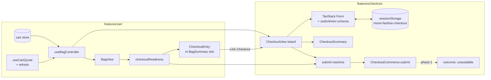
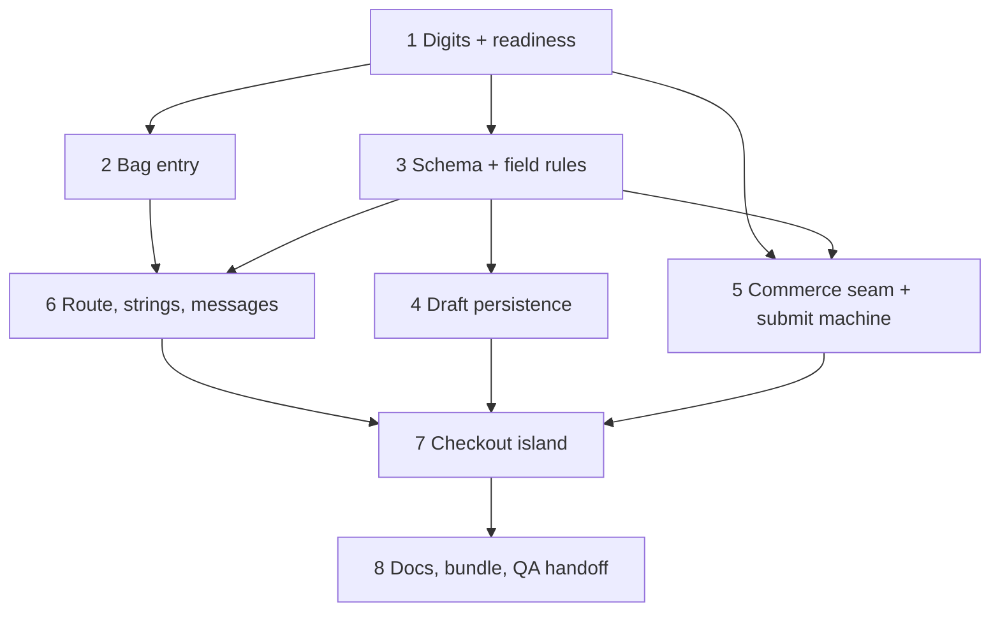

# feat: Storefront Checkout base UI (contact, delivery address, summary, commerce seam)

## Overview

Add `/[locale]/checkout`: a guest checkout page that collects contact and delivery-address
details with TanStack Form + Zod, shows an order summary built only from the
server's cart quote, and stops at a typed **commerce seam**. In this phase no adapter exists
behind that seam. The Bag page gains the entry into Checkout. It appears only when the
server's quote says the bag can actually be bought.

Nothing here creates an order, reserves or deducts stock, or takes payment. Choosing an
order/payment strategy (order API, gateway, IPN, COD, manual confirmation) is not part of
this plan, and nothing in it depends on that choice.

**Checkout is not public in production yet** (owner, 2026-09-15). The route and all its
architecture ship. Whether it is reachable is decided by one build-time constant, `CHECKOUT_ENABLED` (set through the `NEXT_PUBLIC_CHECKOUT_ENABLED` env variable)
(CO-22). Development and preview builds turn it on, so the page can be built and QA'd. Production
turns it off until a commerce/order strategy exists. When it is off, `/bag` shows no entry and
`/checkout` is a real 404. The "Online ordering isn't open yet" result is copy for development
and preview QA only, never final production copy.

Decision labels are **CO-n** (checkout decisions). Labels from earlier plans are always
qualified: *CD-n* (`2026-09-15-001` cart), *PD-n* (`2026-09-14-003` product detail),
*catalog KD-n* (`2026-09-14-002`).

## Problem Frame

Cart shipped (#205). It has an intent-only guest bag, a quote endpoint
(`POST /api/v1/catalog/cart/quote`), reconciliation, and an empty `[data-checkout-action]`
slot that CD-17 reserved "until Checkout exists". The next step for shoppers is to give
their details. The owner has not chosen the transaction architecture, so the deliverable
is the UI and a validated state with a seam that any later strategy can plug into:

```
Bag → /checkout → contact → delivery address → delivery-method structure
    → authoritative summary → validated form state → [future commerce boundary]
```

Already decided, and not to be asked again: guest checkout, no account, payment and order
architecture undecided, Checkout UI independent of both.

## Requirements Trace

- R1. Localized route `/[locale]/checkout`, with no route outside the locale prefix (request §3).
- R2. The Bag page leads to Checkout only when the bag is non-empty and the current quote is
  usable, with no unavailable or limited lines. Otherwise it shows why it cannot (§4).
- R3. Entering Checkout creates no order, reservation, stock change or transaction (§4, §20).
- R4. Contact section: guest, fields grounded in the domain, correct input types and
  `autocomplete`, EN/AR (§6).
- R5. Delivery address suited to Egypt, grounded in the existing online-order model, with no
  invented delivery eligibility or areas (§7, §8).
- R6. Delivery-method structure that shows no fees, durations, couriers or thresholds (§9).
- R7. Order summary from the authoritative quote only: image, localized name, options,
  quantity, line price, subtotal. No SKU, stock counts or ids (§10, §12).
- R8. Cart changes while on Checkout are shown explicitly and stop the future submission
  while they apply. Nothing is substituted silently (§11).
- R9. Totals: subtotal only. No delivery fee, tax, discount or grand total. The unknown
  delivery cost is stated in words, with no amount (§12).
- R10. TanStack Form + Zod: field errors, a submit-level state, touched behaviour, focus on
  the first invalid field, EN/AR messages (§13, §14).
- R11. Checkout state is kept apart from the cart store (§15).
- R12. A documented persistence decision covering privacy (§16, §38).
- R13. A future submit seam that takes form values plus quote identity and does not care
  which commerce strategy sits behind it (§17).
- R14. A truthful primary action: no fake success, confirmation or order number (§18).
- R15. No payment UI, no order API, no payment SDK (§19, §20, §37).
- R16. Header, footer and Back to Bag: the smallest shell change, never a trap (§21–§23).
- R17. Responsive summary behaviour, WCAG 2.2 AA, a calm announcement policy, Arabic/RTL,
  mobile at 320/375 (§24–§28).
- R18. Loading, error and empty-cart states. No stale price may look final (§29–§31).
- R19. Quote revalidation on entry, on returning to the tab, and before submit. No polling (§32).
- R20. Automated tests and an owner-run browser QA matrix (§35, §36).
- R21. Checkout-route JS stays lightweight and off every other page (§37).

## Scope Boundaries

- No order creation, order endpoint, database change, migration, reservation, deduction,
  transaction, IPN/webhook, payment UI or SDK, or COD selector.
- No delivery fees, zones, eligibility, courier names, durations, or a free-shipping threshold.
- No tax, promo codes, grand total, email/SMS, order confirmation, or accounts.
- No server changes, and no dashboard changes.
- No Checkout control in the Bag **drawer** (CO-4).
- No storefront browser/DOM test harness. That remains a separate decision; see *Risks*.
- No changes to the quote contract, `purchaseReadiness`, or the persisted cart shape (v1).
  The one change to `reconcileBag` is its announcement mark key (CO-13).

## Context & Research

### Relevant Code and Patterns

Storefront (`apps/storefront/`):
- `app/[locale]/bag/page.tsx`: a static per-locale server shell (`generateStaticParams`,
  `setRequestLocale`, `noindex, nofollow`, no `loading.tsx`), a rising `h1`, and a client
  island given resolved strings. `app/bag-route.test.ts` pins these as source assertions.
  Checkout copies the route shape exactly.
- `features/cart/components/use-bag-controller.ts`: the shared quote + `reconcileBag` +
  canonical correction + price memory + quote toasts. The drawer and the page each mount one,
  and the live-store check plus stable toast ids already stop duplicate toasts when two are
  mounted. Checkout mounts a third, as a read-only surface.
- `features/cart/api/use-cart-quote.ts`: `staleTime: 0`, `refetchOnMount: 'always'`,
  `keepPreviousData`, the app retry policy, enabled only while a surface is `active`.
  `refetchOnWindowFocus` keeps TanStack's default (`true`), because `get-query-client.ts`
  does not override it. `retry()` is fire-and-forget.
- `features/cart/utils/reconcile.ts`: `BagView` (`empty | loading | failed | ready`),
  `BagRow.status` (`ok | reduced | soldOut | variantUnavailable | productUnavailable |
  pending`), `BagSummary.state` (`current | stale`), `excludedPieces`, and `priceUpdated`
  notices. `cartQuoteKey(lines)` is the quote identity.
- `features/cart/utils/bag-view-model.ts`: `rowName`, `optionText`, `noticeText`, pure and
  reusable for summary lines.
- `features/cart/components/bag-summary.tsx`: the empty `[data-checkout-action]` slot
  (`empty:hidden`). `cart-line.tsx` exports `BagFigure` (stale/busy figure) and
  `BagPlaceholder`.
- `features/cart/utils/bag-strings.ts`: server-only string builders, plus the `PLURAL_KEYS`
  typecheck guard for plural families.
- `features/catalog/components/catalog-controls.tsx`: the storefront's only text-input
  precedent. It has a label above, a `min-h-12 rounded-sm border bg-bg` frame with a
  `focus-within` outline in `--focus-ring-color`, `aria-invalid`, `aria-describedby`, and a
  reserved `min-h-6` error row with `CircleAlert` + `text-error` that is **not** a live region.
- `features/products/components/purchase-panel.tsx`: native radios in a `fieldset`, the
  "Choose a {option}" inline error pattern, focus sent to the first unselected group.
- `components/ui/button.tsx`: `Button` defaults `type="button"`, has primary (ink) and
  secondary variants and `min-h-12`.
- `components/feedback/show-toast.ts`: the one `toast()` caller, lazy Sonner, stable ids.
- `features/catalog/search-params.ts` → `normalizeDigits`: maps Eastern Arabic/Persian
  digits to ASCII, but it is shaped for prices (grouping stripped, 1–9 digits). The mapping
  is what Checkout needs, not the price rule.
- `app/[locale]/layout.tsx`: one layout for every page (header with the `BagTrigger` slot,
  `main#main-content`, footer, toaster). There is no route-group layout split today.
- Tests: vitest `environment: 'node'`, only `**/*.test.ts`, no jsdom.
  `messages/messages.test.ts` enforces EN/AR key and placeholder parity.
- **Nothing imports `@tanstack/react-form` or `zod` today.** Both are declared dependencies
  (`@tanstack/react-form` 1.33.5, `zod` 3.25.76). Zod was removed from the eager path during
  Cart for bundle reasons (`c197a58`, CD-10 revised to a hand-written guard).
  `@tanstack/form-core` 1.33.5 ships `standardSchemaValidator`, and `zod/v4/mini` schemas
  implement `~standard` (`zod/v4/core/schemas.js`), so a mini schema can be a TanStack Form
  validator directly, with no adapter package.

Server (research only, nothing changes):
- `online_orders` (`001_initial_schema.sql`, columns added in `009`) plus
  `src/modules/commerce/onlineOrders/schemas.ts`: `customer_name` 1–100, `customer_phone`
  1–30, `customer_email` optional `email()`, `shipping_address` 1–255, `city` 1–50, `notes`
  ≤500, `shipping_fee` caller-supplied, `total = subtotal + shipping_fee`. Status
  `pending → processing → shipped → delivered | cancelled`. A stock hold goes into
  `stock_reservations` (48h) when the order is placed, and stock is deducted on
  processing. **Every route is Admin-only**, with the note "lift only with a named abuse
  control". The service finds or creates a `customers` row by phone.
- `customers`: `name` NOT NULL, `phone` UNIQUE NOT NULL (≤50 in the Zod schema), `email`
  nullable, no email in the customer schema, and a single free-text `address`.
- `delivery_orders`: `customer_name`, `phone`, free-text `address`, `shipping_cost`,
  `shipping_companies`. No zones or areas.
- No governorate, city or area list anywhere in the repo, and no delivery-fee setting.
  `settings.delivery_policy(_en)` is owner-edited public text, seeded with a placeholder.
- No phone-format validation anywhere (server or dashboard). The seed store phone is
  `+201001112233`.
- The quote DTO has no currency field (EGP major units by contract). The storefront label
  comes from `products.currency` messages.

Dashboard: customer and delivery forms use name + phone (`min(1)` only) + one free-text
address. There is no structured address and no email in the customer form.

### Institutional Learnings

- Zod strips unknown keys at a boundary. Test the boundary itself, not only what sits
  behind it (root `CLAUDE.md`, the `bundle_id` lesson). Here that means testing the
  form/submission builder with the real schema.
- A live region mounted alongside its message announces nothing, and competing regions
  talk over each other. The toaster is the one announcer (storefront `CLAUDE.md` → *Toasts*).
- `motion/react` and `next/dynamic` measured as hidden eager cost. Measure eager chunks per
  the storefront method before trusting a size claim (root `CLAUDE.md`).
- Under pnpm, a config or import that reaches into a transitive package breaks silently. Any
  `@tanstack/form-core` type must come through `@tanstack/react-form`'s re-exports (root
  `CLAUDE.md`, the HeroUI theme lesson).
- `docs/solutions/` does not exist.

### External References

No web research. Every layer has a local precedent or verified installed source:
Standard Schema support was read from `node_modules` (form-core `standardSchemaValidator`,
zod v4 core `~standard`). No geographic dataset is used (governorate is free text, CO-7).

## Key Technical Decisions

| # | Decision | Rationale |
| --- | --- | --- |
| CO-1 | **Route `app/[locale]/checkout/page.tsx`**, outside `(catalog)`, static per locale, `noindex, nofollow`, no canonical, no `loading.tsx` | Same case as `/bag`: the page reads no request data and the bag lives in the browser. `(catalog)`'s error boundary and KD-10 rules do not apply. |
| CO-2 | **The normal header and footer stay**; no checkout shell | The locale layout is the only layout. A simplified header would mean splitting it into route groups, which touches every page. The header gives a safe way out (logo, Bag). The footer adds no false claims (its placeholder contact is already a launch blocker in #201). The checkout page adds its own quiet "Back to bag" link. Revisit after the screenshot review. |
| CO-3 | **Readiness is a pure function of the bag view, owned by `features/cart`**: `checkoutReadiness({ hydrated, lines, view, fetch }, { strict })` → `hydrating \| empty \| checking \| failed{rejected} \| blocked{unavailable, limited, pieceNames} \| ready{quoteKey, pieces, subtotal, priceUpdated}`. `quoteKey` is `cartQuoteKey(lines)`, and it is only reported when `summary.state === 'current'`, which is exactly what `current` means in `reconcileBag`. `strict: false` is the Bag entry: a background refetch of a current quote for the same key keeps the last verdict. `strict: true` is the submit path: any fetch in flight counts as `checking` | The Bag entry (cart slice) and the checkout page both need it. Putting it in `cart` keeps the one-way edge `checkout → cart`, and `cart` never imports `checkout`, mirroring `products`/`cart`. Without the non-strict mode, every refetch on window focus would turn the entry from a link into a button and back, dropping keyboard focus and making the reason line flicker. |
| CO-4 | **The entry is on the Bag page only** (the `[data-checkout-action]` slot in `BagSummary`). The drawer's slot stays empty | The drawer has a "View bag" button, so review happens before Checkout. One entry point keeps "blocked" explanations in one place, next to the lines that cause them. |
| CO-5 | **Blocking rules**: `checking` (no quote yet, a stale summary, a `pending` row, or, strict only, a fetch in flight), `failed`, any unavailable line (`soldOut`/`variantUnavailable`/`productUnavailable`), or any `reduced` line. **A price update does not block**. It is shown as a notice | The quote only ever shows the current price, so continuing at that price is honest. An unavailable or limited line means the bag differs from what the shopper chose, and that is fixed in the Bag (CD-15: only the shopper changes a stored quantity). Checkout offers no stepper or Remove. Its notice links back to the Bag. |
| CO-6 | **Contact: full name (required), mobile phone (required), email (optional)** | Matches the only online-order model (`customer_name` required, `customer_phone` required, `customer_email` optional). The dashboard customer model has no email. No confirmation email exists to justify requiring it. |
| CO-7 | **Address: governorate (required, free text ≤50), city/area (required, text), street and building (required, text), floor and apartment (optional, text), landmark (optional, text)**. The governorate is its own component, `GovernorateField`, holding a plain string | The server has `shipping_address` (255) + `city` (50) and no structure. Governorate + area is how Egyptian addresses are given. **No list** (owner, 2026-09-15): delivery coverage has not been approved, and a select of every governorate would suggest Moon Fashion delivers everywhere. Once real zones exist, `GovernorateField` becomes a select of the supported list, and the schema rule becomes membership in that list. The value stays a string, so the draft and the submission shape do not change. The structured draft keeps every field. How the future adapter maps them onto `shipping_address`/`city` is its concern. |
| CO-8 | **Lengths fit the existing model**: name ≤100, phone ≤30 as typed, email ≤254, city/area ≤50, street ≤150, floor/apartment ≤50, landmark ≤200 | Any later order API built on `online_orders` accepts every valid draft: street (150) + ", " + apartment (50) stays under 255. Landmark fits `notes` (500). |
| CO-9 | **Phone is permissive, not Egypt-only**: digits normalised to ASCII, spaces, hyphens, dots and parentheses removed, optional leading `+`, then 8–15 digits | Nothing in the repo validates phone shape, and diaspora shoppers or landlines are plausible. 15 is E.164's maximum and 8 rejects obvious typos. Stored as typed and normalised only when the submission is built. `type="tel"`, `inputMode="tel"`, `autoComplete="tel"`, `dir="ltr"`. Egyptian mobile prefixes are not enforced: that business rule is not approved (owner, 2026-09-15). |
| CO-10 | **Form state in TanStack Form; the schema in `zod/v4/mini`, imported only by the checkout slice** | The request requires both. Mini is the smallest Zod entry and is a Standard Schema that form-core consumes natively. Only the checkout route loads it, so no other page gets heavier (the CD-10 lesson). Error `message`s are **keys** (`required`, `phoneInvalid`, `emailInvalid`, `tooLong`), resolved to EN/AR strings by the island. Zod's own English text never reaches the UI. |
| CO-11 | **Validation timing**: a field validates on blur once touched, re-validates on change while it shows an error, and the whole form validates on submit. Errors show when `isTouched` or after one submit attempt | Nothing turns red mid-typing, and once an error is shown it clears as soon as the input is fixed. |
| CO-12 | **Announcement policy for validation: focus, not a live region or toast.** On an invalid submit, focus moves to the first invalid field in DOM order. Its error is linked with `aria-describedby`, so the screen reader reads label, "invalid" and the error once. No error summary block and no toast | One announcement, from the element the shopper must fix. A toast arriving at the same moment would compete with the focus announcement, and a summary would repeat every error at once. **When the first invalid field already has focus** (for example Enter pressed inside it), `focus()` fires no event. The island then blurs the field and focuses it again on the next animation frame, so it is still announced with its error. **No toast for form validation** (owner, 2026-09-15). Toasts and status messages are only for events outside the fields, where inline feedback is not enough: quote update or failure, the outcome. This deliberately departs from the storefront `CLAUDE.md` → *Toasts* decision 4 pattern (toast + inline) used by the product page and the filter sheet. |
| CO-13 | **Cart problems on Checkout are shown and block submission; they never redirect.** A `CheckoutCartNotice` above the form (a heading with `tabIndex=-1` and text, not a live region) states the reason and links to the Bag. The existing quote toast ("Your bag was updated…") is the announcement | A redirect loses the context of what happened. Typed details stay (persistence, CO-16). The notice names the affected pieces, so the shopper does not have to open the collapsed summary. The controller's toasts cover update and failure announcements. **One small cart change:** `reconcileBag`'s `announcement.markKey` (and the failure key) becomes the quote key **plus an issue signature** (per-line statuses, or the failure). Today a second stock change under the same line/quantity key is silent, because the key ignores stock and price. |
| CO-14 | **Quote revalidation**: on entry (`refetchOnMount: 'always'`, existing), on window focus (TanStack default, existing), and **before every submit**. The submit path uses a new `refresh(): Promise<void>` on the quote hook, and the machine accepts a readiness verdict only after a `refreshed` event, which is sent when that promise settles. A `ready` verdict seen earlier is ignored, because in the commit that enters `verifying` TanStack still reports the previous settled quote. `refresh()` refetches the *current* query key. During the 300ms quantity debounce that can still be the previous lines, and the machine's quote-key equality check closes that gap. No interval | These are the three moments a stale quote could mislead. A bag edited in another tab arrives through the `storage` event, changes the quote key and re-quotes at once. |
| CO-15 | **Primary action "Continue"**, which runs the submit machine: validate, refresh quote, check readiness, then call the commerce seam. This phase's seam returns `unavailable`, and the page says so inline and in one info toast: "Online ordering isn't open yet. Your details are kept for this browser session." That result copy is for **development and preview QA only** (message key `checkout.outcome.unavailablePreview`). It is never production customer copy, and production cannot reach it because the route is off there (CO-22) | "Place order" and "Continue to payment" promise things that do not exist. "Continue" is true: the details are checked and kept. There is no fake confirmation, order number or navigation. The outcome row is not a dead end: it carries "Back to bag" and "Continue shopping" links. Pressing Continue again re-runs the machine and replaces the same toast. Whether the route and entry exist at all is `CHECKOUT_ENABLED` (CO-22). |
| CO-16 | **Persistence: `sessionStorage`, key `moon-fashion-checkout`, `{ version: 1, draft }`**, contact and address strings only. Written with a debounce and on `pagehide`, read once after hydration, validated per field by the same mini schema's shape (a field that fails its length or type rule is dropped; content validity is **not** required for restore) | It survives a refresh and a Back-to-Bag round trip in the same tab, which is the "don't trap" case. **Retention is the browsing session, not strictly the tab.** Browsers restore `sessionStorage` when a closed tab is reopened (Ctrl+Shift+T), when a session is restored after restart, and when a tab is duplicated. On a shared computer the next person can therefore get the details back in those cases. That is still far shorter than `localStorage`, which keeps data across visits. Never payment data, tokens, the quote or prices. Browser `autocomplete` already fills returning shoppers. There is no "Remember my details" option or any other customer-facing persistence control: this is only a convenience draft for the current browser session (owner, 2026-09-15). |
| CO-17 | **The commerce seam is a typed module in the checkout slice**: `CheckoutSubmission = { contact, address, deliveryMethod: string \| null, cart: { quoteKey, lines } }` (intent lines: slug, options, quantity; **no prices**) → `CheckoutCommerce.submit(submission): Promise<CheckoutOutcome>`, where this phase's `CheckoutOutcome` is `{ kind: 'unavailable' }` only | The server must re-price and re-check under lock (CD-6), so client prices never travel. **`quoteKey` is untrusted client input.** It is derived from the same lines and ignores prices and stock, so it can serve only as a correlation or diagnostic value, never as proof of what the shopper saw. Detecting "the price changed since the shopper agreed" needs a server-issued quote identity, which is a decision for the commerce plan (see *Future Considerations*). Any future adapter must therefore be able to return an outcome that the UI shows *before* an order is final when the server re-prices. Later strategies extend `CheckoutOutcome` (a redirect URL, pending confirmation, re-priced, a placed order) without the form changing. No endpoint, action or network call exists now. **Seam invariants** (recorded in storefront `CLAUDE.md`): the submission goes in a request body, never in a URL or query; a redirect outcome is followed only to an allowlisted origin; submission and form values are never logged or sent to error reporting; credentials are explicit per adapter; a successful outcome calls `clearDraft`. **Commerce invariants** (owner, 2026-09-15; the commerce strategy itself stays deferred: API-first, gateway-first, IPN/webhook, manual confirmation, COD or a mix): before any order becomes final, the future implementation MUST, on the server, revalidate products and variants, revalidate stock, reprice every line, determine delivery, and calculate the final payable total. The quote shown on Checkout is authoritative for the current UI state only. It is **never** a transaction guarantee. |
| CO-18 | **The delivery-method section renders from `deliveryMethods: DeliveryMethodOption[]`**, empty in this phase. Empty means a heading and one neutral sentence ("Delivery options will be confirmed later."), with no radios and nothing about timing, coverage, fees or couriers, and `deliveryMethod` is `null` and not validated. When it is non-empty, a native radio `fieldset` becomes required | The layout is ready without inventing fees or couriers. The summary shows a "Delivery" row reading "Confirmed later", with no figure and no Total. |
| CO-19 | **The summary shows its lines below 1024 through a disclosure** (one island-owned `aria-expanded` button, closed by default, opened automatically when readiness becomes `blocked`, and closable again, with subtotal and piece count always visible in its row). From 1024 it is a sticky right column with the lines always shown and the button hidden. Its line list scrolls inside `max-height: calc(100svh - var(--header-h) - <totals height>)`, so Subtotal, Delivery and Edit bag stay reachable for a 30-line bag. The scroll region is labelled and `tabIndex=0` when it overflows. **One DOM**, placed before the form in source order and positioned with grid placement | Below 1024 a long bag would push the form down several screens, while the collapsed row still shows what and how much. Focus order matches the visual order in the stacked layout. From 1024, focus and screen readers reach the summary (Edit bag) before the form, even though it sits in the right column. That is accepted and documented: "what you are buying" before "your details" is a sensible reading order, and it avoids duplicated DOM or a CSS `order` swap. It is a QA row. One DOM avoids duplicate images and duplicate screen-reader content. The screenshot review confirms it. |
| CO-20 | **The form renders only after the cart store hydrates, uses `method="post"` with `preventDefault` as the first statement of `onSubmit` (before any logic that can throw), and has `noValidate`**. The restored draft is the form's `defaultValues`, read in the same hydration step that reveals the form, so no field is filled in after it becomes interactive | A form rendered in server HTML could be submitted before hydration as a GET to `/checkout?name=…`, putting personal data in the URL, history and logs. Hydration gating removes that path and also stops an empty bag from flashing a usable form. `noValidate` avoids browser bubbles competing with CO-12. |
| CO-21 | **Eighteenth client boundary: `features/checkout/components/checkout-view.tsx`**, the only one. The form, summary, disclosure and notice live under it | All of it depends on the store, the quote and form state. No smaller leaf can carry it. The page shell (`h1`, Back to bag) stays server-rendered. |
| CO-22 | **Production gating: `CHECKOUT_ENABLED`**, resolved at build by a pure `resolveCheckoutEnabled(nodeEnv, flag)` in `features/cart/utils/checkout-availability.ts`. An explicit `NEXT_PUBLIC_CHECKOUT_ENABLED` of `true` or `false` wins; otherwise it is on when `NODE_ENV !== 'production'`. Preview deployments (production builds) set it to `true`, and production leaves it unset. `features/cart/constants.ts` re-exports it as `CHECKOUT_ENTRY_ENABLED`, an alias of the same value used by the entry; the page reads `CHECKOUT_ENABLED` directly. When it is off, the Bag entry renders nothing and `app/[locale]/checkout/page.tsx` calls `notFound()` | Owner, 2026-09-15: do not expose unfinished Checkout publicly. A build-time switch keeps the route static, and the code paths still compile and stay tested. Development defaults on without configuration. A 404 matches how every other unbuilt route behaves (the catch-all), so nothing public hints at an unfinished flow. |

## Open Questions

### Resolved During Planning

- *Is there an existing address/governorate/area model or API?* No (see research). Hence
  CO-7: structured draft fields, all free text, with governorate behind a replaceable component.
- *Is there a delivery fee or zone rule?* No. Fees exist only per record, supplied by the
  caller, so CO-18 renders no amount.
- *Can TanStack Form use Zod without an adapter package?* Yes. form-core 1.33.5 accepts
  Standard Schema, and `zod/v4/mini` implements it (verified in `node_modules`).
- *Does the existing online-order endpoint fit a future storefront submit?* Not as it stands:
  it is Admin-only by design, trusts a caller-supplied `shipping_fee`, and finds or creates
  customers by phone (a guest could attach an order to someone else's customer record).
  Recorded as future work, not changed here.
- *Where does readiness live without a cyclic slice edge?* In `features/cart` (CO-3).
- *Redirect or render for an empty bag on `/checkout`?* Render the Bag's empty state
  (heading + Continue shopping). A client redirect after hydration flashes and would
  need JS anyway (static page), and the empty state follows the existing convention.
- *Header/footer?* Kept (CO-2).
- *Same DOM order in Arabic?* Yes: governorate → city/area → street → floor/apartment →
  landmark, broad to specific, in both locales. Logical CSS mirrors the layout.

### Deferred to Implementation

- The exact TanStack Form API surface for field-level Standard Schema validators vs
  form-level `validators.onSubmit` with a Zod object (both supported). Pick whichever maps
  errors to field names without casts, and keep the error *keys* contract.
- Whether `zod/v4/mini`'s `check`/`refine` spelling in 3.25.76 differs from zod 4 docs.
  Read the installed `.d.ts`.
- The measured gzip cost of TanStack Form + mini on `/en/checkout` (budget below).
- The draft-write debounce (start at 400ms).
- Whether `useBagController` needs an options flag to skip quantity/remove wiring for a
  read-only surface, or whether leaving the handlers unused is enough (keep the change minimal).

## High-Level Technical Design

> Directional only. These show the shape and flow, not implementation specs.

### Slices and data flow



### Submit machine (pure, unit-tested)

| State | Event | Next | Effect |
| --- | --- | --- | --- |
| `idle` / `outcome` | submit | `validating` | run the form's submit validation |
| `validating` | invalid | `idle` | focus first invalid field (CO-12) |
| `validating` | valid | `verifying{refreshed: false}` | `await quote.refresh()` then dispatch `refreshed` |
| `verifying{refreshed: false}` | any readiness | unchanged | ignored: the verdict predates the refresh |
| `verifying` | `refreshed` | `verifying{refreshed: true}` | — |
| `verifying{refreshed: true}` | strict readiness `checking`, or `ready` with a key ≠ current lines | unchanged | wait (button `aria-disabled`, "Checking your bag") |
| `verifying{refreshed: true}` | `ready` (key = current lines) | `submitting` | `commerce.submit(buildSubmission(values, lines, quoteKey))` |
| `verifying{refreshed: true}` | `blocked` / `failed` | `idle` | focus the cart notice heading |
| `verifying{refreshed: true}` | `empty` | `idle` | the view switches to the empty state; focus its heading |
| `submitting` | outcome | `outcome{kind}` | inline status + one toast |
| `outcome` | form value change or quote key change | `idle` | clear inline status |
| any busy state | submit | unchanged | ignored (double-submit guard) |

### Page composition

```
server: page.tsx
  Container
    "Back to bag" link (server, i18n Link, logical arrow)
    h1 "Checkout" (rise, like /bag)
    CheckoutView (island, resolved strings)
      ├─ !hydrated → reserved aria-busy region (form column + summary shell)
      ├─ empty     → Bag empty state (heading + Continue shopping)
      └─ otherwise → grid lg:12
           aside  CheckoutSummary   (source first; lg: col 9-12, row 1, sticky)
           div    CheckoutCartNotice (blocked, failed, ready with priceUpdated > 0,
                                      or checking after a submit attempt)
                  form: Contact · Delivery address · Delivery · Continue + status
```

## Field Specification

| Field (draft key) | Section | Required | Control | `autoComplete` | `inputMode` / `dir` | Rule (error key) |
| --- | --- | --- | --- | --- | --- | --- |
| `fullName` | Contact | yes | text | `name` | — | trimmed non-empty (`required`); ≤100 (`tooLong`) |
| `phone` | Contact | yes | `type="tel"` | `tel` | `tel`, `dir="ltr"` | non-empty (`required`); CO-9 shape (`phoneInvalid`); ≤30 (`tooLong`) |
| `email` | Contact | no, "Optional" | `type="email"` | `email` | `email`, `dir="ltr"` | empty allowed; else email shape (`emailInvalid`); ≤254 |
| `governorate` | Address | yes | text (`GovernorateField`, replaceable by a supported-list select later) | `shipping address-level1` | — | trimmed non-empty (`required`); ≤50 (`tooLong`) |
| `area` | Address | yes | text | `shipping address-level2` | — | trimmed non-empty; ≤50 |
| `street` | Address | yes | text, hint "Street name and building number" | `shipping address-line1` | — | trimmed non-empty; ≤150 |
| `apartment` | Address | no | text, "Floor and apartment" | `shipping address-line2` | — | ≤50 |
| `landmark` | Address | no | text, "Landmark or directions" | `off` | — | ≤200 |

Required fields carry `aria-required="true"` and no asterisk. Optional fields show a
visible "(Optional)" in the label, since fewer marks are calmer and it tells screen-reader
users the same thing. `enterKeyHint="next"` on every field except the last. Labels sit
above inputs, and hint text is linked with `aria-describedby` before the error id.
`dir="ltr"` inputs in Arabic align to the inline start of the page (`rtl:text-right`,
documented as the one physical alignment, because the element's own direction is LTR).

## Implementation Units



- [x] **Unit 1: Shared pure foundations: ASCII digits and checkout readiness**

**Goal:** A reusable digit mapper, and the one readiness rule the Bag entry and Checkout share.

**Requirements:** R2, R8, R9, R18

**Dependencies:** None

**Files:**
- Create: `apps/storefront/lib/utils/ascii-digits.ts`
- Modify: `apps/storefront/features/catalog/search-params.ts` (`normalizeDigits` uses the mapper; behaviour unchanged)
- Create: `apps/storefront/features/cart/utils/checkout-readiness.ts`
- Test: `apps/storefront/lib/utils/ascii-digits.test.ts`, `apps/storefront/features/cart/utils/checkout-readiness.test.ts`
- Modify: `apps/storefront/features/cart/utils/reconcile.ts` (announcement mark key = quote key + issue signature, CO-13)
- Test (unchanged, must stay green): `apps/storefront/features/catalog/search-params.test.ts`
- Test: `apps/storefront/features/cart/utils/reconcile.test.ts` (mark key scenarios)

**Approach:**
- `toAsciiDigits(raw)` maps U+0660–0669 and U+06F0–06F9 and does nothing else (no trimming or
  grouping). The price-specific rules stay in `normalizeDigits`.
- `checkoutReadiness({ hydrated, lines, view, fetch }, { strict })` returns the CO-3 union.
  `checking` when view is `loading`, summary `stale`, any row `pending`, or (strict only)
  `fetch.status === 'fetching'`. `failed` carries `rejected` (a 400 `VALIDATION_ERROR`, which
  retry cannot fix). `blocked` carries counts of unavailable and reduced rows and their
  display names (via `rowName`). `ready` carries `quoteKey = cartQuoteKey(lines)`, `pieces`,
  `subtotal` and `priceUpdated` (count of rows with that notice).
- `reconcileBag`'s announcement mark key gains an issue signature (sorted
  `lineKey:status[:priceUpdated]` of rows with issues; `failed:` + quote key + error class for
  failures). Nothing else in reconciliation changes.

**Patterns to follow:** `bag-view-model.ts` (pure functions, rich JSDoc, no DOM), `reconcile.ts` status sets.

**Test scenarios:**
- Happy path: `١٢٣` → `123`; `۰۱۲` → `012`; mixed `+٢٠ 10` → `+20 10` (spaces kept).
- Happy path: ready view, current summary, all rows `ok`, fetch settled → `ready` with the quote key and subtotal.
- Edge case: not hydrated → `hydrating`; `empty` view → `empty`.
- Edge case: `loading` view → `checking`; ready view with `stale` summary → `checking`; one `pending` row → `checking`.
- Edge case: a current ready view with fetch `fetching` (a focus refetch, same key) → strict `checking`, non-strict `ready`.
- Integration (reconcile): same quote key, first quote has one `soldOut` line, second has two → two different mark keys (two announcements); an identical re-quote → same mark key (no repeat); failure → recovery → failure again under the same key → announced again.
- Edge case: one `soldOut` and one `reduced` → `blocked { unavailable: 1, limited: 1 }`; `productUnavailable` counts as unavailable.
- Edge case: a row with a `priceUpdated` notice and nothing else → `ready` with `priceUpdated: 1` (non-blocking, CO-5).
- Error path: failed view with `canEmpty` → `failed { rejected: true }`; network failure → `rejected: false`.
- Integration: `normalizeDigits` still rejects `0`-only groupings and 10-digit values exactly as before.

**Verification:** Readiness is derived purely from `BagView`, with no store or DOM access. Catalog digit behaviour is unchanged.

- [x] **Unit 2: Bag page entry into Checkout**

**Goal:** Fill `BagSummary`'s `[data-checkout-action]` slot with an entry that is a link only when ready.

**Requirements:** R2, R3, R16

**Dependencies:** Unit 1

**Files:**
- Create: `apps/storefront/features/cart/components/checkout-entry.tsx` (client-bundled, no directive; only `bag-view.tsx` reaches it)
- Modify: `apps/storefront/features/cart/components/bag-summary.tsx` (takes `readiness` + entry strings; renders the entry inside the slot)
- Modify: `apps/storefront/features/cart/components/bag-view.tsx` (computes readiness from the controller; passes it)
- Modify: `apps/storefront/features/cart/utils/bag-strings.ts` (`BagSummaryStrings.checkout`: `action`, `checking`, `blockedUnavailable` plural, `blockedLimited` plural, `failed`)
- Modify: `apps/storefront/features/cart/constants.ts` (`CHECKOUT_HREF = '/checkout'`, `CHECKOUT_ENTRY_ENABLED`)
- Create: `apps/storefront/features/cart/utils/checkout-availability.ts` (`resolveCheckoutEnabled`, `CHECKOUT_ENABLED`, CO-22)
- Modify: `apps/storefront/.env.example` (`NEXT_PUBLIC_CHECKOUT_ENABLED`, documented: unset in production, `true` on preview)
- Test: `apps/storefront/features/cart/utils/checkout-availability.test.ts`
- Modify: `apps/storefront/messages/en.json`, `apps/storefront/messages/ar.json` (`bag.checkout.*`)
- Create: `apps/storefront/features/cart/utils/checkout-entry-model.ts`
- Test: `apps/storefront/features/cart/utils/checkout-entry-model.test.ts`, `apps/storefront/features/cart/utils/bag-strings.test.ts` (plural keys)

**Approach:**
- Readiness is computed non-strict (CO-3), so a focus refetch of an unchanged bag never flips the entry.
- `checkoutEntryModel(readiness, enabled)` returns `{ kind: 'none' }` for `empty`, `hydrating`
  or `enabled === false` (`CHECKOUT_ENTRY_ENABLED`, CO-22), `{ kind: 'link' }` for
  `ready`, and `{ kind: 'unavailable', reason }` otherwise, where `reason` is
  `checking | unavailable{n} | limited{n} | failed`. When it is `none`, the summary already
  reserves the place.
- Ready: an i18n `Link` to `CHECKOUT_HREF`, styled as the primary ink button, full width in
  the summary. Unavailable: a `button type="button"` with `aria-disabled="true"`, focusable and
  inert on press, carrying `aria-describedby` to a visible reason line ("Remove or update 1
  piece to continue"). The same pattern as the sold-out Add to Bag.
- The reason line sits in a reserved `min-h` row, so the summary never jumps. It is not a
  live region: bag changes already announce through the quote toast.
- The drawer is unchanged (CO-4).

**Patterns to follow:** `add-to-bag-button.tsx` sold-out `aria-disabled`; `bag-summary.tsx` reserved figure layout; `PLURAL_KEYS` guard.

**Test scenarios:**
- Happy path: `ready` → `link`.
- Edge case: `checking` → unavailable `checking`; `blocked { unavailable: 2, limited: 0 }` → reason `unavailable` with 2; both non-zero → `unavailable` wins (it needs the stronger action: Remove).
- Error path: `failed` → reason `failed` (the retry control stays in the failed view, not in the entry).
- Edge case: `empty` and `hydrating` → `none`; `ready` with `enabled: false` → `none`.
- Gating: `resolveCheckoutEnabled('development', undefined)` → true; `('test', undefined)` → true; `('production', undefined)` → false; `('production', 'true')` → true; `('development', 'false')` → false; any other flag value (`'1'`, `'yes'`) → the `NODE_ENV` default.
- Integration: every new plural family is listed in `PLURAL_KEYS` and present in both catalogues (existing parity test).

**Verification:** `/bag` shows Checkout only for a fully purchasable, freshly quoted bag. Otherwise it explains why without moving the layout.

- [x] **Unit 3: Checkout schema, field errors, phone rule**

**Goal:** The validated shape of checkout state, independent of UI.

**Requirements:** R4, R5, R10, R12

**Dependencies:** Unit 1

**Files:**
- Create: `apps/storefront/features/checkout/schemas/checkout-form.ts` (`zod/v4/mini`; exports the schema, `CheckoutFormValues`, `EMPTY_CHECKOUT_VALUES`, `CHECKOUT_FIELD_ORDER`, `CHECKOUT_LIMITS`)
- Create: `apps/storefront/features/checkout/utils/phone.ts` (`normalizePhone`, `isPlausiblePhone`)
- Create: `apps/storefront/features/checkout/utils/field-errors.ts` (`fieldErrorKey(errors)`, `firstInvalidField(errorsByField, order)`)
- Create: `apps/storefront/features/checkout/constants.ts`
- Test: `apps/storefront/features/checkout/schemas/checkout-form.test.ts`, `apps/storefront/features/checkout/utils/phone.test.ts`, `apps/storefront/features/checkout/utils/field-errors.test.ts`

**Approach:**
- Values are plain strings, and every field, governorate included, is free text. The schema trims for
  checks, but the draft keeps what was typed.
- Each issue's `message` is an error key from CO-10, with `max` passed as a param for
  `tooLong`. `fieldErrorKey` reads the first issue for a field, and unknown messages map to
  `required` so raw library text never renders.
- `CHECKOUT_FIELD_ORDER` is the DOM order in the Field Specification and is the only source
  for focus-first-invalid.
- Tests drive the schema both directly and through `@tanstack/react-form`'s exported
  `FormApi` (constructed in node, no DOM) with the planned `validators`. That proves the
  Standard Schema wiring and the errors-per-field mapping at the real boundary.
- No storefront file outside `features/checkout` imports `zod`. A test greps the source tree
  to enforce it (the eager-bundle guard).

**Execution note:** Implement the schema test-first. It is the contract every later unit consumes.

**Patterns to follow:** `features/cart/schemas/persisted-cart.ts` (limits mirrored from the server, rationale in comments); `catalog-controls-state.ts` (pure input rules).

**Test scenarios:**
- Happy path: a complete valid draft passes. Email empty passes. Apartment and landmark empty pass.
- Error path: whitespace-only `fullName` → `required`; 101 chars → `tooLong` with max 100.
- Error path: phone `abc` → `phoneInvalid`; `1234567` (7 digits) → `phoneInvalid`; 16 digits → `phoneInvalid`; empty → `required`.
- Happy path: phone `01001112233`, `+20 100 111 2233`, `(010) 0111-2233`, `٠١٠٠١١١٢٢٣٣` all pass; `normalizePhone` yields `01001112233` / `+201001112233`.
- Edge case: `+` alone, `++20…`, a `+` in the middle → `phoneInvalid`.
- Error path: email `a@` → `emailInvalid`; 255 chars → `tooLong`.
- Error path: governorate `''` or whitespace → `required`; 51 chars → `tooLong`; any other text (`Cairo`, `القاهرة`) passes, since no coverage list exists.
- Edge case: street exactly 150 passes, 151 fails; area 50/51.
- Integration: `FormApi` with the schema, `handleSubmit` on empty values → errors on exactly `fullName`, `phone`, `governorate`, `area`, `street`; `firstInvalidField` → `fullName`. With only `street` invalid → `street`.
- Integration: an error message that is not a known key → `fieldErrorKey` returns `required`.
- Guard: no file outside `features/checkout/` contains a `zod` import.

**Verification:** The schema is the single validation authority. Messages are keys, and the FormApi boundary test passes.

- [x] **Unit 4: Checkout draft persistence (sessionStorage)**

**Goal:** Typed details survive a refresh and a Back-to-Bag round trip in the same tab, safely.

**Requirements:** R11, R12, R16, R18

**Dependencies:** Unit 3

**Files:**
- Create: `apps/storefront/features/checkout/utils/checkout-draft-storage.ts` (`readDraft(storage)`, `writeDraft(storage, values)`, `clearDraft(storage)`, `parseDraft(raw)`)
- Test: `apps/storefront/features/checkout/utils/checkout-draft-storage.test.ts`

**Approach:**
- Envelope `{ version: 1, draft: Partial<CheckoutFormValues> }`, key in `constants.ts`.
- `parseDraft`: any JSON error, a non-object, or `version !== 1` → `null`, and the caller
  removes the key. A draft field is kept only if it is a known key, a string, and within that
  field's length limit, so extra keys are dropped. Field *content* validity (a bad phone) is
  not required: the shopper sees their own text and the normal error on blur or submit.
- Storage access is wrapped. A throwing `sessionStorage` (sandbox, disabled site data) means
  no persistence and nothing thrown. Values are never logged, even on parse failure.
- The draft is never cleared automatically in this phase (the browsing session is the retention, CO-16).
  A future successful commerce outcome calls `clearDraft`.

**Patterns to follow:** `features/cart/utils/cart-storage.ts` (`parseCart`, injected storage getter, never throws).

**Test scenarios:**
- Happy path: write then read round-trips all eight fields.
- Edge case: `null` (never written) → `null`, no write.
- Error path: malformed JSON → `null` and the key removed; `{ version: 2 }` → `null` and removed; an array → `null`.
- Edge case: `{ version: 1, draft: { fullName: 'A', price: 5, phone: 123 } }` → only `fullName` kept.
- Edge case: a `street` of 151 chars dropped, the others kept.
- Edge case: a `__proto__` key is ignored, and the prototype is not polluted.
- Error path: a storage whose `getItem`/`setItem` throw → read `null`, write no-op, no throw.
- Privacy: the module never calls `console` with draft content (a spy asserts no call receives a value).

**Verification:** Persistence is session-scoped, versioned, minimal, validated before use, and never throws.

- [x] **Unit 5: Commerce seam, submission builder, submit machine; quote refresh**

**Goal:** The future boundary and the pure orchestration from Continue to outcome.

**Requirements:** R3, R8, R13, R14, R15, R19

**Dependencies:** Units 1, 3

**Files:**
- Create: `apps/storefront/features/checkout/commerce/checkout-commerce.ts` (`CheckoutSubmission`, `CheckoutOutcome`, `CheckoutCommerce` types)
- Create: `apps/storefront/features/checkout/commerce/unavailable-commerce.ts` (this phase's implementation: resolves `{ kind: 'unavailable' }`, no I/O)
- Create: `apps/storefront/features/checkout/commerce/index.ts` (exports the active `checkoutCommerce`, the one line a future strategy replaces)
- Create: `apps/storefront/features/checkout/utils/build-submission.ts`
- Create: `apps/storefront/features/checkout/utils/submit-machine.ts` (reducer per the table above)
- Modify: `apps/storefront/features/cart/api/use-cart-quote.ts` (add `refresh(): Promise<void>`; `retry` unchanged)
- Modify: `apps/storefront/features/cart/components/use-bag-controller.ts` (return `lines`, `fetch` and `refresh` alongside the existing fields)
- Test: `apps/storefront/features/checkout/utils/build-submission.test.ts`, `apps/storefront/features/checkout/utils/submit-machine.test.ts`, `apps/storefront/features/checkout/commerce/unavailable-commerce.test.ts`, `apps/storefront/features/cart/api/use-cart-quote.test.ts`

**Approach:**
- `buildSubmission(values, lines, quoteKey)` trims strings, normalises the phone, turns an
  empty optional into `null`, and copies intent lines (`slug`, `options`, `quantity`) from
  the store. It carries no price, subtotal, product name or image.
- The machine is a pure reducer over `{ phase }` with events `submit`, `validated{ok}`,
  `refreshed`, `readiness{value}`, `outcome{kind}`, `edited`, `quoteKeyChanged`. The island performs the
  effects. Readiness is re-checked at `verifying` with a quote key that must equal the key of
  the current store lines, so a bag edited in another tab mid-submit can never submit old lines.
- `unavailable-commerce` imports nothing from `lib/api`. A test asserts it performs no
  `fetch` (a global `fetch` spy).

**Patterns to follow:** `add-to-bag-action.ts` (intent + toast descriptor as pure functions); `toCartQuoteFetch` mapping style.

**Test scenarios:**
- Happy path: `idle` → submit → `validating` → valid → `verifying{refreshed: false}` → `refreshed` → `verifying{refreshed: true}` → readiness `ready` (same key) → `submitting` → outcome `unavailable` → `outcome{unavailable}`.
- Error path: `validating` → invalid → `idle` with effect `focusFirstInvalid`.
- Error path (the refresh race): `verifying{refreshed: false}` + `ready` → unchanged; then `refreshed` + `blocked` → `idle` with `focusCartNotice`. A pre-refresh `ready` never reaches `submitting`.
- Edge case: `verifying{refreshed: true}` + `checking` stays; then `blocked` → `idle` with effect `focusCartNotice`; `failed` → same; `empty` → `idle` with `focusEmptyHeading`.
- Edge case: `verifying{refreshed: true}` + `ready` with a key differing from the current lines → stays `verifying` (waits for the re-quote).
- Edge case: `refresh` rejects or the quote fails → `refreshed` is still dispatched, and readiness `failed` leads to `idle`.
- Edge case: submit while `validating`/`verifying`/`submitting` → unchanged (double-submit guard).
- Edge case: `outcome` + `edited` → `idle`; `outcome` + `quoteKeyChanged` → `idle`.
- Happy path: `buildSubmission` → phone `+20 100 111 2233` becomes `+201001112233`, empty email becomes `null`, apartment `'  '` becomes `null`, lines copied, and no numeric price field anywhere in the object (deep key scan for `price`, `subtotal`, `lineTotal`, `unitPrice`).
- Integration: `unavailableCommerce.submit` resolves `unavailable` with zero `fetch` calls.
- Integration: `refresh` on the quote hook returns the refetch promise for the current query key; an error rejects nothing to the caller (resolves), leaving state to `fetch.status`. Called during a pending quantity debounce, it resolves for the previous lines' key, and the machine's key check keeps waiting.

**Verification:** The seam compiles independently of any strategy, the submission contains intent only, and the machine never reaches `submitting` on a stale, blocked or failed bag.

- [x] **Unit 6: Route shell, server strings, messages**

**Goal:** `/[locale]/checkout` exists as a static, noindex page with resolved EN/AR strings.

**Requirements:** R1, R4–R7, R9, R16, R17

**Dependencies:** Units 2, 3

**Files:**
- Create: `apps/storefront/app/[locale]/checkout/page.tsx`
- Create: `apps/storefront/features/checkout/utils/checkout-strings.ts` (`server-only`; `getCheckoutPageStrings`, `getCheckoutMetadataStrings`; reuses `getBagPageStrings` for line, summary and status strings)
- Modify: `apps/storefront/messages/en.json`, `apps/storefront/messages/ar.json` (`checkout.*`: `title`, `metaTitle`, `metaDescription`, `backToBag`, `sections.{contact,address,delivery}`, `fields.*.{label,hint}`, `optional`, `errors.{required,phoneInvalid,emailInvalid,tooLong}`, `delivery.pending`, `summary.{heading,delivery,deliveryLater,editBag}`, `notice.{checking,unavailable,limited,failed,rejected,priceUpdated,returnToBag,tryAgain}`, `action.{continue,checking}`, `outcome.{unavailablePreview,backToBag,continueShopping}`)
- Test: `apps/storefront/app/checkout-route.test.ts`, `apps/storefront/features/checkout/utils/checkout-strings.test.ts`

**Approach:**
- The page mirrors `bag/page.tsx`: `generateStaticParams`, `hasLocale` → `notFound`,
  `setRequestLocale`, `robots: { index: false, follow: false }`, a server "Back to bag" link
  (`@/i18n/navigation` `Link` to `BAG_HREF`, lucide arrow mirrored with `rtl:-scale-x-100`),
  the rising `h1`, then `CheckoutView` with strings, `locale`, `shopHref`, `bagHref`, and
  `deliveryMethods={[]}`.
- When `CHECKOUT_ENABLED` is false, the page and `generateMetadata` call `notFound()` (CO-22).
  The static build then emits the 404 for both locales.
- `outcome.unavailablePreview` is recorded in storefront `CLAUDE.md` (Unit 8) as development
  and preview QA copy only, to be replaced by the commerce plan. The key name itself says so.
- Arabic copy is feminine singular (storefront register B-4). It is a first draft flagged for
  the native review on #201.

**Patterns to follow:** `app/[locale]/bag/page.tsx`, `app/bag-route.test.ts`, `bag-strings.ts`.

**Test scenarios:**
- Route: the page exists at `app/[locale]/checkout/page.tsx`, not under `(catalog)`, and `(catalog)/checkout` does not exist.
- Route: no `loading.*` file at `app`, `[locale]` or `checkout`.
- Route: the source contains `robots: { index: false, follow: false }`, `generateStaticParams`, `getCheckoutMetadataStrings(`, and imports `Link` from `@/i18n/navigation` (never `next/link`).
- Route: no `app/checkout` directory outside `[locale]` (no non-localized duplicate).
- Strings: every `errors.*` key the schema can emit has a resolved string (the key list is imported from the schema, so a new key fails the test).
- Route: the page source calls `notFound()` behind `CHECKOUT_ENABLED`, and the gate is imported from `features/cart/utils/checkout-availability` (one switch, not a second copy).
- Strings: the delivery sentence and the `deliveryLater` row contain no digits, currency, fee or courier words, and no durations or dates (days, hours, today, tomorrow, weeks) in either locale; "later" is allowed (a guard against invented promises).
- Parity: the existing `messages.test.ts` passes (EN/AR keys and placeholders).

**Verification:** `next build` lists `/en/checkout` and `/ar/checkout` as static (`●`). Metadata is noindex.

- [x] **Unit 7: The checkout island (form, summary, notice, delivery section)**

**Goal:** The interactive page, wired to the pieces from Units 1–6.

**Requirements:** R2–R19

**Dependencies:** Units 4, 5, 6

**Files:**
- Create: `apps/storefront/features/checkout/components/checkout-view.tsx` (`'use client'`, boundary 18)
- Create: `apps/storefront/features/checkout/components/use-checkout-form.ts` (TanStack `useForm`, draft restore and write, the submit machine effects, focus management)
- Create: `apps/storefront/features/checkout/components/checkout-form.tsx`
- Create: `apps/storefront/features/checkout/components/text-field.tsx` (label, optional marker, hint, frame, reserved error row; slice-local)
- Create: `apps/storefront/features/checkout/components/governorate-field.tsx` (wraps `TextField` today; the single component a supported-coverage select replaces later)
- Create: `apps/storefront/features/checkout/components/delivery-method-section.tsx`
- Create: `apps/storefront/features/checkout/components/checkout-summary.tsx`
- Create: `apps/storefront/features/checkout/components/checkout-cart-notice.tsx`
- Create: `apps/storefront/features/checkout/utils/checkout-view-model.ts` (notice descriptor from readiness, summary disclosure label, outcome toast descriptor, `summaryLineModel(row)`)
- Test: `apps/storefront/features/checkout/utils/checkout-view-model.test.ts`

**Approach:**
- **States.** Not hydrated: a reserved `aria-busy` region the height of the whole form
  column at each breakpoint (so the footer does not jump), beside the summary shell with `BagPlaceholder` figures, with no fake fields.
  `empty`: the Bag's empty-state markup and copy. Otherwise the grid. Form fields are
  usable during `checking` and `failed`, so the shopper can keep typing, but Continue shows
  the notice reason.
- **Controller.** `useBagController({ active: true, … })` supplies `view`, `refresh` and the
  existing quote toasts. Quantity and remove handlers stay unused. `checkoutReadiness`
  computes readiness.
- **Summary.** A `section aria-labelledby` `h2` "Summary". Below 1024 the disclosure button
  (`aria-expanded`, `aria-controls`) reads "Summary, 3 pieces, 4,500 EGP". Its expanded
  state comes from `aria-expanded`, not from a Show/Hide label swap, so there are no
  `summary.show`/`hide` keys. A stale
  subtotal is dimmed and busy through `BagFigure`, with no figure until the first quote. The
  list is a `ul` of lines with a 64px 4:5 image (`rounded-media-sm`, lazy, mounted only when
  the list is visible), the localized name (`lang`), `optionText`, "Qty {n}", the line total,
  and `noticeText` notices. Names are not links. Line states mirror the Bag: `reduced` shows the allowed quantity and "Only {count}
  available"; `pending` keeps the previous line total dimmed and busy (`BagFigure`), with no
  figure when there is none; `provisional` shows the hint's name and image with no line total.
  Rows: Subtotal, excluded pieces (the Bag's `excluded` plural, when above 0), Delivery →
  "Confirmed later". No Total. "Edit bag" is a text link to `/bag`. From `lg`, `lg:sticky
  lg:top-[calc(var(--header-h)+2rem)]`, with lines always visible and the button hidden.
- **Notice.** `CheckoutCartNotice` renders for `checking` (only after a submit attempt, so
  entry never flashes it), `blocked`, `failed` and `ready` with `priceUpdated`. The price notice stays for as long as reconciliation pins the
  change to the quote on screen, which ends when the quote key next changes. It is an
  `h2 tabIndex=-1` with body text naming the affected pieces and a link: "Return to bag" for blocked or rejected, "Try
  again" (controller retry) for failed. No `role="alert"` and no live region.
- **Form.** `<form method="post" noValidate onSubmit={preventDefault → machine}>`. There are
  three `section`s with `h2`, and the delivery method is a `fieldset` + `legend` only when
  radios exist. `TextField` follows the Field Specification: label `htmlFor`,
  `aria-invalid`, `aria-describedby` = hint + error ids, the error row reserved at `min-h-6`
  with `CircleAlert` + `text-error`, and the frame border turning `border-text` on error
  (never colour alone, since icon and text carry it). Inputs are 48px high, the
  `catalog-controls` frame.
- **Primary action.** `Button type="submit"` labelled "Continue", full width below
  768 and auto width from 768. While `verifying`/`submitting` it shows `aria-disabled` + "Checking
  your bag" (label swap, no spinner). The outcome status sits in a reserved row under the
  button, with "Back to bag" and "Continue shopping" links, plus one info toast
  (`id: 'checkout-outcome'`).
- **Focus.** After an invalid submit, focus goes to `CHECKOUT_FIELD_ORDER`'s first invalid
  field (or, if it already has focus, blur and refocus on the next frame per CO-12; never a toast), and `scroll-margin-block-start` clears the sticky header. After a blocked
  verification, focus goes to the notice heading. A hidden summary list never receives focus.
- **Draft.** Read before the form's first render and passed as `defaultValues` (never
  touched, never overwriting typed input), written debounced and on `pagehide`.
- **Motion.** Checkout motion is "Very Low" (guideline §13): no reveals inside the island,
  only the page `h1` rise. The disclosure opens instantly, and there is a 180ms opacity on
  the notice only.

**Technical design:** (directional) the island reads `cart`, `view`, `refresh` from the controller; `readiness = checkoutReadiness(...)`; `[machine, dispatch] = useReducer(submitMachine)`; an effect dispatches `readiness` while `verifying`; a second effect calls `checkoutCommerce.submit` on entering `submitting` and dispatches the outcome, ignoring a result that arrives after unmount.

**Patterns to follow:** `bag-view.tsx` (hydration-reserved region, empty state), `bag-summary.tsx` (figures), `catalog-controls.tsx` (input frame, inline error row), `purchase-panel.tsx` (focus to the first unfinished group, `scroll-margin`), `show-toast.ts`.

**Test scenarios:**
- Happy path: `noticeModel(ready, priceUpdated: 0)` → none; `priceUpdated: 2` → info notice with plural text and no return link.
- Edge case: `blocked { unavailable: 1 }` → notice with the "Return to bag" link; `limited` only → the limited text; `failed { rejected: false }` → "Try again"; `rejected: true` → "Return to bag".
- Edge case: `checking` before any submit attempt → none; after an attempt → the checking notice.
- Happy path: `summaryDisclosureLabel` with a current quote → "Summary, 3 pieces, 4,500 EGP"; stale → the same figures plus "Updating"; no quote → "Summary" only.
- Happy path: `summaryLineModel` for an `ok` row → name, options text, quantity, line total; for `soldOut` → no line total, the notice text; `productUnavailable` → the unavailable-piece name.
- Edge case: `reduced` (stored 5, allowed 2) → quantity 2, the "Only 2 available" notice; `pending` → previous line total marked stale; `provisional` → the hint name, no line total.
- Edge case: `summaryRows` with `excludedPieces: 2` → Subtotal, excluded row, Delivery; with 0 → no excluded row.
- Edge case: a `blocked` notice names the affected pieces ("Silk Midi Dress, Cashmere Pullover").
- Happy path: `focusPlan(targetIsActive)` → `'refocus'` when the target already has focus, `'focus'` otherwise; no toast descriptor exists for validation.
- Happy path: `outcomeToast({ kind: 'unavailable' })` → info tone, id `checkout-outcome`, the unavailable copy, no action.
- Test expectation for the components themselves: none automated. The storefront has no DOM harness (same as Cart), so they are covered by the pure models above and the QA matrix.

**Verification:** Every view state renders from the models. Continue never calls the seam unless readiness is `ready` for the current key. No network call besides the quote.

- [x] **Unit 8: Documentation, bundle measurement, QA handoff**

**Goal:** Contracts recorded, cost measured, manual checks handed to the owner.

**Requirements:** R12, R17, R20, R21

**Dependencies:** Unit 7

**Files:**
- Modify: `apps/storefront/CLAUDE.md` (new *Checkout* section: route, readiness rule, fields, CO decisions, the seam, persistence and privacy, boundary 18 in the client boundary list, `features/checkout` in *Feature slice shape* with its one edge into `cart`, the TanStack Form/Zod "checkout slice only" rule, "Open for the screenshot review")
- Modify: `apps/storefront/CLAUDE.md` *Cart* → *Checkout seam* (CD-17 slot now filled on the page only)
- Modify: root `CLAUDE.md` (storefront one-liner: "checkout UI stops at a commerce seam")
- Modify: `docs/ACCESSIBILITY.md` (*Decisions worth knowing*: checkout validation announcement policy; *Manual scenarios* 9: storefront checkout)
- Modify: `apps/storefront/CLAUDE.md` *API client* / env table (`NEXT_PUBLIC_CHECKOUT_ENABLED`, read at `next build`)

**Approach:**
- Measure with the storefront method: gzip -9 the chunks referenced by
  `.next/server/app/en.html`, `en/bag.html`, `en/checkout.html`. Record the baseline and
  deltas. `/en` must not change beyond noise, `/en/bag` stays within +1 KB gz (the entry),
  and `/en/checkout` over `/en/bag` has a budget of ≤ +25 KB gz (TanStack Form + mini +
  island). If it goes over, record the measured number and the cause for the owner rather
  than silently swapping libraries.
- Verify no eager chunk on `/en` contains TanStack Form or Zod markers.
- Add the checkout launch items to #201: the Arabic native review, the delivery copy, the
  gating decision (owner decision 1, CO-22), and a Content-Security-Policy for at least `/checkout`
  (`script-src` self plus a nonce, `connect-src` the API origin, `form-action 'self'`). Checkout
  is the first page that keeps personal data in client storage, and nothing enforces "no
  third-party scripts" today.
- Record in storefront `CLAUDE.md` as a contract: any new third-party script requires
  re-reviewing checkout draft persistence. Also record the seam invariants (CO-17).

**Test expectation:** none -- documentation and measurement; the gates are the existing CI jobs.

**Verification:** Docs match the code, the numbers are recorded, and CI is green (storefront typecheck, lint, test, build).

## Browser QA Matrix (owner-run)

Widths 320, 375, 768, 1024, 1440 × `en` and `ar`. Fixtures in `moon_store_sf_smoke`:
`silk-midi-dress` (sizes), `cashmere-pullover` (mixed stock), `silk-slip-dress` (sold out),
`linen-summer-dress` (long names), a no-variant product.

| Area | Checks |
| --- | --- |
| Entry | A ready bag shows Checkout. With a sold-out line: "Remove or update 1 piece…", focusable but inert. With a limited line: the limited reason. While a stepper change re-quotes: "Checking". API stopped: the failed view and no Checkout link. The summary never jumps as the reason changes |
| Route | `/en/checkout` and `/ar/checkout` load. Locale toggle keeps `/checkout`. Back to bag and Edit bag keep the locale. Browser Back returns to `/bag`. An empty bag on `/checkout` shows the empty state with no form. `/checkout` without a locale redirects via the proxy like other routes |
| Form | Tab order below 1024: Back to bag → summary toggle → fields in spec order → Continue. From 1024: Back to bag → Edit bag (and the line list's scroll region when it overflows) → fields → Continue (accepted, CO-19). A long bag (15+ lines) at 1024 and 1440: the list scrolls inside the sticky column and Subtotal stays visible. Press Enter inside an empty Full name → the field is re-announced with its error, no toast (CO-12). Blur an empty required field → error. Fix it → error clears on change. Continue on an empty form → focus on Full name, spoken with its error. Phone accepts `٠١٠…` and `+20 …` and rejects `123`. Email optional. Governorate is a plain text field that accepts English or Arabic |
| Production gating | `next build` with `NODE_ENV=production` and no flag: `/bag` shows no Checkout entry, `/en/checkout` and `/ar/checkout` return 404. The same build with `NEXT_PUBLIC_CHECKOUT_ENABLED=true` (preview) shows both. `next dev` shows both with no flag |
| Mobile keyboards | Phone opens the tel pad and email the email keyboard. `enterkeyhint` Next moves on. At 320/375 with the keyboard open, the focused field and its error stay visible, and Continue is reachable by scrolling. No horizontal page scroll, including long Arabic errors |
| Summary | Below 1024: collapsed row with pieces and subtotal; expanding shows lines with images, names, options, quantity, totals. From 1024: sticky right column, which never covers the footer and clears the header. A long Arabic name wraps. "Delivery: Confirmed later", no Total, no SKU or stock numbers |
| Cart changes on Checkout | In a second tab: change a quantity → the summary dims, then updates. Remove a line → the summary updates. Dashboard: set a variant to stock 0, then refocus the tab → "Your bag was updated" toast plus the blocked notice and Return to bag. Set a second variant to 0 and refocus again → a second toast (issue signature). Change a price → the price-updated notice, Continue still allowed. Continue while the quote is loading → "Checking your bag", then proceeds or blocks. On `/bag`, focus the Checkout link, switch tabs and come back → focus stays on the link and it does not flicker. Below 1024, a blocked bag opens the summary disclosure |
| Outcome (preview only) | A valid form and ready bag → Continue → inline "Online ordering isn't open yet…" with Back to bag and Continue shopping, plus one toast. No navigation, no order number, no POST to `/checkout` and no network call other than the quote (DevTools) |
| Persistence | Type details → refresh → restored. Go to Bag and back → restored. Close the tab and open `/checkout` in a new tab → empty. Reopen the closed tab (Ctrl+Shift+T) → restored (the documented session retention, CO-16). Corrupt `moon-fashion-checkout` by hand → empty form, no crash. Private window → works with no persistence errors. The URL never contains form data, including a very early Enter press |
| Privacy | The console never prints form values. `localStorage` holds no checkout data |
| Motion/a11y | Reduced motion: the `h1` rise and notice fade are gone, and nothing is stuck invisible. 200% zoom at 1440 and 320: single column, nothing clipped. VoiceOver/NVDA per *Manual scenarios 9*. Visible focus ring on every field, including `dir="ltr"` fields in Arabic |
| Slow network (DevTools Slow 3G) | The first paint shows the reserved region then the form. Summary placeholders breathe, never flash. Continue waits in "Checking your bag" |

## Accessibility Plan

- **Structure:** one `h1`. `h2` for Summary, the cart notice, Contact, Delivery address,
  Delivery. `section`s labelled by their headings. `fieldset`/`legend` only for the delivery
  radio group once it has options. The governorate is a single labelled text field, not
  a group.
- **Labels and descriptions:** a visible `label` for every control. Hints and errors are
  linked with `aria-describedby` (hint first). `aria-required` on required fields, and
  "(Optional)" in the label text for optional ones. `aria-invalid` only once an error is shown.
- **Errors:** icon + text + border weight, never colour alone. `text-error` garnet on ivory,
  as in the filter sheet. Error rows reserve height so nothing reflows under the pointer.
- **Announcements:** focus (CO-12) for validation. The existing toaster for quote updates or
  failures and for the unavailable outcome. No new live region. The notice heading takes
  focus only after a submit that ends blocked or failed; one that ends empty focuses the
  empty-state heading. Validation never raises a toast; a field that already has focus is
  blurred and refocused so it is announced (CO-12).
- **Focus:** a visible `--focus-ring-color` outline on every input frame (`focus-within`).
  `scroll-margin-block-start: calc(var(--header-h) + 1rem)` on fields and the notice heading,
  so focus is never under the sticky header (WCAG 2.4.11). The sticky summary holds no
  focusable element other than Edit bag and, when it overflows, the labelled line-list scroll region (CO-19).
- **Targets:** inputs 48px, the disclosure button and text links `min-h-11`, Continue `min-h-12`.
- **Disabled states:** `aria-disabled` + inert handlers, never `disabled`, so the reason stays
  discoverable (the product-page precedent).
- **RTL:** logical properties throughout. Phone and email `dir="ltr"` with page-start
  alignment. Arrows mirrored. Prices from `formatPrice` (Western digits, `ar-EG-u-nu-latn`).
  Product images never mirrored.
- **Zoom and reflow:** single column below 1024 and at 200% zoom. No fixed or sticky mobile bar.
- **Reduced motion:** the global rule plus no transforms in the island.
- **Manual scenario 9** in `docs/ACCESSIBILITY.md` gives the spoken expectations for
  invalid submit, a blocked bag, the summary toggle, and the outcome toast.

## System-Wide Impact

- **Interaction graph:** `/bag` summary (new entry); `use-cart-quote.ts` (new `refresh`,
  existing behaviour unchanged); `useBagController` gains a third concurrent consumer on
  `/checkout`, and the drawer can open over Checkout (a fourth). Quote toasts are already
  deduplicated by the live-store check and stable ids. Catalog `normalizeDigits` is
  refactored onto a shared mapper.
- **Error propagation:** quote errors stay in the view state and readiness, never reaching a
  route error boundary. Storage errors are swallowed. The seam's rejection (not possible in
  phase 1) maps to an `outcome{kind:'error'}` in future work, not a thrown render.
- **State lifecycle risks:** the draft lives beside the cart without referencing it. A
  cleared bag keeps the draft for the browsing session (intended: the details are the shopper's,
  not the bag's). A submit racing a cross-tab edit is caught by the key check at `verifying`.
- **API surface parity:** no server surface changes. A future order API must re-price, re-check
  with reservations under lock, and must not trust a client fee. The current
  `onlineOrders` create is Admin-only and finds or creates customers by phone, which a guest
  flow cannot reuse unchanged (Future Considerations).
- **Integration coverage:** the FormApi + schema boundary test (Unit 3) and the machine and
  readiness models. Rendering, focus and announcements are manual only (no storefront DOM or
  e2e harness).
- **Unchanged invariants:** the quote contract and `reconcileBag` (except the announcement mark key, CO-13), the persisted cart v1, the
  header count rule (CD-18), the drawer contents, homepage and `/bag` staying SSG, the toaster
  as the one announcer, no `zod` or TanStack Form on any non-checkout route, no dashboard or
  server code.

## Performance

- New boundary: 18 `checkout-view`. `/en/checkout` is static, with its island chunk carrying
  TanStack Form, `zod/v4/mini` and no geographic data.
- Eager on every page: unchanged. `/bag`: the entry component and its model (≤ +1 KB gz).
- Network: the quote on entry, on focus and before submit. No other call. No payment SDK, no
  maps or geo datasets.

## Risks & Dependencies

| Risk | Mitigation |
| --- | --- |
| A public Continue that leads nowhere reads as broken if Checkout is deployed before commerce | Production gating (CO-22): no entry and a 404 route in production until commerce exists; the preview copy never ships as production copy |
| A preview build forgets `NEXT_PUBLIC_CHECKOUT_ENABLED=true`, or production sets it by mistake | Resolver unit-tested; the flag is documented in `.env.example` and storefront `CLAUDE.md`; QA row for all three builds; #201 launch checklist item "flag unset in production" |
| Personal data in `sessionStorage` is readable by any script on the origin | No third-party scripts today. Browsing-session retention only (CO-16). Documented in storefront `CLAUDE.md`. Revisit when analytics or tag managers are proposed |
| Pre-hydration form submit leaks personal data into the URL | Form rendered only after hydration, `method="post"` (CO-20), a QA row |
| TanStack Form + Zod cost more than budget on `/checkout` | Route-scoped, measured in Unit 8. Overage goes to the owner, not silently worked around |
| Free-text governorate yields inconsistent spellings for a future delivery engine | Accepted for this phase (owner); `GovernorateField` is the one swap point for a supported list; the future commerce implementation determines delivery server-side |
| Permissive phone lets through numbers a courier cannot use | Owner decision (broad rule kept). Structured draft keeps the typed value. A future server validates for its channel |
| The Checkout quote mistaken for a transaction guarantee | Commerce invariants in CO-17, recorded in storefront `CLAUDE.md`: the future implementation revalidates, reprices, determines delivery and computes the payable total before an order is final |
| Three or four controllers mounted at once duplicate quote toasts | Existing live-store announced-key check and stable ids. QA row with the drawer open over `/checkout` |
| Arabic copy quality | First draft in the established register, flagged for #201 native review |
| No DOM/e2e harness for the storefront | Pure models carry the logic. Manual matrix and scenario 9. A storefront Playwright project stays a separate owner decision |

## Future Considerations (not in this plan)

- A storefront order endpoint needs a public, rate-limited create path with an abuse control
  on stock holds (the note on `onlineOrders/routes.ts`), a server-computed delivery fee, and a
  decision on guest-to-`customers` linking (today a matching phone attaches the order to an
  existing customer record, which is a privacy concern for a public flow).
- Delivery rules (zones, fees, couriers) would give `deliveryMethods` real options and possibly
  a governorate eligibility check. Both belong to a delivery plan.
- JSON-LD `Product` (PD-7) and an order confirmation page wait for real orders.
- Price consent: the quote endpoint could issue a server-side quote id (stored or signed)
  that a submission references. The server could then refuse to re-price silently. Until
  then, a future adapter must return a "re-priced" outcome that the UI shows before any order
  is final (CO-17).

## Owner Decisions (confirmed 2026-09-15)

1. **Checkout entry:** not public in production. On in development and preview, off in
   production through `CHECKOUT_ENABLED`, set by `NEXT_PUBLIC_CHECKOUT_ENABLED` (CO-22). The route and architecture stay, and no
   ordering flow is faked.
2. **Governorate:** free text for this UI phase, with no select of all 27. Delivery coverage
   is not approved. Once zones exist, `GovernorateField` is replaced by the supported list (CO-7).
3. **Phone:** the broad rule. Arabic digits normalised, optional leading `+`, 8–15 digits, no
   Egyptian prefix restriction (CO-9).
4. **Typed details:** `sessionStorage` only. Versioned, minimal, validated before use (restored after hydration as `defaultValues`), no
   URL, no payment data, tokens or secrets, no `localStorage`, and no "Remember my details"
   option (CO-16).
5. **Validation UX:** inline field errors, and focus moves to the first invalid field after
   Continue. No toast for form validation. Toasts and status messages only for non-field
   events. No duplicate announcements (CO-12).
6. **Email:** optional, `type="email"`, `autoComplete="email"`, `inputMode="email"`.
7. **Price changes:** do not block. The new price shows and the bag-updated notice
   communicates it, with no per-change acceptance. The future commerce implementation MUST
   reprice authoritatively before an order is final. The quote is never a transaction
   guarantee (CO-5, CO-17).
8. **Bag drawer:** no Checkout button. The flow is drawer → View bag → `/bag` → Checkout (CO-4).
9. **Copy:** CTA "Continue". "Online ordering isn't open yet" is development and preview QA
   copy only (CO-15). Delivery wording stays neutral: no timing, coverage, fees or couriers
   (CO-18). Arabic copy needs a native-language review before launch (#201).
10. **Future commerce:** the strategy stays deferred (API-first, gateway-first, IPN/webhook,
    manual confirmation, COD, mixed). The UI is independent of it. The future implementation
    MUST revalidate products and variants and stock, reprice every line, determine delivery,
    and calculate final payable totals before an order is final (CO-17).

## Implementation Notes (2026-09-15)

Where the build differs from the text above, the code and storefront `CLAUDE.md` → *Checkout*
are authoritative.

- `blocked` carries `blockedKeys` rather than names; the checkout view model resolves the names,
  so readiness stays locale-free.
- Field errors are computed from values with `checkoutFieldError`, not read from TanStack's
  error maps: form-core keeps a form-level `onSubmit` error in each field's `errorMap` until the
  next submit, so a fixed field would still show it. The schema still runs as the form's
  `onSubmit` validator and drives `firstInvalidField`.
- Unit 1's "failure → recovery → failure again under the same key is announced again" was not
  implemented: failure marks stay keyed by quote key only. Issue-signature marks cover the
  stock/price case the reviewers raised.
- The delivery radio group was not built (no rules give it options); the section renders the
  neutral sentence and `deliveryMethod` is always null.
- Units 6 and 7 landed as one commit, because the page imports the island.
- Bundle: `/en/bag` +1.7 KB (budget +1 KB), `/en/checkout` +28.6 KB over `/en/bag` (budget
  +25 KB). Recorded for the owner; see storefront `CLAUDE.md` → *Checkout* → *Bundle*.

## Sources & References

- Plans: `docs/plans/2026-09-15-001-feat-storefront-cart-plan.md` (CD-6, CD-15, CD-17, CD-18),
  `docs/plans/2026-09-14-003-feat-storefront-product-detail-plan.md` (PD-7)
- Related PRs/issues: #205 (Cart), #201 (launch checklist)
- Storefront code: `apps/storefront/features/cart/utils/reconcile.ts`,
  `apps/storefront/features/cart/api/use-cart-quote.ts`,
  `apps/storefront/features/cart/components/use-bag-controller.ts`,
  `apps/storefront/features/cart/components/bag-summary.tsx`,
  `apps/storefront/features/catalog/components/catalog-controls.tsx`,
  `apps/storefront/app/[locale]/bag/page.tsx`
- Server code (research only): `apps/server/src/modules/commerce/onlineOrders/schemas.ts`,
  `apps/server/src/modules/commerce/onlineOrders/routes.ts`,
  `apps/server/src/database/migrations/001_initial_schema.sql`,
  `apps/server/validators/customerSchema.ts`, `apps/server/validators/deliverySchema.ts`
- Installed source: `@tanstack/form-core` 1.33.5 `dist/esm/standardSchemaValidator.js`;
  `zod` 3.25.76 `v4/core/schemas.js` (`~standard`)
- Design: `docs/design/moon-fashion-website-design-guideline.md` §7 (input radius 4–8px),
  §13 (checkout motion "Very Low")
