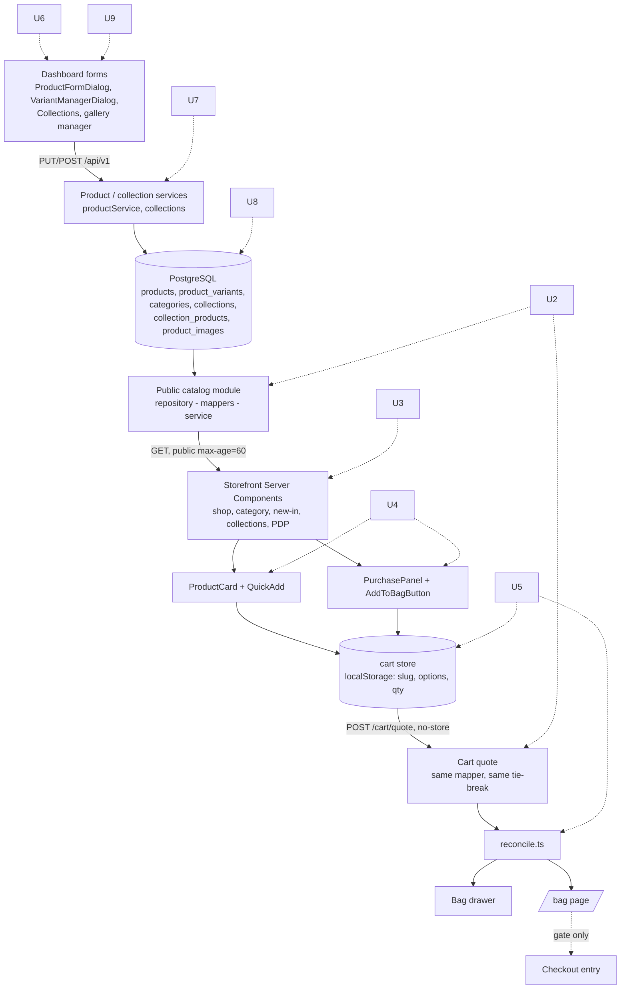
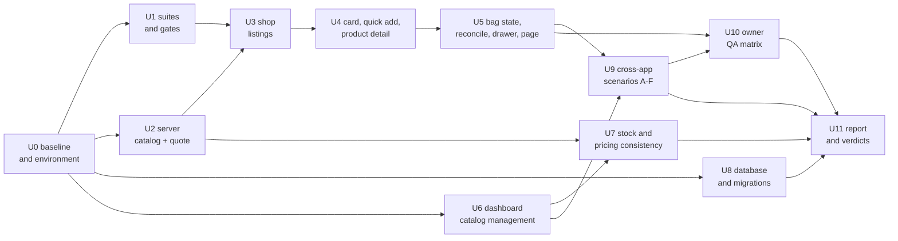

# test: Shop + Product + Cart full-stack audit

## Overview

A read-only, evidence-backed audit of the commerce chain that already exists, from the
dashboard that authors a product to the bag page that re-prices it. The deliverable is
**one audit report**, not a code change: findings graded Critical / High / Medium / Low,
plus what is confirmed correct, the test gaps and the manual-QA gaps, and a per-surface
Ready / Issues-found verdict.

Nothing is fixed in this plan. The owner reviews the findings and a separate fix plan
follows.

Decision labels here are **AD-n** (audit decisions). Earlier plans are cited by their own
labels: *catalog KD-n* (`2026-09-14-002`), *PD-n* (`2026-09-14-003`), *CD-n*
(`2026-09-15-001`), *CO-n* (`2026-09-15-002`).

## Problem Frame

The storefront's commerce path shipped across four plans in eight days and has since taken
25 commits of visual redesign on an unmerged branch — two of which rewrote the Quick Add
control and the product card's layout. The backend contracts are unusually well documented
(`apps/server/CLAUDE.md` → *Public catalog*, `apps/storefront/CLAUDE.md` → *Cart*), and the
unit suites are dense. What has never been done is a single pass that checks the **whole
chain against itself**: that the dashboard's writes reach the catalog, that the catalog's
price is the quote's price, that the browser holds no authority it should not, and that the
documented contracts still describe the code.

Three things make that pass worth doing now rather than after more storefront work:

1. **There is no storefront E2E at all.** `e2e/specs/` is thirteen POS/dashboard specs and
   `e2e/playwright.config.ts` starts only the API and the Vite dashboard — no Next process.
   Every drawer focus rule, RTL layout, toast and reconciliation state in
   `apps/storefront/CLAUDE.md` is verified by pure-function unit tests and owner screenshots
   only. Nothing re-runs the §22 journey.
2. **The audit target is a branch, not `main`.** `zhamdy/storefront-silk-edit-section` is 25
   commits ahead of `main` and includes `features/cart/components/quick-add.tsx` and
   `features/products/components/product-card.tsx`. Auditing `main` would audit a Quick Add
   that no longer exists.
3. **Two cross-app stock inconsistencies are already visible from a read** (see
   *Pre-identified leads*), both in the dashboard-to-database half that the storefront plans
   never touched.

## Requirements Trace

The request's 28 sections, consolidated. Each maps to the unit that answers it.

- **R1.** Report the repository state before touching anything: branch vs `main`,
  uncommitted changes and their risk, which recent work is in scope. *(U0.)*
- **R2.** Shop, category, New In and collection-fed listings render only real public catalog
  data; filters, sort, pagination, URL state, empty, loading, failure, malformed URLs, EN/AR,
  RTL and `noindex` behave as `2026-09-14-002` specifies. No mock data silently reaches
  production. *(U3.)*
- **R3.** ProductCard after the redesign: localized name, authoritative price, variant-price
  behaviour, gallery/hover, New and Sold Out, the product link, and Quick Add — which must
  use the **same** cart store and the same `purchaseReadiness` contract as Product Detail,
  never a second cart. *(U4.)*
- **R4.** Product Detail: slug handling (valid, malformed, inactive, discontinued, unknown),
  localized fields, gallery, category, collections, description/material/fit/care, variant
  options, effective variant price, sold-out, Add to Bag, selection behaviour. Effective
  price is `variant.price ?? product.price` and a NULL variant price never becomes `0`. *(U4.)*
- **R5.** The guest bag persists **intent only** (slug, canonical options, quantity) and no
  authoritative price, stock, title, SKU, cost or availability; merge, separation, bounds,
  caps, remove, undo, refresh, malformed storage, version mismatch and cross-tab all behave.
  *(U5.)*
- **R6.** `POST /api/v1/catalog/cart/quote`: validation, line and quantity bounds, canonical
  options, publication and status checks, variant matching, stock validation, effective
  pricing, NUMERIC parsing, no internal-field/cost/SKU/exact-stock leakage, `no-store`,
  statement-timeout handling, one consistent error shape, and a correct status vocabulary
  with no silent variant substitution. *(U2.)*
- **R7.** The browser cannot control unit price, product or variant price, stock, or
  publication state. Hostile input — fake price, stale variant, unknown option, huge
  quantity, duplicate options, malformed slug, prototype keys, hidden product — leaves the
  server authoritative. *(U2.)*
- **R8.** Reconciliation communicates every server-side change (price, stock drop, sold out,
  variant removed, product inactive/discontinued/gone, quote failed, quote timed out,
  quantity above stock) and never silently deletes or substitutes a shopper's choice. *(U5.)*
- **R9.** Bag drawer: header count, open, close, Escape, backdrop, focus restore, focus trap
  and page inerting, line navigation, quantity, Remove, Undo, loading, updating, stale price,
  failed quote, sold-out line, View Bag, browser Back, EN/AR, RTL, mobile. *(U5, U10.)*
- **R10.** `/[locale]/bag`: empty, hydration, loading, authoritative subtotal, updating, no
  stale amount presented as final, unavailable lines, limited quantity, price change, Retry,
  Remove, Undo, quantity, checkout gating, feature flag, locale preservation. *(U5, U10.)*
- **R11.** Dashboard catalog management: every storefront-facing field, on create and on
  edit, with its validation — names, slug, descriptions, material/fit/care, base price,
  variant price override, category, collections, status, stock, variants and their
  attributes, primary image, gallery and its ordering. *(U6.)*
- **R12.** A real dashboard change propagates to the API and then to the storefront for each
  of: name, price, variant price, stock, image, description, category, collection,
  active/inactive, discontinued — with the intended cache delay documented and no
  unexpected staleness. *(U6, U9.)*
- **R13.** One agreed source of truth for stock across normal products, variants, POS sales,
  refunds, exchanges, adjustments and the storefront quote; any remaining
  `products.stock` / `product_variants.stock` disagreement is traced in current code, not
  assumed fixed. *(U7.)*
- **R14.** The same product/variant yields the same effective price in the dashboard, POS,
  barcode lookup, public catalog, Product Detail, ProductCard, cart quote and bag — for a
  base product, a NULL-priced variant, an explicitly overridden variant and an invalid
  browser-supplied price. No valid item becomes `0 EGP`. *(U7.)*
- **R15.** Category and collection integrity: assignment, membership, slugs, ordering, active
  filtering, collection image, and products appearing and disappearing from the right views.
  *(U6, U9.)*
- **R16.** Images: upload validation, formats, gallery ordering, primary image, missing-image
  fallback, deletion, storefront optimization, alt text, dimensions — and graceful
  degradation on cards and PDP with one image, no gallery, or a missing second image.
  *(U4, U6.)*
- **R17.** Public catalog security: explicit column allowlists, no unnecessary internal ids,
  no cost prices, no admin or staff-only fields, parameterized SQL, input and pagination
  limits, statement timeouts, publication filters, correct 404 behaviour. *(U2.)*
- **R18.** The quote's edge path: `STOREFRONT_ORIGINS`, `TRUST_PROXY`, the quote-specific
  limiter, preflight, body-size limit, and the catalog limiter's interaction with the quote —
  including an explicit re-check of the previously suspected "quote-skip" issue. *(U2.)*
- **R19.** Caching: listing, detail, collections, store policies and quote. The quote is
  `no-store`; cached GETs become visible per the intended TTL; no route's cache header is
  accidentally overwritten. *(U2.)*
- **R20.** Schema and migrations for commerce: slugs, bilingual fields, gallery,
  category/collection relations, prices, stock, indexes, foreign keys, uniqueness, checks;
  migration verification run per repo convention, including the 017 index state. *(U8.)*
- **R21.** The full automated suites run and every failure is classified, never waved off as
  flake: server (typecheck, lint, tests on real PostgreSQL, the three gate scripts,
  migrations), storefront (typecheck, lint, test, build), dashboard (typecheck, lint, test,
  build, budget). *(U1.)*
- **R22.** The complete customer journey is exercised in a browser across EN/AR at 320, 375,
  768, 1024 and 1440, with keyboard, 200% zoom, reduced motion, slow network, API failure,
  console errors, hydration errors and horizontal overflow all checked. *(U10.)*
- **R23.** Six controlled cross-app scenarios (A–F: price change, stock below quantity,
  product inactive, variant removed, variant price to NULL, new gallery image) are run
  against a live stack and their real behaviour recorded. *(U9.)*
- **R24.** Duplicated business logic is identified where it risks divergence — variant
  selection, effective price, stock readiness, quantity caps, publication rules — across
  ProductCard, Product Detail, the cart store, the quote, the dashboard and server services.
  Style-only duplication is not flagged. *(U4, U7.)*
- **R25.** One report, grouped by severity, each issue carrying apps, exact files,
  reproduction, expected, actual, impact, likely root cause, recommended fix, and whether it
  blocks further commerce work. No GitHub issues created. *(U11.)*
- **R26.** Nine separate Ready / Issues-found verdicts, each backed by test or code-path
  evidence rather than a general impression. *(U11.)*

## Scope Boundaries

Carried from the request's §27, plus what this plan adds.

- **No code changes of any kind.** Not a fix, not a typo, not a comment. The audit ends at
  the report; a fix plan is separate work. The only files written are the report itself and
  scratch fixtures outside the repository.
- **No GitHub issues**, no PR, no branch, no commit.
- Not audited: payment gateway, IPN/webhooks, order creation, COD strategy, shipping-fee
  engine, tax engine, customer accounts, wishlist, search.
- Checkout gets a **regression smoke only**, because the bag links into it: does the gate
  open and close correctly, and does the entry preserve locale. No checkout commerce, no
  form audit, no submit-seam review.
- The homepage's editorial sections are out of scope **except** where they feed the commerce
  chain: the New Arrivals fallback and The Moon Selection both render mock products, and mock
  product tiles carry real `/products/<slug>` links (U3).
- No performance or load audit beyond what the documented known costs already state
  (`apps/server/CLAUDE.md` → *Known cost*: the listing's double join and pinned connection,
  deferred to the B-9 launch load review).
- No accessibility conformance audit. WCAG behaviour is checked only where the journey
  touches it (drawer focus, keyboard, zoom, reduced motion) and reported as observation.
- No changes to CI, to the ratchets, or to any environment configuration.

## Context & Research

All paths repo-relative. Gathered by direct inspection on 2026-09-22 at
`zhamdy/storefront-silk-edit-section`.

### Repository state

- Branch `zhamdy/storefront-silk-edit-section`, **0 behind / 25 ahead** of `main`.
- The 25 commits touch `apps/storefront` only, plus the root `CLAUDE.md` and one plan
  document. `apps/server`, `apps/dashboard` and the migrations are byte-identical to `main`
  on this branch. The commerce backend audit is therefore effectively an audit of `main`.
- Three of the 25 are in scope: `feat(storefront): make the card's Add to Bag a corner disc`,
  `feat(storefront): reveal the card's Add to Bag on the photograph`, and
  `fix(storefront): anchor bag icon inside product image`.
- Uncommitted: `apps/storefront/AGENTS.md` (a **deletion** of its `## Learnings` section, two
  entries dated 2026-09-21 — `next dev` rewrites the rules block but does not delete
  Learnings, so this reads as unintended loss), `apps/storefront/next-env.d.ts` (generated),
  `apps/storefront/features/cart/components/quick-add.tsx` (CRLF only, no content change).
- Open issues: #201 (placeholder storefront copy and contact details, P1 launch blocker),
  #169 (flaky `Collections.test.tsx`), #167 (reference note). No open issue names the
  commerce chain.

### Origin documents

This audit has no requirements document; its origin is the four plans that built the chain,
which supply the contract every finding is graded against:

- `docs/plans/2026-09-14-002-feat-storefront-shop-collections-plan.md` — listing, URL
  grammar, empty states, the whitelist rule, the catalog limiter (KD-9), `noindex`.
- `docs/plans/2026-09-14-003-feat-storefront-product-detail-plan.md` — PD-3 (no public
  variant id), `purchaseReadiness` as the cart contract, 404 rules, the gallery.
- `docs/plans/2026-09-15-001-feat-storefront-cart-plan.md` — R1–R16 and CD-1…CD-22. **The
  primary contract for this audit.**
- `docs/plans/2026-09-15-002-feat-storefront-checkout-ui-plan.md` — CO-n, and the
  bag-to-checkout gate that U5 smoke-tests.

Living contracts: `apps/server/CLAUDE.md` → *Public catalog*, *Cart quote*, *The catalog
limiter*, *The cart quote's edge chain*; `apps/storefront/CLAUDE.md` → *Cart* (pieces,
persisted shape, store, quote, reconciliation, surfaces); root `CLAUDE.md` → *Learnings*.

### Surface map — server (`apps/server/src/modules/commerce/catalog/`)

Seven public routes, six GETs plus the quote, across `routes.ts`, `controller.ts`,
`service.ts`, `repository.ts`, `mappers.ts`, `schemas.ts`, `types.ts`, `constants.ts`.

- Column allowlists are real: no `SELECT *` in the module; `p.id` / `v.id` are selected for
  joins but no mapper emits them. Pinned by `apps/server/tests/catalog.test.ts` and
  `apps/server/tests/catalogCartQuote.test.ts`.
- Effective price: `mappers.ts` computes `toNumber(variant.row.price ?? productPrice)` — the
  `??` resolves before `toNumber`, so a NULL override cannot become `0`.
- Quote statuses: `ok | reduced | soldOut | variantUnavailable | productUnavailable`; each
  line capped independently at `min(stock, 10)`; `.strict()` body, 1–30 lines, quantity 1–10,
  at most 5 options, key ≤40 and value ≤60 characters.
- Every read runs under `SET LOCAL statement_timeout = '2000ms'`; SQLSTATE 57014 becomes 503.
- Caching: `publicCacheOnSuccess(60)` rewrites `Cache-Control` at `writeHead` on **any** 2xx
  regardless of method; the quote escapes it purely by being registered **before** the
  `router.use`, behind its own `noStore`.
- Edge chain: `apps/server/src/app.ts` gives the quote path its own CORS
  (`STOREFRONT_ORIGINS`, `credentials: false`), its own per-IP limiter with no server-token
  bucket, and a 16 KB parser, all ahead of the app-wide CORS, limiter and 10 MB parser.

### Surface map — storefront (`apps/storefront/`)

- All catalog routes are Server Components; the client islands are `catalog-controls.tsx`,
  `purchase-panel.tsx`, `quick-add.tsx`, `add-to-bag-button.tsx`, `bag-trigger.tsx`,
  `bag-drawer.tsx`, `bag-view.tsx`.
- `features/cart/store/cart-store.ts` is the single module-level store; `quick-add.tsx`
  writes through the same `useCartActions().add(...)` the product page uses, and both share
  `features/cart/utils/add-to-bag-action.ts`. There is **no second cart implementation**.
- `features/products/utils/variant-selection.ts` is the one readiness and price authority:
  `purchaseReadiness` and `displayedPrice` serve PDP and Quick Add alike.
- `features/cart/utils/reconcile.ts`: quote lines join stored lines **by line key**, never by
  position; the only store write is the canonical option rewrite, once per settled quote key.
- `features/cart/api/quote-cart.ts` hand-validates the whole response against the request and
  throws `INVALID_RESPONSE` on any mismatch — a wrong price must fail rather than render.
- Mock data: `features/products/data/home-products.ts` is imported by
  `features/home/components/new-arrivals/new-arrivals.tsx` (fallback when the API is
  unconfigured, throws, or returns fewer than four photographed products) and by
  `features/home/components/moon-selection/moon-selection.tsx` (**unconditionally**).
  `features/products/utils/product-card-model.ts` `fromHomeMock` builds a real
  `productHref(mock.slug)`.

### Surface map — dashboard and the write half

- `apps/dashboard/src/features/inventory/components/inventory/ProductFormDialog.tsx` is the
  product form; **`status` is not a field on it** — active/inactive/discontinued moves through
  `PUT /api/v1/products/:id/status` from the table, and collection membership is set only
  from `apps/dashboard/src/features/inventory/pages/Collections.tsx`.
- `apps/dashboard/src/features/inventory/components/inventory/VariantManagerDialog.tsx` and
  `apps/dashboard/src/features/inventory/hooks/useVariantManagement.ts` do exist, and do send
  `price: null` for a blank override. Neither has a test file.
- Stock writers: POS sales, refunds, exchanges and stock counts all branch correctly on
  `variant_id`. `apps/server/services/productService.ts` `updateProduct` writes
  `products.stock` as an absolute overwrite with **no audit row**, unlike
  `apps/server/src/modules/inventory/stockAdjustments/service.ts` `applyDelta`.
- Effective price is `COALESCE(pv.price, p.price)` in POS, barcode lookup, exchanges and
  online orders; the catalog uses the `??` equivalent.

### Schema (migrations `001`–`017`, `apps/server/src/database/migrations/`)

`products.price` is NUMERIC NOT NULL; `product_variants.price` is NUMERIC **nullable** — the
override seam. `products.stock` and `product_variants.stock` are both INTEGER NOT NULL
DEFAULT 0 with `NOT VALID` non-negative CHECKs from `004`. Unique slug indexes on products,
categories and collections (`014`); `product_images` with `UNIQUE (product_id, position)`;
`collection_products` with `position` and `UNIQUE (collection_id, position)` (`006`), plus the
`017` `idx_collection_products_product_id`. Every migration has a `.down.sql`; `017` is the
head, and it is a plain (non-`CONCURRENTLY`) index because the runner wraps each file in a
transaction.

The seed creates about 28 products, 12 categories and 5 collections (including the non-public
`winter-tailoring` and `summer-2025`), variants on exactly three SKUs (one of them all-zero
stock), and `productCopy` descriptions keyed by SKU — and **no `product_images` rows at all**.

### Institutional learnings that bear on this audit

From root `CLAUDE.md` → *Learnings*:

- pg-mem returns NUMERIC as a number where node-postgres returns a string, and reports
  `err.code` but not `err.constraint`. Any price or stock conclusion is proven only on real
  PostgreSQL.
- Zod strips or rejects at the boundary, so a service-level test can pass while the field
  never arrives (the `bundle_id` lesson). Probe the HTTP boundary.
- pg-mem's `slug IS NOT NULL` rewrite and its `OVER ()` SQL-text shim have both silently
  voided coverage before. A green pg-mem suite is not evidence on those paths.
- The five homepage mock products disagree with the seed: `embroidered-evening-dress` and
  `velvet-evening-bag` are seeded as `-gown` and `-clutch`, and the cardigan reads 2,750
  against the seed's 2,400. Links from those tiles 404.
- An e2e run once deleted tracked `apps/server/uploads` images because the media sweep ran
  against the real root (#170). Any API this audit starts needs `MEDIA_LOCAL_ROOT` pointed at
  a scratch directory.

Operational notes carried from memory: the dev API on port 3001 runs against
`moon_store_sf_smoke`; `gh auth status` exits 1 from a stale account while `gh api user`
works.

### Pre-identified leads

Found during planning. Each is a **lead to verify**, not yet a finding — the named unit owns
proving or dismissing it, and a dismissed lead is reported under *Confirmed correct*.

| # | Lead | Unit |
| --- | --- | --- |
| L1 | `apps/server/services/productService.ts` `updateProduct` overwrites `products.stock` absolutely with no `stock_adjustments` row, while `adjust-stock` always audits. An operator editing a name can silently reset stock. | U7 |
| L2 | For a variant-bearing product `products.stock` is never decremented by any sale path, yet `Inventory.tsx` still shows it as the main Stock column and the product form still lets anyone write it. | U7 |
| L3 | `moon-selection.tsx` renders the `curatedEdit` mock unconditionally in production, and `fromHomeMock` gives each tile a real `/products/<slug>` href — two of which 404 per the known learning. | U3 |
| L4 | `NewArrivals` falls back to mocks when the API returns fewer than four *photographed* products. **Confirmed at the data layer 2026-09-22**: the freshly seeded `moon_store_audit` has `product_images = 0` and `products_with_image_url = 0` across 34 products, so a seeded database serves *zero* photographed products and the rail is always the mock. What remains for U3 is whether a production build shows invented names and prices to a shopper, and what the mock tiles' links do. | U3 |
| L11 | **New, found while seeding.** All 8 seeded variants have `price IS NULL` — every one relies on the `variant.price ?? product.price` fallback. The seed therefore cannot exercise the *explicit override* price case at all, so the R14 override scenario and scenario E's "override to NULL" transition both need a variant authored with a real price first. This is also a seed coverage gap worth reporting in its own right. | U0, U7, U9 |
| L5 | The quote's `no-store` survives only because its route is registered before `router.use(publicCacheOnSuccess(...))`. Reordering the file would ship `public, max-age=60` on per-bag pricing with no type error. Check whether a test pins the ordering itself, not only the header. | U2 |
| L6 | `createCatalogLimiter` carries `skip: isCartQuotePath`. This is the §18 quote-skip suspicion; the reading so far is that it is deliberate and covered (the quote has its own earlier limiter, and `apps/server/tests/http/catalogRateLimit.test.ts` proves the quote spends only its own bucket). Confirm against the live app, including `GET`/`HEAD` on the quote path. | U2 |
| L7 | `VariantManagerDialog.tsx:142` and `apps/dashboard/src/features/pos/pages/POS.tsx:195` use `||` rather than `??` for the variant-price fallback, so a variant deliberately priced at `0` displays the product price. Not a NULL-to-zero bug; the nearest thing to one. | U7 |
| L8 | No test file exists for `VariantManagerDialog` or `useVariantManagement`, and no `Categories.test.tsx` exists at all — the two dashboard surfaces that author variant price and category slug. | U6 |
| L9 | The Quick Add disc is now grid-placed into the photograph's cell by `[data-card-action='overlay']` in `apps/storefront/app/globals.css`, with a `pointer-events-none` root. At touch widths that rule does not apply and the action falls to its own row. Both states need checking, in both directions. | U4, U10 |
| L10 | `features/cart/utils/cart-storage.ts` resets the bag on any `version` other than 1, so shipping a v2 and rolling back wipes every v2 bag. Documented as accepted; confirm the reader still matches the doc. | U5 |

## Key Technical Decisions

| # | Decision | Rationale |
| --- | --- | --- |
| AD-1 | **Audit the branch `zhamdy/storefront-silk-edit-section`, not `main`,** and say so in every finding's header. | Quick Add and the product card were rewritten on this branch; `main`'s versions are not what will ship. The server, dashboard and migrations are identical on both, so backend findings apply to `main` too — stated explicitly per finding. |
| AD-2 | **Read-only, full stop.** No edits, no `git` writes, no issue creation. The report is the only artefact, written to `docs/audits/`. | The request's §28 is unambiguous, and an audit that fixes as it goes cannot report what the state actually was. |
| AD-3 | **Grade every finding against a written contract, not against taste.** The contract is the CD-n / PD-n / KD-n decision, the CLAUDE.md paragraph, or the test that pins it. A finding with no contract behind it is filed as an observation, not a defect. | The chain was built from explicit, argued decisions (CD-15's "shown, not written"; CD-7's disclosure bound). Re-litigating those as bugs would waste the owner's review. |
| AD-4 | **Live probes run against a disposable database, never a working one.** The throwaway is **`moon_store_audit`**, provisioned 2026-09-22 on the local PostgreSQL 18 at `localhost:5432` with all 17 migrations and the seed applied; `MEDIA_LOCAL_ROOT` points at a scratch directory outside the repository before any API boots. The working databases `moon_store` (the dev `.env` target) and `moon_store_sf_smoke` are never the target. | The media sweep deleted tracked `apps/server/uploads` images once already (#170). The seed also wipes catalog rows — it ran `Clearing existing data...` on creation, which is exactly why it must never point at a working database. |
| AD-5 | **Price and stock conclusions require real PostgreSQL.** Any probe touching NUMERIC, the NULL-price fallback, a unique-constraint branch or a `slug IS NOT NULL` predicate runs with `TEST_DATABASE_URL` set, and a pg-mem-only green is recorded as *unproven*, not as *passing*. | Three separate learnings document pg-mem diverging silently on exactly these paths. |
| AD-6 | **Hostile-input probes go through the HTTP boundary** — curl or fetch against the running API — never by calling a service directly. | `.strict()` and Zod stripping mean a service-level probe proves nothing about what the wire accepts (the `bundle_id` lesson). |
| AD-7 | **Browser QA (§22) is scripted for the owner to run, not driven by the agent.** U10 produces a numbered matrix with exact URLs, viewport widths, steps and expected results, plus what to screenshot. | Standing instruction: browser testing is the owner's, with screenshots returned. The audit still owns specifying it precisely enough to be runnable without interpretation. |
| AD-8 | **Cross-app scenarios A–F mutate the disposable database through the dashboard's own API**, not by editing rows directly. | The request asks whether *dashboard changes* propagate. A direct `UPDATE` would skip the service layer, the validation and the cache behaviour that are half the question. |
| AD-9 | **Automated-suite failures are classified before anything else is investigated**: pre-existing on `main`, introduced by the branch, environment-dependent, or genuinely flaky — with the evidence for the label. | §21 forbids waving failures off, and a failure that also fails on `main` is a different finding from one the branch introduced. |
| AD-10 | **Duplication is reported only where the two copies can disagree** (R24). Two implementations of one rule that a test proves equal are recorded as *confirmed correct with a named guard*, not as a defect. | The chain deliberately carries parallel implementations — the catalog mapper against POS's SQL `COALESCE` — with tests pinning their agreement. Flagging those would invite a refactor that removes a guard. |
| AD-11 | **The report carries a blocking column.** Every finding answers "does this block further commerce work?" with yes or no and one sentence. | §25 asks for it, and it is the field that decides what happens next. |

## Open Questions

### Resolved During Planning

- *Is there a requirements document to plan from?* No. `docs/brainstorms/` stops at
  2026-08-25 and holds nothing about the storefront. The four build plans serve as the
  origin contract instead (AD-3).
- *Which tree is under audit?* The branch (AD-1). Verified: 25 commits ahead, storefront-only.
- *Does the §18 catalog-limiter quote-skip issue still exist?* The code reads as deliberate
  and covered — the quote is registered before the catalog limiter, has its own earlier
  per-IP limiter in `app.ts`, and `catalogRateLimit.test.ts` asserts it spends only its own
  bucket. Recorded as lead L6 and confirmed live in U2 rather than assumed.
- *Does the storefront have any e2e coverage to re-run?* None. `e2e/playwright.config.ts`
  starts only the API and the Vite dashboard. §22 is therefore entirely manual (AD-7), and
  the absence itself is the headline test gap.
- *Can the seeded database exercise the image paths?* Not as seeded — it writes no
  `product_images` rows and no `image_url`. U0 uploads fixture images through the dashboard's
  own API before U3/U4/U9 run, which is also what makes scenario F possible.
- *Where should the report live?* `docs/audits/`, a new sibling of `docs/plans/`. The root
  `CLAUDE.md` discourages ad-hoc markdown logs, but §25 asks for exactly one durable report
  and there is no existing document it belongs inside.

### Deferred to Implementation

- ~~Whether a throwaway local PostgreSQL or `docker-compose.test.yml` is faster on this
  machine.~~ **Resolved 2026-09-22:** neither `docker` nor `psql` is on the shell PATH, but
  PostgreSQL 18 is installed locally; `moon_store_audit` was created on it directly. No
  container needed.
- The exact fixture product shape for U9 — partly settled by L11. The seed gives a base
  product and NULL-priced variants for free, but an **explicit variant price override** and
  **gallery images** must both be authored through the dashboard API in U0, because the seed
  provides neither. Whether that is a seeded SKU mutated in place or a purpose-made product is
  still open until the three variant-bearing SKUs are inspected.
- How the quote behaves when `sanitizeBody` rewrites a tag-like option value. Deferred in the
  cart plan and still unverified; U2 probes it with a real option value rather than a
  constructed one.
- Whether the storefront can be pointed at a second API instance for scenario D (a variant
  removed mid-session) without restarting Next; if not, the scenario runs with a page reload
  and that limitation is recorded.
- Whether any suite failure reproduces on `main` — knowable only by running both (AD-9).

## High-Level Technical Design

> Directional only: the shape of the audit, not an implementation specification.

### The chain under audit, and who owns each hop



### Unit dependency order



### Finding record shape

Every finding in the report carries this shape, so §25's fields cannot be skipped:

```text
[SEVERITY] <short title>
apps:        storefront | server | dashboard | db  (one or more)
files:       repo-relative path[:line], ...
contract:    the CD-n / PD-n / KD-n / CLAUDE.md line it violates, or "none - observation"
repro:       numbered, runnable, naming the database and env used
expected:    what the contract says
actual:      what was observed, with the evidence (command output, response body, code path)
impact:      user or business consequence, in one or two sentences
cause:       likely root cause in code
fix:         recommended direction, not a patch
blocks:      yes | no  - one sentence why
proven-on:   pg-mem | real PostgreSQL | live stack | code reading only
```

`proven-on` exists because of AD-5: a price or stock claim backed only by pg-mem is not yet
evidence, and the report must not let those two look alike.

## Implementation Units

Four phases. Phase 1 establishes ground truth, phase 2 audits each layer in isolation,
phase 3 crosses the layers, phase 4 reports.

### Phase 1 — Ground truth

- [ ] **U0: Baseline, working-tree risk, and a disposable live stack**

**Goal:** Establish exactly what is being audited and stand up a throwaway environment that
every later unit probes against, with no risk to the working tree or to tracked uploads.

**Requirements:** R1.

**Dependencies:** None.

**Files:**
- Inspect: `apps/server/src/database/seed.ts`, `apps/server/.env.example`,
  `apps/storefront/.env.example`, `docker-compose.test.yml`
- Inspect: `apps/storefront/AGENTS.md` (the uncommitted Learnings deletion)
- Create (outside the repository): a scratch env file and a `MEDIA_LOCAL_ROOT` directory
- Test expectation: none — this unit stands up an environment and records state; its output
  is the report's *Repository state* section, not code.

**Approach:**
- Record branch, divergence from `main`, the in-scope commits, and each uncommitted file with
  a risk judgement. The `AGENTS.md` Learnings deletion is reported as a working-tree risk
  before anything else runs; the audit does not restore it (AD-2), it reports it.
- **Done 2026-09-22 — the disposable database is provisioned.** `moon_store_audit` on the
  local PostgreSQL 18 (`localhost:5432`), all 17 migrations applied and the seed run.
  Isolation verified against the two working databases by row count: `moon_store` 31
  products, `moon_store_sf_smoke` 34, `moon_store_audit` 34 freshly seeded, all intact.
  `MEDIA_LOCAL_ROOT` points at a scratch directory outside the repository, and `git status`
  is unchanged (AD-4). Note `dotenv.config()` in `apps/server/src/config/env.ts` does not
  override an already-exported variable, so an exported `DATABASE_URL` beats
  `apps/server/.env` — which is how the audit stack avoids the dev target.
- Boot the API against that database with `MEDIA_LOCAL_ROOT` still set, before any other unit.
- Because the seed writes no images, upload fixture images through the dashboard's own image
  API to at least: one product with a single image, one with a full gallery, one with none.
  This is what makes the hover, fallback and scenario-F probes possible at all.
- Start the storefront against that API with `NEXT_PUBLIC_API_URL`, `CATALOG_SERVER_TOKEN`,
  `MEDIA_ORIGIN` and `STOREFRONT_ORIGINS` aligned, and confirm a quote round-trips before any
  other unit begins.

**Patterns to follow:**
- `apps/server/CLAUDE.md` → *Smoke-testing the storefront against a dev database* for the
  migrate/seed/`MEDIA_LOCAL_ROOT` sequence.
- `e2e/playwright.config.ts` `webServer.env` for the `os.tmpdir()` scratch-root precedent.
- Root `CLAUDE.md` → *Testing* for the disposable-database guards.

**Verification:**
- A written baseline naming branch, divergence, in-scope commits and every dirty file with
  its risk.
- `GET /api/v1/catalog/products` returns seeded products; a hand-built quote for a seeded
  slug returns `ok`; the storefront renders that product's detail page.
- `git status` in the repository is unchanged from the baseline snapshot — the environment
  lives entirely outside it.

---

- [ ] **U1: Run every automated suite and gate, and classify each failure**

**Goal:** Produce the true current state of the automated evidence, with every failure
labelled by cause rather than dismissed.

**Requirements:** R21.

**Dependencies:** U0 (for `TEST_DATABASE_URL`).

**Files:**
- Run: `apps/server` — `typecheck`, `lint`, `test` (with `TEST_DATABASE_URL`),
  `check:api-docs`, `check:route-auth`, `check:client-paths`, `verify:migrations`
- Run: `apps/storefront` — `typecheck`, `lint`, `test`, `build`
- Run: `apps/dashboard` — `typecheck`, `lint`, `test`, `build`, `budget`
- Inspect: `apps/server/scripts/assertRealPostgresSuitesRan.mjs`, `.github/workflows/ci.yml`
- Test expectation: none — this unit runs existing suites and classifies results; it writes
  no tests (AD-2).

**Approach:**
- Run each suite once, capture output, and record pass/fail per job in the same shape CI uses,
  so the report's table is comparable to a CI checks list.
- Confirm the real-PostgreSQL suites actually ran rather than skipping loudly; a skipped
  `describeWithPostgres` block is a finding in itself under AD-5.
- Record the three ratchet values as found (`--max-warnings 384`, `EXPECTED_UNCONVERTED`,
  `EXPECTED_UNCLASSIFIED`, `EXPECTED_UNDER_PROTECTED`) and whether each still matches reality.
  A ratchet sitting above its true count has stopped ratcheting, which is a finding.
- For every failure, apply AD-9: re-run the same suite on `main` to separate pre-existing from
  branch-introduced, and re-run a suspected flake enough times to justify the label.
  Issue #169 (`Collections.test.tsx`) is a known flake and is expected to surface here.

**Patterns to follow:**
- Root `CLAUDE.md` → *CI gates* for the job names and what each proves.
- Root `CLAUDE.md` → *Ratchets* for the never-raise rule and the two contract numbers.

**Test scenarios:**
- Happy path: every server gate script exits 0 and its output names zero drift.
- Happy path: `verify:migrations` rolls back and re-applies all 17 migrations step by step.
- Edge case: run the server suite **without** `TEST_DATABASE_URL` and confirm the real-PG
  suites skip loudly rather than silently — the guard the repo depends on.
- Error path: any failing suite is re-run on `main`; the classification (pre-existing,
  branch-introduced, environment, flake) is recorded with the evidence that justifies it.
- Integration: `check:client-paths` is confirmed to cover `apps/dashboard` only, so the
  storefront's API calls are **not** gated by it — a gap the report names explicitly.

**Verification:**
- A table of every suite and gate with pass/fail and, for failures, the AD-9 classification.
- An explicit statement of which ratchets are accurate and which have drifted.

---

### Phase 2 — Layer audits

- [ ] **U2: Server authority — catalog reads, cart quote, security, caching, edge chain**

**Goal:** Prove or disprove that the public API is authoritative, leak-free, correctly
cached and correctly rate-limited, by probing the running app rather than reading it.

**Requirements:** R6, R7, R17, R18, R19.

**Dependencies:** U0.

**Files:**
- Inspect: `apps/server/src/modules/commerce/catalog/routes.ts`, `controller.ts`,
  `service.ts`, `repository.ts`, `mappers.ts`, `schemas.ts`, `types.ts`, `constants.ts`
- Inspect: `apps/server/src/app.ts`, `apps/server/src/http/rateLimits.ts`,
  `apps/server/src/middleware/cache.ts`
- Evidence: `apps/server/tests/catalog.test.ts`,
  `apps/server/tests/catalogCartQuote.test.ts`,
  `apps/server/tests/http/catalogRateLimit.test.ts`,
  `apps/server/tests/concurrency/catalogCartQuote.realpg.test.ts`
- Test expectation: none — probes are ad-hoc HTTP calls against the U0 stack, not new tests.

**Approach:**
- Walk every public route against its allowlist and scan each response body for `id`, `sku`,
  `barcode`, `stock`, `cost_price`, `product_id`, `min_stock`, supplier and reorder fields.
- Probe the quote at the HTTP boundary (AD-6) with the full hostile set from §7, and record
  status, error shape and whether the server's own price ever moves.
- Re-check L5: does any test pin the *route registration order*, or only the resulting header?
  A header assertion passes even after someone moves the route below the cache middleware, so
  the distinction decides the severity.
- Re-check L6 live: `POST`, `GET`, `HEAD` and `OPTIONS` on the quote path, with and without a
  valid `X-Catalog-Server-Token`, watching which bucket each spends.
- Confirm the statement timeout produces 503 and not 500, and that the error shape is the same
  one every other public failure uses.

**Patterns to follow:**
- `apps/server/CLAUDE.md` → *Public catalog*, *Cart quote*, *The catalog limiter*, *The cart
  quote's edge chain* — each paragraph is a claim to verify, one by one.
- The existing whitelist assertions in `tests/catalog.test.ts` for the exact key-set method.

**Test scenarios:**
- Happy path: a quote for a seeded in-stock variant returns `ok` with
  `unitPrice = variant.price ?? product.price` and `lineTotal = unitPrice × quantity`.
- Happy path: every GET 2xx carries `public, max-age=60`; the quote carries `no-store` on
  success **and** on 400, 413, 429 and 503.
- Edge case: a variant with a NULL price quotes at the product price, proven on real
  PostgreSQL where NUMERIC arrives as a string (AD-5).
- Edge case: 30 lines all naming one variant with stock 3 — every line reports
  `maxQuantity` 3 independently, disclosing no more than 10 and never a cumulative total.
- Edge case: exactly 30 lines succeeds, 31 is a 400; quantity 10 succeeds, 11 is a 400; six
  options is a 400; a 41-character option key is a 400.
- Error path: a body carrying `price`, `unitPrice` or `total` is a 400 from `.strict()`, and
  the server's own price is unchanged in a follow-up clean quote.
- Error path: `__proto__`, `constructor` and `prototype` as option keys neither pollute nor
  crash; the line resolves `variantUnavailable` or is rejected, and the process stays up.
- Error path: a body just over 16 KB is a 413 with `no-store`, refused **before** parsing;
  malformed JSON is a 400, not a 500.
- Error path: an unknown slug and an `inactive` product produce the *identical*
  `productUnavailable` line, so the quote is no existence oracle; neither is a 404.
- Error path: a `discontinued` product and a slug-less product both resolve
  `productUnavailable`.
- Integration: an option value that `sanitizeBody` would rewrite (tag-like text) — record
  whether it resolves `variantUnavailable`, closing the cart plan's deferred question.
- Integration: a quote whose product is deleted mid-flight, and a query forced past the 2000 ms
  timeout, both produce the shared public error shape (503) rather than a stack or a 500.
- Integration: CORS — the storefront origin is allowed on `OPTIONS` and `POST` to the quote
  and on nothing else; the dashboard origin is refused on the quote; no `Access-Control-
  Allow-Credentials` on the quote path.
- Integration: with `TRUST_PROXY` unset versus set to a hop count, confirm which IP the quote
  limiter buckets on, and record the production prerequisite CD-4 names.

**Verification:**
- A per-route table: allowlisted keys observed, cache header observed, limiter bucket spent.
- A hostile-input table: input, status, body shape, and whether server authority held.
- A verdict on L5 and L6 with the evidence, since §18 asks for L6 by name.

---

- [ ] **U3: Storefront listings — shop, category, New In, collection-fed grids, and mock data**

**Goal:** Confirm the listings render only real catalog data and behave under every URL and
failure state the catalog plan specifies — and establish exactly when mock product data can
reach a production page.

**Requirements:** R2, and the mock-data half of R16.

**Dependencies:** U1, U2.

**Files:**
- Inspect: `apps/storefront/app/[locale]/(catalog)/shop/page.tsx`,
  `shop/[category]/page.tsx`, `new-in/page.tsx`, `collections/page.tsx`,
  `collections/[slug]/page.tsx`
- Inspect: `apps/storefront/features/catalog/search-params.ts`,
  `features/catalog/components/catalog-page.tsx`, `product-grid.tsx`,
  `catalog-controls.tsx`, `features/catalog/utils/catalog-empty-state.ts`,
  `features/catalog/utils/catalog-metadata.ts`
- Inspect: `apps/storefront/app/[locale]/(catalog)/error.tsx`
- Inspect (mock path): `apps/storefront/features/products/data/home-products.ts`,
  `features/home/api/load-new-arrivals.ts`,
  `features/home/components/new-arrivals/new-arrivals.tsx`,
  `features/home/components/moon-selection/moon-selection.tsx`,
  `features/products/utils/product-card-model.ts`
- Evidence: `apps/storefront/features/catalog/search-params.test.ts`,
  `features/catalog/utils/catalog-empty-state.test.ts`, `app/catalog-routes.test.ts`,
  `features/products/data/home-products.test.ts`
- Test expectation: none — behaviour is observed against the U0 stack and read from code.

**Approach:**
- Drive each listing route through the URL grammar and record what renders, including the
  documented fallbacks (malformed values fall back, they never 500).
- Separate the two mock paths cleanly: the New Arrivals *fallback* (conditional, L4) and The
  Moon Selection (*unconditional*, L3). For each, establish the exact production condition
  under which a shopper sees invented prices and names, and whether any link from those tiles
  reaches a 404.
- Establish whether a freshly seeded production-shaped database triggers L4 — the seed writes
  no images, and the fallback threshold is four *photographed* products.
- Check `noindex` on refined URLs and a self-canonical on paginated ones.

**Patterns to follow:**
- `docs/plans/2026-09-14-002-feat-storefront-shop-collections-plan.md` R12–R15, R19 for the
  exact intended behaviour of filters, sorts, empty states and metadata.
- `apps/storefront/CLAUDE.md` → the client-boundary rule, to confirm no listing became a
  client component during the redesign.

**Test scenarios:**
- Happy path: `/en/shop` and `/ar/shop` render seeded products, newest first, 24 per page,
  with a working numbered pagination whose links target the results anchor.
- Happy path: a seeded category renders only its products; `/new-in` derives from `created_at`
  and duplicates no list.
- Edge case: a known category with no active products shows the empty state, **not** a 404;
  an unknown category slug is a real 404; `upcoming` and `archived` collections are 404s with
  the shared body, so unreleased slugs cannot be probed.
- Edge case: `?page=0`, `?page=9999`, `?min=37`, `?min=900&max=100`, `?sort=nonsense`,
  `?sort=curated` outside a collection, an unknown parameter, and a repeated parameter — each
  falls back or 400s per the grammar, and none 500s.
- Edge case: Eastern-Arabic digits in `page`/`min`/`max` normalize correctly.
- Error path: with the API stopped, an uncached listing shows the catalog error screen with
  a retry and leaks no technical message or code; a pre-Suspense entity lookup failing is a
  500 that still renders that screen.
- Integration: a refined URL carries `noindex, follow`; an unrefined paginated URL stays
  indexable with a self-canonical; `/bag` and `/checkout` carry `noindex, nofollow`.
- Integration (L3/L4): with the API serving fewer than four photographed products, record
  whether New Arrivals silently shows invented products and prices in a production build;
  follow a Moon Selection tile's link and record the HTTP status of
  `embroidered-evening-dress` and `velvet-evening-bag`.
- Integration: EN and AR both render every listing with no missing key and no untranslated
  string, and RTL mirrors the grid and the pagination arrows without mirroring photography.

**Verification:**
- A route-by-route table of state coverage (populated, empty, filtered-empty, past-last-page,
  unknown, error) with what was observed.
- A definitive statement of the production conditions under which mock product data renders,
  and whether any such tile links to a 404.

---

- [ ] **U4: ProductCard, Quick Add, and Product Detail**

**Goal:** Confirm the redesigned card and the product page agree with each other and with the
server on price, availability and variant readiness — and that Quick Add is the same cart,
not a second one.

**Requirements:** R3, R4, R16, and the card/PDP half of R24.

**Dependencies:** U3.

**Files:**
- Inspect: `apps/storefront/features/products/components/product-card.tsx`,
  `product-detail.tsx`, `purchase-panel.tsx`, `purchase-panel-slot.tsx`,
  `product-gallery.tsx`, `product-gallery-viewer.tsx`, `product-image-placeholder.tsx`
- Inspect: `apps/storefront/features/products/utils/variant-selection.ts`,
  `product-card-model.ts`, `price.ts`, `localized-name.ts`
- Inspect: `apps/storefront/features/cart/components/quick-add.tsx`,
  `add-to-bag-button.tsx`, `features/cart/utils/quick-add-model.ts`,
  `add-to-bag-action.ts`
- Inspect: `apps/storefront/app/globals.css` (the `[data-card-action='overlay']` rule)
- Inspect: `apps/storefront/app/[locale]/(catalog)/products/[slug]/page.tsx`,
  `features/products/api/get-catalog-product.ts`
- Evidence: `apps/storefront/features/products/utils/variant-selection.test.ts`,
  `product-card-model.test.ts`, `features/cart/utils/quick-add-model.test.ts`,
  `add-to-bag-action.test.ts`
- Test expectation: none — this is a code-path audit plus live observation.

**Approach:**
- Trace both Add-to-Bag entry points to their single write and confirm one store, one
  readiness function, one price function (AD-10 decides whether any remaining duplication is
  reportable).
- Compare a listed product's `options`, `variants` and `description` against the same
  product's detail response, since the listing derives them through the same mapper and a
  divergence would let a card offer a size the product page refuses.
- Verify `displayedPrice` never yields `0` for a valid product, and that the DTO's
  `variant.price` is already the effective price — so the client has no NULL to coerce.
- Exercise the image degradations: one image, no image, a gallery of one, a broken second
  image. Confirm the hover swap degrades rather than breaking, and that the second image is
  not downloaded on touch.
- Check L9 at both card states — disc overlaid on the photograph where a pointer exists, and
  the fallback row where it does not — in LTR and RTL, and confirm the disclosure panel is not
  clipped and does not steal the card link's clicks.

**Patterns to follow:**
- `docs/plans/2026-09-14-003-feat-storefront-product-detail-plan.md` PD-3 and R1–R8 for the
  variant identity and 404 rules.
- `apps/storefront/CLAUDE.md` → *Cart* → *Surfaces* for the exact intended Quick Add and
  Add-to-Bag behaviour in each readiness state.

**Test scenarios:**
- Happy path: a no-variant product's card and detail both show the product price; one Quick
  Add press adds one piece and raises a toast with View bag.
- Happy path: a variant product where all variants share one price shows that exact price; a
  product whose variants differ shows "From {lowest}" on the card and the detail.
- Happy path: a variant with an explicit override is priced at the override once selected; a
  variant with a NULL override is priced at the product price. Neither ever renders 0 EGP.
- Edge case: Quick Add on a product needing a size opens the panel, focuses the first
  unanswered group, and adds only after a value is chosen — never adding a default silently.
- Edge case: a fully-selected combination with no in-stock variant reads Sold out on both
  surfaces, and Add to Bag stays focusable and inert rather than `disabled`.
- Edge case: an unavailable option value stays selectable-looking but struck through with
  `sr-only` "sold out" text — availability is never conveyed by colour alone.
- Edge case (L9): at a pointer width the disc sits on the photograph and its panel opens
  unclipped; at a touch width the action falls to its own row and the card link still works
  over the whole tile. Both in `ar` with the disc mirrored.
- Edge case (R16): a product with exactly one image shows no hover swap and does not break;
  a product with none shows the placeholder on card and PDP; the gallery viewer with one
  image renders without an empty thumbnail strip.
- Error path: an unknown slug, a malformed slug, an `inactive` product and a `discontinued`
  product are all real 404s with the localized not-found body; a transient API failure is the
  error screen, **never** a 404.
- Integration: a product's `options`, `variants` and `description` are identical between its
  listing item and its detail response — the guard that keeps the card's Quick Add honest.
- Integration: Quick Add and Add to Bag both write through `useCartActions().add`, producing
  the same line key for the same product and options, so one merges into the other.

**Verification:**
- A written confirmation, with file references, that exactly one cart store, one readiness
  function and one price function serve both surfaces — or a named finding if not.
- A state matrix for the card (in stock, needs selection, sold out, no image, one image) at
  pointer and touch widths, in both locales.

---

- [ ] **U5: Bag — browser state, reconciliation, drawer, page, and the checkout gate**

**Goal:** Confirm the browser holds intent only, that every server-side change is communicated
rather than silently applied, and that both bag surfaces behave under loading, staleness and
failure.

**Requirements:** R5, R8, R9, R10.

**Dependencies:** U4.

**Files:**
- Inspect: `apps/storefront/features/cart/store/cart-store.ts`,
  `features/cart/utils/cart-storage.ts`, `cart-lines.ts`,
  `features/cart/schemas/persisted-cart.ts`, `features/cart/constants.ts`
- Inspect: `apps/storefront/features/cart/utils/reconcile.ts`, `bag-view-model.ts`,
  `quantity-control.ts`, `checkout-readiness.ts`, `checkout-availability.ts`
- Inspect: `apps/storefront/features/cart/api/quote-cart.ts`, `use-cart-quote.ts`
- Inspect: `apps/storefront/features/cart/components/bag-drawer.tsx`, `bag-trigger.tsx`,
  `bag-view.tsx`, `cart-line.tsx`, `quantity-stepper.tsx`, `bag-summary.tsx`,
  `checkout-entry.tsx`, `drawer-error-boundary.tsx`
- Inspect: `apps/storefront/app/[locale]/bag/page.tsx`
- Evidence: `features/cart/utils/reconcile.test.ts`, `cart-storage.test.ts`,
  `cart-lines.test.ts`, `features/cart/schemas/persisted-cart.test.ts`,
  `features/cart/api/quote-cart.test.ts`, `use-cart-quote.test.ts`,
  `features/cart/utils/drawer-close-focus.test.ts`, `checkout-readiness.test.ts`
- Test expectation: none — existing unit tests are read as evidence; live behaviour is
  observed against the U0 stack.

**Approach:**
- Read the persisted value out of `localStorage` after every operation and confirm it carries
  slug, canonical options and quantity and nothing else — in particular that the in-memory
  Add-to-Bag hint (name, image, unit price) never lands in storage.
- Exercise the recovery paths by writing hostile values into `localStorage` directly and
  reloading: malformed JSON, a bad envelope, `version: 2` (L10), a line with `quantity: "2"`,
  a line with six options, a `__proto__` option key, 31 lines, a duplicate line key.
- Drive reconciliation by changing the database between quotes (the U9 scenarios reuse this),
  and confirm CD-15 holds: a `reduced` line displays the allowed quantity but the **stored**
  quantity does not change until the shopper acts.
- Confirm the only store write reconciliation performs is the canonical rewrite, and that a
  second quote on the same lines is a fixed point.
- Smoke the checkout gate only: that it blocks on unavailable and limited lines, opens when
  clean, and that `NEXT_PUBLIC_CHECKOUT_ENABLED` unset in a production build closes it.

**Patterns to follow:**
- `apps/storefront/CLAUDE.md` → *Cart* → *Persisted shape*, *Store*, *Quote*,
  *Reconciliation*, *Surfaces*. Each bullet is a claim to verify.
- `docs/plans/2026-09-15-001-feat-storefront-cart-plan.md` CD-2, CD-9, CD-15, CD-16, CD-18.

**Test scenarios:**
- Happy path: add the same product and options twice — one line, quantity 2; add the same
  product with a different size — two separate lines with distinct keys.
- Happy path: the header count is the local sum of stored quantities on every page, including
  sold-out lines, and never reads the quote.
- Edge case: the stepper stops at 1 and at 10; adding 8 then 5 merges to 10 and says so;
  a 31st distinct line is refused with the bag-full message and adds nothing.
- Edge case: Remove then Undo restores the line at its original index with its quantity and
  its hint; Undo after the bag has refilled to 30 is a no-op rather than an error.
- Edge case: a refresh preserves the bag; a second tab's write is picked up by the `storage`
  event, last write wins.
- Edge case (L10): `version: 2` in storage resets the bag to empty and rewrites; malformed
  JSON does the same; one invalid line among valid ones is dropped while the rest survive.
- Edge case: with `localStorage` throwing (private mode), the bag works in memory for the
  session and nothing throws to the shopper.
- Error path: a 5xx quote shows the failed view with Retry and the piece count, never the
  global error route; a 400 `VALIDATION_ERROR` offers Empty bag instead of Retry.
- Error path: a quote that times out retries per the app policy (at most twice, never on
  `INVALID_RESPONSE`), and the previous subtotal stays visible as `stale` with `aria-busy`
  rather than blanking or being presented as final.
- Error path: a response whose price or slug disagrees with the request throws
  `INVALID_RESPONSE` and renders nothing — a wrong price must fail, not display.
- Integration: price changed server-side → "Price updated" appears once in-session, the new
  price is used, and checkout is **not** blocked by a price change alone.
- Integration: stock reduced below quantity → the line shows "Only {n} available", totals at
  n, and the stored quantity is still the original until the stepper or Remove is pressed.
- Integration: sold out, variant removed and product deactivated → the line is kept, flagged,
  excluded from the subtotal, never auto-removed, and never substituted with another variant.
- Integration: drawer — opens from the header only, Escape and backdrop close it, focus
  returns to the trigger, the page behind is inert, and closing via View Bag moves focus to
  main content rather than a stale invoker.
- Integration: `/bag` — empty state links to shop; the subtotal always comes from a quote and
  is never computed locally; locale is preserved into the checkout link.
- Integration (checkout smoke): the entry is a real link only when the quote is clean; a
  `reduced` or unavailable line blocks it with a stated reason; with the flag off in a
  production build `/checkout` is a 404.

**Verification:**
- A dump of `localStorage` after each mutation, showing intent-only content.
- A reconciliation matrix: each quote status against what the drawer and the page display,
  what the subtotal counts, and what — if anything — was written back to the store.

---

- [ ] **U6: Dashboard catalog management and its validation**

**Goal:** Establish what an operator can and cannot author for the storefront, and where the
validation actually sits.

**Requirements:** R11, R15, and the upload half of R16.

**Dependencies:** U0.

**Files:**
- Inspect: `apps/dashboard/src/features/inventory/components/inventory/ProductFormDialog.tsx`,
  `VariantManagerDialog.tsx`, `ProductGalleryManager.tsx`, `SingleImageControl.tsx`,
  `AdjustStockDialog.tsx`
- Inspect: `apps/dashboard/src/features/inventory/pages/Inventory.tsx`, `Categories.tsx`,
  `Collections.tsx`; `hooks/useVariantManagement.ts`; `types.ts`
- Inspect: `apps/server/validators/productSchema.ts`, `categorySchema.ts`;
  `apps/server/src/modules/inventory/products/schemas.ts`,
  `apps/server/src/modules/inventory/collections/schemas.ts`,
  `apps/server/src/modules/inventory/shared/slug.ts`
- Inspect: `apps/server/src/storage/upload.ts`,
  `apps/server/src/modules/inventory/products/repository.ts` (`rewriteImagePositions`),
  `apps/server/src/scheduler/mediaSweep.ts`
- Evidence: `apps/dashboard/src/features/inventory/pages/Inventory.test.tsx`,
  `Collections.test.tsx`, `components/inventory/ProductGalleryManager.test.tsx`,
  `apps/server/tests/products.test.ts`, `collections.test.ts`, `productImages.test.ts`,
  `storage.test.ts`, `inventory-bounded.test.ts`
- Test expectation: none — the audit records coverage gaps (L8) rather than filling them.

**Approach:**
- Build the field matrix: for every storefront-facing field, where it is authored, whether it
  is on create, on edit, or neither, and what validates it on each side.
- Record the fields that are **not** on the product form — `status` and collection membership
  — and confirm the separate paths that do author them work and are discoverable.
- Exercise upload validation at the boundary: an oversized file, a disallowed type, and a
  `.png` whose bytes are JPEG, since `validateImageBytes` checks magic numbers.
- Check the gallery cap and the reorder permutation, and confirm deleting an image leaves no
  dangling row and that the media sweep's reference query covers every table with an image
  column.
- Record L8 — the missing tests for the variant dialog and for categories — as a test gap with
  the specific behaviours that are unguarded.

**Test scenarios:**
- Happy path: create a product with Arabic and English names, a slug, both descriptions,
  material/fit/care, a price, a category and stock; confirm every field round-trips on reopen.
- Happy path: add a variant with attributes and a blank price; confirm `price: null` reaches
  the server, and that filling it later stores the override.
- Edge case: a slug colliding with an existing one surfaces the 409 inline rather than
  silently renaming; a slug with uppercase or spaces is rejected against the shared pattern.
- Edge case: clearing `name_en`, `description_en`, `material`, `care` or `fit` on edit clears
  the stored value (null-clears), while omitting a key keeps it.
- Edge case: `price: 0` and a negative price are refused; `stock: -1` is refused.
- Edge case: the gallery accepts at most eight images and refuses the ninth on both the client
  and the server; reordering commits a valid dense permutation.
- Error path: a 3 MB image is refused; a `.gif` is refused; a `.png` containing JPEG bytes is
  refused by the magic-byte check rather than stored.
- Error path: a stale collection edit (an out-of-date `expected_updated_at`) is a 409
  `COLLECTION_MODIFIED` and writes nothing.
- Integration: collection membership set from the Collections page replaces the whole join
  table in the given order, and the collection's `position` values stay dense.
- Integration: a product's category reassignment is visible in the product list and drives the
  storefront's category page (the propagation half is U9).
- Integration (L8): record exactly which variant-dialog and category behaviours no test
  covers — variant price override, variant stock, attribute authoring, category slug.

**Verification:**
- A field matrix: field, authored where, create/edit availability, client validation, server
  validation, reaches the storefront yes/no.
- A named list of unguarded dashboard behaviours for the report's *Test gaps* section.

---

### Phase 3 — Crossing the layers

- [ ] **U7: Stock and pricing consistency across all apps**

**Goal:** Settle where stock actually lives, where price actually comes from, and whether any
two systems can disagree — the two questions §13 and §14 ask, traced in current code rather
than assumed fixed.

**Requirements:** R13, R14, and the server-side half of R24.

**Dependencies:** U2, U6.

**Files:**
- Inspect: `apps/server/services/productService.ts` (`createProduct`, `updateProduct`)
- Inspect: `apps/server/src/modules/inventory/stockAdjustments/service.ts` and its repository
- Inspect: `apps/server/src/modules/pos/sales/repository.ts` and `service.ts`;
  `apps/server/src/modules/pos/exchanges/repository.ts`;
  `apps/server/src/modules/pos/stockWriteOrder.ts`
- Inspect: `apps/server/src/modules/inventory/stockCounts/repository.ts`, `service.ts`
- Inspect: `apps/server/src/modules/inventory/products/repository.ts`
  (`findVariantByBarcode`), `apps/server/src/modules/commerce/onlineOrders/repository.ts`
- Inspect: `apps/server/src/modules/commerce/catalog/mappers.ts` (the `??` fallback and the
  in-stock derivation)
- Inspect: `apps/dashboard/src/features/inventory/pages/Inventory.tsx` (the Stock column),
  `components/inventory/VariantManagerDialog.tsx`,
  `apps/dashboard/src/features/pos/pages/POS.tsx`
- Evidence: `apps/server/tests/concurrency/sales.variantPrice.realpg.test.ts`,
  `apps/server/tests/inventory-bounded.test.ts`,
  `apps/server/tests/concurrency/catalogCartQuote.realpg.test.ts`
- Test expectation: none — a code trace plus live probes on real PostgreSQL (AD-5).

**Approach:**
- Build one writer/reader table for `products.stock` and `product_variants.stock`: every code
  path that writes each column, every path that reads it, and whether it branches on
  `has_variants` or on `variant_id`.
- Prove L1 live: edit a variant-bearing product's name through the dashboard and observe
  whether `products.stock` is rewritten and whether any `stock_adjustments` row appears.
- Prove L2 live: sell a variant through POS, then read `products.stock`, the dashboard's Stock
  column, and the storefront's availability, and record whether the three agree.
- Trace the price rule through all eight surfaces §14 names and confirm each resolves the NULL
  override before any numeric coercion. Record L7 as the one place `||` and `??` differ, with
  its real consequence (a deliberate zero price) rather than an imagined one.
- Apply AD-10 to the parallel implementations: the catalog's `??` mapper and POS's SQL
  `COALESCE` are two implementations of one rule — report them as guarded or unguarded based
  on whether a test pins their agreement.

**Test scenarios:**
- Happy path: a base product with no variants prices identically in the dashboard list, POS,
  barcode lookup, listing, detail, card, quote and bag.
- Happy path: a variant with an explicit override prices at the override everywhere a variant
  is identified.
- Edge case: a variant with a NULL price prices at the product price in POS, at the till via
  barcode, in the catalog and in the quote — proven on real PostgreSQL, where NUMERIC arrives
  as a string (AD-5).
- Edge case (L7): a variant deliberately priced at `0` — record what the dashboard shows, what
  POS charges and what the catalog quotes, and whether the three agree.
- Edge case: a client-supplied `price` in a quote body is rejected outright and never
  influences the returned `unitPrice`.
- Edge case (L1): editing only a variant-bearing product's name through the product form —
  does `products.stock` change, and is there an audit row? Same question for a non-variant
  product.
- Edge case (L2): after a POS sale of a variant, compare `products.stock`,
  `SUM(product_variants.stock)`, the dashboard Stock column, and the storefront's `inStock`.
- Error path: a POS sale that would drive stock negative is refused by the guarded relative
  decrement and writes nothing; the catalog's availability is unchanged.
- Integration: a refund and an exchange each return stock to the same column the sale took it
  from, and the storefront's availability follows within the documented cache window.
- Integration: a stock count applied to a variant updates `product_variants.stock` and not
  `products.stock`, and the storefront reflects it.

**Verification:**
- One writer/reader table for both stock columns, with every path named.
- One price table: the eight surfaces against the three price cases, with the value each
  produced and how it was proven.
- A verdict on L1, L2 and L7 with severity and blocking judgement.

---

- [ ] **U8: Database and migrations**

**Goal:** Confirm the schema supports the commerce contract and that the migration set is
reversible and complete, including the 017 index state.

**Requirements:** R20.

**Dependencies:** U0.

**Files:**
- Inspect: `apps/server/src/database/migrations/001_initial_schema.sql`,
  `004_concurrency_and_idempotency.sql`, `006_collection_product_position.sql`,
  `014_storefront_catalog.sql`, `015_product_descriptions.sql`, `016_product_details.sql`,
  `017_collection_products_product_index.sql` and each `.down.sql`
- Inspect: `apps/server/scripts/verifyMigrations.ts`, `apps/server/src/database/migrate.ts`
- Inspect: `apps/server/src/database/seed.ts`
- Evidence: `apps/server/tests/database/storefrontCatalogMigration.test.ts`,
  `apps/server/tests/concurrency/storefrontCatalogMigration.realpg.test.ts`,
  `apps/server/tests/concurrency/migrations.sequence.test.ts`
- Test expectation: none — schema introspection against the U0 database plus migration
  verification.

**Approach:**
- Introspect the live schema rather than trusting the SQL text: columns, types, nullability,
  defaults, uniqueness, checks, foreign keys with their delete behaviour, and indexes on each
  commerce table.
- Confirm `017`'s index exists and is used — `EXPLAIN` the product detail's
  `listProductCollections` read and record whether the planner picks it.
- Confirm the `004` `NOT VALID` stock checks are still unvalidated and note the constraint the
  root learning records: any later migration updating `products` or `categories` rows must lift
  and restore them, as `014` does.
- Run `verify:migrations` per repo convention and record the result for all 17.
- Record the seed's gaps against the storefront's needs — no `product_images`, no `image_url`,
  variants on only three SKUs — since that is what makes L4 reachable.

**Test scenarios:**
- Happy path: every commerce table's introspected shape matches the contract —
  `product_variants.price` nullable, both stock columns NOT NULL with non-negative checks,
  three unique slug indexes, `product_images` unique on `(product_id, position)`,
  `collection_products` unique on `(collection_id, position)`.
- Happy path: `verify:migrations` rolls back and re-applies each of the 17 migrations.
- Edge case: `EXPLAIN` the product page's collection lookup and confirm
  `idx_collection_products_product_id` is chosen rather than a sequential scan.
- Edge case: confirm the `NOT VALID` state of `products_stock_non_negative` and
  `product_variants_stock_non_negative` is unchanged, and that the constraint still admits the
  legacy rows it was left unvalidated for.
- Edge case: deleting a product cascades to its variants, gallery rows and collection
  memberships, and leaves no orphan; deleting a category sets `products.category_id` null
  rather than deleting products.
- Error path: inserting a duplicate slug on products, categories or collections is refused by
  the unique index; inserting a duplicate `(collection_id, position)` is refused.
- Integration: a slug written through the dashboard and a slug generated by the migration
  backfill both satisfy the shared pattern the Zod schema enforces — the database has no
  CHECK for it, so the application is the only guard, which the report states plainly.

**Verification:**
- A schema table for the six commerce tables covering type, nullability, default, constraints
  and indexes.
- The `verify:migrations` result, and the `EXPLAIN` output proving or disproving 017's value.

---

- [ ] **U9: Controlled cross-app scenarios A–F**

**Goal:** Run the six scenarios §23 specifies against the live stack and record what actually
happens, end to end, including the cache delay.

**Requirements:** R12, R23, and the propagation half of R15.

**Dependencies:** U5, U6.

**Files:**
- Drive: the dashboard UI and its API against the U0 stack (AD-8)
- Observe: `apps/storefront` bag drawer and `/bag`, the listing and the detail page
- Inspect for the cache rule: `apps/storefront/lib/api/catalog.ts`
  (`CATALOG_REVALIDATE = { list: 60, entity: 300 }`),
  `apps/server/src/middleware/cache.ts`
- Test expectation: none — the deliverable is six recorded scenario transcripts.

**Approach:**
- For each scenario: put a line in the bag, make the dashboard change, then observe in order —
  the API response, the storefront listing, the product detail, and the bag's next quote —
  recording the delay at each hop and separating the API's 60-second `max-age` from Next's
  own `revalidate` of 60 (list) and 300 (entity).
- Never mutate rows directly; every change goes through the dashboard's own API (AD-8).
- Record whether the shopper is *told* what changed, since R8's requirement is communication,
  not merely correctness.

**Test scenarios:**
- Scenario A — price changed while the item is in the bag: the next quote returns the new
  price, the bag shows "Price updated" once in-session, the subtotal uses the new price, and
  checkout is not blocked by the change alone.
- Scenario B — stock reduced below the bag quantity: the line becomes `reduced`, shows
  "Only {n} available", totals at n, and the **stored** quantity is unchanged until the
  shopper acts (CD-15).
- Scenario C — product set inactive: it disappears from the listing, its detail page 404s, and
  the bag line becomes `productUnavailable` — kept, flagged, excluded from the subtotal, never
  removed. A `discontinued` product behaves the same way.
- Scenario D — a variant removed: the bag line becomes `variantUnavailable` and **no other
  variant is substituted**; the product page no longer offers that option value.
- Scenario E — a variant price changed from an explicit value to NULL: every surface falls
  back to the product base price, and nothing anywhere renders 0 EGP.
- Scenario F — a new gallery image added: the detail gallery and the card's hover image update
  after the intended interval, and the delay observed is recorded against the documented TTL.
- Edge case across all six: record the exact observed staleness window at each hop and state
  which part is the API's `max-age=60` and which is Next's `revalidate`.
- Error path: during scenario C, confirm the storefront never renders a stale *purchasable*
  state for an inactive product beyond the documented window.
- Integration: adding a product to and removing it from a collection makes it appear and
  disappear from that collection page, and a category reassignment moves it between category
  pages — both within the documented window.

**Verification:**
- Six transcripts, each naming the change made, the observation at each hop, the delay, and
  whether the shopper was told.
- A single statement of the total worst-case propagation delay for a price change, which is
  the number the owner will actually want.

---

### Phase 4 — Reporting

- [ ] **U10: The owner-run browser QA matrix**

**Goal:** Produce a QA script the owner can run without interpretation, covering the §22
journey across locales, widths and conditions — and collect the results into the report.

**Requirements:** R22, and the browser half of R9 and R10.

**Dependencies:** U5, U9.

**Files:**
- Create: the QA matrix, as a section of the audit report in `docs/audits/`
- Test expectation: none — this unit writes a script for a human, not a test. It is the
  documented compensation for the absent storefront E2E, which U11 reports as the headline
  test gap.

**Approach:**
- Write the matrix as numbered, atomic steps with exact URLs, the viewport width, the action,
  the expected result, and what to screenshot. No step should require the owner to decide what
  "correct" means.
- Order it so one pass through covers the journey rather than restarting per condition, and
  mark which steps must be repeated per locale and per width and which need only one pass.
- Include the conditions that unit tests cannot reach at all: 200% zoom, reduced motion, a
  throttled network, a stopped API mid-journey, console and hydration errors, and horizontal
  overflow at 320.
- Flag the steps that specifically exercise the branch's redesign (L9) so a regression there is
  attributable.
- Fold the returned screenshots and observations into the report's findings, keeping anything
  unverified in a *Manual QA gaps* section rather than assuming it passed.

**Test scenarios:**
- Happy path: the full journey — shop, filter, sort, product detail, choose a size, Add to Bag,
  open the drawer, change quantity, View Bag, remove, undo, refresh — completes at 1440 in `en`.
- Happy path: the same journey using Quick Add from a card instead of the product page.
- Edge case: the journey repeated at 320, 375, 768 and 1024, and in `ar` with RTL, with the
  disc mirrored and no horizontal overflow at any width.
- Edge case: keyboard only — reach and operate Quick Add's panel, the drawer, the stepper and
  Remove; confirm focus returns to the trigger on close and never escapes the open drawer.
- Edge case: 200% browser zoom at 1024 keeps every control reachable and nothing clipped.
- Edge case: reduced motion — the Quick Add panel appears without movement and no entrance
  animation replays on a filter change.
- Error path: a throttled network shows the loading and stale states rather than blank
  figures, and no stale subtotal is ever presented as final.
- Error path: stopping the API mid-journey shows the failed bag view with Retry, and the
  listing's error screen — never the global error route, never a leaked code.
- Integration: the browser console is clean of errors and of hydration mismatches across the
  whole journey, in both locales.
- Integration: browser Back after opening the drawer and after navigating to `/bag` behaves
  predictably, and locale is preserved through every navigation including into checkout.

**Verification:**
- A matrix where every row has a result and a screenshot reference, or an explicit
  "not run — reason".
- Every unrun row carried into the report's *Manual QA gaps*.

---

- [ ] **U11: Compile the audit report and the nine verdicts**

**Goal:** One durable document the owner can act on, with every conclusion backed by evidence
and every finding carrying its blocking judgement.

**Requirements:** R25, R26.

**Dependencies:** U7, U8, U9, U10.

**Files:**
- Create: `docs/audits/2026-09-22-shop-cart-fullstack-audit.md`
- Test expectation: none — this unit writes the report.

**Approach:**
- Group findings Critical, High, Medium, Low, then *Confirmed correct*, *Test gaps* and
  *Manual QA gaps*. Every finding uses the record shape defined above, including `proven-on`
  (AD-5) and `blocks` (AD-11).
- Carry each pre-identified lead L1–L11 to an explicit disposition: a finding with a severity,
  or a dismissal filed under *Confirmed correct* with the evidence that dismissed it. A lead
  that quietly vanishes is a hole in the audit.
- Write the nine verdicts as separate, named answers — Storefront Shop, Product Detail,
  ProductCard/Quick Add, Cart quote backend, Bag drawer, Bag page, Dashboard catalog
  management, Database consistency, Cross-app contracts — each citing the specific test,
  probe or code path behind it. No generic approval (R26).
- State plainly what the audit could **not** prove: anything pg-mem-only, anything the owner's
  QA pass did not reach, and anything blocked by the environment.
- Create no GitHub issues and change no code (AD-2). Close with the recommended sequence for a
  fix plan, ordered by the blocking column.

**Test scenarios:**
- Happy path: every finding carries all eleven record fields, with no field left as a
  placeholder.
- Edge case: each of L1–L11 appears exactly once, either as a finding or as a dismissal with
  evidence.
- Edge case: each of the nine verdicts cites at least one file path, test name or probe
  transcript; none reads as a general impression.
- Integration: the report's *Test gaps* section names the absent storefront E2E, the missing
  variant-dialog and category dashboard tests (L8), and every behaviour that only the owner's
  manual pass covered.
- Integration: the *Manual QA gaps* section lists every U10 row that was not run, with why.

**Verification:**
- The report exists at the named path, is self-contained, and needs no other document to act on.
- The repository's tracked files are otherwise unchanged: `git status` shows only the new
  report, alongside the three pre-existing dirty files recorded in U0.

## System-Wide Impact

- **Interaction graph:** the audit itself changes nothing, but it *reads across* every seam
  the chain has — the dashboard's write services, the shared stock columns, the catalog
  mapper that three surfaces depend on, the quote's edge chain in `app.ts`, and the single
  cart store two components write to. The findings will land on exactly these seams, so the
  report names them per finding to let the fix plan sequence itself.
- **Error propagation:** the chain has three distinct failure vocabularies — the public error
  codes plus 503 on the server, `ApiError` codes in the storefront client, and the bag's
  `failed` view. The audit checks that a failure at one layer arrives at the next as the
  intended shape rather than as a generic 500 or a blank figure.
- **State lifecycle risks:** the audit writes to a disposable database and to `localStorage`
  in a browser profile. AD-4 keeps both away from anything the owner depends on; U0 verifies
  the target database name and the media root before the API boots, because the media sweep
  has destroyed tracked files once before.
- **API surface parity:** the listing, the detail and the quote all derive options, variants
  and effective price through one mapper. Any finding there is a three-surface finding, and
  the report says so rather than filing it against whichever surface exposed it.
- **Integration coverage:** the gap this audit documents is precisely the one unit tests
  cannot close — no storefront E2E, no DOM harness, and `check:client-paths` gating the
  dashboard's API calls but not the storefront's. U10 is the manual compensation, and U11
  reports the gap as a gap rather than treating the manual pass as coverage.
- **Unchanged invariants:** this plan changes no code, no schema, no CI configuration and no
  ratchet. The quote contract, the persisted cart shape (v1), `purchaseReadiness` and the
  public DTO key sets are all read as fixed contracts and are not proposed for change here.

## Risks & Dependencies

| Risk | Mitigation |
| --- | --- |
| A live probe damages a working database or deletes tracked upload images. | AD-4: a disposable database whose name is verified before use, and `MEDIA_LOCAL_ROOT` pointed at a scratch directory before the API boots — the exact fix #170 applied to the e2e harness. |
| The audit drifts into fixing what it finds. | AD-2 and U11's verification: `git status` at the end must show only the new report plus the three dirty files U0 recorded. |
| A pg-mem-only green is mistaken for evidence on a price or stock path. | AD-5 and the mandatory `proven-on` field: a claim backed only by pg-mem is reported as unproven, not as passing. |
| Findings are graded on taste and the owner has to re-litigate settled decisions. | AD-3: every finding cites the contract it violates, and anything without one is filed as an observation. |
| The seeded database cannot reach the image and fallback paths, so U3, U4 and scenario F prove nothing. | U0 uploads fixture images through the dashboard's own API before those units run, and records that the seed's imagelessness is itself the L4 condition. |
| The §22 browser pass is never run, leaving the largest gap unmeasured. | AD-7 makes the matrix runnable without interpretation, and U11 carries every unrun row into *Manual QA gaps* rather than letting it read as passing. |
| The audit's own scale causes it to stall midway, leaving no usable output. | The phases are ordered so each ends in a usable artefact: U1 alone answers R21, U2 alone answers the server verdict, and U11 reports whatever the earlier phases produced with the rest marked not-run. |
| Findings are filed against `main` and confuse the reader about what ships. | AD-1: the branch is the target, and every finding states whether it also applies to `main` (all server, dashboard and database findings do). |

## Documentation / Operational Notes

- The report lands in `docs/audits/`, a new directory. Its existence is a deliberate exception
  to the root `CLAUDE.md` preference against ad-hoc markdown logs: §25 asks for exactly one
  durable report and no existing document is the right home for it.
- Nothing in `CLAUDE.md`, `AGENTS.md` or any subsystem contract is updated by this plan, even
  where the audit finds a contract that no longer describes the code. Correcting the
  documentation is a change, and changes belong to the fix plan.
- The `apps/storefront/AGENTS.md` Learnings deletion found in the working tree is reported,
  not restored (AD-2). It is the first thing the owner should decide on, because continuing to
  work on this branch will eventually commit or discard it either way.
- If the audit confirms the absent storefront E2E is the headline gap, the natural follow-on is
  a storefront Playwright project alongside the existing `pos-parallel` and `pos-settings`
  projects — scoped in its own plan, not this one.

## Sources & References

- Origin plans: `docs/plans/2026-09-14-002-feat-storefront-shop-collections-plan.md`,
  `docs/plans/2026-09-14-003-feat-storefront-product-detail-plan.md`,
  `docs/plans/2026-09-15-001-feat-storefront-cart-plan.md`,
  `docs/plans/2026-09-15-002-feat-storefront-checkout-ui-plan.md`
- Contracts: `CLAUDE.md`, `apps/server/CLAUDE.md`, `apps/storefront/CLAUDE.md`,
  `apps/dashboard/CLAUDE.md`, `docs/CONVENTIONS.md`, `docs/ACCESSIBILITY.md`, `e2e/README.md`
- Gates: `.github/workflows/ci.yml`, `apps/server/scripts/checkApiDocDrift.ts`,
  `checkRouteAuthorization.ts`, `checkClientApiPaths.ts`, `verifyMigrations.ts`,
  `assertRealPostgresSuitesRan.mjs`, `apps/dashboard/scripts/bundleBudget.mjs`
- Related issues: #201 (placeholder copy, P1 launch blocker), #169 (flaky
  `Collections.test.tsx`), #170 (the media-sweep root fix this plan's AD-4 follows)
- External docs: none gathered. Every layer under audit has a direct local contract and a
  local test suite; there is no framework question this audit needs answered.
