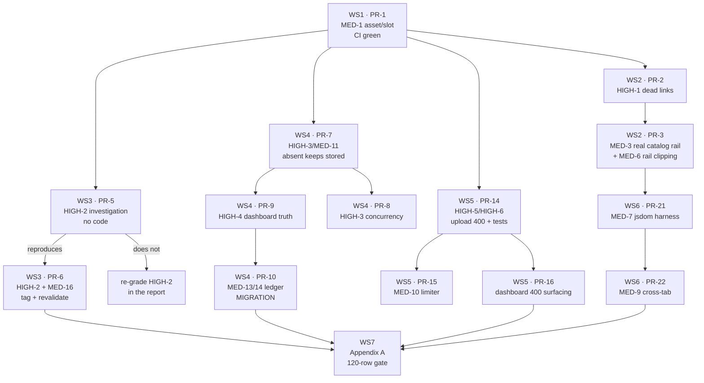

# fix: Commerce audit remediation

## Overview

The source of truth for this plan is `docs/audits/2026-09-22-shop-cart-fullstack-audit.md`
(0 Critical · 6 High · 16 Medium · 13 Low). This plan turns that report into **21 small,
independently reviewable PRs across 7 workstreams**, in the owner's stated priority order.

Nothing here is a new storefront feature and nothing is a visual redesign. Every change
either closes a named finding or adds the coverage that stops it recurring.

Decision labels are **FD-n** (fix decisions). Findings keep the audit's labels
(HIGH-n / MED-n / LOW-n) so the report and this plan can be read side by side.

**No code is written until the owner approves this plan.**

## Already done, before the plan

`apps/storefront/AGENTS.md`'s `## Learnings` section has been **restored** (both 2026-09-21
entries — the Silk Edit campaign-image sizing rule and the product-card grid-column rule).
The file now matches `HEAD` exactly, so there is no deletion left in the tree and nothing
to commit. The other two dirty files are untouched: `next-env.d.ts` (generated) and
`quick-add.tsx` (CRLF only, no content change).

The discontinued `AUDIT-U6-001` row (id 32) in the real `moon_store` dev database is left
alone per instruction. It is inert — `discontinued` products are a real 404 in the catalog.

## Scope Boundaries

- **No new storefront features, no visual redesign.** Where a fix is inside a component
  that was recently redesigned (the Quick Add disc), the change is confined to the defect.
- **No refactor of the parallel effective-price implementations.** The audit's AD-10 found
  the catalog's `??` mapper and POS's SQL `COALESCE` individually guarded by real-PG tests
  and proven equal live; collapsing them would remove a guard.
- **Not fixed, by the audit's own argument:** LOW-11 (no database CHECK on slug shape — the
  application is the only guard, by documented design), L10 / CC-56 (the v2 bag reset —
  documented and argued), LOW-13 (local suite flakiness under parallel contention — an
  artifact, not a defect).
- **The storefront Playwright project is not in this plan.** The audit names it the single
  highest-leverage item, and it deserves its own plan; this plan ends at the manual gate.
- **No ratchet is raised.** Two PRs here may *lower* the lint ratchet; none may raise it.

## Key Decisions

| # | Decision | Rationale |
| --- | --- | --- |
| FD-1 | **One concern per PR, and a PR closes findings from two workstreams only when they share an exact root cause.** | The report's clusters map to different reviewers and different rollback risks. HIGH-3 and MED-11 are the same absent-field defect and travel together; HIGH-3 and HIGH-4 are one problem seen from two ends but land in different apps, so they split. |
| FD-2 | **MED-1 ships first and alone.** | The storefront test job is red on this branch. Every later PR's CI signal is unreadable until it is green, and a red baseline invites overrides. |
| FD-3 | **HIGH-1 is fixed by removing product identity from the editorial mocks (the report's option (a)), not by re-keying their slugs (option (b)).** | The mock set is not a catalogue and cannot track one. Re-keying fixes five instances and leaves the defect class; and a test that relates a mock slug to real catalogue data must cross the app boundary the storefront contract forbids. Removing the href removes the class. |
| FD-4 | **MED-6 is pulled forward out of workstream 6 and ships with MED-3.** | MED-6 is latent *only* because the rail currently renders mocks with no Quick Add. Fixing MED-3 activates the rail's Quick Add, which makes the clipped panel live. Shipping MED-3 alone knowingly ships a broken control on the homepage. |
| FD-5 | **HIGH-2 gets an investigation PR that contains no product code.** | The owner's instruction, and the audit's own caveat: 74 samples over 28 minutes is strong evidence *for `next dev`*. `next build && next start` may take patch-fetch's `isStaticGeneration && entry.isStale` branch and bound the window near 60 s. The fix is sized only after the measurement. |
| FD-6 | **If HIGH-2 reproduces, the fix is cache tagging plus a token-guarded revalidation route — which closes MED-16 in the same change.** | The report's own recommendation. Lowering `revalidate` does **not** fix it: the entry is stale and still served, because Next writes the data cache only on `res.status === 200`, so a 404 revalidation never replaces the entry. |
| FD-7 | **`products.stock` becomes non-authoritative and non-writable for variant products, rather than derived from the variant sum.** | Deriving means every variant write carries a second write and a new consistency invariant to keep. Non-authoritative matches what the sale paths already do — no sale path reads it for a variant product — and the dashboard already has `variant_stock` on the wire (`GET /products` returns it). Lower risk, no new invariant. |
| FD-8 | **Optimistic concurrency on the product form is its own PR, after the absent-keeps-stored PR.** | The absent-field fix is a pure server change with a narrow blast radius. `expected_updated_at` changes the dashboard's request shape and needs a conflict UX, which is a different review. |
| FD-9 | **The upload 400-mapping PR carries its own route-boundary tests.** | HIGH-6 exists *because* the refusals were asserted as multer configuration rather than as HTTP responses. Fixing HIGH-5 without the boundary tests reproduces the exact condition that let it ship. |
| FD-10 | **Appendix A runs once, after all merges, as the final commerce gate — not per PR.** | It is 120 rows and ≈2 h 40 m. Per-PR manual QA is named narrowly in each PR below; the full matrix is the gate. |

## Workstream and PR map

Independent of everything above and mergeable at any time after PR-1: **PR-11** (MED-15),
**PR-17** (MED-2 + LOW-4), **PR-18** (MED-5), **PR-20** (MED-8), **PR-23** (MED-4),
**PR-12** (MED-12 + LOW-2), **PR-13** (LOW-1, migration).

---

# Workstream 1 — Restore storefront CI green

## PR-1 — Bring `silk-edit-campaign` into the editorial slot convention

- **Findings closed:** MED-1.
- **Apps touched:** storefront.
- **Exact root cause:** commit `373b85a` (2026-09-21, this branch) added
  `apps/storefront/assets/editorial/silk-edit-campaign.png` — a `.png`, with a filename in
  neither `editorialSlots` nor `catalogSlots` (`lib/editorial/slots.ts`) — and
  `features/home/data/promo-banner.ts:29` imports it directly by path rather than through
  the slots system. `lib/editorial/assets.test.ts:53`'s "real directory" guard asserts that
  every file under `assets/editorial/` matches a declared slot and is a `.jpg`, so it fails
  with `unexpectedExtensions: ['silk-edit-campaign.png']`.
- **Implementation strategy:** the `.jpg` + registered-slot path, per the owner's preference
  and FD-2. Convert the asset to `.jpg` at the campaign's existing dimensions, declare
  `silk-edit-campaign` in `catalogSlots` with its real aspect ratio, and change
  `promo-banner.ts` to resolve it through the slots helper like every other editorial asset.
  **Check transparency before converting**: inspect the PNG's alpha channel; if it genuinely
  carries transparency the section depends on, stop and raise it rather than flattening —
  in that case the correct change is an explicit named exception in `checkEditorialAssets`,
  which is option (b), not a weakening of the guard. **The guard's rule is not relaxed and
  the test is not edited to pass**; the asset moves to meet it.
- **Migrations:** none.
- **Tests:** `lib/editorial/assets.test.ts` must go 6/6 green unmodified — that is the
  acceptance criterion. Add one assertion that `silk-edit-campaign` resolves through the
  slot helper, so a future direct-path import regresses loudly. Full storefront job
  (`typecheck`, `lint`, `test`, `build`) green.
- **Manual QA:** one look at `/en` and `/ar` at 1440 and 375 confirming the Silk Edit
  campaign section renders identically to before — same crop, same model position, no
  visible quality loss from the format change. This is the whole visual risk.
- **Dependency/order:** **first, and alone.** Everything else depends on a readable CI signal.
- **Rollback risk:** **Low.** Self-contained; revert restores today's state, which is a red
  test and a working page. The only real risk is a visible quality regression from PNG→JPEG
  on a large hero image, which the manual QA step catches before merge.

---

# Workstream 2 — Homepage and catalog correctness

Two PRs, sequenced. PR-2 removes the dead links; PR-3 puts real catalogue data in the rail.
They share root data (`home-products.ts`) so they must not be parallel.

## PR-2 — Editorial mocks stop publishing product links

- **Findings closed:** HIGH-1 (blocking).
- **Apps touched:** storefront.
- **Exact root cause:** `features/products/data/home-products.ts` was authored as static
  editorial content "mirroring the seed catalogue's vocabulary" rather than from the seed's
  real slugs, and nothing ties the two together. `features/products/utils/product-card-model.ts:45`
  (`fromHomeMock`) unconditionally builds `productHref(mock.slug)`. The homepage therefore
  publishes 9 distinct `/[locale]/products/<slug>` links of which **5 are 404**:
  `cross-body-leather-bag`, `silk-blouse`, `embroidered-evening-dress`, `velvet-evening-bag`,
  `wool-tailored-jacket`. Three of the five are Moon Selection tiles
  (`moon-selection.tsx:98` maps `curatedEdit` unconditionally — no flag, no API call, no
  `NODE_ENV` gate), so they sit on the front door of every deploy in both locales.
- **Implementation strategy (FD-3):** make editorial-only imagery structurally incapable of
  carrying a product link.
  1. Remove `slug` from the editorial mock type, or narrow the type so the mock shape and
     the catalog-DTO shape are not interchangeable. The type is the guard: a mock must not
     be assignable anywhere a real product is expected.
  2. `fromHomeMock` stops producing an `href`; the card model gains an explicit
     "editorial, not linked" state that renders the tile as a photograph with its caption
     and no anchor.
  3. The Moon Selection section renders that state. Its tiles keep their names as editorial
     copy if the owner wants them, but they carry no price presented as a catalogue price
     and no link.
  4. Audit every other consumer of `home-products.ts` for the same assumption before
     changing the type (`load-new-arrivals.ts` is the other one and is PR-3's subject).
- **Migrations:** none.
- **Tests:** the existing `home-products.test.ts` asserts `fromHomeMock` builds
  `/products/<slug>` — that assertion inverts to "an editorial mock produces no href".
  Add the **regression coverage the owner asked for**: a test that walks the rendered
  homepage's model output and asserts **every** product href it emits originates in a
  catalog DTO, not in the static set. Because the storefront contract forbids reaching into
  the server's seed, this is a *structural* contract (href ⇒ DTO-sourced), which is exactly
  why FD-3 prefers removing the identity over re-keying slugs — the structural test is
  possible, the cross-app slug test is not.
- **Manual QA:** `/en` and `/ar` — confirm no tile in Moon Selection or the New Arrivals
  fallback is clickable to a product page, and that the sections still read as intentional
  editorial rather than broken cards. Appendix A rows covering the homepage.
- **Dependency/order:** after PR-1. Before PR-3 (shares `home-products.ts`).
- **Rollback risk:** **Low–Medium.** Pure presentation and typing; no data, no API. Medium
  only because it changes what the homepage's most visible sections do on click, so the
  visual review matters. Revert is clean.

## PR-3 — New Arrivals sources real catalogue commerce data (+ MED-6)

- **Findings closed:** MED-3, MED-6 (pulled forward per FD-4).
- **Apps touched:** storefront.
- **Exact root cause (MED-3):** `features/home/api/load-new-arrivals.ts:20,62-65` falls back
  to the static set when fewer than `MIN_PHOTOGRAPHED = 4` products are **photographed**.
  That counts photographs, not products — so a correctly seeded, fully stocked catalogue
  with no images returns zero and a real store with unphotographed inventory falls back
  *permanently*. Live, the rail rendered 8 mocks with hard-coded prices; `long-wool-cardigan`
  read 2,750 EGP on the homepage against the catalogue's 2,400 EGP on its own product page.
  The homepage is prerendered, so the choice **freezes at `next build`** and stays served
  until the next deploy.
- **Exact root cause (MED-6):** `[data-rail]` sets `overflow-x: auto` (`globals.css:893`);
  per the CSS overflow spec a non-visible value on one axis computes the other to `auto`
  (the file's own comment at :891-892 acknowledges this). Quick Add's panel is
  `absolute … top-full` anchored at the photograph's bottom edge, so inside the rail it is
  clipped or turns the rail into a vertical scroller.
- **Implementation strategy:** separate the two questions the fallback currently conflates —
  *did the API answer* versus *are the products photographed*.
  1. With products but no photographs: render the **real** products — real names, real
     prices, real slugs, working links — over the existing placeholder frame
     (`product-image-placeholder.tsx` already exists and is used on cards and PDP).
  2. Keep the static set **only** for "the API cannot answer at all", and per PR-2 it
     carries no hrefs and no prices-as-catalogue-prices by then.
  3. MED-6, in the same PR: render the disclosure panel in a portal/popover layer anchored
     to the disc, or open it upward with `overflow: clip` + `overflow-clip-margin` on the
     rail. Prefer the portal — it is the only option that survives a future scroller change.
- **Migrations:** none.
- **Tests:** unit-test the three branches of the loader (API answered + photographed, API
  answered + unphotographed, API unreachable) and assert the middle branch emits real DTO
  prices and slugs. A test that the fallback branch emits no href (inherited from PR-2).
  MED-6's clipping cannot be unit-tested without a DOM; if PR-21's jsdom harness has landed,
  add a component test, otherwise it goes to Appendix A.
- **Manual QA:** **this is the PR whose manual QA matters most.** On a database with real
  unphotographed products, confirm the rail shows real names/prices/links over placeholders.
  Then, on a database with ≥4 photographed products, open a rail card's Quick Add and
  confirm the panel is fully visible and operable at 1440, 768 and 375, in `en` and `ar` —
  this is the MED-6 acceptance. Appendix A Pass C rows apply.
- **Dependency/order:** after PR-2. Before PR-21 is *not* required, but if PR-21 lands first
  the MED-6 half gains automated coverage.
- **Rollback risk:** **Medium.** It changes what the homepage's commerce rail shows in the
  most common production data state, and the homepage is SSG so a bad build is served until
  the next deploy. Mitigate by verifying the built output (`.next/server/app/en.html`)
  before deploying, not just `next dev`.

---

# Workstream 3 — HIGH-2, the stale purchasable PDP

## PR-5 — Investigation: reproduce Scenario C against a production build (no product code)

- **Findings closed:** none yet — it *sizes* HIGH-2 and either confirms or re-grades it.
- **Apps touched:** none (measurement only; any harness script lives outside the repo or in
  a scratch directory).
- **Exact root cause under test:** Next writes the fetch data cache only when
  `res.status === 200` (`next/dist/server/lib/patch-fetch.js:696`). Once an entry is stale,
  a request-rendered page serves the stale body and starts a background revalidation; that
  revalidation receives the API's 404, so the entry is **never replaced and never evicted**.
  The listing escapes because its own revalidation is still a 200 — the product simply drops
  out of the array. Under `next build && next start` a statically generated route may instead
  take the `isStaticGeneration && entry.isStale` branch and *await* fresh data, which could
  bound the window near 60 s. The PDP route carries no `generateStaticParams`, so which
  branch it takes is not decidable from a dev run.
- **Implementation strategy:**
  1. Stand up the disposable stack exactly as the audit did: API on `moon_store_audit` with
     `MEDIA_LOCAL_ROOT` pointed outside the repository (the #170 rule), then
     `next build && next start` for the storefront — **not** `next dev`.
  2. Run the audit's Scenario C verbatim: request the PDP to populate the entry, set the
     product `inactive` via `PUT /api/v1/products/:id/status`, confirm the API 404s at once,
     then sample the storefront PDP on a fixed interval.
  3. **Measure for longer than the intended cache window** — the audit's dev run was 74
     samples over 28 minutes against a 60 s TTL; match or exceed that so "it healed" and
     "we stopped looking" cannot be confused.
  4. Repeat for `discontinued`, and run the audit's control (a slug never rendered, so no
     cache entry) to keep proving the fault is the pre-existing entry and not the 404 logic.
  5. Record: time-to-first-404, the sample count, and whether any sample was served stale
     **after** a successful background revalidation.
- **Migrations:** none.
- **Tests:** none — this PR writes no product code. Its deliverable is a measurement.
- **Manual QA:** none beyond the measurement itself.
- **Dependency/order:** after PR-1 (so the stack builds green). **Gates PR-6.**
- **Rollback risk:** **None.** No code changes. The only operational care needed is the
  disposable-database and `MEDIA_LOCAL_ROOT` discipline the audit already established.
- **Outcome branch:**
  - **Reproduces** → PR-6 proceeds, HIGH-2 stays High and blocking.
  - **Does not reproduce** (production bounds the window near the TTL) → **do not write the
    cache fix on dev-mode evidence.** Append the measured production behaviour to the audit
    report, re-grade HIGH-2 (likely Medium, non-blocking), and keep only MED-16's escape
    hatch as PR-6's reduced scope. Either way the measurement is recorded in the report so
    the re-grade is auditable.

## PR-6 — Cache tagging and a token-guarded revalidation route *(conditional on PR-5)*

- **Findings closed:** HIGH-2 (if it reproduced), MED-16.
- **Apps touched:** storefront, server.
- **Exact root cause:** `apps/storefront/lib/api/catalog.ts:26-43` passes only
  `next: { revalidate }` and **no `tags`**, and nothing in `apps/storefront` application code
  calls `revalidateTag` or `revalidatePath`. So there is no target to invalidate even if a
  revalidation endpoint existed, and deletion is expressed by the *absence* of a cache entry
  — which is exactly what Next's 200-only cache write cannot represent.
- **Implementation strategy (FD-6):**
  1. Tag catalog fetches: `products`, `product:{slug}`, `collection:{slug}`, `category:{slug}`.
  2. Add a token-guarded `POST /api/revalidate` route to the storefront that accepts a tag
     list and calls `revalidateTag`. Token is server-only, never `NEXT_PUBLIC_`, minimum
     32 bytes, and follows the existing `CATALOG_SERVER_TOKEN` rotation convention
     (comma list, current + next) so it can be rotated without downtime.
  3. Have the server ping it after a catalog-affecting write — at minimum the product status
     write, price write, and collection/category membership writes. The ping is
     **best-effort and non-blocking**: a failed revalidation must never fail the operator's
     dashboard write, and must be logged.
  4. Consider the report's alternative (a) vs (b): tagging is (a). Option (b) — the API
     answering a 200 envelope carrying `{ available: false }` for a withdrawn slug — is a
     public-contract change to the catalog DTO and would touch every consumer; tagging is
     the smaller correct fix. **Do not lower `revalidate` as the fix** (FD-6).
- **Migrations:** none.
- **Tests:** server-side, a test that a status write issues the revalidation call and that a
  revalidation failure does not fail the write. Storefront-side, a test that catalog fetches
  carry the expected tags, and that the revalidate route rejects a missing/wrong token
  (401/403, not 500). **LOW-12 rides along**: the PDP read uses `CATALOG_REVALIDATE.list`
  rather than `.entity`, mis-budgeting its staleness by 5×; correct the constant and assert it.
- **Manual QA:** with a production build running, withdraw a product through the dashboard
  and confirm the PDP 404s **without waiting for the TTL**. Re-run the PR-5 measurement to
  prove the window closed. Also confirm a price correction publishes on demand (MED-16).
- **Dependency/order:** strictly after PR-5, and only on the "reproduces" branch at full
  scope. Should land before the Appendix A gate.
- **Rollback risk:** **Medium.** It adds a new authenticated surface to the storefront and a
  new outbound call on the server's write path. The outbound call is the real risk —
  it must be non-blocking and timeout-bounded, or a slow storefront makes dashboard writes
  slow. Revert restores time-based-only invalidation, which is today's behaviour.

---

# Workstream 4 — Dashboard and server stock truth

Five PRs. They are deliberately split by app and by blast radius (FD-7, FD-8).

## PR-7 — `PUT /products/:id`: absent fields keep stored values

- **Findings closed:** HIGH-3 (the data-loss half), MED-11.
- **Apps touched:** server.
- **Exact root cause:** `apps/server/services/productService.ts:298` `updateProduct` is a
  full-row absolute `UPDATE` with no field-presence handling for the non-storefront columns
  — the storefront text columns already use the `CASE WHEN $n::boolean` pattern, these do
  not. `apps/server/validators/productSchema.ts:25` marks `stock` **required**, so no caller
  can edit any field without also asserting an absolute stock; and `:24`/`:29` put
  `.default(0)` on `cost_price` and `.default(5)` on `min_stock` in a schema shared between
  create (where a default is right) and update (where it silently overwrites stored data).
  Proven live: a name-only edit took `linen-summer-dress` stock 29 → 30, resurrecting a sold
  unit with **no `stock_adjustments` row**, and the same PUT wiped `barcode`
  (6221002001 → NULL, so the barcode lookup 404s) and `distributor_id` (2 → NULL). Separately,
  a valid partial PUT reset `cost_price` 444 → 0 and `min_stock` 9 → 5.
- **Implementation strategy:**
  1. **Split the update schema from the create schema.** The defaults stay on create; on
     update, absence means "keep stored".
  2. Give `stock`, `barcode`, `distributor_id`, `min_stock` and `cost_price` the same
     absent-keeps-stored treatment (`CASE WHEN $n::boolean`) the storefront text fields have.
  3. Make `stock` **optional** on update. It stays writable for now — PR-8 removes the
     lost-update window and PR-9 removes the misleading editor — but a metadata edit must
     be able to omit it entirely.
  4. Update the published `beyondSchema` note so the documented list of fields that survive
     omission matches the code (the drift itself is part of MED-11).
- **Migrations:** none.
- **Tests:** real-PostgreSQL boundary tests (AD-5/AD-6 — HTTP boundary, not the service):
  a name-only PUT leaves `stock`, `barcode`, `distributor_id`, `cost_price`, `min_stock`
  unchanged; an explicit value still writes; an explicit `null` still clears where clearing
  is the documented behaviour. The `bundle_id` lesson applies — test the wire, not the service.
- **Manual QA:** edit a product's name in the dashboard, then confirm in the Inventory list
  that stock, barcode, cost price and min stock are all as they were. Confirm the barcode
  lookup still resolves at the till.
- **Dependency/order:** after PR-1. Before PR-8 and PR-9.
- **Rollback risk:** **Medium.** It changes the semantics of a core write endpoint that the
  dashboard, the bulk import path and any script share. The dashboard's own form always
  sends all fields (`ProductFormDialog.tsx:519-541`), so it is unaffected either way —
  the risk is a non-dashboard caller that *relied* on omission resetting a field, which is
  the defect being fixed. Revert is clean and restores today's (wrong) behaviour.

## PR-8 — Optimistic concurrency on the product form, and audited stock changes

- **Findings closed:** HIGH-3 (the lost-update half).
- **Apps touched:** server, dashboard.
- **Exact root cause:** `updateProduct` has no `expected_updated_at` guard, so the window
  between the form loading and the operator saving is a silent lost-update window — whatever
  sold in between is overwritten by the form's stale value. And an intentional stock change
  through the form bypasses `stockAdjustmentsService.applyDelta`
  (`apps/server/src/modules/inventory/stockAdjustments/repository.ts:57-70`), which is the
  path that records *who* changed stock and *by how much*.
- **Implementation strategy:**
  1. Add `expected_updated_at` to the update contract, returning the repo's existing
     stale-write error shape on mismatch — `collections` already does exactly this
     (`409 COLLECTION_MODIFIED`), so mirror that vocabulary rather than inventing one.
  2. Dashboard: send it from the loaded record and surface the conflict as a real message
     ("this product changed since you opened it — reload"), not a generic toast.
  3. Route any intentional stock change from the form through `applyDelta` so it is audited,
     or — better, and the direction PR-9 takes — stop the form writing stock at all and send
     the operator to the adjust-stock path, which is already audited and already has a UI.
- **Migrations:** none (`updated_at` already exists on `products`).
- **Tests:** a real-PG concurrency test in the existing `tests/concurrency/` style: two
  writers, stale `expected_updated_at` loses with the documented 409 and writes nothing.
  A test that a stock change made through the audited path produces a `stock_adjustments` row.
- **Manual QA:** open the product form, sell the product through POS in another tab, save the
  form — confirm the conflict message appears and nothing was overwritten.
- **Dependency/order:** after PR-7 (which makes `stock` optional, the precondition for
  "the form stops writing stock").
- **Rollback risk:** **Medium.** A new required-ish request field on a core endpoint, plus a
  new failure mode the operator can hit. Ship the server side tolerant (absent
  `expected_updated_at` = today's behaviour) so the dashboard can adopt it without a lockstep
  deploy, then tighten once adopted.

## PR-9 — The dashboard shows the stock number that governs sale

- **Findings closed:** HIGH-4.
- **Apps touched:** dashboard (and a small server confirmation that `variant_stock` is on the
  wire — it already is).
- **Exact root cause:** `products.stock` is dead state for a variant product — no sale path
  writes or reads it — yet `Inventory.tsx:519-531` renders it as the Stock column and
  `:486-493` computes the low-stock badge from it. They agree at seed time only because
  `seed.ts:878` sets `products.stock = SUM(variants.stock)`, and they drift with the first
  variant sale. Proven live: one variant sale left `products.stock` 6, `SUM(variants)` 5 and
  per-size sellable 3/0/2 — three answers for one product at one instant, with the low-stock
  badge silently reading the dead one. Writing `stock: 99` from the form changed nothing a
  shopper can see or buy. The real number appears only as a parenthetical "(5)" in the
  Variants column (`Inventory.tsx:603`).
- **Implementation strategy (FD-7):**
  1. Stock column, low-stock badge and the low-stock notification read
     `has_variants ? variant_stock : stock`. `POS.tsx:204` already does exactly this —
     reuse its expression rather than writing a second one.
  2. **Hide or disable the Stock field on the product form when `has_variants` is true**, with
     a short inline explanation pointing at Manage Variants. This is the "trap" the audit
     names: editing it looks like restocking and does nothing.
  3. Do **not** derive or backfill `products.stock` for variant products (FD-7). It becomes
     non-authoritative and non-writable on that path; the catalog and the quote already read
     the correct column and must not change.
- **Migrations:** none.
- **Tests:** dashboard unit tests for the column and badge expression across the three cases
  (no variants; variants with `variant_stock` < `stock`; variants with `variant_stock` = 0),
  and a test that the Stock field is absent/disabled for a variant product. This slice has
  `Inventory.test.tsx` already, so there is a home for them.
- **Manual QA:** sell a variant through POS, then confirm the Inventory list's Stock column
  and low-stock badge both move, and that the product form offers no editable Stock field for
  that product. Confirm a non-variant product is unchanged in every respect.
- **Dependency/order:** after PR-7. Before PR-10 (the ledger PR assumes the UI already tells
  the truth).
- **Rollback risk:** **Low.** Read-path presentation plus one field's visibility. No schema,
  no write-path change. Revert restores the misleading number.

## PR-10 — `stock_adjustments` gains `variant_id` *(migration)*

- **Findings closed:** MED-13, MED-14.
- **Apps touched:** server, db, dashboard (the adjust-stock dialog gains a variant selector).
- **Exact root cause:** `stock_adjustments` has no `variant_id` column (introspected:
  `id, product_id, previous_qty, new_qty, delta, reason, user_id, created_at`).
  `POST /api/v1/products/:id/adjust-stock` takes `{delta, reason}` and no variant, and
  `applyDelta` issues `UPDATE products SET stock = stock + $1::int`
  (`stockAdjustments/repository.ts:71-78`) — so the one *audited* manual-correction path
  writes the dead column for a variant product. Consequently (MED-14) stock-count and sale
  rows record variant quantities against the product id: both a variant sale and a variant
  count wrote `{product_id:4, previous_qty:4, …}` while `products.stock` was 6 throughout,
  and three variants of one product write rows that look identical.
- **Implementation strategy:**
  1. Migration `018`: add nullable `variant_id` to `stock_adjustments` with a foreign key to
     `product_variants(id)`, plus an index on it. Nullable because existing rows and
     non-variant products legitimately have none. **A `.down.sql` that genuinely reverses it**
     — `verify:migrations` proves this in CI and the repo has no exceptions.
  2. Extend the adjust-stock request, the service branch and the repository to write the
     variant column when a variant is named, mirroring the `stockCounts` branch which already
     gets this right.
  3. Write `variant_id` on **every** variant-sourced adjustment row — sales, stock counts,
     refunds, exchanges — so the ledger reconciles.
  4. Dashboard: `AdjustStockDialog` gains a variant selector for variant products.
  5. **Do not backfill** historic rows: the audit's own note applies — a down migration can
     recreate a table but not its rows, and guessing which variant a historic row meant would
     manufacture false audit data. Document the cutover date instead.
- **Migrations:** **yes — one, `018`, with a real `.down.sql`.** Additive and nullable, so it
  is safe on a populated table.
- **Tests:** migration up/down/re-apply via `verify:migrations`. Real-PG tests that a variant
  adjustment writes the variant column and moves `product_variants.stock` (not
  `products.stock`), and that a variant sale's audit row carries the variant id. A
  reconciliation test: the sum of a variant's adjustment deltas equals its stock movement.
- **Manual QA:** adjust stock on one size of a variant product, confirm the per-size figure
  moves in Manage Variants and the storefront's availability follows; confirm the adjustment
  appears in the ledger naming the size.
- **Dependency/order:** after PR-9. It is the largest PR in this workstream — if review
  drags, it can be split into "migration + server" and "dashboard selector".
- **Rollback risk:** **Medium.** A migration on a table holding financial-adjacent audit
  history. Additive and nullable keeps it low, but the `.down.sql` must be exercised before
  merge, and rolling back after rows carry `variant_id` loses that attribution.

## PR-11 — `price_history` stops recording phantom changes

- **Findings closed:** MED-15.
- **Apps touched:** server.
- **Exact root cause:** `productService.ts:341-356` tests `old.price !== price`, comparing the
  node-postgres NUMERIC **string** `'1950'` against the request's **number** `1950`. That is
  always true, so every product update writes two `price_history` rows even when nothing
  changed. On pg-mem the comparison is number-vs-number and behaves correctly, so no unit
  test catches it — the exact divergence the repo's own Learnings document, in the wild.
- **Implementation strategy:** coerce both sides with `Number()` before comparing (or compare
  in minor units), for both the `price` and `cost_price` comparisons. Two lines.
- **Migrations:** none. **Do not clean historic rows** without the owner's word — the noise is
  identifiable by `old_value === new_value` and deleting audit rows is a separate decision.
- **Tests:** a **real-PostgreSQL** test (AD-5 — a pg-mem green proves nothing here) that an
  unchanged price writes no row and a changed price writes exactly one.
- **Manual QA:** none.
- **Dependency/order:** independent; any time after PR-1.
- **Rollback risk:** **Low.** Two lines, one comparison, covered by a real-PG test.

## PR-12 — Variant dialog validation *(MED-12 + LOW-2)*

- **Findings closed:** MED-12, LOW-2 (partly — the missing test files).
- **Apps touched:** dashboard.
- **Exact root cause:** `VariantManagerDialog.tsx` uses plain `<Input>` throughout — no
  react-hook-form, no `zodResolver`, no `isInvalid`/`errorMessage` wiring — against a slice
  whose own `ProductFormDialog` uses exactly that pattern. `useVariantManagement.ts:86-108`
  coerces with `Number(stock) || 0`, so `"abc"` becomes a silently-accepted **0** before the
  request is built; the server never sees it and the operator is never told. A negative price
  is caught server-side but surfaces as a generic toast with no field highlighted.
- **Implementation strategy:** bind the variant fields with react-hook-form plus a zod schema
  mirroring the server's `variantSchema`, and **parse** stock rather than coercing it so a
  non-numeric entry is a validation error, not a zero. Note the repo Learning: HeroUI's
  `Input` holds its own controlled value, so any programmatically-filled field needs
  `Controller` — this dialog will need it.
- **Migrations:** none.
- **Tests:** the missing `VariantManagerDialog.test.tsx` and `useVariantManagement` coverage
  (LOW-2): non-numeric stock is refused rather than zeroed; a negative or zero price shows an
  inline error; a blank price still sends `price: null` (the NULL-override seam the catalog
  depends on — this must not regress).
- **Manual QA:** create a variant with a blank price and confirm it still inherits the product
  price on the storefront; type nonsense into stock and confirm it is refused inline.
- **Dependency/order:** independent; any time after PR-1.
- **Rollback risk:** **Low.** One dialog, no server change. The one thing to watch is the
  blank-price → `null` path, which the tests pin.

## PR-13 — LOW-1: `??` for the variant-price fallback, and a price CHECK *(migration)*

- **Findings closed:** LOW-1.
- **Apps touched:** dashboard, db.
- **Exact root cause:** `VariantManagerDialog.tsx:142` and `POS.tsx:195` use `||` rather than
  `??` for the variant-price fallback, so a variant deliberately priced at `0` would display
  the product price. Unreachable today — the server's variant schema is `.positive()`, so a
  0 price is a 400 — but `product_variants.price` carries **no CHECK constraint**, so an
  import, a backfill or a restored dump could introduce one, at which point the till and the
  storefront would disagree.
- **Implementation strategy:** `||` → `??` at both sites, and migration `019` adding
  `CHECK (price IS NULL OR price > 0)` to `product_variants`. Check the existing data first;
  if any row violates it, add the constraint `NOT VALID` and record why, following the
  precedent migration `004` set for the stock checks (and the Learning that a later `UPDATE`
  re-checks even a `NOT VALID` constraint).
- **Migrations:** **yes — `019`, with a `.down.sql`.**
- **Tests:** migration verification; a real-PG test that a 0 price is refused at the database
  level as well as at the schema level.
- **Manual QA:** none.
- **Dependency/order:** independent, but sequence its migration number after PR-10's `018`.
- **Rollback risk:** **Low.** Two characters and one additive constraint. Only risk is the
  constraint failing on unexpected legacy data, which the pre-check catches.

---

# Workstream 5 — Uploads

## PR-14 — Multer refusals answer the documented 400 *(HIGH-5 + HIGH-6 together, FD-9)*

- **Findings closed:** HIGH-5, HIGH-6.
- **Apps touched:** server.
- **Exact root cause:** `validateImageBytes` is ordinary middleware and answers its own
  failures, so the magic-byte paths correctly return 400. Multer's own two refusals — the
  `fileSize` limit and the `fileFilter` callback (`apps/server/src/storage/upload.ts:72-84`)
  — are surfaced as errors passed to `next()`, and **nothing in the tree maps `MulterError`
  or `LIMIT_FILE_SIZE` to a status** (a grep across `apps/server/src` returns nothing), so
  they fall through to the shared handler as 500 `INTERNAL_ERROR`. Live: a 4.3 MB PNG and a
  `.gif` both 500 on both image routes, against a published `beyondSchema` contract that says
  "At most 2 MB, JPEG, PNG or WebP". HIGH-6 is why it shipped: `tests/storage.test.ts:263`
  asserts the multer **configuration** — that the limit and allowlist are set — never that a
  request carrying an oversized or `.gif` file receives a particular status;
  `tests/productImages.test.ts:119` covers only the magic-byte path, the one that works.
- **Implementation strategy:** add a handler immediately after the multer middleware on both
  image routes mapping `MulterError LIMIT_FILE_SIZE` to a 400 (or 413) `VALIDATION_ERROR`
  naming the 2 MB ceiling, and the `fileFilter` Error to a 400 `VALIDATION_ERROR` naming the
  accepted formats — using the same `errorResponse` shape `validateImageBytes` already uses
  two lines away. Keep the message specific enough that the dashboard can surface it verbatim.
- **Migrations:** none.
- **Tests (FD-9 — these are not optional and ship in this PR):** route-level cases in
  `productImages.test.ts` posting an oversized buffer and a `.gif`, asserting the status,
  the error code, the message naming the reason, and that **nothing was stored** — alongside
  the existing magic-byte case. Test the boundary, not the configuration.
- **Manual QA:** upload a phone-sized photo (3–5 MB) through the dashboard and confirm the
  error names the size limit rather than "Internal server error".
- **Dependency/order:** after PR-1. Before PR-16.
- **Rollback risk:** **Low.** Additive error mapping on a path that currently 500s; no
  success path changes. Worth confirming the status choice (400 vs 413) matches the repo's
  typed-error contract before merge — the audit's own wording allows either.

## PR-15 — The upload limiter is keyed on the authenticated user

- **Findings closed:** MED-10.
- **Apps touched:** server.
- **Exact root cause:** `apps/server/middleware/upload.ts:136-143` sets `windowMs` 15 min,
  `max` 10 and uses express-rate-limit's **default IP key**, while
  `apps/server/CLAUDE.md` → *Rate-limit bucketing* states the global limiter is keyed on the
  authenticated user precisely because "several tills behind one shop router share one
  address, so an IP-keyed budget is a per-shop budget". The upload limiter never received
  that treatment. Proven live: the same Admin token continued uploading against `127.0.0.1`
  immediately after `::1` was exhausted. A full gallery is 9 uploads against a ceiling of 10,
  and **rejected attempts spend the budget too** — so two oversized photos (see HIGH-5) lock
  the operator out for 15 minutes partway through one product.
- **Implementation strategy:** key it on the authenticated user with the existing key
  generator the global limiter already uses, and raise the ceiling above the per-product
  maximum of 9 — the limit should bound abuse, not ordinary authoring of one product. Also
  make the 429 message say how long the window is, since today it is a bare "try again later".
- **Migrations:** none.
- **Tests:** the existing rate-limit test style (`tests/http/`) — two different users on one
  IP get independent budgets; one user exceeding the ceiling is limited; a full 9-upload
  gallery in one session is not.
- **Manual QA:** author a complete 1 + 8 gallery in one sitting without hitting a 429. This
  is the acceptance criterion the owner named.
- **Dependency/order:** after PR-14 (so a rejected oversized upload is a clean 400 while
  testing the budget). Independent otherwise.
- **Rollback risk:** **Low–Medium.** Loosening a rate limit is a small abuse-surface change;
  keep the ceiling deliberate rather than generous, and keep the window as-is.

## PR-16 — The dashboard tells the operator why an upload failed

- **Findings closed:** the operator-facing half of HIGH-5.
- **Apps touched:** dashboard.
- **Exact root cause:** `ProductGalleryManager.tsx:53-66` `describeFailure` has no branch for
  a 500 — and after PR-14 it will have a specific 400 to surface — so today the operator sees
  only the generic `galleryUploadFailed` toast and is told neither that the file is too large
  nor that resizing would fix it.
- **Implementation strategy:** map the new upload `VALIDATION_ERROR` messages to specific,
  localized guidance (too large → name the 2 MB ceiling and suggest resizing; wrong format →
  name JPEG/PNG/WebP; rate limited → name the wait). Keep a generic fallback for genuine 500s.
- **Migrations:** none.
- **Tests:** dashboard unit tests over `describeFailure` for each status/code branch,
  including the fallback.
- **Manual QA:** the same phone-photo upload as PR-14, from the UI, confirming the toast is
  actionable in both `en` and `ar`.
- **Dependency/order:** strictly after PR-14 (it surfaces what PR-14 starts returning).
- **Rollback risk:** **Low.** Presentation only.

---

# Workstream 6 — Cart and storefront hardening

All of these are non-blocking. They can proceed in parallel with workstreams 4 and 5 once
PR-1 has landed, except where noted.

## PR-17 — `noStore` attaches to the quote *path*, not the method *(MED-2 + LOW-4)*

- **Findings closed:** MED-2, LOW-4, and the guard CC-5 recommends for L5.
- **Apps touched:** server.
- **Exact root cause:** the quote's guard is attached to the method
  (`router.post('/cart/quote', noStore, …)`, `catalog/routes.ts:28-33`), so it never runs for
  any other method. An `OPTIONS` that `cors()` does not short-circuit (no `Origin` header, or
  a non-allowlisted origin) falls through the POST-only handler on a method mismatch, passes
  `createCatalogLimiter` (skipped via `isCartQuotePath`) and `publicCacheOnSuccess(60)`
  (**not** skipped — it is a `router.use`, so it matches `OPTIONS` too), and is answered by
  Express's built-in per-route OPTIONS responder with `200 / Allow: POST` — which, having
  passed through the cache middleware's `writeHead` hook, ships
  `Cache-Control: public, max-age=60` on the pricing endpoint's own URL.
- **Implementation strategy:** attach `noStore` to the path — `router.all('/cart/quote', noStore, …)`
  or an explicit OPTIONS handler — registered **ahead of** `createCatalogLimiter` and
  `publicCacheOnSuccess`, so no method on this path can reach the cache rewrite.
- **Migrations:** none.
- **Tests:** LOW-4's missing coverage — assert `no-store` on `GET`, `HEAD` and `OPTIONS` as
  well as `POST`, and on the error statuses. **Plus the registration-order assertion L5 asks
  for**: a test that walks `router.stack` and asserts the quote's guard is registered before
  the cache middleware. A header assertion alone passes even after someone reorders the file
  — that distinction is the whole point of L5.
- **Manual QA:** none.
- **Dependency/order:** independent; any time after PR-1.
- **Rollback risk:** **Low.** Additive guard on one path, with tests that pin both the header
  and the ordering.

## PR-18 — The Quick Add wrapper stops swallowing card clicks *(MED-5)*

- **Findings closed:** MED-5.
- **Apps touched:** storefront.
- **Exact root cause:** `quick-add.tsx:210` correctly sets `pointer-events-none` on QuickAdd's
  **inner** root — its own comment at :204-206 explains why: "a full-width strip over the
  photograph would otherwise swallow the clicks the card link's overlay is there to take".
  But the **wrapper** `
` that `product-card.tsx:316` renders
  around it is a plain div with default `pointer-events: auto`, `z-index: 10`
  (`globals.css:843`) and `justify-self: stretch`, so its border box is the full card width by
  ~68px (44px disc + 2 × 0.75rem padding), sitting above the title link's `after:absolute
  after:inset-0` overlay. Hit-testing resolves to the wrapper, which has no handler, so the
  click does nothing. The mitigation was written before the wrapper existed; the later
  corner-disc commits added it and it inherits none of it.
- **Implementation strategy:** move `pointer-events: none` onto `[data-card-action='overlay']`
  in `globals.css` — the disc and the panel already re-enable it with `pointer-events-auto` —
  or drop the wrapper's padding and size it to the disc. Prefer the former: one line, and it
  restores the authors' stated intent exactly.
- **Migrations:** none.
- **Tests:** not unit-testable without a DOM. If PR-21 has landed, a component test asserting
  the wrapper is not the hit-test target; otherwise Appendix A rows 44 / 46 / 52.
- **Manual QA:** **required before merge** — MED-5 is `proven-on: code reading only`, and one
  click settles it. Click the lower band of a product photograph on `/en/shop` before and
  after; the product page must open. Repeat in `ar`.
- **Dependency/order:** independent; any time after PR-1. Confirm the defect with Appendix A
  rows 44/46/52 **before** writing the fix, so the change is evidenced.
- **Rollback risk:** **Low.** One CSS declaration. The thing to verify is that the disc and
  its panel remain clickable — they re-enable pointer events themselves, and the manual QA
  covers it.

## PR-20 — The quote guard checks its arithmetic *(MED-8)*

- **Findings closed:** MED-8.
- **Apps touched:** storefront.
- **Exact root cause:** `features/cart/api/quote-cart.ts:79-145` `parseLine` pins index, slug,
  the status vocabulary, product shape, option shape, `unitPrice` finiteness, integer counts
  and a finite `lineTotal` — but never `lineTotal === unitPrice × quantity`, never
  `subtotal === Σ lineTotal`, and never that the returned options correspond to the requested
  ones. A server returning `unitPrice` 2750 with `lineTotal` 1 and `subtotal` 1 would render
  as authoritative. `apps/storefront/CLAUDE.md` → *Cart* → *Quote* says "a wrong price must
  fail, not render", which on its plain reading promises more than the code delivers.
- **Implementation strategy:** add two cheap invariant checks — per-line `lineTotal`, and the
  subtotal against the sum of priced lines — throwing the existing `INVALID_RESPONSE` on
  violation. Mind the money type: compare in minor units or with an exact-decimal comparison,
  not floating point. Then **either** the guard covers the sentence **or** the CLAUDE.md
  sentence is reworded to "malformed" — do not leave the doc overstating the code.
- **Migrations:** none.
- **Tests:** extend `quote-cart.test.ts` — a response whose `lineTotal` disagrees with
  `unitPrice × quantity` throws; one whose subtotal disagrees throws; a correct response still
  parses. Include a decimal case that would fail naive float arithmetic.
- **Manual QA:** none — but confirm no live quote starts failing: run the audit's own happy
  path (a real quote for a NULL-priced and an override-priced variant) against the stack.
- **Dependency/order:** independent; any time after PR-1.
- **Rollback risk:** **Low–Medium.** Low in logic, but it is a *new way for the bag to fail*.
  A rounding mismatch between server and client arithmetic would show as `INVALID_RESPONSE`
  and render nothing — so the decimal handling must be exact, and the live check above is
  not optional.

## PR-21 — A jsdom component harness, and the Quick Add suite *(MED-7)*

- **Findings closed:** MED-7.
- **Apps touched:** storefront.
- **Exact root cause:** the storefront has **zero** component tests
  (`find apps/storefront -name '*.test.tsx'` returns nothing). Every pure rule is well
  covered — 24 named cases in `variant-selection.test.ts` alone — but nothing exercises the
  panel opening, `askFor` moving focus to the first unanswered group, Escape or
  outside-pointerdown closing and restoring focus, the sold-out disc staying focusable, the
  disc's RTL mirroring, or that one press never adds a default silently. The slice's testing
  convention is pure-function-only and composition is verified by owner screenshots — which
  is why the three commits that rewrote this control on this branch changed behaviour no
  suite can regression-check.
- **Implementation strategy:** this is **test infrastructure plus one suite**. Add a jsdom
  environment to the storefront's vitest config (scoped, so the existing DOM-free suites keep
  their environment), then a `QuickAdd` suite over readiness × press × focus. Keep it to the
  one client island whose *behaviour*, not just its model, is the contract — this PR is not a
  mandate to test every component.
- **Migrations:** none.
- **Tests:** it *is* the tests. Acceptance: the storefront CI job stays green and gains the
  new suite; no existing suite changes environment by accident.
- **Manual QA:** none.
- **Dependency/order:** after PR-3 if the rail's Quick Add is in scope for the suite;
  otherwise independent. **Enables PR-22, and gives PR-18 and the MED-6 half of PR-3 a home
  for automated coverage.**
- **Rollback risk:** **Low.** Test-only. The one risk is a config change leaking a DOM
  environment into suites that assume none; scope it explicitly.

## PR-22 — Cross-tab storage sync gains a test *(MED-9)*

- **Findings closed:** MED-9.
- **Apps touched:** storefront.
- **Exact root cause:** `cart-store.ts:156-171,186-203` implements the documented
  last-write-wins cross-tab rule — `attachStorageEvents` runs only for the first subscriber,
  detaches when the last unsubscribes, and treats `event.key === null` as another tab's
  `localStorage.clear()` — and **none of it is asserted anywhere**. The 25 store tests cover
  mutations, hydration and hints only; the subscribe/unsubscribe lifecycle, which is exactly
  where a listener leak or a missed re-attach would live, is unguarded. The suite is
  deliberately DOM-free, and a `storage` event needs a window.
- **Implementation strategy:** with PR-21's jsdom harness in place, dispatch a real
  `StorageEvent` and assert the store re-reads; assert the `key === null` clear path; assert
  the listener attaches on first subscribe and detaches on last unsubscribe. The store already
  accepts an injected `GetCartStorage`, so no production code needs to change.
- **Migrations:** none.
- **Tests:** it is the tests.
- **Manual QA:** none — this PR *removes* an item from the permanent manual list.
- **Dependency/order:** strictly after PR-21.
- **Rollback risk:** **None.** Test-only, no production change.

## PR-23 — A repeated query key resolves the same way on both sides *(MED-4)*

- **Findings closed:** MED-4.
- **Apps touched:** storefront.
- **Exact root cause:** the first-valid rule lives only in the loader path. The server loader
  wraps nuqs in `firstValidValues` (`search-params.ts:133-150`), while the controls island
  calls `useQueryStates(catalogParsers)` directly (`catalog-controls.tsx:114`), which takes
  nuqs's *first occurrence* — so `?sort=best&sort=price-asc` sorts the grid correctly while
  the control renders `newest` as selected. The same divergence applies to `min`, `max`,
  `stock` and `page`. Worse, every control commit is built from `committed` (:123), so the
  next interaction serializes the island's state and **silently discards** the repeated-key
  filter that was actually in effect.
- **Implementation strategy:** move first-valid resolution somewhere both consume — either a
  parser that tolerates a repeated key, or have the server pass resolved params to the island
  and seed `useQueryStates` from them. Prefer the shared parser: one rule, one place, and it
  keeps the island self-sufficient.
- **Migrations:** none.
- **Tests:** extend `search-params.test.ts` for the shared resolution, and assert the island's
  initial state matches the loader's for a repeated key across `sort`, `min`, `max`, `stock`
  and `page`.
- **Manual QA:** load `?sort=best&sort=price-asc`, confirm the control shows `price-asc`, then
  change another filter and confirm the sort survives.
- **Dependency/order:** independent; any time after PR-1.
- **Rollback risk:** **Low.** Reachable only via a hand-written URL with a duplicated key, so
  the blast radius of a mistake is the same narrow path.

---

# Workstream 7 — The final commerce gate

## After every PR above is merged: run Appendix A

- **What:** the audit report's **Appendix A — 120 rows, 11 passes, ≈2 h 40 m**, run by the
  owner against a production build (`next build && next start`), not `next dev`.
- **Why it is the gate:** it is the documented compensation for the absent storefront E2E.
  Nothing in it is re-run by CI, so it is the only evidence that the redesigned Quick Add,
  the drawer's focus behaviour, RTL, zoom, reduced motion and the throttled-network states
  actually work.
- **What changes from the audit's version:** four passes now have specific acceptance
  meaning for this plan's PRs — Pass C rows 44/46/52 settle **MED-5** (and should be run
  *before* PR-18 to evidence the defect, then again after to confirm the fix); the rail rows
  settle **MED-6** after PR-3; Pass J (API stopped) re-checks the bag's failure views after
  PR-20's new `INVALID_RESPONSE` path; and the homepage rows confirm **HIGH-1** and **MED-3**
  together.
- **Rule, carried from the audit:** any row left unrun goes into *Manual QA gaps* with its
  reason. It is never assumed passed.
- **Follow-on, not in this plan:** a storefront Playwright project alongside `pos-parallel`
  and `pos-settings`. The audit names it the single highest-leverage item in the report —
  it is what turns this 2 h 40 m ritual into a gate CI runs. It deserves its own plan.

---

## Sequencing summary

| Order | PR | Findings | Blocking? |
| --- | --- | --- | --- |
| 1 | PR-1 | MED-1 | yes — unblocks every CI signal |
| 2 | PR-2 | HIGH-1 | yes |
| 3 | PR-3 | MED-3, MED-6 | no (but HIGH-1's sibling) |
| 4 | PR-5 | *(measures HIGH-2)* | gates PR-6 |
| 5 | PR-6 | HIGH-2, MED-16, LOW-12 | conditional on PR-5 |
| 6 | PR-7 | HIGH-3 (data loss), MED-11 | no |
| 7 | PR-8 | HIGH-3 (lost update) | no |
| 8 | PR-9 | HIGH-4 | no |
| 9 | PR-10 | MED-13, MED-14 | no — migration |
| 10 | PR-14 | HIGH-5, HIGH-6 | no |
| 11 | PR-15 | MED-10 | no |
| 12 | PR-16 | HIGH-5 (operator half) | no |
| — | PR-11, PR-12, PR-13, PR-17, PR-18, PR-20, PR-21, PR-22, PR-23 | MED-15, MED-12, LOW-2, LOW-1, MED-2, LOW-4, MED-5, MED-8, MED-7, MED-9, MED-4 | no — parallel after PR-1 |
| last | Appendix A | the gate | — |

## Open decisions for the owner

1. **PR-1's format.** If `silk-edit-campaign.png` genuinely needs transparency, the plan
   switches to the named-exception route rather than flattening to `.jpg`. Checked during
   implementation; flagged, not assumed.
2. **PR-2's editorial copy.** Removing the link is settled (FD-3). Whether the Moon Selection
   tiles keep their invented *names* as editorial copy, or take real copy, is an editorial
   call — the plan removes the fake **prices** and **links** either way.
3. **PR-11's historic `price_history` noise.** The fix stops new phantom rows. Deleting the
   existing ones (identifiable by `old_value === new_value`) is a separate decision about
   audit data, deliberately not taken here.
4. **PR-10's numbering.** If another migration lands first, `018`/`019` shift accordingly.

## Risks

| Risk | Mitigation |
| --- | --- |
| A PR merges against a red baseline and its own signal is unreadable. | FD-2: PR-1 first and alone. |
| MED-3 ships and activates a clipped Quick Add on the homepage. | FD-4: MED-6 travels with it in PR-3. |
| HIGH-2's fix is written against dev-mode evidence and solves nothing. | FD-5: PR-5 measures against a production build first, and PR-6 is conditional on it. |
| Lowering `revalidate` is mistaken for a fix. | FD-6, and the report's own analysis: the entry is stale **and still served**; the 404 revalidation never replaces it. |
| A stock-truth PR breaks POS, refunds or exchanges, which the audit proved correct. | Those paths are untouched: PR-7/8 change the product-update contract, PR-9 changes presentation, PR-10 is additive. Every stock PR carries a real-PG test, and the audit's confirmed-correct behaviours are the regression baseline. |
| A migration cannot be reversed. | Repo convention, enforced in CI: every `.sql` has a `.down.sql` and `verify:migrations` proves the round-trip. PR-10 and PR-13 are additive and nullable. |
| The new arithmetic guard makes the bag fail on a rounding difference. | PR-20 compares in minor units and is verified against a live quote before merge. |
| The whole plan drifts into redesign. | Scope Boundaries: every PR closes a named finding and nothing else. |

## Sources

- `docs/audits/2026-09-22-shop-cart-fullstack-audit.md` — the source of truth for every
  finding, root cause, file reference and reproduction in this plan.
- `docs/plans/2026-09-22-001-test-shop-cart-fullstack-audit-plan.md` — the audit's own plan,
  for AD-1..AD-11 and the evidence standards (`proven-on`, real PostgreSQL, HTTP boundary).
- Contracts: `CLAUDE.md`, `apps/server/CLAUDE.md`, `apps/storefront/CLAUDE.md`,
  `apps/dashboard/CLAUDE.md`, `docs/CONVENTIONS.md`.
